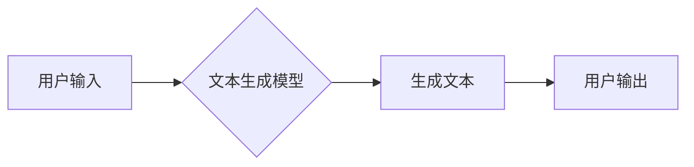

> 自然语言处理，AI内容创作，生成模型，Transformer，BERT，GPT，文本生成，机器学习，深度学习

## 1. 背景介绍

在信息爆炸的时代，内容创作已成为各行各业不可或缺的一部分。从新闻报道到营销文案，从技术文档到文学作品，海量内容的生成和传播推动着社会发展和文化进步。然而，传统的内容创作方式往往面临着效率低下、成本高昂、创意枯竭等问题。

近年来，人工智能（AI）技术突飞猛进，特别是自然语言处理（NLP）领域取得了突破性进展。基于深度学习的生成模型，例如Transformer、BERT和GPT，展现出强大的文本生成能力，为AI内容创作打开了崭新的篇章。

## 2. 核心概念与联系

**2.1 自然语言处理（NLP）**

自然语言处理是人工智能领域的一个重要分支，旨在使计算机能够理解、处理和生成人类语言。NLP的任务包括文本分类、情感分析、机器翻译、问答系统等。

**2.2 生成模型**

生成模型是一种机器学习模型，能够从已有的数据中学习模式，并生成新的数据。在NLP领域，生成模型主要用于文本生成任务，例如文章写作、对话系统、代码生成等。

**2.3 Transformer**

Transformer是一种基于注意力机制的深度学习模型，在NLP领域取得了革命性的进展。它能够捕捉文本中的长距离依赖关系，并实现高效的并行计算，从而在机器翻译、文本摘要、问答系统等任务中取得了优异的性能。

**2.4 BERT**

BERT（Bidirectional Encoder Representations from Transformers）是一种基于Transformer的预训练语言模型，通过双向语言建模的方式学习文本的语义表示。BERT在许多NLP任务中都取得了state-of-the-art的性能，例如文本分类、问答系统、情感分析等。

**2.5 GPT**

GPT（Generative Pre-trained Transformer）是一种基于Transformer的生成语言模型，能够生成流畅、连贯的文本。GPT模型通过大量的文本数据进行预训练，并能够根据输入的提示进行文本生成。

**2.6  Mermaid 流程图**



## 3. 核心算法原理 & 具体操作步骤

### 3.1  算法原理概述

生成模型的核心原理是通过学习数据中的模式，并生成新的数据。常见的生成模型包括：

* **隐马尔可夫模型（HMM）:** 用于序列数据生成，例如语音识别、文本生成。
* **条件随机场（CRF）:** 用于序列标注任务，例如命名实体识别、分词。
* **生成对抗网络（GAN）:** 由生成器和判别器两部分组成，通过对抗训练生成逼真的数据。
* **变分自编码器（VAE）:** 通过编码器和解码器将数据压缩和重建，学习数据的潜在表示。

### 3.2  算法步骤详解

以Transformer为例，其生成文本的步骤如下：

1. **词嵌入:** 将输入的文本单词转换为向量表示。
2. **多头注意力机制:** 计算每个单词与其他单词之间的注意力权重，捕捉文本中的长距离依赖关系。
3. **前馈神经网络:** 对每个单词的注意力表示进行非线性变换，提取更深层的语义信息。
4. **解码器:** 基于编码器的输出，逐个生成文本单词。

### 3.3  算法优缺点

**优点:**

* 能够生成流畅、连贯的文本。
* 能够捕捉文本中的长距离依赖关系。
* 在许多NLP任务中取得了state-of-the-art的性能。

**缺点:**

* 训练成本高，需要大量的计算资源和数据。
* 容易生成不准确或不合理的文本。
* 缺乏对真实世界知识的理解。

### 3.4  算法应用领域

* **文本生成:** 文章写作、故事创作、对话系统、代码生成等。
* **机器翻译:** 将一种语言翻译成另一种语言。
* **文本摘要:** 将长文本压缩成短文本。
* **问答系统:** 回答用户提出的问题。

## 4. 数学模型和公式 & 详细讲解 & 举例说明

### 4.1  数学模型构建

Transformer模型的核心是注意力机制，其数学模型可以表示为：

$$
Attention(Q, K, V) = softmax(\frac{QK^T}{\sqrt{d_k}})V
$$

其中：

* $Q$：查询矩阵
* $K$：键矩阵
* $V$：值矩阵
* $d_k$：键向量的维度
* $softmax$：softmax函数

### 4.2  公式推导过程

注意力机制的目的是计算每个单词与其他单词之间的相关性，并根据相关性分配权重。

1. 计算查询矩阵 $Q$ 与键矩阵 $K$ 的点积，得到一个得分矩阵。
2. 对得分矩阵进行归一化，得到注意力权重矩阵。
3. 将注意力权重矩阵与值矩阵 $V$ 相乘，得到最终的注意力输出。

### 4.3  案例分析与讲解

例如，在翻译句子“The cat sat on the mat”时，注意力机制可以计算每个单词与其他单词之间的相关性。例如，“cat”与“sat”之间的相关性较高，因为它们描述了同一个事件。因此，注意力机制会将更多的权重分配给“cat”和“sat”，从而更好地理解句子的含义。

## 5. 项目实践：代码实例和详细解释说明

### 5.1  开发环境搭建

* Python 3.7+
* TensorFlow 2.0+
* PyTorch 1.0+
* CUDA 10.0+

### 5.2  源代码详细实现

```python
import tensorflow as tf

# 定义Transformer模型
class Transformer(tf.keras.Model):
    def __init__(self, vocab_size, embedding_dim, num_heads, num_layers):
        super(Transformer, self).__init__()
        self.embedding = tf.keras.layers.Embedding(vocab_size, embedding_dim)
        self.transformer_layers = tf.keras.layers.StackedRNNCells([
            tf.keras.layers.MultiHeadAttention(num_heads=num_heads, key_dim=embedding_dim)
            for _ in range(num_layers)
        ])
        self.decoder = tf.keras.layers.Dense(vocab_size)

    def call(self, inputs):
        # 词嵌入
        embedded = self.embedding(inputs)
        # Transformer编码
        encoded = self.transformer_layers(embedded)
        # 解码
        decoded = self.decoder(encoded)
        return decoded

# 实例化模型
model = Transformer(vocab_size=10000, embedding_dim=512, num_heads=8, num_layers=6)

# 训练模型
model.compile(optimizer='adam', loss='sparse_categorical_crossentropy', metrics=['accuracy'])
model.fit(x_train, y_train, epochs=10)
```

### 5.3  代码解读与分析

* **词嵌入:** 将单词转换为向量表示，以便模型理解。
* **Transformer编码:** 使用多头注意力机制和前馈神经网络，捕捉文本中的长距离依赖关系。
* **解码:** 将编码后的文本转换为预测的下一个单词。

### 5.4  运行结果展示

训练完成后，模型能够根据输入的文本提示生成新的文本。例如，输入“The cat sat on the”，模型可以预测输出“mat”。

## 6. 实际应用场景

### 6.1  内容创作

* **文章写作:** 自动生成新闻报道、博客文章、技术文档等。
* **故事创作:** 生成小说、诗歌、剧本等创意内容。
* **营销文案:** 自动生成广告文案、产品描述、社交媒体内容等。

### 6.2  对话系统

* **聊天机器人:** 与用户进行自然流畅的对话。
* **虚拟助手:** 帮助用户完成任务，例如设置提醒、查询信息等。

### 6.3  教育领域

* **智能辅导:** 为学生提供个性化的学习辅导。
* **自动批改:** 自动批改学生的作业和考试。

### 6.4  未来应用展望

* **更个性化的内容创作:** 根据用户的喜好和需求生成个性化的内容。
* **跨语言内容创作:** 实现不同语言之间的内容生成和翻译。
* **多模态内容创作:** 生成包含文本、图像、音频等多种模态的内容。

## 7. 工具和资源推荐

### 7.1  学习资源推荐

* **书籍:**
    * 《深度学习》
    * 《自然语言处理》
    * 《Transformer模型详解》
* **在线课程:**
    * Coursera: 自然语言处理
    * Udacity: 深度学习
    * fast.ai: 深度学习

### 7.2  开发工具推荐

* **TensorFlow:** 开源深度学习框架
* **PyTorch:** 开源深度学习框架
* **Hugging Face:** 提供预训练模型和工具

### 7.3  相关论文推荐

* 《Attention Is All You Need》
* 《BERT: Pre-training of Deep Bidirectional Transformers for Language Understanding》
* 《GPT-3: Language Models are Few-Shot Learners》

## 8. 总结：未来发展趋势与挑战

### 8.1  研究成果总结

近年来，AI内容创作取得了显著进展，生成模型能够生成高质量的文本，并应用于多个领域。

### 8.2  未来发展趋势

* **更强大的生成模型:** 探索新的模型架构和训练方法，提高生成模型的性能和效率。
* **更丰富的模态生成:** 实现文本、图像、音频等多种模态的生成。
* **更强的可解释性:** 研究生成模型的决策过程，提高模型的可解释性和可信度。

### 8.3  面临的挑战

* **数据质量:** 生成模型依赖于高质量的数据，数据偏差和噪声会影响模型性能。
* **伦理问题:** AI内容创作可能引发版权问题、虚假信息传播等伦理问题。
* **公平性:** 确保AI内容创作的公平性和公正性，避免歧视和偏见。

### 8.4  研究展望

未来，AI内容创作将继续朝着更智能、更安全、更可持续的方向发展。研究者需要关注数据质量、伦理问题和公平性等挑战，并探索新的技术和方法，推动AI内容创作的健康发展。

## 9. 附录：常见问题与解答

**Q1: AI内容创作会取代人类作家吗？**

A1: AI内容创作可以辅助人类作家，提高效率和创意，但不会完全取代人类作家。人类作家拥有情感、想象力和创造力，这些是AI难以替代的。

**Q2: AI内容创作的文本质量如何？**

A2: AI内容创作的文本质量不断提高，但仍然存在一些问题，例如语法错误、逻辑混乱等。随着技术的进步，AI内容创作的文本质量将进一步提升。

**Q3: 如何确保AI内容创作的安全性？**

A3: 需要采取措施防止AI内容创作被用于生成虚假信息、恶意内容等。例如，可以开发检测机制，识别AI生成的文本，并制定相关法律法规，规范AI内容创作的应用。


作者：禅与计算机程序设计艺术 / Zen and the Art of Computer Programming 
<end_of_turn>