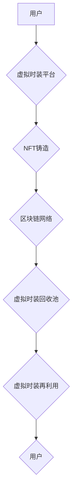

> 虚拟时装、NFT、区块链、时尚回收、可持续发展、数字孪生、人工智能

## 1. 背景介绍

时尚产业是全球经济的重要组成部分，但同时也面临着严峻的环境挑战。传统服装生产和消费模式导致大量资源浪费和污染，对环境造成巨大压力。近年来，随着数字技术的快速发展，虚拟时装的概念逐渐兴起，为时尚产业的可持续发展提供了新的思路。

虚拟时装是指存在于数字世界中的服装，可以穿戴在虚拟形象上，例如游戏角色、社交媒体头像等。与传统服装不同，虚拟时装不需要实体生产，因此可以有效减少资源消耗和环境污染。

## 2. 核心概念与联系

虚拟时装回收系统旨在建立一个基于区块链和NFT技术的平台，实现虚拟时装的回收和再利用。

**核心概念：**

* **虚拟时装 (Virtual Fashion):** 存在于数字世界中的服装，通常以数字资产的形式存在，例如NFT。
* **NFT (Non-Fungible Token):** 不可替代的代币，可以代表虚拟资产的唯一所有权。
* **区块链 (Blockchain):** 分布式账本技术，可以确保数据安全和透明。

**系统架构：**



**系统流程：**

1. 用户在虚拟时装平台上购买或获得虚拟时装。
2. 平台将虚拟时装铸造成NFT，并将其存储在区块链网络中。
3. 用户可以选择将不再使用的虚拟时装发送到虚拟时装回收池。
4. 平台将回收的虚拟时装进行再利用，例如：
    * 将其拆解成可重复使用的素材。
    * 将其用于创作新的虚拟时装。
    * 将其作为奖励赠送给用户。

## 3. 核心算法原理 & 具体操作步骤

### 3.1  算法原理概述

虚拟时装回收系统的核心算法主要包括：

* **虚拟时装识别算法:** 用于识别和分类不同类型的虚拟时装。
* **虚拟时装价值评估算法:** 用于评估虚拟时装的价值，例如稀有度、美观度、实用性等。
* **虚拟时装再利用算法:** 用于将回收的虚拟时装进行再利用，例如拆解、重组、创作等。

### 3.2  算法步骤详解

**虚拟时装识别算法:**

1. 使用计算机视觉技术对虚拟时装进行图像识别。
2. 基于图像特征，例如颜色、形状、纹理等，对虚拟时装进行分类。
3. 利用机器学习算法，不断学习和优化识别精度。

**虚拟时装价值评估算法:**

1. 收集虚拟时装的市场数据，例如交易价格、用户评价等。
2. 建立虚拟时装价值评估模型，例如线性回归、神经网络等。
3. 根据模型预测，评估虚拟时装的价值。

**虚拟时装再利用算法:**

1. 将回收的虚拟时装拆解成可重复使用的素材，例如颜色、形状、纹理等。
2. 利用设计软件，将素材重新组合，创作新的虚拟时装。
3. 基于用户需求，定制化设计虚拟时装。

### 3.3  算法优缺点

**优点:**

* 提高虚拟时装的利用率，减少资源浪费。
* 促进虚拟时装的循环经济发展。
* 为用户提供更便捷的虚拟时装管理方式。

**缺点:**

* 算法识别和评估的准确性需要不断提高。
* 虚拟时装再利用的创意和技术需要不断创新。

### 3.4  算法应用领域

虚拟时装回收系统的核心算法可以应用于以下领域：

* **虚拟服装设计:** 利用算法分析流行趋势，生成新的虚拟时装设计。
* **虚拟服装定制:** 根据用户需求，利用算法定制化设计虚拟时装。
* **虚拟服装交易:** 利用算法评估虚拟时装价值，促进虚拟服装交易。

## 4. 数学模型和公式 & 详细讲解 & 举例说明

### 4.1  数学模型构建

虚拟时装价值评估模型可以采用以下数学模型：

$$
V = w_1 \cdot S + w_2 \cdot R + w_3 \cdot U + w_4 \cdot P
$$

其中：

* $V$：虚拟时装价值
* $S$：虚拟时装稀有度
* $R$：虚拟时装美观度
* $U$：虚拟时装实用性
* $P$：虚拟时装市场价格
* $w_1$, $w_2$, $w_3$, $w_4$：权重系数

### 4.2  公式推导过程

权重系数的确定可以通过专家打分、用户投票等方式进行。

稀有度、美观度、实用性等指标可以通过图像识别、文本分析等技术进行量化。

市场价格可以通过数据分析获取。

### 4.3  案例分析与讲解

假设有一款虚拟时装，其稀有度为5，美观度为8，实用性为6，市场价格为100。

如果权重系数分别为0.2, 0.3, 0.3, 0.2，则其价值为：

$$
V = 0.2 \cdot 5 + 0.3 \cdot 8 + 0.3 \cdot 6 + 0.2 \cdot 100 = 1 + 2.4 + 1.8 + 20 = 25.2
$$

## 5. 项目实践：代码实例和详细解释说明

### 5.1  开发环境搭建

虚拟时装回收系统可以使用以下开发环境搭建：

* **操作系统:** Windows, macOS, Linux
* **编程语言:** Python, JavaScript
* **框架:** Django, React
* **区块链平台:** Ethereum, Polygon

### 5.2  源代码详细实现

以下是一个简单的虚拟时装识别算法的Python代码示例：

```python
import cv2
import numpy as np

# 加载预训练模型
model = cv2.dnn.readNet("yolov3.weights", "yolov3.cfg")

# 读取图像
image = cv2.imread("virtual_fashion.jpg")

# 获取图像尺寸
height, width, _ = image.shape

# 创建blob
blob = cv2.dnn.blobFromImage(image, 1/255, (416, 416), (0, 0, 0), True, crop=False)

# 设置输入
model.setInput(blob)

# 获取输出
output_layers_names = model.getUnconnectedOutLayersNames()
outputs = model.forward(output_layers_names)

# 提取检测结果
boxes = []
confidences = []
class_ids = []

for output in outputs:
    for detection in output:
        scores = detection[5:]
        class_id = np.argmax(scores)
        confidence = scores[class_id]
        if confidence > 0.5:
            center_x = int(detection[0] * width)
            center_y = int(detection[1] * height)
            w = int(detection[2] * width)
            h = int(detection[3] * height)
            x = int(center_x - w / 2)
            y = int(center_y - h / 2)
            boxes.append([x, y, w, h])
            confidences.append(float(confidence))
            class_ids.append(class_id)

# 应用非极大值抑制
indexes = cv2.dnn.NMSBoxes(boxes, confidences, 0.5, 0.4)

# 绘制检测结果
for i in range(len(boxes)):
    if i in indexes:
        x, y, w, h = boxes[i]
        label = str(class_ids[i])
        color = (0, 255, 0)
        cv2.rectangle(image, (x, y), (x + w, y + h), color, 2)
        cv2.putText(image, label, (x, y - 10), cv2.FONT_HERSHEY_SIMPLEX, 0.5, color, 2)

# 显示图像
cv2.imshow("Virtual Fashion Detection", image)
cv2.waitKey(0)
```

### 5.3  代码解读与分析

该代码示例使用YOLOv3模型进行虚拟时装识别。

首先，加载预训练模型和读取图像。

然后，将图像转换为blob格式，并输入到模型中。

模型输出检测结果，包括检测框、置信度和类别ID。

通过非极大值抑制算法，去除冗余的检测框。

最后，绘制检测结果并显示图像。

### 5.4  运行结果展示

运行该代码示例后，将显示包含虚拟时装检测结果的图像。

## 6. 实际应用场景

虚拟时装回收系统可以应用于以下实际场景：

* **虚拟服装电商平台:** 允许用户回收不再使用的虚拟服装，并获得相应的奖励。
* **虚拟游戏:** 提供虚拟服装回收功能，减少游戏内资源浪费。
* **虚拟社交平台:** 允许用户回收虚拟头像服装，并进行再利用。

### 6.4  未来应用展望

随着虚拟现实、增强现实等技术的不断发展，虚拟时装将成为时尚产业的重要组成部分。虚拟时装回收系统将发挥越来越重要的作用，促进虚拟时装的循环经济发展，推动时尚产业的可持续发展。

## 7. 工具和资源推荐

### 7.1  学习资源推荐

* **区块链技术:**
    * Ethereum 官方文档: https://ethereum.org/en/developers/docs/
    * Polygon 官方文档: https://polygon.technology/docs/
* **NFT 技术:**
    * OpenSea 官方文档: https://opensea.io/docs
    * Rarible 官方文档: https://rarible.com/docs
* **虚拟时装设计:**
    * Decentraland 官方文档: https://docs.decentraland.org/
    * Sandbox 官方文档: https://docs.sandbox.game/

### 7.2  开发工具推荐

* **区块链开发工具:**
    * Truffle Suite: https://trufflesuite.com/
    * Hardhat: https://hardhat.org/
* **NFT 开发工具:**
    * OpenZeppelin: https://openzeppelin.com/
    * Ethers.js: https://docs.ethers.io/
* **虚拟时装设计工具:**
    * Blender: https://www.blender.org/
    * Maya: https://www.autodesk.com/products/maya/overview

### 7.3  相关论文推荐

* **虚拟时装的市场潜力和发展趋势:**
    * "The Metaverse and Fashion: A New Era of Digital Style"
* **虚拟时装回收系统的技术实现:**
    * "A Blockchain-Based System for Virtual Fashion Recycling"
* **虚拟时装的社会影响:**
    * "The Social Impact of Virtual Fashion"

## 8. 总结：未来发展趋势与挑战

### 8.1  研究成果总结

虚拟时装回收系统是一个具有重要意义的创新项目，它可以有效解决虚拟时装的资源浪费问题，促进虚拟时装的循环经济发展。

### 8.2  未来发展趋势

未来，虚拟时装回收系统将朝着以下方向发展：

* **更智能的算法:** 利用人工智能技术，开发更智能的虚拟时装识别、评估和再利用算法。
* **更完善的平台:** 建立更完善的虚拟时装回收平台，提供更丰富的功能和服务。
* **更广泛的应用:** 将虚拟时装回收系统应用到更多领域，例如虚拟游戏、虚拟社交平台