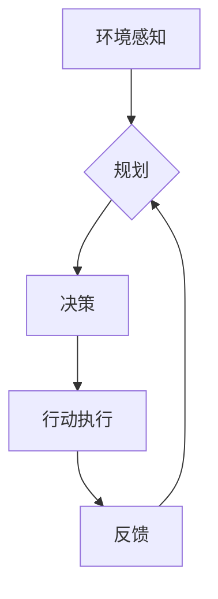

> 行动，环境感知，规划，决策，人工智能，机器学习，强化学习，机器人

## 1. 背景介绍

在人工智能领域，"行动"的概念至关重要。它代表着智能体与环境的交互方式，是实现智能体目标的关键步骤。从简单的机器人导航到复杂的医疗诊断，行动都是人工智能系统的核心功能。

传统的编程方法依赖于预先定义的规则和流程，而人工智能系统则需要能够根据环境变化做出动态的决策。因此，理解和实现智能体的行动机制成为人工智能研究的重要课题。

## 2. 核心概念与联系

**2.1 环境感知 (Environmental Perception)**

环境感知是指智能体获取环境信息的能力。这包括通过传感器收集数据，并对数据进行分析和理解。例如，机器人可以通过摄像头、激光雷达等传感器感知周围环境的物体、位置和运动状态。

**2.2 规划 (Planning)**

规划是指智能体根据环境信息和目标，制定行动序列的过程。这需要考虑各种因素，例如时间、资源、风险等。规划算法可以帮助智能体找到最优或可接受的行动方案。

**2.3 决策 (Decision Making)**

决策是指智能体在规划阶段选择特定行动的过程。这通常涉及对多个行动方案进行评估，并根据预设的价值函数或策略选择最优方案。

**2.4 行动执行 (Action Execution)**

行动执行是指智能体根据决策指令，执行相应的物理动作或逻辑操作。这可能涉及控制机器人的运动、发送网络请求、修改数据库等。

**2.5 反馈 (Feedback)**

反馈是指环境对智能体行动的响应。这可以是直接的物理反馈，也可以是间接的信号，例如传感器数据变化。反馈信息可以帮助智能体评估行动效果，并进行后续的规划和决策调整。

**Mermaid 流程图**



## 3. 核心算法原理 & 具体操作步骤

**3.1 算法原理概述**

行动算法的核心是将环境感知信息转化为有效的行动指令。常用的算法包括：

* **基于规则的系统:** 使用预先定义的规则和条件来决定行动。
* **基于模型的系统:** 建立环境模型，并通过模拟和预测来规划行动。
* **强化学习:** 通过与环境交互，学习最优行动策略。

**3.2 算法步骤详解**

以强化学习为例，其核心步骤如下：

1. **环境建模:** 建立环境模型，包括状态空间、动作空间和奖励函数。
2. **策略学习:** 使用强化学习算法，例如Q学习或深度强化学习，学习最优行动策略。
3. **行动执行:** 根据学习到的策略，选择最优行动并执行。
4. **反馈收集:** 收集环境反馈，包括奖励和状态变化。
5. **策略更新:** 根据反馈信息，更新策略参数，以提高行动效果。

**3.3 算法优缺点**

* **基于规则的系统:** 优点是易于理解和实现，缺点是难以处理复杂环境和变化情况。
* **基于模型的系统:** 优点是能够处理复杂环境，缺点是模型构建和维护成本高。
* **强化学习:** 优点是能够学习最优策略，缺点是训练时间长，需要大量数据和计算资源。

**3.4 算法应用领域**

行动算法广泛应用于各种领域，例如：

* **机器人控制:** 导航、抓取、协作等。
* **游戏人工智能:** 策略决策、对手模仿等。
* **自动驾驶:** 路径规划、避障、决策控制等。
* **医疗诊断:** 辅助医生诊断疾病、制定治疗方案等。

## 4. 数学模型和公式 & 详细讲解 & 举例说明

**4.1 数学模型构建**

我们可以用马尔可夫决策过程 (MDP) 来建模智能体的行动过程。

MDP 由以下要素组成：

* 状态空间 (S): 环境可能存在的各种状态。
* 动作空间 (A): 智能体可以执行的各种动作。
* 转移概率 (P): 从一个状态执行一个动作后转移到另一个状态的概率。
* 奖励函数 (R): 智能体在某个状态执行某个动作后获得的奖励。
* 策略 (π): 智能体在每个状态选择动作的策略。

**4.2 公式推导过程**

强化学习的目标是学习一个最优策略，使得智能体在与环境交互的过程中获得最大的总奖励。常用的算法，例如Q学习，通过迭代更新Q值来实现这一目标。

Q值表示从某个状态执行某个动作后获得的期望奖励。Q值更新公式如下：

$$Q(s, a) = Q(s, a) + \alpha [r + \gamma \max_{a'} Q(s', a') - Q(s, a)]$$

其中：

* $Q(s, a)$ 是状态 $s$ 执行动作 $a$ 的Q值。
* $\alpha$ 是学习率，控制着Q值更新的步长。
* $r$ 是从状态 $s$ 执行动作 $a$ 后获得的奖励。
* $\gamma$ 是折扣因子，控制着未来奖励的权重。
* $s'$ 是执行动作 $a$ 后转移到的下一个状态。
* $a'$ 是在下一个状态 $s'$ 执行的动作。

**4.3 案例分析与讲解**

例如，训练一个机器人学会在迷宫中导航。我们可以将迷宫视为状态空间，机器人可以执行的行动包括向上、向下、向左、向右。奖励函数可以设计为，到达终点获得最大奖励，迷宫中其他位置获得较小的奖励。通过强化学习算法，机器人可以学习最优的导航策略，从而在迷宫中找到最短路径到达终点。

## 5. 项目实践：代码实例和详细解释说明

**5.1 开发环境搭建**

* Python 3.x
* TensorFlow 或 PyTorch
* OpenAI Gym

**5.2 源代码详细实现**

```python
import gym
import numpy as np

# 定义环境
env = gym.make('CartPole-v1')

# 定义学习率和折扣因子
alpha = 0.1
gamma = 0.99

# 定义Q值表
q_table = np.zeros((env.observation_space.n, env.action_space.n))

# 训练循环
for episode in range(1000):
    # 初始化状态
    state = env.reset()

    # 训练一个回合
    done = False
    while not done:
        # 选择动作
        action = np.argmax(q_table[state])

        # 执行动作
        next_state, reward, done, _ = env.step(action)

        # 更新Q值
        q_table[state, action] = q_table[state, action] + alpha * (reward + gamma * np.max(q_table[next_state]) - q_table[state, action])

        # 更新状态
        state = next_state

    # 打印进度
    print(f"Episode {episode+1} done")

# 测试
state = env.reset()
while True:
    # 选择动作
    action = np.argmax(q_table[state])

    # 执行动作
    next_state, reward, done, _ = env.step(action)

    # 显示环境
    env.render()

    # 更新状态
    state = next_state

    # 如果回合结束，则退出循环
    if done:
        break

env.close()
```

**5.3 代码解读与分析**

这段代码实现了基于Q学习的CartPole环境训练。

* 首先，定义了环境和学习参数。
* 然后，创建了一个Q值表，用于存储每个状态和动作的Q值。
* 训练循环中，通过采样策略选择动作，执行动作，并根据奖励和下一个状态更新Q值。
* 训练完成后，可以测试训练好的模型。

**5.4 运行结果展示**

运行代码后，可以观察到机器人能够在CartPole环境中保持平衡，并持续一段时间。

## 6. 实际应用场景

**6.1 机器人控制**

* **导航:** 机器人根据环境地图和目标位置规划路径，并执行相应的运动指令。
* **抓取:** 机器人根据目标物体的形状和位置，选择合适的抓取方式和动作。
* **协作:** 多个机器人协同工作，完成复杂的任务，例如组装产品或清理环境。

**6.2 游戏人工智能**

* **策略决策:** 游戏角色根据游戏规则和环境信息，做出最优的行动策略，例如在策略游戏中选择最佳的进攻或防守策略。
* **对手模仿:** 游戏人工智能可以学习人类玩家的策略，并模仿他们的行为，从而提高游戏的挑战性。

**6.3 自动驾驶**

* **路径规划:** 自动驾驶汽车根据道路信息和交通状况，规划最优的行驶路径。
* **避障:** 自动驾驶汽车识别周围障碍物，并采取避障措施，例如减速或转向。
* **决策控制:** 自动驾驶汽车根据环境信息和驾驶规则，做出决策，例如加速、减速、转向等。

**6.4 医疗诊断**

* **辅助诊断:** 医疗人工智能可以分析患者的病历、影像数据等信息，辅助医生诊断疾病。
* **制定治疗方案:** 医疗人工智能可以根据患者的病情和个人特征，制定个性化的治疗方案。

**6.4 未来应用展望**

随着人工智能技术的不断发展，行动算法将在更多领域得到应用，例如：

* **个性化教育:** 根据学生的学习情况，定制个性化的学习计划和教学内容。
* **智能家居:** 智能家居设备可以根据用户的需求和习惯，自动执行各种操作，例如调节温度、控制灯光等。
* **金融交易:** 智能交易系统可以根据市场数据和交易规则，自动进行股票交易等操作。

## 7. 工具和资源推荐

**7.1 学习资源推荐**

* **书籍:**
    * 《Reinforcement Learning: An Introduction》 by Richard S. Sutton and Andrew G. Barto
    * 《Artificial Intelligence: A Modern Approach》 by Stuart Russell and Peter Norvig
* **在线课程:**
    * Coursera: Reinforcement Learning Specialization
    * Udacity: Intro to Artificial Intelligence
* **博客和网站:**
    * OpenAI Blog
    * DeepMind Blog

**7.2 开发工具推荐**

* **Python:** 广泛用于人工智能开发，拥有丰富的库和工具。
* **TensorFlow:** 深度学习框架，用于构建和训练神经网络模型。
* **PyTorch:** 深度学习框架，以其灵活性和易用性而闻名。
* **OpenAI Gym:** 机器人控制和强化学习环境库。

**7.3 相关论文推荐**

* **Deep Reinforcement Learning with Double Q-learning**
* **Proximal Policy Optimization Algorithms**
* **Asynchronous Methods for Deep Reinforcement Learning**

## 8. 总结：未来发展趋势与挑战

**8.1 研究成果总结**

近年来，行动算法取得了显著进展，例如：

* 强化学习算法取得了突破性进展，在各种任务中表现出色。
* 深度强化学习结合深度神经网络，能够学习更复杂的策略。
* 算法效率和鲁棒性不断提高，能够应用于更复杂的环境。

**8.2 未来发展趋势**

* **更强大的模型:** 研究更强大的深度学习模型，能够学习更复杂的策略和应对更复杂的环境。
* **迁移学习:** 研究如何将已学习的知识迁移到新的任务和环境中，提高算法的泛化能力。
* **安全性和可解释性:** 研究如何提高行动算法的安全性和可解释性，使其能够在现实世界中安全可靠地应用。

**8.3 面临的挑战**

* **数据需求:** 强化学习算法需要大量数据进行训练，获取高质量的数据仍然是一个挑战。
* **计算资源:** 训练大型深度学习模型需要大量的计算资源，成本较高。
* **安全性和伦理:** 行动算法的应用可能