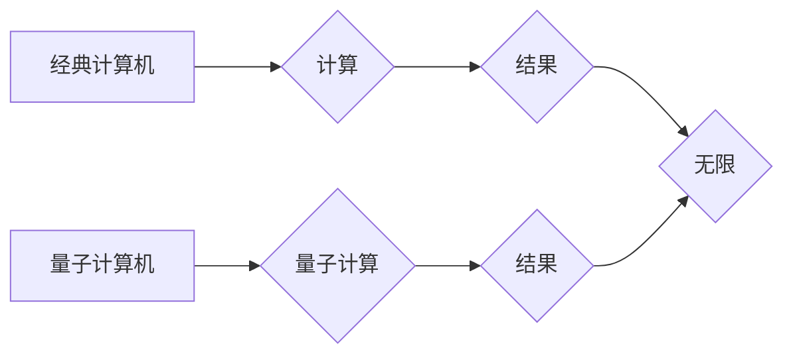

> 量子计算，量子位，叠加态，纠缠态，量子算法，量子霸权，量子计算机

## 1. 背景介绍

随着摩尔定律的放缓，传统计算机的计算能力发展逐渐遇到瓶颈。为了突破这一瓶颈，科学家们开始探索新的计算 paradigms，其中量子计算作为一种革命性的计算模式，备受关注。

量子计算利用量子力学原理，以量子位（qubit）为基本单元，通过叠加态和纠缠态等量子现象，实现超越经典计算机的计算能力。量子计算机具有以下特点：

* **叠加态：** 量子位可以同时处于0和1的叠加态，相比经典位只能处于0或1，量子位拥有指数级的存储能力。
* **纠缠态：** 两个或多个量子位可以纠缠在一起，即使相隔很远，它们的状态也相互关联，这使得量子计算能够并行处理大量信息。
* **量子算法：** 量子算法利用量子现象的特性，可以解决一些经典算法无法解决的问题，例如破解大整数加密、药物发现、材料科学等。

## 2. 核心概念与联系

**2.1 量子位（Qubit）**

量子位是量子计算的基本单元，与经典计算机中的比特不同，量子位可以处于0、1或0和1的叠加态。

**2.2 叠加态**

叠加态是指量子位同时处于多个状态的叠加，例如，一个量子位可以同时处于0和1的叠加态。

**2.3 纠缠态**

纠缠态是指两个或多个量子位相互关联，即使相隔很远，它们的状态也相互影响。

**2.4 量子算法**

量子算法利用量子现象的特性，例如叠加态和纠缠态，可以解决一些经典算法无法解决的问题。

**2.5 量子计算机**

量子计算机是一种利用量子力学原理进行计算的计算机，它使用量子位作为基本单元，并通过量子门操作实现计算。

**2.6 量子霸权**

量子霸权是指量子计算机在某些特定问题上超越经典计算机的计算能力，例如破解大整数加密。

**Mermaid 流程图**



## 3. 核心算法原理 & 具体操作步骤

### 3.1  算法原理概述

量子算法的原理基于量子力学中的叠加态和纠缠态。通过设计特定的量子门操作，可以将量子位从初始状态变换到目标状态，从而实现计算。

### 3.2  算法步骤详解

1. **初始化量子位：** 将量子位置于初始状态，例如|0⟩或|1⟩。
2. **量子门操作：** 使用特定的量子门操作，例如Hadamard门、CNOT门等，对量子位进行操作，实现量子态的变换。
3. **叠加态和纠缠态：** 通过量子门操作，可以将量子位置于叠加态或纠缠态，从而实现并行计算。
4. **测量量子位：** 在计算结束时，测量量子位，得到计算结果。

### 3.3  算法优缺点

**优点：**

* **指数级加速：** 量子算法可以对某些问题进行指数级加速，例如 Shor 算法可以高效地分解大整数。
* **解决经典算法无法解决的问题：** 量子算法可以解决一些经典算法无法解决的问题，例如模拟复杂量子系统。

**缺点：**

* **技术难度高：** 量子计算机的构建和控制技术非常复杂，需要克服许多技术挑战。
* **易受环境影响：** 量子态非常脆弱，容易受到环境噪声的影响，需要进行纠错操作。

### 3.4  算法应用领域

* **密码学：** 量子算法可以破解现有的加密算法，例如 RSA 算法，因此需要开发新的量子安全的加密算法。
* **药物发现：** 量子模拟可以帮助研究人员模拟药物分子与蛋白质的相互作用，从而加速药物发现过程。
* **材料科学：** 量子模拟可以帮助研究人员设计新的材料，例如超导材料和半导体材料。
* **金融建模：** 量子算法可以用于优化投资组合、预测市场趋势等金融建模任务。

## 4. 数学模型和公式 & 详细讲解 & 举例说明

### 4.1  数学模型构建

量子计算的数学模型基于线性代数和希尔伯特空间。

* **量子态：** 量子态可以用一个向量来表示，这个向量被称为状态向量。
* **量子门：** 量子门是一种线性变换，它可以将一个量子态变换到另一个量子态。
* **叠加态：** 叠加态可以用一个线性组合来表示，例如：

$$
|\psi\rangle = \alpha |0\rangle + \beta |1\rangle
$$

其中，α和β是复数系数，满足 $|\alpha|^2 + |\beta|^2 = 1$。

* **纠缠态：** 纠缠态是指两个或多个量子位相互关联，它们的量子态不能用独立的量子态来表示。

### 4.2  公式推导过程

量子门操作可以用矩阵来表示。例如，Hadamard门可以表示为：

$$
H = \frac{1}{\sqrt{2}} \begin{pmatrix} 1 & 1 \\ 1 & -1 \end{pmatrix}
$$

CNOT门可以表示为：

$$
CNOT = \begin{pmatrix} 1 & 0 & 0 & 0 \\ 0 & 1 & 0 & 0 \\ 0 & 0 & 0 & 1 \\ 0 & 0 & 1 & 0 \end{pmatrix}
$$

### 4.3  案例分析与讲解

**Shor 算法**

Shor 算法是一种量子算法，可以高效地分解大整数。它利用量子叠加态和量子纠缠态，可以将整数分解问题转换为一个可被量子计算机高效解决的问题。

## 5. 项目实践：代码实例和详细解释说明

### 5.1  开发环境搭建

* **量子计算平台：** IBM Quantum Experience、Google Quantum AI、Microsoft Azure Quantum等。
* **编程语言：** Python、Qiskit、Cirq等。

### 5.2  源代码详细实现

```python
from qiskit import QuantumCircuit, Aer, execute

# 创建一个量子电路
qc = QuantumCircuit(2)

# 应用 Hadamard 门
qc.h(0)

# 应用 CNOT 门
qc.cx(0, 1)

# 测量量子位
qc.measure([0, 1], [0, 1])

# 模拟量子电路
simulator = Aer.get_backend('qasm_simulator')
job = execute(qc, simulator, shots=1024)
result = job.result()
counts = result.get_counts(qc)

# 打印结果
print(counts)
```

### 5.3  代码解读与分析

这段代码实现了一个简单的量子电路，它应用了 Hadamard 门和 CNOT 门，并测量了量子位的状态。

### 5.4  运行结果展示

运行结果会显示出测量到的量子态的频率分布。

## 6. 实际应用场景

### 6.1  密码学

量子计算机可以破解现有的加密算法，例如 RSA 算法，因此需要开发新的量子安全的加密算法。

### 6.2  药物发现

量子模拟可以帮助研究人员模拟药物分子与蛋白质的相互作用，从而加速药物发现过程。

### 6.3  材料科学

量子模拟可以帮助研究人员设计新的材料，例如超导材料和半导体材料。

### 6.4  未来应用展望

量子计算在未来将应用于更多领域，例如人工智能、金融建模、天气预报等。

## 7. 工具和资源推荐

### 7.1  学习资源推荐

* **书籍：**
    * Quantum Computing for Everyone by Chris Bernhardt
    * Quantum Computation and Quantum Information by Michael Nielsen
* **在线课程：**
    * IBM Quantum Experience
    * Qiskit Textbook
    * Google Quantum AI

### 7.2  开发工具推荐

* **Qiskit：** 一个开源的量子计算框架，支持多种量子计算平台。
* **Cirq：** Google 开发的量子计算框架，支持 TensorFlow 集成。
* **PennyLane：** 一个用于量子机器学习的开源框架。

### 7.3  相关论文推荐

* Shor, P. W. (1994). Polynomial-time algorithms for prime factorization and discrete logarithms on a quantum computer. SIAM Journal on Computing, 26(5), 1484-1509.
* Grover, L. K. (1996). A fast quantum mechanical algorithm for database search. Proceedings of the twenty-eighth annual ACM symposium on Theory of computing, 212-219.

## 8. 总结：未来发展趋势与挑战

### 8.1  研究成果总结

量子计算是一个快速发展的领域，近年来取得了显著的进展。

### 8.2  未来发展趋势

* **量子硬件的改进：** 量子计算机的规模和稳定性将不断提高。
* **量子算法的开发：** 将开发更多高效的量子算法，解决更多实际问题。
* **量子软件生态系统的建设：** 将构建完善的量子软件生态系统，支持量子计算的应用开发。

### 8.3  面临的挑战

* **量子计算机的构建和控制技术：** 量子计算机的构建和控制技术非常复杂，需要克服许多技术挑战。
* **量子态的稳定性：** 量子态非常脆弱，容易受到环境噪声的影响，需要进行纠错操作。
* **量子算法的开发：** 开发高效的量子算法是一个非常困难的任务。

### 8.4  研究展望

量子计算是一个充满机遇和挑战的领域，未来将会有更多突破性的进展。

## 9. 附录：常见问题与解答

* **什么是量子位？** 量子位是量子计算的基本单元，它可以处于0、1或0和1的叠加态。
* **什么是量子叠加态？** 量子叠加态是指量子位同时处于多个状态的叠加。
* **什么是量子纠缠态？** 量子纠缠态是指两个或多个量子位相互关联，它们的量子态不能用独立的量子态来表示。
* **量子计算有什么优势？** 量子计算可以对某些问题进行指数级加速，例如 Shor 算法可以高效地分解大整数。

作者：禅与计算机程序设计艺术 / Zen and the Art of Computer Programming


<end_of_turn>