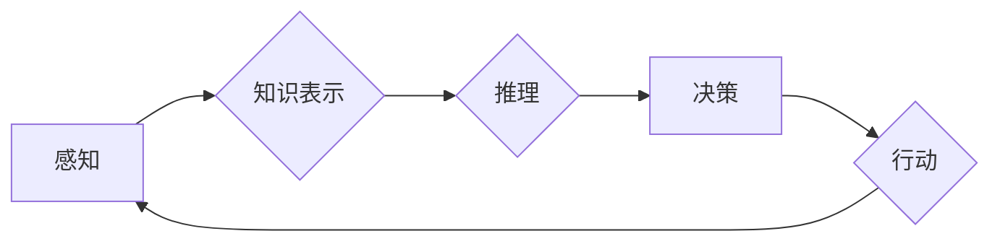

> 认知发展、简洁化、深度学习、神经网络、知识表示、推理、泛化能力、可解释性

## 1. 背景介绍

人工智能（AI）的发展经历了从规则驱动的专家系统到深度学习模型的时代飞跃。深度学习模型在图像识别、自然语言处理等领域取得了突破性进展，展现出强大的学习能力和泛化能力。然而，随着模型规模和复杂度的不断增加，其可解释性、鲁棒性和安全性能也面临着新的挑战。

认知发展是人类智能的核心，它涉及知识的获取、理解、推理和应用。而人工智能的发展目标之一便是模拟和超越人类的认知能力。因此，探索如何将认知发展的原理应用于人工智能的构建，使其更加智能、高效和可解释，成为当前研究的热点。

简洁化和深刻化是认知发展的重要特征。简洁化是指将复杂的信息压缩成简洁的知识表示，以便于存储、检索和推理。深刻化是指对知识进行深入理解，建立联系和因果关系，从而获得更深层的洞察力和预测能力。

## 2. 核心概念与联系

**2.1 简洁化与深刻化**

简洁化和深刻化并非相互排斥，而是相互促进的关系。简洁的知识表示可以帮助我们更有效地存储和处理信息，从而为深入理解和推理提供基础。而深刻的理解可以帮助我们识别信息中的关键要素，并将其压缩成更简洁的表示形式。

**2.2 认知发展与人工智能**

认知发展和人工智能之间存在着密切的联系。人类的认知发展经历了从感知到抽象思维的逐步演化，而人工智能的发展也遵循着类似的路径。从早期规则驱动的专家系统到如今的深度学习模型，人工智能的演进不断朝着更接近人类认知能力的方向发展。

**2.3 深度学习与简洁化**

深度学习模型在处理海量数据方面表现出色，但其内部结构复杂，难以解释。如何将深度学习与简洁化相结合，构建更可解释、高效的AI模型，是当前研究的重要方向。

**Mermaid 流程图**



## 3. 核心算法原理 & 具体操作步骤

### 3.1 算法原理概述

简洁化和深刻化在人工智能领域可以体现在以下几个方面：

* **知识表示：** 将复杂的信息压缩成简洁的知识图谱或符号表示，以便于存储、检索和推理。
* **模型压缩：** 通过量化、剪枝等方法减少模型参数数量，提高模型的效率和可解释性。
* **知识蒸馏：** 将大型模型的知识迁移到小型模型中，实现模型的简洁化和高效化。

### 3.2 算法步骤详解

**3.2.1 知识表示**

1. **数据预处理：** 将原始数据进行清洗、转换和特征提取，以便于知识表示。
2. **知识抽取：** 利用自然语言处理技术从文本数据中抽取实体、关系和事件等知识。
3. **知识图谱构建：** 将抽取的知识表示成图谱结构，其中节点代表实体，边代表关系。

**3.2.2 模型压缩**

1. **量化：** 将模型参数的精度降低，例如将32位浮点数转换为8位整数，从而减少模型大小和计算量。
2. **剪枝：** 删除模型中不重要的参数或连接，例如移除权重较小的连接，从而减少模型复杂度。
3. **知识蒸馏：** 训练一个小型模型，使其模仿大型模型的输出结果，从而将大型模型的知识迁移到小型模型中。

### 3.3 算法优缺点

**优点：**

* **提高效率：** 简洁化的模型和知识表示可以减少计算量和存储空间。
* **增强可解释性：** 简洁的模型结构更容易理解和解释。
* **提高鲁棒性：** 简洁化的模型对噪声和异常数据更具鲁棒性。

**缺点：**

* **信息损失：** 简洁化可能会导致信息损失，降低模型的准确性。
* **泛化能力下降：** 过度简洁化的模型可能难以泛化到新的数据。

### 3.4 算法应用领域

* **自然语言处理：** 文本分类、情感分析、机器翻译等。
* **计算机视觉：** 图像识别、目标检测、图像分割等。
* **推荐系统：** 用户个性化推荐、商品推荐等。
* **医疗诊断：** 疾病诊断、药物推荐等。

## 4. 数学模型和公式 & 详细讲解 & 举例说明

### 4.1 数学模型构建

**4.1.1 知识图谱表示**

知识图谱可以表示为一个三元组集合：

```latex
G = {(h, r, t)}
```

其中：

* h 代表主语实体
* r 代表关系
* t 代表宾语实体

**4.1.2 模型压缩

模型压缩可以采用以下数学公式：

* **量化：** 将模型参数 $w$ 从 $f(w)$ 转换为 $g(w)$，其中 $g(w)$ 的精度比 $f(w)$ 低。

* **剪枝：** 删除模型中权重较小的连接，例如将权重小于阈值 $\theta$ 的连接移除。

### 4.2 公式推导过程

**4.2.1 知识蒸馏

知识蒸馏的目标是训练一个小型模型 $s$，使其模仿大型模型 $t$ 的输出结果。

损失函数可以定义为：

```latex
L = KL(P_t || P_s) + \lambda L_{CE}(y, P_s)
```

其中：

* $P_t$ 是大型模型 $t$ 的输出概率分布
* $P_s$ 是小型模型 $s$ 的输出概率分布
* $L_{CE}$ 是交叉熵损失函数
* $\lambda$ 是平衡项

### 4.3 案例分析与讲解

**4.3.1 知识图谱构建

可以使用知识抽取工具从文本数据中抽取知识，构建知识图谱。例如，可以使用spaCy工具从新闻文章中抽取实体和关系，构建新闻事件知识图谱。

**4.3.2 模型压缩

可以使用TensorFlow Lite工具将深度学习模型压缩成更小的尺寸，以便在移动设备上运行。例如，可以使用TensorFlow Lite将图像识别模型压缩成几百KB，以便在智能手机上运行。

## 5. 项目实践：代码实例和详细解释说明

### 5.1 开发环境搭建

* Python 3.7+
* TensorFlow 2.0+
* PyTorch 1.0+
* Jupyter Notebook

### 5.2 源代码详细实现

```python
# 知识图谱构建示例
import spacy

nlp = spacy.load("en_core_web_sm")

text = "Apple is a technology company based in Cupertino, California."
doc = nlp(text)

entities = [(ent.text, ent.label_) for ent in doc.ents]
relations = [(token.text, token.dep_) for token in doc if token.dep_ != "ROOT"]

print("Entities:", entities)
print("Relations:", relations)

# 模型压缩示例
import tensorflow as tf

model = tf.keras.models.load_model("my_model.h5")

# 使用量化方法压缩模型
quantized_model = tf.keras.models.quantize_model(model,
                                              quantization_config=tf.keras.quantization.QuantizationConfig(
                                                  dtype=tf.int8))

# 保存压缩后的模型
quantized_model.save("quantized_model.h5")
```

### 5.3 代码解读与分析

* 知识图谱构建示例：使用spaCy工具从文本数据中抽取实体和关系，构建知识图谱。
* 模型压缩示例：使用TensorFlow的量化方法压缩深度学习模型，将模型参数的精度降低，从而减少模型大小和计算量。

### 5.4 运行结果展示

* 知识图谱构建示例：输出实体和关系列表。
* 模型压缩示例：压缩后的模型文件大小减小。

## 6. 实际应用场景

### 6.1 自然语言处理

* **聊天机器人：** 简洁化的知识表示可以帮助聊天机器人更好地理解用户意图，并提供更准确的回复。
* **文本摘要：** 深刻化的理解可以帮助文本摘要系统提取文本的关键信息，生成更简洁和准确的摘要。

### 6.2 计算机视觉

* **图像识别：** 简洁化的模型可以提高图像识别系统的效率和准确性。
* **目标检测：** 深刻化的理解可以帮助目标检测系统识别目标的类别和属性，提高检测精度。

### 6.3 其他领域

* **推荐系统：** 简洁化的知识表示可以帮助推荐系统更好地理解用户的兴趣，提供更个性化的推荐。
* **医疗诊断：** 深刻化的理解可以帮助医疗诊断系统识别疾病的潜在原因，提高诊断准确性。

### 6.4 未来应用展望

随着人工智能技术的不断发展，简洁化和深刻化将成为人工智能发展的重要趋势。未来，我们将看到更多基于简洁化和深刻化的AI模型，它们将更加智能、高效和可解释，并应用于更广泛的领域。

## 7. 工具和资源推荐

### 7.1 学习资源推荐

* **书籍：**
    * 《深度学习》
    * 《人工智能：现代方法》
    * 《知识表示与推理》
* **在线课程：**
    * Coursera
    * edX
    * Udacity

### 7.2 开发工具推荐

* **TensorFlow:** 开源深度学习框架
* **PyTorch:** 开源深度学习框架
* **spaCy:** 自然语言处理工具包

### 7.3 相关论文推荐

* **BERT: Pre-training of Deep Bidirectional Transformers for Language Understanding**
* **Knowledge Graph Embedding: A Survey**
* **Distilling the Knowledge in a Neural Network**

## 8. 总结：未来发展趋势与挑战

### 8.1 研究成果总结

本文探讨了简洁化和深刻化在人工智能领域的应用，并介绍了相关的算法原理、代码实例和实际应用场景。

### 8.2 未来发展趋势

* **更简洁高效的模型架构：** 研究更简洁、高效的模型架构，例如Transformer、BERT等。
* **更深入的知识表示：** 开发更深入的知识表示方法，例如知识图谱、符号推理等。
* **更强的可解释性：** 研究更强的可解释性方法，例如注意力机制、可视化解释等。

### 8.3 面临的挑战

* **数据质量和可用性：** 构建简洁化和深刻化的AI模型需要高质量、丰富的数据支持。
* **算法复杂性和效率：** 一些简洁化和深刻化的算法可能比较复杂，需要更高效的计算方法。
* **可解释性和信任度：** 提高AI模型的可解释性和信任度，使其能够被广泛应用于各个领域。

### 8.4 研究展望

未来，我们将继续探索简洁化和深刻化在人工智能领域的应用，并致力于构建更智能、高效、可解释和可信赖的AI系统。

## 9. 附录：常见问题与解答

**Q1：简洁化和深刻化之间有什么关系？**

**A1：** 简洁化和深刻化是相互促进的关系。简洁的知识表示可以帮助我们更有效地存储和处理信息，从而为深入理解和推理提供基础。而深刻的理解可以帮助我们识别信息中的关键要素，并将其压缩成更简洁的表示形式。

**Q2：如何评估简洁化和深刻化的效果？**

**A2：** 可以通过以下指标来评估简洁化和深刻化的效果：

* **模型大小和计算量：** 简洁化的模型通常具有更小的尺寸和更低的计算量。
* **模型准确性和泛化能力：** 深刻化的模型通常具有更高的准确性和泛化能力。
* **可解释性和鲁棒性：** 简洁化的模型通常更容易