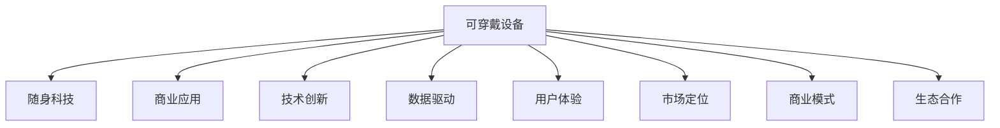

                 

# 可穿戴设备创业：随身科技的商机

> 关键词：可穿戴设备,随身科技,商业应用,技术创新,数据驱动,可持续性,创业指导,智能健康,未来趋势

## 1. 背景介绍

### 1.1 问题由来
随着物联网技术的发展和人们生活水平的提高，可穿戴设备逐渐成为日常生活的重要组成部分。这些设备从健康监测到智能助手，覆盖了众多场景。可穿戴设备市场的不断扩大，吸引了众多创业者和投资者的关注。从创业公司到国际大厂，各行各业都参与其中，激发了新一轮的行业变革。

然而，尽管市场潜力巨大，但创业的门槛同样高。从硬件设计到软件开发，从数据分析到用户交互，各个环节都需谨慎处理，否则很容易功亏一篑。因此，本文旨在深入探讨可穿戴设备的创业领域，通过分析行业现状、市场机遇与挑战，以及未来趋势，为有意涉足该领域的创业者提供系统的指导和参考。

### 1.2 问题核心关键点
可穿戴设备创业的核心关键点包括：
- 技术创新：持续的硬件、软件技术突破是产品竞争力的基石。
- 数据驱动：精准的数据分析为产品迭代提供了强有力的支持。
- 用户体验：打造优秀用户体验是赢得用户的关键。
- 市场定位：明晰的市场定位有助于精准抓住目标用户群体。
- 商业模式：合理的商业模式为产品盈利提供了保障。
- 生态合作：与行业内的合作伙伴形成生态，共同推动产业进步。

## 2. 核心概念与联系

### 2.1 核心概念概述

为更好地理解可穿戴设备创业的核心概念，本节将介绍几个密切相关的核心概念：

- **可穿戴设备(Wearable Device)**：可穿戴设备是安装在用户身上或穿戴在用户身上的小型计算机或其他电子设备，如智能手表、智能眼镜、健身追踪器等。这些设备可以监测健康状况、记录运动数据、导航等。

- **随身科技(Proximity Technology)**：随身科技指的是将信息技术与用户的日常生活紧密结合，为用户带来便利的科技产品。可穿戴设备正是随身科技的代表。

- **商业应用(Commercial Application)**：商业应用是可穿戴设备的核心价值所在，通过与医疗、健身、娱乐等垂直领域的结合，为用户提供实际价值，实现商业化运作。

- **技术创新(Technological Innovation)**：技术创新是可穿戴设备持续发展的动力源泉。包括硬件设计、软件算法、用户界面、隐私保护等多方面创新。

- **数据驱动(Data-Driven)**：数据驱动指的是通过收集、分析和利用用户数据，优化产品功能、提升用户体验和进行精准营销。

- **用户体验(User Experience)**：用户体验是衡量产品成功与否的重要指标，直接影响用户的购买决策和忠诚度。

- **市场定位(Market Segmentation)**：市场定位是指明确目标用户群体，制定相应的市场策略和产品定位，以便精准营销。

- **商业模式(Business Model)**：商业模式是企业的盈利方式，包括直接销售、订阅服务、广告收入等多种形式。

- **生态合作(Ecosystem Collaboration)**：生态合作指的是与合作伙伴共同开发、推广产品，形成完整的生态系统，实现互利共赢。

这些核心概念之间的逻辑关系可以通过以下Mermaid流程图来展示：



这个流程图展示了可穿戴设备创业涉及的关键环节及其之间的关系：

1. 可穿戴设备通过随身科技的概念，结合商业应用，为用户提供实际价值。
2. 技术创新和数据驱动为其提供技术支持和用户数据基础。
3. 用户体验和市场定位帮助其精准地捕捉目标用户和进行市场推广。
4. 商业模式和生态合作则为其盈利和行业进步提供了保障。

## 3. 核心算法原理 & 具体操作步骤

### 3.1 算法原理概述

可穿戴设备创业涉及的算法和技术原理复杂多样，但核心算法和操作步骤具有相似性。通常包括设备设计、软件开发、数据分析和用户体验优化四个主要环节。

- **设备设计**：硬件和软件设计是可穿戴设备的基础，涉及硬件选型、电路设计、软件架构、用户界面等多方面。
- **软件开发**：软件开发包括设备与智能设备、应用程序之间的接口开发，以及数据存储、处理、传输等。
- **数据分析**：通过传感器收集用户数据，并进行数据分析和处理，优化产品功能，提升用户体验。
- **用户体验优化**：根据用户反馈和行为数据，不断优化产品，提升用户体验，增加用户粘性。

### 3.2 算法步骤详解

#### 3.2.1 设备设计

1. **需求分析**：明确设备的功能和目标用户，确保设备设计符合市场需求。
2. **硬件选型**：选择合适的传感器和芯片，考虑设备的续航能力、数据处理速度等因素。
3. **电路设计**：设计电路板布局，确保设备各功能模块的稳定性、可扩展性和易维护性。
4. **软件开发**：开发设备的操作系统和应用软件，保证用户界面友好、易于操作。
5. **测试验证**：进行设备的功能测试和用户体验测试，确保设备质量。

#### 3.2.2 软件开发

1. **接口开发**：实现设备与智能设备、应用程序之间的数据传输和通信协议。
2. **数据存储**：设计合理的数据存储架构，确保数据的安全性和可靠性。
3. **数据处理**：开发算法和模型，处理传感器数据，提取有价值的信息。
4. **用户界面**：设计简洁美观的用户界面，提供良好的用户体验。
5. **测试发布**：进行系统测试，修复bug，发布最终版本。

#### 3.2.3 数据分析

1. **数据采集**：通过传感器收集用户数据，包括运动、心率、血压等。
2. **数据清洗**：清洗异常数据和噪声，确保数据质量。
3. **特征提取**：提取有意义的特征，用于数据分析和模型训练。
4. **数据分析**：利用机器学习、统计学等方法，分析用户数据，提供决策支持。
5. **可视化呈现**：将分析结果通过图表、仪表盘等方式呈现给用户。

#### 3.2.4 用户体验优化

1. **用户反馈收集**：通过问卷调查、用户评论等方式，收集用户反馈。
2. **行为数据分析**：分析用户行为数据，找出问题点。
3. **迭代改进**：根据反馈和数据分析结果，不断优化产品功能。
4. **测试发布**：发布优化后的版本，进行用户测试，确保用户体验。
5. **持续更新**：根据用户反馈和新数据，持续更新产品，提升用户体验。

### 3.3 算法优缺点

可穿戴设备创业涉及的算法和技术原理复杂多样，但核心算法和操作步骤具有相似性。通常包括设备设计、软件开发、数据分析和用户体验优化四个主要环节。

#### 3.3.1 优点

1. **高效性**：高效的数据采集和分析，为产品迭代提供了强有力的支持。
2. **准确性**：通过机器学习和统计学方法，可以提供准确可靠的分析结果。
3. **适用性广**：技术适用于各种类型的可穿戴设备，包括智能手表、智能眼镜等。
4. **可持续性**：技术迭代迅速，能够及时跟进市场和技术的发展。

#### 3.3.2 缺点

1. **技术门槛高**：涉及多种技术和算法，需要深厚的技术积累。
2. **数据隐私问题**：大量数据的收集和分析，涉及用户隐私保护问题。
3. **用户体验要求高**：需要不断优化产品，提升用户体验，增加用户粘性。
4. **市场竞争激烈**：市场竞争激烈，需要不断创新，才能保持竞争优势。

## 4. 数学模型和公式 & 详细讲解 & 举例说明

### 4.1 数学模型构建

本节将使用数学语言对可穿戴设备创业涉及的核心算法和操作步骤进行更加严格的刻画。

假设可穿戴设备采集的用户数据为 $\mathbf{X} = [x_1, x_2, ..., x_n]$，其中 $x_i$ 表示第 $i$ 个数据点，包括运动数据、心率数据等。目标是将这些数据转化为有用的信息，用于提升用户体验和商业应用。

**算法流程**：

1. **数据采集**：通过传感器采集用户数据 $\mathbf{X}$。
2. **数据清洗**：清洗异常数据和噪声，得到干净的数据 $\mathbf{X'}$。
3. **特征提取**：提取特征 $\mathbf{F} = [f_1, f_2, ..., f_n]$。
4. **数据分析**：利用机器学习模型，对特征进行分析，得到结果 $\mathbf{Y}$。
5. **可视化呈现**：将结果 $\mathbf{Y}$ 通过图表、仪表盘等方式呈现给用户。

**数学模型**：

$$
\mathbf{Y} = g(\mathbf{F})
$$

其中 $g$ 为机器学习模型，如回归、分类、聚类等。

### 4.2 公式推导过程

以回归模型为例，推导其公式和求解步骤：

假设机器学习模型为线性回归模型，目标是将用户数据 $\mathbf{X}$ 映射到目标变量 $\mathbf{Y}$。线性回归模型的公式为：

$$
\mathbf{Y} = \mathbf{W}^T \mathbf{X} + b
$$

其中 $\mathbf{W}$ 为模型权重，$b$ 为偏置。

模型的训练过程为：

1. **样本准备**：准备训练样本 $\mathbf{X}^{train} = [\mathbf{x}_1, \mathbf{x}_2, ..., \mathbf{x}_m]$，以及对应的目标变量 $\mathbf{Y}^{train} = [y_1, y_2, ..., y_m]$。
2. **模型训练**：利用梯度下降等优化算法，最小化损失函数：

$$
\mathcal{L}(\mathbf{W}, b) = \frac{1}{2m} \sum_{i=1}^m (y_i - (\mathbf{W}^T \mathbf{x}_i + b))^2
$$

3. **模型验证**：在验证集 $\mathbf{X}^{valid}$ 上验证模型，计算误差 $\mathbf{E}^{valid}$。
4. **模型测试**：在测试集 $\mathbf{X}^{test}$ 上测试模型，计算误差 $\mathbf{E}^{test}$。
5. **模型部署**：将模型部署到设备上，实现数据分析和可视化。

### 4.3 案例分析与讲解

**案例：智能手表的心率监测分析**

智能手表采集用户的心率数据 $\mathbf{X} = [x_1, x_2, ..., x_n]$。通过机器学习模型 $g$，将数据转化为目标变量 $\mathbf{Y}$，即用户的心率变化趋势：

1. **数据采集**：智能手表通过心率传感器采集用户数据 $\mathbf{X}$。
2. **数据清洗**：清洗异常数据和噪声，得到干净的数据 $\mathbf{X'}$。
3. **特征提取**：提取心率变化率等特征 $\mathbf{F} = [f_1, f_2, ..., f_n]$。
4. **数据分析**：利用回归模型 $g$，分析特征 $\mathbf{F}$，得到心率变化趋势 $\mathbf{Y}$。
5. **可视化呈现**：将心率变化趋势 $\mathbf{Y}$ 通过图表呈现给用户。

## 5. 项目实践：代码实例和详细解释说明

### 5.1 开发环境搭建

在进行可穿戴设备创业实践前，我们需要准备好开发环境。以下是使用Python进行PyTorch开发的环境配置流程：

1. 安装Anaconda：从官网下载并安装Anaconda，用于创建独立的Python环境。

2. 创建并激活虚拟环境：
```bash
conda create -n pytorch-env python=3.8 
conda activate pytorch-env
```

3. 安装PyTorch：根据CUDA版本，从官网获取对应的安装命令。例如：
```bash
conda install pytorch torchvision torchaudio cudatoolkit=11.1 -c pytorch -c conda-forge
```

4. 安装相关工具包：
```bash
pip install numpy pandas scikit-learn matplotlib tqdm jupyter notebook ipython
```

完成上述步骤后，即可在`pytorch-env`环境中开始可穿戴设备创业实践。

### 5.2 源代码详细实现

这里我们以智能手表的心率监测分析为例，给出使用PyTorch进行数据分析的PyTorch代码实现。

首先，定义数据处理函数：

```python
import numpy as np
import pandas as pd
import torch
from torch.utils.data import TensorDataset, DataLoader
from sklearn.preprocessing import StandardScaler
from sklearn.model_selection import train_test_split

def load_data():
    # 加载心率数据
    data = pd.read_csv('heart_rate.csv')
    # 提取特征和标签
    X = data.drop(['time'], axis=1).values
    y = data['time'].values
    # 数据标准化
    scaler = StandardScaler()
    X = scaler.fit_transform(X)
    # 数据集划分
    X_train, X_test, y_train, y_test = train_test_split(X, y, test_size=0.2, random_state=42)
    # 转换为Tensor
    X_train = torch.from_numpy(X_train).float()
    X_test = torch.from_numpy(X_test).float()
    y_train = torch.from_numpy(y_train).float()
    y_test = torch.from_numpy(y_test).float()
    return X_train, X_test, y_train, y_test

# 加载数据
X_train, X_test, y_train, y_test = load_data()
```

然后，定义模型和优化器：

```python
from torch import nn
from torch.optim import Adam

# 定义线性回归模型
class LinearRegression(nn.Module):
    def __init__(self, n_features):
        super(LinearRegression, self).__init__()
        self.linear = nn.Linear(n_features, 1)

    def forward(self, x):
        return self.linear(x)

# 定义模型参数
n_features = X_train.shape[1]
model = LinearRegression(n_features)

# 定义优化器
optimizer = Adam(model.parameters(), lr=0.01)
```

接着，定义训练和评估函数：

```python
def train_epoch(model, optimizer, X_train, y_train):
    model.train()
    optimizer.zero_grad()
    outputs = model(X_train)
    loss = nn.MSELoss()(outputs, y_train)
    loss.backward()
    optimizer.step()
    return loss.item()

def evaluate(model, X_test, y_test):
    model.eval()
    with torch.no_grad():
        outputs = model(X_test)
        loss = nn.MSELoss()(outputs, y_test)
    return loss.item()

# 训练模型
epochs = 100
for epoch in range(epochs):
    loss = train_epoch(model, optimizer, X_train, y_train)
    print(f'Epoch {epoch+1}, loss: {loss:.3f}')

# 评估模型
loss = evaluate(model, X_test, y_test)
print(f'Test loss: {loss:.3f}')
```

以上就是使用PyTorch进行可穿戴设备数据分析的完整代码实现。可以看到，PyTorch提供的高效Tensor运算和丰富的模型库，使得数据分析和建模变得简洁高效。

### 5.3 代码解读与分析

让我们再详细解读一下关键代码的实现细节：

**load_data函数**：
- 从CSV文件中加载心率数据。
- 提取特征和标签。
- 数据标准化。
- 数据集划分。
- 转换为Tensor格式。

**LinearRegression模型**：
- 定义线性回归模型，包含一个线性层。

**train_epoch函数**：
- 在训练集上前向传播和反向传播，更新模型参数。
- 计算损失函数。

**evaluate函数**：
- 在测试集上前向传播，计算损失函数。

**训练流程**：
- 定义总轮数。
- 对每个轮次，先训练模型，再评估模型。

可以看到，PyTorch框架下的模型训练和评估非常简单，适合快速迭代研究。

## 6. 实际应用场景

### 6.1 智能手表监测健康

智能手表作为可穿戴设备的代表，可以广泛应用于健康监测领域。通过采集用户的心率、血氧、步数等数据，智能手表可以为用户提供详细的健康报告，帮助用户管理健康。

具体而言，智能手表内置传感器采集用户数据，通过数据分析模型，可以生成心率变化趋势、睡眠质量报告、运动强度评估等，供用户查看。同时，智能手表可以与健康App、医院等平台联动，形成完整的健康管理系统。

### 6.2 智能眼镜导航

智能眼镜利用AR/VR技术，结合GPS、GIS等地图数据，提供实时导航服务。用户佩戴智能眼镜，可以实时获取路线、地标、信息等，提升出行效率。

智能眼镜采集用户的位置数据，通过数据分析模型，可以提供个性化路线建议、实时交通信息、景点介绍等。同时，智能眼镜可以与手机、车载导航等平台联动，实现无缝切换。

### 6.3 智能健身追踪器

智能健身追踪器通过内置的传感器采集用户的运动数据，如步数、跑步距离、心率等。通过数据分析模型，智能健身追踪器可以生成运动报告、训练计划、卡路里消耗等，帮助用户科学锻炼。

智能健身追踪器内置的传感器可以采集用户的运动数据，通过数据分析模型，可以生成运动报告、训练计划、卡路里消耗等，帮助用户科学锻炼。同时，智能健身追踪器可以与健身App、运动教练等平台联动，提供个性化训练建议。

### 6.4 未来应用展望

随着技术的不断进步，可穿戴设备将会在更多领域发挥作用，为人类生活带来更美好的体验：

1. **智能眼镜**：智能眼镜将更加智能化，支持更多功能，如虚拟试衣、语音翻译、实时翻译等，提升用户体验。

2. **健康管理**：智能手表等设备将进一步集成传感器，提供更全面的健康监测，如血糖、血压、血氧等。

3. **教育培训**：智能眼镜、智能手表等设备将应用于教育培训领域，提供个性化学习方案、虚拟教室等，提升学习效果。

4. **娱乐互动**：可穿戴设备将与智能电视、智能音箱等平台联动，提供娱乐互动体验，如虚拟K歌、虚拟游戏等。

5. **公共安全**：智能眼镜等设备将应用于公共安全领域，提供实时监控、紧急呼叫等功能，提升公共安全水平。

## 7. 工具和资源推荐

### 7.1 学习资源推荐

为了帮助开发者系统掌握可穿戴设备创业的理论基础和实践技巧，这里推荐一些优质的学习资源：

1. **《可穿戴设备开发指南》系列博文**：由行业专家撰写，深入浅出地介绍了可穿戴设备开发的基础知识和技术细节。

2. **《人工智能导论》课程**：斯坦福大学开设的计算机科学入门课程，涵盖机器学习、深度学习、自然语言处理等多个领域，是学习人工智能的基础课程。

3. **《深度学习实践》书籍**：介绍深度学习在各个领域的应用案例，包括可穿戴设备、医疗、金融等，适合应用开发人员参考。

4. **《机器学习实战》书籍**：详细介绍机器学习算法的实现细节，适合数据分析和模型开发人员参考。

5. **Kaggle平台**：提供大量数据集和竞赛项目，适合数据科学和机器学习领域的开发者学习实践。

通过对这些资源的学习实践，相信你一定能够快速掌握可穿戴设备创业的技术框架和实践方法，并应用于实际项目开发。

### 7.2 开发工具推荐

高效的开发离不开优秀的工具支持。以下是几款用于可穿戴设备创业开发的常用工具：

1. **PyTorch**：基于Python的开源深度学习框架，灵活动态的计算图，适合快速迭代研究。

2. **TensorFlow**：由Google主导开发的开源深度学习框架，生产部署方便，适合大规模工程应用。

3. **Transformers库**：HuggingFace开发的NLP工具库，集成了众多SOTA语言模型，支持PyTorch和TensorFlow，是进行数据分析的利器。

4. **Keras**：高级神经网络API，支持快速搭建模型和训练，适合初学者和快速迭代开发。

5. **Jupyter Notebook**：交互式开发环境，支持代码和数学公式的结合，适合快速原型开发和协作。

6. **Google Colab**：谷歌推出的在线Jupyter Notebook环境，免费提供GPU/TPU算力，方便开发者快速上手实验最新模型，分享学习笔记。

合理利用这些工具，可以显著提升可穿戴设备创业的开发效率，加快创新迭代的步伐。

### 7.3 相关论文推荐

可穿戴设备创业涉及的技术领域广泛，以下是几篇奠基性的相关论文，推荐阅读：

1. **《可穿戴设备健康监测综述》**：综述可穿戴设备在健康监测领域的应用现状和研究进展。

2. **《基于机器学习的智能手表数据分析》**：介绍基于机器学习的智能手表数据分析方法，包括心率、步数等。

3. **《智能眼镜导航技术研究》**：研究智能眼镜在导航领域的应用，包括路线推荐、实时信息等。

4. **《智能健身追踪器运动数据分析》**：介绍基于机器学习的智能健身追踪器数据分析方法，包括运动报告、训练计划等。

5. **《可穿戴设备隐私保护研究》**：探讨可穿戴设备隐私保护问题，提出基于数据加密和联邦学习的隐私保护方法。

这些论文代表了大数据智能领域的最新研究进展，通过学习这些前沿成果，可以帮助研究者把握学科前进方向，激发更多的创新灵感。

## 8. 总结：未来发展趋势与挑战

### 8.1 总结

本文对可穿戴设备创业涉及的核心算法和操作步骤进行了全面系统的介绍。首先阐述了可穿戴设备创业的背景和意义，明确了技术创新、数据驱动、用户体验、市场定位、商业模式和生态合作等关键点。其次，从原理到实践，详细讲解了可穿戴设备创业的数学模型和算法步骤，给出了代码实现示例。同时，本文还广泛探讨了可穿戴设备在智能手表、智能眼镜、智能健身追踪器等多个领域的应用前景，展示了其广阔的市场和商业价值。

通过本文的系统梳理，可以看到，可穿戴设备创业具有广阔的发展前景，同时也面临着技术、市场、隐私等诸多挑战。如何克服这些挑战，最大化发挥可穿戴设备在健康、运动、娱乐等领域的潜力，将是大数据智能领域的重要研究方向。

### 8.2 未来发展趋势

展望未来，可穿戴设备创业将呈现以下几个发展趋势：

1. **技术创新持续加速**：硬件和软件技术的不断突破，将推动可穿戴设备在健康监测、智能助手、娱乐互动等领域进一步发展。

2. **数据驱动优化产品**：通过大规模数据分析，优化产品功能和用户体验，提升用户粘性和满意度。

3. **个性化定制服务**：基于用户数据，提供个性化定制服务，满足用户的个性化需求。

4. **生态合作形成优势**：与合作伙伴共同开发、推广产品，形成完整的生态系统，实现互利共赢。

5. **跨领域应用拓展**：可穿戴设备将与其他技术领域深度融合，形成跨领域的解决方案，如智慧城市、智能家居等。

6. **可持续发展重视**：在追求商业价值的同时，注重产品的环保和可持续发展，减少对环境的影响。

以上趋势凸显了可穿戴设备创业的广阔前景，这些方向的探索发展，必将进一步推动大数据智能领域的进步。

### 8.3 面临的挑战

尽管可穿戴设备创业面临诸多机遇，但也面临着诸多挑战：

1. **技术门槛高**：涉及硬件设计、软件算法、用户界面等多方面技术，需要深厚的技术积累。

2. **数据隐私问题**：大量数据的收集和分析，涉及用户隐私保护问题，需要严格的数据保护措施。

3. **用户体验要求高**：需要不断优化产品，提升用户体验，增加用户粘性。

4. **市场竞争激烈**：市场竞争激烈，需要不断创新，才能保持竞争优势。

5. **隐私安全问题**：用户数据的安全和隐私保护，是创业成功的重要保障。

6. **设备续航问题**：可穿戴设备的续航能力，是用户使用的关键因素。

7. **生态系统建设**：建立完整的生态系统，形成互利共赢的合作模式，是创业成功的必要条件。

这些挑战需要开发者在技术、市场、隐私等多方面进行全面考虑和优化，才能真正实现可穿戴设备的商业化运作。

### 8.4 研究展望

面对可穿戴设备创业所面临的诸多挑战，未来的研究需要在以下几个方面寻求新的突破：

1. **持续技术创新**：开发更加高效、便携、低功耗的硬件设备，提升用户体验和设备性能。

2. **数据隐私保护**：引入基于区块链、联邦学习等技术，保护用户数据隐私，确保数据安全。

3. **跨领域应用**：探索可穿戴设备与其他技术领域的深度融合，如智能家居、智慧城市等，提供多场景下的解决方案。

4. **个性化定制**：利用机器学习和数据分析技术，提供个性化定制服务，提升用户满意度和忠诚度。

5. **可持续发展**：注重设备的环保和可持续发展，减少对环境的影响，满足社会责任。

6. **智能交互**：引入自然语言处理、语音识别等技术，提升设备的智能交互能力，提供更便捷的用户体验。

这些研究方向将推动可穿戴设备创业迈向更高台阶，为大数据智能领域的发展带来新的突破。

## 9. 附录：常见问题与解答

**Q1：可穿戴设备创业的难点在哪里？**

A: 可穿戴设备创业的难点主要在于技术门槛高、市场竞争激烈、用户体验要求高、数据隐私保护等。技术上需要掌握多种技术和算法，市场上面对激烈竞争，用户体验上需要不断优化产品，数据隐私上需要严格保护用户数据。

**Q2：如何选择可穿戴设备的用户群体？**

A: 选择可穿戴设备的用户群体需要考虑目标用户的需求、习惯、消费能力等多个因素。可以通过市场调研、用户访谈等方式，明确目标用户群体，制定相应的市场策略和产品定位。

**Q3：可穿戴设备创业的商业模式有哪些？**

A: 可穿戴设备创业的商业模式包括直接销售、订阅服务、广告收入等多种形式。具体选择哪种模式需要根据产品特性、用户需求和市场情况进行综合考虑。

**Q4：如何保障可穿戴设备的安全性？**

A: 保障可穿戴设备的安全性需要从多个方面入手，包括数据加密、权限管理、漏洞检测等。可以通过引入区块链、联邦学习等技术，保护用户数据隐私和安全。

**Q5：可穿戴设备的未来发展方向是什么？**

A: 可穿戴设备的未来发展方向包括技术创新、数据驱动、个性化定制、生态合作、跨领域应用等。技术的不断突破将推动可穿戴设备在多个领域的应用拓展，为用户提供更便捷、智能、健康的生活体验。

通过本文的系统梳理，可以看到，可穿戴设备创业具有广阔的发展前景，同时也面临着技术、市场、隐私等诸多挑战。如何克服这些挑战，最大化发挥可穿戴设备在健康、运动、娱乐等领域的潜力，将是大数据智能领域的重要研究方向。

