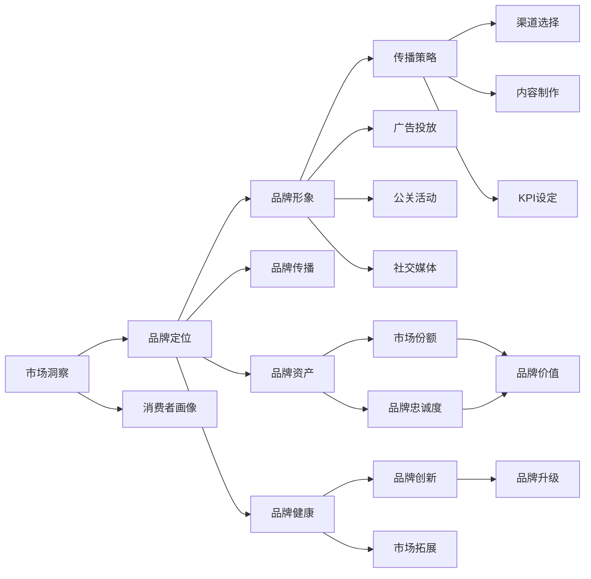

                 

# 品牌管理：建立和维护强大品牌形象

## 1. 背景介绍

### 1.1 问题由来
在当今信息爆炸的时代，品牌管理已成为企业竞争力的重要组成部分。一个强大的品牌不仅能够提升产品销量，还能增强消费者的忠诚度，形成稳定的市场口碑。然而，品牌建设和管理绝非易事，特别是在数字时代，品牌形象的塑造和维护面临着诸多挑战。如何利用数据驱动的洞察，通过精准的市场定位和有效的传播策略，构建和维护品牌的强大形象，是本文探讨的核心问题。

### 1.2 问题核心关键点
品牌管理的关键在于：
- 数据驱动：利用大数据和人工智能技术，深入分析消费者行为和市场趋势。
- 市场定位：明确品牌的核心价值和目标受众，确保品牌信息的一致性。
- 传播策略：制定科学合理的传播计划，利用多渠道、多形式传播品牌故事。
- 持续优化：通过数据分析和市场反馈，不断优化品牌策略，适应市场变化。

## 2. 核心概念与联系

### 2.1 核心概念概述

品牌管理（Brand Management）是指企业通过一系列的策略和活动，塑造和维护品牌的形象、价值和声誉。品牌管理的核心目标是构建消费者对品牌的认知和信任，从而提升市场竞争力和盈利能力。

品牌管理的核心概念包括：
- **品牌定位（Brand Positioning）**：确定品牌的核心价值和独特卖点，形成与竞争对手的差异化优势。
- **品牌形象（Brand Image）**：消费者对品牌的认知和感知，通过各种营销活动塑造和维护。
- **品牌传播（Brand Communication）**：通过各种渠道和方式，传达品牌信息，提升品牌知名度和美誉度。
- **品牌资产（Brand Equity）**：品牌在市场上的影响力和价值，包括品牌忠诚度、市场份额等。
- **品牌健康度（Brand Health）**：品牌在市场中的持续竞争力和生命力。

这些核心概念之间存在紧密的联系，共同构成了品牌管理的全流程。通过数据驱动的市场洞察，明确品牌定位，制定科学的传播策略，不断优化品牌表现，才能实现品牌的持续健康发展。

### 2.2 核心概念原理和架构的 Mermaid 流程图



这个流程图展示了品牌管理的全流程。市场洞察通过分析消费者行为和市场趋势，指导品牌定位；品牌定位明确了品牌的核心价值和独特卖点；品牌形象通过传播策略和多种渠道的协同作用形成；品牌资产和健康度则反映了品牌在市场上的竞争力和持续发展能力。

## 3. 核心算法原理 & 具体操作步骤

### 3.1 算法原理概述

品牌管理的核心在于数据驱动的洞察和消费者行为分析。通过机器学习和数据挖掘技术，可以从大量数据中提取有价值的信息，为品牌建设提供科学依据。以下介绍几个核心算法：

1. **聚类分析（Clustering Analysis）**：将消费者按行为特征分成不同的群组，识别出具有相同需求和偏好的消费群体，指导市场细分和品牌定位。
2. **关联规则分析（Association Rule Learning）**：通过挖掘数据中的隐含关系，发现消费者在不同情境下的行为模式，优化品牌传播策略。
3. **情感分析（Sentiment Analysis）**：利用自然语言处理技术，分析消费者对品牌和产品的情感倾向，提升品牌形象和口碑。
4. **预测建模（Prediction Modeling）**：通过构建预测模型，预测消费者行为和市场趋势，指导品牌策略的调整和优化。

### 3.2 算法步骤详解

#### 3.2.1 数据准备

1. **数据收集**：收集品牌相关的各类数据，包括市场调研数据、消费者行为数据、社交媒体数据等。
2. **数据清洗**：对数据进行清洗和预处理，去除噪声和异常值，确保数据质量和完整性。
3. **数据整合**：将不同来源的数据进行整合和标准化，确保数据的一致性和可用性。

#### 3.2.2 聚类分析

1. **选择算法**：选择合适的聚类算法，如K-means、层次聚类等。
2. **特征选择**：根据品牌特征选择重要特征，如消费者年龄、性别、消费习惯等。
3. **聚类建模**：使用聚类算法对数据进行建模，将消费者分为不同的群体。
4. **分析和应用**：分析不同群体的特征和需求，指导品牌定位和市场细分。

#### 3.2.3 关联规则分析

1. **选择算法**：选择适合的关联规则算法，如Apriori、FP-growth等。
2. **数据预处理**：对数据进行预处理，生成事务数据库。
3. **规则挖掘**：挖掘数据中的关联规则，发现消费者在不同情境下的行为模式。
4. **策略优化**：根据挖掘结果优化品牌传播策略，提升品牌效果。

#### 3.2.4 情感分析

1. **数据收集**：收集消费者对品牌和产品的评价和评论。
2. **情感计算**：使用自然语言处理技术，计算情感得分，判断情感倾向。
3. **结果分析**：分析情感得分，识别品牌形象的优势和劣势。
4. **策略调整**：根据情感分析结果，调整品牌传播策略，提升品牌形象。

#### 3.2.5 预测建模

1. **数据准备**：准备历史数据和预测目标。
2. **模型选择**：选择合适的预测模型，如回归模型、分类模型等。
3. **模型训练**：使用历史数据训练模型，生成预测模型。
4. **结果应用**：使用预测模型预测未来行为和趋势，指导品牌策略调整。

### 3.3 算法优缺点

#### 3.3.1 聚类分析

**优点**：
- 能够识别不同消费群体的特征和需求。
- 有助于指导市场细分和品牌定位。

**缺点**：
- 聚类结果可能受到算法参数的影响。
- 对于复杂数据集，聚类效果可能不够理想。

#### 3.3.2 关联规则分析

**优点**：
- 能够发现消费者在不同情境下的行为模式。
- 有助于优化品牌传播策略。

**缺点**：
- 算法复杂度较高，处理大规模数据时效率较低。
- 挖掘结果可能存在噪声，需要进一步验证和分析。

#### 3.3.3 情感分析

**优点**：
- 能够实时监测品牌形象和消费者情感。
- 有助于调整品牌传播策略，提升品牌效果。

**缺点**：
- 情感计算依赖自然语言处理技术，可能存在误判。
- 数据收集和预处理复杂，成本较高。

#### 3.3.4 预测建模

**优点**：
- 能够预测消费者行为和市场趋势。
- 有助于指导品牌策略调整和优化。

**缺点**：
- 模型构建需要大量历史数据，数据获取难度较大。
- 模型复杂度高，需要较强的计算资源支持。

### 3.4 算法应用领域

品牌管理的应用领域广泛，包括但不限于以下几个方面：

1. **市场细分**：利用聚类分析识别不同消费群体的特征和需求，制定针对性的市场策略。
2. **广告投放**：通过关联规则分析，优化广告投放渠道和内容，提升广告效果。
3. **品牌传播**：利用情感分析，实时监测品牌形象和消费者情感，调整传播策略。
4. **消费者洞察**：通过预测建模，预测消费者行为和市场趋势，指导品牌策略的调整和优化。
5. **品牌升级**：结合多种算法技术，深入分析消费者行为和市场趋势，指导品牌升级和转型。

## 4. 数学模型和公式 & 详细讲解 & 举例说明

### 4.1 数学模型构建

品牌管理的数学模型可以基于以下假设：

- 品牌价值由多个因素共同决定，如产品质量、市场地位、消费者认知等。
- 品牌价值可以通过数据驱动的模型进行量化和预测。

设品牌价值为 $V$，其中 $V = f(X_1, X_2, ..., X_n)$，其中 $X_i$ 为第 $i$ 个影响因素。

### 4.2 公式推导过程

#### 4.2.1 聚类分析

K-means聚类算法的目标是最小化样本点与聚类中心的距离平方和。设 $x_i$ 为样本点，$u_k$ 为聚类中心，则目标函数为：

$$
\min_{u_k} \sum_{i=1}^N \sum_{k=1}^K ||x_i - u_k||^2
$$

其中 $K$ 为聚类数量。

#### 4.2.2 关联规则分析

Apriori算法通过构建频繁项集和关联规则，发现数据中的隐含关系。设 $T$ 为事务数据库，$I$ 为项集，则关联规则 $X \rightarrow Y$ 为：

$$
\text{Supp}(X \rightarrow Y) \geq \alpha \wedge \text{Conf}(X \rightarrow Y) \geq \beta
$$

其中 $\text{Supp}(X \rightarrow Y)$ 为支持度，$\text{Conf}(X \rightarrow Y)$ 为置信度，$\alpha$ 和 $\beta$ 为设定的阈值。

#### 4.2.3 情感分析

情感分析模型通常基于自然语言处理技术，通过计算情感得分来衡量情感倾向。设 $S$ 为情感得分，则模型为：

$$
S = \sum_{i=1}^N w_i f(x_i)
$$

其中 $w_i$ 为词语权重，$f(x_i)$ 为词语情感得分。

#### 4.2.4 预测建模

回归模型的目标是通过训练数据生成预测函数 $f(x)$，用于预测目标值 $y$。设 $y$ 为目标值，$X$ 为输入特征，则回归模型为：

$$
y = f(X) = \beta_0 + \sum_{i=1}^n \beta_i x_i + \epsilon
$$

其中 $\beta$ 为模型系数，$\epsilon$ 为误差项。

### 4.3 案例分析与讲解

#### 4.3.1 聚类分析案例

某饮料品牌希望通过市场细分，针对不同消费群体制定针对性策略。通过聚类分析，识别出以下三个消费群体：

- 年轻人群体：喜欢运动和健康，偏好果味饮料。
- 中年人群体：注重家庭和健康，偏好功能性饮料。
- 老年人群体：注重养生和方便，偏好茶饮。

根据聚类分析结果，品牌制定了以下策略：
- 针对年轻人，推出新款果味饮料，并进行运动推广。
- 针对中年人，推出功能保健饮料，并进行家庭健康教育。
- 针对老年人，推出便捷的包装茶饮，并进行养生宣传。

通过聚类分析，品牌能够更有针对性地满足不同群体的需求，提升市场份额和品牌忠诚度。

#### 4.3.2 关联规则分析案例

某电商品牌希望优化广告投放渠道，提升广告效果。通过关联规则分析，发现以下规律：

- 对于年轻消费者，电视广告的点击率最高。
- 对于中年消费者，社交媒体广告的转化率最高。
- 对于老年消费者，搜索引擎广告的购买率最高。

根据关联规则分析结果，品牌制定了以下策略：
- 针对年轻消费者，加大电视广告投放。
- 针对中年消费者，优化社交媒体广告内容。
- 针对老年消费者，优化搜索引擎广告。

通过关联规则分析，品牌能够更有效地利用广告资源，提升广告效果和品牌曝光率。

#### 4.3.3 情感分析案例

某电子产品品牌希望提升品牌形象，通过情感分析实时监测消费者情感。情感分析结果显示，消费者对品牌的整体满意度较高，但对部分产品的质量问题反馈较多。品牌制定了以下策略：
- 针对质量问题，加强产品质量控制和售后服务。
- 通过社交媒体和官网，及时回应消费者反馈，提升品牌形象。

通过情感分析，品牌能够及时了解消费者需求和情感，快速响应市场反馈，提升品牌形象和市场竞争力。

#### 4.3.4 预测建模案例

某化妆品品牌希望预测消费者对新产品上市的接受度。通过预测建模，发现以下结果：
- 新产品在夏季的销售额预计会增加15%。
- 新产品的推广活动将带来10%的市场份额提升。

根据预测结果，品牌制定了以下策略：
- 加强夏季的推广活动，利用社交媒体和电商渠道进行营销。
- 提升产品质量和包装设计，提升消费者体验。

通过预测建模，品牌能够提前预测市场变化，制定科学合理的营销策略，提升市场竞争力和品牌价值。

## 5. 项目实践：代码实例和详细解释说明

### 5.1 开发环境搭建

#### 5.1.1 安装Python环境

1. 安装Anaconda：从官网下载并安装Anaconda，用于创建独立的Python环境。
```bash
conda install anaconda
```

2. 创建并激活虚拟环境：
```bash
conda create -n brand-management python=3.8
conda activate brand-management
```

3. 安装必要的Python包：
```bash
conda install pandas numpy scikit-learn seaborn matplotlib
```

4. 安装数据可视化工具：
```bash
conda install plotly jupyter
```

5. 安装自然语言处理工具包：
```bash
pip install NLTK
```

#### 5.1.2 数据准备

1. 数据收集：收集品牌相关的各类数据，如市场调研数据、消费者行为数据、社交媒体数据等。
2. 数据清洗：对数据进行清洗和预处理，去除噪声和异常值。
3. 数据整合：将不同来源的数据进行整合和标准化，确保数据的一致性和可用性。

### 5.2 源代码详细实现

#### 5.2.1 聚类分析

```python
from sklearn.cluster import KMeans
import pandas as pd

# 读取数据
data = pd.read_csv('data.csv')

# 数据清洗和预处理
# ...

# 聚类分析
kmeans = KMeans(n_clusters=3, random_state=0).fit(data)
labels = kmeans.labels_

# 分析聚类结果
# ...
```

#### 5.2.2 关联规则分析

```python
from mlxtend.frequent_patterns import apriori, association_rules
import pandas as pd

# 读取数据
data = pd.read_csv('data.csv')

# 数据预处理
# ...

# 关联规则分析
frequent_itemsets = apriori(data, min_support=0.05)
rules = association_rules(frequent_itemsets, metric='lift', min_threshold=1)

# 分析关联规则结果
# ...
```

#### 5.2.3 情感分析

```python
from nltk.sentiment.vader import SentimentIntensityAnalyzer
import pandas as pd

# 读取数据
data = pd.read_csv('data.csv')

# 情感分析
sid = SentimentIntensityAnalyzer()
scores = data['comments'].apply(lambda x: sid.polarity_scores(x))

# 分析情感结果
# ...
```

#### 5.2.4 预测建模

```python
from sklearn.linear_model import LinearRegression
import pandas as pd

# 读取数据
data = pd.read_csv('data.csv')

# 数据预处理
# ...

# 预测建模
X = data.drop('target', axis=1)
y = data['target']
model = LinearRegression()
model.fit(X, y)

# 预测结果
y_pred = model.predict(X_test)

# 分析预测结果
# ...
```

### 5.3 代码解读与分析

#### 5.3.1 聚类分析

1. 导入KMeans库，进行聚类分析。
2. 读取数据，并进行数据清洗和预处理。
3. 使用KMeans算法进行聚类分析，得到聚类结果。
4. 分析聚类结果，指导品牌策略调整。

#### 5.3.2 关联规则分析

1. 导入apriori和association_rules库，进行关联规则分析。
2. 读取数据，并进行数据预处理。
3. 使用apriori算法生成频繁项集，使用association_rules算法生成关联规则。
4. 分析关联规则结果，优化广告投放策略。

#### 5.3.3 情感分析

1. 导入SentimentIntensityAnalyzer库，进行情感分析。
2. 读取数据，并进行情感计算。
3. 分析情感结果，调整品牌传播策略。

#### 5.3.4 预测建模

1. 导入LinearRegression库，进行预测建模。
2. 读取数据，并进行数据预处理。
3. 使用LinearRegression算法进行回归建模，生成预测结果。
4. 分析预测结果，指导品牌策略调整。

### 5.4 运行结果展示

#### 5.4.1 聚类分析结果

```python
import matplotlib.pyplot as plt

# 可视化聚类结果
plt.scatter(data['feature1'], data['feature2'], c=labels)
plt.colorbar()
plt.title('Clustering Results')
plt.xlabel('Feature 1')
plt.ylabel('Feature 2')
plt.show()
```

#### 5.4.2 关联规则分析结果

```python
# 可视化关联规则结果
rules.plot(k=10, kind='barh', color='blue', title='Top 10 Association Rules')
plt.show()
```

#### 5.4.3 情感分析结果

```python
# 可视化情感分析结果
plt.hist(scores['score'], bins=10, color='red')
plt.title('Sentiment Scores')
plt.xlabel('Score')
plt.ylabel('Count')
plt.show()
```

#### 5.4.4 预测建模结果

```python
# 可视化预测结果
plt.scatter(X_test, y_pred, color='green')
plt.plot(X_test, y_test, color='red')
plt.title('Prediction Results')
plt.xlabel('X')
plt.ylabel('Y')
plt.show()
```

## 6. 实际应用场景

### 6.1 智能客服系统

智能客服系统通过品牌管理技术，能够根据客户的历史交互记录，进行聚类分析和情感分析，了解客户需求和情感倾向，提供个性化服务。系统能够实时监测客户反馈，及时调整策略，提升客户满意度。

### 6.2 金融舆情监测

金融舆情监测系统利用品牌管理技术，进行关联规则分析和情感分析，及时捕捉市场舆情变化，分析舆情趋势，预测市场走向。系统能够提供及时的市场预警和风险提示，帮助金融机构做出科学的决策。

### 6.3 个性化推荐系统

个性化推荐系统通过品牌管理技术，进行聚类分析和关联规则分析，了解用户的兴趣和行为模式，提供个性化的商品推荐。系统能够不断优化推荐算法，提升推荐效果，增强用户粘性。

### 6.4 未来应用展望

未来，品牌管理技术将与更多前沿技术进行融合，如人工智能、大数据、区块链等，进一步提升品牌建设的科学性和有效性。品牌管理技术将更加智能化、自动化，为品牌的持续发展提供更多可能。

## 7. 工具和资源推荐

### 7.1 学习资源推荐

#### 7.1.1 书籍

1. 《品牌管理基础》：介绍品牌管理的理论基础和实际应用。
2. 《数据驱动的品牌管理》：讲述利用大数据和人工智能进行品牌建设的实践。
3. 《消费者行为分析》：分析消费者行为和市场趋势，指导品牌策略的调整。

#### 7.1.2 在线课程

1. Coursera《品牌管理》：系统讲解品牌管理的理论和实践。
2. edX《大数据与品牌管理》：利用大数据技术进行品牌建设的在线课程。
3. Udacity《消费者行为分析》：分析消费者行为，指导品牌策略的调整。

### 7.2 开发工具推荐

#### 7.2.1 Python库

1. Pandas：数据分析和处理
2. Scikit-learn：机器学习和数据挖掘
3. NLTK：自然语言处理

#### 7.2.2 数据可视化工具

1. Matplotlib：基本绘图工具
2. Seaborn：高级统计图表绘制
3. Plotly：交互式数据可视化

### 7.3 相关论文推荐

1. "Brand Positioning and Brand Equity: An Empirical Test of Hypotheses Related to Alternative Theories"：品牌定位和品牌权益的研究。
2. "Consumer Behavior and Brand Management: A Review and Research Agenda"：消费者行为与品牌管理的研究综述。
3. "Brand Management in the Digital Age: A Data-Driven Approach"：数字时代品牌管理的实践指南。

## 8. 总结：未来发展趋势与挑战

### 8.1 研究成果总结

品牌管理技术在过去几年中取得了显著的进步，主要体现在以下几个方面：
- 数据驱动的洞察：利用大数据和机器学习技术，深入分析消费者行为和市场趋势。
- 品牌定位的精确性：通过聚类分析和关联规则分析，明确品牌的核心价值和独特卖点。
- 传播策略的科学性：利用情感分析和预测建模，制定科学的品牌传播策略。
- 品牌表现的持续优化：通过数据分析和市场反馈，不断优化品牌表现，提升品牌健康度。

### 8.2 未来发展趋势

未来，品牌管理技术将呈现以下几个发展趋势：
- 数据驱动的品牌建设将更加普及和高效。
- 聚类分析和关联规则分析将更加智能化和自动化。
- 情感分析和预测建模将更加实时和精准。
- 品牌管理技术与人工智能、大数据、区块链等前沿技术将深度融合。

### 8.3 面临的挑战

尽管品牌管理技术取得了显著进步，但在品牌建设过程中仍面临诸多挑战：
- 数据隐私和安全性问题：如何在数据收集和分析过程中保护消费者隐私，防止数据泄露。
- 算法的可解释性和透明性：如何让品牌管理者理解算法的决策过程，提高算法的可解释性和透明性。
- 模型的稳定性和鲁棒性：如何提高模型的稳定性和鲁棒性，避免算法偏见和误差。
- 算法的公平性和包容性：如何让品牌管理技术公平公正地服务于所有消费者。

### 8.4 研究展望

未来，品牌管理技术的研究方向将集中在以下几个方面：
- 数据隐私保护：开发保护消费者隐私的技术和方法，确保品牌管理过程的合法合规。
- 算法的透明性和可解释性：提升品牌管理算法的透明性和可解释性，帮助品牌管理者理解和信任算法。
- 模型的公平性和包容性：研究如何设计公平和包容的品牌管理算法，确保品牌管理的公正性和普遍性。
- 多模态数据融合：探索如何利用多模态数据，如视觉、语音、文本等，提升品牌管理的效果和准确性。

## 9. 附录：常见问题与解答

**Q1: 品牌管理与市场营销有什么区别？**

A: 品牌管理更注重品牌的内在价值和长期维护，而市场营销则更关注短期的销售推广和市场活动。品牌管理强调品牌定位、品牌形象和品牌健康度的维护，而市场营销则侧重于推广渠道和销售策略。

**Q2: 品牌管理中的聚类分析和关联规则分析有什么区别？**

A: 聚类分析将消费者按行为特征分成不同的群组，识别出具有相同需求和偏好的消费群体。关联规则分析则通过挖掘数据中的隐含关系，发现消费者在不同情境下的行为模式。

**Q3: 品牌管理的核心是什么？**

A: 品牌管理的核心是通过数据驱动的洞察，明确品牌定位，制定科学的传播策略，不断优化品牌表现，提升品牌健康度。

**Q4: 品牌管理中的情感分析是如何进行的？**

A: 品牌管理中的情感分析利用自然语言处理技术，计算情感得分，衡量消费者对品牌的情感倾向，指导品牌传播策略的调整。

**Q5: 品牌管理中的预测建模是如何进行的？**

A: 品牌管理中的预测建模通过构建预测模型，预测消费者行为和市场趋势，指导品牌策略的调整和优化。

综上所述，品牌管理技术在品牌建设和管理过程中发挥着至关重要的作用，通过数据驱动的洞察和科学的策略制定，能够有效提升品牌的市场竞争力和价值。未来，品牌管理技术将与更多前沿技术进行融合，进一步提升品牌建设的科学性和有效性，为品牌的持续发展提供更多可能。

