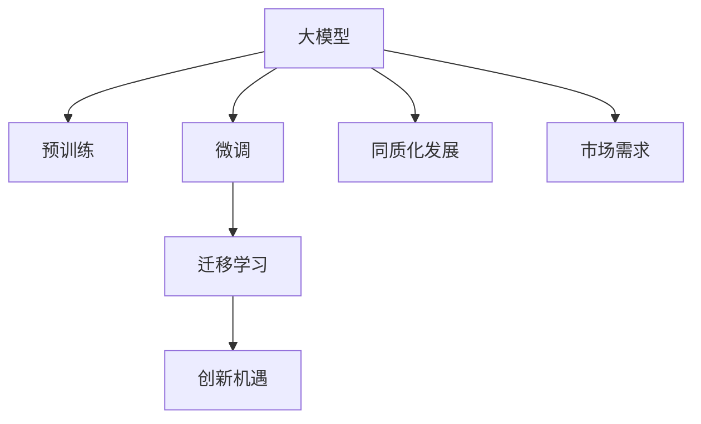

                 

# 国内大模型市场：贾扬清观点，同质化发展与创新机遇并存

## 1. 背景介绍

### 1.1 问题由来
近年来，随着深度学习技术的快速发展和预训练语言模型的崛起，大模型市场日益成为AI领域的一块重要拼图。尤其是大模型在自然语言处理(NLP)、计算机视觉(CV)等领域的突破性应用，引发了广泛关注。在技术快速迭代和市场竞争加剧的背景下，国内大模型市场也呈现出快速发展的态势。

### 1.2 问题核心关键点
国内大模型市场的发展面临着同质化发展和创新机遇并存的局面。一方面，众多企业纷纷布局大模型，形成竞争激烈的生态系统；另一方面，技术、应用的创新不断涌现，为市场带来新的活力。贾扬清作为深度学习领域的领军人物，他关于国内大模型市场的观点为我们提供了宝贵的视角和思考。

### 1.3 问题研究意义
深入探讨贾扬清对国内大模型市场的看法，能够帮助我们更好地理解市场的现状、挑战和未来发展方向。这对于指导企业决策、优化产品设计、把握市场趋势具有重要意义。

## 2. 核心概念与联系

### 2.1 核心概念概述

本节将介绍几个核心概念及其相互关系，为理解国内大模型市场奠定基础：

- **大模型（Large Models）**：指在特定领域应用广泛、参数量巨大的深度学习模型，如BERT、GPT-3等。大模型通过大规模数据预训练，具备强大的泛化能力和适应性。

- **预训练（Pre-training）**：指在大规模无标签数据上进行自监督学习，学习通用的语言或视觉知识。预训练是大模型性能提升的基础。

- **微调（Fine-tuning）**：指在大模型上进行特定任务训练，调整模型参数以适应具体应用场景。微调是提升大模型在特定任务上表现的关键步骤。

- **迁移学习（Transfer Learning）**：指将一个领域的知识迁移到另一个领域的任务中，通过微调实现。迁移学习是大模型应用的重要范式。

- **同质化发展（Homogenization）**：指市场中企业竞相采用类似的技术架构和产品策略，导致产品趋同、市场竞争激烈。

- **创新机遇（Innovation Opportunities）**：指在市场竞争中，企业能够抓住新技术、新应用带来的机会，进行差异化竞争。

- **市场需求（Market Demand）**：指各类企业、机构对大模型的实际需求，包括行业定制、应用场景等。

这些概念共同构成了大模型市场的整体框架，理解这些概念及其联系，能够帮助我们全面分析市场的现状和未来发展。

### 2.2 核心概念原理和架构的 Mermaid 流程图



这个流程图展示了核心概念之间的逻辑关系：

1. 大模型通过预训练获得基础能力。
2. 微调是提升大模型在特定任务上表现的关键步骤。
3. 迁移学习是连接预训练模型与下游任务的桥梁，实现模型知识迁移。
4. 同质化发展导致市场中产品趋同，竞争激烈。
5. 创新机遇促使企业在差异化竞争中寻找新出路。
6. 市场需求是大模型技术发展的重要驱动力。

## 3. 核心算法原理 & 具体操作步骤

### 3.1 算法原理概述

国内大模型的同质化发展主要体现在以下几个方面：

- **技术架构趋同**：众多企业采用相同的深度学习框架，如TensorFlow、PyTorch等，导致产品和技术架构趋同。
- **应用场景雷同**：大部分企业聚焦于通用的NLP任务，如文本分类、情感分析等，导致应用场景雷同。
- **创新力度不足**：由于市场竞争激烈，企业难以在短期内实现显著的技术突破和产品创新。

### 3.2 算法步骤详解

基于上述问题，国内大模型市场需要在以下几个方面进行改进：

**Step 1: 产品差异化设计**
- **技术架构创新**：开发具有自主知识产权的深度学习框架和算法，实现差异化竞争。
- **应用场景拓展**：结合特定行业需求，开发行业定制的大模型和微调方案。
- **算法创新**：引入前沿算法，如因果推断、零样本学习、多模态融合等，提升模型性能。

**Step 2: 市场细分与定位**
- **细分市场分析**：通过市场调研和用户反馈，细分大模型市场需求，识别差异化需求点。
- **品牌定位**：根据自身优势和市场定位，打造独特的品牌形象，提升产品竞争力。

**Step 3: 技术生态建设**
- **开源社区参与**：积极参与开源社区，推动技术共享和创新。
- **产学研合作**：与高校和研究机构合作，进行联合攻关和学术交流。

**Step 4: 用户体验优化**
- **用户需求调研**：深入了解用户需求，提供更加符合用户期望的产品和服务。
- **用户体验优化**：优化产品界面和交互设计，提升用户体验。

### 3.3 算法优缺点

**优点**：

- **市场规模大**：国内大模型市场规模庞大，覆盖各类企业、政府机构，应用场景广泛。
- **技术储备丰富**：众多企业积累了大规模数据和深度学习经验，具备技术优势。
- **创新潜力巨大**：市场竞争激烈，倒逼企业进行技术创新和产品迭代。

**缺点**：

- **同质化竞争**：产品和技术趋同，导致市场竞争激烈，部分企业难以突围。
- **市场波动风险**：市场需求变化快，企业需要灵活应对。
- **资源投入大**：技术研发和市场推广需要大量资金和时间投入。

### 3.4 算法应用领域

国内大模型市场的应用领域主要包括：

- **金融领域**：应用于金融舆情监测、风险评估、智能投顾等。
- **医疗领域**：应用于医疗影像分析、病历分析、智能诊断等。
- **教育领域**：应用于智能辅导、学情分析、知识推荐等。
- **智能客服**：应用于智能客服系统、智能助理等。
- **工业互联网**：应用于工业数据处理、智能制造、智慧城市等。

这些应用领域展示了国内大模型市场的广泛前景，为技术创新和市场扩展提供了重要方向。

## 4. 数学模型和公式 & 详细讲解

### 4.1 数学模型构建

假设大模型为 $M_{\theta}$，其参数为 $\theta$，预训练任务为 $\mathcal{P}$，微调任务为 $\mathcal{T}$，微调数据集为 $D_{\mathcal{T}}$，微调超参数为 $\lambda$，则微调的数学模型可以表示为：

$$
\min_{\theta} \mathcal{L}(\theta; D_{\mathcal{T}}) + \lambda \mathcal{L}(\theta; D_{\mathcal{P}})
$$

其中 $\mathcal{L}$ 为损失函数，$D_{\mathcal{P}}$ 为预训练数据集，$D_{\mathcal{T}}$ 为微调数据集，$\lambda$ 为正则化系数。

### 4.2 公式推导过程

以二分类任务为例，假设模型 $M_{\theta}$ 在输入 $x$ 上的输出为 $\hat{y}=M_{\theta}(x) \in [0,1]$，真实标签 $y \in \{0,1\}$。则二分类交叉熵损失函数定义为：

$$
\ell(M_{\theta}(x),y) = -[y\log \hat{y} + (1-y)\log (1-\hat{y})]
$$

将其代入经验风险公式，得：

$$
\mathcal{L}(\theta) = -\frac{1}{N}\sum_{i=1}^N [y_i\log M_{\theta}(x_i)+(1-y_i)\log(1-M_{\theta}(x_i))]
$$

根据链式法则，损失函数对参数 $\theta_k$ 的梯度为：

$$
\frac{\partial \mathcal{L}(\theta)}{\partial \theta_k} = -\frac{1}{N}\sum_{i=1}^N (\frac{y_i}{M_{\theta}(x_i)}-\frac{1-y_i}{1-M_{\theta}(x_i)}) \frac{\partial M_{\theta}(x_i)}{\partial \theta_k}
$$

其中 $\frac{\partial M_{\theta}(x_i)}{\partial \theta_k}$ 可进一步递归展开，利用自动微分技术完成计算。

### 4.3 案例分析与讲解

以BERT模型为例，假设将其应用于文本分类任务。则任务适配层设计为线性分类器和交叉熵损失函数。

```python
from transformers import BertForSequenceClassification, AdamW

model = BertForSequenceClassification.from_pretrained('bert-base-uncased', num_labels=2)

optimizer = AdamW(model.parameters(), lr=2e-5)

# 加载训练集
train_data = ...
val_data = ...
test_data = ...

# 定义训练函数
def train_epoch(model, data_loader, optimizer, device):
    model.to(device)
    model.train()
    epoch_loss = 0
    for batch in data_loader:
        inputs = batch['input_ids'].to(device)
        attention_mask = batch['attention_mask'].to(device)
        labels = batch['labels'].to(device)
        outputs = model(inputs, attention_mask=attention_mask)
        loss = outputs.loss
        epoch_loss += loss.item()
        loss.backward()
        optimizer.step()
    return epoch_loss / len(data_loader)

# 训练模型
epochs = 5
batch_size = 16
device = 'cuda' if torch.cuda.is_available() else 'cpu'

for epoch in range(epochs):
    train_loss = train_epoch(model, train_data, optimizer, device)
    val_loss = evaluate(model, val_data, device)
    print(f"Epoch {epoch+1}, train loss: {train_loss:.3f}, val loss: {val_loss:.3f}")

# 测试模型
test_loss = evaluate(model, test_data, device)
print(f"Test loss: {test_loss:.3f}")
```

通过上述代码，我们可以看到，使用BERT进行文本分类任务的微调过程非常简洁高效。

## 5. 项目实践：代码实例和详细解释说明

### 5.1 开发环境搭建

进行大模型微调项目实践，首先需要搭建好开发环境。以下是Python开发环境的搭建流程：

1. 安装Anaconda：从官网下载并安装Anaconda，用于创建独立的Python环境。
2. 创建并激活虚拟环境：
```bash
conda create -n pytorch-env python=3.8 
conda activate pytorch-env
```

3. 安装PyTorch：根据CUDA版本，从官网获取对应的安装命令。例如：
```bash
conda install pytorch torchvision torchaudio cudatoolkit=11.1 -c pytorch -c conda-forge
```

4. 安装Transformers库：
```bash
pip install transformers
```

5. 安装各类工具包：
```bash
pip install numpy pandas scikit-learn matplotlib tqdm jupyter notebook ipython
```

完成上述步骤后，即可在`pytorch-env`环境中开始微调实践。

### 5.2 源代码详细实现

这里我们以BERT模型进行情感分析任务的微调为例，给出完整的PyTorch代码实现。

首先，定义情感分析任务的数据处理函数：

```python
from transformers import BertTokenizer
from torch.utils.data import Dataset
import torch

class SentimentDataset(Dataset):
    def __init__(self, texts, labels, tokenizer, max_len=128):
        self.texts = texts
        self.labels = labels
        self.tokenizer = tokenizer
        self.max_len = max_len
        
    def __len__(self):
        return len(self.texts)
    
    def __getitem__(self, item):
        text = self.texts[item]
        label = self.labels[item]
        
        encoding = self.tokenizer(text, return_tensors='pt', max_length=self.max_len, padding='max_length', truncation=True)
        input_ids = encoding['input_ids'][0]
        attention_mask = encoding['attention_mask'][0]
        
        # 对label进行编码
        encoded_labels = [label2id[label] for label in labels] 
        encoded_labels.extend([label2id['neutral']] * (self.max_len - len(encoded_labels)))
        labels = torch.tensor(encoded_labels, dtype=torch.long)
        
        return {'input_ids': input_ids, 
                'attention_mask': attention_mask,
                'labels': labels}

# 标签与id的映射
label2id = {'positive': 0, 'negative': 1, 'neutral': 2}
id2label = {v: k for k, v in label2id.items()}

# 创建dataset
tokenizer = BertTokenizer.from_pretrained('bert-base-uncased')

train_dataset = SentimentDataset(train_texts, train_labels, tokenizer)
val_dataset = SentimentDataset(val_texts, val_labels, tokenizer)
test_dataset = SentimentDataset(test_texts, test_labels, tokenizer)
```

然后，定义模型和优化器：

```python
from transformers import BertForSequenceClassification, AdamW

model = BertForSequenceClassification.from_pretrained('bert-base-uncased', num_labels=len(label2id))

optimizer = AdamW(model.parameters(), lr=2e-5)
```

接着，定义训练和评估函数：

```python
from torch.utils.data import DataLoader
from tqdm import tqdm
from sklearn.metrics import classification_report

device = torch.device('cuda') if torch.cuda.is_available() else torch.device('cpu')
model.to(device)

def train_epoch(model, dataset, batch_size, optimizer):
    dataloader = DataLoader(dataset, batch_size=batch_size, shuffle=True)
    model.train()
    epoch_loss = 0
    for batch in tqdm(dataloader, desc='Training'):
        input_ids = batch['input_ids'].to(device)
        attention_mask = batch['attention_mask'].to(device)
        labels = batch['labels'].to(device)
        model.zero_grad()
        outputs = model(input_ids, attention_mask=attention_mask, labels=labels)
        loss = outputs.loss
        epoch_loss += loss.item()
        loss.backward()
        optimizer.step()
    return epoch_loss / len(dataloader)

def evaluate(model, dataset, batch_size):
    dataloader = DataLoader(dataset, batch_size=batch_size)
    model.eval()
    preds, labels = [], []
    with torch.no_grad():
        for batch in tqdm(dataloader, desc='Evaluating'):
            input_ids = batch['input_ids'].to(device)
            attention_mask = batch['attention_mask'].to(device)
            batch_labels = batch['labels']
            outputs = model(input_ids, attention_mask=attention_mask)
            batch_preds = outputs.logits.argmax(dim=2).to('cpu').tolist()
            batch_labels = batch_labels.to('cpu').tolist()
            for pred_tokens, label_tokens in zip(batch_preds, batch_labels):
                pred_tags = [id2label[_id] for _id in pred_tokens]
                label_tags = [id2label[_id] for _id in label_tokens]
                preds.append(pred_tags[:len(label_tags)])
                labels.append(label_tags)
                
    print(classification_report(labels, preds))
```

最后，启动训练流程并在测试集上评估：

```python
epochs = 5
batch_size = 16

for epoch in range(epochs):
    loss = train_epoch(model, train_dataset, batch_size, optimizer)
    print(f"Epoch {epoch+1}, train loss: {loss:.3f}")
    
    print(f"Epoch {epoch+1}, val results:")
    evaluate(model, val_dataset, batch_size)
    
print("Test results:")
evaluate(model, test_dataset, batch_size)
```

以上就是使用PyTorch对BERT进行情感分析任务微调的完整代码实现。可以看到，使用Transformers库可以显著简化大模型微调的代码实现。

### 5.3 代码解读与分析

让我们再详细解读一下关键代码的实现细节：

**SentimentDataset类**：
- `__init__`方法：初始化文本、标签、分词器等关键组件。
- `__len__`方法：返回数据集的样本数量。
- `__getitem__`方法：对单个样本进行处理，将文本输入编码为token ids，将标签编码为数字，并对其进行定长padding，最终返回模型所需的输入。

**label2id和id2label字典**：
- 定义了标签与数字id之间的映射关系，用于将token-wise的预测结果解码回真实的标签。

**训练和评估函数**：
- 使用PyTorch的DataLoader对数据集进行批次化加载，供模型训练和推理使用。
- 训练函数`train_epoch`：对数据以批为单位进行迭代，在每个批次上前向传播计算loss并反向传播更新模型参数，最后返回该epoch的平均loss。
- 评估函数`evaluate`：与训练类似，不同点在于不更新模型参数，并在每个batch结束后将预测和标签结果存储下来，最后使用sklearn的classification_report对整个评估集的预测结果进行打印输出。

**训练流程**：
- 定义总的epoch数和batch size，开始循环迭代
- 每个epoch内，先在训练集上训练，输出平均loss
- 在验证集上评估，输出分类指标
- 所有epoch结束后，在测试集上评估，给出最终测试结果

可以看到，使用PyTorch和Transformers库使得大模型微调的代码实现变得简洁高效。开发者可以将更多精力放在数据处理、模型改进等高层逻辑上，而不必过多关注底层的实现细节。

当然，工业级的系统实现还需考虑更多因素，如模型的保存和部署、超参数的自动搜索、更灵活的任务适配层等。但核心的微调范式基本与此类似。

## 6. 实际应用场景

### 6.1 智能客服系统

基于大模型微调的对话技术，可以广泛应用于智能客服系统的构建。传统客服往往需要配备大量人力，高峰期响应缓慢，且一致性和专业性难以保证。而使用微调后的对话模型，可以7x24小时不间断服务，快速响应客户咨询，用自然流畅的语言解答各类常见问题。

在技术实现上，可以收集企业内部的历史客服对话记录，将问题和最佳答复构建成监督数据，在此基础上对预训练对话模型进行微调。微调后的对话模型能够自动理解用户意图，匹配最合适的答案模板进行回复。对于客户提出的新问题，还可以接入检索系统实时搜索相关内容，动态组织生成回答。如此构建的智能客服系统，能大幅提升客户咨询体验和问题解决效率。

### 6.2 金融舆情监测

金融机构需要实时监测市场舆论动向，以便及时应对负面信息传播，规避金融风险。传统的人工监测方式成本高、效率低，难以应对网络时代海量信息爆发的挑战。基于大语言模型微调的文本分类和情感分析技术，为金融舆情监测提供了新的解决方案。

具体而言，可以收集金融领域相关的新闻、报道、评论等文本数据，并对其进行主题标注和情感标注。在此基础上对预训练语言模型进行微调，使其能够自动判断文本属于何种主题，情感倾向是正面、中性还是负面。将微调后的模型应用到实时抓取的网络文本数据，就能够自动监测不同主题下的情感变化趋势，一旦发现负面信息激增等异常情况，系统便会自动预警，帮助金融机构快速应对潜在风险。

### 6.3 个性化推荐系统

当前的推荐系统往往只依赖用户的历史行为数据进行物品推荐，无法深入理解用户的真实兴趣偏好。基于大语言模型微调技术，个性化推荐系统可以更好地挖掘用户行为背后的语义信息，从而提供更精准、多样的推荐内容。

在实践中，可以收集用户浏览、点击、评论、分享等行为数据，提取和用户交互的物品标题、描述、标签等文本内容。将文本内容作为模型输入，用户的后续行为（如是否点击、购买等）作为监督信号，在此基础上微调预训练语言模型。微调后的模型能够从文本内容中准确把握用户的兴趣点。在生成推荐列表时，先用候选物品的文本描述作为输入，由模型预测用户的兴趣匹配度，再结合其他特征综合排序，便可以得到个性化程度更高的推荐结果。

### 6.4 未来应用展望

随着大语言模型微调技术的发展，其在各个行业的应用场景将不断拓展，为技术落地带来新的机遇：

- **医疗领域**：应用于医疗影像分析、病历分析、智能诊断等，提升医疗服务的智能化水平，辅助医生诊疗，加速新药开发进程。
- **教育领域**：应用于智能辅导、学情分析、知识推荐等，因材施教，促进教育公平，提高教学质量。
- **智能客服**：应用于智能客服系统、智能助理等，提升客户咨询体验和问题解决效率。
- **智慧城市**：应用于城市事件监测、舆情分析、应急指挥等，提高城市管理的自动化和智能化水平，构建更安全、高效的未来城市。
- **金融科技**：应用于金融舆情监测、风险评估、智能投顾等，提升金融服务效率，降低风险。
- **智能制造**：应用于工业数据处理、智能制造、智慧城市等，推动工业互联网的快速发展。

以上应用场景展示了国内大模型市场的广阔前景，为技术创新和市场扩展提供了重要方向。

## 7. 工具和资源推荐

### 7.1 学习资源推荐

为了帮助开发者系统掌握大模型微调的理论基础和实践技巧，这里推荐一些优质的学习资源：

1. **《Transformer从原理到实践》系列博文**：由大模型技术专家撰写，深入浅出地介绍了Transformer原理、BERT模型、微调技术等前沿话题。

2. **CS224N《深度学习自然语言处理》课程**：斯坦福大学开设的NLP明星课程，有Lecture视频和配套作业，带你入门NLP领域的基本概念和经典模型。

3. **《Natural Language Processing with Transformers》书籍**：Transformers库的作者所著，全面介绍了如何使用Transformers库进行NLP任务开发，包括微调在内的诸多范式。

4. **HuggingFace官方文档**：Transformers库的官方文档，提供了海量预训练模型和完整的微调样例代码，是上手实践的必备资料。

5. **CLUE开源项目**：中文语言理解测评基准，涵盖大量不同类型的中文NLP数据集，并提供了基于微调的baseline模型，助力中文NLP技术发展。

通过对这些资源的学习实践，相信你一定能够快速掌握大模型微调的精髓，并用于解决实际的NLP问题。

### 7.2 开发工具推荐

高效的开发离不开优秀的工具支持。以下是几款用于大模型微调开发的常用工具：

1. **PyTorch**：基于Python的开源深度学习框架，灵活动态的计算图，适合快速迭代研究。大部分预训练语言模型都有PyTorch版本的实现。

2. **TensorFlow**：由Google主导开发的开源深度学习框架，生产部署方便，适合大规模工程应用。同样有丰富的预训练语言模型资源。

3. **Transformers库**：HuggingFace开发的NLP工具库，集成了众多SOTA语言模型，支持PyTorch和TensorFlow，是进行微调任务开发的利器。

4. **Weights & Biases**：模型训练的实验跟踪工具，可以记录和可视化模型训练过程中的各项指标，方便对比和调优。与主流深度学习框架无缝集成。

5. **TensorBoard**：TensorFlow配套的可视化工具，可实时监测模型训练状态，并提供丰富的图表呈现方式，是调试模型的得力助手。

6. **Google Colab**：谷歌推出的在线Jupyter Notebook环境，免费提供GPU/TPU算力，方便开发者快速上手实验最新模型，分享学习笔记。

合理利用这些工具，可以显著提升大模型微调任务的开发效率，加快创新迭代的步伐。

### 7.3 相关论文推荐

大语言模型和微调技术的发展源于学界的持续研究。以下是几篇奠基性的相关论文，推荐阅读：

1. **Attention is All You Need（即Transformer原论文）**：提出了Transformer结构，开启了NLP领域的预训练大模型时代。

2. **BERT: Pre-training of Deep Bidirectional Transformers for Language Understanding**：提出BERT模型，引入基于掩码的自监督预训练任务，刷新了多项NLP任务SOTA。

3. **Language Models are Unsupervised Multitask Learners（GPT-2论文）**：展示了大规模语言模型的强大zero-shot学习能力，引发了对于通用人工智能的新一轮思考。

4. **Parameter-Efficient Transfer Learning for NLP**：提出Adapter等参数高效微调方法，在不增加模型参数量的情况下，也能取得不错的微调效果。

5. **Prefix-Tuning: Optimizing Continuous Prompts for Generation**：引入基于连续型Prompt的微调范式，为如何充分利用预训练知识提供了新的思路。

6. **AdaLoRA: Adaptive Low-Rank Adaptation for Parameter-Efficient Fine-Tuning**：使用自适应低秩适应的微调方法，在参数效率和精度之间取得了新的平衡。

这些论文代表了大语言模型微调技术的发展脉络。通过学习这些前沿成果，可以帮助研究者把握学科前进方向，激发更多的创新灵感。

## 8. 总结：未来发展趋势与挑战

### 8.1 研究成果总结

本文对国内大模型市场的现状、技术、应用等方面进行了全面系统分析，主要结论如下：

- **市场现状**：国内大模型市场竞争激烈，同质化发展现象明显。
- **技术趋势**：大模型预训练、微调技术不断发展，差异化竞争格局逐步形成。
- **应用领域**：大模型在金融、医疗、教育等多个领域具有广阔应用前景。

### 8.2 未来发展趋势

展望未来，国内大模型市场将呈现以下趋势：

1. **技术创新**：越来越多的企业在技术创新上投入研发，推动预训练、微调技术的进步。
2. **产品差异化**：市场竞争日益激烈，产品差异化成为趋势，推动差异化竞争。
3. **应用扩展**：大模型在更多垂直行业的应用场景不断拓展，提升行业智能化水平。
4. **生态建设**：开源社区和产学研合作成为推动技术创新的重要力量。
5. **用户体验优化**：企业更加注重用户需求，提升产品体验。

### 8.3 面临的挑战

尽管国内大模型市场发展迅速，但仍面临诸多挑战：

1. **技术壁垒**：大模型开发需要深厚技术积累，门槛较高。
2. **数据质量**：数据质量对大模型性能影响显著，需要高质量、多模态的数据支持。
3. **模型鲁棒性**：模型在对抗样本、噪声数据等场景下表现需进一步提升。
4. **市场竞争**：同质化竞争导致资源分散，难以形成市场领导品牌。
5. **资源投入**：技术研发和市场推广需要大量资金和时间投入。

### 8.4 研究展望

面对上述挑战，未来的研究需要在以下几个方面寻求新的突破：

1. **技术突破**：开发更加高效、可解释的微调算法。
2. **数据提升**：探索更多高质量、多模态数据来源。
3. **市场细分**：进行市场细分，满足垂直行业需求。
4. **生态建设**：加强开源社区和产学研合作，推动技术创新。
5. **用户需求分析**：深入分析用户需求，提升用户体验。

综上所述，国内大模型市场正处于快速发展期，面临诸多机遇与挑战。通过技术创新、产品差异化、市场细分等策略，大模型有望在更多垂直行业实现规模化落地，为智能化转型提供新的动力。

## 9. 附录：常见问题与解答

**Q1：国内大模型市场是否存在同质化发展现象？**

A: 是的，国内大模型市场存在明显的同质化发展现象。众多企业采用相似的深度学习框架和算法，导致产品和技术架构趋同。这使得市场竞争加剧，部分企业难以突围。

**Q2：如何降低大模型微调对标注数据的依赖？**

A: 可以通过数据增强、自监督学习、对抗训练等技术手段降低对标注数据的依赖。此外，可以探索少样本学习、零样本学习等方法，充分利用大模型预训练的通用语言知识。

**Q3：大模型微调过程中如何避免过拟合？**

A: 可以采用正则化技术（如L2正则、Dropout）、早停策略、数据增强等方法避免过拟合。同时，采用参数高效微调技术，只调整少量任务相关参数，也可以减少过拟合风险。

**Q4：如何提高大模型微调的鲁棒性？**

A: 可以通过对抗训练、迁移学习、多模态融合等方法提高大模型微调的鲁棒性。这些技术手段可以有效提升模型在对抗样本、噪声数据等场景下的性能。

**Q5：大模型微调过程中如何提升推理效率？**

A: 可以通过模型裁剪、量化加速、混合精度训练等技术手段提升推理效率。同时，优化模型结构和计算图，减少内存和计算资源的消耗，也可以提高推理速度。

---

作者：禅与计算机程序设计艺术 / Zen and the Art of Computer Programming

