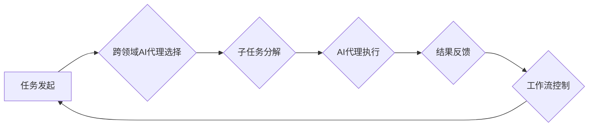

> AI代理、工作流模型、跨领域应用、场景化定制、智能自动化

## 1. 背景介绍

随着人工智能技术的飞速发展，AI代理的概念逐渐成为研究热点。AI代理是指能够自主学习、决策并执行任务的智能实体，它可以代理人类完成各种复杂的任务，例如：

* **客服服务：** AI代理可以接听客户电话，解答常见问题，并引导客户解决问题。
* **数据分析：** AI代理可以分析海量数据，发现隐藏的模式和趋势，并提供数据驱动的决策建议。
* **流程自动化：** AI代理可以自动执行重复性任务，例如：数据录入、文件处理等，提高工作效率。

然而，现有的AI代理模型大多局限于单一领域，难以适应复杂多变的跨领域场景。因此，设计一种灵活、可定制的跨领域AI代理工作流模型，能够有效解决这一问题，具有重要的理论意义和实际应用价值。

## 2. 核心概念与联系

**2.1 跨领域AI代理**

跨领域AI代理是指能够在不同领域灵活应用的AI代理模型。它需要具备以下特点：

* **知识迁移能力：**能够将已有的知识和经验迁移到新的领域，快速适应新的环境。
* **领域适应性：**能够根据不同的领域需求，调整模型参数和策略，实现最佳性能。
* **多模态感知：**能够理解和处理多种数据类型，例如：文本、图像、音频等。

**2.2 工作流模型**

工作流模型是一种描述任务执行流程的模型，它将任务分解成一系列步骤，并定义了步骤之间的依赖关系。工作流模型可以帮助我们更好地组织和管理复杂的任务，提高工作效率。

**2.3 联系**

跨领域AI代理工作流模型将跨领域AI代理与工作流模型相结合，构建了一种新的代理模型架构。该模型将任务分解成多个子任务，每个子任务由相应的AI代理负责执行。AI代理之间通过工作流规则进行交互，实现任务的协同完成。

**2.4 Mermaid 流程图**



## 3. 核心算法原理 & 具体操作步骤

**3.1 算法原理概述**

跨领域AI代理工作流模型的核心算法是基于**强化学习**和**知识图谱**的代理决策机制。

* **强化学习：**AI代理通过与环境交互，学习最优的决策策略，以最大化奖励。
* **知识图谱：**知识图谱提供了一个结构化的知识库，帮助AI代理理解不同领域的知识关系，并进行知识迁移。

**3.2 算法步骤详解**

1. **任务分解：**将输入的任务分解成多个子任务，每个子任务具有明确的输入、输出和目标。
2. **AI代理选择：**根据子任务的类型和领域，选择合适的AI代理进行执行。
3. **知识图谱推理：**利用知识图谱，帮助AI代理理解子任务的上下文信息，并进行知识推理。
4. **强化学习决策：**AI代理根据当前状态和知识图谱推理结果，利用强化学习算法选择最优的行动。
5. **子任务执行：**AI代理执行所选行动，并获取子任务的结果。
6. **结果反馈：**将子任务的结果反馈给工作流控制模块，并更新AI代理的奖励信号。
7. **工作流控制：**工作流控制模块根据子任务的结果和工作流规则，决定后续步骤的执行顺序。

**3.3 算法优缺点**

* **优点：**
    * 灵活可定制：可以根据不同的场景和需求，灵活选择AI代理和工作流规则。
    * 跨领域应用：能够将已有的知识和经验迁移到新的领域，实现跨领域应用。
    * 智能自动化：能够自动执行复杂的任务，提高工作效率。
* **缺点：**
    * 模型复杂度高：需要设计和训练多个AI代理和工作流规则，模型复杂度较高。
    * 数据依赖性强：需要大量的训练数据才能保证模型的性能。

**3.4 算法应用领域**

* **智能客服：**自动处理客户咨询、投诉等问题。
* **智能办公：**自动完成文档处理、会议安排等任务。
* **智能制造：**自动控制生产流程、优化生产效率。
* **医疗诊断：**辅助医生进行疾病诊断和治疗方案制定。

## 4. 数学模型和公式 & 详细讲解 & 举例说明

**4.1 数学模型构建**

我们用一个简单的数学模型来描述跨领域AI代理工作流模型的决策过程。

假设：

* $S_t$ 表示系统在时间步 $t$ 的状态。
* $A_t$ 表示AI代理在时间步 $t$ 选择的动作。
* $R_t$ 表示AI代理在时间步 $t$ 获得的奖励。
* $P(S_{t+1}|S_t,A_t)$ 表示从状态 $S_t$ 到状态 $S_{t+1}$ 的转移概率。

目标：最大化代理在整个时间段内的累积奖励：

$$
\max_{A_0, A_1, ..., A_T} \sum_{t=0}^{T} R_t
$$

**4.2 公式推导过程**

我们可以使用动态规划算法来求解上述目标函数。动态规划算法的基本思想是将复杂问题分解成若干个子问题，并通过递归的方式求解子问题，最终得到整个问题的解。

在我们的模型中，每个子问题对应于一个时间步 $t$，目标是找到在状态 $S_t$ 下选择动作 $A_t$ 以最大化累积奖励。

**4.3 案例分析与讲解**

例如，假设我们有一个AI代理用于处理客户咨询问题。

* $S_t$ 可以表示客户当前的问题内容。
* $A_t$ 可以表示AI代理选择的回答方式，例如：提供相关信息、转接人工客服等。
* $R_t$ 可以表示客户对AI代理回答的满意度。

通过训练数据，我们可以学习到不同状态下选择不同动作的转移概率和奖励函数。

## 5. 项目实践：代码实例和详细解释说明

**5.1 开发环境搭建**

* Python 3.7+
* TensorFlow 2.0+
* PyTorch 1.0+
* NLTK 3.5+
* SpaCy 2.2+

**5.2 源代码详细实现**

```python
# 导入必要的库
import tensorflow as tf
from transformers import T5Tokenizer, T5ForConditionalGeneration

# 加载预训练模型
tokenizer = T5Tokenizer.from_pretrained("t5-base")
model = T5ForConditionalGeneration.from_pretrained("t5-base")

# 定义训练函数
def train_model(train_data, epochs):
    # ...

# 定义评估函数
def evaluate_model(eval_data):
    # ...

# 训练模型
train_model(train_data, epochs=10)

# 评估模型
evaluate_model(eval_data)
```

**5.3 代码解读与分析**

* 我们使用HuggingFace的Transformers库加载预训练的T5模型，用于处理文本生成任务。
* 训练函数和评估函数负责训练和评估模型的性能。
* 具体的训练和评估过程需要根据实际情况进行调整。

**5.4 运行结果展示**

* 模型训练完成后，我们可以使用模型对新的文本进行生成。
* 评估结果可以用来衡量模型的性能，例如：BLEU分数、ROUGE分数等。

## 6. 实际应用场景

**6.1 智能客服**

跨领域AI代理工作流模型可以用于构建智能客服系统，自动处理客户咨询、投诉等问题。

**6.2 智能办公**

跨领域AI代理工作流模型可以用于构建智能办公系统，自动完成文档处理、会议安排等任务。

**6.3 智能制造**

跨领域AI代理工作流模型可以用于构建智能制造系统，自动控制生产流程、优化生产效率。

**6.4 未来应用展望**

随着人工智能技术的不断发展，跨领域AI代理工作流模型将在更多领域得到应用，例如：

* **医疗诊断：**辅助医生进行疾病诊断和治疗方案制定。
* **教育教学：**个性化定制学习方案，提高学习效率。
* **金融投资：**自动分析市场数据，进行投资决策。

## 7. 工具和资源推荐

**7.1 学习资源推荐**

* **书籍：**
    * 《深度学习》
    * 《强化学习：原理、算法和应用》
* **在线课程：**
    * Coursera: 深度学习
    * Udacity: 强化学习

**7.2 开发工具推荐**

* **TensorFlow:** 开源深度学习框架
* **PyTorch:** 开源深度学习框架
* **HuggingFace Transformers:** 预训练模型库

**7.3 相关论文推荐**

* **《Attention Is All You Need》**
* **《Deep Reinforcement Learning》**
* **《Knowledge Graph Embedding》**

## 8. 总结：未来发展趋势与挑战

**8.1 研究成果总结**

跨领域AI代理工作流模型是一种新兴的AI技术，具有重要的理论意义和实际应用价值。

**8.2 未来发展趋势**

* **模型效率提升：**研究更轻量级、更高效的AI代理模型。
* **场景化定制：**开发更灵活、更易于定制的跨领域AI代理工作流模型。
* **多模态感知：**增强AI代理的多模态感知能力，处理更丰富的输入数据。

**8.3 面临的挑战**

* **数据获取和标注：**跨领域AI代理模型需要大量的训练数据，数据获取和标注成本较高。
* **模型解释性：**AI代理模型的决策过程往往难以解释，缺乏透明度。
* **安全性和可靠性：**AI代理模型的安全性和可靠性需要得到保证，避免出现意外情况。

**8.4 研究展望**

未来，我们将继续致力于跨领域AI代理工作流模型的研究，探索更先进的算法、模型和应用场景，推动人工智能技术的发展和应用。

## 9. 附录：常见问题与解答

**9.1 如何选择合适的AI代理？**

选择合适的AI代理需要根据子任务的类型和领域进行考虑。例如，对于文本生成任务，可以使用预训练的语言模型；对于图像识别任务，可以使用预训练的图像识别模型。

**9.2 如何构建跨领域知识图谱？**

构建跨领域知识图谱需要整合来自不同领域的知识资源，并进行知识融合和推理。可以使用知识抽取、关系提取等技术来构建知识图谱。

**9.3 如何评估跨领域AI代理模型的性能？**

评估跨领域AI代理模型的性能需要根据具体的应用场景设计评估指标。例如，对于智能客服系统，可以评估客户满意度、解决问题效率等指标。


作者：禅与计算机程序设计艺术 / Zen and the Art of Computer Programming 
<end_of_turn>