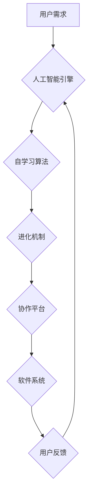

> 软件 2.0, 人工智能, 自学习, 进化, 协作, 泛在计算, 虚拟现实, 增强现实

## 1. 背景介绍

我们生活在一个软件定义的世界。从智能手机到自动驾驶汽车，从医疗诊断到金融交易，软件无处不在，深刻地影响着我们的生活。然而，现有的软件开发模式面临着诸多挑战：

* **复杂性爆炸:** 软件系统越来越复杂，开发、维护和更新成本不断上升。
* **迭代周期长:** 软件开发周期漫长，难以适应快速变化的市场需求。
* **可维护性差:** 软件代码难以理解和维护，导致软件缺陷和安全漏洞的风险增加。
* **缺乏灵活性:** 现有的软件系统难以适应新的环境和需求，缺乏自适应和学习的能力。

为了解决这些问题，我们需要一个全新的软件开发 paradigm，一个能够更好地适应未来世界需求的软件 2.0。

## 2. 核心概念与联系

软件 2.0 的核心概念是将人工智能、自学习、进化和协作等技术融入到软件开发流程中，构建出更加智能、灵活、自适应的软件系统。

**软件 2.0 架构**



**核心概念解释:**

* **人工智能引擎:**  利用机器学习、深度学习等人工智能技术，赋予软件系统智能决策和学习能力。
* **自学习算法:**  使软件系统能够从数据中学习，不断优化自身性能和功能。
* **进化机制:**  通过模拟自然进化过程，引导软件系统不断迭代和改进。
* **协作平台:**  提供一个平台，让不同软件系统之间进行协作和数据共享。

## 3. 核心算法原理 & 具体操作步骤

### 3.1  算法原理概述

软件 2.0 的核心算法原理主要包括：

* **强化学习:**  通过奖励和惩罚机制，训练软件系统做出最优决策。
* **进化算法:**  模拟自然进化过程，通过选择、交叉和变异操作，优化软件系统的结构和功能。
* **迁移学习:**  利用已有的知识和经验，帮助软件系统快速适应新的环境和任务。

### 3.2  算法步骤详解

**强化学习算法步骤:**

1. **环境建模:**  构建一个模拟真实世界的环境模型。
2. **状态定义:**  定义软件系统在不同环境状态下的表现形式。
3. **动作空间:**  定义软件系统可以执行的动作。
4. **奖励函数:**  设计一个奖励函数，根据软件系统的行为给予奖励或惩罚。
5. **策略学习:**  利用强化学习算法，训练软件系统学习最优策略，最大化奖励。

**进化算法步骤:**

1. **种群初始化:**  随机生成一个软件系统的初始种群。
2. **适应度评估:**  根据软件系统的性能和功能，评估每个个体的适应度。
3. **选择操作:**  根据适应度，选择部分个体进行下一代的繁殖。
4. **交叉操作:**  将选中的个体进行交叉操作，产生新的个体。
5. **变异操作:**  对新的个体进行变异操作，增加遗传多样性。
6. **重复步骤2-5:**  重复以上步骤，直到达到预设的进化目标。

### 3.3  算法优缺点

**强化学习算法:**

* **优点:**  能够学习复杂的决策策略，适应动态变化的环境。
* **缺点:**  训练过程需要大量数据和计算资源，容易陷入局部最优。

**进化算法:**

* **优点:**  能够探索更广阔的搜索空间，找到全局最优解。
* **缺点:**  收敛速度较慢，需要大量的计算资源。

### 3.4  算法应用领域

* **软件自动生成:**  利用强化学习和进化算法，自动生成软件代码。
* **软件缺陷修复:**  利用强化学习和进化算法，自动修复软件缺陷。
* **软件性能优化:**  利用强化学习和进化算法，优化软件性能和效率。

## 4. 数学模型和公式 & 详细讲解 & 举例说明

### 4.1  数学模型构建

强化学习算法的核心是马尔可夫决策过程 (MDP)。MDP 模型由以下几个要素组成:

* **状态空间 (S):**  软件系统可能处于的所有状态。
* **动作空间 (A):**  软件系统可以执行的所有动作。
* **转移概率 (P):**  从一个状态到另一个状态的概率。
* **奖励函数 (R):**  软件系统在某个状态执行某个动作后获得的奖励。

### 4.2  公式推导过程

强化学习算法的目标是找到一个最优策略 π，使得软件系统在所有状态下执行最优动作，从而最大化累积奖励。最优策略可以通过动态规划或蒙特卡罗方法来求解。

**Bellman 方程:**

$$
V^{\pi}(s) = \max_a \left[ R(s,a) + \gamma \sum_{s'} P(s'|s,a) V^{\pi}(s') \right]
$$

其中:

* $V^{\pi}(s)$ 是状态 $s$ 下按照策略 $\pi$ 的价值函数。
* $R(s,a)$ 是状态 $s$ 下执行动作 $a$ 后获得的奖励。
* $\gamma$ 是折扣因子，控制未来奖励的权重。
* $P(s'|s,a)$ 是从状态 $s$ 执行动作 $a$ 到状态 $s'$ 的转移概率。

### 4.3  案例分析与讲解

例如，训练一个软件系统自动驾驶汽车，我们可以将状态空间定义为汽车周围的环境信息，动作空间定义为汽车可以执行的动作（例如加速、减速、转向），奖励函数定义为安全行驶和到达目的地的时间。通过强化学习算法，我们可以训练汽车学习最优驾驶策略，从而实现自动驾驶功能。

## 5. 项目实践：代码实例和详细解释说明

### 5.1  开发环境搭建

* 操作系统: Ubuntu 20.04
* 编程语言: Python 3.8
* 软件包: TensorFlow, PyTorch, NumPy, Pandas

### 5.2  源代码详细实现

```python
# 强化学习算法示例代码

import tensorflow as tf

# 定义神经网络模型
model = tf.keras.models.Sequential([
    tf.keras.layers.Dense(128, activation='relu', input_shape=(input_size,)),
    tf.keras.layers.Dense(64, activation='relu'),
    tf.keras.layers.Dense(output_size)
])

# 定义损失函数和优化器
optimizer = tf.keras.optimizers.Adam()
loss_fn = tf.keras.losses.MeanSquaredError()

# 训练模型
for epoch in range(num_epochs):
    for batch in dataset:
        with tf.GradientTape() as tape:
            predictions = model(batch['input'])
            loss = loss_fn(batch['target'], predictions)
        gradients = tape.gradient(loss, model.trainable_variables)
        optimizer.apply_gradients(zip(gradients, model.trainable_variables))

# 评估模型
loss = loss_fn(test_data['target'], model.predict(test_data['input']))
print('Test Loss:', loss)
```

### 5.3  代码解读与分析

* 代码定义了一个简单的深度神经网络模型，用于预测某个目标值。
* 使用 Adam 优化器和均方误差损失函数进行训练。
* 训练过程迭代地更新模型参数，以最小化预测误差。
* 最后评估模型在测试数据上的性能。

### 5.4  运行结果展示

训练完成后，可以将模型应用于实际场景，例如预测股票价格、识别图像、翻译文本等。

## 6. 实际应用场景

软件 2.0 的应用场景非常广泛，例如:

* **智能家居:**  通过人工智能和自学习算法，智能家居系统可以根据用户的习惯和需求自动调节温度、灯光、安全等。
* **个性化教育:**  利用人工智能和进化算法，个性化教育系统可以根据学生的学习进度和能力，定制个性化的学习方案。
* **医疗诊断:**  利用人工智能和迁移学习算法，医疗诊断系统可以辅助医生进行疾病诊断，提高诊断准确率。

### 6.4  未来应用展望

随着人工智能、自学习和计算能力的不断发展，软件 2.0 将在更多领域得到应用，例如:

* **自动驾驶:**  软件 2.0 将推动自动驾驶技术的突破，实现真正意义上的无人驾驶。
* **机器人:**  软件 2.0 将赋予机器人更强的智能和适应能力，使其能够更好地服务于人类。
* **虚拟现实和增强现实:**  软件 2.0 将使虚拟现实和增强现实体验更加沉浸和逼真。

## 7. 工具和资源推荐

### 7.1  学习资源推荐

* **书籍:**
    * 《深度学习》
    * 《人工智能：一种现代方法》
    * 《软件工程》
* **在线课程:**
    * Coursera: 深度学习
    * edX: 人工智能
    * Udacity: 自动驾驶

### 7.2  开发工具推荐

* **编程语言:** Python, Java, C++
* **机器学习框架:** TensorFlow, PyTorch, scikit-learn
* **版本控制系统:** Git

### 7.3  相关论文推荐

* **强化学习:**
    * Deep Reinforcement Learning: An Overview
    * Proximal Policy Optimization Algorithms
* **进化算法:**
    * A Tutorial on Evolutionary Algorithms
    * Genetic Algorithms in Search, Optimization, and Machine Learning

## 8. 总结：未来发展趋势与挑战

### 8.1  研究成果总结

软件 2.0 的研究取得了显著进展，人工智能、自学习和进化算法等技术已经应用于软件开发领域，取得了令人瞩目的成果。

### 8.2  未来发展趋势

* **更智能的软件系统:**  软件系统将更加智能，能够更好地理解用户需求，并提供个性化的服务。
* **更灵活的软件开发:**  软件开发流程将更加灵活，能够快速适应变化的市场需求。
* **更安全的软件系统:**  软件系统将更加安全，能够有效抵御各种安全威胁。

### 8.3  面临的挑战

* **算法复杂性:**  软件 2.0 的算法非常复杂，需要更强大的计算能力和更先进的算法设计方法。
* **数据安全:**  软件 2.0 需要大量数据进行训练和学习，数据安全问题需要得到有效解决。
* **伦理问题:**  软件 2.0 的发展也带来了一些伦理问题，例如算法偏见、隐私泄露等，需要得到认真思考和解决。

### 8.4  研究展望

未来，软件 2.0 的研究将继续深入，探索更智能、更灵活、更安全的软件系统，为人类社会创造更加美好的未来。

## 9. 附录：常见问题与解答

* **什么是软件 2.0?**

软件 2.0 是指将人工智能、自学习、进化和协作等技术融入到软件开发流程中，构建出更加智能、灵活、自适应的软件系统。

* **软件 2.0 与软件 1.0 的区别是什么?**

软件 1.0 是基于人工编程的，而软件 2.0 是基于人工智能和自学习的。软件 1.0 的开发周期长，难以适应变化的市场需求，而软件 2.0 可以快速适应变化，并不断进化和改进。

* **软件 2.0 的应用场景有哪些?**

软件 2.0 的应用场景非常广泛，例如智能家居、个性化教育、医疗诊断、自动驾驶等。

* **软件 2.0 的未来发展趋势是什么?**

软件 