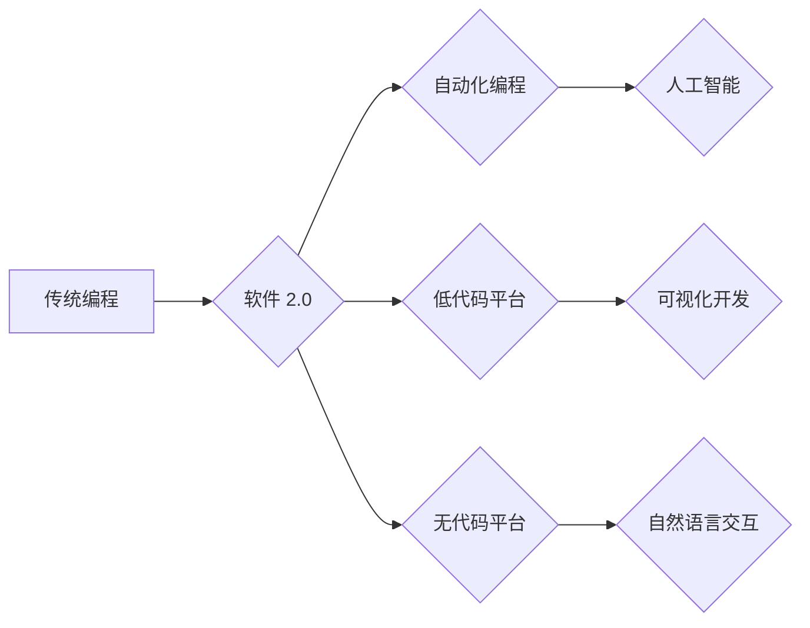

> 软件 2.0, 无代码, 低代码, 自动化编程, 人工智能, 机器学习, 自然语言处理, 元宇宙

## 1. 背景介绍

软件开发行业正处于一个前所未有的变革时期。随着人工智能、机器学习和自然语言处理技术的飞速发展，传统编程范式面临着前所未有的挑战。传统的代码编写方式，需要程序员具备深厚的编程知识和经验，且开发周期长、成本高。为了解决这些问题，软件 2.0 应运而生，它旨在通过自动化、低代码和无代码等技术，降低软件开发的门槛，让更多人能够参与到软件开发的进程中。

## 2. 核心概念与联系

软件 2.0 的核心概念是将软件开发的流程自动化，并通过图形化界面和自然语言交互，让非程序员也能轻松构建软件。

**软件 2.0 架构**



**核心概念联系:**

* **自动化编程:** 利用人工智能和机器学习技术，自动生成代码，减少人工干预。
* **低代码平台:** 提供可视化开发环境和预构建组件，让开发人员只需编写少量代码即可构建应用程序。
* **无代码平台:** 完全无需编写代码，通过拖放组件和配置参数即可构建应用程序。
* **人工智能:** 在软件 2.0 中扮演着至关重要的角色，用于代码生成、代码优化、缺陷检测等方面。
* **自然语言交互:** 允许用户使用自然语言与软件进行交互，简化开发流程。

## 3. 核心算法原理 & 具体操作步骤

### 3.1  算法原理概述

软件 2.0 的核心算法原理主要包括：

* **代码生成算法:** 基于自然语言处理和机器学习技术，分析用户需求和代码示例，自动生成代码。
* **代码优化算法:** 利用人工智能算法，分析代码结构和性能，自动优化代码，提高效率和可读性。
* **缺陷检测算法:** 基于机器学习模型，识别代码中的潜在缺陷和错误，帮助开发人员提高代码质量。

### 3.2  算法步骤详解

**代码生成算法步骤:**

1. **需求分析:** 首先，需要对用户的软件需求进行分析，理解用户的目标和功能需求。
2. **代码示例收集:** 收集大量的代码示例，作为训练数据，用于训练代码生成模型。
3. **模型训练:** 利用机器学习算法，训练代码生成模型，使其能够根据用户需求生成相应的代码。
4. **代码生成:** 用户输入软件需求，模型根据训练数据生成相应的代码。
5. **代码验证:** 生成代码需要进行验证，确保代码能够正常运行并满足用户需求。

**代码优化算法步骤:**

1. **代码分析:** 对代码进行语法分析和语义分析，理解代码结构和功能。
2. **性能评估:** 对代码进行性能测试，评估代码的执行效率和资源消耗。
3. **优化策略:** 根据代码分析和性能评估结果，制定相应的代码优化策略。
4. **代码修改:** 根据优化策略，修改代码，提高代码效率和可读性。
5. **性能测试:** 对优化后的代码进行性能测试，验证优化效果。

### 3.3  算法优缺点

**代码生成算法:**

* **优点:** 提高开发效率，降低开发成本，降低开发门槛。
* **缺点:** 生成的代码可能存在质量问题，需要进行人工验证和修改。

**代码优化算法:**

* **优点:** 提高代码效率和可读性，降低代码维护成本。
* **缺点:** 优化算法的复杂度较高，需要专业的技术人员进行操作。

### 3.4  算法应用领域

* **Web 开发:** 自动生成网页代码、优化网页性能。
* **移动应用开发:** 自动生成移动应用代码、优化移动应用性能。
* **数据科学:** 自动生成数据分析代码、优化数据处理流程。
* **人工智能:** 自动生成人工智能模型代码、优化人工智能模型性能。

## 4. 数学模型和公式 & 详细讲解 & 举例说明

### 4.1  数学模型构建

代码生成算法通常基于统计语言模型，例如 n-gram 模型和 Transformer 模型。

**n-gram 模型:**

n-gram 模型是一种统计语言模型，它基于词序列的统计信息来预测下一个词。例如，一个二元语法模型 (bigram) 可以根据前一个词预测下一个词。

**Transformer 模型:**

Transformer 模型是一种更先进的语言模型，它利用注意力机制来捕捉词之间的长距离依赖关系。

### 4.2  公式推导过程

**n-gram 模型概率计算公式:**

$$P(w_i|w_{i-n+1}, w_{i-n+2}, ..., w_{i-1}) = \frac{C(w_{i-n+1}, w_{i-n+2}, ..., w_{i-1}, w_i)}{C(w_{i-n+1}, w_{i-n+2}, ..., w_{i-1})}$$

其中:

* $w_i$ 是第 i 个词
* $C(w_{i-n+1}, w_{i-n+2}, ..., w_{i-1}, w_i)$ 是词序列 $(w_{i-n+1}, w_{i-n+2}, ..., w_{i-1}, w_i)$ 出现的次数
* $C(w_{i-n+1}, w_{i-n+2}, ..., w_{i-1})$ 是词序列 $(w_{i-n+1}, w_{i-n+2}, ..., w_{i-1})$ 出现的次数

**Transformer 模型注意力机制公式:**

$$Attention(Q, K, V) = softmax(\frac{QK^T}{\sqrt{d_k}})V$$

其中:

* $Q$, $K$, $V$ 分别是查询矩阵、键矩阵和值矩阵
* $d_k$ 是键向量的维度
* $softmax$ 函数将注意力权重归一化

### 4.3  案例分析与讲解

**n-gram 模型案例:**

假设我们有一个训练语料库，包含以下句子:

* "The cat sat on the mat."
* "The dog chased the ball."

我们可以使用二元语法模型来预测句子 "The cat sat" 之后的词。根据训练语料库，我们可以计算出以下概率:

* $P(on|The cat) = \frac{1}{1} = 1$
* $P(chased|The cat) = \frac{0}{1} = 0$

因此，根据 n-gram 模型，预测 "The cat sat" 之后的词是 "on"。

**Transformer 模型案例:**

Transformer 模型可以处理更长的句子，并捕捉词之间的长距离依赖关系。例如，在句子 "The cat sat on the mat. The dog chased the ball." 中，Transformer 模型可以理解 "the mat" 和 "the ball" 之间的关系，即使它们相隔较远。

## 5. 项目实践：代码实例和详细解释说明

### 5.1  开发环境搭建

* Python 3.x
* TensorFlow 或 PyTorch
* Jupyter Notebook

### 5.2  源代码详细实现

```python
# 代码生成示例 (使用 GPT-2 模型)

from transformers import pipeline

generator = pipeline('text-generation', model='gpt2')

prompt = "写一个简单的 Python 函数，计算两个数的和。"

output = generator(prompt, max_length=100, num_return_sequences=1)[0]['generated_text']

print(output)
```

### 5.3  代码解读与分析

* 我们使用 transformers 库加载 GPT-2 模型，并创建一个文本生成器。
* 我们提供一个提示文本，要求生成一个 Python 函数，计算两个数的和。
* 模型根据提示文本和训练数据生成代码，并输出结果。

### 5.4  运行结果展示

```python
def sum_two_numbers(a, b):
  return a + b
```

## 6. 实际应用场景

### 6.1  企业级应用

* 自动生成代码文档
* 自动生成测试用例
* 自动生成代码注释

### 6.2  个人开发者应用

* 快速原型开发
* 提高开发效率
* 学习编程

### 6.3  教育领域应用

* 教学辅助工具
* 代码练习平台
* 培养编程思维

### 6.4  未来应用展望

* 更智能的代码生成和优化
* 更广泛的应用场景
* 更易于使用的开发工具

## 7. 工具和资源推荐

### 7.1  学习资源推荐

* **书籍:**
    * "Deep Learning" by Ian Goodfellow, Yoshua Bengio, and Aaron Courville
    * "Hands-On Machine Learning with Scikit-Learn, Keras & TensorFlow" by Aurélien Géron
* **在线课程:**
    * Coursera: Machine Learning by Andrew Ng
    * Udacity: Deep Learning Nanodegree

### 7.2  开发工具推荐

* **低代码平台:**
    * Mendix
    * OutSystems
    * Microsoft Power Apps
* **无代码平台:**
    * Bubble
    * Webflow
    * Zapier

### 7.3  相关论文推荐

* "Attention Is All You Need" by Vaswani et al. (2017)
* "BERT: Pre-training of Deep Bidirectional Transformers for Language Understanding" by Devlin et al. (2018)

## 8. 总结：未来发展趋势与挑战

### 8.1  研究成果总结

软件 2.0 正在改变软件开发的模式，自动化、低代码和无代码技术正在降低软件开发的门槛，让更多人能够参与到软件开发的进程中。

### 8.2  未来发展趋势

* 更智能的代码生成和优化算法
* 更广泛的应用场景
* 更易于使用的开发工具
* 人工智能与软件开发的深度融合

### 8.3  面临的挑战

* 代码质量问题
* 安全性和隐私问题
* 人工智能伦理问题

### 8.4  研究展望

未来，我们需要继续研究更智能的代码生成和优化算法，解决代码质量问题和安全问题，并探索人工智能与软件开发的深度融合，推动软件 2.0 的发展。

## 9. 附录：常见问题与解答

* **Q: 软件 2.0 会取代程序员吗?**

* **A:** 软件 2.0 会改变程序员的工作方式，但不会取代程序员。程序员仍然需要负责软件的设计、架构和测试等工作。

* **Q: 软件 2.0 的安全性如何保证?**

* **A:** 软件 2.0 的安全性需要通过代码审查、漏洞扫描和安全测试等手段来保证。

* **Q: 软件 2.0 的成本如何?**

* **A:** 软件 2.0 的成本取决于具体的应用场景和开发工具。一般来说，软件 2.0 可以降低开发成本，提高开发效率。


作者：禅与计算机程序设计艺术 / Zen and the Art of Computer Programming 
<end_of_turn>