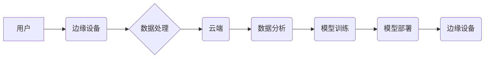

> 云边协同计算、软件2.0、分布式系统、人工智能、边缘计算、数据处理、模型训练

## 1. 背景介绍

随着物联网、大数据、人工智能等技术的蓬勃发展，传统软件架构已难以满足日益增长的计算需求。数据量的爆炸式增长、计算资源的有限性和网络带宽的瓶颈，都对软件系统的性能、效率和可靠性提出了严峻挑战。

云计算作为一种新型的计算模式，凭借其弹性、可扩展性和按需付费的特点，为软件开发提供了新的思路。然而，云计算也存在着数据传输延迟高、网络带宽有限等问题，尤其是在边缘计算场景下，这些问题更加突出。

边缘计算作为云计算的延伸，将计算资源部署到靠近数据源的边缘节点，可以有效降低数据传输延迟，提高计算效率，并为实时应用提供更低延迟的响应。

云边协同计算框架则将云计算和边缘计算相结合，充分利用两者的优势，构建了一种更加灵活、高效、可靠的软件架构。

## 2. 核心概念与联系

云边协同计算框架的核心概念包括：

* **云端:** 提供强大的计算能力、存储资源和数据分析平台，负责处理海量数据、训练机器学习模型等高强度计算任务。
* **边缘端:** 部署在靠近数据源的设备，负责收集、处理和分析本地数据，并根据需要将数据上传到云端进行进一步处理。
* **协同:** 云端和边缘端之间通过网络进行协同工作，共同完成任务。

**云边协同计算框架架构**



## 3. 核心算法原理 & 具体操作步骤

### 3.1  算法原理概述

云边协同计算框架的核心算法包括数据分发、任务调度、模型训练和部署等。

* **数据分发:** 根据数据类型、处理需求和网络条件，将数据分发到云端或边缘端进行处理。
* **任务调度:** 根据任务类型、资源可用性和优先级，将任务分配到合适的计算节点执行。
* **模型训练:** 利用云端的强大计算能力，对海量数据进行训练，构建高精度机器学习模型。
* **模型部署:** 将训练好的模型部署到边缘设备，实现本地数据处理和预测。

### 3.2  算法步骤详解

**数据分发算法:**

1. 收集用户数据并进行预处理。
2. 根据数据类型、处理需求和网络条件，将数据分发到云端或边缘端。
3. 记录数据分发情况，以便后续进行数据追踪和分析。

**任务调度算法:**

1. 收集任务请求并进行分析，确定任务类型、资源需求和优先级。
2. 根据任务调度策略，将任务分配到合适的计算节点执行。
3. 监控任务执行情况，并根据需要进行任务调整和重调度。

**模型训练算法:**

1. 收集训练数据并进行预处理。
2. 选择合适的机器学习模型和训练算法。
3. 利用云端的强大计算能力，对训练数据进行训练，并不断优化模型参数。
4. 评估模型性能，并根据需要进行模型调整和重新训练。

**模型部署算法:**

1. 将训练好的模型转换为可部署的格式。
2. 将模型部署到边缘设备，并配置相应的运行环境。
3. 监控模型运行情况，并根据需要进行模型更新和维护。

### 3.3  算法优缺点

**优点:**

* **高效性:** 利用云端和边缘端的协同计算，提高数据处理效率和任务执行速度。
* **可靠性:** 数据在云端和边缘端进行备份和冗余，提高系统可靠性和容错能力。
* **灵活性:** 根据实际需求，灵活调整数据分发、任务调度和模型部署策略。

**缺点:**

* **复杂性:** 云边协同计算框架的架构和算法较为复杂，需要专业的技术人员进行设计和维护。
* **安全风险:** 数据在云端和边缘端之间传输，存在安全风险，需要采取相应的安全措施进行保护。
* **成本:** 云边协同计算框架的部署和维护成本较高，需要进行成本效益分析。

### 3.4  算法应用领域

云边协同计算框架在以下领域具有广泛的应用前景:

* **物联网:** 处理海量物联网数据，实现智能感知、控制和决策。
* **工业互联网:** 优化工业生产流程，提高生产效率和产品质量。
* **智慧城市:** 建立智慧交通、智慧医疗、智慧安防等城市应用。
* **自动驾驶:** 处理车辆传感器数据，实现自动驾驶功能。
* **人工智能:** 训练和部署机器学习模型，实现智能语音识别、图像识别、自然语言处理等应用。

## 4. 数学模型和公式 & 详细讲解 & 举例说明

### 4.1  数学模型构建

云边协同计算框架的性能评估可以采用以下数学模型:

**数据处理延迟:**

$$T_{delay} = T_{edge} + T_{cloud}$$

其中:

* $T_{delay}$: 数据处理延迟
* $T_{edge}$: 边缘端数据处理时间
* $T_{cloud}$: 云端数据处理时间

**计算资源利用率:**

$$U_{resource} = \frac{T_{used}}{T_{total}}$$

其中:

* $U_{resource}$: 计算资源利用率
* $T_{used}$: 实际使用计算资源的时间
* $T_{total}$: 总的计算时间

### 4.2  公式推导过程

数据处理延迟公式的推导过程如下:

1. 数据从用户设备传输到边缘设备的时间为 $T_{edge\_transmit}$。
2. 数据在边缘设备进行处理的时间为 $T_{edge}$。
3. 数据从边缘设备传输到云端的时间为 $T_{cloud\_transmit}$。
4. 数据在云端进行处理的时间为 $T_{cloud}$。

因此，总的延迟时间为:

$$T_{delay} = T_{edge\_transmit} + T_{edge} + T_{cloud\_transmit} + T_{cloud}$$

由于 $T_{edge\_transmit}$ 和 $T_{cloud\_transmit}$ 通常远小于 $T_{edge}$ 和 $T_{cloud}$，因此可以忽略这两个时间项，得到简化的延迟公式:

$$T_{delay} = T_{edge} + T_{cloud}$$

### 4.3  案例分析与讲解

假设一个物联网应用场景，需要实时监测温度和湿度数据，并根据数据进行控制。

* **边缘端:** 部署在温度和湿度传感器附近的设备，负责收集数据并进行初步处理。
* **云端:** 负责存储数据、进行数据分析和模型训练。

如果数据处理延迟过高，会导致控制动作延迟，影响应用效果。

通过云边协同计算框架，可以将数据处理任务分发到边缘端和云端，降低数据传输延迟，提高控制响应速度。

## 5. 项目实践：代码实例和详细解释说明

### 5.1  开发环境搭建

* 操作系统: Ubuntu 20.04
* 编程语言: Python 3.8
* 软件框架: TensorFlow 2.0, Flask

### 5.2  源代码详细实现

```python
# 边缘端代码示例
from flask import Flask, request, jsonify
import tensorflow as tf

app = Flask(__name__)

# 加载模型
model = tf.keras.models.load_model('model.h5')

@app.route('/predict', methods=['POST'])
def predict():
    data = request.get_json()
    # 数据预处理
    processed_data = preprocess(data)
    # 模型预测
    prediction = model.predict(processed_data)
    # 返回预测结果
    return jsonify({'prediction': prediction.tolist()})

if __name__ == '__main__':
    app.run(host='0.0.0.0', port=5000)

# 云端代码示例
from flask import Flask, request, jsonify
import tensorflow as tf

app = Flask(__name__)

# 加载模型
model = tf.keras.models.load_model('model.h5')

@app.route('/train', methods=['POST'])
def train():
    data = request.get_json()
    # 数据预处理
    processed_data = preprocess(data)
    # 模型训练
    model.fit(processed_data, epochs=10)
    # 返回训练结果
    return jsonify({'status': 'success'})

if __name__ == '__main__':
    app.run(host='0.0.0.0', port=5001)
```

### 5.3  代码解读与分析

* **边缘端代码:**
    * 使用 Flask 框架构建一个简单的 API，提供数据预测服务。
    * 加载预训练的 TensorFlow 模型。
    * 接收用户请求，进行数据预处理，并使用模型进行预测。
    * 返回预测结果。
* **云端代码:**
    * 使用 Flask 框架构建一个简单的 API，提供模型训练服务。
    * 接收用户请求，进行数据预处理，并使用模型进行训练。
    * 返回训练结果。

### 5.4  运行结果展示

* **边缘端:** 运行边缘端代码，访问 `http://localhost:5000/predict` 接口，可以进行数据预测。
* **云端:** 运行云端代码，访问 `http://localhost:5001/train` 接口，可以进行模型训练。

## 6. 实际应用场景

### 6.1  智慧医疗

* **远程诊断:** 利用云边协同计算框架，将患者的医疗影像数据传输到云端进行诊断，并由专家医生进行远程诊断。
* **智能辅助手术:** 在手术过程中，利用边缘设备收集手术数据，并通过云端进行分析和预测，为医生提供智能辅助。

### 6.2  智慧交通

* **智能交通信号灯:** 利用边缘设备收集交通流量数据，并通过云端进行分析和优化，实现智能交通信号灯控制。
* **自动驾驶:** 利用边缘设备收集车辆传感器数据，并通过云端进行模型训练和部署，实现自动驾驶功能。

### 6.3  工业互联网

* **设备故障预测:** 利用边缘设备收集设备运行数据，并通过云端进行分析和预测，提前预警设备故障。
* **生产过程优化:** 利用边缘设备收集生产过程数据，并通过云端进行分析和优化，提高生产效率和产品质量。

### 6.4  未来应用展望

云边协同计算框架在未来将有更广泛的应用前景，例如:

* **边缘人工智能:** 将人工智能模型部署到边缘设备，实现更低延迟、更高效率的智能应用。
* **工业互联网 5.0:** 构建更加智能、高效、可持续的工业生产系统。
* **数字孪生:** 建立数字孪生系统，实现虚拟世界与现实世界的实时交互。

## 7. 工具和资源推荐

### 7.1  学习资源推荐

* **书籍:**
    * 《云计算架构》
    * 《边缘计算》
    * 《深度学习》
* **在线课程:**
    * Coursera: 云计算、边缘计算、深度学习
    * edX: 云计算、边缘计算、深度学习
* **博客:**
    * 云计算博客
    * 边缘计算博客
    * 深度学习博客

### 7.2  开发工具推荐

* **云平台:**
    * AWS
    * Azure
    * Google Cloud Platform
* **边缘计算平台:**
    * Kubernetes
    * Docker
    * EdgeX Foundry
* **机器学习框架:**
    * TensorFlow
    * PyTorch
    * scikit-learn

### 7.3  相关论文推荐

* **云边协同计算:**
    * "Cloud-Edge Collaborative Computing: A Survey"
    * "Edge Computing: