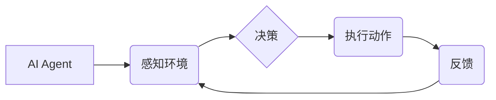

> AI Agent, 具身智能, 强化学习, 深度学习, 计算机视觉, 自然语言处理, 机器人

## 1. 背景介绍

人工智能（AI）技术近年来取得了飞速发展，从语音识别、图像识别到自然语言处理等领域取得了突破性进展。然而，现有的AI模型大多局限于数字世界，缺乏与物理世界直接交互的能力。具身智能（Embodied Intelligence）作为AI发展的新方向，旨在赋予AI实体，使其能够感知、理解和交互于物理世界。

具身智能的核心在于将AI与机器人、传感器、 actuators等物理设备相结合，使其能够感知环境、做出决策并执行动作。这将使AI能够更深入地理解世界，并更好地服务于人类。

## 2. 核心概念与联系

**2.1 AI Agent**

AI Agent是一个能够感知环境、做出决策并执行动作的智能体。它可以是软件程序、机器人或其他任何能够自主行动的实体。

**2.2 具身智能**

具身智能是指将AI Agent与物理世界相结合，使其能够感知、理解和交互于物理环境。

**2.3 强化学习**

强化学习是一种机器学习方法，通过奖励和惩罚机制训练AI Agent，使其在特定环境中学习最优策略。

**2.4 深度学习**

深度学习是一种基于人工神经网络的机器学习方法，能够学习复杂的数据模式。

**2.5 计算机视觉**

计算机视觉是赋予计算机“看”的能力，使其能够理解和解释图像和视频。

**2.6 自然语言处理**

自然语言处理是使计算机能够理解和处理人类语言的技术。

**2.7 机器人**

机器人是一种能够执行特定任务的物理实体，通常由传感器、 actuators和控制系统组成。

**2.8  架构图**



## 3. 核心算法原理 & 具体操作步骤

### 3.1  算法原理概述

具身智能的核心算法是强化学习。强化学习算法通过一个代理（AI Agent）与环境交互，学习一个策略，以最大化累积的奖励。

**3.1.1  状态（State）**

环境的当前状态，例如机器人位置、目标位置等。

**3.1.2  动作（Action）**

代理可以执行的动作，例如移动、抓取等。

**3.1.3  奖励（Reward）**

代理执行动作后获得的反馈，可以是正向奖励或负向奖励。

**3.1.4  策略（Policy）**

代理根据当前状态选择动作的规则。

### 3.2  算法步骤详解

1. **初始化:** 设置初始状态、动作空间、奖励函数和策略。
2. **感知环境:** 代理感知环境并获取当前状态。
3. **选择动作:** 根据策略选择一个动作。
4. **执行动作:** 代理执行动作并进入新的状态。
5. **获得奖励:** 根据新的状态和执行的动作获得奖励。
6. **更新策略:** 根据奖励更新策略，使代理在未来能够选择更优的动作。
7. **重复步骤2-6:** 直到代理达到目标或训练结束。

### 3.3  算法优缺点

**优点:**

* 可以学习复杂的行为。
* 不需要明确的规则，可以从数据中学习。
* 可以适应变化的环境。

**缺点:**

* 训练时间长，需要大量的样本数据。
* 奖励函数的设计对算法性能影响很大。
* 难以解释算法的决策过程。

### 3.4  算法应用领域

* 机器人控制
* 游戏 AI
* 自动驾驶
* 个性化推荐

## 4. 数学模型和公式 & 详细讲解 & 举例说明

### 4.1  数学模型构建

强化学习的数学模型可以表示为一个马尔可夫决策过程（MDP）。

**MDP 定义:**

* 状态空间 S
* 动作空间 A
* 状态转移概率 P(s', r | s, a)
* 奖励函数 R(s, a)
* 折扣因子 γ

**目标:**

找到一个策略 π(a | s)，使得代理在所有状态下选择动作，以最大化累积的奖励。

### 4.2  公式推导过程

**Bellman 方程:**

$$
V^{\pi}(s) = \max_a \left[ R(s, a) + \gamma \sum_{s'} P(s' | s, a) V^{\pi}(s') \right]
$$

**其中:**

* V^{\pi}(s) 是策略 π 下状态 s 的价值函数。
* R(s, a) 是状态 s 下执行动作 a 的奖励。
* γ 是折扣因子，控制未来奖励的权重。
* P(s' | s, a) 是从状态 s 执行动作 a 到状态 s' 的转移概率。

### 4.3  案例分析与讲解

**举例:**

一个机器人需要在迷宫中找到出口。

* 状态空间 S: 迷宫中的所有位置。
* 动作空间 A: 向上、向下、向左、向右移动。
* 奖励函数 R(s, a): 如果机器人到达出口，奖励为 100，否则为 0。
* 折扣因子 γ: 0.9

通过 Bellman 方程，我们可以迭代地计算每个状态的价值函数，并找到最优策略，使机器人能够找到出口。

## 5. 项目实践：代码实例和详细解释说明

### 5.1  开发环境搭建

* Python 3.x
* TensorFlow 或 PyTorch
* ROS (Robot Operating System)

### 5.2  源代码详细实现

```python
import gym
import numpy as np

# 定义环境
env = gym.make('CartPole-v1')

# 定义策略网络
class PolicyNetwork(nn.Module):
    def __init__(self):
        super(PolicyNetwork, self).__init__()
        # ...

    def forward(self, state):
        # ...

# 定义强化学习算法
class Agent:
    def __init__(self):
        # ...

    def train(self):
        # ...

# 创建代理
agent = Agent()

# 训练代理
for episode in range(1000):
    state = env.reset()
    done = False
    while not done:
        # 选择动作
        action = agent.choose_action(state)
        # 执行动作
        next_state, reward, done, _ = env.step(action)
        # 更新代理
        agent.update(state, action, reward, next_state, done)
        state = next_state

# 测试代理
state = env.reset()
while True:
    # 选择动作
    action = agent.choose_action(state)
    # 执行动作
    next_state, reward, done, _ = env.step(action)
    # 显示环境
    env.render()
    if done:
        break
    state = next_state

env.close()
```

### 5.3  代码解读与分析

* 代码定义了一个 CartPole-v1 环境，这是一个经典的强化学习环境。
* 代码定义了一个策略网络，用于预测动作概率。
* 代码定义了一个强化学习算法，用于训练代理。
* 代码训练代理，使其能够控制 CartPole 不倒下。
* 代码测试代理，使其能够在环境中持续运行。

### 5.4  运行结果展示

运行代码后，可以观察到代理能够控制 CartPole 不倒下，并持续运行一段时间。

## 6. 实际应用场景

### 6.1  机器人控制

具身智能可以用于控制机器人执行复杂的任务，例如：

* 物体抓取和搬运
* 导航和路径规划
* 人机交互

### 6.2  自动驾驶

具身智能可以用于开发自动驾驶系统，使其能够感知周围环境、做出决策并控制车辆。

### 6.3  医疗保健

具身智能可以用于开发医疗机器人，协助医生进行手术、护理患者等。

### 6.4  未来应用展望

具身智能的应用前景广阔，未来可能在更多领域得到应用，例如：

* 教育
* 娱乐
* 安全

## 7. 工具和资源推荐

### 7.1  学习资源推荐

* **书籍:**
    * 《Reinforcement Learning: An Introduction》
    * 《Deep Reinforcement Learning Hands-On》
* **在线课程:**
    * Coursera: Reinforcement Learning Specialization
    * Udacity: Intro to Artificial Intelligence

### 7.2  开发工具推荐

* **Python:** 
    * TensorFlow
    * PyTorch
    * OpenAI Gym
* **ROS:** 
    * Robot Operating System

### 7.3  相关论文推荐

* **Deep Reinforcement Learning with Double Q-learning**
* **Proximal Policy Optimization Algorithms**
* **Asynchronous Methods for Deep Reinforcement Learning**

## 8. 总结：未来发展趋势与挑战

### 8.1  研究成果总结

近年来，具身智能取得了显著进展，例如：

* 深度强化学习算法的突破
* 计算机视觉和自然语言处理技术的进步
* 机器人硬件的不断发展

### 8.2  未来发展趋势

* **更强大的算法:** 
    * 探索更有效的强化学习算法，例如模型免费强化学习。
* **更复杂的场景:** 
    * 将具身智能应用于更复杂的环境，例如多机器人协作、复杂物理交互等。
* **更安全的系统:** 
    * 研究具身智能系统的安全性，确保其在实际应用中能够安全可靠地运行。

### 8.3  面临的挑战

* **数据获取:** 
    * 具身智能需要大量的真实世界数据进行训练，数据获取成本较高。
* **计算资源:** 
    * 训练复杂的具身智能模型需要大量的计算资源。
* **伦理问题:** 
    * 具身智能的应用可能引发伦理问题，例如隐私保护、责任归属等。

### 8.4  研究展望

未来，具身智能将继续朝着更智能、更安全、更可靠的方向发展，并将在更多领域发挥重要作用。


## 9. 附录：常见问题与解答

**Q1: 具身智能与传统AI有什么区别？**

**A1:** 传统AI主要局限于数字世界，而具身智能则将AI与物理世界相结合，使其能够感知、理解和交互于物理环境。

**Q2: 具身智能的应用场景有哪些？**

**A2:** 具身智能的应用场景非常广泛，例如机器人控制、自动驾驶、医疗保健等。

**Q3: 如何学习具身智能？**

**A3:** 可以学习强化学习、计算机视觉、自然语言处理等相关知识，并使用相关的开发工具和平台进行实践。

作者：禅与计算机程序设计艺术 / Zen and the Art of Computer Programming 


<end_of_turn>