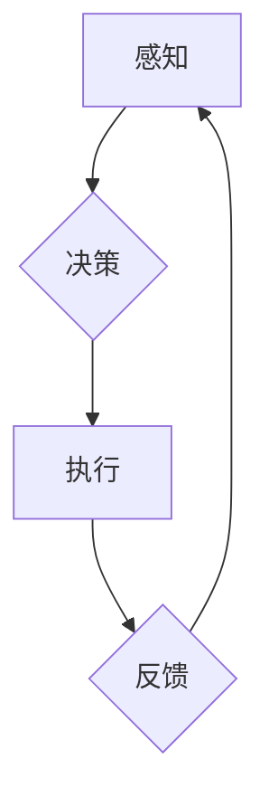

> AI Agent, 智能代理, 强化学习, 决策推理, 知识图谱, 人机交互, 未来趋势

## 1. 背景介绍

人工智能（AI）技术近年来取得了飞速发展，从语音识别、图像识别到自然语言处理，AI已经渗透到我们生活的方方面面。然而，传统的AI模型大多是静态的，缺乏自主学习和决策的能力。随着技术的进步，智能代理（AI Agent）应运而生，它将AI技术与决策推理、知识图谱等技术相结合，赋予AI更强的自主性和适应性。

智能代理是指能够感知环境、做出决策并与环境交互的智能系统。它可以独立完成任务，并根据环境变化不断调整策略，实现更智能化的行为。与传统的AI模型相比，智能代理具有以下特点：

* **自主性:** 智能代理能够独立完成任务，无需人工干预。
* **适应性:** 智能代理能够根据环境变化调整策略，适应不同的场景。
* **交互性:** 智能代理能够与环境和用户进行交互，获取信息并提供服务。

## 2. 核心概念与联系

智能代理的核心概念包括：

* **感知:** 智能代理需要感知环境信息，例如传感器数据、用户输入等。
* **决策:** 智能代理需要根据感知到的信息做出决策，选择最优的行动。
* **执行:** 智能代理需要执行决策，与环境交互并完成任务。
* **学习:** 智能代理需要不断学习和改进，提高决策的准确性和效率。

**智能代理架构**



## 3. 核心算法原理 & 具体操作步骤

### 3.1  算法原理概述

智能代理的决策通常基于强化学习（Reinforcement Learning，RL）算法。强化学习是一种机器学习方法，通过奖励和惩罚机制，训练智能代理学习最优的策略。

在强化学习中，智能代理是一个“学习者”，环境是一个“世界”，智能代理与环境交互，并根据环境的反馈获得奖励或惩罚。智能代理的目标是学习一个策略，使得在与环境交互的过程中获得最大的总奖励。

### 3.2  算法步骤详解

1. **环境建模:** 建立环境模型，描述环境的状态、动作和奖励机制。
2. **策略初始化:** 初始化智能代理的策略，例如随机策略或贪婪策略。
3. **环境交互:** 智能代理与环境交互，根据策略选择动作，并观察环境状态的变化和获得奖励。
4. **策略更新:** 根据获得的奖励，更新智能代理的策略，使得策略朝着获得最大奖励的方向调整。
5. **重复步骤3-4:** 重复环境交互和策略更新的过程，直到智能代理学习到最优策略。

### 3.3  算法优缺点

**优点:**

* **自主学习:** 强化学习算法能够使智能代理自主学习，无需人工编程。
* **适应性强:** 强化学习算法能够使智能代理适应不同的环境和任务。
* **可扩展性:** 强化学习算法可以应用于各种复杂的任务，例如游戏、机器人控制、金融交易等。

**缺点:**

* **训练时间长:** 强化学习算法的训练时间通常较长，需要大量的样本数据和计算资源。
* **奖励设计困难:** 强化学习算法的性能依赖于奖励机制的设计，设计合理的奖励函数是关键。
* **局部最优解:** 强化学习算法可能陷入局部最优解，无法找到全局最优解。

### 3.4  算法应用领域

强化学习算法在以下领域有广泛的应用：

* **游戏:** 训练AI游戏玩家，例如AlphaGo、AlphaStar等。
* **机器人控制:** 训练机器人完成复杂的任务，例如导航、抓取、组装等。
* **金融交易:** 训练AI交易系统，进行股票、期货等金融交易。
* **医疗诊断:** 训练AI辅助诊断系统，提高医疗诊断的准确性。

## 4. 数学模型和公式 & 详细讲解 & 举例说明

### 4.1  数学模型构建

强化学习的数学模型主要包括状态空间、动作空间、奖励函数和价值函数。

* **状态空间:** 环境可能存在的全部状态集合。
* **动作空间:** 智能代理可以执行的动作集合。
* **奖励函数:** 描述智能代理在特定状态执行特定动作后获得的奖励。
* **价值函数:** 描述智能代理在特定状态下获得的长期奖励期望。

### 4.2  公式推导过程

强化学习算法的目标是最大化价值函数。常用的价值函数估计方法包括：

* **状态价值函数:** $V(s)$ 表示状态 $s$ 的价值。
* **动作价值函数:** $Q(s,a)$ 表示在状态 $s$ 执行动作 $a$ 后获得的价值。

**Bellman方程:**

Bellman方程描述了价值函数的更新规则。

* **状态价值函数:** $V(s) = \max_a Q(s,a)$
* **动作价值函数:** $Q(s,a) = R(s,a) + \gamma \max_{a'} Q(s',a')$

其中:

* $R(s,a)$ 是在状态 $s$ 执行动作 $a$ 后获得的奖励。
* $\gamma$ 是折扣因子，控制未来奖励的权重。
* $s'$ 是执行动作 $a$ 后进入的下一个状态。

### 4.3  案例分析与讲解

例如，训练一个智能代理玩游戏，我们可以将游戏状态作为状态空间，游戏动作作为动作空间，游戏得分作为奖励函数。智能代理通过学习Bellman方程，不断更新价值函数，最终学习到最优策略，获得最高的得分。

## 5. 项目实践：代码实例和详细解释说明

### 5.1  开发环境搭建

* Python 3.x
* TensorFlow 或 PyTorch 等深度学习框架
* OpenAI Gym 等强化学习库

### 5.2  源代码详细实现

```python
import gym
import tensorflow as tf

# 定义环境
env = gym.make('CartPole-v1')

# 定义神经网络模型
model = tf.keras.Sequential([
    tf.keras.layers.Dense(128, activation='relu'),
    tf.keras.layers.Dense(env.action_space.n)
])

# 定义损失函数和优化器
optimizer = tf.keras.optimizers.Adam()
loss_fn = tf.keras.losses.SparseCategoricalCrossentropy()

# 训练循环
for episode in range(1000):
    state = env.reset()
    done = False
    total_reward = 0

    while not done:
        # 选择动作
        action = model.predict(state[None, :])[0]
        action = tf.argmax(action).numpy()

        # 执行动作
        next_state, reward, done, _ = env.step(action)

        # 更新状态
        state = next_state

        # 计算损失
        with tf.GradientTape() as tape:
            prediction = model(state[None, :])
            loss = loss_fn(tf.one_hot(action, depth=env.action_space.n), prediction)

        # 反向传播
        gradients = tape.gradient(loss, model.trainable_variables)
        optimizer.apply_gradients(zip(gradients, model.trainable_variables))

        # 更新总奖励
        total_reward += reward

    print(f'Episode {episode+1}, Total Reward: {total_reward}')

# 保存模型
model.save('cartpole_model.h5')
```

### 5.3  代码解读与分析

* 代码首先定义了环境和神经网络模型。
* 然后，代码定义了损失函数和优化器，用于训练神经网络模型。
* 训练循环中，智能代理与环境交互，根据神经网络模型的预测选择动作，并根据环境的反馈更新模型参数。
* 最后，代码保存了训练好的模型。

### 5.4  运行结果展示

运行代码后，智能代理将逐渐学习到控制平衡杆的任务，并获得越来越高的总奖励。

## 6. 实际应用场景

### 6.1  智能客服

智能代理可以作为智能客服，与用户进行对话，回答问题，提供服务。

### 6.2  个性化推荐

智能代理可以根据用户的行为和偏好，提供个性化的商品或内容推荐。

### 6.3  自动驾驶

智能代理可以作为自动驾驶系统的核心，感知环境、做出决策，控制车辆行驶。

### 6.4  未来应用展望

随着人工智能技术的不断发展，智能代理将在更多领域得到应用，例如医疗诊断、金融交易、教育培训等。

## 7. 工具和资源推荐

### 7.1  学习资源推荐

* **书籍:**
    * Reinforcement Learning: An Introduction by Sutton and Barto
    * Deep Reinforcement Learning Hands-On by Maxim Lapan
* **在线课程:**
    * Coursera: Reinforcement Learning Specialization
    * Udacity: Deep Reinforcement Learning Nanodegree

### 7.2  开发工具推荐

* **TensorFlow:** https://www.tensorflow.org/
* **PyTorch:** https://pytorch.org/
* **OpenAI Gym:** https://gym.openai.com/

### 7.3  相关论文推荐

* Deep Q-Network (DQN)
* Proximal Policy Optimization (PPO)
* Trust Region Policy Optimization (TRPO)

## 8. 总结：未来发展趋势与挑战

### 8.1  研究成果总结

近年来，智能代理领域取得了显著进展，例如AlphaGo、AlphaStar等AI系统展现了强大的学习能力和决策能力。

### 8.2  未来发展趋势

* **更强大的学习能力:** 研究更有效的强化学习算法，使智能代理能够学习更复杂的任务。
* **更安全的智能代理:** 研究安全性和可靠性的强化学习算法，确保智能代理在实际应用中安全可靠。
* **更广泛的应用场景:** 将智能代理应用于更多领域，例如医疗、教育、金融等。

### 8.3  面临的挑战

* **数据获取和标注:** 强化学习算法需要大量的样本数据，获取和标注这些数据是一个挑战。
* **奖励设计:** 设计合理的奖励函数是强化学习算法的关键，但这是一个非常困难的任务。
* **可解释性:** 强化学习算法的决策过程往往难以解释，这限制了其在一些领域中的应用。

### 8.4  研究展望

未来，智能代理领域将继续朝着更智能、更安全、更广泛应用的方向发展。

## 9. 附录：常见问题与解答

* **什么是智能代理？**

智能代理是一种能够感知环境、做出决策并与环境交互的智能系统。

* **智能代理与传统AI模型有什么区别？**

智能代理具有自主学习、适应性和交互性，而传统AI模型大多是静态的，缺乏这些特性。

* **强化学习算法是如何工作的？**

强化学习算法通过奖励和惩罚机制，训练智能代理学习最优的策略。

* **智能代理有哪些应用场景？**

智能代理可以应用于游戏、机器人控制、金融交易、医疗诊断等领域。


作者：禅与计算机程序设计艺术 / Zen and the Art of Computer Programming 
<end_of_turn>