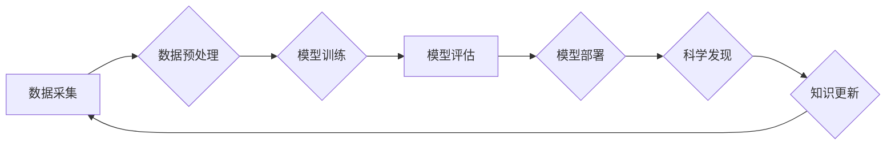

>人工智能，科学计算，机器学习，深度学习，数据分析，科学发现，算法优化

## 1. 背景介绍

人工智能（AI）正在迅速改变科学研究的格局，为科学发现和技术创新带来了前所未有的机遇。AI for Science，即人工智能助力科学，是指利用人工智能技术加速科学研究、推动科学发现和解决科学难题。

传统科学研究往往依赖于人类的经验和直觉，耗费大量时间和资源。而AI技术能够处理海量数据、识别复杂模式、进行精准预测，极大地提高了科学研究的效率和准确性。

## 2. 核心概念与联系

**2.1 AI for Science 的核心概念**

* **机器学习 (Machine Learning):** 算法从数据中学习，识别模式并做出预测。
* **深度学习 (Deep Learning):** 使用多层神经网络，能够学习更复杂的模式和关系。
* **自然语言处理 (Natural Language Processing):** 理解和处理人类语言，用于分析科学文献和研究报告。
* **计算机视觉 (Computer Vision):** 理解和分析图像和视频，用于科学图像分析和实验数据处理。
* **科学计算 (Scientific Computing):** 使用数学模型和算法进行科学模拟和计算。

**2.2 AI for Science 的联系**

AI for Science 将上述核心概念有机结合，形成一个完整的科学研究体系：



## 3. 核心算法原理 & 具体操作步骤

**3.1 算法原理概述**

机器学习算法的核心是通过学习数据中的模式来进行预测或分类。常见的机器学习算法包括：

* **监督学习:** 利用标记数据训练模型，例如分类和回归问题。
* **无监督学习:** 从未标记数据中发现模式，例如聚类和降维。
* **强化学习:** 通过试错学习，在环境中获得最大奖励。

**3.2 算法步骤详解**

1. **数据收集和预处理:** 收集相关数据，并进行清洗、转换和特征工程等预处理步骤。
2. **模型选择:** 根据具体任务选择合适的机器学习算法。
3. **模型训练:** 使用训练数据训练模型，调整模型参数以最小化损失函数。
4. **模型评估:** 使用测试数据评估模型的性能，例如准确率、召回率和F1-score。
5. **模型部署:** 将训练好的模型部署到实际应用场景中。

**3.3 算法优缺点**

* **优点:** 能够自动学习数据模式，提高预测精度和效率。
* **缺点:** 需要大量数据进行训练，对数据质量要求高，解释性较差。

**3.4 算法应用领域**

* **药物发现:** 预测药物活性、筛选候选药物。
* **材料科学:** 设计新材料、预测材料性能。
* **气候模型:** 模拟气候变化、预测天气模式。
* **生物信息学:** 分析基因序列、预测蛋白质结构。

## 4. 数学模型和公式 & 详细讲解 & 举例说明

**4.1 数学模型构建**

机器学习模型通常基于数学函数，例如线性回归、逻辑回归、神经网络等。这些模型通过参数调整来拟合数据，并进行预测或分类。

**4.2 公式推导过程**

例如，线性回归模型的目标是找到一条直线，将输入特征与输出标签关联起来。模型的公式如下：

$$y = w_0 + w_1x_1 + w_2x_2 + ... + w_nx_n$$

其中：

* $y$ 是输出标签
* $w_0, w_1, ..., w_n$ 是模型参数
* $x_1, x_2, ..., x_n$ 是输入特征

模型参数可以通过最小化损失函数来调整，例如均方误差 (MSE)：

$$MSE = \frac{1}{n}\sum_{i=1}^{n}(y_i - \hat{y}_i)^2$$

其中：

* $n$ 是样本数量
* $y_i$ 是真实标签
* $\hat{y}_i$ 是模型预测值

**4.3 案例分析与讲解**

例如，我们可以使用线性回归模型预测房价。输入特征包括房屋面积、房间数量、地理位置等，输出标签是房屋价格。通过训练模型，我们可以得到一个预测房价的公式，并将其应用于新的房屋数据进行预测。

## 5. 项目实践：代码实例和详细解释说明

**5.1 开发环境搭建**

* Python 3.x
* Jupyter Notebook
* Scikit-learn
* TensorFlow/PyTorch

**5.2 源代码详细实现**

```python
from sklearn.linear_model import LinearRegression
from sklearn.model_selection import train_test_split
from sklearn.metrics import mean_squared_error

# 加载数据
data = ...

# 分割数据
X_train, X_test, y_train, y_test = train_test_split(data[:, :-1], data[:, -1], test_size=0.2)

# 创建模型
model = LinearRegression()

# 训练模型
model.fit(X_train, y_train)

# 预测结果
y_pred = model.predict(X_test)

# 评估模型
mse = mean_squared_error(y_test, y_pred)
print(f"Mean Squared Error: {mse}")
```

**5.3 代码解读与分析**

* 使用 `train_test_split` 函数将数据分为训练集和测试集。
* 使用 `LinearRegression` 类创建线性回归模型。
* 使用 `fit` 方法训练模型。
* 使用 `predict` 方法预测测试集数据。
* 使用 `mean_squared_error` 函数评估模型性能。

**5.4 运行结果展示**

运行代码后，会输出模型的均方误差值，用于评估模型的预测精度。

## 6. 实际应用场景

**6.1 药物发现**

AI for Science 可以加速药物发现过程，例如：

* 预测药物活性
* 筛选候选药物
* 优化药物结构

**6.2 材料科学**

AI for Science 可以帮助设计新材料，例如：

* 预测材料性能
* 优化材料结构
* 发现新材料

**6.3 气候模型**

AI for Science 可以用于模拟气候变化，例如：

* 预测天气模式
* 研究气候变化的影响
* 开发气候变化应对策略

**6.4 未来应用展望**

AI for Science 的应用前景广阔，未来将应用于更多领域，例如：

* 个性化医疗
* 精准农业
* 可持续发展

## 7. 工具和资源推荐

**7.1 学习资源推荐**

* **书籍:**
    * "Deep Learning" by Ian Goodfellow, Yoshua Bengio, and Aaron Courville
    * "Hands-On Machine Learning with Scikit-Learn, Keras & TensorFlow" by Aurélien Géron
* **在线课程:**
    * Coursera: Machine Learning by Andrew Ng
    * edX: Artificial Intelligence by Columbia University

**7.2 开发工具推荐**

* **Python:** 广泛用于机器学习和深度学习开发。
* **Scikit-learn:** Python 机器学习库，提供各种算法和工具。
* **TensorFlow/PyTorch:** 深度学习框架，用于构建和训练神经网络。

**7.3 相关论文推荐**

* "Attention Is All You Need" by Vaswani et al. (2017)
* "BERT: Pre-training of Deep Bidirectional Transformers for Language Understanding" by Devlin et al. (2018)

## 8. 总结：未来发展趋势与挑战

**8.1 研究成果总结**

AI for Science 取得了显著进展，在药物发现、材料科学、气候模型等领域取得了突破性成果。

**8.2 未来发展趋势**

* **模型增强:** 开发更强大、更鲁棒的机器学习模型。
* **数据融合:** 将来自不同来源的数据融合在一起，提高模型的泛化能力。
* **解释性AI:** 提高机器学习模型的解释性，帮助科学家理解模型的决策过程。

**8.3 面临的挑战**

* **数据质量:** AI for Science 需要大量高质量的数据，而获取高质量数据仍然是一个挑战。
* **计算资源:** 训练大型机器学习模型需要大量的计算资源，这对于一些研究机构来说是一个负担。
* **伦理问题:** AI for Science 可能会带来一些伦理问题，例如数据隐私和算法偏见，需要引起重视。

**8.4 研究展望**

未来，AI for Science 将继续发展，为科学研究带来更多机遇和挑战。我们需要不断探索新的算法、新的数据来源和新的应用场景，并积极应对AI for Science带来的伦理问题。

## 9. 附录：常见问题与解答

* **Q1: AI for Science 是否会取代科学家？**

A1: AI for Science 不会取代科学家，而是会成为科学家强大的工具，帮助科学家更高效地进行研究。

* **Q2: 如何获取高质量的数据用于AI for Science？**

A2: 可以从公开数据库、科学文献、实验数据等来源获取数据，并进行清洗、预处理和标注。

* **Q3: 如何评估AI for Science模型的性能？**

A3: 可以使用各种指标来评估模型的性能，例如准确率、召回率、F1-score、均方误差等。

作者：禅与计算机程序设计艺术 / Zen and the Art of Computer Programming


<end_of_turn>