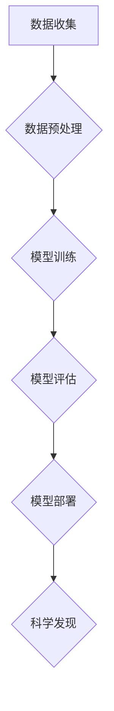

>人工智能，科学计算，机器学习，深度学习，数据分析，科学发现，自动化实验

## 1. 背景介绍

科学研究历来是人类探索世界、理解自然规律和推动社会进步的重要驱动力。然而，传统的科学研究方法往往面临着数据量大、计算复杂、实验周期长等挑战。近年来，人工智能（AI）技术飞速发展，为科学研究带来了前所未有的机遇。AI for Science，即人工智能助力科学，是指利用人工智能技术加速科学发现、优化实验设计、分析复杂数据等，从而推动科学研究的进步。

AI for Science 的应用领域广泛，涵盖物理、化学、生物学、天文学、材料科学等多个领域。例如，在药物研发领域，AI 可以帮助科学家筛选潜在的药物候选物，预测药物的活性，加速药物研发的速度；在材料科学领域，AI 可以帮助科学家设计新型材料，预测材料的性能，推动材料科学的创新发展。

## 2. 核心概念与联系

AI for Science 的核心概念包括：

* **机器学习（Machine Learning）：** 是一种人工智能技术，通过算法学习数据中的模式和规律，从而进行预测、分类、聚类等任务。
* **深度学习（Deep Learning）：** 是一种更高级的机器学习技术，利用多层神经网络模拟人类大脑的学习过程，能够处理更复杂的数据，并取得更优的性能。
* **数据分析（Data Analysis）：** 通过对数据进行收集、清洗、整理、分析等操作，从中提取有价值的信息，并用于指导科学研究。
* **自动化实验（Automated Experiment）：** 利用机器人、自动化设备等技术，实现实验过程的自动化，提高实验效率和准确性。

**Mermaid 流程图：**



## 3. 核心算法原理 & 具体操作步骤

### 3.1  算法原理概述

AI for Science 中常用的算法包括：

* **监督学习（Supervised Learning）：** 利用标记数据训练模型，例如分类、回归等任务。
* **无监督学习（Unsupervised Learning）：** 利用未标记数据进行模式识别、聚类等任务。
* **强化学习（Reinforcement Learning）：** 通过奖励机制训练模型，使其在特定环境中做出最优决策。

### 3.2  算法步骤详解

以监督学习为例，其基本步骤如下：

1. **数据收集和预处理：** 收集相关数据，并进行清洗、转换、特征工程等预处理操作。
2. **模型选择：** 根据任务需求选择合适的模型，例如线性回归、逻辑回归、决策树、支持向量机等。
3. **模型训练：** 利用标记数据训练模型，调整模型参数，使其能够准确预测目标变量。
4. **模型评估：** 利用测试数据评估模型的性能，例如准确率、召回率、F1-score等指标。
5. **模型部署：** 将训练好的模型部署到实际应用场景中，用于预测或分类新的数据。

### 3.3  算法优缺点

不同的算法具有不同的优缺点，需要根据具体任务需求进行选择。例如，线性回归算法简单易实现，但对数据线性关系要求较高；决策树算法能够处理非线性关系，但容易过拟合；支持向量机算法能够处理高维数据，但训练时间较长。

### 3.4  算法应用领域

AI for Science 中的算法广泛应用于各个领域，例如：

* **药物研发：** 利用机器学习算法预测药物的活性、毒性等，加速药物研发过程。
* **材料科学：** 利用深度学习算法设计新型材料，预测材料的性能。
* **生物信息学：** 利用机器学习算法分析基因序列、蛋白质结构等生物数据，揭示生命奥秘。
* **天文学：** 利用深度学习算法分析天文图像，发现新的天体。

## 4. 数学模型和公式 & 详细讲解 & 举例说明

### 4.1  数学模型构建

AI for Science 中常用的数学模型包括：

* **线性回归模型：** 用于预测连续变量，其数学表达式为：

$$y = w_0 + w_1x_1 + w_2x_2 + ... + w_nx_n + \epsilon$$

其中，$y$ 是预测变量，$x_1, x_2, ..., x_n$ 是输入变量，$w_0, w_1, w_2, ..., w_n$ 是模型参数，$\epsilon$ 是误差项。

* **逻辑回归模型：** 用于预测分类变量，其数学表达式为：

$$p(y=1|x) = \frac{1}{1 + e^{-(w_0 + w_1x_1 + w_2x_2 + ... + w_nx_n)}}$$

其中，$p(y=1|x)$ 是预测类别为1的概率，$x_1, x_2, ..., x_n$ 是输入变量，$w_0, w_1, w_2, ..., w_n$ 是模型参数。

### 4.2  公式推导过程

例如，线性回归模型的参数$w_0, w_1, w_2, ..., w_n$ 可以通过最小二乘法进行估计。最小二乘法旨在找到一组参数，使得模型预测值与真实值之间的误差平方和最小。

### 4.3  案例分析与讲解

例如，在药物研发领域，可以使用线性回归模型预测药物的活性。将药物的化学结构作为输入变量，药物的活性作为输出变量，训练线性回归模型，可以预测新的药物的活性。

## 5. 项目实践：代码实例和详细解释说明

### 5.1  开发环境搭建

AI for Science 项目的开发环境通常包括：

* **操作系统：** Linux、macOS 或 Windows
* **编程语言：** Python、R 或 Java
* **机器学习库：** scikit-learn、TensorFlow 或 PyTorch
* **数据处理库：** Pandas、NumPy 或 Dask

### 5.2  源代码详细实现

以下是一个使用 Python 和 scikit-learn 库实现线性回归模型的代码示例：

```python
from sklearn.linear_model import LinearRegression
from sklearn.model_selection import train_test_split
from sklearn.metrics import mean_squared_error

# 加载数据
data = ...

# 将数据分为训练集和测试集
X_train, X_test, y_train, y_test = train_test_split(data.drop('target', axis=1), data['target'], test_size=0.2)

# 创建线性回归模型
model = LinearRegression()

# 训练模型
model.fit(X_train, y_train)

# 预测测试集数据
y_pred = model.predict(X_test)

# 计算模型性能
mse = mean_squared_error(y_test, y_pred)
print(f'Mean Squared Error: {mse}')
```

### 5.3  代码解读与分析

这段代码首先加载数据，然后将数据分为训练集和测试集。接着，创建线性回归模型并训练模型。最后，使用训练好的模型预测测试集数据，并计算模型性能。

### 5.4  运行结果展示

运行结果会显示模型的平均平方误差（MSE）值，该值越小，模型的性能越好。

## 6. 实际应用场景

AI for Science 的应用场景广泛，例如：

### 6.1  药物研发

* **药物靶点发现：** 利用机器学习算法分析基因组数据，预测药物靶点。
* **药物筛选：** 利用深度学习算法筛选潜在的药物候选物。
* **药物设计：** 利用人工智能算法设计新型药物分子。

### 6.2  材料科学

* **材料性能预测：** 利用机器学习算法预测材料的力学、电学、热学等性能。
* **材料设计：** 利用人工智能算法设计新型材料。
* **材料缺陷检测：** 利用计算机视觉技术检测材料缺陷。

### 6.3  生物信息学

* **基因组测序分析：** 利用机器学习算法分析基因组测序数据，识别基因、突变等。
* **蛋白质结构预测：** 利用深度学习算法预测蛋白质的三维结构。
* **疾病诊断：** 利用机器学习算法分析生物标志物数据，辅助疾病诊断。

### 6.4  未来应用展望

AI for Science 的未来应用前景广阔，例如：

* **个性化医疗：** 利用人工智能技术为患者提供个性化的医疗方案。
* **精准农业：** 利用人工智能技术提高农业生产效率，减少环境污染。
* **可持续发展：** 利用人工智能技术解决环境问题，促进可持续发展。

## 7. 工具和资源推荐

### 7.1  学习资源推荐

* **在线课程：** Coursera、edX、Udacity 等平台提供人工智能、机器学习等方面的在线课程。
* **书籍：** 《深度学习》、《机器学习实战》等书籍是学习人工智能的经典教材。
* **博客和论坛：** 许多人工智能领域的专家和学者在博客和论坛上分享他们的研究成果和经验。

### 7.2  开发工具推荐

* **Python：** 作为人工智能领域最常用的编程语言，Python 拥有丰富的机器学习库和工具。
* **TensorFlow：** Google 开发的开源深度学习框架，支持多种硬件平台。
* **PyTorch：** Facebook 开发的开源深度学习框架，以其灵活性和易用性而闻名。

### 7.3  相关论文推荐

* **《ImageNet Classification with Deep Convolutional Neural Networks》**
* **《Attention Is All You Need》**
* **《BERT: Pre-training of Deep Bidirectional Transformers for Language Understanding》**

## 8. 总结：未来发展趋势与挑战

### 8.1  研究成果总结

AI for Science 取得了显著的进展，在药物研发、材料科学、生物信息学等领域取得了突破性成果。

### 8.2  未来发展趋势

* **模型规模和复杂度提升：** 未来 AI for Science 模型将更加大规模、更加复杂，能够处理更复杂的数据，并进行更深入的分析。
* **跨学科融合：** AI for Science 将与其他学科更加紧密融合，例如生物学、化学、物理学等，推动跨学科研究的创新发展。
* **自动化程度提升：** AI for Science 将更加自动化，能够自动完成实验设计、数据分析等任务，提高研究效率。

### 8.3  面临的挑战

* **数据获取和质量：** AI for Science 需要大量高质量的数据进行训练，而获取高质量数据的难度较大。
* **算法解释性和可解释性：** 许多 AI 算法的内部机制难以理解，这使得 AI for Science 的结果难以解释和信任。
* **伦理和社会影响：** AI for Science 的发展可能带来伦理和社会问题，例如算法偏见、数据隐私等，需要引起重视和关注。

### 8.4  研究展望

未来 AI for Science 将继续朝着更加智能、更加自动化、更加可解释的方向发展，为科学研究带来更大的变革。


## 9. 附录：常见问题与解答

### 9.1  常见问题

* **AI for Science 与传统科学研究有什么区别？**

AI for Science 利用人工智能技术辅助科学研究，可以加速科学发现、优化实验设计、分析复杂数据等，而传统科学研究主要依靠人类的观察、实验和推理。

* **AI for Science 需要哪些技术基础？**

AI for Science 需要掌握人工智能、机器学习、数据分析、编程等技术基础。

* **AI for Science 的应用领域有哪些？**

AI for Science 的应用领域广泛，涵盖物理、化学、生物学、天文学、材料科学等多个领域。

### 9.2  解答

* **AI for Science 的发展前景如何？**

AI for Science 的发展前景广阔，有望在未来推动科学研究的重大突破。

* **如何学习 AI for Science？**

可以通过在线课程、书籍、博客、论坛等方式学习 AI for Science。

