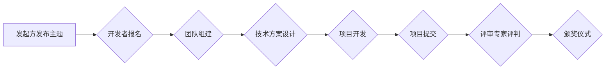

> AI hackathon,人工智能,创新,技术发展,社区合作,规模效应,影响力

## 1. 背景介绍

在人工智能（AI）领域蓬勃发展的今天，AI hackathon 作为一种独特的创新平台，正逐渐成为推动技术进步和人才培养的重要力量。AI hackathon 聚集了来自世界各地的开发者、研究人员和企业家，共同参与到解决实际问题、探索新技术和构建创新解决方案的竞赛中。

近年来，AI hackathon 的规模和影响力不断扩大，其举办形式也日益多样化。从最初的线下小型活动，发展到如今的线上线下结合、跨地域合作的全球性赛事，AI hackathon 已成为 AI 领域重要的文化现象和趋势。

## 2. 核心概念与联系

**2.1 AI hackathon 的定义**

AI hackathon 是一种时间有限的编程竞赛，旨在鼓励参与者利用人工智能技术解决特定问题或开发创新应用。

**2.2 AI hackathon 的核心要素**

* **时间限制:**  通常为 24-48 小时，鼓励快速迭代和高效协作。
* **主题聚焦:**  围绕特定领域或挑战，例如医疗保健、金融科技、智能交通等。
* **团队合作:**  鼓励参与者组建团队，发挥各自优势，共同完成项目。
* **技术创新:**  鼓励参与者使用最新的 AI 技术和工具，探索新的解决方案。
* **评判标准:**  根据项目创意、技术实现、商业价值等方面进行评判。

**2.3 AI hackathon 的影响力**

* **促进技术创新:**  为开发者提供了一个展示技术实力、探索新想法的平台。
* **加速人才培养:**  帮助开发者积累实战经验、提升团队协作能力。
* **推动产业发展:**  为企业提供一个寻找创新解决方案、挖掘新技术的渠道。
* **增强社区凝聚力:**  为 AI 社区成员提供一个交流学习、分享经验的平台。

**2.4 AI hackathon 的发展趋势**

* **主题多元化:**  涵盖更广泛的领域和挑战，例如可持续发展、社会公益等。
* **线上线下融合:**  线上平台将更加完善，提供更丰富的资源和互动体验。
* **国际化程度提升:**  跨地域合作将更加频繁，吸引更多全球人才参与。
* **商业化模式探索:**  企业将更加积极参与，寻求商业化合作机会。

**2.5  AI hackathon 流程图**

## 3. 核心算法原理 & 具体操作步骤

**3.1 算法原理概述**

AI hackathon 中常用的算法包括机器学习、深度学习、自然语言处理等。这些算法能够帮助开发者构建智能系统，解决各种实际问题。

**3.2 算法步骤详解**

* **数据收集和预处理:**  收集相关数据，并进行清洗、转换、特征提取等预处理工作。
* **模型选择和训练:**  根据任务需求选择合适的算法模型，并利用训练数据进行模型训练。
* **模型评估和优化:**  使用测试数据评估模型性能，并根据评估结果进行模型优化。
* **模型部署和应用:**  将训练好的模型部署到实际应用场景中，并进行持续监控和维护。

**3.3 算法优缺点**

不同的算法具有不同的优缺点，需要根据具体任务需求进行选择。例如，机器学习算法能够处理结构化数据，但对非结构化数据处理能力有限；深度学习算法能够处理大规模非结构化数据，但训练成本较高。

**3.4 算法应用领域**

AI hackathon 中的算法应用领域非常广泛，例如：

* **图像识别:**  识别物体、场景、人脸等。
* **语音识别:**  将语音转换为文本。
* **自然语言处理:**  理解和生成自然语言文本。
* **机器翻译:**  将一种语言翻译成另一种语言。
* **预测分析:**  预测未来趋势和事件。

## 4. 数学模型和公式 & 详细讲解 & 举例说明

**4.1 数学模型构建**

在 AI hackathon 中，数学模型是构建智能系统的核心。常见的数学模型包括线性回归、逻辑回归、支持向量机、神经网络等。

**4.2 公式推导过程**

每个数学模型都有其对应的公式推导过程，例如线性回归模型的损失函数为：

$$
L(w,b) = \frac{1}{2n} \sum_{i=1}^{n} (y_i - (w x_i + b))^2
$$

其中：

* $w$ 和 $b$ 是模型参数。
* $x_i$ 是第 $i$ 个样本的特征向量。
* $y_i$ 是第 $i$ 个样本的真实值。
* $n$ 是样本数量。

**4.3 案例分析与讲解**

例如，在图像识别任务中，可以使用卷积神经网络（CNN）模型进行图像分类。CNN 模型利用卷积操作提取图像特征，并通过全连接层进行分类。

## 5. 项目实践：代码实例和详细解释说明

**5.1 开发环境搭建**

AI hackathon 项目开发通常需要搭建相应的开发环境，包括操作系统、编程语言、深度学习框架等。

**5.2 源代码详细实现**

具体代码实现需要根据项目需求和算法选择进行编写。

**5.3 代码解读与分析**

需要对代码进行详细解读和分析，理解代码的功能和逻辑。

**5.4 运行结果展示**

需要展示项目运行的结果，例如图像识别准确率、语音识别准确率等。

## 6. 实际应用场景

AI hackathon 项目的成果可以应用于各种实际场景，例如：

* **医疗保健:**  辅助诊断、预测疾病风险、个性化治疗方案。
* **金融科技:**  欺诈检测、风险评估、智能投资。
* **智能交通:**  自动驾驶、交通流量预测、智能停车。
* **教育科技:**  个性化学习、智能辅导、自动批改作业。

**6.4 未来应用展望**

随着 AI 技术的不断发展，AI hackathon 项目的应用场景将更加广泛，例如：

* **可持续发展:**  环境监测、资源管理、气候变化预测。
* **社会公益:**  灾害救援、医疗援助、教育扶贫。

## 7. 工具和资源推荐

**7.1 学习资源推荐**

* **在线课程:**  Coursera、edX、Udacity 等平台提供丰富的 AI 课程。
* **书籍:**  《深度学习》、《机器学习实战》等经典书籍。
* **开源项目:**  TensorFlow、PyTorch 等开源深度学习框架。

**7.2 开发工具推荐**

* **编程语言:**  Python、C++、Java 等。
* **深度学习框架:**  TensorFlow、PyTorch、Keras 等。
* **数据处理工具:**  Pandas、NumPy 等。

**7.3 相关论文推荐**

* **深度学习论文:**  《ImageNet Classification with Deep Convolutional Neural Networks》
* **机器学习论文:**  《Support Vector Machines》

## 8. 总结：未来发展趋势与挑战

**8.1 研究成果总结**

AI hackathon 已经成为推动 AI 技术发展和人才培养的重要平台，取得了显著成果。

**8.2 未来发展趋势**

AI hackathon 将更加注重跨领域合作、商业化应用和社会影响力。

**8.3 面临的挑战**

AI hackathon 还面临着一些挑战，例如：

* **人才短缺:**  AI 领域人才需求量大，供不应求。
* **数据安全:**  AI 模型训练需要大量数据，数据安全问题不容忽视。
* **伦理问题:**  AI 技术的应用需要考虑伦理道德问题。

**8.4 研究展望**

未来，AI hackathon 将继续发挥其重要作用，推动 AI 技术的创新发展和社会进步。

## 9. 附录：常见问题与解答

**9.1 如何报名参加 AI hackathon？**

可以通过 AI hackathon 官方网站或相关平台报名。

**9.2 AI hackathon 需要哪些技能？**

需要具备编程、数据分析、机器学习等相关技能。

**9.3 AI hackathon 的奖项有哪些？**

奖项形式多样，包括现金奖励、技术资源、实习机会等。

作者：禅与计算机程序设计艺术 / Zen and the Art of Computer Programming 
<end_of_turn>