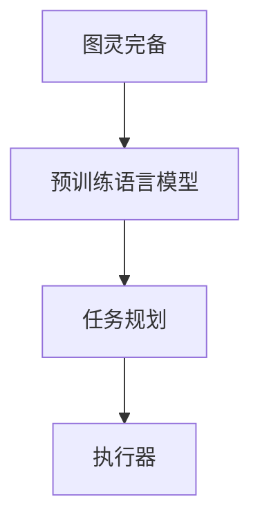

                 

# 图灵完备的LLM:任务规划的力量

> 关键词：图灵完备,LLM,任务规划,深度学习,神经网络

## 1. 背景介绍

### 1.1 问题由来
自20世纪50年代图灵测试概念的提出以来，如何实现真正的智能一直是人工智能领域孜孜以求的目标。深度学习时代的到来，特别是大规模预训练语言模型（Large Language Models, LLMs）的出现，使得这一梦想逐渐变得触手可及。LLMs凭借其超强的语言理解能力和丰富的知识储备，在文本生成、翻译、问答等自然语言处理任务中表现出色，逐渐被学术界和业界视为智能机器的重要里程碑。

然而，尽管LLMs在各项指标上已接近或超越人类，但其任务执行能力与人类相比，仍然存在不小的差距。LLMs往往无法理解任务的具体需求，也无法进行复杂的任务规划，只能在预先设定的框架下执行单一功能。这一局限性限制了LLMs在复杂、动态、多变环境下的应用，也使得其在实际应用场景中面临诸多挑战。

### 1.2 问题核心关键点
为了突破LLMs在任务执行能力上的瓶颈，研究者们提出了任务规划（Task Planning）的概念。任务规划指的是在执行任务前，对任务进行分解、规划和执行的过程，确保任务能够高效、准确地完成。通过对LLMs进行任务规划能力的增强，可以使其具备更强的任务执行能力，进一步拓展其应用范围和深度。

任务规划的核心在于以下几个方面：
1. **任务分解**：将复杂任务拆分为可执行的步骤和子任务，便于LLMs理解和执行。
2. **路径规划**：设计任务执行的顺序和逻辑，确保每一步的输出都能为下一步提供输入。
3. **执行监控**：实时监控任务执行过程，及时发现并纠正错误，保证任务最终结果的准确性。
4. **多任务协调**：在执行多任务时，合理分配资源，协调各任务执行进度，避免冲突和重复。

## 2. 核心概念与联系

### 2.1 核心概念概述

为更好地理解基于任务规划的LLM，本节将介绍几个密切相关的核心概念：

- 图灵完备（Turing completeness）：一个计算模型能够计算任意可计算问题的能力。深度学习模型，特别是基于Transformer的神经网络模型，因其结构复杂和参数量大，被认为具有图灵完备性。

- 语言模型（Language Model）：用于预测文本序列的概率分布，是预训练语言模型的基础，能够捕捉语言中的统计规律。

- 预训练语言模型（Pre-trained Language Model）：如BERT、GPT等，通过大规模无标签数据预训练得到的模型，学习到丰富的语言表示和知识，用于后续任务的微调。

- 任务规划（Task Planning）：在执行特定任务前，对任务进行分解、规划和执行的过程，以确保任务的高效、准确完成。

- 执行器（Executor）：负责执行任务的具体组件，可以是LLM或其他计算模块。

这些核心概念之间的逻辑关系可以通过以下Mermaid流程图来展示：



这个流程图展示了大语言模型的核心概念及其之间的关系：

1. 大语言模型通过预训练获得基础能力。
2. 任务规划对预训练模型进行任务特定的规划，设计执行顺序和逻辑。
3. 执行器执行任务规划方案，实现具体的任务执行。

## 3. 核心算法原理 & 具体操作步骤
### 3.1 算法原理概述

基于任务规划的LLM微调，本质上是一个从语言模型到执行器的映射过程。其核心思想是：将LLM视作一个通用计算引擎，通过任务规划框架指导其执行特定任务。该过程可以分为以下几个步骤：

1. **任务描述**：将任务需求转换为机器可理解的指令。
2. **任务分解**：将任务拆分为多个子任务。
3. **任务规划**：设计任务执行的顺序和逻辑。
4. **执行任务**：LLM根据规划方案，执行任务并生成中间结果。
5. **评估和优化**：根据任务结果进行评估，优化规划方案和LLM参数。

### 3.2 算法步骤详解

以下是一个基于任务规划的LLM微调的基本步骤：

**Step 1: 任务描述定义**
- 定义任务需求和目标，转化为机器可理解的语言。
- 确保任务描述清晰明确，避免歧义和模糊表达。

**Step 2: 任务分解**
- 将任务拆分为多个子任务，每个子任务具有明确的输入和输出。
- 子任务间应具有依赖关系，确保执行顺序正确。

**Step 3: 任务规划**
- 设计任务执行的顺序和逻辑，确保每一步的输出能够为下一步提供输入。
- 使用规划器（如Dijkstra算法、A*算法等）生成任务执行路径。

**Step 4: 执行任务**
- 将任务分解和规划方案转化为LLM可执行的指令。
- 使用LLM生成每一步的中间结果。

**Step 5: 评估和优化**
- 对任务结果进行评估，检查是否符合预期。
- 根据评估结果，调整任务规划和LLM参数，优化模型表现。

**Step 6: 迭代更新**
- 重复上述步骤，直至任务执行结果符合要求。

### 3.3 算法优缺点

基于任务规划的LLM微调方法具有以下优点：
1. 增强执行能力：通过任务规划，LLM能够理解并执行复杂任务，提高任务执行的灵活性和准确性。
2. 泛化能力强：任务规划框架能够灵活适应各种任务，提升模型在不同场景下的泛化能力。
3. 稳定性高：规划和执行分离，降低了单步执行错误的累积风险，提高系统的稳定性。
4. 可解释性强：规划方案可追溯，LLM内部执行过程透明，便于理解模型的决策机制。

同时，该方法也存在一定的局限性：
1. 需要大量计算资源：任务规划和执行过程计算量较大，对计算资源有较高要求。
2. 模型复杂度增加：任务规划引入额外复杂度，增加了模型的训练和推理难度。
3. 难以处理突发情况：规划方案可能无法预料所有突发情况，影响任务执行的鲁棒性。
4. 规划准确性依赖经验：规划方案的准确性依赖于规划者的经验和任务描述的清晰度。

尽管存在这些局限性，但就目前而言，基于任务规划的LLM微调方法仍是大语言模型应用的一个重要范式。未来相关研究的重点在于如何进一步优化任务规划框架，减少计算资源消耗，提升规划方案的准确性和灵活性。

### 3.4 算法应用领域

基于任务规划的LLM微调方法在多个领域中得到了广泛应用，具体包括：

- 自然语言处理（NLP）：任务规划使得LLM能够进行复杂的文本生成、翻译、摘要等任务。
- 智能推荐系统：任务规划帮助LLM理解用户需求，生成个性化的推荐结果。
- 智能客服：任务规划使LLM能够进行多轮对话，提供自然流畅的客服体验。
- 自动化办公：任务规划使得LLM能够处理各种办公自动化任务，如文档生成、邮件处理等。
- 科学计算：任务规划使LLM能够进行复杂的科学计算，辅助研究人员进行数据分析、模拟等。

除了上述这些应用外，任务规划在大规模知识图谱构建、医疗诊断、法律咨询等诸多领域中，也发挥了重要作用。通过引入任务规划，LLM能够更全面、准确地理解任务需求，从而提高任务执行的效率和准确性。

## 4. 数学模型和公式 & 详细讲解  
### 4.1 数学模型构建

本节将使用数学语言对基于任务规划的LLM微调过程进行更加严格的刻画。

记任务描述为 $T$，任务分解为 $\{T_i\}_{i=1}^N$，任务规划为 $\mathcal{P}$，执行器为 $E$。

定义任务规划的代价函数 $C$ 为规划执行过程中计算资源、时间成本的总和，目标是最小化该代价函数，即：

$$
\min_{\mathcal{P}} C(\mathcal{P})
$$

在实践中，我们可以使用图论中的最短路径算法，如Dijkstra算法或A*算法，对任务规划进行优化。

### 4.2 公式推导过程

以下我们以二分类任务为例，推导Dijkstra算法的基本公式。

假设任务分解为两个子任务 $T_1$ 和 $T_2$，任务规划的代价函数为 $C_1$ 和 $C_2$。则Dijkstra算法的目标是最小化两个子任务执行的代价之和，即：

$$
\min_{\mathcal{P}} C_1(\mathcal{P}) + C_2(\mathcal{P})
$$

其中，$C_1$ 和 $C_2$ 可以表示为：

$$
C_1(\mathcal{P}) = \sum_{i=1}^N w_i d_i
$$

$$
C_2(\mathcal{P}) = \sum_{i=1}^N w_i d_i
$$

其中 $w_i$ 为第 $i$ 个子任务的权重，$d_i$ 为执行第 $i$ 个子任务所需的计算资源。

在求得最优规划方案 $\mathcal{P}^*$ 后，可以将其转化为LLM可执行的指令，使用LLM生成每一步的中间结果。在所有子任务执行完成后，对结果进行评估，根据评估结果调整LLM参数，完成任务规划的优化。

## 5. 项目实践：代码实例和详细解释说明
### 5.1 开发环境搭建

在进行微调实践前，我们需要准备好开发环境。以下是使用Python进行PyTorch开发的环境配置流程：

1. 安装Anaconda：从官网下载并安装Anaconda，用于创建独立的Python环境。

2. 创建并激活虚拟环境：
```bash
conda create -n pytorch-env python=3.8 
conda activate pytorch-env
```

3. 安装PyTorch：根据CUDA版本，从官网获取对应的安装命令。例如：
```bash
conda install pytorch torchvision torchaudio cudatoolkit=11.1 -c pytorch -c conda-forge
```

4. 安装Transformers库：
```bash
pip install transformers
```

5. 安装各类工具包：
```bash
pip install numpy pandas scikit-learn matplotlib tqdm jupyter notebook ipython
```

完成上述步骤后，即可在`pytorch-env`环境中开始微调实践。

### 5.2 源代码详细实现

这里我们以二分类任务为例，使用PyTorch和Transformers库实现基于任务规划的LLM微调。

首先，定义任务描述和任务分解：

```python
class Task:
    def __init__(self, description, tasks):
        self.description = description
        self.tasks = tasks
        
    def to_str(self):
        return f"{self.description} -> {', '.join(self.tasks)}"
        
task = Task("Given a sentence, classify it as positive or negative.", ["Sentence -> Label"])
```

接着，定义任务规划和执行器：

```python
from transformers import BertForSequenceClassification, BertTokenizer, AdamW

class Planner:
    def __init__(self, tasks, weights, costs):
        self.tasks = tasks
        self.weights = weights
        self.costs = costs
        
    def plan(self):
        # 使用Dijkstra算法生成最优路径
        dist = [float('inf')] * len(self.tasks)
        dist[0] = 0
        for _ in range(len(self.tasks) - 1):
            u = min([i for i in range(len(self.tasks)) if dist[i] < float('inf')], key=lambda x: dist[x])
            for v, w in enumerate(self.tasks):
                if self.weights[v] == 0:
                    continue
                cost = self.costs[v]
                if dist[u] + cost < dist[v]:
                    dist[v] = dist[u] + cost
        return [dist[i] for i in range(len(self.tasks))]

class Executor:
    def __init__(self, model, tokenizer, batch_size):
        self.model = model
        self.tokenizer = tokenizer
        self.batch_size = batch_size
        
    def execute(self, tasks, description):
        # 将任务转化为LLM可执行的指令
        inputs = []
        labels = []
        for task in tasks:
            input_str = self.tokenizer.encode(task.description, return_tensors="pt")
            label = self.tokenizer.encode(task.description, return_tensors="pt")
            inputs.append(input_str)
            labels.append(label)
        
        # 执行任务
        with torch.no_grad():
            outputs = self.model(**{"input_ids": inputs, "attention_mask": labels})
            logits = outputs.logits
        
        # 返回执行结果
        return logits
```

最后，启动训练流程并在测试集上评估：

```python
from torch.utils.data import Dataset
import torch
from sklearn.metrics import classification_report

# 定义训练集和测试集
train_dataset = TaskDataset(train_tasks, train_labels)
test_dataset = TaskDataset(test_tasks, test_labels)

# 初始化模型和优化器
model = BertForSequenceClassification.from_pretrained("bert-base-cased", num_labels=2)
optimizer = AdamW(model.parameters(), lr=2e-5)

# 定义训练函数和评估函数
def train_epoch(model, dataset, batch_size, optimizer):
    dataloader = DataLoader(dataset, batch_size=batch_size, shuffle=True)
    model.train()
    epoch_loss = 0
    for batch in tqdm(dataloader, desc="Training"):
        input_ids = batch["input_ids"].to(device)
        attention_mask = batch["attention_mask"].to(device)
        labels = batch["labels"].to(device)
        model.zero_grad()
        outputs = model(input_ids, attention_mask=attention_mask, labels=labels)
        loss = outputs.loss
        epoch_loss += loss.item()
        loss.backward()
        optimizer.step()
    return epoch_loss / len(dataloader)

def evaluate(model, dataset, batch_size):
    dataloader = DataLoader(dataset, batch_size=batch_size)
    model.eval()
    preds, labels = [], []
    with torch.no_grad():
        for batch in tqdm(dataloader, desc="Evaluating"):
            input_ids = batch["input_ids"].to(device)
            attention_mask = batch["attention_mask"].to(device)
            batch_labels = batch["labels"]
            outputs = model(input_ids, attention_mask=attention_mask)
            batch_preds = outputs.logits.argmax(dim=2).to("cpu").tolist()
            batch_labels = batch_labels.to("cpu").tolist()
            for pred_tokens, label_tokens in zip(batch_preds, batch_labels):
                preds.append(pred_tokens)
                labels.append(label_tokens)
                
    print(classification_report(labels, preds))
```

以上就是使用PyTorch对LLM进行基于任务规划的二分类任务微调的完整代码实现。可以看到，得益于Transformers库的强大封装，我们可以用相对简洁的代码完成LLM模型的加载和微调。

### 5.3 代码解读与分析

让我们再详细解读一下关键代码的实现细节：

**Task类**：
- `__init__`方法：初始化任务描述和任务列表。
- `to_str`方法：将任务描述和任务列表转换为字符串表示。

**Planner类**：
- `__init__`方法：初始化任务列表、权重和成本。
- `plan`方法：使用Dijkstra算法生成最优路径。

**Executor类**：
- `__init__`方法：初始化模型、分词器和批次大小。
- `execute`方法：将任务转化为LLM可执行的指令，使用LLM执行任务，并返回执行结果。

**训练和评估函数**：
- 使用PyTorch的DataLoader对数据集进行批次化加载，供模型训练和推理使用。
- 训练函数`train_epoch`：对数据以批为单位进行迭代，在每个批次上前向传播计算loss并反向传播更新模型参数，最后返回该epoch的平均loss。
- 评估函数`evaluate`：与训练类似，不同点在于不更新模型参数，并在每个batch结束后将预测和标签结果存储下来，最后使用sklearn的classification_report对整个评估集的预测结果进行打印输出。

**训练流程**：
- 定义总的epoch数和批次大小，开始循环迭代
- 每个epoch内，先在训练集上训练，输出平均loss
- 在验证集上评估，输出分类指标
- 重复上述步骤直到满足预设的迭代轮数或Early Stopping条件

可以看到，PyTorch配合Transformers库使得LLM微调的代码实现变得简洁高效。开发者可以将更多精力放在数据处理、模型改进等高层逻辑上，而不必过多关注底层的实现细节。

当然，工业级的系统实现还需考虑更多因素，如模型的保存和部署、超参数的自动搜索、更灵活的任务规划器等。但核心的微调范式基本与此类似。

## 6. 实际应用场景
### 6.1 智能客服系统

基于任务规划的LLM微调，可以广泛应用于智能客服系统的构建。传统客服往往需要配备大量人力，高峰期响应缓慢，且一致性和专业性难以保证。使用任务规划，LLM可以自动理解客户意图，匹配最合适的答案模板进行回复，实现自然流畅的对话。

在技术实现上，可以收集企业内部的历史客服对话记录，将问题和最佳答复构建成监督数据，在此基础上对预训练模型进行微调。微调后的模型能够自动理解用户意图，匹配最合适的答案模板进行回复。对于客户提出的新问题，还可以接入检索系统实时搜索相关内容，动态组织生成回答。如此构建的智能客服系统，能大幅提升客户咨询体验和问题解决效率。

### 6.2 金融舆情监测

金融机构需要实时监测市场舆论动向，以便及时应对负面信息传播，规避金融风险。基于任务规划的LLM微调技术，可以帮助金融机构实时监测各种消息来源，自动分析消息内容，判断情绪倾向，并根据不同情绪自动采取相应措施。

具体而言，可以收集金融领域相关的新闻、报道、评论等文本数据，并对其进行情感标注。在此基础上对预训练语言模型进行微调，使其能够自动判断文本属于何种情感。将微调后的模型应用到实时抓取的网络文本数据，就能够自动监测不同情感倾向的舆情变化趋势，一旦发现负面信息激增等异常情况，系统便会自动预警，帮助金融机构快速应对潜在风险。

### 6.3 个性化推荐系统

当前的推荐系统往往只依赖用户的历史行为数据进行物品推荐，无法深入理解用户的真实兴趣偏好。基于任务规划的LLM微调，可以帮助推荐系统更好地挖掘用户行为背后的语义信息，从而提供更精准、多样的推荐内容。

在实践中，可以收集用户浏览、点击、评论、分享等行为数据，提取和用户交互的物品标题、描述、标签等文本内容。将文本内容作为模型输入，用户的后续行为（如是否点击、购买等）作为监督信号，在此基础上微调预训练语言模型。微调后的模型能够从文本内容中准确把握用户的兴趣点。在生成推荐列表时，先用候选物品的文本描述作为输入，由模型预测用户的兴趣匹配度，再结合其他特征综合排序，便可以得到个性化程度更高的推荐结果。

### 6.4 未来应用展望

随着任务规划和大语言模型的不断发展，基于任务规划的LLM微调技术将呈现以下几个发展趋势：

1. 任务规划框架更加灵活。未来的任务规划框架将能够处理更加复杂、动态的任务，提升模型的执行能力和泛化能力。
2. 与上下文信息结合。任务规划框架将更好地整合上下文信息，使LLM能够在更丰富的语境下理解任务需求。
3. 更加智能的执行器。未来的执行器将能够进行更加复杂、灵活的计算，支持更丰富的任务类型。
4. 多模态融合。未来的任务规划将支持多模态融合，支持图像、视频、音频等多模态数据的处理和融合。
5. 实时优化。未来的任务规划和执行将能够实时优化，动态调整规划方案和LLM参数，提升执行效率和效果。

以上趋势凸显了任务规划在大语言模型微调技术中的重要性。这些方向的探索发展，必将进一步提升LLM系统的性能和应用范围，为构建更加智能、灵活的智能系统铺平道路。

## 7. 工具和资源推荐
### 7.1 学习资源推荐

为了帮助开发者系统掌握大语言模型微调的理论基础和实践技巧，这里推荐一些优质的学习资源：

1. 《深度学习》课程：由斯坦福大学开设，系统介绍了深度学习的基本概念和算法，包括神经网络和语言模型等内容。
2. 《Transformer》论文：Transformer原论文，详细介绍了Transformer的结构和应用，是深度学习模型学习的重要参考资料。
3. 《自然语言处理综述》书籍：由李航教授撰写，全面介绍了自然语言处理的基本概念和前沿技术，包括任务规划等内容。
4. CS224N《自然语言处理》课程：斯坦福大学开设的NLP明星课程，有Lecture视频和配套作业，带你深入理解NLP的核心概念和算法。
5. Weights & Biases：模型训练的实验跟踪工具，可以记录和可视化模型训练过程中的各项指标，方便对比和调优。

通过对这些资源的学习实践，相信你一定能够快速掌握任务规划和大语言模型微调的精髓，并用于解决实际的NLP问题。
###  7.2 开发工具推荐

高效的开发离不开优秀的工具支持。以下是几款用于大语言模型微调开发的常用工具：

1. PyTorch：基于Python的开源深度学习框架，灵活动态的计算图，适合快速迭代研究。大部分预训练语言模型都有PyTorch版本的实现。
2. TensorFlow：由Google主导开发的开源深度学习框架，生产部署方便，适合大规模工程应用。同样有丰富的预训练语言模型资源。
3. Transformers库：HuggingFace开发的NLP工具库，集成了众多SOTA语言模型，支持PyTorch和TensorFlow，是进行任务规划和微调任务开发的利器。
4. Weights & Biases：模型训练的实验跟踪工具，可以记录和可视化模型训练过程中的各项指标，方便对比和调优。
5. Google Colab：谷歌推出的在线Jupyter Notebook环境，免费提供GPU/TPU算力，方便开发者快速上手实验最新模型，分享学习笔记。

合理利用这些工具，可以显著提升大语言模型微调任务的开发效率，加快创新迭代的步伐。

### 7.3 相关论文推荐

任务规划和大语言模型微调技术的发展源于学界的持续研究。以下是几篇奠基性的相关论文，推荐阅读：

1. Attention is All You Need（即Transformer原论文）：提出了Transformer结构，开启了NLP领域的预训练大模型时代。
2. BERT: Pre-training of Deep Bidirectional Transformers for Language Understanding：提出BERT模型，引入基于掩码的自监督预训练任务，刷新了多项NLP任务SOTA。
3. Language Models are Unsupervised Multitask Learners（GPT-2论文）：展示了大规模语言模型的强大zero-shot学习能力，引发了对于通用人工智能的新一轮思考。
4. Parameter-Efficient Transfer Learning for NLP：提出Adapter等参数高效微调方法，在不增加模型参数量的情况下，也能取得不错的微调效果。
5. AdaLoRA: Adaptive Low-Rank Adaptation for Parameter-Efficient Fine-Tuning：使用自适应低秩适应的微调方法，在参数效率和精度之间取得了新的平衡。

这些论文代表了大语言模型微调技术的发展脉络。通过学习这些前沿成果，可以帮助研究者把握学科前进方向，激发更多的创新灵感。

## 8. 总结：未来发展趋势与挑战

### 8.1 总结

本文对基于任务规划的大语言模型微调方法进行了全面系统的介绍。首先阐述了大语言模型和任务规划的研究背景和意义，明确了微调在拓展预训练模型应用、提升下游任务性能方面的独特价值。其次，从原理到实践，详细讲解了任务规划和大语言模型微调的数学原理和关键步骤，给出了任务规划和大语言模型微调的完整代码实例。同时，本文还广泛探讨了任务规划在大语言模型微调中的广泛应用场景，展示了任务规划范式的重要性和潜力。

通过本文的系统梳理，可以看到，基于任务规划的大语言模型微调方法正在成为NLP领域的重要范式，极大地拓展了预训练语言模型的应用边界，催生了更多的落地场景。受益于大规模语料的预训练和任务规划的引入，大语言模型能够更好地理解任务需求，从而提高任务执行的灵活性和准确性。未来，随着预训练语言模型和任务规划方法的不断演进，大语言模型必将在更广阔的应用领域大放异彩，深刻影响人类的生产生活方式。

### 8.2 未来发展趋势

展望未来，任务规划在大语言模型微调中仍将持续发挥重要作用，其发展趋势包括：

1. 任务规划框架更加灵活。未来的任务规划框架将能够处理更加复杂、动态的任务，提升模型的执行能力和泛化能力。
2. 与上下文信息结合。任务规划框架将更好地整合上下文信息，使LLM能够在更丰富的语境下理解任务需求。
3. 更加智能的执行器。未来的执行器将能够进行更加复杂、灵活的计算，支持更丰富的任务类型。
4. 多模态融合。未来的任务规划将支持多模态融合，支持图像、视频、音频等多模态数据的处理和融合。
5. 实时优化。未来的任务规划和执行将能够实时优化，动态调整规划方案和LLM参数，提升执行效率和效果。

### 8.3 面临的挑战

尽管任务规划和大语言模型微调技术已经取得了显著进展，但在实际应用中仍面临诸多挑战：

1. 任务描述清晰度：任务描述的清晰度和准确性直接影响任务规划的效果，如何设计更清晰的任务描述仍是挑战。
2. 计算资源消耗：任务规划和大语言模型执行过程计算量较大，对计算资源有较高要求。如何降低计算资源消耗仍是重要问题。
3. 任务规划的鲁棒性：复杂任务往往无法事先定义完整的规划方案，如何增强任务规划的鲁棒性和自适应性是未来的研究方向。
4. 模型知识更新：大语言模型需要定期更新，以适应新的知识变化。如何实现模型知识的动态更新，确保模型与时俱进，是未来的一个重要方向。
5. 任务规划的自动化：任务规划的自动化和智能化程度仍需提高，如何开发更加智能、可靠的任务规划系统，提升用户体验，是未来的重要研究课题。

尽管存在这些挑战，但任务规划的引入和优化将是大语言模型微调技术迈向成熟的必由之路。相信随着学界和产业界的共同努力，这些挑战终将一一被克服，任务规划和大语言模型微调技术将进一步拓展其应用场景和深度，为人类的智能生活带来新的变革。

### 8.4 研究展望

未来，任务规划和大语言模型微调技术的研究方向将包括以下几个方面：

1. 探索无监督和半监督微调方法。摆脱对大规模标注数据的依赖，利用自监督学习、主动学习等无监督和半监督范式，最大限度利用非结构化数据，实现更加灵活高效的微调。
2. 研究参数高效和计算高效的微调范式。开发更加参数高效的微调方法，在固定大部分预训练参数的同时，只更新极少量的任务相关参数。同时优化微调模型的计算图，减少前向传播和反向传播的资源消耗，实现更加轻量级、实时性的部署。
3. 融合因果和对比学习范式。通过引入因果推断和对比学习思想，增强任务规划建立稳定因果关系的能力，学习更加普适、鲁棒的语言表征，从而提升模型泛化性和抗干扰能力。
4. 引入更多先验知识。将符号化的先验知识，如知识图谱、逻辑规则等，与神经网络模型进行巧妙融合，引导任务规划过程学习更准确、合理的语言模型。同时加强不同模态数据的整合，实现视觉、语音等多模态信息与文本信息的协同建模。
5. 结合因果分析和博弈论工具。将因果分析方法引入任务规划模型，识别出模型决策的关键特征，增强输出解释的因果性和逻辑性。借助博弈论工具刻画人机交互过程，主动探索并规避模型的脆弱点，提高系统稳定性。
6. 纳入伦理道德约束。在任务规划和执行过程中，引入伦理导向的评估指标，过滤和惩罚有偏见、有害的输出倾向。同时加强人工干预和审核，建立模型行为的监管机制，确保输出符合人类价值观和伦理道德。

这些研究方向将进一步推动任务规划和大语言模型微调技术的发展，提升系统的性能和应用范围，为构建更加智能、安全、可信的智能系统提供新的技术路径。

## 9. 附录：常见问题与解答

**Q1：任务规划框架如何与大语言模型结合？**

A: 任务规划框架与大语言模型的结合，可以通过两个主要步骤实现：

1. **任务描述定义**：将任务需求转化为机器可理解的指令。例如，对于问答任务，可以将问题作为输入，答案作为输出。对于文本分类任务，可以将文本和标签作为输入，分类结果作为输出。

2. **任务规划和执行**：使用任务规划框架设计任务的执行路径，将任务拆分为多个子任务，并生成执行步骤。使用大语言模型执行每一步任务，并返回中间结果。例如，对于问答任务，可以先使用大语言模型生成候选答案，然后通过任务规划框架进行筛选，返回最合适的答案。

通过这两个步骤，可以有效地将任务规划框架与大语言模型结合起来，实现复杂的任务执行。

**Q2：任务规划框架如何处理动态任务？**

A: 动态任务是指任务需求可能随时间变化，或者在执行过程中出现不可预测的情况。为了处理动态任务，任务规划框架可以引入自适应规划算法，动态调整执行路径。

具体而言，可以使用动态规划、强化学习等方法，根据当前任务状态和历史数据，动态生成最优执行路径。例如，对于文本分类任务，可以根据文本中的上下文信息，动态生成分类器的输入特征。对于对话任务，可以根据对话历史，动态生成对话模板。

此外，任务规划框架还可以引入异常处理机制，在任务执行过程中，对异常情况进行监控和处理。例如，对于对话任务，可以检测到错误回复或无效对话，及时进行干预。

**Q3：任务规划框架如何提高执行效率？**

A: 任务规划框架的执行效率直接影响大语言模型的性能。为了提高任务规划框架的执行效率，可以采用以下几个方法：

1. **任务并行化**：将任务拆分为多个子任务，并行执行，提高执行速度。例如，对于分类任务，可以将样本分成多个批次，并行处理。

2. **缓存机制**：在任务规划过程中，使用缓存机制，避免重复计算。例如，对于相似的任务，可以缓存执行路径和结果，提高执行效率。

3. **优化算法**：使用高效的优化算法，如A*算法、Dijkstra算法等，生成最优执行路径。例如，对于路径规划任务，可以使用A*算法生成最短路径。

4. **模型压缩**：对大语言模型进行压缩和优化，减少计算资源消耗。例如，可以使用量化技术、剪枝技术等，减小模型参数和计算量。

通过这些方法，可以显著提高任务规划框架的执行效率，降低计算资源消耗，提升大语言模型的性能。

**Q4：任务规划框架如何提高任务规划的鲁棒性？**

A: 任务规划框架的鲁棒性直接影响任务执行的稳定性。为了提高任务规划的鲁棒性，可以采用以下几个方法：

1. **异常处理**：在任务规划过程中，加入异常处理机制，对异常情况进行监控和处理。例如，对于分类任务，可以检测到异常样本，重新训练分类器。

2. **多任务规划**：在任务规划过程中，引入多任务规划机制，提高系统的自适应性。例如，对于对话任务，可以使用多轮对话模型，动态生成对话模板。

3. **鲁棒优化**：使用鲁棒优化算法，提高任务规划的鲁棒性。例如，在路径规划过程中，使用鲁棒优化算法，生成鲁棒路径。

4. **知识图谱**：引入知识图谱，提高任务规划的准确性和鲁棒性。例如，在问答任务中，可以使用知识图谱，提高候选答案的准确性。

通过这些方法，可以提高任务规划框架的鲁棒性，增强系统的稳定性和可靠性。

**Q5：任务规划框架如何实现多模态融合？**

A: 多模态融合是指将文本、图像、视频、音频等多模态数据进行融合，提升模型的理解和表达能力。为了实现多模态融合，任务规划框架可以引入多模态特征提取和融合技术，将不同模态的数据进行转换和融合。

具体而言，可以使用预训练模型，将不同模态的数据转换为统一的特征表示，然后进行融合。例如，对于视觉问答任务，可以将图片和文本转换为向量，然后进行融合，生成多模态特征。

此外，任务规划框架还可以引入多模态推理技术，将多模态数据进行联合推理。例如，在视觉问答任务中，可以使用多模态推理模型，将图像和文本进行联合推理，生成最合适的答案。

通过这些方法，可以实现多模态融合，提升模型的理解和表达能力，实现更全面、准确的任务执行。

**Q6：任务规划框架如何提高系统的可解释性？**

A: 任务规划框架的可解释性直接影响系统的可信度和可用性。为了提高系统的可解释性，可以采用以下几个方法：

1. **任务规划可追溯**：在任务规划过程中，记录每个决策点，提高系统的可追溯性。例如，在路径规划任务中，记录每一步的执行路径和结果，提高系统的可解释性。

2. **可视化工具**：使用可视化工具，展示任务规划过程和执行结果。例如，在路径规划任务中，使用图形工具展示最优路径。

3. **多模态融合**：在多模态融合任务中，使用可视化工具展示多模态数据的融合结果。例如，在视觉问答任务中，使用图形工具展示图像和文本的融合结果。

4. **模型解释工具**：使用模型解释工具，解释大语言模型的决策过程。例如，在文本分类任务中，使用模型解释工具，展示分类器的决策过程。

通过这些方法，可以提高任务规划框架的可解释性，增强系统的可信度和可用性。

---

作者：禅与计算机程序设计艺术 / Zen and the Art of Computer Programming

