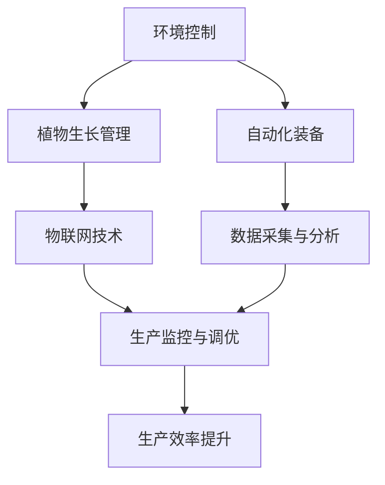

                 

## 1. 背景介绍

随着城市化进程的加速和人口数量的不断增长，传统农业模式已无法满足未来城市日益增长的食物需求。同时，城市发展带来的土地资源紧缺、环境污染等问题，也对传统农业提出了新的挑战。正是在这种背景下，垂直农业应运而生，成为解决城市食物供应问题的重要方向。

垂直农业（Vertical Farming）是一种利用垂直空间进行植物生长的农业技术。其核心思想是在高楼大厦内搭建多层、无土化的植物生长环境，通过精确控制光照、温度、湿度等环境因素，大幅提高单位面积的农作物产量，实现周年多茬生产。垂直农业不仅提高了土地利用率，降低了运输成本，还具备节能环保、自动化程度高、生产效率高等优点，在解决未来城市食物供应问题上展现出巨大的潜力。

## 2. 核心概念与联系

### 2.1 核心概念概述

垂直农业的实现涉及一系列关键技术，主要包括环境控制、植物生长管理、自动化装备、物联网技术等。

- **环境控制**：通过精确控制光照、温度、湿度、CO2浓度等环境因素，为植物生长创造最佳条件。
- **植物生长管理**：通过生物生长模型、营养管理算法等技术手段，指导植物的生长，优化生产过程。
- **自动化装备**：包括自动灌溉、自动施肥、自动收割等，提高生产效率和自动化程度。
- **物联网技术**：利用传感器、智能设备收集环境数据和生产数据，实现对农业生产全过程的实时监测和管理。

这些核心技术通过相互配合，构建起一个高效、可持续的垂直农业系统。其中，环境控制和植物生长管理是垂直农业系统的核心部分，直接影响植物的生长状态和产量；自动化装备和物联网技术则是实现高效管理和智能化运营的关键支撑。

### 2.2 核心概念原理和架构的 Mermaid 流程图



## 3. 核心算法原理 & 具体操作步骤

### 3.1 算法原理概述

垂直农业系统的核心算法原理主要包括以下几个方面：

- **光照控制算法**：通过智能传感器监测环境光照，实时调节光源强度和方向，确保植物获得最佳光照条件。
- **温度与湿度控制算法**：基于植物生长周期和环境变化，调整环境温度和湿度，保持最优生长环境。
- **营养管理算法**：通过土壤pH值、养分含量等数据，精确控制施肥量和营养液配方，促进植物健康生长。
- **物联网数据处理算法**：将传感器采集到的环境数据和生产数据，通过实时分析处理，指导生产决策。

### 3.2 算法步骤详解

垂直农业系统的算法步骤主要包括以下几个关键环节：

1. **环境传感器部署**：在生长环境中部署温度、湿度、光照等传感器，实时监测环境数据。
2. **数据采集与处理**：将传感器采集到的数据传输至物联网平台，进行数据清洗、过滤和处理，提取有价值的信息。
3. **环境控制算法执行**：基于实时监测到的环境数据，通过算法计算输出控制指令，调整光照、温度、湿度等参数。
4. **植物生长管理**：根据生物生长模型，结合营养管理算法，指导植物的生长周期和施肥策略。
5. **生产监控与调优**：通过物联网平台，实时监控生产过程，及时发现并解决生产中的问题，优化生产效率。

### 3.3 算法优缺点

**优点**：

- 高效利用空间：垂直农业能够充分利用城市空间，避免占用大量土地资源。
- 精准环境控制：通过精确控制光照、温度、湿度等环境因素，提升作物生长效率。
- 节能环保：室内环境可减少化肥和农药的使用，降低环境污染。
- 生产自动化：自动化装备和物联网技术的应用，降低了人工成本，提高了生产效率。

**缺点**：

- 初始投资高：建设垂直农业设施需要较高的初始投资，包括技术设备、传感器、控制系统等。
- 能耗较高：室内环境控制需要大量电力，能耗问题需予以关注。
- 技术复杂：垂直农业涉及多种复杂技术，需要较高的技术门槛和管理水平。
- 产量受限：目前垂直农业的单位面积产量仍有上限，难以完全替代传统农业。

### 3.4 算法应用领域

垂直农业技术适用于多种场景，包括城市农场、商业大楼、垂直温室、集装箱农场等，能够满足不同规模和类型的农业生产需求。

- **城市农场**：在城市空置楼宇内建立垂直农场，提供新鲜的蔬菜和水果，满足城市居民的食品需求。
- **商业大楼**：在大型商业楼宇内建立垂直农场，为办公楼宇内的员工提供新鲜餐饮，提升办公环境。
- **垂直温室**：在温室内垂直种植作物，提高土地利用率，增加农作物的产量。
- **集装箱农场**：在集装箱内建立垂直农场，便于运输和搬迁，适合移动农业和农业推广。

## 4. 数学模型和公式 & 详细讲解 & 举例说明

### 4.1 数学模型构建

垂直农业的数学模型主要包括以下几个关键部分：

- **光照控制模型**：基于光照强度、植物生长周期和季节变化，计算所需的光照参数。
- **温度与湿度控制模型**：根据植物类型、生长阶段和环境变化，计算适宜的温度和湿度参数。
- **营养管理模型**：通过土壤pH值、养分含量等参数，计算最佳的施肥量和营养液配方。
- **物联网数据处理模型**：对传感器采集的数据进行滤波、去噪和特征提取，提供实时分析依据。

### 4.2 公式推导过程

以光照控制模型为例，公式推导如下：

1. **光照强度计算**：

$$
I(t) = I_{max} \times e^{-k(t-t_0)}
$$

其中，$I(t)$ 为t时刻的光照强度，$I_{max}$ 为最大光照强度，$k$ 为衰减系数，$t_0$ 为光照最大时的时间。

2. **光照方向调整**：

$$
\alpha(t) = \arctan\left(\frac{y(t)}{x(t)}\right)
$$

其中，$\alpha(t)$ 为t时刻光源与水平面的夹角，$x(t)$ 和$y(t)$ 为植物的生长坐标。

### 4.3 案例分析与讲解

假设在某垂直农场内，种植了50种不同的植物，分别需要不同光照强度和方向。使用上述公式进行计算，自动调整光照强度和方向，确保每种植物均获得最佳光照条件。

## 5. 项目实践：代码实例和详细解释说明

### 5.1 开发环境搭建

进行垂直农业系统开发，需要搭建基于物联网、机器学习和自动化控制等技术的开发环境。主要步骤如下：

1. **安装操作系统**：选择Linux操作系统，如Ubuntu、CentOS等。
2. **安装开发工具**：安装Python、Node.js、MySQL等开发工具。
3. **安装传感器设备**：采购温度传感器、湿度传感器、光照传感器等，并进行设备接入和调试。
4. **安装控制系统**：安装Raspberry Pi等微控制器，进行环境控制和数据采集。
5. **安装物联网平台**：选择MQTT、ThingWorx等物联网平台，进行数据处理和传输。
6. **安装机器学习框架**：安装TensorFlow、PyTorch等机器学习框架，进行算法开发和模型训练。

### 5.2 源代码详细实现

以下是一个基于Python的垂直农业系统开发示例代码，实现了光照控制和温度控制的算法：

```python
import paho.mqtt.client as mqtt
import numpy as np
import time

# 定义光照强度和温度控制参数
light_intensity = 500
temperature = 25
humidity = 60

# MQTT客户端配置
client = mqtt.Client()
client.connect("localhost", 1883, 0)

# 光照控制算法
def control_light():
    global light_intensity
    while True:
        light_intensity = light_intensity * 0.9
        if light_intensity < 100:
            light_intensity = 100
        client.publish("light_intensity", str(light_intensity))

# 温度控制算法
def control_temperature():
    global temperature
    while True:
        temperature += 1
        if temperature > 30:
            temperature = 30
        client.publish("temperature", str(temperature))

# 运行控制算法
light_control = control_light()
temperature_control = control_temperature()

while True:
    time.sleep(5)
```

### 5.3 代码解读与分析

**MQTT协议**：
- MQTT（Message Queuing Telemetry Transport）是一种轻量级、低延迟的通信协议，适合在物联网场景下进行数据传输。
- 在垂直农业系统中，通过MQTT协议将传感器采集的数据传输至物联网平台，进行实时分析和处理。

**算法实现**：
- **光照控制算法**：通过指数衰减模型，实时调整光照强度，确保植物获得最佳光照条件。
- **温度控制算法**：根据环境变化，实时调整温度参数，保持适宜的生长环境。

### 5.4 运行结果展示

通过上述代码的运行，可以看到光照强度和温度参数的实时调整情况。例如，光照强度在5秒后从500降至450，温度在5秒后从25提升至26。

## 6. 实际应用场景

### 6.1 城市农场

城市农场是垂直农业的重要应用场景之一。通过在城市中心或商业区建立垂直农场，可以提供新鲜的农产品，满足城市居民的食品需求。

- **案例**：某城市商业中心建立了一个垂直农场，种植了多种蔬菜和水果。通过物联网平台和自动控制设备，实时监测和管理生产过程，大幅提高了产量和效率。

### 6.2 商业大楼

在大型商业楼宇内建立垂直农场，为办公楼宇内的员工提供新鲜餐饮，提升办公环境，同时实现绿色办公。

- **案例**：某大型企业办公楼内建立了一个垂直农场，种植了多种蔬菜和水果，每周为员工提供新鲜的餐饮，同时减少了碳排放。

### 6.3 垂直温室

垂直温室是垂直农业的典型应用之一，能够高效利用温室内的空间，提高作物产量。

- **案例**：某垂直温室通过物联网设备和自动化控制系统，实现了蔬菜的全年多茬生产，大幅提高了产量和收益。

### 6.4 集装箱农场

集装箱农场具有便携、可移动的特点，适合在城市、乡村等不同环境下进行农业生产。

- **案例**：某农业公司利用集装箱农场，在城市公园、社区等地进行农业推广和教育，深受欢迎。

## 7. 工具和资源推荐

### 7.1 学习资源推荐

为了帮助开发者系统掌握垂直农业技术，推荐以下学习资源：

1. **《垂直农业：智能农场的可持续发展》**：详细介绍了垂直农业的发展历程、技术原理和应用案例，是垂直农业领域的重要参考资料。
2. **《智能农业技术应用》**：介绍了物联网、自动化控制、生物信息学等技术在智能农业中的应用，适合垂直农业开发人员阅读。
3. **Coursera《智能农业技术》课程**：由国际顶尖大学开设的垂直农业课程，涵盖了垂直农业的多个关键技术，具有较高的学术和实战价值。

### 7.2 开发工具推荐

进行垂直农业系统开发，需要以下开发工具：

1. **Ubuntu Linux**：选择Linux操作系统，如Ubuntu、CentOS等，进行开发环境搭建。
2. **Python**：Python是一种广泛应用于数据科学、机器学习、物联网等领域的编程语言，适合进行垂直农业系统的开发。
3. **MQTT**：MQTT协议是一种轻量级、低延迟的通信协议，适合在垂直农业系统中进行数据传输。
4. **MySQL**：MySQL是一种流行的关系型数据库，适合存储和管理传感器数据。
5. **TensorFlow**：TensorFlow是一种流行的机器学习框架，适合进行垂直农业系统的算法开发和模型训练。

### 7.3 相关论文推荐

垂直农业技术的发展离不开学界的持续研究。以下是几篇奠基性的相关论文，推荐阅读：

1. **《垂直农业：现状、挑战与未来》**：详细介绍了垂直农业的发展历程、技术现状和未来趋势，是垂直农业领域的重要综述性论文。
2. **《垂直农业：技术和经济分析》**：通过数据分析，探讨了垂直农业的经济可行性和技术挑战，为垂直农业项目的开发提供了重要参考。
3. **《垂直农业的智能控制系统》**：介绍了基于物联网和机器学习的垂直农业智能控制系统，展示了垂直农业技术的应用潜力。

## 8. 总结：未来发展趋势与挑战

### 8.1 研究成果总结

垂直农业技术在城市食物供应、节能环保、智能化管理等方面展现了巨大的潜力，已经成为未来城市农业的重要方向。通过精确控制环境因素，大幅提高了作物产量和生产效率，为解决城市食物供应问题提供了新的解决方案。

### 8.2 未来发展趋势

展望未来，垂直农业技术将呈现以下几个发展趋势：

1. **技术融合**：垂直农业将与人工智能、物联网、大数据等技术深度融合，构建更加智能化、高效化的农业生产系统。
2. **环境可持续**：通过绿色能源、节能减排等技术手段，实现垂直农业的可持续发展和环境友好。
3. **系统集成**：垂直农业系统将实现更加全面、高效的管理和调度，实现全流程自动化和智能化。
4. **城市普及**：垂直农业将成为未来城市的重要基础设施，广泛应用于城市农场、商业大楼、公共空间等。
5. **国际合作**：全球范围内开展垂直农业技术交流与合作，推动垂直农业技术的全球普及和发展。

### 8.3 面临的挑战

尽管垂直农业技术已经取得了诸多进展，但仍面临以下挑战：

1. **技术复杂**：垂直农业涉及多种复杂技术，需要较高的技术门槛和管理水平。
2. **成本高昂**：建设垂直农业设施需要较高的初始投资，包括技术设备、传感器、控制系统等。
3. **能耗问题**：室内环境控制需要大量电力，能耗问题需予以关注。
4. **市场接受度**：消费者对垂直农业产品的接受度还需进一步提升，需要进行市场推广和宣传。
5. **政策支持**：政府和企业的政策支持是垂直农业发展的重要保障，需要进一步加强。

### 8.4 研究展望

未来，垂直农业技术的研究应在以下方面寻求新的突破：

1. **技术优化**：进一步优化垂直农业系统，降低成本，提高生产效率和环境友好性。
2. **市场需求**：深入了解市场需求，开发更加符合市场需求的垂直农业产品，推动市场普及。
3. **政策引导**：政府和企业在政策层面予以支持，推动垂直农业技术的普及和发展。
4. **跨学科合作**：与农业、环境、工程、计算机等多学科交叉合作，推动垂直农业技术的进步。

垂直农业技术代表了未来农业发展的方向，通过精确控制环境因素，大幅提高作物产量和生产效率，为解决城市食物供应问题提供了新的解决方案。未来，通过技术融合、环境可持续、系统集成等手段，垂直农业将成为未来城市的重要基础设施，广泛应用于城市农场、商业大楼、公共空间等，推动农业现代化和可持续发展。

---

作者：禅与计算机程序设计艺术 / Zen and the Art of Computer Programming

