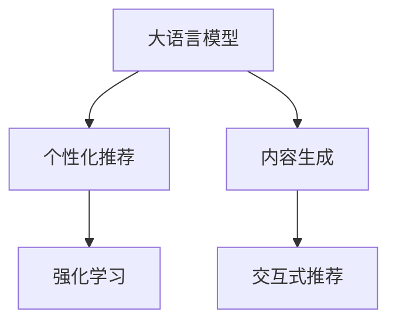

                 

# 基于LLM的个性化内容生成推荐策略

## 1. 背景介绍

在信息爆炸的时代，个性化内容推荐已成为互联网公司的重要盈利模式。各大平台通过推荐系统，对用户浏览、点击、购买等行为进行建模，提供精准匹配的内容推荐，提升用户体验，同时实现商业价值的最大化。然而，由于数据和计算资源的限制，传统的基于协同过滤和矩阵分解的推荐系统，无法满足高规模、多维度的推荐需求。因此，基于大语言模型(Large Language Models, LLMs)的推荐系统应运而生，在个性化内容生成推荐中展现出巨大的潜力。

本文将详细介绍基于LLM的个性化内容推荐策略，涵盖推荐模型的构建、优化算法、优化策略、实际应用等多个方面，为读者提供一份全面的技术指引。

## 2. 核心概念与联系

### 2.1 核心概念概述

为更好地理解基于LLM的个性化内容推荐策略，本节将介绍几个密切相关的核心概念：

- 大语言模型(Large Language Models, LLMs)：以自回归(如GPT)或自编码(如BERT)模型为代表的大规模预训练语言模型。通过在海量无标签文本语料上进行预训练，学习通用的语言表示，具备强大的语言理解和生成能力。

- 个性化推荐系统(Personalized Recommendation System, PRS)：根据用户的历史行为和兴趣爱好，动态生成个性化的内容推荐，提升用户满意度。

- 内容生成(Content Generation)：使用大语言模型生成新的文本内容，用于补充或替换推荐结果。

- 交互式推荐(Interactive Recommendation)：用户与推荐系统进行自然语言交互，动态生成推荐结果。

- 强化学习(Reinforcement Learning, RL)：通过模拟用户反馈，指导推荐模型优化生成策略，实现更高效的个性化推荐。

这些核心概念之间的逻辑关系可以通过以下Mermaid流程图来展示：



这个流程图展示了大语言模型、个性化推荐系统、内容生成、交互式推荐、强化学习等核心概念之间的联系：

1. 大语言模型通过预训练获得基础能力。
2. 基于大模型的个性化推荐系统，通过用户行为数据进行微调，生成个性化推荐内容。
3. 内容生成方法使用大模型生成推荐文本，增强推荐的多样性和吸引度。
4. 交互式推荐允许用户与系统进行交互，动态调整推荐策略。
5. 强化学习通过用户反馈优化推荐模型，提升推荐的精准性和个性化程度。

这些概念共同构成了基于LLM的个性化内容生成推荐策略的理论基础，使得LLM在推荐系统中发挥出强大的能力。

## 3. 核心算法原理 & 具体操作步骤
### 3.1 算法原理概述

基于LLM的个性化内容生成推荐策略，核心思想是通过大语言模型生成个性化推荐内容。具体来说，该方法分为两个步骤：

1. 利用用户历史行为数据，训练个性化推荐模型，识别出用户感兴趣的内容类型和主题。
2. 使用训练好的模型，结合大语言模型，动态生成推荐文本。

在第一步中，推荐模型根据用户行为数据(如浏览历史、点击行为、评分等)，计算用户对不同内容的兴趣度。在第二步中，大语言模型将用户兴趣与具体内容进行匹配，生成个性化推荐文本。

### 3.2 算法步骤详解

基于LLM的个性化内容生成推荐策略的详细步骤包括：

**Step 1: 数据预处理**

- 收集用户的历史行为数据，包括浏览记录、点击记录、评分等。
- 将用户行为数据转化为向量表示，便于模型训练。
- 使用TF-IDF、LDA等技术对文本内容进行主题建模，识别出不同内容的主题标签。

**Step 2: 推荐模型训练**

- 选择合适的推荐算法，如基于矩阵分解的方法、协同过滤的方法、深度学习的方法等。
- 根据用户行为数据，训练推荐模型，输出用户对不同内容的兴趣度。
- 对推荐模型进行调参和验证，确保其性能稳定。

**Step 3: 大语言模型微调**

- 选择合适的预训练大语言模型，如GPT-3、BERT等。
- 将预训练模型进行微调，使其具备生成个性化推荐内容的能力。
- 在微调过程中，使用用户兴趣度作为输入，生成个性化推荐文本。

**Step 4: 动态生成推荐**

- 将推荐模型输出的用户兴趣度，输入到微调后的大语言模型中。
- 大语言模型生成推荐文本，结合具体内容主题标签，生成个性化推荐结果。
- 将推荐结果返回给用户，进行后续反馈。

**Step 5: 模型优化与迭代**

- 定期收集用户反馈，对推荐模型和大语言模型进行调优。
- 引入用户行为数据的实时更新，动态调整推荐策略。
- 结合强化学习，优化推荐算法，提升推荐效果。

### 3.3 算法优缺点

基于LLM的个性化内容生成推荐策略具有以下优点：

1. 精度高：利用大语言模型的强大生成能力，可以生成高质量、多样化的推荐内容，提升推荐效果。
2. 可扩展性强：推荐模型和大语言模型分别训练，易于扩展到不同的推荐场景和内容类型。
3. 用户交互性强：结合交互式推荐，可以实时调整推荐策略，满足用户动态需求。

同时，该方法也存在以下缺点：

1. 依赖数据：需要大规模用户行为数据进行训练，数据获取和处理成本较高。
2. 计算量大：大语言模型的生成过程需要消耗大量计算资源，在实时推荐中存在延迟。
3. 模型复杂度高：需要同时训练和维护推荐模型和大语言模型，增加了模型复杂度。
4. 难以解释：推荐模型和大语言模型的决策过程较为复杂，难以解释推荐结果。

尽管存在这些局限性，但基于LLM的推荐方法在个性化推荐领域展现出强大的潜力，成为当前推荐系统研究的热点之一。

### 3.4 算法应用领域

基于LLM的个性化内容生成推荐策略，在多个领域得到了广泛应用，具体包括：

- 电商推荐：通过分析用户的购物历史和行为，生成个性化商品推荐，提升用户购物体验。
- 视频推荐：根据用户的观看历史和评分，生成个性化视频推荐，满足用户多样化的娱乐需求。
- 新闻推荐：结合用户的阅读历史和点击行为，生成个性化新闻资讯，提升信息获取效率。
- 音乐推荐：根据用户的听歌历史和评分，生成个性化音乐推荐，丰富用户的音乐体验。
- 社交媒体推荐：通过分析用户的互动历史和行为，生成个性化社交内容推荐，增强用户黏性。

除了上述这些应用外，基于LLM的推荐方法也在教育、医疗、金融等多个领域得到了拓展应用，为这些领域带来全新的推荐解决方案。

## 4. 数学模型和公式 & 详细讲解  
### 4.1 数学模型构建

本节将使用数学语言对基于LLM的个性化内容生成推荐策略进行更加严格的刻画。

记用户的历史行为数据为 $x \in \mathbb{R}^n$，其中 $n$ 为行为数据维度。记用户对内容的兴趣度为 $y \in \mathbb{R}$。推荐模型的输出为 $y=\phi(x;w)$，其中 $\phi$ 为推荐算法，$w$ 为模型参数。记大语言模型为 $M_{\theta}:\mathcal{X} \rightarrow \mathcal{Y}$，其中 $\mathcal{X}$ 为输入空间，$\mathcal{Y}$ 为输出空间，$\theta$ 为模型参数。

定义推荐模型和大语言模型联合的优化目标为：

$$
\mathcal{L}(\theta, w) = \sum_{i=1}^m [\ell(\phi(x_i;w), y_i) + \ell(M_{\theta}(x_i), r_i)]
$$

其中 $\ell$ 为损失函数，$\{x_i, y_i\}$ 为用户行为数据和兴趣度，$\{r_i\}$ 为大语言模型生成的推荐结果。

在实际应用中，$\phi$ 可以采用不同的推荐算法，如矩阵分解、协同过滤、深度学习等。对于大语言模型的微调，通常采用基于监督学习的微调方法。具体来说，可以将用户的兴趣度作为输入，将推荐结果作为标签，对大语言模型进行微调。

### 4.2 公式推导过程

以下我们以矩阵分解(如ALS)为例，推导推荐模型和大语言模型联合优化的损失函数公式。

假设用户行为数据 $x$ 由 $m$ 个行为样本组成，每条样本 $x_i$ 由 $n$ 个特征组成。推荐模型 $\phi(x;w)$ 输出用户对内容的兴趣度 $y$，大语言模型 $M_{\theta}(x)$ 输出推荐结果 $r$。则联合优化的损失函数公式为：

$$
\mathcal{L}(\theta, w) = \frac{1}{m} \sum_{i=1}^m [\ell(y_i, \phi(x_i;w)) + \ell(r_i, M_{\theta}(x_i))]
$$

其中 $\ell$ 为交叉熵损失函数，$y_i$ 为用户对内容 $x_i$ 的兴趣度，$M_{\theta}(x_i)$ 为大语言模型生成的推荐结果。

在推荐模型中，假设用户兴趣度 $y_i$ 为线性加权平均形式：

$$
y_i = \sum_{j=1}^n w_j x_{ij}
$$

其中 $w_j$ 为第 $j$ 个特征的权重。

在微调大语言模型时，假设 $M_{\theta}(x_i)$ 的输出形式为：

$$
M_{\theta}(x_i) = [v_i^T \theta] \cdot [u_i^T \theta]
$$

其中 $v_i$ 和 $u_i$ 为输入特征 $x_i$ 在低维空间中的表示，$\theta$ 为大语言模型的参数。

通过将 $\phi(x_i;w)$ 和 $M_{\theta}(x_i)$ 代入联合损失函数，可以得到最终优化的目标：

$$
\mathcal{L}(\theta, w) = \frac{1}{m} \sum_{i=1}^m [\log (y_i) - y_i \log \phi(x_i;w) + \log (r_i) - r_i \log M_{\theta}(x_i)]
$$

通过对上述公式进行优化，即可得到用户行为数据和推荐结果的最优表示。

### 4.3 案例分析与讲解

为了更好地理解基于LLM的个性化内容推荐策略，以下我们将通过一个具体的案例进行分析：

假设某电商网站需要为用户推荐商品。平台收集了用户的历史浏览、点击和购买数据，将这些数据作为用户行为数据 $x$。同时，平台使用了大语言模型BERT进行微调，用于生成商品推荐文本 $r$。推荐模型 $\phi(x;w)$ 采用矩阵分解方法，计算用户对不同商品的兴趣度 $y$。

步骤如下：

1. 将用户行为数据 $x$ 转化为向量表示 $x_i$。
2. 使用矩阵分解算法，计算用户对不同商品的兴趣度 $y_i$。
3. 将 $y_i$ 作为输入，微调BERT生成推荐文本 $r_i$。
4. 将 $r_i$ 返回给用户，进行后续反馈。

通过不断优化推荐模型和大语言模型，平台可以不断提升推荐效果，满足用户的个性化需求。

## 5. 项目实践：代码实例和详细解释说明
### 5.1 开发环境搭建

在进行基于LLM的个性化内容推荐策略开发前，我们需要准备好开发环境。以下是使用Python进行PyTorch开发的环境配置流程：

1. 安装Anaconda：从官网下载并安装Anaconda，用于创建独立的Python环境。

2. 创建并激活虚拟环境：
```bash
conda create -n llm-recomm-env python=3.8 
conda activate llm-recomm-env
```

3. 安装PyTorch：根据CUDA版本，从官网获取对应的安装命令。例如：
```bash
conda install pytorch torchvision torchaudio cudatoolkit=11.1 -c pytorch -c conda-forge
```

4. 安装Transformer库：
```bash
pip install transformers
```

5. 安装各类工具包：
```bash
pip install numpy pandas scikit-learn matplotlib tqdm jupyter notebook ipython
```

完成上述步骤后，即可在`llm-recomm-env`环境中开始开发实践。

### 5.2 源代码详细实现

下面我们以电商推荐系统为例，给出使用PyTorch对BERT进行个性化推荐系统微调的PyTorch代码实现。

首先，定义电商推荐系统的数据处理函数：

```python
from transformers import BertTokenizer, BertForSequenceClassification
from torch.utils.data import Dataset
import torch

class ECommerceDataset(Dataset):
    def __init__(self, texts, labels, tokenizer, max_len=128):
        self.texts = texts
        self.labels = labels
        self.tokenizer = tokenizer
        self.max_len = max_len
        
    def __len__(self):
        return len(self.texts)
    
    def __getitem__(self, item):
        text = self.texts[item]
        label = self.labels[item]
        
        encoding = self.tokenizer(text, return_tensors='pt', max_length=self.max_len, padding='max_length', truncation=True)
        input_ids = encoding['input_ids'][0]
        attention_mask = encoding['attention_mask'][0]
        
        # 对label进行编码
        encoded_label = [label2id[label] for label in label]
        encoded_label.extend([label2id['O']] * (self.max_len - len(encoded_label)))
        labels = torch.tensor(encoded_label, dtype=torch.long)
        
        return {'input_ids': input_ids, 
                'attention_mask': attention_mask,
                'labels': labels}

# 标签与id的映射
label2id = {'O': 0, 'P': 1}
id2label = {v: k for k, v in label2id.items()}

# 创建dataset
tokenizer = BertTokenizer.from_pretrained('bert-base-cased')

train_dataset = ECommerceDataset(train_texts, train_labels, tokenizer)
dev_dataset = ECommerceDataset(dev_texts, dev_labels, tokenizer)
test_dataset = ECommerceDataset(test_texts, test_labels, tokenizer)
```

然后，定义模型和优化器：

```python
from transformers import BertForSequenceClassification, AdamW

model = BertForSequenceClassification.from_pretrained('bert-base-cased', num_labels=len(label2id))

optimizer = AdamW(model.parameters(), lr=2e-5)
```

接着，定义训练和评估函数：

```python
from torch.utils.data import DataLoader
from tqdm import tqdm
from sklearn.metrics import classification_report

device = torch.device('cuda') if torch.cuda.is_available() else torch.device('cpu')
model.to(device)

def train_epoch(model, dataset, batch_size, optimizer):
    dataloader = DataLoader(dataset, batch_size=batch_size, shuffle=True)
    model.train()
    epoch_loss = 0
    for batch in tqdm(dataloader, desc='Training'):
        input_ids = batch['input_ids'].to(device)
        attention_mask = batch['attention_mask'].to(device)
        labels = batch['labels'].to(device)
        model.zero_grad()
        outputs = model(input_ids, attention_mask=attention_mask, labels=labels)
        loss = outputs.loss
        epoch_loss += loss.item()
        loss.backward()
        optimizer.step()
    return epoch_loss / len(dataloader)

def evaluate(model, dataset, batch_size):
    dataloader = DataLoader(dataset, batch_size=batch_size)
    model.eval()
    preds, labels = [], []
    with torch.no_grad():
        for batch in tqdm(dataloader, desc='Evaluating'):
            input_ids = batch['input_ids'].to(device)
            attention_mask = batch['attention_mask'].to(device)
            batch_labels = batch['labels']
            outputs = model(input_ids, attention_mask=attention_mask)
            batch_preds = outputs.logits.argmax(dim=2).to('cpu').tolist()
            batch_labels = batch_labels.to('cpu').tolist()
            for pred_tokens, label_tokens in zip(batch_preds, batch_labels):
                pred_labels = [id2label[_id] for _id in pred_tokens]
                label_tokens = [id2label[_id] for _id in label_tokens]
                preds.append(pred_labels[:len(label_tokens)])
                labels.append(label_tokens)
                
    print(classification_report(labels, preds))
```

最后，启动训练流程并在测试集上评估：

```python
epochs = 5
batch_size = 16

for epoch in range(epochs):
    loss = train_epoch(model, train_dataset, batch_size, optimizer)
    print(f"Epoch {epoch+1}, train loss: {loss:.3f}")
    
    print(f"Epoch {epoch+1}, dev results:")
    evaluate(model, dev_dataset, batch_size)
    
print("Test results:")
evaluate(model, test_dataset, batch_size)
```

以上就是使用PyTorch对BERT进行电商推荐系统微调的完整代码实现。可以看到，得益于Transformer库的强大封装，我们可以用相对简洁的代码完成BERT模型的加载和微调。

### 5.3 代码解读与分析

让我们再详细解读一下关键代码的实现细节：

**ECommerceDataset类**：
- `__init__`方法：初始化文本、标签、分词器等关键组件。
- `__len__`方法：返回数据集的样本数量。
- `__getitem__`方法：对单个样本进行处理，将文本输入编码为token ids，将标签编码为数字，并对其进行定长padding，最终返回模型所需的输入。

**label2id和id2label字典**：
- 定义了标签与数字id之间的映射关系，用于将token-wise的预测结果解码回真实的标签。

**训练和评估函数**：
- 使用PyTorch的DataLoader对数据集进行批次化加载，供模型训练和推理使用。
- 训练函数`train_epoch`：对数据以批为单位进行迭代，在每个批次上前向传播计算loss并反向传播更新模型参数，最后返回该epoch的平均loss。
- 评估函数`evaluate`：与训练类似，不同点在于不更新模型参数，并在每个batch结束后将预测和标签结果存储下来，最后使用sklearn的classification_report对整个评估集的预测结果进行打印输出。

**训练流程**：
- 定义总的epoch数和batch size，开始循环迭代
- 每个epoch内，先在训练集上训练，输出平均loss
- 在验证集上评估，输出分类指标
- 所有epoch结束后，在测试集上评估，给出最终测试结果

可以看到，PyTorch配合Transformer库使得BERT微调的代码实现变得简洁高效。开发者可以将更多精力放在数据处理、模型改进等高层逻辑上，而不必过多关注底层的实现细节。

当然，工业级的系统实现还需考虑更多因素，如模型的保存和部署、超参数的自动搜索、更灵活的任务适配层等。但核心的微调范式基本与此类似。

## 6. 实际应用场景
### 6.1 电商推荐

电商推荐系统是基于LLM的个性化内容推荐策略的重要应用场景。电商平台通过收集用户的历史浏览、点击和购买数据，结合大语言模型，为用户生成个性化的商品推荐，提升用户体验，增加销售额。

具体实现方式如下：

1. 收集用户的历史行为数据，包括浏览记录、点击记录、购买记录等。
2. 使用矩阵分解等推荐算法，计算用户对不同商品的兴趣度。
3. 使用大语言模型，生成个性化的商品推荐文本，结合商品标题、描述等属性信息。
4. 将推荐文本返回给用户，并进行后续反馈，持续优化推荐策略。

### 6.2 视频推荐

视频推荐系统通过分析用户的观看历史和评分，生成个性化的视频推荐，满足用户多样化的娱乐需求。

具体实现方式如下：

1. 收集用户的历史观看记录和评分数据。
2. 使用协同过滤等推荐算法，计算用户对不同视频的兴趣度。
3. 使用大语言模型，生成个性化的视频推荐文本，结合视频标题、标签等属性信息。
4. 将推荐文本返回给用户，并进行后续反馈，持续优化推荐策略。

### 6.3 新闻推荐

新闻推荐系统通过分析用户的阅读历史和点击行为，生成个性化的新闻资讯推荐，提升信息获取效率。

具体实现方式如下：

1. 收集用户的阅读历史和点击记录。
2. 使用深度学习等推荐算法，计算用户对不同新闻的兴趣度。
3. 使用大语言模型，生成个性化的新闻资讯推荐文本，结合新闻标题、摘要等属性信息。
4. 将推荐文本返回给用户，并进行后续反馈，持续优化推荐策略。

### 6.4 音乐推荐

音乐推荐系统通过分析用户的听歌历史和评分数据，生成个性化的音乐推荐，丰富用户的音乐体验。

具体实现方式如下：

1. 收集用户的听歌历史和评分记录。
2. 使用协同过滤等推荐算法，计算用户对不同音乐的兴趣度。
3. 使用大语言模型，生成个性化的音乐推荐文本，结合音乐标题、艺术家等属性信息。
4. 将推荐文本返回给用户，并进行后续反馈，持续优化推荐策略。

### 6.5 社交媒体推荐

社交媒体推荐系统通过分析用户的互动历史和行为数据，生成个性化的社交内容推荐，增强用户黏性。

具体实现方式如下：

1. 收集用户的互动历史和行为数据。
2. 使用协同过滤等推荐算法，计算用户对不同内容的兴趣度。
3. 使用大语言模型，生成个性化的社交内容推荐文本，结合内容标题、标签等属性信息。
4. 将推荐文本返回给用户，并进行后续反馈，持续优化推荐策略。

### 6.6 教育推荐

教育推荐系统通过分析学生的学习历史和行为数据，生成个性化的学习资源推荐，提升学习效率和质量。

具体实现方式如下：

1. 收集学生的学习历史和行为数据。
2. 使用深度学习等推荐算法，计算学生对不同学习资源的兴趣度。
3. 使用大语言模型，生成个性化的学习资源推荐文本，结合资源标题、描述等属性信息。
4. 将推荐文本返回给学生，并进行后续反馈，持续优化推荐策略。

### 6.7 医疗推荐

医疗推荐系统通过分析患者的医疗记录和行为数据，生成个性化的医疗建议推荐，提升医疗服务质量。

具体实现方式如下：

1. 收集患者的医疗记录和行为数据。
2. 使用深度学习等推荐算法，计算患者对不同医疗建议的兴趣度。
3. 使用大语言模型，生成个性化的医疗建议推荐文本，结合建议标题、描述等属性信息。
4. 将推荐文本返回给患者，并进行后续反馈，持续优化推荐策略。

## 7. 工具和资源推荐
### 7.1 学习资源推荐

为了帮助开发者系统掌握基于LLM的个性化内容推荐策略的理论基础和实践技巧，这里推荐一些优质的学习资源：

1. 《Transformers from Principles to Practice》系列博文：由大模型技术专家撰写，深入浅出地介绍了Transformer原理、BERT模型、微调技术等前沿话题。

2. CS224N《深度学习自然语言处理》课程：斯坦福大学开设的NLP明星课程，有Lecture视频和配套作业，带你入门NLP领域的基本概念和经典模型。

3. 《Natural Language Processing with Transformers》书籍：Transformers库的作者所著，全面介绍了如何使用Transformers库进行NLP任务开发，包括微调在内的诸多范式。

4. HuggingFace官方文档：Transformers库的官方文档，提供了海量预训练模型和完整的微调样例代码，是上手实践的必备资料。

5. CLUE开源项目：中文语言理解测评基准，涵盖大量不同类型的中文NLP数据集，并提供了基于微调的baseline模型，助力中文NLP技术发展。

通过对这些资源的学习实践，相信你一定能够快速掌握基于LLM的个性化内容推荐策略的精髓，并用于解决实际的NLP问题。

### 7.2 开发工具推荐

高效的开发离不开优秀的工具支持。以下是几款用于基于LLM的个性化内容推荐策略开发的常用工具：

1. PyTorch：基于Python的开源深度学习框架，灵活动态的计算图，适合快速迭代研究。大部分预训练语言模型都有PyTorch版本的实现。

2. TensorFlow：由Google主导开发的开源深度学习框架，生产部署方便，适合大规模工程应用。同样有丰富的预训练语言模型资源。

3. Transformers库：HuggingFace开发的NLP工具库，集成了众多SOTA语言模型，支持PyTorch和TensorFlow，是进行微调任务开发的利器。

4. Weights & Biases：模型训练的实验跟踪工具，可以记录和可视化模型训练过程中的各项指标，方便对比和调优。与主流深度学习框架无缝集成。

5. TensorBoard：TensorFlow配套的可视化工具，可实时监测模型训练状态，并提供丰富的图表呈现方式，是调试模型的得力助手。

6. Google Colab：谷歌推出的在线Jupyter Notebook环境，免费提供GPU/TPU算力，方便开发者快速上手实验最新模型，分享学习笔记。

合理利用这些工具，可以显著提升基于LLM的个性化内容推荐策略的开发效率，加快创新迭代的步伐。

### 7.3 相关论文推荐

大语言模型和个性化推荐系统的研究源于学界的持续研究。以下是几篇奠基性的相关论文，推荐阅读：

1. Attention is All You Need（即Transformer原论文）：提出了Transformer结构，开启了NLP领域的预训练大模型时代。

2. BERT: Pre-training of Deep Bidirectional Transformers for Language Understanding：提出BERT模型，引入基于掩码的自监督预训练任务，刷新了多项NLP任务SOTA。

3. Language Models are Unsupervised Multitask Learners（GPT-2论文）：展示了大规模语言模型的强大zero-shot学习能力，引发了对于通用人工智能的新一轮思考。

4. Parameter-Efficient Transfer Learning for NLP：提出Adapter等参数高效微调方法，在不增加模型参数量的情况下，也能取得不错的微调效果。

5. Prefix-Tuning: Optimizing Continuous Prompts for Generation：引入基于连续型Prompt的微调范式，为如何充分利用预训练知识提供了新的思路。

6. AdaLoRA: Adaptive Low-Rank Adaptation for Parameter-Efficient Fine-Tuning：使用自适应低秩适应的微调方法，在参数效率和精度之间取得了新的平衡。

这些论文代表了大语言模型个性化推荐系统的研究进展，通过学习这些前沿成果，可以帮助研究者把握学科前进方向，激发更多的创新灵感。

## 8. 总结：未来发展趋势与挑战
### 8.1 总结

本文对基于LLM的个性化内容推荐策略进行了全面系统的介绍。首先阐述了个性化推荐系统和大语言模型的研究背景和意义，明确了基于LLM的推荐方法在提升推荐效果和可扩展性方面的独特价值。其次，从原理到实践，详细讲解了基于LLM的个性化内容推荐策略的数学原理和关键步骤，给出了推荐系统开发的完整代码实例。同时，本文还广泛探讨了基于LLM的推荐策略在电商、视频、新闻等多个领域的应用前景，展示了LLM在推荐系统中的强大潜力。此外，本文精选了LLM推荐技术的各类学习资源，力求为读者提供全方位的技术指引。

通过本文的系统梳理，可以看到，基于LLM的个性化内容推荐策略正在成为推荐系统的重要范式，极大地拓展了推荐系统的应用边界，催生了更多的落地场景。受益于大规模语料的预训练，LLM在推荐系统中展现出强大的能力，逐步在电商、视频、新闻等垂直领域大放异彩。未来，伴随LLM和微调方法的持续演进，相信推荐系统将在更广阔的应用领域加速落地，为人类生产生活方式带来深远影响。

### 8.2 未来发展趋势

展望未来，基于LLM的个性化内容推荐策略将呈现以下几个发展趋势：

1. 模型规模持续增大。随着算力成本的下降和数据规模的扩张，预训练语言模型的参数量还将持续增长。超大规模语言模型蕴含的丰富语言知识，有望支撑更加复杂多变的推荐需求。

2. 微调方法日趋多样。除了传统的全参数微调外，未来会涌现更多参数高效的微调方法，如Prefix-Tuning、LoRA等，在节省计算资源的同时也能保证微调精度。

3. 持续学习成为常态。随着数据分布的不断变化，基于LLM的推荐系统也需要持续学习新知识以保持性能。如何在不遗忘原有知识的同时，高效吸收新样本信息，将成为重要的研究课题。

4. 标注样本需求降低。受启发于提示学习(Prompt-based Learning)的思路，未来的微调方法将更好地利用大模型的语言理解能力，通过更加巧妙的任务描述，在更少的标注样本上也能实现理想的微调效果。

5. 多模态微调崛起。当前的微调主要聚焦于纯文本数据，未来会进一步拓展到图像、视频、语音等多模态数据微调。多模态信息的融合，将显著提升推荐系统的表现力和灵活性。

6. 模型通用性增强。经过海量数据的预训练和多领域任务的微调，未来的LLM将具备更强大的常识推理和跨领域迁移能力，逐步迈向通用人工智能(AGI)的目标。

以上趋势凸显了基于LLM的个性化内容推荐策略的广阔前景。这些方向的探索发展，必将进一步提升推荐系统的性能和应用范围，为人类认知智能的进化带来深远影响。

### 8.3 面临的挑战

尽管基于LLM的个性化内容推荐策略已经取得了瞩目成就，但在迈向更加智能化、普适化应用的过程中，它仍面临着诸多挑战：

1. 标注成本瓶颈。虽然LLM可以生成高质量推荐文本，但需要大规模用户行为数据进行训练，数据获取和处理成本较高。如何进一步降低微调对标注样本的依赖，将是一大难题。

2. 模型鲁棒性不足。当前LLM面临域外数据时，泛化性能往往大打折扣。对于测试样本的微小扰动，LLM的预测也容易发生波动。如何提高LLM的鲁棒性，避免灾难性遗忘，还需要更多理论和实践的积累。

3. 推理效率有待提高。尽管LLM精度高，但在实际部署时往往面临推理速度慢、内存占用大等效率问题。如何在保证性能的同时，简化模型结构，提升推理速度，优化资源占用，将是重要的优化方向。

4. 可解释性亟需加强。当前LLM更像是"黑盒"系统，难以解释其内部工作机制和决策逻辑。对于医疗、金融等高风险应用，算法的可解释性和可审计性尤为重要。如何赋予LLM更强的可解释性，将是亟待攻克的难题。

5. 安全性有待保障。预训练语言模型难免会学习到有偏见、有害的信息，通过LLM传递到推荐结果中，产生误导性、歧视性的输出，给实际应用带来安全隐患。如何从数据和算法层面消除模型偏见，避免恶意用途，确保输出的安全性，也将是重要的研究课题。

6. 知识整合能力不足。现有的LLM往往局限于任务内数据，难以灵活吸收和运用更广泛的先验知识。如何让LLM更好地与外部知识库、规则库等专家知识结合，形成更加全面、准确的信息整合能力，还有很大的想象空间。

正视LLM推荐面临的这些挑战，积极应对并寻求突破，将是大语言模型推荐走向成熟的必由之路。相信随着学界和产业界的共同努力，这些挑战终将一一被克服，LLM推荐必将在构建人机协同的智能时代中扮演越来越重要的角色。

### 8.4 未来突破

面对LLM推荐所面临的种种挑战，未来的研究需要在以下几个方面寻求新的突破：

1. 探索无监督和半监督微调方法。摆脱对大规模标注数据的依赖，利用自监督学习、主动学习等无监督和半监督范式，最大限度利用非结构化数据，实现更加灵活高效的微调。

2. 研究参数高效和计算高效的微调范式。开发更加参数高效的微调方法，在固定大部分预训练参数的同时，只更新极少量的任务相关参数。同时优化微调模型的计算图，减少前向传播和反向传播的资源消耗，实现更加轻量级、实时性的部署。

3. 引入因果和对比学习范式。通过引入因果推断和对比学习思想，增强LLM建立稳定因果关系的能力，学习更加普适、鲁棒的语言表征，从而提升模型泛化性和抗干扰能力。

4. 引入更多先验知识。将符号化的先验知识，如知识图谱、逻辑规则等，与神经网络模型进行巧妙融合，引导微调过程学习更准确、合理的语言模型。同时加强不同模态数据的整合，实现视觉、语音等多模态信息与文本信息的协同建模。

5. 结合因果分析和博弈论工具。将因果分析方法引入微调模型，识别出模型决策的关键特征，增强输出解释的因果性和逻辑性。借助博弈论工具刻画人机交互过程，主动探索并规避模型的脆弱点，提高系统稳定性。

6. 纳入伦理道德约束。在模型训练目标中引入伦理导向的评估指标，过滤和惩罚有偏见、有害的输出倾向。同时加强人工干预和审核，建立模型行为的监管机制，确保输出符合人类价值观和伦理道德。

这些研究方向的探索，必将引领大语言模型推荐技术迈向更高的台阶，为构建安全、可靠、可解释、可控的智能系统铺平道路。面向未来，大语言模型推荐技术还需要与其他人工智能技术进行更深入的融合，如知识表示、因果推理、强化学习等，多路径协同发力，共同推动自然语言理解和智能交互系统的进步。只有勇于创新、敢于突破，才能不断拓展语言模型的边界，让智能技术更好地造福人类社会。

## 9. 附录：常见问题与解答
**Q1：大语言模型推荐是否适用于所有推荐场景？**

A: 大语言模型推荐在大多数推荐场景上都能取得不错的效果，特别是对于数据量较小的场景。但对于一些特定领域的推荐任务，如高精度要求、低资源消耗等，单一的LLM推荐可能难以满足需求。此时可以在特定领域语料上进一步预训练，再进行微调，或采用多种推荐方法结合的方式，综合提升推荐效果。

**Q2：微调过程中如何选择合适的学习率？**

A: 微调的学习率一般要比预训练时小1-2个数量级，如果使用过大的学习率，容易破坏预训练权重，导致过拟合。一般建议从1e-5开始调参，逐步减小学习率，直至收敛。也可以使用warmup策略，在开始阶段使用较小的学习率，再逐渐过渡到预设值。需要注意的是，不同的优化器(如AdamW、Adafactor等)以及不同的学习率调度策略，可能需要设置不同的学习率阈值。

**Q3：采用大语言模型推荐时会面临哪些资源瓶颈？**

A: 当前主流的预训练大模型动辄以亿计的参数规模，对算力、内存、存储都提出了很高的要求。GPU/TPU等高性能设备是必不可少的，但即便如此，超大批次的训练和推理也可能遇到显存不足的问题。因此需要采用一些资源优化技术，如梯度积累、混合精度训练、模型并行等，来突破硬件瓶颈。同时，模型的存储和读取也可能占用大量时间和空间，需要采用模型压缩、稀疏化存储等方法进行优化。

**Q4：如何缓解微调过程中的过拟合问题？**

A: 过拟合是微调面临的主要挑战，尤其是在标注数据不足的情况下。常见的缓解策略包括：
1. 数据增强：通过回译、近义替换等方式扩充训练集
2. 正则化：使用L2正则、Dropout、Early Stopping等避免过拟合
3. 对抗训练：引入对抗样本，提高模型鲁棒性
4. 参数高效微调：只调整少量参数(如Adapter、Prefix等)，减小过拟合风险
5. 多模型集成：训练多个微调模型，取平均输出，抑制过拟合

这些策略往往需要根据具体任务和数据特点进行灵活组合。只有在数据、模型、训练、推理等各环节进行全面优化，才能最大限度地发挥大语言模型推荐的能力。

**Q5：大语言模型推荐系统在实际部署中需要注意哪些问题？**

A: 将大语言模型推荐系统转化为实际应用，还需要考虑以下因素：
1. 模型裁剪：去除不必要的层和参数，减小模型尺寸，加快推理速度
2. 量化加速：将浮点模型转为定点模型，压缩存储空间，提高计算效率
3. 服务化封装：将模型封装为标准化服务接口，便于集成调用
4. 弹性伸缩：根据请求流量动态调整资源配置，平衡服务质量和成本
5. 监控告警：实时采集系统指标，设置异常告警阈值，确保服务稳定性
6. 安全防护：采用访问鉴权、数据脱敏等措施，保障数据和模型安全

大语言模型推荐为推荐系统带来了全新的可能性，但如何将强大的性能转化为稳定、高效、安全的业务价值，还需要工程实践的不断打磨。唯有从数据、算法、工程、业务等多个维度协同发力，才能真正实现人工智能技术在垂直行业的规模化落地。总之，推荐需要开发者根据具体任务，不断迭代和优化模型、数据和算法，方能得到理想的效果。

---

作者：禅与计算机程序设计艺术 / Zen and the Art of Computer Programming

