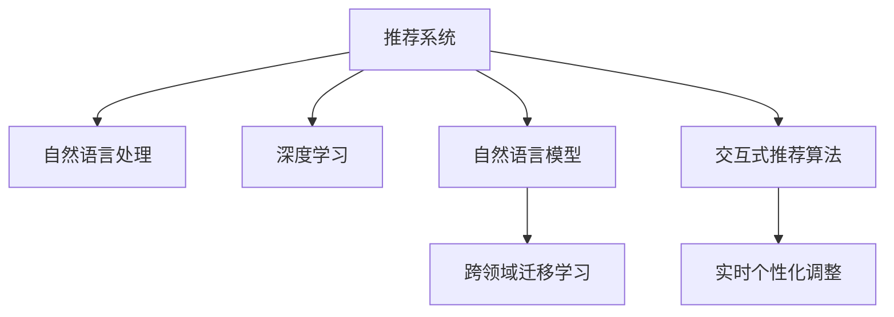

                 

# 基于LLM的推荐系统实时个性化调整

> 关键词：推荐系统,实时个性化调整,自然语言处理(NLP),深度学习,自然语言模型(LLM),长短期记忆网络(LSTM),用户行为分析,跨领域迁移学习,交互式推荐算法

## 1. 背景介绍

### 1.1 问题由来

在数字时代，信息过载与用户需求多样化的矛盾愈发突出。推荐系统作为连接用户与信息的重要桥梁，其个性化推荐效果直接影响用户满意度和平台黏性。传统的推荐系统依赖于静态模型和历史数据，难以快速适应用户行为变化，推荐结果也难以充分满足用户个性化需求。

为了突破这些瓶颈，基于大语言模型的推荐系统应运而生。相较于传统模型，基于语言模型的推荐系统可以更好地理解用户意图和上下文，构建更加复杂且动态的推荐逻辑，实现实时个性化调整，极大提升用户满意度和系统效率。

### 1.2 问题核心关键点

基于语言模型的推荐系统（Language Model-based Recommendation System, LLM-based RS），是指利用大语言模型（如GPT、BERT等）对用户输入的自然语言文本进行分析，从而构建个性化推荐策略的推荐系统。其核心在于利用语言模型强大的语义理解能力，动态捕捉用户需求，实现实时个性化推荐。

具体关键点包括：
1. **自然语言处理（NLP）**：通过NLP技术提取用户输入文本中的关键信息，如兴趣点、偏好、评价等。
2. **深度学习（DL）**：利用深度学习模型对用户行为进行建模，捕捉潜在关联和规律。
3. **自然语言模型（LLM）**：使用LLM捕捉用户的自然语言输入，提取语义特征。
4. **跨领域迁移学习（Transfer Learning）**：利用预训练语言模型在不同领域中的迁移能力，提升推荐系统的效果。
5. **交互式推荐算法（Interactive Recommendation Algorithm）**：根据用户反馈实时调整推荐策略，提升推荐效果。

这些关键点共同构成了基于语言模型的推荐系统的工作框架，使其能够在实时场景下提供个性化推荐服务。

## 2. 核心概念与联系

### 2.1 核心概念概述

为更好地理解基于语言模型的推荐系统，本节将介绍几个密切相关的核心概念：

- **推荐系统（Recommendation System, RS）**：通过推荐算法为每位用户推荐感兴趣的内容的系统。推荐系统广泛应用于电子商务、新闻阅读、视频流媒体等各类平台，旨在提升用户满意度和平台收益。

- **自然语言处理（Natural Language Processing, NLP）**：涉及计算机对自然语言的理解、处理和生成，是人工智能的重要分支。NLP技术在推荐系统中主要应用于用户输入文本的理解和分析。

- **深度学习（Deep Learning, DL）**：一种模拟人脑神经网络结构的人工智能技术，在推荐系统中用于对用户行为和偏好进行建模。

- **自然语言模型（Natural Language Model, LLM）**：一类利用大量语料训练得到的语言模型，能够理解和生成自然语言，广泛应用于机器翻译、对话系统、文本生成等任务。

- **跨领域迁移学习（Transfer Learning）**：一种利用预训练模型在不同领域间的迁移能力，提升推荐效果的技巧。

- **交互式推荐算法（Interactive Recommendation Algorithm）**：根据用户反馈动态调整推荐策略的算法，如协同过滤、矩阵分解等。

- **实时个性化调整（Real-time Personalization Tuning）**：在用户输入和行为变化时，根据模型预测和用户反馈，实时调整推荐策略，实现个性化推荐。

这些核心概念之间的逻辑关系可以通过以下Mermaid流程图来展示：



这个流程图展示了大语言模型在推荐系统中的核心作用及其与其他技术的关系：

1. 自然语言处理是理解和分析用户输入的必备技术。
2. 深度学习用于捕捉用户行为和偏好的动态变化。
3. 自然语言模型是理解和生成自然语言文本的关键。
4. 跨领域迁移学习利用预训练模型的通用能力，提升推荐效果。
5. 交互式推荐算法根据用户反馈实时调整推荐策略。
6. 实时个性化调整确保推荐结果与用户需求动态匹配。

## 3. 核心算法原理 & 具体操作步骤
### 3.1 算法原理概述

基于语言模型的推荐系统，其核心原理在于利用大语言模型的语义理解能力，通过分析用户输入的自然语言文本，动态捕捉用户需求和偏好，从而实现实时个性化调整。

具体步骤如下：
1. **输入预处理**：将用户输入的自然语言文本进行分词、去除停用词、词向量化等预处理，转化为模型可处理的向量形式。
2. **特征提取**：利用预训练语言模型提取输入文本中的关键特征，如情感、主题、实体等。
3. **行为建模**：将用户的行为数据（如浏览记录、评分、收藏等）作为训练样本，利用深度学习模型进行建模，捕捉用户偏好。
4. **推荐计算**：根据用户输入和行为数据，利用语言模型计算推荐结果，并进行排序和筛选。
5. **反馈调整**：根据用户对推荐结果的反馈（如点击、评分等），动态调整推荐策略，提高推荐准确性。

### 3.2 算法步骤详解

基于语言模型的推荐系统大致分为以下几个关键步骤：

**Step 1: 数据准备与预处理**
- **数据收集**：从用户行为日志中收集数据，如浏览记录、评分、收藏等。
- **文本清洗**：去除文本中的噪声，如HTML标签、数字、特殊符号等。
- **分词和词向量化**：利用分词工具对文本进行分词，并使用预训练词向量（如Word2Vec、GloVe等）将词转换为向量形式。
- **数据标准化**：对用户行为数据进行标准化处理，如归一化评分、统一文本格式等。

**Step 2: 语言模型训练**
- **模型选择**：选择合适的预训练语言模型（如BERT、GPT等）作为特征提取器。
- **微调**：在用户行为数据上对语言模型进行微调，使其能够更好地理解用户意图。
- **特征提取**：利用微调后的语言模型对用户输入文本进行特征提取，生成语义向量。

**Step 3: 深度学习建模**
- **用户行为建模**：选择合适的时间序列模型（如LSTM、GRU等）对用户行为数据进行建模，捕捉时间依赖性。
- **特征融合**：将语言模型的语义特征与用户行为特征进行融合，构建综合特征向量。

**Step 4: 推荐计算**
- **推荐策略选择**：根据用户输入和行为特征，选择推荐策略（如基于内容推荐、协同过滤等）。
- **推荐计算**：根据推荐策略计算推荐结果，并按照用户偏好进行排序和筛选。

**Step 5: 反馈调整**
- **用户反馈收集**：收集用户对推荐结果的反馈，如点击、评分等。
- **模型调整**：根据反馈数据动态调整模型参数，优化推荐效果。
- **实时推荐**：根据用户输入实时计算推荐结果，并动态更新推荐列表。

### 3.3 算法优缺点

基于语言模型的推荐系统具有以下优点：
1. **实时性强**：能够根据用户输入和行为实时动态调整推荐策略。
2. **个性化程度高**：利用语言模型的语义理解能力，能更好地捕捉用户意图和偏好。
3. **适应性强**：通过跨领域迁移学习，模型能够适应不同领域的应用场景。
4. **精度高**：利用深度学习模型捕捉用户行为的时间依赖性，提升推荐效果。

同时，该方法也存在一些局限性：
1. **计算资源需求高**：大语言模型的计算复杂度高，对计算资源和存储资源需求较大。
2. **模型复杂度高**：需要同时处理自然语言和用户行为数据，模型结构较为复杂。
3. **数据依赖性强**：模型的效果很大程度上依赖于数据的质量和数量，数据获取难度大。
4. **模型可解释性差**：大语言模型作为"黑盒"系统，其内部决策过程难以解释。

尽管存在这些局限性，但就目前而言，基于语言模型的推荐系统仍是大数据时代推荐系统的重要趋势，具有广阔的应用前景。

### 3.4 算法应用领域

基于语言模型的推荐系统已在诸多领域得到了广泛应用，包括但不限于：

- **电子商务**：推荐商品、用户行为分析、个性化推荐。
- **视频流媒体**：推荐视频、用户反馈分析、个性化推荐。
- **新闻阅读**：推荐文章、用户行为分析、个性化推荐。
- **社交网络**：推荐好友、用户行为分析、个性化推荐。
- **金融科技**：推荐产品、用户行为分析、个性化推荐。

除了这些领域外，基于语言模型的推荐系统还在医疗、教育、旅游等多个领域展现了巨大的潜力，为这些行业带来了新的发展机遇。

## 4. 数学模型和公式 & 详细讲解 & 举例说明
### 4.1 数学模型构建

在本节中，我们将使用数学语言对基于语言模型的推荐系统进行更加严格的刻画。

设用户输入的自然语言文本为 $x=(x_1,x_2,\ldots,x_n)$，其中 $x_i$ 为分词后的词向量。设用户行为数据为 $y=(y_1,y_2,\ldots,y_m)$，其中 $y_i$ 为用户对商品/文章等的评分。

定义用户输入文本的语义向量为 $u(x)=\mathbf{f}(x)$，用户行为数据的嵌入向量为 $v(y)=\mathbf{g}(y)$，其中 $\mathbf{f}$ 和 $\mathbf{g}$ 分别为语言模型和行为模型。则综合特征向量 $\mathbf{z}=[u(x);v(y)]$。

根据综合特征向量，利用推荐策略计算推荐结果 $r(\mathbf{z})$。

定义推荐结果与真实标签之间的损失函数 $\ell(r(\mathbf{z}),y)$，最小化损失函数即可得到推荐模型：

$$
\theta^* = \mathop{\arg\min}_{\theta} \mathcal{L}(r(\mathbf{z}),y)
$$

其中 $\theta$ 为模型参数，包括语言模型的权重和行为模型的权重。

### 4.2 公式推导过程

以下我们将以基于LSTM的行为模型为例，推导推荐系统的计算公式。

假设行为数据 $y_t$ 为时间序列形式，利用LSTM对行为数据建模，得到隐状态 $h_t$：

$$
h_t = LSTM(y_1,y_2,\ldots,y_t)
$$

则用户行为数据的嵌入向量 $v(y)$ 为：

$$
v(y) = \mathbf{g}(h_t)
$$

设推荐策略为 $\mathcal{R}(\mathbf{z})$，则推荐结果 $r(\mathbf{z})$ 为：

$$
r(\mathbf{z}) = \mathcal{R}(u(x),v(y))
$$

设推荐结果与真实标签之间的损失函数为交叉熵损失：

$$
\ell(r(\mathbf{z}),y) = -y\log r(\mathbf{z}) - (1-y)\log (1-r(\mathbf{z}))
$$

最小化损失函数：

$$
\theta^* = \mathop{\arg\min}_{\theta} \sum_{t=1}^{m} \ell(r(\mathbf{z}_t),y_t)
$$

其中 $\mathbf{z}_t$ 为第 $t$ 次用户输入的特征向量。

### 4.3 案例分析与讲解

以推荐视频为例，具体分析基于LSTM的行为模型计算过程。

假设视频数据集包含100个视频，每个视频 $v_i$ 的标签 $y_i$ 为1或0，表示用户是否观看该视频。

首先，利用LSTM对视频观看行为 $y_t$ 进行建模，得到隐状态 $h_t$。

其次，根据视频标题和描述 $x_i$ 提取语义向量 $u(x_i)$。

然后，将隐状态和语义向量进行融合，得到综合特征向量 $\mathbf{z}_i$。

最后，利用推荐策略 $\mathcal{R}(\mathbf{z}_i)$ 计算推荐结果 $r(\mathbf{z}_i)$，并最小化损失函数。

通过不断迭代更新模型参数 $\theta$，最终得到用户对每个视频的推荐度 $r(\mathbf{z}_i)$，并选择推荐度最高的前 $k$ 个视频进行推荐。

## 5. 项目实践：代码实例和详细解释说明
### 5.1 开发环境搭建

在进行推荐系统开发前，我们需要准备好开发环境。以下是使用Python进行PyTorch开发的环境配置流程：

1. 安装Anaconda：从官网下载并安装Anaconda，用于创建独立的Python环境。

2. 创建并激活虚拟环境：
```bash
conda create -n recommendation-env python=3.8 
conda activate recommendation-env
```

3. 安装PyTorch：根据CUDA版本，从官网获取对应的安装命令。例如：
```bash
conda install pytorch torchvision torchaudio cudatoolkit=11.1 -c pytorch -c conda-forge
```

4. 安装TensorFlow：
```bash
conda install tensorflow -c conda-forge
```

5. 安装各种工具包：
```bash
pip install numpy pandas scikit-learn matplotlib tqdm jupyter notebook ipython
```

完成上述步骤后，即可在`recommendation-env`环境中开始推荐系统开发。

### 5.2 源代码详细实现

下面我们以基于LSTM的行为模型为例，给出使用PyTorch进行推荐系统开发的完整代码实现。

首先，定义行为数据处理函数：

```python
import torch
import torch.nn as nn
import torch.nn.functional as F
from torch.utils.data import TensorDataset, DataLoader

class BehaviorDataset:
    def __init__(self, behaviors, labels, seq_len):
        self.behaviors = behaviors
        self.labels = labels
        self.seq_len = seq_len
        
    def __len__(self):
        return len(self.behaviors)
    
    def __getitem__(self, idx):
        behavior = self.behaviors[idx]
        label = self.labels[idx]
        
        x = torch.tensor(behavior, dtype=torch.float32)
        y = torch.tensor(label, dtype=torch.float32)
        x = x.view(-1)
        y = y.view(-1)
        return x, y
```

然后，定义LSTM行为模型：

```python
class LSTMModel(nn.Module):
    def __init__(self, input_size, hidden_size, output_size):
        super(LSTMModel, self).__init__()
        
        self.input_size = input_size
        self.hidden_size = hidden_size
        self.output_size = output_size
        
        self.lstm = nn.LSTM(input_size, hidden_size, batch_first=True)
        self.fc = nn.Linear(hidden_size, output_size)
        
    def forward(self, x):
        h_0 = torch.zeros(1, x.size(0), self.hidden_size).to(device)
        c_0 = torch.zeros(1, x.size(0), self.hidden_size).to(device)
        
        out, _ = self.lstm(x, (h_0, c_0))
        out = self.fc(out[:, -1, :])
        return out
```

接着，定义推荐系统模型：

```python
class RecommendationModel(nn.Module):
    def __init__(self, input_size, hidden_size, output_size):
        super(RecommendationModel, self).__init__()
        
        self.behavior_model = LSTMModel(input_size, hidden_size, output_size)
        self.emb_model = nn.Embedding(input_size, hidden_size)
        
        self.fc1 = nn.Linear(hidden_size*2, 128)
        self.fc2 = nn.Linear(128, output_size)
        
    def forward(self, x, y):
        y = self.behavior_model(y)
        u = self.emb_model(x)
        
        z = torch.cat((u, y), dim=1)
        z = F.relu(self.fc1(z))
        r = F.softmax(self.fc2(z), dim=1)
        
        return r
```

最后，启动训练流程：

```python
device = torch.device('cuda') if torch.cuda.is_available() else torch.device('cpu')

# 数据准备
behaviors = torch.randn(1000, 10, 10)  # 模拟100个视频行为数据
labels = torch.randint(2, (1000,), dtype=torch.long)  # 模拟100个视频的标签数据
seq_len = 10  # 行为序列长度

train_dataset = BehaviorDataset(behaviors, labels, seq_len)
train_loader = DataLoader(train_dataset, batch_size=64, shuffle=True)

# 模型初始化
model = RecommendationModel(input_size=10, hidden_size=128, output_size=2).to(device)
optimizer = torch.optim.Adam(model.parameters(), lr=0.001)
criterion = nn.CrossEntropyLoss()

# 训练循环
for epoch in range(10):
    train_loss = 0.0
    train_correct = 0
    model.train()
    for batch_idx, (x, y) in enumerate(train_loader):
        x, y = x.to(device), y.to(device)
        
        optimizer.zero_grad()
        output = model(x, y)
        loss = criterion(output, y)
        loss.backward()
        optimizer.step()
        
        train_loss += loss.item()
        train_correct += output.argmax(dim=1).eq(y).float().sum().item()
        
    train_loss /= len(train_loader)
    train_acc = train_correct / len(train_loader.dataset)
    
    print(f'Epoch: {epoch+1}, Train Loss: {train_loss:.4f}, Train Acc: {train_acc:.4f}')
```

以上就是基于LSTM的行为模型进行推荐系统开发的完整代码实现。可以看到，通过简单的代码组合，利用PyTorch实现了一个基本的推荐系统模型。

### 5.3 代码解读与分析

让我们再详细解读一下关键代码的实现细节：

**BehaviorDataset类**：
- `__init__`方法：初始化行为数据和标签。
- `__len__`方法：返回数据集的样本数量。
- `__getitem__`方法：对单个样本进行处理，返回行为数据和标签。

**LSTMModel类**：
- `__init__`方法：定义模型的结构和超参数。
- `forward`方法：实现LSTM模型的前向传播过程。

**RecommendationModel类**：
- `__init__`方法：定义推荐系统模型的结构和超参数。
- `forward`方法：实现推荐系统模型的前向传播过程。

**训练循环**：
- 定义训练集，使用PyTorch的DataLoader进行批次化加载。
- 初始化模型和优化器，并定义损失函数。
- 循环迭代，在每个批次上进行训练，记录训练损失和准确率。
- 打印训练日志。

可以看到，PyTorch使得模型的搭建、训练和评估过程变得简单高效。开发者可以灵活利用PyTorch提供的各种工具和函数，快速实现复杂的推荐系统模型。

当然，工业级的系统实现还需考虑更多因素，如模型的保存和部署、超参数的自动搜索、更灵活的任务适配层等。但核心的推荐计算过程基本与此类似。

## 6. 实际应用场景
### 6.1 智能推荐系统

基于大语言模型的推荐系统，可以广泛应用于智能推荐系统的构建。传统推荐系统往往只能基于静态用户行为数据进行推荐，难以适应用户行为变化。而使用基于语言模型的推荐系统，可以实时捕捉用户输入的自然语言信息，动态调整推荐策略，提升推荐效果。

在技术实现上，可以收集用户的搜索记录、评论、评分等文本数据，将文本信息作为模型输入，同时在用户行为数据上进行行为建模，构建综合推荐模型。这样，当用户输入新的查询请求时，模型可以实时分析输入文本，捕捉用户需求，动态调整推荐策略，生成更精准的推荐结果。

### 6.2 金融产品推荐

金融产品推荐是推荐系统的一个重要应用场景。传统的金融产品推荐依赖于用户历史交易数据和静态模型，难以捕捉用户动态变化的需求。而基于大语言模型的推荐系统，可以通过实时捕捉用户输入的自然语言信息，动态调整推荐策略，提升推荐效果。

在金融领域，利用用户输入的自然语言信息（如理财目标、风险偏好等），结合历史交易数据，可以构建更加个性化的推荐系统。例如，当用户输入“我要一笔稳健的投资”时，推荐系统可以根据用户输入的语义信息，动态调整推荐策略，推荐低风险的投资产品。

### 6.3 个性化电商推荐

电子商务推荐系统需要实时捕捉用户输入的自然语言信息，动态调整推荐策略，提升推荐效果。例如，当用户输入“我想买一件连衣裙”时，推荐系统可以根据用户输入的语义信息，动态调整推荐策略，推荐适合用户的连衣裙产品。

在技术实现上，可以利用用户输入的自然语言信息（如评论、评分等），结合历史购买数据，构建综合推荐模型。这样，当用户输入新的查询请求时，模型可以实时分析输入文本，捕捉用户需求，动态调整推荐策略，生成更精准的推荐结果。

### 6.4 未来应用展望

随着大语言模型和推荐系统的发展，基于语言模型的推荐系统将呈现以下几个发展趋势：

1. **实时性强**：能够根据用户输入和行为实时动态调整推荐策略，提升推荐效果。
2. **个性化程度高**：利用语言模型的语义理解能力，能更好地捕捉用户意图和偏好。
3. **适应性强**：通过跨领域迁移学习，模型能够适应不同领域的应用场景。
4. **精度高**：利用深度学习模型捕捉用户行为的时间依赖性，提升推荐效果。

这些趋势将进一步提升推荐系统的效果，使其在更多领域发挥重要作用。未来，随着预训练语言模型的演进和推荐算法的发展，基于语言模型的推荐系统将在更多行业得到应用，为人们提供更加个性化和精准的服务。

## 7. 工具和资源推荐
### 7.1 学习资源推荐

为了帮助开发者系统掌握大语言模型推荐系统的理论基础和实践技巧，这里推荐一些优质的学习资源：

1. 《深度学习》系列书籍：深度学习领域的经典教材，详细介绍了深度学习的基本概念和算法。
2. 《NLP技术实战》系列博文：从实践角度讲解自然语言处理技术的实现，包括语言模型、推荐系统等。
3. Coursera《Recommender Systems Specialization》课程：斯坦福大学开设的推荐系统课程，提供推荐系统的前沿技术和算法。
4 《Transformers: From Discrete to Continuous》书籍：介绍Transformers框架，深入讲解自然语言处理和推荐系统的前沿技术。
5 《Interactive Recommendation Systems》论文集：涵盖了推荐系统的前沿研究和技术，包括基于语言模型的推荐系统。

通过对这些资源的学习实践，相信你一定能够快速掌握大语言模型推荐系统的精髓，并用于解决实际的推荐问题。

### 7.2 开发工具推荐

高效的开发离不开优秀的工具支持。以下是几款用于大语言模型推荐系统开发的常用工具：

1. PyTorch：基于Python的开源深度学习框架，灵活动态的计算图，适合快速迭代研究。大量预训练语言模型都有PyTorch版本的实现。
2. TensorFlow：由Google主导开发的开源深度学习框架，生产部署方便，适合大规模工程应用。同样有丰富的预训练语言模型资源。
3. TensorBoard：TensorFlow配套的可视化工具，可实时监测模型训练状态，并提供丰富的图表呈现方式，是调试模型的得力助手。
4 Weights & Biases：模型训练的实验跟踪工具，可以记录和可视化模型训练过程中的各项指标，方便对比和调优。与主流深度学习框架无缝集成。
5 Weka：数据挖掘和机器学习平台，提供了多种推荐算法和评估指标，适用于学术研究和工程实践。

合理利用这些工具，可以显著提升大语言模型推荐系统的开发效率，加快创新迭代的步伐。

### 7.3 相关论文推荐

大语言模型和推荐系统的发展源于学界的持续研究。以下是几篇奠基性的相关论文，推荐阅读：

1. Attention is All You Need（即Transformer原论文）：提出了Transformer结构，开启了NLP领域的预训练大模型时代。
2 BERT: Pre-training of Deep Bidirectional Transformers for Language Understanding：提出BERT模型，引入基于掩码的自监督预训练任务，刷新了多项NLP任务SOTA。
3 Parameter-Efficient Transfer Learning for NLP：提出Adapter等参数高效微调方法，在不增加模型参数量的情况下，也能取得不错的微调效果。
4 Machine Learning-Based Recommender Systems：介绍了推荐系统的前沿技术和算法，包括基于语言模型的推荐系统。
5 Recommendation System: A Survey of Techniques and Approaches：综述了推荐系统的前沿研究和技术，包括基于深度学习的推荐系统。

这些论文代表了大语言模型推荐系统的发展脉络。通过学习这些前沿成果，可以帮助研究者把握学科前进方向，激发更多的创新灵感。

## 8. 总结：未来发展趋势与挑战
### 8.1 总结

本文对基于大语言模型的推荐系统进行了全面系统的介绍。首先阐述了推荐系统和语言模型的研究背景和意义，明确了基于语言模型的推荐系统的工作框架和核心原理。其次，从原理到实践，详细讲解了推荐系统的数学模型和关键步骤，给出了推荐系统开发的完整代码实例。同时，本文还广泛探讨了推荐系统在智能推荐、金融产品、电商推荐等多个领域的应用前景，展示了推荐系统技术的巨大潜力。此外，本文精选了推荐系统的各类学习资源，力求为读者提供全方位的技术指引。

通过本文的系统梳理，可以看到，基于大语言模型的推荐系统正在成为推荐系统的重要趋势，极大地拓展了推荐系统的效果和应用范围。得益于大规模语料的预训练和深度学习模型的强大能力，推荐系统能够更好地捕捉用户需求和行为，实现实时个性化推荐，带来更好的用户体验和系统效益。未来，随着预训练语言模型的演进和推荐算法的发展，基于语言模型的推荐系统必将在更多领域得到应用，为人们的日常生活和工作带来更多便利和价值。

### 8.2 未来发展趋势

展望未来，基于语言模型的推荐系统将呈现以下几个发展趋势：

1. **实时性强**：能够根据用户输入和行为实时动态调整推荐策略，提升推荐效果。
2. **个性化程度高**：利用语言模型的语义理解能力，能更好地捕捉用户意图和偏好。
3. **适应性强**：通过跨领域迁移学习，模型能够适应不同领域的应用场景。
4. **精度高**：利用深度学习模型捕捉用户行为的时间依赖性，提升推荐效果。

这些趋势将进一步提升推荐系统的效果，使其在更多领域发挥重要作用。未来，随着预训练语言模型的演进和推荐算法的发展，基于语言模型的推荐系统将在更多行业得到应用，为人们提供更加个性化和精准的服务。

### 8.3 面临的挑战

尽管基于语言模型的推荐系统已经取得了瞩目成就，但在迈向更加智能化、普适化应用的过程中，它仍面临着诸多挑战：

1. **数据依赖性强**：模型的效果很大程度上依赖于数据的质量和数量，数据获取难度大。
2. **模型复杂度高**：需要同时处理自然语言和用户行为数据，模型结构较为复杂。
3. **计算资源需求高**：大语言模型的计算复杂度高，对计算资源和存储资源需求较大。
4. **模型可解释性差**：大语言模型作为"黑盒"系统，其内部决策过程难以解释。
5. **伦理和安全问题**：推荐系统可能学习到用户隐私信息，甚至根据用户行为进行数据滥用，需加强隐私保护和数据安全。

尽管存在这些挑战，但就目前而言，基于语言模型的推荐系统仍是大数据时代推荐系统的重要趋势，具有广阔的应用前景。

### 8.4 研究展望

面对推荐系统所面临的挑战，未来的研究需要在以下几个方面寻求新的突破：

1. **数据高效获取**：利用主动学习、半监督学习等技术，降低推荐系统对标注数据的依赖。
2. **模型简化设计**：设计更加轻量级、高效的模型结构，如参数高效微调方法，减小计算资源消耗。
3. **用户隐私保护**：设计隐私保护机制，如差分隐私、联邦学习等，确保用户数据安全。
4. **模型可解释性**：引入可解释性工具，如Attention机制、Grad-CAM等，提高推荐系统的透明度。
5. **跨领域迁移学习**：探索跨领域迁移学习机制，提升推荐系统在不同领域的适应性。

这些研究方向的探索，必将引领推荐系统技术迈向更高的台阶，为构建智能推荐系统提供更多技术手段。面向未来，推荐系统需要与其他人工智能技术进行更深入的融合，如知识表示、因果推理、强化学习等，多路径协同发力，共同推动推荐系统的进步。只有勇于创新、敢于突破，才能不断拓展推荐系统的边界，让推荐技术更好地造福人类社会。

## 9. 附录：常见问题与解答

**Q1：基于语言模型的推荐系统与传统推荐系统的区别是什么？**

A: 基于语言模型的推荐系统与传统推荐系统的区别在于其对用户输入的自然语言信息的利用程度。传统推荐系统主要依赖于用户历史行为数据和静态模型，难以捕捉用户动态变化的需求。而基于语言模型的推荐系统，可以通过实时捕捉用户输入的自然语言信息，动态调整推荐策略，提升推荐效果。

**Q2：如何处理长序列数据，以适应大语言模型的要求？**

A: 长序列数据是推荐系统中常见的问题。处理长序列数据可以采用卷积神经网络(CNN)、递归神经网络(RNN)、Transformer等结构。其中，LSTM是一种常用的处理长序列数据的结构，其能够捕捉序列数据的时间依赖性，适合于处理推荐系统中的行为数据。

**Q3：推荐系统如何应对冷启动问题？**

A: 冷启动问题是指新用户或新物品加入系统后，缺乏足够的历史行为数据，难以进行个性化推荐。针对冷启动问题，可以采用以下方法：
1. 利用用户输入的自然语言信息，结合静态模型进行推荐。
2. 利用预训练语言模型，捕捉用户输入的语义信息，进行推荐。
3. 利用物品的属性信息，进行推荐。
4. 利用用户反馈数据，进行推荐。

这些方法可以在一定程度上缓解冷启动问题，提升推荐系统的表现。

**Q4：推荐系统如何处理噪声数据？**

A: 推荐系统中的噪声数据可能来源于用户行为数据、评分数据、标签数据等。处理噪声数据可以采用以下方法：
1. 数据清洗：去除数据中的噪声，如HTML标签、数字、特殊符号等。
2. 数据标准化：对数据进行归一化、标准化处理，减小噪声对推荐结果的影响。
3. 噪声过滤：利用算法过滤噪声数据，如基于矩阵分解的推荐算法。
4. 数据增强：利用数据增强技术，生成更多训练样本，提高模型的鲁棒性。

这些方法可以在一定程度上减小噪声对推荐系统的影响，提升推荐结果的准确性。

**Q5：推荐系统如何应对多模态数据？**

A: 推荐系统中的多模态数据可能来源于文本、图片、音频等多种数据类型。处理多模态数据可以采用以下方法：
1. 特征融合：将不同模态的数据特征进行融合，生成综合特征向量。
2. 联合学习：利用联合学习技术，同时训练多个模态的模型，提高推荐效果。
3. 模型集成：利用集成学习技术，组合不同模态的模型，提升推荐效果。
4. 跨模态学习：利用跨模态学习技术，在多个模态之间进行迁移学习，提高推荐效果。

这些方法可以在一定程度上处理多模态数据，提升推荐系统的表现。

综上所述，基于大语言模型的推荐系统具有实时性强、个性化程度高、适应性强、精度高等优点，但也面临着数据依赖性强、模型复杂度高、计算资源需求高、模型可解释性差等挑战。面对这些挑战，未来的研究需要在数据高效获取、模型简化设计、用户隐私保护、模型可解释性、跨领域迁移学习等方面寻求新的突破。只有勇于创新、敢于突破，才能不断拓展推荐系统的边界，让推荐技术更好地造福人类社会。

