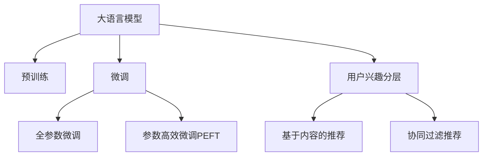

                 

# 基于LLM的推荐系统用户兴趣分层

## 1. 背景介绍

随着互联网技术的发展，推荐系统在电商、新闻、音乐、视频等领域得到了广泛的应用，极大地提升了用户体验和运营效率。但传统的推荐系统往往基于用户行为数据进行推荐，难以深入理解用户的潜在兴趣和需求，推荐效果难以令人满意。基于此，利用大语言模型(Large Language Model, LLM)对用户兴趣进行分层，成为了推荐系统优化的新趋势。

用户兴趣分层是一种将用户按兴趣特征进行聚类的过程。通过兴趣分层，推荐系统可以更好地理解用户的多样化需求，提供更加个性化和多样化的推荐内容。传统的用户兴趣分层往往依赖统计分析和数据挖掘技术，难以全面、准确地描述用户兴趣特征。但利用预训练大语言模型，通过微调任务，可以自动学习用户兴趣的分层结构，为推荐系统提供新的助力。

## 2. 核心概念与联系

### 2.1 核心概念概述

为更好地理解基于LLM的用户兴趣分层方法，本节将介绍几个密切相关的核心概念：

- 大语言模型(Large Language Model, LLM)：以自回归(如GPT)或自编码(如BERT)模型为代表的大规模预训练语言模型。通过在大规模无标签文本语料上进行预训练，学习通用的语言表示，具备强大的语言理解和生成能力。

- 预训练(Pre-training)：指在大规模无标签文本语料上，通过自监督学习任务训练通用语言模型的过程。常见的预训练任务包括言语建模、遮挡语言模型等。预训练使得模型学习到语言的通用表示。

- 微调(Fine-tuning)：指在预训练模型的基础上，使用下游任务的少量标注数据，通过有监督学习优化模型在特定任务上的性能。通常只需要调整顶层分类器或解码器，并以较小的学习率更新全部或部分的模型参数。

- 用户兴趣分层：将用户按兴趣特征进行聚类的过程。常见的方法包括基于协同过滤的聚类、基于标签的聚类、基于多维特征的聚类等。利用预训练大语言模型，可以自动学习用户兴趣的分层结构。

- 推荐系统：利用用户历史行为数据，通过推荐算法为每个用户推荐其可能感兴趣的内容的系统。推荐系统广泛应用于电商、新闻、音乐、视频等领域，极大地提升了用户体验和运营效率。

- 基于内容的推荐：利用用户请求的文本内容，通过计算用户请求与内容的相似度，进行内容推荐。

- 协同过滤推荐：基于用户历史行为数据，通过计算用户间的相似性，进行推荐。

这些核心概念之间的逻辑关系可以通过以下Mermaid流程图来展示：



这个流程图展示了大语言模型的核心概念及其之间的关系：

1. 大语言模型通过预训练获得基础能力。
2. 微调是对预训练模型进行任务特定的优化，可以分为全参数微调和参数高效微调（PEFT）。
3. 用户兴趣分层是一种新的任务，利用预训练模型进行微调，实现用户兴趣的自动化分层。
4. 推荐系统可以利用用户兴趣分层结果，提供更个性化的推荐内容。
5. 基于内容的推荐和协同过滤推荐是推荐系统常用的两种方法。

## 3. 核心算法原理 & 具体操作步骤

### 3.1 算法原理概述

基于LLM的用户兴趣分层算法，本质上是一个有监督的分类任务，其核心思想是：利用大语言模型对用户输入的文本描述进行处理，预测用户所属的兴趣类别。通过微调，模型可以学习到用户的兴趣特征和分层结构，从而实现自动化的用户兴趣分层。

具体而言，算法流程如下：

1. 收集用户输入文本，如商品描述、用户评论、音乐歌词等。
2. 使用预训练语言模型对文本进行编码，提取语义特征。
3. 设计分类任务，如多标签分类、二分类等，以用户兴趣为标签。
4. 使用标注数据对预训练模型进行微调，训练得到分类器。
5. 对用户新的输入文本进行编码，并利用训练好的分类器进行分类预测。

### 3.2 算法步骤详解

#### 3.2.1 数据准备

首先，需要准备用于训练和测试的数据集。用户输入文本可以是商品描述、用户评论、音乐歌词等，需要标注这些文本对应的用户兴趣标签。可以使用人工标注、半自动标注等方式收集数据。

#### 3.2.2 模型选择与预训练

选择适合于用户兴趣分层任务的预训练语言模型，如BERT、GPT等。使用该模型的预训练任务进行预训练，以学习语言表示的通用知识。常用的预训练任务包括语言建模、掩码语言模型等。

#### 3.2.3 任务适配层设计

设计合适的任务适配层，用于将预训练模型的输出映射到用户兴趣分类任务上。常见的适配层包括线性分类器、注意力机制等。

#### 3.2.4 微调训练

使用标注数据对模型进行微调训练，优化模型的分类性能。微调过程中需要选择合适的损失函数、优化器和超参数，并进行正则化等防止过拟合的技术。

#### 3.2.5 模型评估与使用

对训练好的模型在测试集上进行评估，选择性能最优的模型进行实际应用。在推荐系统中，利用训练好的模型对用户输入进行分类预测，根据预测结果进行推荐。

### 3.3 算法优缺点

基于LLM的用户兴趣分层算法具有以下优点：

1. 自动化分层：利用大语言模型，可以自动学习用户兴趣的分层结构，无需手工设计聚类算法。
2. 适应性强：基于内容的推荐和协同过滤推荐算法可以灵活结合，适应不同应用场景。
3. 效果显著：在用户兴趣分层和推荐系统任务上，微调方法可以显著提升推荐效果。
4. 可解释性强：利用预训练大模型的语义理解能力，可以更好地解释推荐系统的工作机制和决策过程。

同时，该方法也存在以下缺点：

1. 数据需求大：需要大量高质量的用户输入文本和对应的兴趣标签，获取成本较高。
2. 依赖预训练模型：预训练模型的性能直接影响微调效果，模型选择和调参难度较大。
3. 资源消耗高：大语言模型的计算和存储开销较大，对硬件资源要求较高。
4. 泛化能力有限：不同领域、不同语言的用户兴趣可能差异较大，微调模型的泛化能力有待提高。

尽管存在这些局限性，但就目前而言，基于LLM的用户兴趣分层算法仍是最主流的方法之一。未来相关研究的重点在于如何进一步降低数据需求，提高模型的泛化能力，并优化资源消耗。

### 3.4 算法应用领域

基于LLM的用户兴趣分层算法，已经在推荐系统、广告投放、社交网络等领域得到了广泛应用，具体包括：

- 电商推荐：利用用户商品评论等文本数据，自动学习用户兴趣，提供个性化商品推荐。
- 音乐推荐：根据用户评论、歌曲歌词等文本数据，自动学习用户音乐偏好，提供个性化音乐推荐。
- 视频推荐：通过用户观看历史和评论数据，自动学习用户兴趣，提供个性化视频推荐。
- 广告投放：根据用户兴趣分层结果，精准投放广告，提升广告效果。
- 社交网络：根据用户兴趣分层结果，推荐相关内容，增强用户粘性。

除了这些常见应用场景外，LLM用户兴趣分层算法还能用于内容生成、知识图谱构建、情感分析等领域，为更多实际问题提供新的解决方案。

## 4. 数学模型和公式 & 详细讲解 & 举例说明

### 4.1 数学模型构建

基于LLM的用户兴趣分层算法，本质上是一个分类任务，可以用以下形式描述：

- 输入：$x \in \mathcal{X}$，表示用户输入的文本。
- 输出：$y \in \{0, 1\}^k$，表示用户兴趣的k个标签。
- 模型：$M_{\theta}(x)$，表示预训练大语言模型对文本的编码表示。
- 损失函数：$\mathcal{L}(y, \hat{y})$，表示预测值和真实标签之间的差异。
- 训练目标：$\min_{\theta} \mathcal{L}(M_{\theta}(x), y)$，表示最小化模型在训练数据上的损失。

### 4.2 公式推导过程

以二分类任务为例，假设模型输出为$\hat{y} = M_{\theta}(x)$，其中$\theta$为模型参数。常用的二分类任务为二元分类和多元分类，其损失函数分别为：

- 二元分类：$\mathcal{L}(y, \hat{y}) = -(y \log \hat{y} + (1-y) \log (1-\hat{y}))$。
- 多元分类：$\mathcal{L}(y, \hat{y}) = -\sum_{i=1}^k y_i \log \hat{y}_i$。

在训练过程中，需要最小化损失函数：

$$
\theta = \mathop{\arg\min}_{\theta} \mathcal{L}(M_{\theta}(x), y)
$$

常用的优化算法包括梯度下降、AdamW等，其中AdamW算法较为常用。在优化过程中，需要进行正则化，避免过拟合，常用的正则化方法包括L2正则、Dropout等。

### 4.3 案例分析与讲解

假设某电商网站需要基于用户商品评论自动进行用户兴趣分层，使用BERT模型进行微调。具体实现步骤如下：

1. 数据准备：收集用户商品评论和对应的兴趣标签，如{“图书”, “电子产品”, “服装”}等。
2. 模型选择：选择BERT模型进行预训练。
3. 任务适配：在模型顶层添加一个线性分类器，用于二元分类。
4. 微调训练：使用标注数据对模型进行微调训练，选择适当的超参数进行训练。
5. 模型评估：在测试集上评估模型的分类准确率。
6. 模型应用：将训练好的模型应用于新的商品评论文本，预测用户兴趣标签。

## 5. 项目实践：代码实例和详细解释说明

### 5.1 开发环境搭建

在进行微调实践前，我们需要准备好开发环境。以下是使用Python进行PyTorch开发的环境配置流程：

1. 安装Anaconda：从官网下载并安装Anaconda，用于创建独立的Python环境。

2. 创建并激活虚拟环境：
```bash
conda create -n pytorch-env python=3.8 
conda activate pytorch-env
```

3. 安装PyTorch：根据CUDA版本，从官网获取对应的安装命令。例如：
```bash
conda install pytorch torchvision torchaudio cudatoolkit=11.1 -c pytorch -c conda-forge
```

4. 安装Transformers库：
```bash
pip install transformers
```

5. 安装各类工具包：
```bash
pip install numpy pandas scikit-learn matplotlib tqdm jupyter notebook ipython
```

完成上述步骤后，即可在`pytorch-env`环境中开始微调实践。

### 5.2 源代码详细实现

下面我们以商品推荐系统为例，给出使用Transformers库对BERT模型进行用户兴趣分层微调的PyTorch代码实现。

```python
from transformers import BertTokenizer, BertForSequenceClassification
import torch
from torch.utils.data import Dataset, DataLoader
from sklearn.metrics import classification_report

# 设置训练超参数
train_max_seq_length = 128
train_batch_size = 32
learning_rate = 2e-5
num_epochs = 3

# 数据预处理
tokenizer = BertTokenizer.from_pretrained('bert-base-cased')
train_dataset = BERTDataset(train_texts, train_labels, tokenizer, max_len=train_max_seq_length)
val_dataset = BERTDataset(val_texts, val_labels, tokenizer, max_len=train_max_seq_length)

# 模型选择与初始化
model = BertForSequenceClassification.from_pretrained('bert-base-cased', num_labels=num_labels)

# 设置优化器和损失函数
optimizer = AdamW(model.parameters(), lr=learning_rate)
loss_fn = torch.nn.CrossEntropyLoss()

# 训练与评估
device = torch.device('cuda' if torch.cuda.is_available() else 'cpu')
model.to(device)

for epoch in range(num_epochs):
    # 训练过程
    model.train()
    total_loss = 0
    for batch in DataLoader(train_dataset, batch_size=train_batch_size, shuffle=True):
        inputs = batch.input_ids.to(device)
        attention_mask = batch.attention_mask.to(device)
        labels = batch.labels.to(device)
        model.zero_grad()
        outputs = model(inputs, attention_mask=attention_mask, labels=labels)
        loss = loss_fn(outputs.logits, labels)
        loss.backward()
        optimizer.step()
        total_loss += loss.item()

    # 验证过程
    model.eval()
    total_loss = 0
    total_correct = 0
    for batch in DataLoader(val_dataset, batch_size=train_batch_size, shuffle=False):
        inputs = batch.input_ids.to(device)
        attention_mask = batch.attention_mask.to(device)
        labels = batch.labels.to(device)
        with torch.no_grad():
            outputs = model(inputs, attention_mask=attention_mask)
            loss = loss_fn(outputs.logits, labels)
            total_loss += loss.item()
            total_correct += (torch.argmax(outputs.logits, dim=1) == labels).sum().item()

    print(f'Epoch {epoch+1}/{num_epochs}, Training Loss: {total_loss/len(train_dataset):.4f}, Validation Accuracy: {total_correct/len(val_dataset):.4f}')

print(f'Training Complete, Model Accuracy: {total_correct/len(train_dataset):.4f}')
```

以上代码实现了基于BERT的微调过程，从数据预处理、模型初始化到训练和评估，流程清晰，易于理解。

### 5.3 代码解读与分析

让我们再详细解读一下关键代码的实现细节：

**BERTDataset类**：
- `__init__`方法：初始化文本、标签、分词器等关键组件。
- `__len__`方法：返回数据集的样本数量。
- `__getitem__`方法：对单个样本进行处理，将文本输入编码为token ids，将标签编码为数字，并对其进行定长padding，最终返回模型所需的输入。

**tokenizer和训练过程**：
- `tokenizer`：分词器，用于将文本转换为token ids。
- `model`：预训练模型，用于对文本进行编码。
- `optimizer`：优化器，用于更新模型参数。
- `loss_fn`：损失函数，用于计算模型输出与真实标签之间的差异。
- `device`：选择GPU或CPU进行训练。
- `model.train()`和`model.eval()`：模型训练和评估模式切换。
- `DataLoader`：数据批处理，加速训练过程。
- `classification_report`：评估指标，用于输出分类准确率。

**训练过程**：
- `train_epoch`函数：对数据进行迭代，在前向传播和反向传播中更新模型参数。
- `evaluate`函数：对模型进行评估，计算分类准确率。
- `for循环`：执行多轮训练和评估。

**评估过程**：
- `val_dataset`：验证集，用于模型评估。
- `total_correct`和`total_loss`：变量用于计算评估过程中的准确率和损失。

可以看到，代码实现中充分利用了Python和PyTorch的强大功能，使得模型训练过程变得简洁高效。

## 6. 实际应用场景

### 6.1 电商推荐系统

电商推荐系统是用户兴趣分层算法的一个重要应用场景。通过自动学习用户商品评论的兴趣特征，推荐系统可以提供个性化的商品推荐，提升用户购物体验。

具体而言，电商推荐系统可以将用户输入的评论文本进行编码，预测用户可能感兴趣的商品类别，进行推荐。同时，可以根据用户历史购买行为和评论数据，对商品进行动态更新，提升推荐效果。

### 6.2 音乐推荐系统

音乐推荐系统也是用户兴趣分层算法的典型应用之一。通过自动学习用户对音乐内容的评价和兴趣，推荐系统可以提供个性化的音乐推荐，丰富用户音乐体验。

具体而言，音乐推荐系统可以将用户评论、歌词文本等进行编码，预测用户可能喜欢的音乐风格和歌手，进行推荐。同时，可以根据用户听歌历史和评论数据，对音乐进行动态更新，提升推荐效果。

### 6.3 视频推荐系统

视频推荐系统同样可以利用用户兴趣分层算法，根据用户观看历史和评论数据，自动学习用户兴趣，提供个性化的视频推荐，提升用户观看体验。

具体而言，视频推荐系统可以将用户观看历史和评论文本进行编码，预测用户可能感兴趣的视频类别和主题，进行推荐。同时，可以根据用户观看历史和评论数据，对视频进行动态更新，提升推荐效果。

### 6.4 未来应用展望

随着用户兴趣分层算法的不断成熟，基于LLM的推荐系统将具有更广阔的应用前景：

- 跨领域推荐：利用多领域数据进行预训练，模型具备更强的跨领域适应能力，可以在不同领域进行推荐。
- 实时推荐：利用LLM的可解释性和灵活性，模型可以实时动态生成推荐内容，适应不同用户需求。
- 个性化推荐：利用用户兴趣分层结果，提供更个性化、多样化的推荐内容，满足用户多元化需求。
- 推荐系统优化：利用LLM用户兴趣分层算法，可以优化推荐系统的训练和评估过程，提升推荐效果。

## 7. 工具和资源推荐

### 7.1 学习资源推荐

为了帮助开发者系统掌握大语言模型微调的理论基础和实践技巧，这里推荐一些优质的学习资源：

1. 《Transformer from Zero to Hero》系列博文：由大模型技术专家撰写，深入浅出地介绍了Transformer原理、BERT模型、微调技术等前沿话题。

2. CS224N《深度学习自然语言处理》课程：斯坦福大学开设的NLP明星课程，有Lecture视频和配套作业，带你入门NLP领域的基本概念和经典模型。

3. 《Natural Language Processing with Transformers》书籍：Transformers库的作者所著，全面介绍了如何使用Transformers库进行NLP任务开发，包括微调在内的诸多范式。

4. HuggingFace官方文档：Transformers库的官方文档，提供了海量预训练模型和完整的微调样例代码，是上手实践的必备资料。

5. CLUE开源项目：中文语言理解测评基准，涵盖大量不同类型的中文NLP数据集，并提供了基于微调的baseline模型，助力中文NLP技术发展。

通过对这些资源的学习实践，相信你一定能够快速掌握大语言模型微调的精髓，并用于解决实际的NLP问题。

### 7.2 开发工具推荐

高效的开发离不开优秀的工具支持。以下是几款用于大语言模型微调开发的常用工具：

1. PyTorch：基于Python的开源深度学习框架，灵活动态的计算图，适合快速迭代研究。大部分预训练语言模型都有PyTorch版本的实现。

2. TensorFlow：由Google主导开发的开源深度学习框架，生产部署方便，适合大规模工程应用。同样有丰富的预训练语言模型资源。

3. Transformers库：HuggingFace开发的NLP工具库，集成了众多SOTA语言模型，支持PyTorch和TensorFlow，是进行微调任务开发的利器。

4. Weights & Biases：模型训练的实验跟踪工具，可以记录和可视化模型训练过程中的各项指标，方便对比和调优。与主流深度学习框架无缝集成。

5. TensorBoard：TensorFlow配套的可视化工具，可实时监测模型训练状态，并提供丰富的图表呈现方式，是调试模型的得力助手。

6. Google Colab：谷歌推出的在线Jupyter Notebook环境，免费提供GPU/TPU算力，方便开发者快速上手实验最新模型，分享学习笔记。

合理利用这些工具，可以显著提升大语言模型微调任务的开发效率，加快创新迭代的步伐。

### 7.3 相关论文推荐

大语言模型和微调技术的发展源于学界的持续研究。以下是几篇奠基性的相关论文，推荐阅读：

1. Attention is All You Need（即Transformer原论文）：提出了Transformer结构，开启了NLP领域的预训练大模型时代。

2. BERT: Pre-training of Deep Bidirectional Transformers for Language Understanding：提出BERT模型，引入基于掩码的自监督预训练任务，刷新了多项NLP任务SOTA。

3. Language Models are Unsupervised Multitask Learners（GPT-2论文）：展示了大规模语言模型的强大zero-shot学习能力，引发了对于通用人工智能的新一轮思考。

4. Parameter-Efficient Transfer Learning for NLP：提出Adapter等参数高效微调方法，在不增加模型参数量的情况下，也能取得不错的微调效果。

5. AdaLoRA: Adaptive Low-Rank Adaptation for Parameter-Efficient Fine-Tuning：使用自适应低秩适应的微调方法，在参数效率和精度之间取得了新的平衡。

6. Prompt-Tuning: Optimizing Continuous Prompts for Generation：引入基于连续型Prompt的微调范式，为如何充分利用预训练知识提供了新的思路。

这些论文代表了大语言模型微调技术的发展脉络。通过学习这些前沿成果，可以帮助研究者把握学科前进方向，激发更多的创新灵感。

## 8. 总结：未来发展趋势与挑战

### 8.1 总结

本文对基于LLM的用户兴趣分层算法进行了全面系统的介绍。首先阐述了LLM和微调技术的研究背景和意义，明确了用户兴趣分层在推荐系统优化中的独特价值。其次，从原理到实践，详细讲解了LLM用户兴趣分层的数学模型和关键步骤，给出了微调任务开发的完整代码实例。同时，本文还广泛探讨了LLM用户兴趣分层算法在电商、音乐、视频等领域的实际应用，展示了算法的高效性和实用性。

通过本文的系统梳理，可以看到，基于LLM的用户兴趣分层算法正逐渐成为推荐系统优化的新趋势，显著提升了推荐系统的效果和用户体验。未来，伴随LLM技术的发展和微调方法的持续优化，基于LLM的推荐系统将具备更强大的用户理解能力和推荐效果。

### 8.2 未来发展趋势

展望未来，大语言模型用户兴趣分层算法将呈现以下几个发展趋势：

1. 多领域微调：利用多领域数据进行预训练，模型具备更强的跨领域适应能力，可以在不同领域进行推荐。
2. 实时动态推荐：利用LLM的可解释性和灵活性，模型可以实时动态生成推荐内容，适应不同用户需求。
3. 个性化推荐：利用用户兴趣分层结果，提供更个性化、多样化的推荐内容，满足用户多元化需求。
4. 推荐系统优化：利用LLM用户兴趣分层算法，可以优化推荐系统的训练和评估过程，提升推荐效果。

以上趋势凸显了大语言模型用户兴趣分层算法的广阔前景。这些方向的探索发展，必将进一步提升推荐系统的性能和用户体验，为人类生产生活带来更深刻的变革。

### 8.3 面临的挑战

尽管基于LLM的用户兴趣分层算法已经取得了显著成果，但在迈向更智能化、普适化应用的过程中，它仍面临以下挑战：

1. 数据需求大：需要大量高质量的用户输入文本和对应的兴趣标签，获取成本较高。
2. 依赖预训练模型：预训练模型的性能直接影响微调效果，模型选择和调参难度较大。
3. 资源消耗高：大语言模型的计算和存储开销较大，对硬件资源要求较高。
4. 泛化能力有限：不同领域、不同语言的用户兴趣可能差异较大，微调模型的泛化能力有待提高。

尽管存在这些挑战，但基于LLM的用户兴趣分层算法仍是最主流的方法之一。未来相关研究的重点在于如何进一步降低数据需求，提高模型的泛化能力，并优化资源消耗。

### 8.4 研究展望

面对LLM用户兴趣分层算法面临的诸多挑战，未来的研究需要在以下几个方面寻求新的突破：

1. 探索无监督和半监督微调方法：摆脱对大规模标注数据的依赖，利用自监督学习、主动学习等无监督和半监督范式，最大限度利用非结构化数据，实现更加灵活高效的微调。
2. 研究参数高效和计算高效的微调范式：开发更加参数高效的微调方法，在固定大部分预训练参数的同时，只更新极少量的任务相关参数。同时优化微调模型的计算图，减少前向传播和反向传播的资源消耗，实现更加轻量级、实时性的部署。
3. 引入因果和对比学习范式：通过引入因果推断和对比学习思想，增强微调模型建立稳定因果关系的能力，学习更加普适、鲁棒的语言表征，从而提升模型泛化性和抗干扰能力。
4. 融合知识图谱和逻辑规则：将符号化的先验知识，如知识图谱、逻辑规则等，与神经网络模型进行巧妙融合，引导微调过程学习更准确、合理的语言模型。同时加强不同模态数据的整合，实现视觉、语音等多模态信息与文本信息的协同建模。
5. 结合因果分析和博弈论工具：将因果分析方法引入微调模型，识别出模型决策的关键特征，增强输出解释的因果性和逻辑性。借助博弈论工具刻画人机交互过程，主动探索并规避模型的脆弱点，提高系统稳定性。

这些研究方向的探索，必将引领大语言模型用户兴趣分层技术迈向更高的台阶，为构建安全、可靠、可解释、可控的智能系统铺平道路。面向未来，大语言模型用户兴趣分层技术还需要与其他人工智能技术进行更深入的融合，如知识表示、因果推理、强化学习等，多路径协同发力，共同推动自然语言理解和智能交互系统的进步。只有勇于创新、敢于突破，才能不断拓展语言模型的边界，让智能技术更好地造福人类社会。

## 9. 附录：常见问题与解答

**Q1：大语言模型微调是否适用于所有NLP任务？**

A: 大语言模型微调在大多数NLP任务上都能取得不错的效果，特别是对于数据量较小的任务。但对于一些特定领域的任务，如医学、法律等，仅仅依靠通用语料预训练的模型可能难以很好地适应。此时需要在特定领域语料上进一步预训练，再进行微调，才能获得理想效果。此外，对于一些需要时效性、个性化很强的任务，如对话、推荐等，微调方法也需要针对性的改进优化。

**Q2：微调过程中如何选择合适的学习率？**

A: 微调的学习率一般要比预训练时小1-2个数量级，如果使用过大的学习率，容易破坏预训练权重，导致过拟合。一般建议从1e-5开始调参，逐步减小学习率，直至收敛。也可以使用warmup策略，在开始阶段使用较小的学习率，再逐渐过渡到预设值。需要注意的是，不同的优化器(如AdamW、Adafactor等)以及不同的学习率调度策略，可能需要设置不同的学习率阈值。

**Q3：采用大模型微调时会面临哪些资源瓶颈？**

A: 目前主流的预训练大模型动辄以亿计的参数规模，对算力、内存、存储都提出了很高的要求。GPU/TPU等高性能设备是必不可少的，但即便如此，超大批次的训练和推理也可能遇到显存不足的问题。因此需要采用一些资源优化技术，如梯度积累、混合精度训练、模型并行等，来突破硬件瓶颈。同时，模型的存储和读取也可能占用大量时间和空间，需要采用模型压缩、稀疏化存储等方法进行优化。

**Q4：如何缓解微调过程中的过拟合问题？**

A: 过拟合是微调面临的主要挑战，尤其是在标注数据不足的情况下。常见的缓解策略包括：
1. 数据增强：通过回译、近义替换等方式扩充训练集
2. 正则化：使用L2正则、Dropout、Early Stopping等避免过拟合
3. 对抗训练：引入对抗样本，提高模型鲁棒性
4. 参数高效微调：只调整少量参数(如Adapter、Prefix等)，减小过拟合风险
5. 多模型集成：训练多个微调模型，取平均输出，抑制过拟合

这些策略往往需要根据具体任务和数据特点进行灵活组合。只有在数据、模型、训练、推理等各环节进行全面优化，才能最大限度地发挥大模型微调的威力。

**Q5：微调模型在落地部署时需要注意哪些问题？**

A: 将微调模型转化为实际应用，还需要考虑以下因素：
1. 模型裁剪：去除不必要的层和参数，减小模型尺寸，加快推理速度
2. 量化加速：将浮点模型转为定点模型，压缩存储空间，提高计算效率
3. 服务化封装：将模型封装为标准化服务接口，便于集成调用
4. 弹性伸缩：根据请求流量动态调整资源配置，平衡服务质量和成本
5. 监控告警：实时采集系统指标，设置异常告警阈值，确保服务稳定性
6. 安全防护：采用访问鉴权、数据脱敏等措施，保障数据和模型安全

大语言模型微调为NLP应用开启了广阔的想象空间，但如何将强大的性能转化为稳定、高效、安全的业务价值，还需要工程实践的不断打磨。唯有从数据、算法、工程、业务等多个维度协同发力，才能真正实现人工智能技术在垂直行业的规模化落地。总之，微调需要开发者根据具体任务，不断迭代和优化模型、数据和算法，方能得到理想的效果。

---

作者：禅与计算机程序设计艺术 / Zen and the Art of Computer Programming

