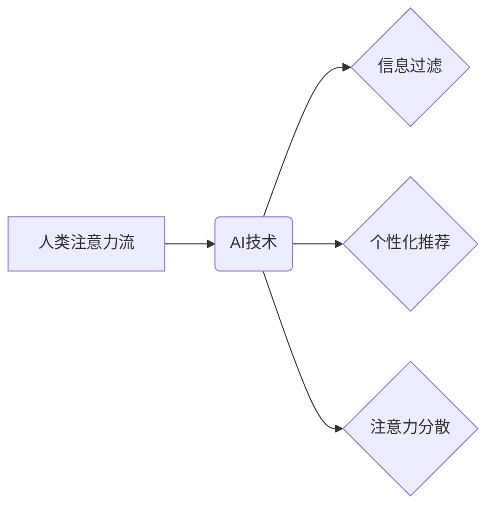

> 人工智能，注意力流，深度学习，认知科学，工作技能，注意力管理，未来趋势

## 1. 背景介绍

在信息爆炸的时代，人类的注意力资源日益稀缺。我们每天被来自各种渠道的信息轰炸，从社交媒体的通知到电子邮件的提醒，从新闻网站的滚动条到同事的即时消息，无处不在的干扰让我们难以集中精力完成任务。与此同时，人工智能（AI）技术飞速发展，正在深刻地改变着我们的生活和工作方式。AI系统能够自动处理大量数据，识别模式，并提供个性化的服务，这为我们解放了宝贵的认知资源，但也带来了新的挑战：如何有效地与AI协同工作，并管理好我们有限的注意力？

## 2. 核心概念与联系

**2.1 人类注意力流**

人类注意力流是一个复杂的心理过程，它涉及到感知、认知、情感和行为等多个方面。注意力流是指当一个人完全沉浸在某一活动中时，时间流逝感消失，专注力高度集中，并体验到一种愉悦和满足感。

**2.2 人工智能与注意力流**

AI技术正在深刻地影响着人类注意力流。一方面，AI可以帮助我们过滤信息噪音，识别重要的信息，并提供个性化的内容推荐，从而提高我们的注意力效率。另一方面，AI也可能加剧我们的注意力分散，因为AI系统会不断地提醒我们新的信息和任务，让我们难以集中精力完成当前的任务。

**2.3 核心概念关系图**



## 3. 核心算法原理 & 具体操作步骤

**3.1 算法原理概述**

注意力机制是深度学习领域的一种重要技术，它能够模拟人类的注意力机制，学习到输入数据中最重要的部分。注意力机制的核心思想是通过一个“注意力权重”来分配不同输入元素的关注度，从而提高模型的学习效率和准确性。

**3.2 算法步骤详解**

1. **计算注意力权重:** 对于每个输入元素，计算其与输出的关联度，得到一个注意力权重。
2. **加权求和:** 将注意力权重与输入元素相乘，然后求和，得到一个加权后的输出。
3. **输出结果:** 将加权后的输出作为模型的最终输出。

**3.3 算法优缺点**

**优点:**

* 可以提高模型的学习效率和准确性。
* 可以学习到输入数据中最重要的部分。
* 可以解释模型的决策过程。

**缺点:**

* 计算复杂度较高。
* 需要大量的训练数据。

**3.4 算法应用领域**

注意力机制在自然语言处理、计算机视觉、语音识别等领域都有广泛的应用。例如，在机器翻译中，注意力机制可以帮助模型更好地理解句子结构和语义关系，从而提高翻译质量。

## 4. 数学模型和公式 & 详细讲解 & 举例说明

**4.1 数学模型构建**

假设我们有一个输入序列 X = {x1, x2, ..., xn}，以及一个输出序列 Y = {y1, y2, ..., ym}。我们想要学习一个模型，能够将输入序列 X 映射到输出序列 Y。

**4.2 公式推导过程**

注意力机制的核心是计算每个输入元素 x_i 与输出元素 y_j 的关联度，即注意力权重 α_ij。

$$
\alpha_{ij} = \frac{exp(e_{ij})}{\sum_{k=1}^{n} exp(e_{ik})}
$$

其中，e_ij 是输入元素 x_i 与输出元素 y_j 之间的关联度，可以由一个神经网络计算得到。

**4.3 案例分析与讲解**

例如，在机器翻译中，输入序列 X 是源语言句子，输出序列 Y 是目标语言句子。注意力权重 α_ij 可以表示翻译模型对源语言句子中每个词语对目标语言句子中每个词语的关注程度。

## 5. 项目实践：代码实例和详细解释说明

**5.1 开发环境搭建**

* Python 3.6+
* TensorFlow 2.0+
* PyTorch 1.0+

**5.2 源代码详细实现**

```python
import tensorflow as tf

# 定义注意力机制层
class AttentionLayer(tf.keras.layers.Layer):
    def __init__(self, units):
        super(AttentionLayer, self).__init__()
        self.W1 = tf.keras.layers.Dense(units)
        self.W2 = tf.keras.layers.Dense(units)
        self.v = tf.keras.layers.Dense(1)

    def call(self, inputs):
        # inputs: (batch_size, seq_len, units)
        query = self.W1(inputs)
        key = self.W2(inputs)
        value = inputs
        # 计算注意力权重
        scores = tf.matmul(query, key, transpose_b=True)
        scores = scores / tf.math.sqrt(tf.cast(units, tf.float32))
        attention_weights = tf.nn.softmax(scores, axis=-1)
        # 加权求和
        context_vector = tf.matmul(attention_weights, value)
        return context_vector

# 实例化注意力机制层
attention_layer = AttentionLayer(units=128)

# 输入数据
inputs = tf.random.normal(shape=(32, 10, 128))

# 通过注意力机制层
outputs = attention_layer(inputs)
```

**5.3 代码解读与分析**

* `AttentionLayer` 类定义了一个注意力机制层，包含三个Dense层：`W1`、`W2` 和 `v`。
* `call` 方法计算注意力权重和加权求和，最终得到上下文向量。
* `tf.matmul` 函数用于计算矩阵乘法。
* `tf.math.sqrt` 函数用于计算平方根。
* `tf.nn.softmax` 函数用于计算softmax函数。

**5.4 运行结果展示**

运行上述代码，会输出一个形状为 (32, 10, 128) 的上下文向量。

## 6. 实际应用场景

**6.1 个性化学习推荐**

AI可以根据用户的学习习惯和兴趣，推荐个性化的学习内容，帮助用户提高学习效率。

**6.2 智能客服系统**

AI可以理解用户的自然语言输入，并提供个性化的服务，例如回答问题、提供建议等。

**6.3 内容创作辅助工具**

AI可以帮助用户生成创意内容，例如文章、诗歌、音乐等。

**6.4 未来应用展望**

随着AI技术的不断发展，其在注意力管理领域的应用将更加广泛和深入。例如，AI可以帮助我们识别和消除注意力干扰，并提供个性化的注意力训练方案。

## 7. 工具和资源推荐

**7.1 学习资源推荐**

* **书籍:**
    * 《深度学习》
    * 《Attention Is All You Need》
* **在线课程:**
    * Coursera: 深度学习
    * Udacity: 自然语言处理

**7.2 开发工具推荐**

* TensorFlow
* PyTorch
* Keras

**7.3 相关论文推荐**

* Attention Is All You Need
* Transformer

## 8. 总结：未来发展趋势与挑战

**8.1 研究成果总结**

近年来，AI与注意力流的研究取得了显著进展，例如注意力机制的提出和应用，以及注意力管理工具的开发。

**8.2 未来发展趋势**

未来，AI与注意力流的研究将更加注重以下几个方面:

* **更有效的注意力机制:** 开发更强大的注意力机制，能够更好地模拟人类的注意力机制。
* **个性化注意力管理:** 开发个性化的注意力管理工具，根据用户的不同需求和习惯提供定制化的服务。
* **跨模态注意力:** 研究跨模态注意力的机制，例如文本与图像、音频与视频之间的注意力交互。

**8.3 面临的挑战**

* **数据隐私和安全:** AI系统需要大量的数据进行训练，如何保护用户的数据隐私和安全是一个重要的挑战。
* **算法可解释性:** AI系统的决策过程往往是复杂的，如何提高算法的可解释性是一个重要的研究方向。
* **伦理问题:** AI技术的应用可能会带来一些伦理问题，例如算法偏见、工作岗位替代等，需要引起社会的关注和讨论。

**8.4 研究展望**

未来，AI与注意力流的研究将继续深入，为人类提供更智能、更便捷的生活和工作体验。


## 9. 附录：常见问题与解答

**9.1 如何提高注意力集中度？**

* 设定明确的目标
* 创造安静的工作环境
* 避免多任务处理
* 定期休息
* 进行运动和冥想

**9.2 如何使用AI工具管理注意力？**

* 使用专注模式的应用程序
* 使用番茄工作法计时器
* 使用AI驱动的笔记软件记录想法
* 使用AI驱动的学习平台进行个性化学习

**9.3 AI是否会取代人类的工作？**

AI技术的发展可能会改变一些工作岗位，但同时也创造新的工作机会。重要的是，人类需要不断学习和提升自己的技能，才能适应未来的工作环境。


作者：禅与计算机程序设计艺术 / Zen and the Art of Computer Programming 
<end_of_turn>