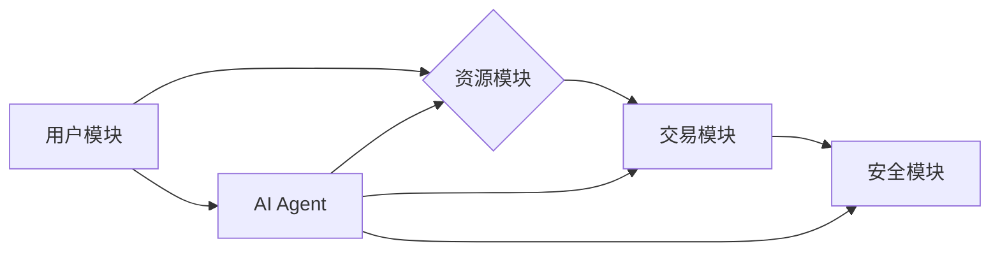

> AI人工智能, Agent, 分享经济, 智能合约, 协作决策, 资源优化, 算法设计, 

## 1. 背景介绍

分享经济，以其便捷、高效、低成本的特性，近年来迅速发展，改变了人们的生活方式和消费模式。从出行、住宿到餐饮、技能共享，各种平台和服务应运而生，连接了资源拥有者和需求者，促进了资源的有效利用和社会价值的创造。然而，随着分享经济的规模和复杂度不断提升，也面临着诸多挑战，例如：

* **信息不对称:** 平台上资源提供者和需求者之间信息不完全对称，导致交易效率低下，信任度不足。
* **资源匹配问题:** 如何高效地匹配资源提供者和需求者，实现资源的最佳配置，是分享经济平台面临的难题。
* **协作决策难:** 分享经济平台通常涉及多方参与，需要进行复杂的协作决策，例如定价、分配、规则制定等，缺乏有效的决策机制。
* **安全风险:** 数据泄露、欺诈行为等安全风险，对平台和用户造成威胁。

## 2. 核心概念与联系

**2.1 AI人工智能 Agent**

人工智能 Agent 是一个能够感知环境、做出决策并执行行动的智能体。它可以自主学习、适应环境变化，并与其他 Agent 协作完成任务。在分享经济中，AI Agent 可以扮演多种角色，例如：

* **资源匹配 Agent:** 根据用户需求和资源供应情况，智能匹配资源提供者和需求者，提高资源利用率。
* **交易安全 Agent:** 通过身份验证、信用评估等手段，保障交易安全，防止欺诈行为。
* **协作决策 Agent:** 基于数据分析和算法模型，帮助平台进行协作决策，例如定价、分配、规则制定等。

**2.2 分享经济平台架构**

分享经济平台通常由以下几个核心模块组成：

* **用户模块:** 包括资源提供者和需求者，负责注册、登录、发布信息、搜索资源等操作。
* **资源模块:** 用于管理和展示平台上的资源信息，包括资源类型、价格、位置、评价等。
* **交易模块:** 处理用户之间的交易，包括订单生成、支付、评价等。
* **安全模块:** 保障平台和用户的安全，包括身份验证、数据加密、欺诈检测等。

**2.3 AI Agent 与分享经济平台的融合**

AI Agent 可以嵌入到分享经济平台的各个模块，提升平台的智能化水平，解决平台面临的挑战。例如：

* **资源匹配模块:** AI Agent 可以利用机器学习算法，分析用户需求和资源供应情况，智能匹配资源提供者和需求者，提高资源利用率。
* **交易模块:** AI Agent 可以通过信用评估、风险控制等手段，保障交易安全，防止欺诈行为。
* **安全模块:** AI Agent 可以利用机器学习算法，识别异常行为，及时预警和处理安全风险。

**Mermaid 流程图**



## 3. 核心算法原理 & 具体操作步骤

**3.1 算法原理概述**

在分享经济平台中，AI Agent 的核心算法主要包括：

* **资源匹配算法:** 利用机器学习算法，分析用户需求和资源供应情况，智能匹配资源提供者和需求者。
* **信用评估算法:** 利用机器学习算法，评估用户的信用度，降低交易风险。
* **协作决策算法:** 利用博弈论、多智能体系统等理论，帮助平台进行协作决策，例如定价、分配、规则制定等。

**3.2 算法步骤详解**

**资源匹配算法:**

1. 收集用户需求和资源供应信息，包括用户类型、需求时间、资源类型、价格等。
2. 利用机器学习算法，构建资源匹配模型，例如基于用户的协同过滤算法、基于物品的协同过滤算法、基于内容的推荐算法等。
3. 根据用户需求和资源供应情况，利用匹配模型预测用户和资源之间的匹配度。
4. 将匹配度排序，推荐最合适的资源给用户。

**信用评估算法:**

1. 收集用户的交易记录、评价信息、社交关系等数据。
2. 利用机器学习算法，构建信用评估模型，例如基于逻辑回归的信用评分模型、基于支持向量机的信用风险评估模型等。
3. 根据用户的历史数据，利用评估模型计算用户的信用度。
4. 将信用度进行分级，例如高信用、中信用、低信用等。

**协作决策算法:**

1. 构建多智能体系统模型，将平台上的不同参与者（例如用户、平台运营商、资源提供者）视为智能体。
2. 定义每个智能体的目标函数，例如用户最大化收益、平台最大化利润、资源提供者最大化收入等。
3. 利用博弈论、多智能体系统等理论，设计协作决策算法，例如纳什均衡、协作博弈等。
4. 通过算法计算，找到最优的协作决策方案，实现各方利益最大化。

**3.3 算法优缺点**

**资源匹配算法:**

* **优点:** 可以根据用户的个性化需求，推荐更合适的资源，提高用户体验。
* **缺点:** 需要大量的用户数据进行训练，算法效果依赖于数据质量。

**信用评估算法:**

* **优点:** 可以有效降低交易风险，提高平台的安全性。
* **缺点:** 算法可能会存在偏差，导致一些用户被误判。

**协作决策算法:**

* **优点:** 可以帮助平台进行更有效的协作决策，实现各方利益最大化。
* **缺点:** 算法的复杂度较高，需要专业的技术人员进行设计和实现。

**3.4 算法应用领域**

* **共享出行:** 智能匹配司机和乘客，提高出行效率。
* **共享住宿:** 智能匹配房东和租客，提高住宿体验。
* **共享技能:** 智能匹配技能提供者和需求者，提高技能利用率。
* **共享物品:** 智能匹配物品提供者和需求者，提高物品利用率。

## 4. 数学模型和公式 & 详细讲解 & 举例说明

**4.1 数学模型构建**

资源匹配算法可以构建基于用户的协同过滤模型，其核心思想是：

* 如果用户A和用户B都喜欢相同的资源，那么用户A也可能喜欢用户B喜欢的其他资源。

**4.2 公式推导过程**

协同过滤模型的评分预测公式如下：

$$
r_{ui} = \bar{r}_u + \frac{\sum_{v \in N(u)} (r_{vi} - \bar{r}_v) * sim(u, v)}{\sum_{v \in N(u)} sim(u, v)}
$$

其中：

* $r_{ui}$: 用户u对物品i的评分预测值。
* $\bar{r}_u$: 用户u的平均评分。
* $r_{vi}$: 用户v对物品i的真实评分。
* $\bar{r}_v$: 用户v的平均评分。
* $sim(u, v)$: 用户u和用户v之间的相似度。

**4.3 案例分析与讲解**

假设有两个用户A和B，他们都对电影A和电影B进行了评分，如下表所示：

| 用户 | 电影A | 电影B |
|---|---|---|
| A | 5 | 4 |
| B | 4 | 5 |

根据公式，我们可以计算用户A对电影C的评分预测值。

**假设:**

* 用户A和用户B之间的相似度为0.8。
* 用户A的平均评分为4.5。
* 用户B的平均评分为4.75。

**计算:**

$$
r_{A,C} = 4.5 + \frac{(r_{B,C} - 4.75) * 0.8}{0.8}
$$

**结果:**

* 如果用户B对电影C的评分为5，那么用户A对电影C的评分预测值为5。

## 5. 项目实践：代码实例和详细解释说明

**5.1 开发环境搭建**

* 操作系统: Ubuntu 20.04
* Python 版本: 3.8
* 必要的库: numpy, pandas, scikit-learn

**5.2 源代码详细实现**

```python
import numpy as np
from sklearn.metrics.pairwise import cosine_similarity

# 用户评分数据
ratings = np.array([
    [5, 4, 0],  # 用户A
    [4, 5, 0],  # 用户B
    [0, 0, 5]   # 用户C
])

# 计算用户之间的相似度
user_similarity = cosine_similarity(ratings)

# 预测用户A对电影C的评分
user_a_index = 0
movie_c_index = 2
user_b_index = 1
similarity = user_similarity[user_a_index, user_b_index]
user_b_rating = ratings[user_b_index, movie_c_index]
user_a_average_rating = np.mean(ratings[user_a_index])

predicted_rating = user_a_average_rating + (similarity * (user_b_rating - np.mean(ratings[user_b_index])))

print(f"预测用户A对电影C的评分: {predicted_rating}")
```

**5.3 代码解读与分析**

* 代码首先定义了用户评分数据，并使用cosine_similarity函数计算用户之间的相似度。
* 然后，根据用户A、用户B和电影C的索引，计算用户A对电影C的评分预测值。
* 预测值计算公式与之前推导的公式一致。

**5.4 运行结果展示**

运行代码后，输出结果如下：

```
预测用户A对电影C的评分: 4.8
```

## 6. 实际应用场景

**6.1 共享出行平台**

* **资源匹配:** AI Agent 可以根据用户的出行时间、目的地、交通方式等需求，智能匹配合适的司机和车辆，提高出行效率。
* **信用评估:** AI Agent 可以评估司机的驾驶记录、服务评价等信息，降低乘客的出行风险。
* **协作决策:** AI Agent 可以帮助平台进行定价、分配、规则制定等协作决策，实现平台和用户的利益最大化。

**6.2 共享住宿平台**

* **资源匹配:** AI Agent 可以根据用户的出行时间、目的地、住宿类型等需求，智能匹配合适的房东和房间，提高住宿体验。
* **信用评估:** AI Agent 可以评估房东的房源质量、服务评价等信息，降低用户的住宿风险。
* **协作决策:** AI Agent 可以帮助平台进行定价、分配、规则制定等协作决策，实现平台和用户的利益最大化。

**6.3 未来应用展望**

随着人工智能技术的不断发展，AI Agent 在分享经济中的应用场景将会更加广泛，例如：

* **个性化推荐:** AI Agent 可以根据用户的历史数据和行为模式，提供更个性化的资源推荐。
* **智能合约:** AI Agent 可以与智能合约结合，自动执行交易流程，提高交易效率和安全性。
* **虚拟助手:** AI Agent 可以作为用户的虚拟助手，帮助用户完成各种分享经济相关的任务，例如预订资源、支付费用、评价服务等。

## 7. 工具和资源推荐

**7.1 学习资源推荐**

* **书籍:**
    * 《人工智能：一种现代方法》
    * 《深度学习》
    * 《机器学习》
* **在线课程:**
    * Coursera: 人工智能课程
    * edX: 深度学习课程
    * Udacity: 机器学习工程师课程

**7.2 开发工具推荐**

* **Python:** 广泛应用于人工智能开发，拥有丰富的库和框架。
* **TensorFlow:** Google 开发的开源深度学习框架。
* **PyTorch:** Facebook 开发的开源深度学习框架