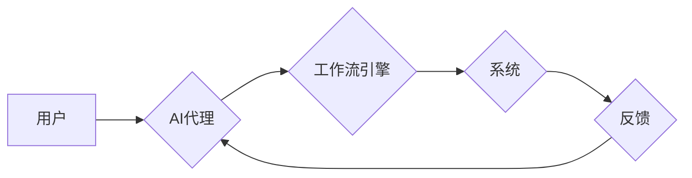

> AI代理，工作流，互动学习，强化学习，自然语言处理，流程自动化

## 1. 背景介绍

随着人工智能技术的飞速发展，AI代理在工作流自动化领域展现出巨大的潜力。AI代理是指能够自主执行任务、学习和适应环境的智能软件实体。它们可以理解人类指令，执行复杂的操作，并根据经验不断优化工作流程。

传统的工作流管理系统通常依赖于预先定义的规则和流程，缺乏灵活性。而AI代理则可以打破这种局限性，通过互动学习和适应环境的能力，实现更智能、更灵活的工作流程管理。

## 2. 核心概念与联系

**2.1 AI代理**

AI代理是一个能够感知环境、做出决策并执行行动的智能实体。它可以理解人类指令，并根据指令和环境信息执行相应的任务。AI代理通常由以下几个核心组件组成：

* **感知模块:** 用于收集环境信息，例如文本、图像、传感器数据等。
* **推理模块:** 用于分析环境信息，做出决策和规划行动。
* **执行模块:** 用于执行决策，控制外部设备或系统。
* **学习模块:** 用于从经验中学习，不断优化决策和行为。

**2.2 工作流**

工作流是指一系列相互关联的活动或任务，用于完成一个特定的业务流程。工作流通常由多个步骤组成，每个步骤都有特定的输入、输出和执行逻辑。

**2.3 互动学习**

互动学习是指AI代理通过与环境交互，不断学习和改进的行为方式。在工作流中，AI代理可以与用户、系统和其他代理进行交互，获取反馈信息，并根据反馈信息调整自己的行为策略。

**2.4 架构图**



## 3. 核心算法原理 & 具体操作步骤

**3.1 算法原理概述**

在AI代理工作流中，常用的算法包括强化学习、自然语言处理等。

* **强化学习:** AI代理通过与环境交互，获得奖励和惩罚信号，学习最优的行为策略。
* **自然语言处理:** AI代理可以理解和处理人类语言，例如接收用户指令、解释工作流程描述等。

**3.2 算法步骤详解**

**3.2.1 强化学习**

1. **环境建模:** 建立工作流环境模型，定义状态、动作、奖励函数等。
2. **策略学习:** 使用强化学习算法，例如Q学习、SARSA等，训练AI代理学习最优行为策略。
3. **策略执行:** AI代理根据学习到的策略，在工作流环境中执行动作。
4. **反馈收集:** 收集环境反馈信息，例如奖励和惩罚信号。
5. **策略更新:** 根据反馈信息，更新AI代理的行为策略。

**3.2.2 自然语言处理**

1. **文本预处理:** 对用户指令进行清洗、分词、词性标注等预处理。
2. **意图识别:** 识别用户指令的意图，例如创建任务、修改流程、查询状态等。
3. **槽位填充:** 提取用户指令中的关键信息，例如任务名称、截止时间、负责人等。
4. **动作生成:** 根据意图和槽位信息，生成相应的动作指令，例如创建任务、更新流程等。

**3.3 算法优缺点**

**3.3.1 强化学习**

* **优点:** 可以学习复杂的行为策略，适应动态变化的环境。
* **缺点:** 需要大量的训练数据和计算资源，训练过程可能很长。

**3.3.2 自然语言处理**

* **优点:** 可以理解和处理人类语言，提高用户体验。
* **缺点:** 自然语言理解仍然是一个挑战，需要不断改进算法和模型。

**3.4 算法应用领域**

* **流程自动化:** 自动化重复性任务，提高工作效率。
* **智能客服:** 提供智能化的客户服务，解决用户问题。
* **个性化推荐:** 根据用户需求，提供个性化的产品或服务推荐。

## 4. 数学模型和公式 & 详细讲解 & 举例说明

**4.1 数学模型构建**

在强化学习中，我们可以用马尔可夫决策过程 (MDP) 来建模工作流环境。

* **状态空间 (S):** 工作流中的所有可能状态，例如任务状态、流程状态等。
* **动作空间 (A):** AI代理可以执行的所有动作，例如创建任务、修改流程等。
* **转移概率 (P):** 从一个状态到另一个状态的概率，取决于执行的动作。
* **奖励函数 (R):** 评估AI代理行为的函数，例如完成任务获得奖励，失败则获得惩罚。

**4.2 公式推导过程**

强化学习的目标是找到最优策略 π，使得在长期的交互过程中，累积的奖励最大化。

* **Bellman方程:** 用于更新价值函数，描述从某个状态执行某个动作后，获得的期望奖励。

$$
V^{\pi}(s) = \max_a \sum_{s'} P(s'|s,a) [R(s,a,s') + \gamma V^{\pi}(s')]
$$

* **Q函数:** 表示从某个状态执行某个动作后，获得的期望奖励。

$$
Q^{\pi}(s,a) = R(s,a,s') + \gamma \max_{a'} Q^{\pi}(s',a')
$$

**4.3 案例分析与讲解**

假设我们有一个工作流，用于处理客户投诉。AI代理需要根据客户投诉内容，分配给合适的客服人员处理。

* **状态空间:** 客户投诉状态 (例如：未处理、处理中、已解决)
* **动作空间:** 分配客服人员、修改投诉优先级等
* **转移概率:** 根据客服人员的处理效率和投诉的复杂程度，计算投诉状态转移的概率。
* **奖励函数:** 完成投诉获得奖励，投诉超时或处理不当则获得惩罚。

通过强化学习算法，AI代理可以学习到最优的客服分配策略，提高投诉处理效率。

## 5. 项目实践：代码实例和详细解释说明

**5.1 开发环境搭建**

* Python 3.x
* TensorFlow 或 PyTorch
* 其他必要的库，例如NLTK、spaCy等

**5.2 源代码详细实现**

```python
# 强化学习模型
class Agent:
    def __init__(self, env):
        self.env = env
        # 初始化策略
        self.policy = ...

    def act(self, state):
        # 根据策略选择动作
        action = self.policy(state)
        return action

    def learn(self, state, action, reward, next_state):
        # 更新策略
        self.policy.update(state, action, reward, next_state)

# 工作流环境
class WorkflowEnv:
    def __init__(self):
        # 初始化工作流状态
        self.state = ...

    def step(self, action):
        # 执行动作，更新状态
        next_state = ...
        reward = ...
        done = ...
        return next_state, reward, done

# 主程序
if __name__ == "__main__":
    # 创建环境和代理
    env = WorkflowEnv()
    agent = Agent(env)

    # 训练代理
    for episode in range(num_episodes):
        state = env.reset()
        while True:
            action = agent.act(state)
            next_state, reward, done = env.step(action)
            agent.learn(state, action, reward, next_state)
            state = next_state
            if done:
                break

    # 测试代理
    state = env.reset()
    while True:
        action = agent.act(state)
        next_state, reward, done = env.step(action)
        state = next_state
        if done:
            break
```

**5.3 代码解读与分析**

* **Agent类:** 代表AI代理，包含策略学习和行为执行的功能。
* **WorkflowEnv类:** 代表工作流环境，提供状态转移、奖励函数等信息。
* **主程序:** 创建环境和代理，进行训练和测试。

**5.4 运行结果展示**

通过训练，AI代理可以学习到最优的策略，在工作流环境中执行任务，并不断优化自己的行为。

## 6. 实际应用场景

**6.1 流程自动化**

AI代理可以自动执行重复性任务，例如审批流程、数据录入等，提高工作效率。

**6.2 智能客服**

AI代理可以理解用户问题，提供智能化的客服服务，例如回答常见问题、引导用户操作等。

**6.3 个性化推荐**

AI代理可以根据用户需求，提供个性化的产品或服务推荐，例如电商平台的商品推荐、新闻平台的新闻推荐等。

**6.4 未来应用展望**

随着人工智能技术的不断发展，AI代理将在更多领域得到应用，例如医疗诊断、金融风险控制、教育教学等。

## 7. 工具和资源推荐

**7.1 学习资源推荐**

* **书籍:**
    * 《Reinforcement Learning: An Introduction》
    * 《Deep Learning》
* **在线课程:**
    * Coursera: Reinforcement Learning Specialization
    * Udacity: Deep Learning Nanodegree

**7.2 开发工具推荐**

* **TensorFlow:** 开源深度学习框架
* **PyTorch:** 开源深度学习框架
* **OpenAI Gym:** 强化学习环境库

**7.3 相关论文推荐**

* **AlphaGo:** DeepMind发布的围棋AI，利用强化学习技术战胜人类世界冠军。
* **GPT-3:** OpenAI发布的文本生成模型，能够生成高质量的文本内容。

## 8. 总结：未来发展趋势与挑战

**8.1 研究成果总结**

AI代理工作流技术取得了显著进展，在流程自动化、智能客服等领域取得了成功应用。

**8.2 未来发展趋势**

* **更智能的代理:** 利用更先进的AI算法，例如深度学习、迁移学习等，开发更智能、更灵活的AI代理。
* **更广泛的应用场景:** 将AI代理应用到更多领域，例如医疗、金融、教育等。
* **更安全的代理:** 确保AI代理的安全性和可靠性，防止恶意攻击和数据泄露。

**8.3 面临的挑战**

* **数据获取和标注:** 训练AI代理需要大量的训练数据，获取和标注数据是一个挑战。
* **算法复杂度:** 强化学习算法的复杂度较高，需要强大的计算资源。
* **解释性和可信度:** AI代理的决策过程往往难以解释，需要提高其解释性和可信度。

**8.4 研究展望**

未来，我们将继续研究AI代理工作流技术，开发更智能、更安全、更可靠的AI代理，为人类社会带来更多价值。

## 9. 附录：常见问题与解答

**9.1 如何选择合适的AI代理算法？**

选择合适的AI代理算法取决于具体的应用场景和需求。例如，对于简单的任务，可以使用Q学习等经典算法；对于复杂的任务，可以使用深度强化学习算法。

**9.2 如何训练AI代理？**

训练AI代理需要准备训练数据、选择算法、设置超参数等。可以使用开源工具和平台，例如OpenAI Gym、TensorFlow等，简化训练过程。

**9.3 如何评估AI代理的性能？**

可以使用奖励函数、成功率、执行时间等指标来评估AI代理的性能。

**9.4 如何确保AI代理的安全性和可靠性？**

可以通过多种方法来确保AI代理的安全性和可靠性，例如：

* 使用安全的训练数据和环境。
* 对AI代理进行安全审计和测试。
* 设置合理的限制和控制机制。


作者：禅与计算机程序设计艺术