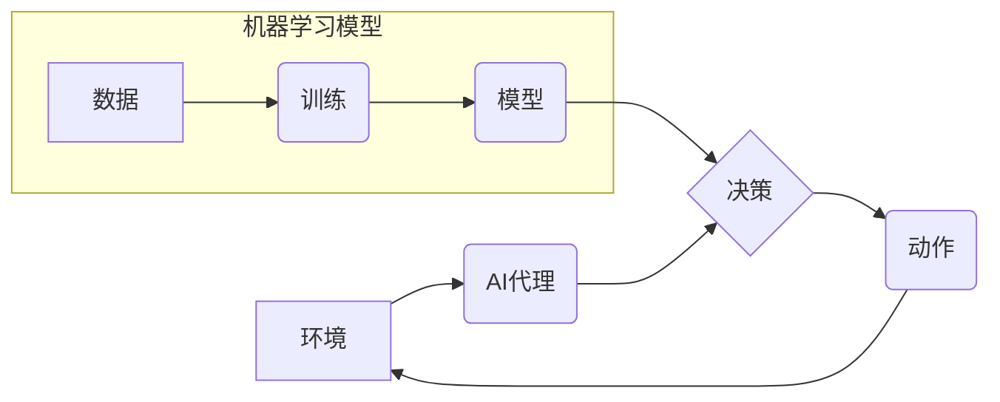

> AI代理，工作流，机器学习，决策质量，强化学习，自然语言处理

## 1. 背景介绍

在当今数字化的时代，代理系统扮演着越来越重要的角色。代理系统是指能够自动执行任务、与环境交互并做出决策的软件程序。它们广泛应用于各个领域，例如电子商务、金融、医疗保健等。

传统的代理系统通常依赖于预先定义的规则和知识库来进行决策。然而，随着环境复杂性和任务多样性的增加，基于规则的代理系统越来越难以应对挑战。

机器学习技术的出现为代理系统的发展带来了新的机遇。通过机器学习，代理系统能够从数据中学习，不断优化决策策略，从而提高决策质量。

## 2. 核心概念与联系

**2.1 AI代理**

AI代理是一个智能体，能够感知环境、做出决策并执行动作。它旨在实现特定目标，并与环境进行交互。

**2.2 工作流**

工作流是一种描述业务流程的模型，它定义了任务的顺序、依赖关系和执行规则。工作流可以帮助组织自动化流程，提高效率和协作。

**2.3 机器学习**

机器学习是一种人工智能技术，它允许计算机从数据中学习，无需明确编程。机器学习算法可以从数据中识别模式，并根据这些模式做出预测或决策。

**2.4 核心概念联系**

AI代理工作流将AI代理与工作流相结合，利用机器学习技术提升代理决策质量。

**2.5 架构图**



## 3. 核心算法原理 & 具体操作步骤

**3.1 算法原理概述**

AI代理工作流通常采用强化学习算法来训练代理决策模型。强化学习是一种监督学习方法，它通过奖励和惩罚机制来引导代理学习最优策略。

**3.2 算法步骤详解**

1. **环境建模:** 建立代理与环境交互的模型，定义状态空间、动作空间和奖励函数。
2. **代理初始化:** 初始化代理的策略，例如随机策略或贪婪策略。
3. **训练循环:**
    * 代理根据当前状态选择动作。
    * 环境根据动作反馈新的状态和奖励。
    * 代理根据奖励更新策略，以提高未来奖励的期望值。
4. **评估和部署:** 在测试环境中评估代理的性能，并部署到实际应用场景中。

**3.3 算法优缺点**

**优点:**

* 可以学习复杂决策策略。
* 不需要明确定义所有规则。
* 可以适应不断变化的环境。

**缺点:**

* 训练过程可能需要大量数据和计算资源。
* 难以解释代理的决策过程。

**3.4 算法应用领域**

* **机器人控制:** 训练机器人执行复杂任务，例如导航、抓取和组装。
* **游戏人工智能:** 开发智能游戏对手，例如围棋、象棋和电子竞技游戏。
* **金融交易:** 自动化交易策略，例如股票交易和期货交易。
* **医疗诊断:** 辅助医生诊断疾病，例如图像识别和病历分析。

## 4. 数学模型和公式 & 详细讲解 & 举例说明

**4.1 数学模型构建**

我们用一个简单的数学模型来描述AI代理工作流。

* **状态空间:** S = {s1, s2, ..., sn}，表示代理可能处于的各种状态。
* **动作空间:** A = {a1, a2, ..., am}，表示代理可以执行的各种动作。
* **奖励函数:** R(s, a)，表示代理在状态s执行动作a获得的奖励。
* **价值函数:** V(s)，表示代理在状态s的期望累积奖励。
* **策略:** π(s)，表示代理在状态s选择动作的概率分布。

**4.2 公式推导过程**

强化学习的目标是找到一个最优策略π*，使得代理在任何状态下都能获得最大的期望累积奖励。

我们可以使用Bellman方程来更新价值函数：

$$V(s) = \max_a \left[ R(s, a) + \gamma \sum_{s'} P(s' | s, a) V(s') \right]$$

其中：

* γ 是折扣因子，表示未来奖励的权重。
* P(s' | s, a) 是从状态s执行动作a转移到状态s'的概率。

**4.3 案例分析与讲解**

例如，训练一个AI代理玩游戏，我们可以将游戏状态表示为游戏棋盘的布局，游戏动作表示为玩家可以执行的各种操作，例如移动棋子或攻击对手。

奖励函数可以设计为，当玩家获胜时获得高奖励，当玩家失败时获得低奖励。

通过强化学习算法，代理可以学习到最优策略，从而提高游戏胜率。

## 5. 项目实践：代码实例和详细解释说明

**5.1 开发环境搭建**

* Python 3.x
* TensorFlow 或 PyTorch
* OpenAI Gym

**5.2 源代码详细实现**

```python
import gym
import tensorflow as tf

# 定义代理模型
model = tf.keras.Sequential([
    tf.keras.layers.Dense(128, activation='relu'),
    tf.keras.layers.Dense(64, activation='relu'),
    tf.keras.layers.Dense(env.action_space.n, activation='softmax')
])

# 定义损失函数和优化器
loss_fn = tf.keras.losses.CategoricalCrossentropy()
optimizer = tf.keras.optimizers.Adam()

# 训练循环
for episode in range(num_episodes):
    state = env.reset()
    done = False
    total_reward = 0

    while not done:
        # 选择动作
        action = model.predict(state[None, :])[0]
        # 执行动作
        next_state, reward, done, _ = env.step(action)
        # 更新状态
        state = next_state
        # 更新奖励
        total_reward += reward

    # 更新模型参数
    with tf.GradientTape() as tape:
        # 计算损失
        loss = loss_fn(tf.one_hot(action, env.action_space.n), model.predict(state[None, :])[0])
    # 反向传播
    gradients = tape.gradient(loss, model.trainable_variables)
    # 更新参数
    optimizer.apply_gradients(zip(gradients, model.trainable_variables))

    # 打印奖励
    print(f"Episode {episode+1}, Total Reward: {total_reward}")

```

**5.3 代码解读与分析**

* 代码首先定义了代理模型，这是一个多层神经网络。
* 然后定义了损失函数和优化器，用于训练模型。
* 训练循环中，代理会与环境交互，选择动作，执行动作，并根据奖励更新模型参数。
* 最后，打印每个回合的总奖励。

**5.4 运行结果展示**

训练完成后，代理可以执行任务并获得奖励。

## 6. 实际应用场景

**6.1 自动化客服**

AI代理可以处理客户咨询，提供快速响应和个性化服务。

**6.2 智能推荐系统**

AI代理可以根据用户的行为和偏好，推荐相关商品或服务。

**6.3 自动化流程审批**

AI代理可以自动处理流程审批，提高效率和透明度。

**6.4 未来应用展望**

AI代理工作流将在未来广泛应用于各个领域，例如：

* **医疗保健:** 辅助医生诊断疾病、制定治疗方案。
* **教育:** 提供个性化学习体验、自动批改作业。
* **金融:** 自动化交易策略、风险管理。
* **制造业:** 自动化生产流程、设备维护。

## 7. 工具和资源推荐

**7.1 学习资源推荐**

* **书籍:**
    * Reinforcement Learning: An Introduction by Sutton and Barto
    * Deep Reinforcement Learning Hands-On by Maxim Lapan
* **在线课程:**
    * Coursera: Reinforcement Learning Specialization
    * Udacity: Deep Reinforcement Learning Nanodegree

**7.2 开发工具推荐**

* **TensorFlow:** 开源深度学习框架
* **PyTorch:** 开源深度学习框架
* **OpenAI Gym:** 机器学习算法测试环境

**7.3 相关论文推荐**

* Deep Q-Network (DQN)
* Proximal Policy Optimization (PPO)
* Trust Region Policy Optimization (TRPO)

## 8. 总结：未来发展趋势与挑战

**8.1 研究成果总结**

AI代理工作流取得了显著进展，在多个领域取得了成功应用。

**8.2 未来发展趋势**

* **更强大的模型:** 开发更强大的AI代理模型，例如基于Transformer的模型。
* **更复杂的场景:** 将AI代理应用于更复杂的场景，例如多智能体交互和现实世界应用。
* **更安全的代理:** 研究更安全的AI代理，防止代理被恶意攻击或滥用。

**8.3 面临的挑战**

* **数据获取和标注:** 训练AI代理需要大量数据，获取和标注数据成本高昂。
* **模型解释性:** AI代理的决策过程难以解释，这可能会导致信任问题。
* **伦理问题:** AI代理的应用可能会引发伦理问题，例如算法偏见和责任归属。

**8.4 研究展望**

未来，AI代理工作流将继续发展，并对社会产生深远影响。我们需要加强对AI代理的研发和监管，确保其安全、可靠和可持续发展。

## 9. 附录：常见问题与解答

**9.1 如何选择合适的强化学习算法？**

选择合适的强化学习算法取决于具体的应用场景和数据特点。

**9.2 如何解决数据标注问题？**

可以使用数据增强技术、迁移学习等方法来解决数据标注问题。

**9.3 如何评估AI代理的性能？**

可以使用各种指标来评估AI代理的性能，例如奖励、成功率、效率等。


作者：禅与计算机程序设计艺术 / Zen and the Art of Computer Programming 
<end_of_turn>