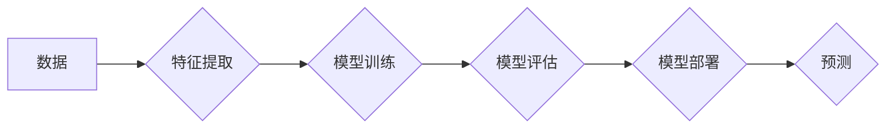

> 人工智能，机器学习，深度学习，神经网络，算法原理，代码实例，应用趋势

## 1. 背景介绍

人工智能（AI）作为21世纪最具颠覆性的科技之一，正在深刻地改变着我们的生活和工作方式。从智能语音助手到自动驾驶汽车，从医疗诊断到金融风险评估，AI技术的应用领域日益广泛。

然而，想要真正理解和应用AI，我们需要深入了解其背后的核心算法原理。本文将以机器学习和深度学习为核心，深入探讨其算法原理、代码实例以及未来发展趋势，帮助读者全面掌握AI的核心技术。

## 2. 核心概念与联系

机器学习和深度学习是AI的核心技术之一，它们都基于数据驱动的方式，通过学习数据中的模式和规律，实现智能化决策和预测。

**机器学习**是一种让计算机从数据中学习，不断改进其性能的算法。它可以分为监督学习、无监督学习和强化学习三大类。

* **监督学习**：利用标记数据训练模型，预测新的数据标签。例如，图像分类、文本情感分析等。
* **无监督学习**：利用未标记数据发现数据中的隐藏结构和模式。例如，聚类分析、异常检测等。
* **强化学习**：通过试错学习，在环境中获得最大奖励。例如，游戏AI、机器人控制等。

**深度学习**是一种更高级的机器学习方法，它利用多层神经网络来模拟人类大脑的学习过程。深度学习模型能够学习更复杂的特征表示，从而在图像识别、自然语言处理等领域取得更优异的性能。

**Mermaid 流程图：**



## 3. 核心算法原理 & 具体操作步骤

### 3.1  算法原理概述

**线性回归**是一种监督学习算法，用于预测连续值。它假设数据之间存在线性关系，并通过最小化预测值与真实值的误差来学习模型参数。

**逻辑回归**是一种用于分类问题的监督学习算法。它将线性回归模型应用于二分类问题，并通过sigmoid函数将预测值映射到0到1之间，表示样本属于正类的概率。

**决策树**是一种树形结构的分类算法，它通过一系列的决策规则来将数据分类。决策树算法易于理解和解释，但容易过拟合。

**支持向量机（SVM）**是一种用于分类和回归的监督学习算法。它通过寻找数据中最大间隔的超平面来进行分类，具有较好的泛化能力。

### 3.2  算法步骤详解

**线性回归算法步骤：**

1. 收集并预处理数据。
2. 选择合适的特征。
3. 使用最小二乘法求解模型参数。
4. 评估模型性能。
5. 预测新的数据。

**逻辑回归算法步骤：**

1. 收集并预处理数据。
2. 选择合适的特征。
3. 使用最大似然估计法求解模型参数。
4. 评估模型性能。
5. 预测新的数据类别。

**决策树算法步骤：**

1. 选择最优特征进行划分。
2. 将数据按照特征值进行划分。
3. 递归地重复步骤1和步骤2，直到满足停止条件。
4. 生成决策树。

**支持向量机算法步骤：**

1. 收集并预处理数据。
2. 选择合适的核函数。
3. 使用拉格朗日乘子法求解模型参数。
4. 评估模型性能。
5. 预测新的数据类别。

### 3.3  算法优缺点

| 算法 | 优点 | 缺点 |
|---|---|---|
| 线性回归 | 易于理解和实现，计算效率高 | 只能处理线性关系，容易过拟合 |
| 逻辑回归 | 易于理解和实现，计算效率高 | 只能处理二分类问题，容易过拟合 |
| 决策树 | 易于理解和解释，可以处理非线性关系 | 容易过拟合，对数据噪声敏感 |
| 支持向量机 | 泛化能力强，可以处理高维数据 | 计算复杂度高，参数选择困难 |

### 3.4  算法应用领域

* **线性回归**：房价预测、股票价格预测、销售预测等。
* **逻辑回归**：垃圾邮件分类、欺诈检测、客户流失预测等。
* **决策树**：信用评分、医疗诊断、产品推荐等。
* **支持向量机**：图像识别、文本分类、手写识别等。

## 4. 数学模型和公式 & 详细讲解 & 举例说明

### 4.1  数学模型构建

**线性回归模型**：

$$
y = \theta_0 + \theta_1x_1 + \theta_2x_2 + ... + \theta_nx_n
$$

其中：

* $y$ 是预测值。
* $\theta_0, \theta_1, ..., \theta_n$ 是模型参数。
* $x_1, x_2, ..., x_n$ 是输入特征。

**逻辑回归模型**：

$$
p(y=1|x) = \frac{1}{1 + e^{-( \theta_0 + \theta_1x_1 + \theta_2x_2 + ... + \theta_nx_n )}}
$$

其中：

* $p(y=1|x)$ 是样本属于正类的概率。
* $\theta_0, \theta_1, ..., \theta_n$ 是模型参数。
* $x_1, x_2, ..., x_n$ 是输入特征。

### 4.2  公式推导过程

**线性回归模型参数求解**：

使用最小二乘法，目标函数为：

$$
J(\theta) = \frac{1}{2m} \sum_{i=1}^{m} (y^{(i)} - \hat{y}^{(i)})^2
$$

其中：

* $m$ 是样本数量。
* $y^{(i)}$ 是第 $i$ 个样本的真实值。
* $\hat{y}^{(i)}$ 是第 $i$ 个样本的预测值。

通过求解梯度下降法，可以得到模型参数的更新公式：

$$
\theta_j = \theta_j - \alpha \frac{1}{m} \sum_{i=1}^{m} (y^{(i)} - \hat{y}^{(i)})x_j^{(i)}
$$

其中：

* $\alpha$ 是学习率。

**逻辑回归模型参数求解**：

使用最大似然估计法，目标函数为：

$$
L(\theta) = \prod_{i=1}^{m} p(y^{(i)}|x^{(i)})^{\hat{y}^{(i)}} (1 - p(y^{(i)}|x^{(i)}))^{(1 - \hat{y}^{(i)})}
$$

其中：

* $p(y^{(i)}|x^{(i)})$ 是第 $i$ 个样本属于正类的概率。
* $\hat{y}^{(i)}$ 是第 $i$ 个样本的真实标签。

通过求解梯度下降法，可以得到模型参数的更新公式：

$$
\theta_j = \theta_j - \alpha \frac{1}{m} \sum_{i=1}^{m} (y^{(i)} - \hat{y}^{(i)})x_j^{(i)}
$$

### 4.3  案例分析与讲解

**线性回归案例：**

假设我们想要预测房屋价格，已知房屋面积和房间数量等特征。我们可以使用线性回归模型来建立房屋价格与特征之间的关系。

**逻辑回归案例：**

假设我们想要判断邮件是否为垃圾邮件，已知邮件内容等特征。我们可以使用逻辑回归模型来判断邮件是否属于垃圾邮件类别。

## 5. 项目实践：代码实例和详细解释说明

### 5.1  开发环境搭建

* Python 3.x
* scikit-learn 库
* NumPy 库
* Pandas 库

### 5.2  源代码详细实现

```python
import numpy as np
from sklearn.linear_model import LinearRegression
from sklearn.model_selection import train_test_split
from sklearn.metrics import mean_squared_error

# 准备数据
X = np.array([[100, 2], [150, 3], [200, 4], [250, 5]])  # 房屋面积和房间数量
y = np.array([200000, 250000, 300000, 350000])  # 房屋价格

# 将数据划分为训练集和测试集
X_train, X_test, y_train, y_test = train_test_split(X, y, test_size=0.2, random_state=42)

# 创建线性回归模型
model = LinearRegression()

# 训练模型
model.fit(X_train, y_train)

# 预测测试集数据
y_pred = model.predict(X_test)

# 计算模型性能
mse = mean_squared_error(y_test, y_pred)
print(f"均方误差: {mse}")

# 打印模型参数
print(f"模型参数: {model.coef_}")
print(f"截距: {model.intercept_}")
```

### 5.3  代码解读与分析

* 首先，我们导入必要的库，并准备数据。
* 然后，我们将数据划分为训练集和测试集，用于训练和评估模型。
* 接下来，我们创建线性回归模型，并使用训练集数据训练模型。
* 训练完成后，我们可以使用测试集数据预测房屋价格，并计算模型性能。
* 最后，我们可以打印模型参数，例如权重和截距。

### 5.4  运行结果展示

运行上述代码，可以得到模型的均方误差和模型参数。

## 6. 实际应用场景

### 6.1  医疗诊断

AI算法可以分析患者的病历、影像数据等信息，辅助医生进行诊断，提高诊断准确率。

### 6.2  金融风险评估

AI算法可以分析客户的信用记录、交易行为等信息，评估客户的信用风险，帮助金融机构进行风险控制。

### 6.3  智能客服

AI聊天机器人可以模拟人类对话，为客户提供24小时在线服务，解答常见问题，提高客户满意度。

### 6.4  未来应用展望

随着人工智能技术的不断发展，其应用场景将更加广泛，例如：

* 自动驾驶汽车
* 个性化教育
* 药物研发
* 智慧城市

## 7. 工具和资源推荐

### 7.1  学习资源推荐

* **书籍:**
    * 《深度学习》
    * 《机器学习实战》
    * 《Python机器学习》
* **在线课程:**
    * Coursera
    * edX
    * Udacity

### 7.2  开发工具推荐

* **Python:** 
    * scikit-learn
    * TensorFlow
    * PyTorch

### 7.3  相关论文推荐

* **《ImageNet Classification with Deep Convolutional Neural Networks》**
* **《Attention Is All You Need》**
* **《BERT: Pre-training of Deep Bidirectional Transformers for Language Understanding》**

## 8. 总结：未来发展趋势与挑战

### 8.1  研究成果总结

近年来，人工智能领域取得了显著的进展，特别是深度学习技术的突破，使得AI在图像识别、自然语言处理等领域取得了突破性进展。

### 8.2  未来发展趋势

* **模型规模和复杂度提升:** 未来，AI模型将更加庞大，更加复杂，能够处理更复杂的任务。
* **跨模态学习:** AI模型将能够处理多种数据类型，例如文本、图像、音频等