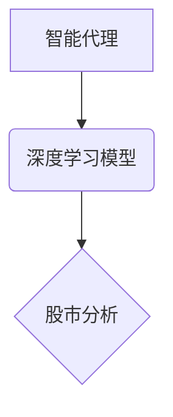

> 深度学习、智能代理、股市分析、预测模型、强化学习

## 1. 背景介绍

近年来，人工智能（AI）技术取得了长足发展，深度学习作为AI的重要分支，在图像识别、自然语言处理等领域取得了突破性进展。深度学习算法能够从海量数据中自动学习特征，并构建复杂的预测模型，为解决复杂问题提供了新的思路。

股市分析作为金融领域的核心问题之一，一直以来都依赖于人类经验和技术分析。然而，股市具有复杂性和不确定性，传统的分析方法难以捕捉市场变化的细微特征，预测准确率有限。深度学习算法的出现为股市分析带来了新的机遇。

## 2. 核心概念与联系

**2.1 智能代理**

智能代理是指能够感知环境、做出决策并与环境交互的软件系统。在股市分析场景中，智能代理可以作为投资者代理，根据市场数据和策略进行交易决策。

**2.2 深度学习**

深度学习是一种基于人工神经网络的机器学习方法，能够从数据中自动学习特征表示。深度学习模型通常由多层神经网络组成，每层神经元对输入数据进行非线性变换，最终输出预测结果。

**2.3 股市分析**

股市分析是指通过研究市场数据、公司财务状况、宏观经济环境等因素，预测股票价格走势的活动。

**2.4 核心概念关系图**



## 3. 核心算法原理 & 具体操作步骤

**3.1 算法原理概述**

在股市分析场景中，深度学习算法可以用于预测股票价格走势。常用的深度学习算法包括：

* **循环神经网络（RNN）:** RNN能够处理序列数据，适合预测时间序列数据，如股票价格。
* **长短期记忆网络（LSTM）:** LSTM是一种改进的RNN，能够更好地处理长序列数据，更适合预测股票价格的长期趋势。
* **卷积神经网络（CNN）:** CNN擅长提取图像特征，也可以应用于股票价格数据的分析，提取价格走势的特征模式。

**3.2 算法步骤详解**

1. **数据收集:** 收集历史股票价格、交易量、新闻数据等相关信息。
2. **数据预处理:** 对数据进行清洗、标准化、特征提取等处理，以便于深度学习模型的训练。
3. **模型构建:** 选择合适的深度学习算法，构建模型架构。
4. **模型训练:** 使用训练数据训练深度学习模型，调整模型参数，使模型能够准确预测股票价格。
5. **模型评估:** 使用测试数据评估模型的预测精度，并进行模型调优。
6. **模型部署:** 将训练好的模型部署到生产环境中，用于实时预测股票价格。

**3.3 算法优缺点**

**优点:**

* 能够从海量数据中自动学习特征，捕捉市场变化的细微特征。
* 预测精度较高，能够有效提高股市分析的准确性。

**缺点:**

* 需要大量的训练数据，数据质量对模型性能影响较大。
* 模型训练时间较长，需要强大的计算资源。
* 模型解释性较差，难以理解模型的决策过程。

**3.4 算法应用领域**

* 股票价格预测
* 风险管理
* 投资策略制定
* 交易信号识别

## 4. 数学模型和公式 & 详细讲解 & 举例说明

**4.1 数学模型构建**

深度学习模型通常采用多层神经网络结构，每个神经元接收多个输入信号，并通过激活函数进行非线性变换，输出一个信号。

**4.2 公式推导过程**

深度学习模型的训练过程基于梯度下降算法，通过不断调整模型参数，使模型预测结果与真实值之间的误差最小化。

**损失函数:**

$$
L = \frac{1}{N} \sum_{i=1}^{N} (y_i - \hat{y}_i)^2
$$

其中：

* $L$ 为损失函数
* $N$ 为样本数量
* $y_i$ 为真实值
* $\hat{y}_i$ 为预测值

**梯度下降算法:**

$$
\theta = \theta - \alpha \nabla L(\theta)
$$

其中：

* $\theta$ 为模型参数
* $\alpha$ 为学习率
* $\nabla L(\theta)$ 为损失函数对参数的梯度

**4.3 案例分析与讲解**

假设我们使用LSTM模型预测股票价格，训练数据包含历史股票价格、交易量等信息。模型训练完成后，可以将模型应用于新的股票数据，预测未来股票价格走势。

## 5. 项目实践：代码实例和详细解释说明

**5.1 开发环境搭建**

* Python 3.x
* TensorFlow 或 PyTorch 深度学习框架
* NumPy 科学计算库
* Pandas 数据处理库

**5.2 源代码详细实现**

```python
import tensorflow as tf

# 定义LSTM模型
model = tf.keras.models.Sequential([
    tf.keras.layers.LSTM(units=64, return_sequences=True, input_shape=(timesteps, features)),
    tf.keras.layers.LSTM(units=32),
    tf.keras.layers.Dense(units=1)
])

# 编译模型
model.compile(loss='mean_squared_error', optimizer='adam')

# 训练模型
model.fit(X_train, y_train, epochs=100)

# 预测股票价格
predictions = model.predict(X_test)
```

**5.3 代码解读与分析**

* 代码首先定义了一个LSTM模型，包含两层LSTM层和一层全连接层。
* 模型使用均方误差作为损失函数，使用Adam优化器进行训练。
* 训练模型后，可以使用模型预测新的股票数据。

**5.4 运行结果展示**

训练完成后，可以绘制训练和测试数据的预测曲线，评估模型的预测精度。

## 6. 实际应用场景

**6.1 股票价格预测**

深度学习算法可以用于预测股票价格走势，帮助投资者做出更明智的投资决策。

**6.2 风险管理**

深度学习算法可以用于识别股票市场风险，帮助投资者降低投资风险。

**6.3 投资策略制定**

深度学习算法可以用于制定个性化的投资策略，根据投资者的风险偏好和目标制定相应的投资组合。

**6.4 未来应用展望**

随着深度学习技术的不断发展，在股市分析领域的应用场景将更加广泛，例如：

* 更精准的股票价格预测
* 更有效的风险管理策略
* 更个性化的投资策略
* 更智能的交易系统

## 7. 工具和资源推荐

**7.1 学习资源推荐**

* 深度学习书籍：
    * 《深度学习》
    * 《动手学深度学习》
* 在线课程：
    * Coursera 深度学习课程
    * Udacity 深度学习工程师课程

**7.2 开发工具推荐**

* TensorFlow
* PyTorch
* Keras

**7.3 相关论文推荐**

* 《利用深度学习预测股票价格》
* 《深度学习在金融市场中的应用》

## 8. 总结：未来发展趋势与挑战

**8.1 研究成果总结**

深度学习算法在股市分析领域取得了显著成果，能够有效提高预测精度，为投资者提供更精准的决策支持。

**8.2 未来发展趋势**

* 模型复杂度提升：开发更复杂的深度学习模型，例如Transformer网络，提高预测精度。
* 数据融合：融合更多类型的数据，例如新闻数据、社交媒体数据，提高模型的泛化能力。
* 算法解释性增强：研究更易解释的深度学习算法，提高模型的透明度。

**8.3 面临的挑战**

* 数据质量问题：深度学习算法对数据质量要求较高，需要高质量的训练数据。
* 计算资源限制：训练深度学习模型需要大量的计算资源，成本较高。
* 模型可解释性问题：深度学习模型的决策过程难以解释，难以获得投资者的信任。

**8.4 研究展望**

未来研究将重点关注以下方面：

* 开发更鲁棒、更有效的深度学习算法。
* 探索更丰富的特征表示方法。
* 研究深度学习模型的可解释性。


## 9. 附录：常见问题与解答

**9.1 如何选择合适的深度学习算法？**

选择合适的深度学习算法取决于具体的应用场景和数据特点。

* 对于时间序列数据，RNN和LSTM算法效果较好。
* 对于图像数据，CNN算法效果较好。

**9.2 如何处理数据质量问题？**

* 数据清洗：去除数据中的噪声和异常值。
* 数据标准化：将数据转换为标准化形式，提高模型训练效率。
* 数据增强：通过人工方式增加数据量，提高模型的泛化能力。

**9.3 如何提高模型的预测精度？**

* 优化模型架构：调整模型层数、神经元数量等参数。
* 调整训练参数：调整学习率、批处理大小等参数。
* 使用更丰富的特征：提取更多类型的特征，提高模型的表达能力。


作者：禅与计算机程序设计艺术 / Zen and the Art of Computer Programming 
<end_of_turn>