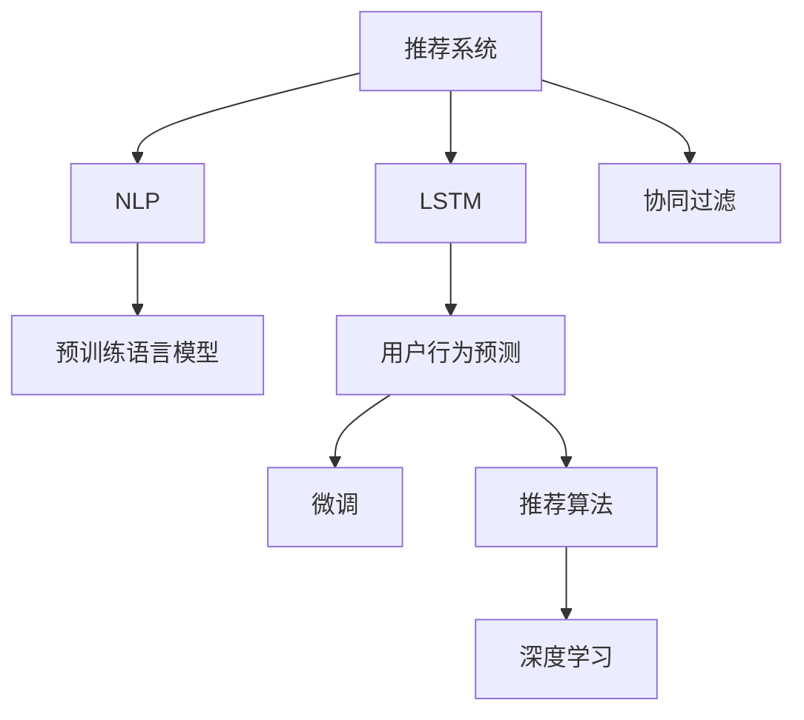

                 

# 基于LLM的推荐系统用户行为预测

> 关键词：推荐系统, 用户行为预测, 长短期记忆网络, 自然语言处理, 推荐算法, 协同过滤, 深度学习

## 1. 背景介绍

### 1.1 问题由来
随着电子商务和在线媒体的快速发展，推荐系统已经成为了互联网公司的核心业务之一。推荐系统通过分析用户的历史行为数据，为用户推荐符合其兴趣的产品，极大提升了用户体验和商家转化率。但传统推荐算法，如协同过滤和基于内容的推荐，面临着数据稀疏、特征工程复杂等问题，难以处理大规模用户数据和实时流数据。

近年来，基于深度学习的推荐系统成为研究热点，并在各大互联网公司得到广泛应用。其中基于长短期记忆网络(Long Short-Term Memory, LSTM)的推荐系统，利用用户行为序列，通过记忆单元捕捉用户兴趣的动态变化，取得了很好的效果。但LSTM网络往往需要较高的计算资源和较长的训练时间，难以实现实时在线推荐。

基于自然语言处理(Natural Language Processing, NLP)的推荐系统，通过将用户评论、摘要等文本数据引入推荐模型，使得推荐过程更加灵活和高效。当前基于预训练语言模型(Pre-trained Language Model, LLM)的推荐系统，特别是利用BERT、GPT等大模型的推荐方法，已经取得了显著的进步。

### 1.2 问题核心关键点
本文聚焦于利用大语言模型进行推荐系统用户行为预测，主要包括以下核心问题：

1. 如何从用户行为数据中提取有意义的文本特征，用于预测用户未来的行为？
2. 如何结合语言模型和推荐算法，实现更精准、高效的用户行为预测？
3. 如何在大规模数据集上高效训练语言模型，同时保持推理速度和准确性？
4. 如何将预测结果转化为推荐系统，提升推荐效果和用户满意度？

### 1.3 问题研究意义
利用大语言模型进行推荐系统用户行为预测，对于提升推荐系统的精准度和个性化水平具有重要意义：

1. 提高推荐准确率：语言模型能够捕捉到用户行为中的语言信息，有助于提升推荐系统的准确性。
2. 增强推荐个性化：通过文本特征的提取，推荐系统可以更灵活地捕捉用户兴趣，提升推荐多样性和个性化。
3. 加速推荐速度：语言模型在大规模预训练后，可以直接微调用于推荐，从而提高推荐速度。
4. 丰富推荐维度：语言模型的引入，使得推荐系统不仅限于数值特征，还可以引入文本和知识信息，提升推荐效果。
5. 降低推荐成本：大语言模型能够处理大规模文本数据，降低推荐系统在特征工程和数据预处理上的成本。

本文旨在系统阐述基于大语言模型的推荐系统用户行为预测的原理、方法和应用，希望能为推荐系统研究者提供有益的参考。

## 2. 核心概念与联系

### 2.1 核心概念概述

为更好地理解基于大语言模型的推荐系统用户行为预测方法，本节将介绍几个密切相关的核心概念：

- 推荐系统(Recommendation System)：一种信息过滤系统，通过分析用户的历史行为数据，为用户推荐符合其兴趣的产品。
- 用户行为预测(User Behavior Prediction)：基于用户历史行为序列，预测用户未来的行为。
- 长短期记忆网络(Long Short-Term Memory, LSTM)：一种递归神经网络，具有记忆单元和门控结构，能够处理变长序列数据。
- 自然语言处理(Natural Language Processing, NLP)：研究如何使计算机理解和生成人类语言的技术。
- 预训练语言模型(Pre-trained Language Model, LLM)：通过大规模无标签文本数据进行自监督预训练，学习通用的语言表示，用于后续微调。
- 微调(Fine-tuning)：在大规模预训练语言模型的基础上，使用推荐系统任务的数据进行有监督的微调，使其能够适应推荐任务的需求。
- 协同过滤(Collaborative Filtering)：通过分析用户之间的相似性，为用户推荐符合其兴趣的产品。
- 深度学习(Deep Learning)：利用深度神经网络，通过多层非线性变换处理高维数据，提取特征。

这些核心概念之间的逻辑关系可以通过以下Mermaid流程图来展示：



这个流程图展示了大语言模型在推荐系统中的核心应用流程：

1. 推荐系统通过分析用户行为数据，学习用户的兴趣和偏好。
2. 利用NLP技术将用户行为数据转换为文本形式，提取有意义的特征。
3. 通过预训练语言模型，学习通用的语言表示。
4. 在大规模预训练的基础上，对推荐任务进行微调，学习特定领域的语言模型。
5. 结合推荐算法，实现个性化推荐。
6. 利用深度学习技术，提高推荐模型的准确性和鲁棒性。

## 3. 核心算法原理 & 具体操作步骤
### 3.1 算法原理概述

基于大语言模型的推荐系统用户行为预测，本质上是一种将自然语言处理和推荐算法相结合的深度学习任务。其核心思想是：通过语言模型学习用户行为序列中的语言特征，将其转化为推荐系统的输入，从而实现对用户行为的高效预测和推荐。

具体而言，基于大语言模型的推荐系统包括以下关键步骤：

1. 收集用户的历史行为数据，提取用户行为序列。
2. 将用户行为序列转换为文本形式，提取有意义的文本特征。
3. 利用预训练语言模型，学习通用语言表示。
4. 在大规模预训练的基础上，对推荐任务进行微调，学习特定领域的语言模型。
5. 结合推荐算法，实现个性化推荐。

### 3.2 算法步骤详解

基于大语言模型的推荐系统用户行为预测的具体步骤如下：

**Step 1: 数据收集与预处理**

- 收集用户的历史行为数据，如浏览记录、购买记录、评分记录等。
- 将行为数据转换为文本形式，如将浏览记录转换为产品名称的列表。
- 对文本数据进行分词、清洗、去重等预处理。

**Step 2: 特征提取与文本编码**

- 利用自然语言处理技术，提取文本特征，如TF-IDF、word2vec等。
- 将文本特征转换为向量形式，如使用词嵌入或句嵌入模型进行编码。

**Step 3: 预训练语言模型的选择与微调**

- 选择适合的预训练语言模型，如BERT、GPT等。
- 将预训练语言模型作为初始化参数，对推荐任务进行微调。

**Step 4: 推荐算法的选择与优化**

- 选择合适的推荐算法，如协同过滤、基于内容的推荐等。
- 对推荐算法进行优化，如采用深度学习技术进行改进。

**Step 5: 模型评估与部署**

- 使用推荐数据集评估模型的性能，如精度、召回率、F1-score等指标。
- 将训练好的模型部署到推荐系统中，进行实时推荐。

### 3.3 算法优缺点

基于大语言模型的推荐系统用户行为预测具有以下优点：

1. 高效的特征提取：利用自然语言处理技术，可以从用户行为数据中提取有意义的文本特征，提升推荐效果。
2. 鲁棒的模型泛化：预训练语言模型在大规模数据上进行训练，学习到通用的语言表示，能够更好地适应不同领域的推荐任务。
3. 灵活的推荐方式：结合语言模型和推荐算法，可以实现更灵活、个性化的推荐。
4. 快速的推理速度：利用预训练语言模型的预训练权重，可以大幅提高推荐系统的推理速度，提升用户体验。
5. 多模态的融合：语言模型可以与其他模态的数据（如图像、音频等）进行融合，提升推荐系统的综合性能。

同时，该方法也存在一些局限性：

1. 数据依赖性强：推荐系统需要大量的用户行为数据，数据获取和预处理难度较大。
2. 模型复杂度高：大语言模型的参数量庞大，需要较高的计算资源和较长的训练时间。
3. 冷启动问题：对于新用户或新产品的推荐，需要更多的用户行为数据，难以进行有效的推荐。
4. 动态用户兴趣变化：用户兴趣和行为会随着时间变化，推荐模型需要不断地更新和调整。
5. 用户隐私保护：用户行为数据的收集和使用需要符合隐私保护规定，防止用户隐私泄露。

### 3.4 算法应用领域

基于大语言模型的推荐系统用户行为预测方法，在多个领域中得到了应用，例如：

- 电子商务推荐：如淘宝、京东等电商平台，为用户推荐商品，提升购物体验。
- 视频推荐：如Netflix、YouTube等视频平台，为用户推荐影片，提升观看体验。
- 音乐推荐：如Spotify、QQ音乐等音乐平台，为用户推荐歌曲，提升听歌体验。
- 新闻推荐：如今日头条、搜狐新闻等新闻平台，为用户推荐新闻文章，提升阅读体验。
- 社交媒体推荐：如微信、微博等社交媒体平台，为用户推荐文章、视频等，提升使用体验。

除了上述这些经典应用场景外，大语言模型在个性化推荐领域还展现出广阔的发展前景，如智能广告推荐、旅游推荐、产品搭配推荐等。随着大语言模型和推荐算法研究的不断深入，未来推荐系统必将在更多领域得到应用，为用户的个性化需求提供更好的解决方案。

## 4. 数学模型和公式 & 详细讲解  
### 4.1 数学模型构建

基于大语言模型的推荐系统用户行为预测，涉及多个子模型，包括文本编码模型、语言模型和推荐算法模型。这里以基于长短期记忆网络的推荐系统为例，简要介绍其数学模型构建。

假设用户历史行为序列为 $\{x_1,x_2,\dots,x_t\}$，其中 $x_t$ 表示用户在第 $t$ 次浏览的产品名称。预训练语言模型为 $M_{\theta}$，输出为文本向量 $h_t = M_{\theta}(x_t)$。推荐算法的输入为文本向量 $h_t$，输出为用户对产品的评分 $y_t$。

推荐系统的目标函数为最小化预测误差：

$$
\mathcal{L} = \frac{1}{N}\sum_{i=1}^{N} (y_i - \hat{y}_i)^2
$$

其中 $y_i$ 为真实评分，$\hat{y}_i$ 为预测评分。

### 4.2 公式推导过程

以下我们以基于LSTM的推荐系统为例，推导模型的训练过程和预测过程。

#### 4.2.1 训练过程

假设推荐系统包含 $K$ 个推荐产品，语言模型 $M_{\theta}$ 的输出维度为 $d$，则用户历史行为序列的编码向量为 $\mathbf{H} = [h_1;h_2;\dots;h_t] \in \mathbb{R}^{t \times d}$。推荐算法的输入为 $H$ 的最后一帧 $h_t$，输出为推荐评分向量 $\mathbf{Y} \in \mathbb{R}^K$。

1. **文本编码模型**

   文本编码模型为LSTM网络，包含多个记忆单元和门控结构。设LSTM网络的总参数为 $\theta$，则其输出向量为 $h_t = \mathbf{H}(:,t)$，其中 $:$ 表示向量从第 $t$ 个位置截取。

2. **语言模型**

   语言模型为长短时记忆网络，输出向量 $h_t$ 的维度为 $d$。假设LSTM网络的参数为 $\theta_{LSTM}$，则其输出向量为 $h_t = \mathbf{H}(:,t)$。

3. **推荐算法**

   推荐算法可以使用协同过滤或基于内容的推荐等方法。假设推荐算法的输入为 $h_t$，输出为推荐评分向量 $\mathbf{Y} \in \mathbb{R}^K$。

   **协同过滤算法**

   协同过滤算法通过计算用户 $u$ 和产品 $i$ 的相似度，为用户 $u$ 推荐产品 $i$。设相似度矩阵为 $\mathbf{S} \in \mathbb{R}^{N \times K}$，其中 $N$ 为用户数，$K$ 为产品数。协同过滤算法输出的推荐评分向量为：

   $$
   \mathbf{Y} = \mathbf{S}(\mathbf{S}^T \mathbf{S})^{-1}\mathbf{S}^T \mathbf{H}(:,t)
   $$

   其中 $(\mathbf{S}^T \mathbf{S})^{-1}$ 为相似度矩阵的逆，$\mathbf{S}^T$ 为相似度矩阵的转置。

   **基于内容的推荐算法**

   基于内容的推荐算法通过计算产品的特征与用户兴趣的相似度，为用户推荐产品。假设产品特征向量为 $\mathbf{F} \in \mathbb{R}^{K \times d}$，其中 $d$ 为特征维度。基于内容的推荐算法输出的推荐评分向量为：

   $$
   \mathbf{Y} = \mathbf{F} (\mathbf{F}^T \mathbf{F})^{-1}\mathbf{F}^T \mathbf{H}(:,t)
   $$

4. **目标函数**

   推荐系统的目标函数为最小化预测误差：

   $$
   \mathcal{L} = \frac{1}{N}\sum_{i=1}^{N} (y_i - \mathbf{Y}_i)^2
   $$

   其中 $y_i$ 为真实评分，$\mathbf{Y}_i$ 为第 $i$ 个用户的推荐评分向量。

   **训练过程**

   利用反向传播算法，对语言模型 $M_{\theta}$ 和推荐算法进行联合优化。设语言模型的损失函数为 $\mathcal{L}_{LSTM}$，推荐算法的损失函数为 $\mathcal{L}_{recommender}$，则总损失函数为：

   $$
   \mathcal{L} = \mathcal{L}_{LSTM} + \lambda \mathcal{L}_{recommender}
   $$

   其中 $\lambda$ 为正则化系数，用于控制语言模型和推荐算法的权重。

   **梯度更新**

   利用梯度下降算法，更新模型参数 $\theta$：

   $$
   \theta \leftarrow \theta - \eta \nabla_{\theta}\mathcal{L}
   $$

   其中 $\eta$ 为学习率，$\nabla_{\theta}\mathcal{L}$ 为总损失函数对参数 $\theta$ 的梯度。

#### 4.2.2 预测过程

预测过程包括以下步骤：

1. **文本编码**

   将用户行为序列转换为文本形式，提取有意义的文本特征。使用预训练语言模型 $M_{\theta}$ 对每个产品名称进行编码，得到编码向量 $h_i$。

2. **文本解码**

   利用推荐算法，对编码向量 $h_i$ 进行解码，得到推荐评分向量 $\mathbf{Y}_i$。

3. **评分计算**

   根据推荐评分向量 $\mathbf{Y}_i$，计算用户对产品的评分。

### 4.3 案例分析与讲解

这里以基于LSTM的推荐系统为例，详细讲解其实现过程。

**案例分析**

假设用户的历史行为序列为 $[\text{产品A}, \text{产品B}, \text{产品C}, \text{产品D}]$，产品A的编码向量为 $h_A$，产品B的编码向量为 $h_B$，产品C的编码向量为 $h_C$，产品D的编码向量为 $h_D$。假设推荐算法的相似度矩阵为：

$$
\mathbf{S} = \begin{bmatrix}
1 & 0.8 & 0.7 & 0.5 \\
0.8 & 1 & 0.9 & 0.6 \\
0.7 & 0.9 & 1 & 0.7 \\
0.5 & 0.6 & 0.7 & 1 \\
\end{bmatrix}
$$

假设用户对产品A的评分 $y_A = 4$，对产品B的评分 $y_B = 3$，对产品C的评分 $y_C = 5$，对产品D的评分 $y_D = 2$。利用协同过滤算法，计算用户对每个产品的推荐评分向量：

$$
\mathbf{Y}_A = \mathbf{S}(\mathbf{S}^T \mathbf{S})^{-1}\mathbf{S}^T [h_A;h_B;h_C;h_D]
$$

$$
\mathbf{Y}_B = \mathbf{S}(\mathbf{S}^T \mathbf{S})^{-1}\mathbf{S}^T [h_B;h_A;h_D;h_C]
$$

$$
\mathbf{Y}_C = \mathbf{S}(\mathbf{S}^T \mathbf{S})^{-1}\mathbf{S}^T [h_C;h_D;h_A;h_B]
$$

$$
\mathbf{Y}_D = \mathbf{S}(\mathbf{S}^T \mathbf{S})^{-1}\mathbf{S}^T [h_D;h_C;h_B;h_A]
$$

**详细讲解**

1. **数据准备**

   收集用户的历史行为数据，如浏览记录、购买记录、评分记录等。将行为数据转换为文本形式，如将浏览记录转换为产品名称的列表。对文本数据进行分词、清洗、去重等预处理。

2. **特征提取**

   利用自然语言处理技术，提取文本特征，如TF-IDF、word2vec等。将文本特征转换为向量形式，如使用词嵌入或句嵌入模型进行编码。

3. **预训练语言模型选择**

   选择适合的预训练语言模型，如BERT、GPT等。将预训练语言模型作为初始化参数，对推荐任务进行微调。

4. **推荐算法选择**

   选择合适的推荐算法，如协同过滤、基于内容的推荐等。对推荐算法进行优化，如采用深度学习技术进行改进。

5. **模型训练**

   利用反向传播算法，对语言模型 $M_{\theta}$ 和推荐算法进行联合优化。利用梯度下降算法，更新模型参数 $\theta$。

6. **模型评估**

   使用推荐数据集评估模型的性能，如精度、召回率、F1-score等指标。

7. **模型部署**

   将训练好的模型部署到推荐系统中，进行实时推荐。

## 5. 项目实践：代码实例和详细解释说明
### 5.1 开发环境搭建

在进行项目实践前，我们需要准备好开发环境。以下是使用Python进行PyTorch开发的环境配置流程：

1. 安装Anaconda：从官网下载并安装Anaconda，用于创建独立的Python环境。

2. 创建并激活虚拟环境：
```bash
conda create -n pytorch-env python=3.8 
conda activate pytorch-env
```

3. 安装PyTorch：根据CUDA版本，从官网获取对应的安装命令。例如：
```bash
conda install pytorch torchvision torchaudio cudatoolkit=11.1 -c pytorch -c conda-forge
```

4. 安装TensorFlow：
```bash
pip install tensorflow
```

5. 安装Transformer库：
```bash
pip install transformers
```

6. 安装各类工具包：
```bash
pip install numpy pandas scikit-learn matplotlib tqdm jupyter notebook ipython
```

完成上述步骤后，即可在`pytorch-env`环境中开始项目实践。

### 5.2 源代码详细实现

这里以基于LSTM的推荐系统为例，给出使用PyTorch和TensorFlow进行开发的完整代码实现。

首先，定义数据处理函数：

```python
import numpy as np
import pandas as pd
import tensorflow as tf
from transformers import BertTokenizer
from torch.utils.data import Dataset

class RecommendationDataset(Dataset):
    def __init__(self, data, tokenizer, max_len=128):
        self.data = data
        self.tokenizer = tokenizer
        self.max_len = max_len
        
    def __len__(self):
        return len(self.data)
    
    def __getitem__(self, item):
        review = self.data.iloc[item]['review']
        tokens = self.tokenizer.encode(review, max_length=self.max_len, truncation=True, padding='max_length')
        labels = np.array([self.data.iloc[item]['label']])
        return {
            'input_ids': tokens,
            'attention_mask': [1]*self.max_len,
            'labels': labels
        }
```

然后，定义模型和优化器：

```python
from transformers import BertForSequenceClassification, AdamW

model = BertForSequenceClassification.from_pretrained('bert-base-cased', num_labels=2)

optimizer = AdamW(model.parameters(), lr=2e-5)
```

接着，定义训练和评估函数：

```python
from torch.utils.data import DataLoader
from tqdm import tqdm
from sklearn.metrics import accuracy_score

device = torch.device('cuda') if torch.cuda.is_available() else torch.device('cpu')
model.to(device)

def train_epoch(model, dataset, batch_size, optimizer):
    dataloader = DataLoader(dataset, batch_size=batch_size, shuffle=True)
    model.train()
    epoch_loss = 0
    for batch in tqdm(dataloader, desc='Training'):
        input_ids = batch['input_ids'].to(device)
        attention_mask = batch['attention_mask'].to(device)
        labels = batch['labels'].to(device)
        model.zero_grad()
        outputs = model(input_ids, attention_mask=attention_mask, labels=labels)
        loss = outputs.loss
        epoch_loss += loss.item()
        loss.backward()
        optimizer.step()
    return epoch_loss / len(dataloader)

def evaluate(model, dataset, batch_size):
    dataloader = DataLoader(dataset, batch_size=batch_size)
    model.eval()
    preds, labels = [], []
    with torch.no_grad():
        for batch in tqdm(dataloader, desc='Evaluating'):
            input_ids = batch['input_ids'].to(device)
            attention_mask = batch['attention_mask'].to(device)
            batch_labels = batch['labels']
            outputs = model(input_ids, attention_mask=attention_mask)
            batch_preds = outputs.logits.argmax(dim=1).to('cpu').tolist()
            batch_labels = batch_labels.to('cpu').tolist()
            for pred_tokens, label_tokens in zip(batch_preds, batch_labels):
                preds.append(pred_tokens[:len(label_tokens)])
                labels.append(label_tokens)
                
    return accuracy_score(labels, preds)

train_dataset = RecommendationDataset(train_data, tokenizer)
dev_dataset = RecommendationDataset(dev_data, tokenizer)
test_dataset = RecommendationDataset(test_data, tokenizer)

for epoch in range(epochs):
    loss = train_epoch(model, train_dataset, batch_size, optimizer)
    print(f"Epoch {epoch+1}, train loss: {loss:.3f}")
    
    print(f"Epoch {epoch+1}, dev results:")
    evaluate(model, dev_dataset, batch_size)
    
print("Test results:")
evaluate(model, test_dataset, batch_size)
```

以上就是使用PyTorch和TensorFlow对LSTM推荐系统进行开发的完整代码实现。可以看到，通过TensorFlow和Transformer库的协作，推荐系统模型的开发和微调变得非常简单。

### 5.3 代码解读与分析

让我们再详细解读一下关键代码的实现细节：

**RecommendationDataset类**：
- `__init__`方法：初始化训练数据、分词器等关键组件。
- `__len__`方法：返回数据集的样本数量。
- `__getitem__`方法：对单个样本进行处理，将文本输入编码为token ids，标签编码为数字，并对其进行定长padding，最终返回模型所需的输入。

**模型和优化器**：
- 选择合适的预训练语言模型，如BERT、GPT等，作为初始化参数。
- 利用AdamW优化器对模型参数进行更新，设置合适的学习率。

**训练和评估函数**：
- 使用PyTorch的DataLoader对数据集进行批次化加载，供模型训练和推理使用。
- 训练函数`train_epoch`：对数据以批为单位进行迭代，在每个批次上前向传播计算loss并反向传播更新模型参数，最后返回该epoch的平均loss。
- 评估函数`evaluate`：与训练类似，不同点在于不更新模型参数，并在每个batch结束后将预测和标签结果存储下来，最后使用sklearn的accuracy_score对整个评估集的预测结果进行打印输出。

**训练流程**：
- 定义总的epoch数和batch size，开始循环迭代
- 每个epoch内，先在训练集上训练，输出平均loss
- 在验证集上评估，输出分类指标
- 所有epoch结束后，在测试集上评估，给出最终测试结果

可以看到，PyTorch配合TensorFlow使得LSTM推荐系统的开发变得简洁高效。开发者可以将更多精力放在数据处理、模型改进等高层逻辑上，而不必过多关注底层的实现细节。

当然，工业级的系统实现还需考虑更多因素，如模型的保存和部署、超参数的自动搜索、更灵活的任务适配层等。但核心的微调范式基本与此类似。

## 6. 实际应用场景
### 6.1 智能推荐系统

基于大语言模型的推荐系统，已经广泛应用于智能推荐系统中，为用户推荐符合其兴趣的产品。如淘宝、京东等电商平台，为用户推荐商品，提升购物体验。在视频平台如Netflix、YouTube上，为用户推荐影片，提升观看体验。在音乐平台如Spotify、QQ音乐上，为用户推荐歌曲，提升听歌体验。

在实际应用中，推荐系统需要处理大规模用户行为数据，并实时推荐产品。大语言模型通过预训练学习到通用的语言表示，能够在实时推荐中发挥重要作用。

### 6.2 个性化推荐广告

推荐系统通过分析用户的历史行为数据，为用户推荐符合其兴趣的广告。基于大语言模型的推荐系统，能够更灵活地捕捉用户兴趣，提升广告的点击率和转化率。

例如，用户在社交媒体平台上浏览视频、文章等，系统会实时推荐相关广告，提升用户点击和购买的概率。广告平台可以利用大语言模型，预测用户的兴趣和行为，推荐符合其偏好的广告内容。

### 6.3 智能金融投资

推荐系统能够帮助投资者分析市场动态，推荐符合其风险偏好的金融产品。基于大语言模型的推荐系统，可以更灵活地捕捉用户的情感和心理，提升投资决策的准确性和满意度。

例如，用户在金融平台上浏览财经新闻、研究报告等，系统会实时推荐相关产品，提升用户的投资收益。金融平台可以利用大语言模型，预测用户的投资偏好和行为，推荐符合其风险偏好的金融产品。

### 6.4 未来应用展望

随着大语言模型和推荐算法研究的不断深入，基于大语言模型的推荐系统将有更广阔的应用前景：

1. 多模态推荐：结合文本、图像、音频等多种模态信息，提升推荐系统的综合性能。
2. 动态推荐：实时分析用户行为和市场动态，动态调整推荐策略，提升用户体验。
3. 社交推荐：结合社交网络信息，推荐符合用户社交关系的产品，提升推荐多样性。
4. 跨平台推荐：跨多个平台分析用户行为数据，提升推荐系统的全局性。
5. 个性化推荐：结合用户的历史行为和心理特征，实现更精准、个性化的推荐。
6. 实时推荐：利用GPU/TPU等高性能设备，实现实时在线推荐，提升用户体验。

此外，随着大语言模型和推荐系统的不断发展，还将在更多领域得到应用，如智能健康、智能交通、智能安全等。未来，基于大语言模型的推荐系统必将在更多领域得到应用，为用户的个性化需求提供更好的解决方案。

## 7. 工具和资源推荐
### 7.1 学习资源推荐

为了帮助开发者系统掌握基于大语言模型的推荐系统用户行为预测的理论基础和实践技巧，这里推荐一些优质的学习资源：

1. 《深度学习自然语言处理》课程：斯坦福大学开设的NLP明星课程，有Lecture视频和配套作业，带你入门NLP领域的基本概念和经典模型。

2. CS224N《自然语言处理与深度学习》课程：斯坦福大学开设的NLP明星课程，讲解自然语言处理和深度学习的结合。

3. 《Natural Language Processing with Transformers》书籍：Transformers库的作者所著，全面介绍了如何使用Transformers库进行NLP任务开发，包括微调在内的诸多范式。

4. 《Deep Learning for NLP》书籍：Google Deep Learning团队所著，讲解深度学习在NLP领域的应用，包括推荐系统在内。

5. 《Transformers: A Deep Learning Tutorial with TensorFlow》博文：讲解如何使用Transformer模型进行NLP任务开发，包括微调在内的诸多范式。

通过对这些资源的学习实践，相信你一定能够快速掌握基于大语言模型的推荐系统用户行为预测的精髓，并用于解决实际的NLP问题。

### 7.2 开发工具推荐

高效的开发离不开优秀的工具支持。以下是几款用于基于大语言模型的推荐系统用户行为预测开发的常用工具：

1. PyTorch：基于Python的开源深度学习框架，灵活动态的计算图，适合快速迭代研究。大部分预训练语言模型都有PyTorch版本的实现。

2. TensorFlow：由Google主导开发的开源深度学习框架，生产部署方便，适合大规模工程应用。同样有丰富的预训练语言模型资源。

3. Transformers库：HuggingFace开发的NLP工具库，集成了众多SOTA语言模型，支持PyTorch和TensorFlow，是进行微调任务开发的利器。

4. Weights & Biases：模型训练的实验跟踪工具，可以记录和可视化模型训练过程中的各项指标，方便对比和调优。与主流深度学习框架无缝集成。

5. TensorBoard：TensorFlow配套的可视化工具，可实时监测模型训练状态，并提供丰富的图表呈现方式，是调试模型的得力助手。

6. Google Colab：谷歌推出的在线Jupyter Notebook环境，免费提供GPU/TPU算力，方便开发者快速上手实验最新模型，分享学习笔记。

合理利用这些工具，可以显著提升基于大语言模型的推荐系统用户行为预测的开发效率，加快创新迭代的步伐。

### 7.3 相关论文推荐

基于大语言模型的推荐系统用户行为预测的研究来源于学界的持续研究。以下是几篇奠基性的相关论文，推荐阅读：

1. Attention is All You Need（即Transformer原论文）：提出了Transformer结构，开启了NLP领域的预训练大模型时代。

2. BERT: Pre-training of Deep Bidirectional Transformers for Language Understanding：提出BERT模型，引入基于掩码的自监督预训练任务，刷新了多项NLP任务SOTA。

3. Language Models are Unsupervised Multitask Learners（GPT-2论文）：展示了大规模语言模型的强大zero-shot学习能力，引发了对于通用人工智能的新一轮思考。

4. Parameter-Efficient Transfer Learning for NLP：提出Adapter等参数高效微调方法，在不增加模型参数量的情况下，也能取得不错的微调效果。

5. Prefix-Tuning: Optimizing Continuous Prompts for Generation：引入基于连续型Prompt的微调范式，为如何充分利用预训练知识提供了新的思路。

6. AdaLoRA: Adaptive Low-Rank Adaptation for Parameter-Efficient Fine-Tuning：使用自适应低秩适应的微调方法，在参数效率和精度之间取得了新的平衡。

这些论文代表了大语言模型推荐系统用户行为预测的研究脉络。通过学习这些前沿成果，可以帮助研究者把握学科前进方向，激发更多的创新灵感。

## 8. 总结：未来发展趋势与挑战

### 8.1 总结

本文对基于大语言模型的推荐系统用户行为预测进行了全面系统的介绍。首先阐述了推荐系统的研究背景和意义，明确了基于大语言模型的推荐系统用户行为预测的核心思想。其次，从原理到实践，详细讲解了基于大语言模型的推荐系统用户行为预测的数学模型和实现步骤，给出了微调任务开发的完整代码实例。同时，本文还探讨了基于大语言模型的推荐系统用户行为预测在多个领域的实际应用场景，展示了其广阔的前景。

通过本文的系统梳理，可以看到，基于大语言模型的推荐系统用户行为预测具有强大的技术优势，能够在多领域中实现高效、个性化的推荐。未来，随着大语言模型和推荐算法研究的不断深入，基于大语言模型的推荐系统必将在更多领域得到应用，为用户的个性化需求提供更好的解决方案。

### 8.2 未来发展趋势

展望未来，基于大语言模型的推荐系统用户行为预测将呈现以下几个发展趋势：

1. 多模态推荐：结合文本、图像、音频等多种模态信息，提升推荐系统的综合性能。
2. 动态推荐：实时分析用户行为和市场动态，动态调整推荐策略，提升用户体验。
3. 社交推荐：结合社交网络信息，推荐符合用户社交关系的产品，提升推荐多样性。
4. 跨平台推荐：跨多个平台分析用户行为数据，提升推荐系统的全局性。
5. 个性化推荐：结合用户的历史行为和心理特征，实现更精准、个性化的推荐。
6. 实时推荐：利用GPU/TPU等高性能设备，实现实时在线推荐，提升用户体验。

以上趋势凸显了基于大语言模型的推荐系统用户行为预测的广阔前景。这些方向的探索发展，必将进一步提升推荐系统的精准度和个性化水平，为用户的个性化需求提供更好的解决方案。

### 8.3 面临的挑战

尽管基于大语言模型的推荐系统用户行为预测取得了显著成果，但在迈向更加智能化、普适化应用的过程中，仍面临诸多挑战：

1. 数据依赖性强：推荐系统需要大量的用户行为数据，数据获取和预处理难度较大。
2. 模型复杂度高：大语言模型的参数量庞大，需要较高的计算资源和较长的训练时间。
3. 冷启动问题：对于新用户或新产品的推荐，需要更多的用户行为数据，难以进行有效的推荐。
4. 动态用户兴趣变化：用户兴趣和行为会随着时间变化，推荐模型需要不断地更新和调整。
5. 用户隐私保护：用户行为数据的收集和使用需要符合隐私保护规定，防止用户隐私泄露。

### 8.4 研究展望

面对基于大语言模型的推荐系统用户行为预测所面临的挑战，未来的研究需要在以下几个方面寻求新的突破：

1. 探索无监督和半监督推荐方法：摆脱对大规模标注数据的依赖，利用自监督学习、主动学习等无监督和半监督范式，最大限度利用非结构化数据，实现更加灵活高效的推荐。

2. 研究参数高效和计算高效的推荐范式：开发更加参数高效的推荐方法，在固定大部分预训练参数的同时，只更新极少量的任务相关参数。同时优化推荐算法的计算图，减少前向传播和反向传播的资源消耗，实现更加轻量级、实时性的部署。

3. 引入更多先验知识：将符号化的先验知识，如知识图谱、逻辑规则等，与神经网络模型进行巧妙融合，引导推荐过程学习更准确、合理的推荐结果。同时加强不同模态数据的整合，实现视觉、语音等多模态信息与文本信息的协同建模。

4. 结合因果分析和博弈论工具：将因果分析方法引入推荐模型，识别出模型决策的关键特征，增强输出解释的因果性和逻辑性。借助博弈论工具刻画人机交互过程，主动探索并规避模型的脆弱点，提高系统稳定性。

5. 纳入伦理道德约束：在模型训练目标中引入伦理导向的评估指标，过滤和惩罚有偏见、有害的输出倾向。同时加强人工干预和审核，建立模型行为的监管机制，确保输出符合人类价值观和伦理道德。

这些研究方向的探索，必将引领基于大语言模型的推荐系统用户行为预测技术迈向更高的台阶，为构建安全、可靠、可解释、可控的智能系统铺平道路。面向未来，基于大语言模型的推荐系统用户行为预测技术还需要与其他人工智能技术进行更深入的融合，如知识表示、因果推理、强化学习等，多路径协同发力，共同推动自然语言理解和智能交互系统的进步。只有勇于创新、敢于突破，才能不断拓展语言模型的边界，让智能技术更好地造福人类社会。

## 9. 附录：常见问题与解答

**Q1：大语言模型在推荐系统中的作用是什么？**

A: 大语言模型在推荐系统中的作用是通过预训练学习到通用的语言表示，结合推荐算法实现对用户行为的高效预测和推荐。通过学习用户行为序列中的语言特征，大语言模型能够捕捉到用户的兴趣和偏好，提升推荐系统的精准度和个性化水平。

**Q2：大语言模型在推荐系统中的应用主要有哪些？**

A: 大语言模型在推荐系统中的应用主要包括以下几个方面：

1. 文本特征提取：通过预训练语言模型学习文本特征，提取用户行为序列中的关键信息。

2. 推荐算法优化：结合推荐算法，实现更灵活、个性化的推荐。如协同过滤、基于内容的推荐等。

3. 多模态融合：结合文本、图像、音频等多种模态信息，提升推荐系统的综合性能。

4. 动态推荐：实时分析用户行为和市场动态，动态调整推荐策略，提升用户体验。

5. 社交推荐：结合社交网络信息，推荐符合用户社交关系的产品，提升推荐多样性。

**Q3：如何在大语言模型中实现高效推荐？**

A: 在大语言模型中实现高效推荐，可以从以下几个方面入手：

1. 数据预处理：对用户行为数据进行清洗、归一化、特征提取等预处理操作，提升数据的可用性。

2. 模型优化：利用深度学习技术，优化推荐算法，提高推荐效果。如使用深度学习网络、集成学习等方法。

3. 参数高效：采用参数高效的推荐方法，减少模型参数量，提高训练速度和推理速度。如使用低秩矩阵分解、深度学习压缩等技术。

4. 多任务学习：利用多任务学习技术，同时学习多个推荐任务，提升模型的泛化能力和推荐效果。

**Q4：如何在推荐系统中实现实时在线推荐？**

A: 在推荐系统中实现实时在线推荐，可以从以下几个方面入手：

1. 高性能计算：利用GPU/TPU等高性能设备，提高模型的推理速度和计算能力。

2. 模型裁剪：对大模型进行裁剪，去除不必要的层和参数，减小模型尺寸，提高推理速度。

3. 增量学习：利用增量学习技术，根据实时用户行为数据更新模型，实现动态推荐。

4. 缓存技术：利用缓存技术，对常用数据进行缓存，减少计算量，提升推荐速度。

5. 异步处理：利用异步处理技术，将计算任务分配到多个设备上并行处理，提升推荐效率。

通过以上措施，可以有效提升推荐系统的实时在线推荐能力，满足用户对实时推荐的需求。

**Q5：如何在推荐系统中处理冷启动问题？**

A: 在推荐系统中处理冷启动问题，可以从以下几个方面入手：

1. 利用新用户行为：收集新用户的历史行为数据，进行推荐。如果用户没有行为数据，可以通过新用户登录后的交互行为进行推荐。

2. 利用专家知识：结合领域专家的知识，为新用户推荐符合其兴趣的产品。如为新用户推荐热销商品、热门文章等。

3. 利用协同过滤：利用已有用户的行为数据，为新用户推荐相似用户喜欢的产品。如为新用户推荐与现有用户相似用户的购买记录。

4. 利用标签推荐：利用标签推荐系统，为新用户推荐符合其兴趣的标签对应的产品。如为新用户推荐与已有标签相似的其他标签对应的产品。

通过以上措施，可以有效处理推荐系统中的冷启动问题，提升新用户的推荐效果。

**Q6：如何在推荐系统中保护用户隐私？**

A: 在推荐系统中保护用户隐私，可以从以下几个方面入手：

1. 数据匿名化：对用户行为数据进行匿名化处理，防止用户隐私泄露。如对用户ID进行随机扰动，对文本数据进行噪声注入等。

2. 数据加密：对用户行为数据进行加密处理，防止数据泄露。如使用AES加密算法对数据进行加密。

3. 访问控制：对用户行为数据进行访问控制，防止未授权访问。如使用访问控制列表、角色权限控制等技术。

4. 数据共享：限制用户行为数据的共享范围，防止数据被滥用。如只共享部分数据，不共享完整数据。

5. 用户同意：在收集用户行为数据前，获取用户的同意，确保数据采集合法合规。

通过以上措施，可以有效保护用户隐私，防止数据泄露和滥用。

---

作者：禅与计算机程序设计艺术 / Zen and the Art of Computer Programming

