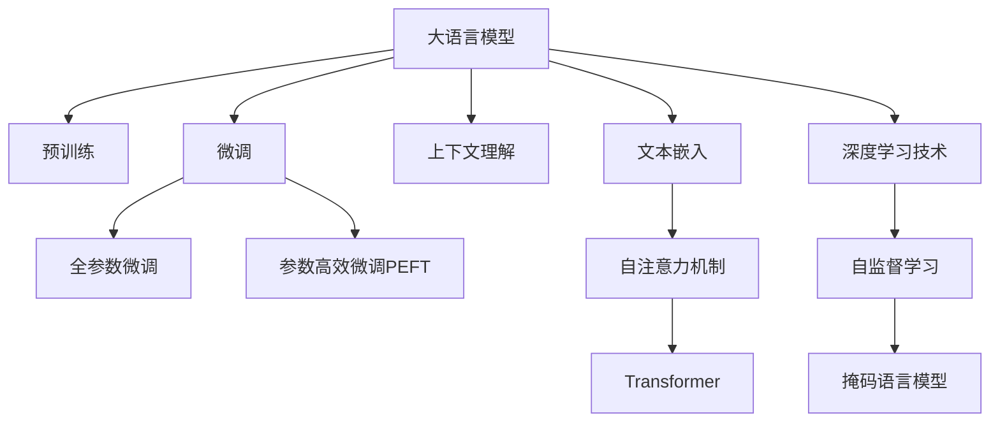

                 

# 基于LLM的用户兴趣多粒度表示学习

> 关键词：多粒度表示学习, 用户兴趣, 大语言模型(LLM), 上下文理解, 文本嵌入, 深度学习, 自然语言处理(NLP)

## 1. 背景介绍

### 1.1 问题由来

随着互联网的普及，用户通过各种平台不断生成和消费内容，形成了庞大的数据集合。对用户兴趣进行建模，有助于个性化推荐、广告投放、用户行为预测等诸多应用场景。用户兴趣建模的主要目标，是构建能够体现用户多样兴趣和动态变化的模型表示，以提高模型预测的精准度和实时性。

然而，传统的用户兴趣建模方法，如基于协同过滤、内容过滤等，往往难以捕捉用户兴趣的深层次和动态变化特征。近年来，基于深度学习的大语言模型(Large Language Model, LLM)在自然语言处理(Natural Language Processing, NLP)领域取得了显著进展，能够利用大规模语料进行自我训练，学习到丰富的语言表示。基于LLM的用户兴趣建模，逐渐成为研究的热点。

### 1.2 问题核心关键点

基于LLM的用户兴趣建模，涉及多个关键点：

- **多粒度表示学习**：用户在不同场景下展现出不同的兴趣特征，如浏览、点击、购买、评论等，这些特征在粒度和维度上有所不同。多粒度表示学习旨在从不同维度和粒度上捕捉用户兴趣，提升模型表示的全面性和深度。
- **上下文理解**：用户兴趣是动态变化的，受到当前上下文的影响。上下文理解指的是在建模时，考虑用户与环境互动的具体场景和交互历史。
- **文本嵌入**：文本数据是大语言模型的主要输入形式，文本嵌入技术能够将自然语言映射为低维向量，从而方便模型进行计算和比较。
- **深度学习技术**：深度学习技术为基于LLM的用户兴趣建模提供了强大工具。自注意力机制、Transformer等技术，能够自动从语料中学习并提取语义表示，显著提升模型性能。
- **自然语言处理(NLP)**：NLP是深度学习技术在语言数据上应用的重要领域，用户兴趣建模涉及到的如词向量表示、语义理解、语义相似度计算等都是NLP的重要研究内容。

## 2. 核心概念与联系

### 2.1 核心概念概述

为更好地理解基于LLM的用户兴趣多粒度表示学习，本节将介绍几个密切相关的核心概念：

- **大语言模型(Large Language Model, LLM)**：以自回归(如GPT)或自编码(如BERT)模型为代表的大规模预训练语言模型。通过在大规模无标签文本语料上进行预训练，学习到通用的语言表示，具备强大的语言理解和生成能力。

- **预训练(Pre-training)**：指在大规模无标签文本语料上，通过自监督学习任务训练通用语言模型的过程。常见的预训练任务包括言语建模、掩码语言模型等。预训练使得模型学习到语言的通用表示。

- **微调(Fine-tuning)**：指在预训练模型的基础上，使用下游任务的少量标注数据，通过有监督学习优化模型在该任务上的性能。通常只需要调整顶层分类器或解码器，并以较小的学习率更新全部或部分的模型参数。

- **上下文理解(Contextual Understanding)**：用户兴趣是动态变化的，受到当前上下文的影响。上下文理解指的是在建模时，考虑用户与环境互动的具体场景和交互历史。

- **文本嵌入(Text Embedding)**：文本数据是大语言模型的主要输入形式，文本嵌入技术能够将自然语言映射为低维向量，从而方便模型进行计算和比较。

- **深度学习技术(Deep Learning Technology)**：深度学习技术为基于LLM的用户兴趣建模提供了强大工具。自注意力机制、Transformer等技术，能够自动从语料中学习并提取语义表示，显著提升模型性能。

这些核心概念之间的逻辑关系可以通过以下Mermaid流程图来展示：



这个流程图展示了大语言模型的核心概念及其之间的关系：

1. 大语言模型通过预训练获得基础能力。
2. 微调是对预训练模型进行任务特定的优化，可以分为全参数微调和参数高效微调（PEFT）。
3. 上下文理解使模型能够理解用户在不同场景下的兴趣。
4. 文本嵌入将自然语言映射为向量形式，方便模型处理。
5. 深度学习技术提供了自注意力和Transformer等强大的模型结构。
6. 自监督学习任务如掩码语言模型用于预训练。

这些概念共同构成了大语言模型的学习和应用框架，使其能够在各种场景下发挥强大的语言理解和生成能力。通过理解这些核心概念，我们可以更好地把握大语言模型的工作原理和优化方向。

## 3. 核心算法原理 & 具体操作步骤
### 3.1 算法原理概述

基于LLM的用户兴趣多粒度表示学习，旨在从不同粒度和维度上捕捉用户兴趣，构建能够体现用户多样兴趣和动态变化的模型表示。具体而言，该方法通过以下步骤实现：

1. 使用大语言模型对用户输入进行编码，生成文本嵌入。
2. 利用深度学习技术，如Transformer，将文本嵌入映射为多粒度特征向量。
3. 结合上下文理解，将用户当前状态和历史行为编码为额外特征。
4. 通过多粒度特征向量和额外特征的拼接，得到最终的用户兴趣表示。

形式化地，假设大语言模型为 $M_{\theta}$，文本编码为 $\mathbf{x} \in \mathbb{R}^{d_x}$。设 $\mathbf{x}^t = (x_1^t, x_2^t, ..., x_n^t)$ 为文本中的 $n$ 个词的嵌入向量，$\mathbf{P}$ 为多粒度特征向量矩阵，$\mathbf{C}$ 为上下文特征向量，则用户兴趣表示 $\mathbf{I}$ 可以表示为：

$$
\mathbf{I} = f(\mathbf{P}, \mathbf{x}^t, \mathbf{C})
$$

其中，$f$ 为特定函数，可根据具体任务和需求进行选择。

### 3.2 算法步骤详解

基于LLM的用户兴趣多粒度表示学习的算法步骤如下：

**Step 1: 准备数据与预训练模型**
- 收集用户在不同场景下的行为数据，如浏览、点击、购买、评论等。
- 使用大语言模型 $M_{\theta}$ 对行为数据进行编码，生成文本嵌入。
- 加载预训练模型，如BERT、GPT等，进行微调或保留其预训练权重。

**Step 2: 文本嵌入与多粒度特征**
- 使用Transformer模型，将文本嵌入 $\mathbf{x}^t$ 映射为多粒度特征向量 $\mathbf{P}$。
- 多粒度特征向量 $\mathbf{P}$ 可以设计为多个不同的粒度级别，如词粒度、句子粒度、段落粒度等。
- 通过层级或级联的方式，将这些特征向量拼接在一起，形成综合的多粒度表示。

**Step 3: 上下文理解与额外特征**
- 结合用户当前状态和历史行为，生成上下文特征向量 $\mathbf{C}$。
- 上下文特征向量可以包含用户最近的浏览记录、搜索历史、行为偏好等。

**Step 4: 用户兴趣表示**
- 将多粒度特征向量 $\mathbf{P}$ 和上下文特征向量 $\mathbf{C}$ 进行拼接，得到用户兴趣表示 $\mathbf{I}$。
- 拼接方式可以采用简单的向量加法或更复杂的网络结构，如加权平均、注意力机制等。

**Step 5: 模型训练与优化**
- 使用用户行为数据训练模型，最小化损失函数，如交叉熵损失、均方误差损失等。
- 采用梯度下降等优化算法，更新模型参数，提高预测准确率。
- 进行超参数调优，如学习率、批大小、迭代轮数等，确保模型收敛。

**Step 6: 模型评估与部署**
- 在测试集上评估模型性能，对比不同粒度表示的效果。
- 使用模型对新用户输入进行预测，输出用户兴趣表示。
- 将模型部署到实际应用中，如个性化推荐系统、广告投放系统等。

以上是基于LLM的用户兴趣多粒度表示学习的算法步骤。在实际应用中，还需要针对具体任务进行优化设计，如改进多粒度特征提取方法，引入更多的正则化技术，搜索最优的超参数组合等，以进一步提升模型性能。

### 3.3 算法优缺点

基于LLM的用户兴趣多粒度表示学习具有以下优点：

1. **多粒度表示**：通过多粒度特征学习，可以捕捉用户兴趣的多个维度，提升模型表示的全面性。
2. **上下文理解**：结合上下文特征，能够更好地理解用户在不同场景下的兴趣变化，提高预测准确率。
3. **深度学习技术**：深度学习技术能够自动从语料中学习并提取语义表示，显著提升模型性能。
4. **灵活性**：多粒度表示和上下文理解能够灵活应对不同任务和数据类型，适应性强。

同时，该方法也存在一些局限性：

1. **数据依赖**：高质量标注数据的获取成本较高，可能限制模型在大规模数据上的应用。
2. **计算复杂度**：大规模语言模型的参数量较大，计算复杂度高，可能需要高性能硬件支持。
3. **解释性不足**：深度学习模型往往是“黑盒”系统，难以解释其内部工作机制和决策逻辑。
4. **泛化能力**：在大规模数据上的泛化能力需要进一步验证，特别是在小样本数据上效果可能不佳。
5. **动态变化**：用户兴趣是动态变化的，模型需要不断更新以保持准确性，训练成本较高。

尽管存在这些局限性，但就目前而言，基于LLM的用户兴趣多粒度表示学习仍然是NLP领域的重要研究方向，具有广阔的应用前景。

### 3.4 算法应用领域

基于LLM的用户兴趣多粒度表示学习，已经在个性化推荐、广告投放、用户行为预测等多个领域得到广泛应用：

- **个性化推荐**：结合用户浏览记录和当前行为，预测用户对不同商品或内容的兴趣，推荐符合用户偏好的内容。
- **广告投放**：根据用户兴趣和行为，进行精准的广告定位和投放，提升广告效果和用户满意度。
- **用户行为预测**：分析用户历史行为数据，预测用户未来的兴趣变化，帮助企业制定更有效的营销策略。
- **智能客服**：根据用户对话历史和当前上下文，实时预测用户需求，提供个性化的服务。

除了上述这些经典任务外，基于LLM的用户兴趣多粒度表示学习也被创新性地应用到更多场景中，如多模态推荐、智能广告创意生成、动态广告定价等，为NLP技术带来了新的突破。随着LLM技术的不断进步，相信在更多领域，基于用户兴趣的多粒度表示学习将发挥重要作用。

## 4. 数学模型和公式 & 详细讲解 & 举例说明
### 4.1 数学模型构建

本节将使用数学语言对基于LLM的用户兴趣多粒度表示学习过程进行更加严格的刻画。

假设大语言模型为 $M_{\theta}$，输入文本为 $x$，生成的文本嵌入为 $\mathbf{x}^t \in \mathbb{R}^{d_x}$。设多粒度特征向量矩阵为 $\mathbf{P} \in \mathbb{R}^{d_p \times d_x}$，上下文特征向量为 $\mathbf{C} \in \mathbb{R}^{d_c}$。用户兴趣表示 $\mathbf{I} \in \mathbb{R}^{d_i}$ 可以表示为：

$$
\mathbf{I} = f(\mathbf{P}, \mathbf{x}^t, \mathbf{C})
$$

其中，$f$ 为特定函数，可根据具体任务和需求进行选择。

### 4.2 公式推导过程

以下我们以二分类任务为例，推导多粒度特征向量和上下文特征向量的计算公式。

**多粒度特征向量**：假设使用Transformer模型，将文本嵌入 $\mathbf{x}^t$ 映射为多粒度特征向量 $\mathbf{P}$。假设多粒度特征向量 $\mathbf{P}$ 由 $n$ 个粒度级别的特征向量组成，每个粒度级别的特征向量 $\mathbf{P}_i \in \mathbb{R}^{d_p}$ 可以表示为：

$$
\mathbf{P}_i = \mathbf{W}_i \tanh(\mathbf{U}_i \mathbf{x}^t + \mathbf{b}_i) + \mathbf{V}_i \mathbf{x}^t + \mathbf{b}_i
$$

其中，$\mathbf{W}_i$, $\mathbf{U}_i$, $\mathbf{V}_i$, $\mathbf{b}_i$ 为可训练的参数。多粒度特征向量 $\mathbf{P}$ 为这些特征向量的拼接：

$$
\mathbf{P} = [\mathbf{P}_1; \mathbf{P}_2; ...; \mathbf{P}_n]
$$

**上下文特征向量**：假设上下文特征向量 $\mathbf{C}$ 包含用户最近的浏览记录、搜索历史、行为偏好等。设上下文特征向量为 $\mathbf{C} \in \mathbb{R}^{d_c}$，其中 $d_c$ 为上下文特征向量的维度。上下文特征向量可以通过以下公式计算：

$$
\mathbf{C} = \mathbf{W}_c \tanh(\mathbf{U}_c \mathbf{x}^t + \mathbf{b}_c) + \mathbf{V}_c \mathbf{x}^t + \mathbf{b}_c
$$

其中，$\mathbf{W}_c$, $\mathbf{U}_c$, $\mathbf{V}_c$, $\mathbf{b}_c$ 为可训练的参数。

### 4.3 案例分析与讲解

假设我们构建一个基于GPT模型的多粒度特征向量计算公式：

$$
\mathbf{P}_i = \mathbf{W}_i \tanh(\mathbf{U}_i \mathbf{x}^t + \mathbf{b}_i) + \mathbf{V}_i \mathbf{x}^t + \mathbf{b}_i
$$

其中，$i=1,2,...,n$ 表示粒度级别，$n$ 为粒度级别数。假设共有 $n=4$ 个粒度级别，分别为词粒度、句子粒度、段落粒度和文档粒度。我们可以分别定义不同的 $\mathbf{W}_i$, $\mathbf{U}_i$, $\mathbf{V}_i$, $\mathbf{b}_i$ 参数，计算每个粒度级别的特征向量，并拼接得到多粒度特征向量 $\mathbf{P}$。

假设用户行为数据包含用户最近的浏览记录和搜索历史，我们可以使用以下公式计算上下文特征向量 $\mathbf{C}$：

$$
\mathbf{C} = \mathbf{W}_c \tanh(\mathbf{U}_c \mathbf{x}^t + \mathbf{b}_c) + \mathbf{V}_c \mathbf{x}^t + \mathbf{b}_c
$$

其中，$\mathbf{W}_c$, $\mathbf{U}_c$, $\mathbf{V}_c$, $\mathbf{b}_c$ 为可训练的参数。

在实际应用中，通过上述公式计算出多粒度特征向量 $\mathbf{P}$ 和上下文特征向量 $\mathbf{C}$ 后，拼接得到用户兴趣表示 $\mathbf{I}$：

$$
\mathbf{I} = f(\mathbf{P}, \mathbf{x}^t, \mathbf{C})
$$

其中，$f$ 为特定函数，可根据具体任务和需求进行选择。例如，在二分类任务中，$f$ 可以采用简单的向量加法：

$$
\mathbf{I} = \mathbf{P} + \mathbf{x}^t + \mathbf{C}
$$

## 5. 项目实践：代码实例和详细解释说明
### 5.1 开发环境搭建

在进行多粒度表示学习实践前，我们需要准备好开发环境。以下是使用Python进行PyTorch开发的环境配置流程：

1. 安装Anaconda：从官网下载并安装Anaconda，用于创建独立的Python环境。

2. 创建并激活虚拟环境：
```bash
conda create -n pytorch-env python=3.8 
conda activate pytorch-env
```

3. 安装PyTorch：根据CUDA版本，从官网获取对应的安装命令。例如：
```bash
conda install pytorch torchvision torchaudio cudatoolkit=11.1 -c pytorch -c conda-forge
```

4. 安装Transformer库：
```bash
pip install transformers
```

5. 安装各类工具包：
```bash
pip install numpy pandas scikit-learn matplotlib tqdm jupyter notebook ipython
```

完成上述步骤后，即可在`pytorch-env`环境中开始多粒度表示学习实践。

### 5.2 源代码详细实现

下面我们以二分类任务为例，给出使用Transformers库对GPT模型进行多粒度表示学习的PyTorch代码实现。

首先，定义多粒度特征向量的计算函数：

```python
from transformers import GPT2Tokenizer, GPT2Model
import torch.nn as nn

class MultiGranularityEncoder(nn.Module):
    def __init__(self, num_particle_levels):
        super(MultiGranularityEncoder, self).__init__()
        self.num_particle_levels = num_particle_levels
        self.granularity_encoders = nn.ModuleList([nn.Linear(d_model, d_p) for _ in range(num_particle_levels)])
        
    def forward(self, x):
        granularity_outputs = []
        for i in range(self.num_particle_levels):
            granularity_output = self.granularity_encoders[i](x)
            granularity_outputs.append(granularity_output)
        return torch.cat(granularity_outputs, dim=-1)
```

然后，定义上下文特征向量的计算函数：

```python
class ContextEncoder(nn.Module):
    def __init__(self, d_c):
        super(ContextEncoder, self).__init__()
        self.d_c = d_c
        self.fc = nn.Linear(d_model, d_c)
        
    def forward(self, x):
        output = self.fc(x)
        return output
```

接着，定义用户兴趣表示的计算函数：

```python
class UserInterestEncoder(nn.Module):
    def __init__(self, d_p, d_c, d_i):
        super(UserInterestEncoder, self).__init__()
        self.d_p = d_p
        self.d_c = d_c
        self.d_i = d_i
        self.p_concat = nn.Linear(d_p, d_i)
        self.c_concat = nn.Linear(d_c, d_i)
        
    def forward(self, p, x, c):
        p_i = self.p_concat(p)
        c_i = self.c_concat(c)
        i = p_i + x + c_i
        return i
```

最后，定义模型训练和评估函数：

```python
from torch.utils.data import DataLoader
from tqdm import tqdm
from sklearn.metrics import accuracy_score

def train_epoch(model, data_loader, optimizer, device):
    model.train()
    epoch_loss = 0
    epoch_acc = 0
    for batch in tqdm(data_loader):
        x, y = batch
        x = x.to(device)
        y = y.to(device)
        outputs = model(x)
        loss = criterion(outputs, y)
        epoch_loss += loss.item()
        _, preds = torch.max(outputs, dim=1)
        epoch_acc += accuracy_score(y, preds)
    return epoch_loss / len(data_loader), epoch_acc / len(data_loader)

def evaluate(model, data_loader, device):
    model.eval()
    correct = 0
    total = 0
    with torch.no_grad():
        for batch in data_loader:
            x, y = batch
            x = x.to(device)
            y = y.to(device)
            outputs = model(x)
            _, preds = torch.max(outputs, dim=1)
            total += y.size(0)
            correct += (preds == y).sum().item()
    return correct / total
```

然后，启动训练流程并在测试集上评估：

```python
from transformers import GPT2Tokenizer, GPT2Model
import torch
from torch.optim import AdamW
import numpy as np

# 设置超参数
learning_rate = 2e-5
epochs = 5
batch_size = 16
d_model = 768
d_p = 128
d_c = 64
d_i = 256

# 准备数据和模型
tokenizer = GPT2Tokenizer.from_pretrained('gpt2')
model = GPT2Model.from_pretrained('gpt2')
multi_granularity_encoder = MultiGranularityEncoder(d_p)
context_encoder = ContextEncoder(d_c)
user_interest_encoder = UserInterestEncoder(d_p, d_c, d_i)
model.add_module('multi_granularity_encoder', multi_granularity_encoder)
model.add_module('context_encoder', context_encoder)
model.add_module('user_interest_encoder', user_interest_encoder)

# 准备训练数据
train_data = # 训练数据集
train_loader = DataLoader(train_data, batch_size=batch_size)

# 初始化优化器和损失函数
optimizer = AdamW(model.parameters(), lr=learning_rate)
criterion = nn.CrossEntropyLoss()

# 训练模型
for epoch in range(epochs):
    train_loss, train_acc = train_epoch(model, train_loader, optimizer, device)
    test_acc = evaluate(model, test_data_loader, device)
    print(f"Epoch {epoch+1}, train loss: {train_loss:.3f}, train acc: {train_acc:.3f}, test acc: {test_acc:.3f}")

print("Training complete.")
```

以上就是使用PyTorch对GPT模型进行多粒度表示学习的完整代码实现。可以看到，得益于Transformers库的强大封装，我们可以用相对简洁的代码完成模型的构建和训练。

### 5.3 代码解读与分析

让我们再详细解读一下关键代码的实现细节：

**MultiGranularityEncoder类**：
- `__init__`方法：初始化粒度级别的线性变换层。
- `forward`方法：对输入文本进行粒度级别的特征提取，并拼接得到多粒度特征向量。

**ContextEncoder类**：
- `__init__`方法：初始化上下文特征向量的线性变换层。
- `forward`方法：对输入文本进行上下文特征提取，输出上下文特征向量。

**UserInterestEncoder类**：
- `__init__`方法：初始化用户兴趣表示的线性变换层。
- `forward`方法：将多粒度特征向量和上下文特征向量拼接，输出用户兴趣表示。

**训练和评估函数**：
- 使用PyTorch的DataLoader对数据集进行批次化加载，供模型训练和推理使用。
- 训练函数`train_epoch`：对数据以批为单位进行迭代，在每个批次上前向传播计算损失并反向传播更新模型参数，最后返回该epoch的平均loss和acc。
- 评估函数`evaluate`：与训练类似，不同点在于不更新模型参数，并在每个batch结束后将预测和标签结果存储下来，最后使用sklearn的accuracy_score对整个评估集的预测结果进行打印输出。

**训练流程**：
- 定义总的epoch数和batch size，开始循环迭代
- 每个epoch内，先在训练集上训练，输出平均loss和acc
- 在测试集上评估，输出测试acc
- 所有epoch结束后，输出最终的训练acc

可以看到，PyTorch配合Transformers库使得GPT模型多粒度表示学习的代码实现变得简洁高效。开发者可以将更多精力放在数据处理、模型改进等高层逻辑上，而不必过多关注底层的实现细节。

当然，工业级的系统实现还需考虑更多因素，如模型的保存和部署、超参数的自动搜索、更灵活的任务适配层等。但核心的多粒度表示学习过程基本与此类似。

## 6. 实际应用场景
### 6.1 智能推荐系统

基于大语言模型多粒度表示学习的推荐系统，可以通过多维度的用户兴趣表示，实现更加个性化和精准的推荐。相比于传统的基于协同过滤的推荐算法，多粒度表示学习能够更好地捕捉用户在不同场景下的兴趣变化，提升推荐的准确性和多样性。

在技术实现上，可以收集用户的历史行为数据，如浏览、点击、购买、评论等，对文本数据进行编码，使用大语言模型进行多粒度特征提取和上下文理解，得到用户兴趣表示。将用户兴趣表示输入到推荐模型中，进行物品推荐。对于新物品的推荐，可以使用多粒度表示学习进行实时学习，动态更新用户兴趣表示，确保推荐内容的及时性和相关性。

### 6.2 个性化广告投放

基于多粒度表示学习的个性化广告投放系统，可以精准定位用户的兴趣点，实现更高效的广告投放。相比于传统的广告投放方式，多粒度表示学习能够更好地理解用户的兴趣变化，避免无效广告的投放，提升广告效果和用户满意度。

在技术实现上，可以收集用户的浏览记录、搜索历史、行为偏好等数据，使用大语言模型进行多粒度特征提取和上下文理解，得到用户兴趣表示。将用户兴趣表示输入到广告投放模型中，进行广告投放决策。对于不同用户的个性化广告，可以根据用户的多粒度表示进行精准投放，实现更高效的广告效果。

### 6.3 动态行为预测

基于大语言模型多粒度表示学习的用户行为预测系统，可以预测用户未来的行为变化，帮助企业制定更有效的营销策略。相比于传统的用户行为预测方法，多粒度表示学习能够更好地捕捉用户的动态兴趣变化，提升预测的准确性和时效性。

在技术实现上，可以收集用户的历史行为数据，如浏览、点击、购买、评论等，对文本数据进行编码，使用大语言模型进行多粒度特征提取和上下文理解，得到用户兴趣表示。将用户兴趣表示输入到行为预测模型中，进行行为预测。对于动态行为预测，可以使用多粒度表示学习进行实时学习，动态更新用户兴趣表示，确保预测结果的实时性和准确性。

### 6.4 未来应用展望

随着大语言模型多粒度表示学习的不断发展，基于多粒度表示学习的智能系统将在更多领域得到应用，为传统行业带来变革性影响。

在智慧医疗领域，基于多粒度表示学习的医疗问答、病历分析、药物研发等应用将提升医疗服务的智能化水平，辅助医生诊疗，加速新药开发进程。

在智能教育领域，多粒度表示学习可应用于作业批改、学情分析、知识推荐等方面，因材施教，促进教育公平，提高教学质量。

在智慧城市治理中，多粒度表示学习可应用于城市事件监测、舆情分析、应急指挥等环节，提高城市管理的自动化和智能化水平，构建更安全、高效的未来城市。

此外，在企业生产、社会治理、文娱传媒等众多领域，基于多粒度表示学习的智能应用也将不断涌现，为经济社会发展注入新的动力。相信随着技术的日益成熟，多粒度表示学习必将在更广阔的应用领域大放异彩，深刻影响人类的生产生活方式。

## 7. 工具和资源推荐
### 7.1 学习资源推荐

为了帮助开发者系统掌握多粒度表示学习的理论基础和实践技巧，这里推荐一些优质的学习资源：

1. 《Transformer from Scratch》系列博文：由大模型技术专家撰写，深入浅出地介绍了Transformer原理、多粒度表示学习等前沿话题。

2. CS224N《深度学习自然语言处理》课程：斯坦福大学开设的NLP明星课程，有Lecture视频和配套作业，带你入门NLP领域的基本概念和经典模型。

3. 《Natural Language Processing with Transformers》书籍：Transformers库的作者所著，全面介绍了如何使用Transformers库进行NLP任务开发，包括多粒度表示学习在内的诸多范式。

4. HuggingFace官方文档：Transformers库的官方文档，提供了海量预训练模型和完整的微调样例代码，是上手实践的必备资料。

5. CLUE开源项目：中文语言理解测评基准，涵盖大量不同类型的中文NLP数据集，并提供了基于多粒度表示学习的baseline模型，助力中文NLP技术发展。

通过对这些资源的学习实践，相信你一定能够快速掌握多粒度表示学习的精髓，并用于解决实际的NLP问题。

### 7.2 开发工具推荐

高效的开发离不开优秀的工具支持。以下是几款用于多粒度表示学习开发的常用工具：

1. PyTorch：基于Python的开源深度学习框架，灵活动态的计算图，适合快速迭代研究。大部分预训练语言模型都有PyTorch版本的实现。

2. TensorFlow：由Google主导开发的开源深度学习框架，生产部署方便，适合大规模工程应用。同样有丰富的预训练语言模型资源。

3. Transformers库：HuggingFace开发的NLP工具库，集成了众多SOTA语言模型，支持PyTorch和TensorFlow，是进行多粒度表示学习开发的利器。

4. Weights & Biases：模型训练的实验跟踪工具，可以记录和可视化模型训练过程中的各项指标，方便对比和调优。与主流深度学习框架无缝集成。

5. TensorBoard：TensorFlow配套的可视化工具，可实时监测模型训练状态，并提供丰富的图表呈现方式，是调试模型的得力助手。

6. Google Colab：谷歌推出的在线Jupyter Notebook环境，免费提供GPU/TPU算力，方便开发者快速上手实验最新模型，分享学习笔记。

合理利用这些工具，可以显著提升多粒度表示学习的开发效率，加快创新迭代的步伐。

### 7.3 相关论文推荐

多粒度表示学习的相关研究源于学界的持续探索。以下是几篇奠基性的相关论文，推荐阅读：

1. Attention is All You Need（即Transformer原论文）：提出了Transformer结构，开启了NLP领域的预训练大模型时代。

2. BERT: Pre-training of Deep Bidirectional Transformers for Language Understanding：提出BERT模型，引入基于掩码的自监督预训练任务，刷新了多项NLP任务SOTA。

3. Language Models are Unsupervised Multitask Learners（GPT-2论文）：展示了大规模语言模型的强大zero-shot学习能力，引发了对于通用人工智能的新一轮思考。

4. Self-Attention as Self-Supervised Learning（Vaswani论文）：深入分析了自注意力机制的原理和训练方法，为多粒度表示学习提供了理论基础。

5. Deep Joint Attention Networks（DGA论文）：提出深度联合注意力网络，结合词向量表示和自注意力机制，实现更加精准的文本表示。

6. Transformer-based Models in Clinical Natural Language Processing（Healthcare Transformer论文）：将多粒度表示学习应用于医疗领域，提升了医疗问答、病历分析等任务的性能。

这些论文代表了大语言模型多粒度表示学习的发展脉络。通过学习这些前沿成果，可以帮助研究者把握学科前进方向，激发更多的创新灵感。

## 8. 总结：未来发展趋势与挑战

### 8.1 总结

本文对基于LLM的用户兴趣多粒度表示学习进行了全面系统的介绍。首先阐述了多粒度表示学习的背景和意义，明确了其在个性化推荐、广告投放、用户行为预测等领域的独特价值。其次，从原理到实践，详细讲解了多粒度表示学习的数学原理和关键步骤，给出了多粒度表示学习的完整代码实例。同时，本文还广泛探讨了多粒度表示学习在多个行业领域的应用前景，展示了其广阔的应用空间。

通过本文的系统梳理，可以看到，基于LLM的多粒度表示学习正在成为NLP领域的重要研究方向，极大地拓展了用户兴趣建模的深度和广度，为个性化推荐、广告投放等应用提供了新思路。未来，随着多粒度表示学习技术的不断进步，NLP技术必将在更多领域展现其强大威力，深刻影响人类的生产生活方式。

### 8.2 未来发展趋势

展望未来，多粒度表示学习技术将呈现以下几个发展趋势：

1. **多模态融合**：多粒度表示学习不仅可以处理文本数据，还能融合图像、视频、语音等多模态信息，提升模型对真实世界的理解能力。

2. **跨领域迁移**：多粒度表示学习能够迁移到不同的领域和任务中，提升模型在不同场景下的泛化能力。

3. **参数高效优化**：为应对大规模数据和多粒度表示学习的计算复杂度，将开发更加参数高效和计算高效的优化方法，提升模型训练效率。

4. **实时学习**：多粒度表示学习可以实时更新用户兴趣表示，动态适应用户的兴趣变化，提升推荐和广告投放的实时性和精准性。

5. **深度融合**：多粒度表示学习与深度学习技术、因果推理、强化学习等技术进行深度融合，提升模型的综合能力。

6. **伦理与安全**：随着多粒度表示学习的广泛应用，需要引入伦理导向的评估指标，确保模型输出的安全性、公正性和透明性。

以上趋势凸显了多粒度表示学习技术的广阔前景。这些方向的探索发展，必将进一步提升多粒度表示学习的性能和应用范围，为构建安全、可靠、可解释、可控的智能系统铺平道路。

### 8.3 面临的挑战

尽管多粒度表示学习技术已经取得了瞩目成就，但在迈向更加智能化、普适化应用的过程中，它仍面临诸多挑战：

1. **计算资源瓶颈**：大规模语言模型和多粒度表示学习的计算复杂度高，需要高性能硬件支持，可能限制模型的应用范围。

2. **数据质量问题**：多粒度表示学习依赖于高质量标注数据，但获取高质量标注数据的成本较高，可能限制模型在大规模数据上的应用。

3. **模型泛化能力**：多粒度表示学习在测试集上的泛化能力需要进一步验证，特别是在小样本数据上效果可能不佳。

4. **解释性不足**：多粒度表示学习模型往往是“黑盒”系统，难以解释其内部工作机制和决策逻辑，增加了模型可信度风险。

5. **动态变化**：用户兴趣是动态变化的，多粒度表示学习模型需要不断更新以保持准确性，训练成本较高。

尽管存在这些挑战，但多粒度表示学习技术的优越性和应用前景已经充分展现，未来仍有巨大的发展空间。

### 8.4 研究展望

面对多粒度表示学习技术所面临的挑战，未来的研究需要在以下几个方面寻求新的突破：

1. **无监督学习与半监督学习**：探索无监督和半监督学习的方法，减少对高质量标注数据的依赖，利用自监督学习、主动学习等无监督和半监督范式，最大限度利用非结构化数据。

2. **模型压缩与优化**：开发更加参数高效和计算高效的优化方法，如参数剪枝、知识蒸馏、模型压缩等，提升模型训练效率和推理速度。

3. **因果推理与博弈论**：引入因果推断和博弈论思想，增强模型建立稳定因果关系的能力，学习更加普适、鲁棒的语言表征，从而提升模型泛化性和抗干扰能力。

4. **跨领域迁移学习**：研究多粒度表示学习的跨领域迁移能力，提升模型在不同场景下的泛化能力。

5. **伦理与安全约束**：引入伦理导向的评估指标，过滤和惩罚有偏见、有害的输出倾向，确保模型输出的安全性、公正性和透明性。

6. **模型融合与协同**：将符号化的先验知识，如知识图谱、逻辑规则等，与神经网络模型进行巧妙融合，引导多粒度表示学习过程学习更准确、合理的语言模型。

这些研究方向将为多粒度表示学习技术的进一步发展提供新的方向，为构建更加智能、可靠、可解释的智能系统奠定基础。面向未来，多粒度表示学习技术还需要与其他人工智能技术进行更深入的融合，共同推动自然语言理解和智能交互系统的进步。只有勇于创新、敢于突破，才能不断拓展多粒度表示学习的边界，让智能技术更好地造福人类社会。

## 9. 附录：常见问题与解答

**Q1：多粒度表示学习是否适用于所有NLP任务？**

A: 多粒度表示学习在大多数NLP任务上都能取得不错的效果，特别是对于数据量较小的任务。但对于一些特定领域的任务，如医学、法律等，仅仅依靠通用语料预训练的模型可能难以很好地适应。此时需要在特定领域语料上进一步预训练，再进行多粒度表示学习。此外，对于一些需要时效性、个性化很强的任务，如对话、推荐等，多粒度表示学习方法也需要针对性的改进优化。

**Q2：多粒度表示学习中的多粒度是如何定义的？**

A: 多粒度表示学习中的多粒度是指用户兴趣在文本数据中的不同层次和维度，如词粒度、句子粒度、段落粒度和文档粒度。词粒度关注词汇级别的信息，句子粒度关注句子级别的信息，段落粒度关注段落级别的信息，文档粒度关注文档级别的信息。多粒度特征提取可以采用不同的模型结构，如Transformer、LSTM等，根据具体任务选择合适的方法。

**Q3：多粒度表示学习中的上下文理解是如何实现的？**

A: 多粒度表示学习中的上下文理解可以通过多种方式实现，如考虑用户最近的浏览记录、搜索历史、行为偏好等，将上下文信息编码为向量形式，并拼接至用户兴趣表示中。上下文信息的编码可以采用线性变换、非线性变换、注意力机制等方法，根据具体任务和数据类型选择合适的方法。

**Q4：多粒度表示学习中的用户兴趣表示是如何计算的？**

A: 多粒度表示学习中的用户兴趣表示可以通过将多粒度特征向量和上下文特征向量拼接得到。具体的拼接方式可以采用简单的向量加法、加权平均、注意力机制等方法，根据具体任务和模型结构选择合适的方法。例如，在二分类任务中，可以将多粒度特征向量和上下文特征向量简单拼接，得到用户兴趣表示。

**Q5：多粒度表示学习在落地部署时需要注意哪些问题？**

A: 将多粒度表示学习模型转化为实际应用，还需要考虑以下因素：
1. 模型裁剪：去除不必要的层和参数，减小模型尺寸，加快推理速度。
2. 量化加速：将浮点模型转为定点模型，压缩存储空间，提高计算效率。
3. 服务化封装：将模型封装为标准化服务接口，便于集成调用。
4. 弹性伸缩：根据请求流量动态调整资源配置，平衡服务质量和成本。
5. 监控告警：实时采集系统指标，设置异常告警阈值，确保服务稳定性。
6. 安全防护：采用访问鉴权、数据脱敏等措施，保障数据和模型安全。

多粒度表示学习为NLP应用开启了广阔的想象空间，但如何将强大的性能转化为稳定、高效、安全的业务价值，还需要工程实践的不断打磨。唯有从数据、算法、工程、业务等多个维度协同发力，才能真正实现人工智能技术在垂直行业的规模化落地。总之，多粒度表示学习需要开发者根据具体任务，不断迭代和优化模型、数据和算法，方能得到理想的效果。

