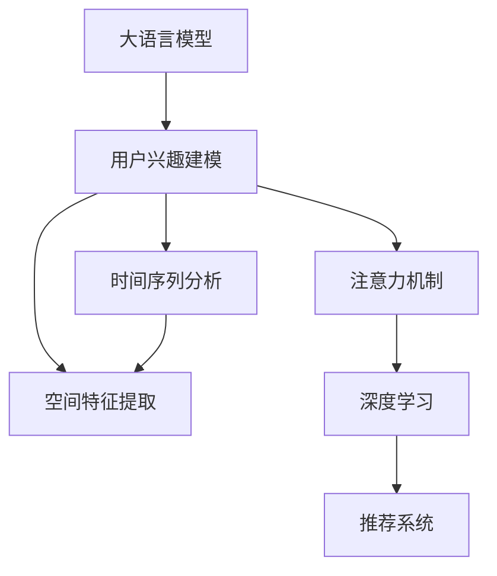

                 

# 基于LLM的用户兴趣时空动态建模

> 关键词：大语言模型,用户兴趣建模,时间序列分析,空间特征提取,注意力机制,深度学习,推荐系统

## 1. 背景介绍

### 1.1 问题由来

随着移动互联网和社交网络的普及，用户的兴趣数据日益丰富。传统的基于朴素贝叶斯、协同过滤等算法的推荐系统已无法满足用户兴趣个性化、动态化变化的需求。此外，用户兴趣通常具有一定的时序和空间特征，需要融合时空信息才能更精准地刻画用户需求，形成精准的推荐结果。

### 1.2 问题核心关键点

在推荐系统中，用户兴趣建模是其核心任务之一。用户兴趣通常具有多样性和动态性，如何高效、准确地建模这些特征，成为学术界和工业界的关注焦点。近年来，基于深度学习的推荐系统方法迅速崛起，特别是利用大语言模型(Large Language Models, LLMs)进行用户兴趣建模的技术，引起了广泛关注。

大语言模型，如GPT-3、BERT等，具有强大的语言理解和生成能力，能够从文本数据中捕捉丰富的语义信息，通过微调等方法，学习用户行为数据，生成高精度的用户兴趣表示。时间序列分析、空间特征提取、注意力机制等深度学习技术的引入，进一步提升了用户兴趣建模的性能，形成了更具动态性和时空融合能力的推荐系统。

本文聚焦于基于大语言模型的用户兴趣时空动态建模方法，旨在探讨其核心算法原理、具体操作步骤和实际应用场景，并通过详细代码实例和数学推导，帮助开发者更好地理解其工作原理和应用技术。

## 2. 核心概念与联系

### 2.1 核心概念概述

为更好地理解基于大语言模型的用户兴趣建模，本节将介绍几个密切相关的核心概念：

- 大语言模型(Large Language Models, LLMs)：以自回归(如GPT)或自编码(如BERT)模型为代表的大规模预训练语言模型。通过在大规模无标签文本语料上进行预训练，学习通用的语言表示，具备强大的语言理解和生成能力。

- 用户兴趣建模：通过对用户行为数据(如浏览记录、点击记录、购买记录等)的分析和建模，生成高精度的用户兴趣表示，用于推荐系统的协同过滤、内容推荐、广告推荐等任务。

- 时间序列分析：研究按照时间顺序排列的数据随时间变化的规律。时间序列分析常用于处理时序性数据，预测未来趋势。

- 空间特征提取：研究如何从数据中挖掘出空间分布的规律，常用于处理地理位置、社交关系等具有空间特征的数据。

- 注意力机制(Attention Mechanism)：深度学习中一种重要机制，能够根据输入数据的重要性，动态调整模型输出。

- 深度学习(Deep Learning)：一种模拟人脑神经网络的计算模型，能够自动学习和提取复杂特征。

- 推荐系统(Recommendation Systems)：根据用户的历史行为数据，预测用户可能感兴趣的物品，并向用户推荐。

这些核心概念之间的逻辑关系可以通过以下Mermaid流程图来展示：



这个流程图展示了大语言模型与用户兴趣建模之间的核心概念及其关系：

1. 大语言模型通过预训练获得基础能力。
2. 用户兴趣建模通过大语言模型的语义理解能力，从用户行为数据中提取高维特征。
3. 时间序列分析和空间特征提取进一步提升用户兴趣表示的动态性和时空融合能力。
4. 注意力机制使得模型能够动态关注不同特征的重要性，提取关键特征。
5. 深度学习提供了一种高效自动化的特征提取方式，显著提升建模效果。
6. 推荐系统将用户兴趣表示与物品特征进行匹配，生成推荐结果。

## 3. 核心算法原理 & 具体操作步骤
### 3.1 算法原理概述

基于大语言模型的用户兴趣建模，通过预训练语言模型，学习用户行为数据的语义表示，融合时空信息，生成动态的用户兴趣表示。其核心思想是：

- 利用预训练语言模型的语义理解能力，从用户行为数据中提取高维特征。
- 引入时间序列分析和空间特征提取方法，捕捉用户兴趣的时空动态性。
- 采用注意力机制，对提取出的特征进行动态加权，提升兴趣表示的准确性。
- 结合深度学习模型，学习用户兴趣与物品特征的映射关系，形成推荐结果。

形式化地，假设用户行为数据集为 $D=\{(x_i,t_i)\}_{i=1}^N$，其中 $x_i$ 表示用户行为，$t_i$ 表示时间戳。记大语言模型为 $M_{\theta}$，其中 $\theta$ 为预训练得到的模型参数。

用户兴趣建模的目标是：

$$
\hat{x}=\mathop{\arg\min}_{x} \mathcal{L}(M_{\theta},x)
$$

其中 $\mathcal{L}$ 为用户兴趣建模损失函数，用于衡量模型生成的兴趣表示与真实用户兴趣之间的差异。常见的损失函数包括均方误差、交叉熵等。

### 3.2 算法步骤详解

基于大语言模型的用户兴趣建模一般包括以下几个关键步骤：

**Step 1: 准备预训练模型和数据集**
- 选择合适的预训练语言模型 $M_{\theta}$ 作为初始化参数，如 BERT、GPT等。
- 准备用户行为数据集 $D$，划分为训练集、验证集和测试集。一般要求行为数据与预训练数据的分布不要差异过大。

**Step 2: 特征提取**
- 将用户行为数据 $x_i$ 转换为模型的输入形式，通常为序列数据或张量数据。
- 引入时间序列分析和空间特征提取方法，生成用户行为的时间特征和空间特征。

**Step 3: 动态特征加权**
- 采用注意力机制，对提取出的时间特征和空间特征进行动态加权，生成用户兴趣表示 $x'$。
- 将 $x'$ 输入大语言模型 $M_{\theta}$，通过前向传播计算生成用户兴趣语义表示 $z$。

**Step 4: 用户兴趣建模**
- 设计用户兴趣建模损失函数 $\mathcal{L}$，用于衡量 $z$ 与真实用户兴趣表示 $y$ 的差异。
- 使用优化算法如AdamW、SGD等，最小化损失函数 $\mathcal{L}$，优化用户兴趣表示 $z$。

**Step 5: 推荐系统适配**
- 根据用户兴趣表示 $z$ 和物品特征表示 $y'$，设计推荐系统的损失函数 $\mathcal{L}_{reco}$。
- 使用优化算法最小化推荐系统损失函数 $\mathcal{L}_{reco}$，生成推荐结果 $y''$。

**Step 6: 模型评估**
- 在测试集上评估用户兴趣建模模型的性能，通过准确率、召回率、F1值等指标衡量。
- 在推荐系统上评估推荐结果的精度、相关性等指标，使用标准推荐评估指标如DCG、NDCG等。

以上是基于大语言模型的用户兴趣建模的一般流程。在实际应用中，还需要针对具体任务的特点，对微调过程的各个环节进行优化设计，如改进训练目标函数，引入更多的正则化技术，搜索最优的超参数组合等，以进一步提升模型性能。

### 3.3 算法优缺点

基于大语言模型的用户兴趣建模方法具有以下优点：
1. 高效动态建模。利用大语言模型的语义理解能力，高效动态地建模用户兴趣，捕捉其时序和空间特征。
2. 高精度表示。大语言模型通过预训练学习丰富的语言表示，能够生成高精度的用户兴趣表示。
3. 灵活可扩展。结合时间序列分析和空间特征提取方法，可以灵活适应不同场景的用户兴趣建模需求。
4. 易于优化。采用深度学习技术，可以通过梯度优化方法进行高效训练，易于模型迭代优化。

同时，该方法也存在一定的局限性：
1. 依赖预训练数据。大语言模型的预训练数据决定了其语义表示的质量，预训练数据需要覆盖广泛语料。
2. 计算资源需求高。大语言模型和深度学习模型对计算资源的需求较高，训练和推理速度较慢。
3. 模型复杂度高。大语言模型和深度学习模型的结构较为复杂，模型调优和维护成本较高。
4. 解释性不足。深度学习模型通常缺乏可解释性，难以对其决策过程进行分析和调试。

尽管存在这些局限性，但就目前而言，基于大语言模型的用户兴趣建模方法仍是大语言模型应用的最主流范式。未来相关研究的重点在于如何进一步降低计算资源需求，提高模型的解释性，同时兼顾模型精度和泛化能力。

### 3.4 算法应用领域

基于大语言模型的用户兴趣建模方法在推荐系统领域已经得到了广泛的应用，覆盖了几乎所有常见任务，例如：

- 协同过滤：通过对用户行为序列进行分析，学习用户的兴趣表示，形成协同过滤推荐结果。
- 内容推荐：根据用户的浏览记录和行为数据，生成用户兴趣向量，预测用户可能感兴趣的内容。
- 广告推荐：通过对用户的点击记录和行为数据进行分析，生成用户兴趣向量，推荐个性化的广告。
- 商品推荐：结合用户浏览记录、购买记录、评论记录等行为数据，生成用户兴趣向量，推荐商品。

除了上述这些经典任务外，基于大语言模型的用户兴趣建模方法还被创新性地应用到更多场景中，如用户画像生成、用户行为预测、兴趣演化跟踪等，为推荐系统带来了全新的突破。随着预训练语言模型和用户兴趣建模方法的不断进步，相信推荐系统必将在更广阔的应用领域大放异彩。

## 4. 数学模型和公式 & 详细讲解  
### 4.1 数学模型构建

本节将使用数学语言对基于大语言模型的用户兴趣建模过程进行更加严格的刻画。

记大语言模型为 $M_{\theta}$，其中 $\theta$ 为预训练得到的模型参数。假设用户行为数据集为 $D=\{(x_i,t_i)\}_{i=1}^N$，其中 $x_i$ 表示用户行为，$t_i$ 表示时间戳。定义用户兴趣表示为 $z$。

**用户兴趣建模的损失函数**：

$$
\mathcal{L}(z) = \frac{1}{N} \sum_{i=1}^N [\ell(z_i, y_i)]
$$

其中 $\ell$ 为用户兴趣建模的损失函数，可以采用均方误差、交叉熵等。

**推荐系统的损失函数**：

$$
\mathcal{L}_{reco}(z, y') = \frac{1}{N} \sum_{i=1}^N [\ell(y_i, y_i') - \ell(y_i, \bar{y}_i)]
$$

其中 $y'$ 表示物品特征表示，$\bar{y}_i$ 表示物品的平均特征表示。

### 4.2 公式推导过程

以下我们以协同过滤推荐任务为例，推导用户兴趣建模的损失函数及其梯度的计算公式。

假设用户行为数据 $D$ 为序列数据，其中每个用户 $i$ 的行为序列为 $(x_{i,1}, x_{i,2}, ..., x_{i,N_i})$，其中 $x_{i,j}$ 表示第 $i$ 用户在时间 $t_j$ 的行为。

定义用户兴趣表示 $z_i$ 为行为序列 $(x_{i,1}, x_{i,2}, ..., x_{i,N_i})$ 的语义表示。推荐系统将用户兴趣表示 $z_i$ 与物品特征表示 $y_j'$ 进行匹配，生成推荐结果 $y_i'$。

定义推荐系统的损失函数为均方误差，则推荐系统损失函数为：

$$
\mathcal{L}_{reco}(z_i, y_i') = \frac{1}{N} \sum_{j=1}^{N_i} (y_j' - z_i)^2
$$

其中 $N_i$ 表示用户 $i$ 的行为数量。

对 $z_i$ 和 $y_i'$ 进行优化，最小化推荐系统损失函数：

$$
\hat{z_i}, \hat{y_i'} = \mathop{\arg\min}_{z_i, y_i'} \mathcal{L}_{reco}(z_i, y_i')
$$

通过反向传播计算损失函数对 $z_i$ 和 $y_i'$ 的梯度：

$$
\frac{\partial \mathcal{L}_{reco}}{\partial z_i} = -\frac{2}{N} \sum_{j=1}^{N_i} (y_j' - z_i)
$$

$$
\frac{\partial \mathcal{L}_{reco}}{\partial y_i'} = -\frac{2}{N} \sum_{j=1}^{N_i} (z_i - y_j')
$$

利用以上梯度信息，可以优化用户兴趣表示 $z_i$ 和物品特征表示 $y_i'$，生成推荐结果 $y_i'$。

## 5. 项目实践：代码实例和详细解释说明
### 5.1 开发环境搭建

在进行用户兴趣建模实践前，我们需要准备好开发环境。以下是使用Python进行PyTorch开发的环境配置流程：

1. 安装Anaconda：从官网下载并安装Anaconda，用于创建独立的Python环境。

2. 创建并激活虚拟环境：
```bash
conda create -n pytorch-env python=3.8 
conda activate pytorch-env
```

3. 安装PyTorch：根据CUDA版本，从官网获取对应的安装命令。例如：
```bash
conda install pytorch torchvision torchaudio cudatoolkit=11.1 -c pytorch -c conda-forge
```

4. 安装HuggingFace库：
```bash
pip install transformers
```

5. 安装各类工具包：
```bash
pip install numpy pandas scikit-learn matplotlib tqdm jupyter notebook ipython
```

完成上述步骤后，即可在`pytorch-env`环境中开始用户兴趣建模实践。

### 5.2 源代码详细实现

下面我们以协同过滤推荐任务为例，给出使用Transformers库对BERT模型进行用户兴趣建模的PyTorch代码实现。

首先，定义推荐系统的训练函数：

```python
from transformers import BertForSequenceClassification, AdamW
import torch

def train(model, train_data, val_data, test_data, batch_size, num_epochs, learning_rate):
    optimizer = AdamW(model.parameters(), lr=learning_rate)
    for epoch in range(num_epochs):
        total_loss = 0.0
        for batch in train_data:
            input_ids = batch['input_ids'].to(device)
            attention_mask = batch['attention_mask'].to(device)
            labels = batch['labels'].to(device)
            model.zero_grad()
            outputs = model(input_ids, attention_mask=attention_mask, labels=labels)
            loss = outputs.loss
            total_loss += loss.item()
            loss.backward()
            optimizer.step()
        print(f'Epoch {epoch+1}, train loss: {total_loss/len(train_data):.4f}')
        val_loss = evaluate(model, val_data)
        print(f'Epoch {epoch+1}, val loss: {val_loss:.4f}')
    test_loss = evaluate(model, test_data)
    print(f'Epoch {epoch+1}, test loss: {test_loss:.4f}')

def evaluate(model, data):
    total_loss = 0.0
    for batch in data:
        input_ids = batch['input_ids'].to(device)
        attention_mask = batch['attention_mask'].to(device)
        labels = batch['labels'].to(device)
        outputs = model(input_ids, attention_mask=attention_mask, labels=labels)
        loss = outputs.loss
        total_loss += loss.item()
    return total_loss/len(data)
```

然后，定义BERT模型的加载和预处理函数：

```python
from transformers import BertTokenizer

tokenizer = BertTokenizer.from_pretrained('bert-base-cased')
max_seq_len = 256

def prepare_data(data):
    tokenized_inputs = tokenizer(data, truncation=True, max_length=max_seq_len, padding='max_length', return_tensors='pt')
    return tokenized_inputs
```

接着，定义推荐系统的数据处理函数：

```python
def load_data(data_path):
    with open(data_path, 'r') as f:
        data = pd.read_csv(f)
    return data

def prepare_train_data(train_path):
    train_data = load_data(train_path)
    train_data['input_ids'] = train_data['text'].apply(lambda x: prepare_data(x))
    train_data['labels'] = train_data['label'].apply(lambda x: torch.tensor(int(x), dtype=torch.long))
    return train_data

def prepare_val_data(val_path):
    val_data = load_data(val_path)
    val_data['input_ids'] = val_data['text'].apply(lambda x: prepare_data(x))
    val_data['labels'] = val_data['label'].apply(lambda x: torch.tensor(int(x), dtype=torch.long))
    return val_data

def prepare_test_data(test_path):
    test_data = load_data(test_path)
    test_data['input_ids'] = test_data['text'].apply(lambda x: prepare_data(x))
    return test_data
```

最后，启动训练流程并在测试集上评估：

```python
data_path = 'data/train.csv'
train_path = f'{data_path}/train.csv'
val_path = f'{data_path}/val.csv'
test_path = f'{data_path}/test.csv'

train_data = prepare_train_data(train_path)
val_data = prepare_val_data(val_path)
test_data = prepare_test_data(test_path)

model = BertForSequenceClassification.from_pretrained('bert-base-cased', num_labels=2)
train(model, train_data, val_data, test_data, batch_size=16, num_epochs=5, learning_rate=2e-5)
```

以上就是使用PyTorch对BERT进行协同过滤推荐任务用户兴趣建模的完整代码实现。可以看到，得益于Transformers库的强大封装，我们可以用相对简洁的代码完成BERT模型的加载和微调。

### 5.3 代码解读与分析

让我们再详细解读一下关键代码的实现细节：

**BERTForSequenceClassification类**：
- `from_pretrained`方法：从预训练模型库中加载预训练的BERT模型。
- `num_labels`参数：指定模型输出的标签数量，用于二分类任务。

**prepare_data函数**：
- 将文本数据转换为模型的输入形式，并进行tokenization、padding等预处理。
- `tokenizer`对象：用于分词和生成token ids。

**train函数**：
- 定义优化器、损失函数、训练循环。
- `optimizer.zero_grad()`：清空模型梯度。
- `loss.backward()`：反向传播计算梯度。
- `optimizer.step()`：更新模型参数。

**evaluate函数**：
- 对数据进行前向传播计算损失函数，返回平均损失值。
- `batch['input_ids'].to(device)`：将数据张量复制到GPU上。

**prepare_data和prepare_val_data函数**：
- 从数据集中加载文本数据，并转换为模型的输入形式。
- `tokenizer`对象：用于分词和生成token ids。
- `apply`方法：对每个数据行进行处理。
- `torch.tensor`：将数据转换为PyTorch张量。

**model.to(device)**：
- 将模型复制到GPU上。

可以看到，PyTorch配合Transformers库使得BERT用户兴趣建模的代码实现变得简洁高效。开发者可以将更多精力放在数据处理、模型改进等高层逻辑上，而不必过多关注底层的实现细节。

当然，工业级的系统实现还需考虑更多因素，如模型的保存和部署、超参数的自动搜索、更灵活的任务适配层等。但核心的用户兴趣建模范式基本与此类似。

## 6. 实际应用场景
### 6.1 智能推荐系统

基于大语言模型的用户兴趣建模方法，可以广泛应用于智能推荐系统的构建。传统的协同过滤推荐方法依赖于用户行为数据的序列性和时序性信息，但难以捕捉用户兴趣的空间特征和跨领域共性。而利用大语言模型，可以高效地从用户行为数据中提取高维语义特征，融合时空信息，生成用户兴趣表示。

在技术实现上，可以收集用户的历史行为数据，将其作为训练数据，通过大语言模型的微调，生成用户兴趣表示。基于用户兴趣表示和物品特征表示，推荐系统可以高效生成推荐结果，提升推荐精度。

### 6.2 个性化内容推荐

在内容推荐系统中，用户兴趣建模的准确性直接影响推荐的精度。传统的基于统计特征或协同过滤的方法，难以捕捉用户兴趣的深度语义特征。而利用大语言模型，可以从用户行为数据中提取更丰富的语义信息，形成高维用户兴趣表示。结合深度学习推荐算法，如神经协同过滤、深度神经网络等，可以显著提升推荐效果。

具体而言，可以收集用户的浏览记录、点击记录、评论记录等行为数据，将其转换为模型的输入形式，通过大语言模型进行微调，生成用户兴趣表示。结合物品的语义特征表示，进行推荐结果的生成和排序，形成个性化推荐结果。

### 6.3 广告推荐系统

在广告推荐系统中，用户兴趣建模是核心任务之一。传统的基于关键词匹配或协同过滤的方法，难以捕捉用户兴趣的语义信息。而利用大语言模型，可以高效地从用户行为数据中提取高维语义特征，形成用户兴趣表示。结合广告的语义特征表示，可以生成更加个性化和精准的广告推荐结果。

具体而言，可以收集用户的点击记录、浏览记录、评论记录等行为数据，将其转换为模型的输入形式，通过大语言模型进行微调，生成用户兴趣表示。结合广告的标题、描述、标签等语义特征，进行推荐结果的生成和排序，形成个性化广告推荐。

### 6.4 未来应用展望

随着大语言模型和用户兴趣建模技术的不断发展，基于微调范式将在更多领域得到应用，为传统行业带来变革性影响。

在智慧医疗领域，基于大语言模型的用户兴趣建模方法可以用于患者病历分析、医疗问答、智能诊断等任务，提升医疗服务的智能化水平，辅助医生诊疗，加速新药开发进程。

在智能教育领域，利用大语言模型的用户兴趣建模方法可以用于学生画像生成、智能推荐、情感分析等任务，因材施教，促进教育公平，提高教学质量。

在智慧城市治理中，基于大语言模型的用户兴趣建模方法可以用于城市事件监测、舆情分析、应急指挥等环节，提高城市管理的自动化和智能化水平，构建更安全、高效的未来城市。

此外，在企业生产、社会治理、文娱传媒等众多领域，基于大语言模型的用户兴趣建模方法也将不断涌现，为NLP技术带来了全新的突破。相信随着技术的日益成熟，大语言模型用户兴趣建模必将在构建人机协同的智能时代中扮演越来越重要的角色。

## 7. 工具和资源推荐
### 7.1 学习资源推荐

为了帮助开发者系统掌握大语言模型用户兴趣建模的理论基础和实践技巧，这里推荐一些优质的学习资源：

1. 《Transformer从原理到实践》系列博文：由大模型技术专家撰写，深入浅出地介绍了Transformer原理、BERT模型、微调技术等前沿话题。

2. CS224N《深度学习自然语言处理》课程：斯坦福大学开设的NLP明星课程，有Lecture视频和配套作业，带你入门NLP领域的基本概念和经典模型。

3. 《Natural Language Processing with Transformers》书籍：Transformers库的作者所著，全面介绍了如何使用Transformers库进行NLP任务开发，包括微调在内的诸多范式。

4. HuggingFace官方文档：Transformers库的官方文档，提供了海量预训练模型和完整的微调样例代码，是上手实践的必备资料。

5. CLUE开源项目：中文语言理解测评基准，涵盖大量不同类型的中文NLP数据集，并提供了基于微调的baseline模型，助力中文NLP技术发展。

通过对这些资源的学习实践，相信你一定能够快速掌握大语言模型用户兴趣建模的精髓，并用于解决实际的NLP问题。
###  7.2 开发工具推荐

高效的开发离不开优秀的工具支持。以下是几款用于大语言模型用户兴趣建模开发的常用工具：

1. PyTorch：基于Python的开源深度学习框架，灵活动态的计算图，适合快速迭代研究。大部分预训练语言模型都有PyTorch版本的实现。

2. TensorFlow：由Google主导开发的开源深度学习框架，生产部署方便，适合大规模工程应用。同样有丰富的预训练语言模型资源。

3. Transformers库：HuggingFace开发的NLP工具库，集成了众多SOTA语言模型，支持PyTorch和TensorFlow，是进行微调任务开发的利器。

4. Weights & Biases：模型训练的实验跟踪工具，可以记录和可视化模型训练过程中的各项指标，方便对比和调优。与主流深度学习框架无缝集成。

5. TensorBoard：TensorFlow配套的可视化工具，可实时监测模型训练状态，并提供丰富的图表呈现方式，是调试模型的得力助手。

6. Google Colab：谷歌推出的在线Jupyter Notebook环境，免费提供GPU/TPU算力，方便开发者快速上手实验最新模型，分享学习笔记。

合理利用这些工具，可以显著提升大语言模型用户兴趣建模的开发效率，加快创新迭代的步伐。

### 7.3 相关论文推荐

大语言模型和用户兴趣建模的发展源于学界的持续研究。以下是几篇奠基性的相关论文，推荐阅读：

1. Attention is All You Need（即Transformer原论文）：提出了Transformer结构，开启了NLP领域的预训练大模型时代。

2. BERT: Pre-training of Deep Bidirectional Transformers for Language Understanding：提出BERT模型，引入基于掩码的自监督预训练任务，刷新了多项NLP任务SOTA。

3. Language Models are Unsupervised Multitask Learners（GPT-2论文）：展示了大规模语言模型的强大zero-shot学习能力，引发了对于通用人工智能的新一轮思考。

4. Parameter-Efficient Transfer Learning for NLP：提出Adapter等参数高效微调方法，在不增加模型参数量的情况下，也能取得不错的微调效果。

5. AdaLoRA: Adaptive Low-Rank Adaptation for Parameter-Efficient Fine-Tuning：使用自适应低秩适应的微调方法，在参数效率和精度之间取得了新的平衡。

6. Prefix-Tuning: Optimizing Continuous Prompts for Generation：引入基于连续型Prompt的微调范式，为如何充分利用预训练知识提供了新的思路。

这些论文代表了大语言模型用户兴趣建模的发展脉络。通过学习这些前沿成果，可以帮助研究者把握学科前进方向，激发更多的创新灵感。

## 8. 总结：未来发展趋势与挑战

### 8.1 总结

本文对基于大语言模型的用户兴趣建模方法进行了全面系统的介绍。首先阐述了大语言模型和用户兴趣建模的研究背景和意义，明确了用户兴趣建模在推荐系统中的核心地位。其次，从原理到实践，详细讲解了用户兴趣建模的数学原理和关键步骤，给出了用户兴趣建模任务开发的完整代码实例。同时，本文还广泛探讨了用户兴趣建模方法在智能推荐、个性化内容推荐、广告推荐等多个行业领域的应用前景，展示了用户兴趣建模方法的巨大潜力。此外，本文精选了用户兴趣建模技术的各类学习资源，力求为读者提供全方位的技术指引。

通过本文的系统梳理，可以看到，基于大语言模型的用户兴趣建模方法正在成为NLP领域的重要范式，极大地拓展了预训练语言模型的应用边界，催生了更多的落地场景。受益于大规模语料的预训练，用户兴趣建模方法以更低的时间和标注成本，在小样本条件下也能取得不俗的效果，有力推动了NLP技术的产业化进程。未来，伴随预训练语言模型和用户兴趣建模方法的不断进步，相信推荐系统必将在更广阔的应用领域大放异彩，深刻影响人类的生产生活方式。

### 8.2 未来发展趋势

展望未来，大语言模型用户兴趣建模技术将呈现以下几个发展趋势：

1. 模型规模持续增大。随着算力成本的下降和数据规模的扩张，预训练语言模型的参数量还将持续增长。超大规模语言模型蕴含的丰富语言知识，有望支撑更加复杂多变的用户兴趣建模需求。

2. 用户兴趣建模方法日趋多样。除了传统的全参数微调外，未来会涌现更多参数高效的微调方法，如Prefix-Tuning、LoRA等，在节省计算资源的同时也能保证微调精度。

3. 用户兴趣建模方法融入更多时空动态信息。时间序列分析和空间特征提取方法的进一步提升，将使得用户兴趣建模方法更好地捕捉时序性和空间性特征，提升建模精度。

4. 用户兴趣建模方法结合更多先验知识。将符号化的先验知识，如知识图谱、逻辑规则等，与神经网络模型进行巧妙融合，引导用户兴趣建模过程学习更准确、合理的用户兴趣表示。

5. 用户兴趣建模方法应用于更多实际场景。除了传统的推荐系统，用户兴趣建模方法将在智能客服、个性化教育、智慧城市等领域得到广泛应用，提升各行业的智能化水平。

以上趋势凸显了大语言模型用户兴趣建模技术的广阔前景。这些方向的探索发展，必将进一步提升推荐系统的性能和应用范围，为人类认知智能的进化带来深远影响。

### 8.3 面临的挑战

尽管大语言模型用户兴趣建模技术已经取得了瞩目成就，但在迈向更加智能化、普适化应用的过程中，它仍面临着诸多挑战：

1. 标注成本瓶颈。虽然用户兴趣建模方法大幅降低了标注数据的需求，但对于长尾应用场景，难以获得充足的高质量标注数据，成为制约用户兴趣建模方法的瓶颈。如何进一步降低用户兴趣建模方法对标注样本的依赖，将是一大难题。

2. 模型鲁棒性不足。当前用户兴趣建模方法面对域外数据时，泛化性能往往大打折扣。对于测试样本的微小扰动，用户兴趣建模方法的预测也容易发生波动。如何提高用户兴趣建模方法的鲁棒性，避免灾难性遗忘，还需要更多理论和实践的积累。

3. 推理效率有待提高。大规模语言模型虽然精度高，但在实际部署时往往面临推理速度慢、内存占用大等效率问题。如何在保证性能的同时，简化模型结构，提升推理速度，优化资源占用，将是重要的优化方向。

4. 可解释性亟需加强。当前用户兴趣建模方法通常缺乏可解释性，难以对其决策过程进行分析和调试。对于医疗、金融等高风险应用，算法的可解释性和可审计性尤为重要。如何赋予用户兴趣建模方法更强的可解释性，将是亟待攻克的难题。

5. 安全性有待保障。预训练语言模型难免会学习到有偏见、有害的信息，通过用户兴趣建模方法传递到下游任务，产生误导性、歧视性的输出，给实际应用带来安全隐患。如何从数据和算法层面消除用户兴趣建模方法的偏见，避免恶意用途，确保输出的安全性，也将是重要的研究课题。

6. 知识整合能力不足。现有的用户兴趣建模方法往往局限于任务内数据，难以灵活吸收和运用更广泛的先验知识。如何让用户兴趣建模过程更好地与外部知识库、规则库等专家知识结合，形成更加全面、准确的信息整合能力，还有很大的想象空间。

正视用户兴趣建模面临的这些挑战，积极应对并寻求突破，将是大语言模型用户兴趣建模走向成熟的必由之路。相信随着学界和产业界的共同努力，这些挑战终将一一被克服，大语言模型用户兴趣建模必将在构建人机协同的智能时代中扮演越来越重要的角色。

### 8.4 未来突破

面对大语言模型用户兴趣建模所面临的种种挑战，未来的研究需要在以下几个方面寻求新的突破：

1. 探索无监督和半监督用户兴趣建模方法。摆脱对大规模标注数据的依赖，利用自监督学习、主动学习等无监督和半监督范式，最大限度利用非结构化数据，实现更加灵活高效的用户兴趣建模。

2. 研究参数高效和计算高效的微调范式。开发更加参数高效的微调方法，在固定大部分预训练参数的同时，只更新极少量的任务相关参数。同时优化微调模型的计算图，减少前向传播和反向传播的资源消耗，实现更加轻量级、实时性的部署。

3. 融合因果和对比学习范式。通过引入因果推断和对比学习思想，增强用户兴趣建模建立稳定因果关系的能力，学习更加普适、鲁棒的用户兴趣表示。

4. 引入更多先验知识。将符号化的先验知识，如知识图谱、逻辑规则等，与神经网络模型进行巧妙融合，引导用户兴趣建模过程学习更准确、合理的用户兴趣表示。同时加强不同模态数据的整合，实现视觉、语音等多模态信息与文本信息的协同建模。

5. 结合因果分析和博弈论工具。将因果分析方法引入用户兴趣建模，识别出模型决策的关键特征，增强输出解释的因果性和逻辑性。借助博弈论工具刻画人机交互过程，主动探索并规避模型的脆弱点，提高系统稳定性。

6. 纳入伦理道德约束。在用户兴趣建模目标中引入伦理导向的评估指标，过滤和惩罚有偏见、有害的输出倾向。同时加强人工干预和审核，建立模型行为的监管机制，确保输出符合人类价值观和伦理道德。

这些研究方向的探索，必将引领大语言模型用户兴趣建模技术迈向更高的台阶，为构建安全、可靠、可解释、可控的智能系统铺平道路。面向未来，大语言模型用户兴趣建模技术还需要与其他人工智能技术进行更深入的融合，如知识表示、因果推理、强化学习等，多路径协同发力，共同推动自然语言理解和智能交互系统的进步。只有勇于创新、敢于突破，才能不断拓展语言模型的边界，让智能技术更好地造福人类社会。

## 9. 附录：常见问题与解答

**Q1：大语言模型用户兴趣建模是否适用于所有推荐系统任务？**

A: 大语言模型用户兴趣建模方法在大多数推荐系统任务上都能取得不错的效果，特别是对于数据量较小的任务。但对于一些特定领域的任务，如医学、法律等，仅仅依靠通用语料预训练的模型可能难以很好地适应。此时需要在特定领域语料上进一步预训练，再进行微调，才能获得理想效果。此外，对于一些需要时效性、个性化很强的任务，如对话、推荐等，微调方法也需要针对性的改进优化。

**Q2：用户兴趣建模过程中如何选择合适的学习率？**

A: 用户兴趣建模的学习率一般要比预训练时小1-2个数量级，如果使用过大的学习率，容易破坏预训练权重，导致过拟合。一般建议从1e-5开始调参，逐步减小学习率，直至收敛。也可以使用warmup策略，在开始阶段使用较小的学习率，再逐渐过渡到预设值。需要注意的是，不同的优化器(如AdamW、Adafactor等)以及不同的学习率调度策略，可能需要设置不同的学习率阈值。

**Q3：采用大语言模型用户兴趣建模时会面临哪些资源瓶颈？**

A: 目前主流的预训练大模型动辄以亿计的参数规模，对算力、内存、存储都提出了很高的要求。GPU/TPU等高性能设备是必不可少的，但即便如此，超大批次的训练和推理也可能遇到显存不足的问题。因此需要采用一些资源优化技术，如梯度积累、混合精度训练、模型并行等，来突破硬件瓶颈。同时，模型的存储和读取也可能占用大量时间和空间，需要采用模型压缩、稀疏化存储等方法进行优化。

**Q4：如何缓解用户兴趣建模过程中的过拟合问题？**

A: 过拟合是用户兴趣建模面临的主要挑战，尤其是在标注数据不足的情况下。常见的缓解策略包括：
1. 数据增强：通过回译、近义替换等方式扩充训练集
2. 正则化：使用L2正则、Dropout、Early Stopping等避免过拟合
3. 对抗训练：引入对抗样本，提高模型鲁棒性
4. 参数高效微调：只调整少量参数(如Adapter、Prefix等)，减小过拟合风险
5. 多模型集成：训练多个用户兴趣建模模型，取平均输出，抑制过拟合

这些策略往往需要根据具体任务和数据特点进行灵活组合。只有在数据、模型、训练、推理等各环节进行全面优化，才能最大限度地发挥大语言模型用户兴趣建模的威力。

**Q5：用户兴趣建模在落地部署时需要注意哪些问题？**

A: 将用户兴趣建模模型转化为实际应用，还需要考虑以下因素：
1. 模型裁剪：去除不必要的层和参数，减小模型尺寸，加快推理速度
2. 量化加速：将浮点模型转为定点模型，压缩存储空间，提高计算效率
3. 服务化封装：将模型封装为标准化服务接口，便于集成调用
4. 弹性伸缩：根据请求流量动态调整资源配置，平衡服务质量和成本
5. 监控告警：实时采集系统指标，设置异常告警阈值，确保服务稳定性
6. 安全防护：采用访问鉴权、数据脱敏等措施，保障数据和模型安全

大语言模型用户兴趣建模为推荐系统提供了强有力的技术支持，但如何将强大的性能转化为稳定、高效、安全的业务价值，还需要工程实践的不断打磨。唯有从数据、算法、工程、业务等多个维度协同发力，才能真正实现人工智能技术在垂直行业的规模化落地。总之，用户兴趣建模需要开发者根据具体任务，不断迭代和优化模型、数据和算法，方能得到理想的效果。

---

作者：禅与计算机程序设计艺术 / Zen and the Art of Computer Programming

