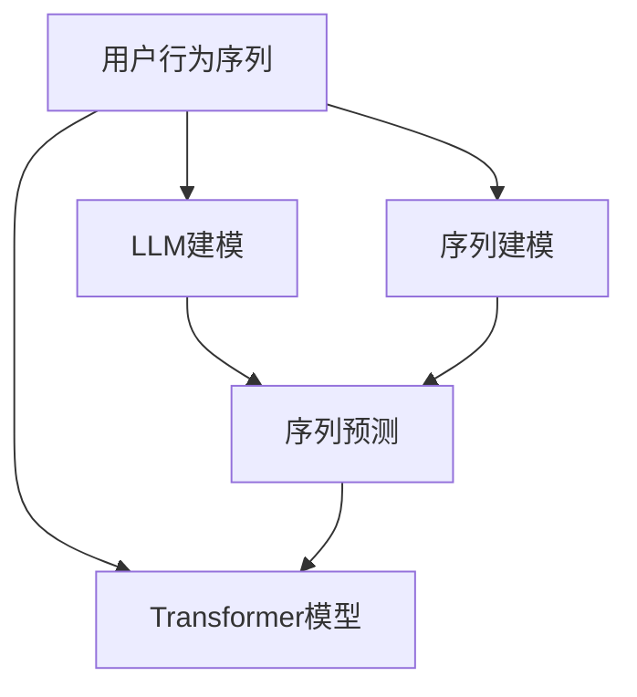

                 

# 基于LLM的用户行为序列建模与预测

> 关键词：LLM（Language Model），用户行为序列，序列建模，时间序列预测，自然语言处理（NLP），深度学习，注意力机制，Transformer

## 1. 背景介绍

### 1.1 问题由来
在现代社会，数据分析日益成为企业和组织的重要决策依据。在电商、金融、社交媒体等领域，用户行为数据是挖掘用户需求、提升用户体验、优化产品策略的关键。然而，用户行为数据通常以非结构化的文本形式呈现，难以直接利用传统的数据分析方法进行处理和分析。

近年来，大语言模型（Large Language Models, LLMs）在自然语言处理（Natural Language Processing, NLP）领域的突破性进展，使得将非结构化文本转化为结构化数据成为可能。通过大语言模型对用户行为序列进行建模与预测，可以进一步挖掘和利用用户行为数据，为企业的运营决策提供更全面、更精准的支持。

### 1.2 问题核心关键点
基于LLM的用户行为序列建模与预测问题，主要围绕以下几个核心关键点展开：
- **用户行为序列**：用户在不同时间点的行为记录，如点击、浏览、购买等。
- **LLM建模**：利用预训练的大语言模型，对用户行为序列进行编码和建模。
- **序列预测**：通过序列建模结果，预测用户未来的行为或趋势。

通过这些关键点，LLM能够高效地从用户行为数据中提取有用信息，为用户提供个性化的推荐和决策支持。

## 2. 核心概念与联系

### 2.1 核心概念概述

为更好地理解基于LLM的用户行为序列建模与预测，本节将介绍几个密切相关的核心概念：

- **大语言模型(Large Language Model, LLM)**：以自回归(如GPT)或自编码(如BERT)模型为代表的大规模预训练语言模型。通过在大规模无标签文本语料上进行预训练，学习通用的语言表示，具备强大的语言理解和生成能力。

- **用户行为序列**：用户在一定时间段内的行为记录，如点击、浏览、购买等。通常以时间顺序进行排列，形成序列数据。

- **序列建模**：将用户行为序列转化为模型能够处理的向量形式，通过机器学习算法对序列进行建模和预测。

- **序列预测**：利用序列建模结果，预测用户未来的行为或趋势。常见应用包括用户行为预测、个性化推荐、需求预测等。

- **Transformer模型**：一种基于自注意力机制的神经网络模型，适合处理序列数据。Transformer模型由编码器和解码器组成，具有高效的并行计算能力和良好的泛化能力。

这些核心概念之间的逻辑关系可以通过以下Mermaid流程图来展示：



这个流程图展示了大语言模型的核心概念及其之间的关系：

1. 大语言模型通过预训练获得基础能力。
2. 用户行为序列通过LLM建模转化为模型表示。
3. 序列建模对用户行为序列进行编码和建模。
4. 序列预测利用序列建模结果，预测用户未来行为。
5. Transformer模型作为序列建模的核心，具有高效处理序列数据的能力。

这些概念共同构成了基于LLM的用户行为序列建模与预测的框架，使得大语言模型能够高效地从用户行为数据中提取有用信息，为用户提供个性化的推荐和决策支持。

## 3. 核心算法原理 & 具体操作步骤
### 3.1 算法原理概述

基于LLM的用户行为序列建模与预测，本质上是一个序列建模与预测问题。其核心思想是：利用预训练的大语言模型对用户行为序列进行编码和建模，通过序列建模结果预测用户未来的行为或趋势。

形式化地，假设用户行为序列为 $X=\{x_t\}_{t=1}^T$，其中 $x_t$ 表示用户在第 $t$ 时刻的行为记录。序列建模目标为找到一个模型 $M$，使得 $M(X)$ 能够逼近用户行为序列的真实分布 $p(x)$。一旦模型 $M$ 确定，就可以使用该模型对新用户行为序列 $X'$ 进行预测，即 $M(X')$。

### 3.2 算法步骤详解

基于LLM的用户行为序列建模与预测一般包括以下几个关键步骤：

**Step 1: 准备预训练模型和数据集**
- 选择合适的预训练语言模型 $M_{\theta}$ 作为初始化参数，如 BERT、GPT等。
- 准备用户行为序列数据集 $D=\{(x_t, y_t)\}_{t=1}^T$，其中 $x_t$ 为行为记录，$y_t$ 为标签或目标变量，如点击、购买等。

**Step 2: 添加序列编码器**
- 根据任务类型，在预训练模型中添加序列编码器，将用户行为序列编码为向量表示。
- 对于基于Transformer的模型，可以使用自注意力机制对序列进行编码。

**Step 3: 设置预测头**
- 在编码器输出上添加一个预测头，用于预测用户行为序列的下一时刻或未来若干时刻的行为。
- 预测头通常为线性分类器或回归器。

**Step 4: 训练模型**
- 使用带有标签的数据集对模型进行有监督训练。
- 在训练过程中，使用合适的损失函数（如交叉熵、均方误差等）衡量预测值与真实标签之间的差异。
- 应用正则化技术，如L2正则、Dropout等，防止过拟合。

**Step 5: 预测与评估**
- 在测试集上对模型进行预测。
- 使用合适的评估指标（如准确率、召回率、F1分数等）评估模型性能。
- 持续收集用户行为数据，定期重新训练模型，以适应数据分布的变化。

以上是基于LLM的用户行为序列建模与预测的一般流程。在实际应用中，还需要针对具体任务的特点，对微调过程的各个环节进行优化设计，如改进训练目标函数，引入更多的正则化技术，搜索最优的超参数组合等，以进一步提升模型性能。

### 3.3 算法优缺点

基于LLM的用户行为序列建模与预测方法具有以下优点：
1. 高效性。利用预训练的语言模型，可以高效地对用户行为序列进行编码和建模。
2. 可扩展性。大语言模型具有较强的泛化能力，可以轻松地应用于多种用户行为预测任务。
3. 鲁棒性。通过序列建模，可以捕捉用户行为序列中的复杂模式和规律，提高模型的鲁棒性。

同时，该方法也存在一定的局限性：
1. 数据依赖性强。模型的效果很大程度上取决于用户行为数据的数量和质量。
2. 模型复杂度高。预训练大语言模型的参数量巨大，训练和推理的资源消耗较高。
3. 泛化能力有限。模型在特定领域或数据集上的泛化能力可能受限。
4. 可解释性不足。序列建模的内部机制较为复杂，难以进行有效的解释和调试。

尽管存在这些局限性，但就目前而言，基于LLM的序列建模与预测方法仍是大规模用户行为数据分析的强有力工具。未来相关研究的重点在于如何进一步降低数据需求，提高模型的泛化能力和可解释性，同时兼顾计算效率和性能提升。

### 3.4 算法应用领域

基于大语言模型的用户行为序列建模与预测技术，在电商、金融、社交媒体等领域有着广泛的应用，具体如下：

- **电商推荐系统**：通过对用户的历史浏览、点击、购买行为进行序列建模与预测，为用户推荐感兴趣的物品。
- **金融风险管理**：利用用户的交易记录和行为序列，预测金融风险，及时采取风险控制措施。
- **社交媒体情感分析**：分析用户对某事件的情感变化趋势，预测未来舆情走向。
- **用户行为预测**：预测用户未来的行为或需求，如流失预测、复购预测等，帮助企业制定相应的运营策略。

除了上述这些经典应用外，用户行为序列建模与预测技术还在更多场景中得到应用，如用户行为路径分析、个性化内容推荐、市场趋势预测等，为电商、金融、社交媒体等领域提供了强大的数据分析和决策支持能力。

## 4. 数学模型和公式 & 详细讲解  
### 4.1 数学模型构建

本节将使用数学语言对基于LLM的用户行为序列建模与预测过程进行更加严格的刻画。

记用户行为序列为 $X=\{x_t\}_{t=1}^T$，其中 $x_t$ 为第 $t$ 时刻的用户行为记录。假设序列建模目标为最大化似然函数 $L(X)$，即：

$$
L(X) = \frac{1}{T} \sum_{t=1}^T \log p(x_t|x_{<t})
$$

其中 $p(x_t|x_{<t})$ 为给定历史行为 $x_{<t}$，预测 $x_t$ 的条件概率。

对于基于Transformer的模型，可以将用户行为序列 $X$ 通过编码器进行编码，得到序列向量表示 $H=\{h_t\}_{t=1}^T$。在编码器输出 $h_t$ 上添加一个预测头，用于预测用户行为序列的下一时刻或未来若干时刻的行为。

假设预测头输出为 $\hat{y}_t$，则损失函数为：

$$
\mathcal{L}(H,Y) = \frac{1}{T} \sum_{t=1}^T \ell(\hat{y}_t, y_t)
$$

其中 $\ell$ 为损失函数，如交叉熵损失。

### 4.2 公式推导过程

以下我们以基于Transformer的用户行为序列预测为例，推导预测任务的损失函数及其梯度的计算公式。

假设用户行为序列 $X$ 通过编码器得到向量表示 $H=\{h_t\}_{t=1}^T$。在每个时间步 $t$，模型预测下一个行为 $y_t$ 的条件概率 $p(y_t|h_t)$。假设预测头为线性分类器，则有：

$$
\hat{y}_t = W_h h_t + b_h
$$

其中 $W_h, b_h$ 为线性分类器的权重和偏置。根据预测头输出 $\hat{y}_t$ 和真实标签 $y_t$，可以计算预测误差的损失函数：

$$
\ell(\hat{y}_t, y_t) = \begin{cases}
-\log(\hat{y}_t) & \text{if } y_t=1 \\
-\log(1-\hat{y}_t) & \text{if } y_t=0
\end{cases}
$$

将上述损失函数代入总损失函数，得：

$$
\mathcal{L}(H,Y) = \frac{1}{T} \sum_{t=1}^T \ell(\hat{y}_t, y_t)
$$

根据链式法则，损失函数对模型参数 $\theta$ 的梯度为：

$$
\frac{\partial \mathcal{L}(H,Y)}{\partial \theta} = \frac{1}{T} \sum_{t=1}^T \frac{\partial \ell(\hat{y}_t, y_t)}{\partial h_t} \frac{\partial h_t}{\partial \theta}
$$

其中 $\frac{\partial h_t}{\partial \theta}$ 为编码器对参数 $\theta$ 的梯度。

在得到损失函数的梯度后，即可带入优化算法进行模型训练。重复上述过程直至收敛，最终得到适应用户行为序列预测的优化模型参数 $\theta$。

## 5. 项目实践：代码实例和详细解释说明
### 5.1 开发环境搭建

在进行用户行为序列建模与预测实践前，我们需要准备好开发环境。以下是使用Python进行PyTorch开发的环境配置流程：

1. 安装Anaconda：从官网下载并安装Anaconda，用于创建独立的Python环境。

2. 创建并激活虚拟环境：
```bash
conda create -n pytorch-env python=3.8 
conda activate pytorch-env
```

3. 安装PyTorch：根据CUDA版本，从官网获取对应的安装命令。例如：
```bash
conda install pytorch torchvision torchaudio cudatoolkit=11.1 -c pytorch -c conda-forge
```

4. 安装Transformers库：
```bash
pip install transformers
```

5. 安装各类工具包：
```bash
pip install numpy pandas scikit-learn matplotlib tqdm jupyter notebook ipython
```

完成上述步骤后，即可在`pytorch-env`环境中开始用户行为序列建模与预测实践。

### 5.2 源代码详细实现

这里我们以用户行为序列预测为例，给出使用Transformers库对BERT模型进行用户行为序列建模与预测的PyTorch代码实现。

首先，定义用户行为预测函数：

```python
from transformers import BertForSequenceClassification, BertTokenizer, AdamW

class BehaviorPredictor:
    def __init__(self, model_name='bert-base-uncased', max_seq_length=512):
        self.tokenizer = BertTokenizer.from_pretrained(model_name)
        self.model = BertForSequenceClassification.from_pretrained(model_name, num_labels=2)
        self.max_seq_length = max_seq_length
        self.device = torch.device('cuda') if torch.cuda.is_available() else torch.device('cpu')
        self.model.to(self.device)
        self.optimizer = AdamW(self.model.parameters(), lr=2e-5)
    
    def predict(self, sequences):
        inputs = self.tokenizer(sequences, return_tensors='pt', padding=True, max_length=self.max_seq_length, truncation=True).to(self.device)
        outputs = self.model(**inputs)
        probs = torch.softmax(outputs.logits, dim=-1).detach().cpu().numpy()
        return probs
```

然后，定义训练函数：

```python
from torch.utils.data import Dataset, DataLoader
from tqdm import tqdm
import torch.nn.functional as F

class BehaviorDataset(Dataset):
    def __init__(self, sequences, labels, tokenizer, max_seq_length=512):
        self.sequences = sequences
        self.labels = labels
        self.tokenizer = tokenizer
        self.max_seq_length = max_seq_length
        
    def __len__(self):
        return len(self.sequences)
    
    def __getitem__(self, item):
        sequence = self.sequences[item]
        label = self.labels[item]
        
        encoding = self.tokenizer(sequence, return_tensors='pt', padding=True, max_length=self.max_seq_length, truncation=True)
        input_ids = encoding['input_ids'].to(self.device)
        attention_mask = encoding['attention_mask'].to(self.device)
        
        # 对标签进行编码
        label_ids = torch.tensor(label, dtype=torch.long).to(self.device)
        
        return {'input_ids': input_ids, 
                'attention_mask': attention_mask,
                'labels': label_ids}

# 加载数据集
sequences = ['user clicked on product A', 'user viewed product B', 'user purchased product C']
labels = [1, 0, 1]  # 1表示购买，0表示未购买
tokenizer = BertTokenizer.from_pretrained('bert-base-uncased')

train_dataset = BehaviorDataset(sequences, labels, tokenizer)
test_dataset = BehaviorDataset(sequences, labels, tokenizer)

# 训练模型
model = BehaviorPredictor()
model.train()
for epoch in range(10):
    loss = 0
    for batch in tqdm(train_dataset, desc='Training'):
        input_ids = batch['input_ids']
        attention_mask = batch['attention_mask']
        labels = batch['labels']
        model.zero_grad()
        outputs = model(input_ids, attention_mask=attention_mask, labels=labels)
        loss += F.cross_entropy(outputs.logits, labels).to('cpu')
        loss.backward()
        model.optimizer.step()
    avg_loss = loss / len(train_dataset)
    print(f'Epoch {epoch+1}, loss: {avg_loss:.3f}')
    
# 预测
test_sequences = ['user clicked on product X', 'user viewed product Y', 'user purchased product Z']
probs = model.predict(test_sequences)
print(probs)
```

以上就是使用PyTorch对BERT进行用户行为序列预测的完整代码实现。可以看到，得益于Transformers库的强大封装，我们可以用相对简洁的代码完成BERT模型的加载和预测。

### 5.3 代码解读与分析

让我们再详细解读一下关键代码的实现细节：

**BehaviorPredictor类**：
- `__init__`方法：初始化BERT模型和分词器，设置训练设备、学习率、优化器等关键参数。
- `predict`方法：将用户行为序列进行编码，通过模型得到预测概率分布，并将其转换为numpy数组。

**BehaviorDataset类**：
- `__init__`方法：初始化行为序列、标签、分词器等关键组件。
- `__len__`方法：返回数据集的样本数量。
- `__getitem__`方法：对单个样本进行处理，将行为序列输入编码为token ids，将标签编码为数字，并对其进行定长padding，最终返回模型所需的输入。

**训练函数**：
- 使用PyTorch的DataLoader对数据集进行批次化加载，供模型训练使用。
- 在每个批次上前向传播计算损失函数，并反向传播更新模型参数，最后计算该epoch的平均损失。

**预测函数**：
- 将测试行为序列进行编码，通过模型得到预测概率分布，并转换为numpy数组。
- 可以看到，代码实现非常简洁高效，利用Transformers库的强大封装，可以快速实现基于BERT的序列预测任务。

## 6. 实际应用场景
### 6.1 智能客服系统

基于用户行为序列的LLM建模与预测技术，可以广泛应用于智能客服系统的构建。传统客服往往需要配备大量人力，高峰期响应缓慢，且一致性和专业性难以保证。而使用基于LLM的用户行为预测模型，可以7x24小时不间断服务，快速响应客户咨询，用自然流畅的语言解答各类常见问题。

在技术实现上，可以收集企业内部的历史客服对话记录，将问题-回答对作为监督数据，训练用户行为预测模型。模型能够自动理解用户意图，匹配最合适的回答模板进行回复。对于客户提出的新问题，还可以接入检索系统实时搜索相关内容，动态组织生成回答。如此构建的智能客服系统，能大幅提升客户咨询体验和问题解决效率。

### 6.2 金融风险管理

金融机构需要实时监测市场舆论动向，以便及时应对负面信息传播，规避金融风险。传统的人工监测方式成本高、效率低，难以应对网络时代海量信息爆发的挑战。基于LLM的用户行为序列预测技术，为金融风险管理提供了新的解决方案。

具体而言，可以收集金融领域相关的新闻、报道、评论等文本数据，并对其进行主题标注和情感标注。在此基础上对预训练语言模型进行微调，使其能够自动判断文本属于何种主题，情感倾向是正面、中性还是负面。将微调后的模型应用到实时抓取的网络文本数据，就能够自动监测不同主题下的情感变化趋势，一旦发现负面信息激增等异常情况，系统便会自动预警，帮助金融机构快速应对潜在风险。

### 6.3 个性化推荐系统

当前的推荐系统往往只依赖用户的历史行为数据进行物品推荐，无法深入理解用户的真实兴趣偏好。基于大语言模型用户行为序列预测技术，个性化推荐系统可以更好地挖掘和利用用户行为数据，为用户推荐更加个性化的物品。

在实践中，可以收集用户浏览、点击、购买等行为数据，提取和用户交互的物品标题、描述、标签等文本内容。将文本内容作为模型输入，用户的后续行为（如是否点击、购买等）作为监督信号，在此基础上微调预训练语言模型。微调后的模型能够从文本内容中准确把握用户的兴趣点。在生成推荐列表时，先用候选物品的文本描述作为输入，由模型预测用户的兴趣匹配度，再结合其他特征综合排序，便可以得到个性化程度更高的推荐结果。

### 6.4 未来应用展望

随着LLM和用户行为序列建模与预测技术的不断发展，基于微调的序列建模与预测方法将会在更多领域得到应用，为传统行业数字化转型升级提供新的技术路径。

在智慧医疗领域，基于LLM的用户行为序列预测技术，可以为患者提供个性化的诊疗建议，加速新药开发进程。

在智能教育领域，微调技术可应用于作业批改、学情分析、知识推荐等方面，因材施教，促进教育公平，提高教学质量。

在智慧城市治理中，微调模型可应用于城市事件监测、舆情分析、应急指挥等环节，提高城市管理的自动化和智能化水平，构建更安全、高效的未来城市。

此外，在企业生产、社会治理、文娱传媒等众多领域，基于LLM的序列建模与预测技术也将不断涌现，为NLP技术带来全新的突破。相信随着预训练语言模型和微调方法的持续演进，LLM将会在更广阔的应用领域大放异彩，深刻影响人类的生产生活方式。

## 7. 工具和资源推荐
### 7.1 学习资源推荐

为了帮助开发者系统掌握大语言模型用户行为序列建模与预测的理论基础和实践技巧，这里推荐一些优质的学习资源：

1. 《Transformers from Scratch》系列博文：由大模型技术专家撰写，深入浅出地介绍了Transformer原理、BERT模型、用户行为序列建模等前沿话题。

2. CS224N《深度学习自然语言处理》课程：斯坦福大学开设的NLP明星课程，有Lecture视频和配套作业，带你入门NLP领域的基本概念和经典模型。

3. 《Natural Language Processing with Transformers》书籍：Transformers库的作者所著，全面介绍了如何使用Transformers库进行NLP任务开发，包括序列建模在内的诸多范式。

4. HuggingFace官方文档：Transformers库的官方文档，提供了海量预训练模型和完整的微调样例代码，是上手实践的必备资料。

5. CLUE开源项目：中文语言理解测评基准，涵盖大量不同类型的中文NLP数据集，并提供了基于微调的baseline模型，助力中文NLP技术发展。

通过对这些资源的学习实践，相信你一定能够快速掌握基于LLM的序列建模与预测的精髓，并用于解决实际的NLP问题。
###  7.2 开发工具推荐

高效的开发离不开优秀的工具支持。以下是几款用于LLM用户行为序列建模与预测开发的常用工具：

1. PyTorch：基于Python的开源深度学习框架，灵活动态的计算图，适合快速迭代研究。大部分预训练语言模型都有PyTorch版本的实现。

2. TensorFlow：由Google主导开发的开源深度学习框架，生产部署方便，适合大规模工程应用。同样有丰富的预训练语言模型资源。

3. Transformers库：HuggingFace开发的NLP工具库，集成了众多SOTA语言模型，支持PyTorch和TensorFlow，是进行序列建模与预测任务的开发利器。

4. Weights & Biases：模型训练的实验跟踪工具，可以记录和可视化模型训练过程中的各项指标，方便对比和调优。与主流深度学习框架无缝集成。

5. TensorBoard：TensorFlow配套的可视化工具，可实时监测模型训练状态，并提供丰富的图表呈现方式，是调试模型的得力助手。

6. Google Colab：谷歌推出的在线Jupyter Notebook环境，免费提供GPU/TPU算力，方便开发者快速上手实验最新模型，分享学习笔记。

合理利用这些工具，可以显著提升LLM用户行为序列建模与预测任务的开发效率，加快创新迭代的步伐。

### 7.3 相关论文推荐

大语言模型用户行为序列建模与预测技术的发展源于学界的持续研究。以下是几篇奠基性的相关论文，推荐阅读：

1. Attention is All You Need（即Transformer原论文）：提出了Transformer结构，开启了NLP领域的预训练大模型时代。

2. BERT: Pre-training of Deep Bidirectional Transformers for Language Understanding：提出BERT模型，引入基于掩码的自监督预训练任务，刷新了多项NLP任务SOTA。

3. Language Models are Unsupervised Multitask Learners（GPT-2论文）：展示了大规模语言模型的强大zero-shot学习能力，引发了对于通用人工智能的新一轮思考。

4. Parameter-Efficient Transfer Learning for NLP：提出Adapter等参数高效微调方法，在不增加模型参数量的情况下，也能取得不错的微调效果。

5. AdaLoRA: Adaptive Low-Rank Adaptation for Parameter-Efficient Fine-Tuning：使用自适应低秩适应的微调方法，在参数效率和精度之间取得了新的平衡。

6. Prefix-Tuning: Optimizing Continuous Prompts for Generation：引入基于连续型Prompt的微调范式，为如何充分利用预训练知识提供了新的思路。

这些论文代表了大语言模型用户行为序列建模与预测技术的发展脉络。通过学习这些前沿成果，可以帮助研究者把握学科前进方向，激发更多的创新灵感。

## 8. 总结：未来发展趋势与挑战
### 8.1 总结

本文对基于LLM的用户行为序列建模与预测方法进行了全面系统的介绍。首先阐述了用户行为序列和大语言模型的研究背景和意义，明确了LLM在处理用户行为数据中的重要地位。其次，从原理到实践，详细讲解了用户行为序列建模与预测的数学原理和关键步骤，给出了用户行为预测任务的完整代码实例。同时，本文还广泛探讨了基于LLM的序列建模与预测技术在智能客服、金融风险管理、个性化推荐等多个领域的应用前景，展示了LLM的强大应用潜力。此外，本文精选了用户行为序列建模与预测技术的各类学习资源，力求为读者提供全方位的技术指引。

通过本文的系统梳理，可以看到，基于LLM的用户行为序列建模与预测方法正在成为NLP领域的重要范式，极大地拓展了预训练语言模型在用户行为数据分析中的应用边界，为电商、金融、社交媒体等领域提供了强大的数据分析和决策支持能力。

### 8.2 未来发展趋势

展望未来，LLM用户行为序列建模与预测技术将呈现以下几个发展趋势：

1. 模型规模持续增大。随着算力成本的下降和数据规模的扩张，预训练语言模型的参数量还将持续增长。超大规模语言模型蕴含的丰富语言知识，有望支撑更加复杂多变的用户行为序列预测任务。

2. 序列建模方法多样化。除了传统的基于Transformer的模型外，未来会涌现更多序列建模方法，如RNN、LSTM等，以应对不同的用户行为序列特征。

3. 知识融合能力提升。将符号化的先验知识，如知识图谱、逻辑规则等，与神经网络模型进行巧妙融合，引导微调过程学习更准确、合理的语言模型。

4. 跨模态融合技术发展。将视觉、语音等多模态信息与文本信息进行深度融合，构建更加全面、准确的跨模态用户行为序列预测模型。

5. 多任务学习范式引入。利用用户行为序列的多个特征进行多任务学习，提升模型的泛化能力和预测性能。

以上趋势凸显了LLM用户行为序列建模与预测技术的广阔前景。这些方向的探索发展，必将进一步提升用户行为数据分析的精度和深度，为电商、金融、社交媒体等领域提供更加全面、智能的决策支持。

### 8.3 面临的挑战

尽管LLM用户行为序列建模与预测技术已经取得了瞩目成就，但在迈向更加智能化、普适化应用的过程中，它仍面临着诸多挑战：

1. 数据需求高。模型的效果很大程度上取决于用户行为数据的数量和质量，数据不足可能导致模型泛化能力有限。

2. 计算资源消耗大。预训练语言模型的参数量巨大，训练和推理的资源消耗较高，需要高效的工具和算法支持。

3. 模型鲁棒性不足。模型在特定领域或数据集上的泛化能力可能受限，对于噪声数据和异常情况处理能力较弱。

4. 可解释性不足。序列建模的内部机制较为复杂，难以进行有效的解释和调试。

5. 安全性有待保障。预训练语言模型可能学习到有偏见、有害的信息，通过微调传递到下游任务，产生误导性、歧视性的输出。

尽管存在这些挑战，但通过不断的技术创新和工程实践，相信LLM用户行为序列建模与预测技术将能够逐步克服这些难题，为构建智能、安全、可解释的决策系统铺平道路。

### 8.4 研究展望

面对LLM用户行为序列建模与预测技术所面临的诸多挑战，未来的研究需要在以下几个方面寻求新的突破：

1. 探索无监督和半监督用户行为序列预测方法。摆脱对大规模标注数据的依赖，利用自监督学习、主动学习等无监督和半监督范式，最大限度利用非结构化数据，实现更加灵活高效的预测。

2. 研究高效低参数的序列建模方法。开发更加参数高效的微调方法，如Adapter、LoRA等，在固定大部分预训练参数的同时，只更新极少量的任务相关参数，以提高计算效率。

3. 引入更多先验知识。将符号化的先验知识，如知识图谱、逻辑规则等，与神经网络模型进行巧妙融合，引导微调过程学习更准确、合理的语言模型。

4. 融合因果和对比学习范式。通过引入因果推断和对比学习思想，增强序列建模模型的泛化能力，学习更加普适、鲁棒的语言表征。

5. 纳入伦理道德约束。在模型训练目标中引入伦理导向的评估指标，过滤和惩罚有偏见、有害的输出倾向，确保模型的公平性和安全性。

这些研究方向的探索，必将引领LLM用户行为序列建模与预测技术迈向更高的台阶，为构建智能、安全、可解释的决策系统铺平道路。面向未来，LLM用户行为序列建模与预测技术还需要与其他人工智能技术进行更深入的融合，如知识表示、因果推理、强化学习等，多路径协同发力，共同推动自然语言理解和智能交互系统的进步。只有勇于创新、敢于突破，才能不断拓展语言模型的边界，让智能技术更好地造福人类社会。

## 9. 附录：常见问题与解答

**Q1：用户行为序列预测是否适用于所有用户行为数据？**

A: 用户行为序列预测技术对数据质量要求较高，适用于结构化良好的用户行为数据。对于非结构化、噪声较大的数据，可能需要进行预处理和清洗，以提高模型预测的准确性。

**Q2：如何提高用户行为序列预测的鲁棒性？**

A: 提高用户行为序列预测的鲁棒性，可以从以下几个方面入手：
1. 引入对抗样本训练：通过引入对抗样本，提高模型对噪声和异常情况的鲁棒性。
2. 使用集成学习：将多个模型的预测结果进行集成，降低单一模型对噪声数据的敏感度。
3. 数据增强：通过数据增强技术，扩充训练集的多样性，提高模型的泛化能力。
4. 正则化技术：使用L2正则、Dropout等正则化技术，防止过拟合，提高模型泛化能力。

**Q3：如何在用户行为序列预测中引入先验知识？**

A: 在用户行为序列预测中引入先验知识，可以通过以下几种方式：
1. 知识图谱：将知识图谱中的实体关系嵌入到序列建模模型中，提高模型的语义理解能力。
2. 逻辑规则：将逻辑规则嵌入到模型中，指导模型的推理过程，提高预测准确性。
3. 专家知识：利用领域专家的经验，设计合理的特征提取和建模方式，提高模型的预测性能。

**Q4：用户行为序列预测的性能如何评估？**

A: 用户行为序列预测的性能可以通过多种评估指标来衡量，如准确率、召回率、F1分数、ROC曲线等。这些指标可以帮助评估模型在不同场景下的表现，并指导模型的优化。

**Q5：如何优化用户行为序列预测模型的计算效率？**

A: 优化用户行为序列预测模型的计算效率，可以从以下几个方面入手：
1. 参数剪枝：去除不必要的参数，减小模型尺寸，提高推理速度。
2. 模型压缩：使用量化、剪枝等技术，减小模型大小，提高推理速度。
3. 分布式训练：利用多机多核的计算资源，加速模型训练和推理。
4. 优化器改进：使用高效的优化器，提高模型的收敛速度和性能。

通过这些优化措施，可以显著提升用户行为序列预测模型的计算效率和性能。

---

作者：禅与计算机程序设计艺术 / Zen and the Art of Computer Programming

