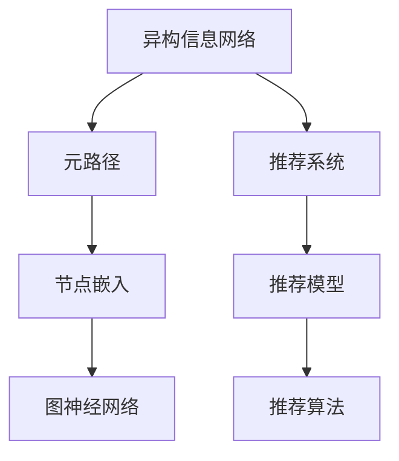

                 

# 基于元路径的异构信息网络推荐

## 1. 背景介绍

### 1.1 问题由来

在信息时代，我们被大量复杂且多样的数据所包围。文本、图片、视频等不同类型的数据丰富了我们的生活，但如何从这些数据中挖掘有价值的信息，给用户推荐他们可能感兴趣的物品，成为了一个重要且具有挑战性的问题。传统的推荐系统，如基于协同过滤的推荐，仅依赖用户行为数据，难以捕捉用户的多维兴趣和潜在需求。随着数据量的增长，如何构建高效且个性化的推荐系统，成为了推荐领域的热点研究方向。

### 1.2 问题核心关键点

在当前的研究中，信息网络推荐技术逐渐受到重视。信息网络推荐利用了网络结构化的特点，结合了用户行为数据，能够更全面地理解用户与物品之间的关系。传统的图推荐方法通常采用经典图算法（如PageRank、GNN等）来进行推荐。然而，由于不同类型的信息网络（如社交网络、商品评论网络、知识网络等）具有不同的结构和模式，直接应用传统算法往往难以达到理想的效果。因此，需要一种更加灵活且高效的方法来适应这些复杂的网络结构。

基于元路径的异构信息网络推荐技术应运而生。它通过利用网络中不同类型节点之间的元路径关系，构建综合性的特征表示，从而提升推荐效果。元路径（如三元组、四元组等）刻画了网络中不同类型节点之间的关系模式，通过在网络中搜索特定元路径，可以挖掘出不同节点之间的连接关系，并用于提升推荐系统的性能。

## 2. 核心概念与联系

### 2.1 核心概念概述

为更好地理解基于元路径的异构信息网络推荐方法，本节将介绍几个密切相关的核心概念：

- 异构信息网络（Heterogeneous Information Network, HIN）：描述不同类型节点和边之间的复杂关系，如社交网络、商品评论网络、知识网络等。
- 元路径（Meta-Path）：在HIN中，不同类型的节点之间可以通过特定的路径关系进行连接，如用户-商品-评论、用户-关系-用户等。
- 节点嵌入（Node Embedding）：将节点映射到低维空间中的向量表示，使得节点之间的相似性和关系得以保留。
- 图神经网络（Graph Neural Network, GNN）：通过在图上进行操作，构建图表示学习的模型，如GCN、GAT等。
- 推荐系统（Recommendation System）：根据用户的历史行为、兴趣偏好等，为用户推荐感兴趣的商品、文章、视频等。

这些核心概念之间的逻辑关系可以通过以下Mermaid流程图来展示：



这个流程图展示了几组核心概念之间的联系：

1. 异构信息网络通过元路径连接不同类型的节点。
2. 元路径通过节点嵌入构建节点的低维向量表示。
3. 节点嵌入通过图神经网络进行图结构上的表示学习。
4. 图神经网络用于构建推荐模型。
5. 推荐系统利用推荐模型进行推荐。

这些概念共同构成了异构信息网络推荐技术的基础，使其能够适应复杂多变的网络结构，提升推荐系统的性能。

## 3. 核心算法原理 & 具体操作步骤

### 3.1 算法原理概述

基于元路径的异构信息网络推荐方法的核心思想是：通过在网络中搜索特定的元路径，构建综合性的特征表示，从而提升推荐系统的性能。其算法流程大致如下：

1. **构建元路径图**：从异构信息网络中，抽取出指定类型的元路径，构建元路径图。
2. **节点嵌入**：对元路径图中的节点进行嵌入，生成低维的向量表示。
3. **图卷积网络**：在元路径图上应用图卷积神经网络，生成节点嵌入的表示。
4. **推荐模型**：根据节点嵌入的表示，使用推荐算法计算用户对物品的评分，从而进行推荐。

### 3.2 算法步骤详解

#### 3.2.1 元路径图构建

元路径图是通过从异构信息网络中抽取特定类型的元路径构建的。假设网络中有三类节点 $U$（用户）、$I$（商品）、$C$（评论），一条元路径可以表示为 $(U, R, I)$，其中 $R$ 是用户和商品之间的关系类型。例如，“用户购买商品”、“用户评价商品”等。

元路径的抽取可以通过两种方式：一种是基于领域专家的先验知识，直接定义元路径；另一种是利用算法自动发现元路径。这里我们先介绍基于领域专家的元路径构建方法。

1. **定义元路径**：首先，需要定义特定领域内的元路径。以电商领域为例，可能包含“用户-商品-评论”、“用户-商品-订单”等元路径。
2. **抽取元路径图**：在网络中，对于每一条元路径，抽取所有符合条件的边，构建元路径图。例如，从“用户-商品-评论”元路径中抽取所有“用户-商品”边和“商品-评论”边，构成元路径图。

#### 3.2.2 节点嵌入

节点嵌入是将网络中的节点映射到低维空间中的向量表示。节点嵌入的目的是保留节点之间的相似性和关系，同时降低高维空间中的噪声。

常用的节点嵌入方法包括：

- **随机游走嵌入（Random Walk Embedding）**：通过随机游走算法在网络中采样节点序列，构造节点嵌入矩阵。
- **DeepWalk嵌入**：通过随机游走和负采样，构造节点嵌入矩阵。
- **节点2Vec嵌入**：结合节点嵌入和图卷积神经网络，构造节点嵌入矩阵。

这里，我们以DeepWalk嵌入为例，介绍节点嵌入的实现过程。

1. **定义随机游走策略**：随机游走策略决定了节点序列的生成方式。例如，每次从一个节点出发，随机选择下一个节点。
2. **采样节点序列**：对于每个节点，根据随机游走策略采样若干个节点，构成节点序列。例如，对于节点 $u$，从 $u$ 出发随机游走 $k$ 步，得到一个长度为 $k$ 的节点序列。
3. **负采样**：对于每个节点序列，进行负采样，生成负样本。例如，对于节点序列 $[u, v_1, v_2, \cdots, v_k]$，构造负样本 $[\cdots, v_{-1}, v_{-2}, \cdots]$。
4. **训练嵌入矩阵**：使用节点序列和负采样作为输入，训练一个低维嵌入矩阵 $W$，使得 $Wu$ 与 $Wv_i$ 尽可能相似，同时 $Wu$ 与 $Wv_{-i}$ 尽可能不相似。

#### 3.2.3 图卷积网络

图卷积神经网络（GNN）是一种在图结构上进行操作的神经网络，能够学习节点的局部和全局表示。在元路径图上应用GNN，可以生成节点嵌入的表示。

常用的GNN算法包括：

- **图卷积网络（GCN）**：通过卷积操作，在图上进行特征传播。
- **图注意力网络（GAT）**：通过注意力机制，选择重要性较高的邻居节点进行特征融合。
- **图自注意力网络（Graph Isotropic Attention, GISA）**：通过自注意力机制，学习节点之间的相似性，生成节点嵌入。

这里，我们以GCN为例，介绍图卷积网络的实现过程。

1. **定义卷积层**：定义卷积层 $H^{(l)}$，通过卷积操作，生成节点嵌入的表示。例如，对于节点 $u$ 和邻居节点 $v_1, v_2, \cdots, v_k$，生成节点嵌入 $H^{(l+1)}(u)$。
2. **特征传播**：对于每个节点，通过卷积层传播特征，生成新的节点嵌入。例如，对于节点 $u$，通过卷积操作传播特征，生成新的节点嵌入 $H^{(l+1)}(u)$。
3. **池化操作**：通过池化操作，将节点嵌入的表示汇聚到一个低维空间中。例如，使用均值池化或最大池化，生成节点嵌入 $H^{(l+1)}(u)$。

#### 3.2.4 推荐模型

在得到节点嵌入的表示后，可以将其用于推荐模型的训练和推理。常用的推荐模型包括：

- **协同过滤模型（Collaborative Filtering Model）**：通过用户-商品评分矩阵，计算用户对物品的评分。
- **基于内容的推荐模型（Content-Based Recommendation Model）**：通过物品的特征向量，计算用户对物品的评分。
- **深度学习推荐模型（Deep Learning Recommendation Model）**：通过深度神经网络，计算用户对物品的评分。

这里，我们以协同过滤模型为例，介绍推荐模型的实现过程。

1. **定义用户-商品评分矩阵**：将用户对物品的评分作为矩阵 $P$ 的元素。例如，对于用户 $u$ 和物品 $i$，$P_{ui}$ 表示用户 $u$ 对物品 $i$ 的评分。
2. **生成用户嵌入**：通过用户-商品评分矩阵，生成用户嵌入向量 $U$。例如，对于用户 $u$，$U_u$ 表示用户 $u$ 的嵌入向量。
3. **生成物品嵌入**：通过用户-商品评分矩阵，生成物品嵌入向量 $I$。例如，对于物品 $i$，$I_i$ 表示物品 $i$ 的嵌入向量。
4. **计算用户对物品的评分**：根据用户嵌入和物品嵌入，计算用户对物品的评分。例如，使用点积模型，$P_{ui} = U_u \cdot I_i$。

### 3.3 算法优缺点

基于元路径的异构信息网络推荐方法具有以下优点：

- **适应复杂网络结构**：能够处理不同类型节点之间的复杂关系，适应异构信息网络的复杂结构。
- **提升推荐精度**：通过元路径特征的构建，提升推荐模型的性能。
- **易于应用**：相较于传统图算法，元路径方法更易于实现和应用。

同时，该方法也存在以下缺点：

- **模型复杂度高**：元路径方法需要构建多个图结构，可能增加计算复杂度。
- **数据依赖性强**：元路径图的构建依赖于领域专家的先验知识，需要大量高质量的标注数据。
- **可解释性差**：元路径方法的推荐过程难以解释，难以理解其背后的推理逻辑。

尽管存在这些局限性，但就目前而言，基于元路径的异构信息网络推荐方法仍是大规模推荐系统的有力工具。未来相关研究的重点在于如何进一步降低模型的复杂度，提高推荐的可解释性，同时保证推荐精度。

### 3.4 算法应用领域

基于元路径的异构信息网络推荐方法，在多个领域的应用已取得了显著效果。以下是几个典型应用场景：

- **电商推荐**：通过构建“用户-商品-评论”元路径，提升用户对商品的推荐效果。
- **社交网络推荐**：通过构建“用户-关系-用户”元路径，推荐用户可能感兴趣的朋友和内容。
- **知识网络推荐**：通过构建“用户-知识-文章”元路径，推荐用户可能感兴趣的文章和知识。
- **金融推荐**：通过构建“用户-交易-商品”元路径，推荐用户可能感兴趣的金融产品。

除了上述这些经典应用外，元路径方法还在新闻推荐、电影推荐、音乐推荐等多个领域展示了强大的生命力。随着异构信息网络数据的日益丰富和元路径技术的发展，相信元路径方法将在更多场景中发挥重要作用。

## 4. 数学模型和公式 & 详细讲解 & 举例说明

### 4.1 数学模型构建

基于元路径的异构信息网络推荐方法的核心在于元路径的构建和节点嵌入的生成。其数学模型可以表示为：

1. **元路径图构建**：对于给定的元路径 $p=(u, r_1, i_1, r_2, \cdots, r_k, i_k)$，定义节点集 $V$ 和边集 $E$。例如，对于元路径“用户-商品-评论”，节点集 $V=\{u, i_1, \cdots, i_k\}$，边集 $E=\{(u, r_1, i_1), (i_1, r_2, i_2), \cdots, (i_{k-1}, r_k, i_k)\}$。
2. **节点嵌入**：对于节点集 $V$，定义节点嵌入矩阵 $W \in \mathbb{R}^{d \times |V|}$，其中 $d$ 为嵌入维度。例如，对于节点集 $\{u, i_1, \cdots, i_k\}$，节点嵌入矩阵 $W=\{U_u, I_{i_1}, \cdots, I_{i_k}\}$。
3. **图卷积网络**：对于图 $G=(V, E)$，定义图卷积网络 $H^{(l)}$。例如，对于节点集 $\{u, i_1, \cdots, i_k\}$，图卷积网络 $H^{(l)}=\{H^{(l)}_u, H^{(l)}_{i_1}, \cdots, H^{(l)}_{i_k}\}$。
4. **推荐模型**：对于用户 $u$ 和物品 $i$，定义用户嵌入 $U_u$ 和物品嵌入 $I_i$，根据节点嵌入计算用户对物品的评分 $P_{ui}$。例如，使用点积模型，$P_{ui} = U_u \cdot I_i$。

### 4.2 公式推导过程

在上述数学模型基础上，可以进行以下公式推导：

1. **随机游走策略**：对于节点 $u$，定义随机游走策略 $S$，随机选择下一个节点。例如，每次从一个节点出发，随机选择下一个节点。
2. **节点序列生成**：对于节点 $u$，生成随机游走节点序列 $\{u, v_1, \cdots, v_k\}$。例如，对于节点 $u$，从 $u$ 出发随机游走 $k$ 步，得到一个长度为 $k$ 的节点序列。
3. **负采样**：对于节点序列 $\{u, v_1, \cdots, v_k\}$，构造负样本 $\{u, v_{-1}, v_{-2}, \cdots\}$。例如，对于节点序列 $[u, v_1, v_2, \cdots, v_k]$，构造负样本 $[\cdots, v_{-1}, v_{-2}, \cdots]$。
4. **嵌入矩阵训练**：使用节点序列和负采样作为输入，训练嵌入矩阵 $W$。例如，使用负采样作为标签，训练嵌入矩阵 $W$，使得 $Wu$ 与 $Wv_i$ 尽可能相似，同时 $Wu$ 与 $Wv_{-i}$ 尽可能不相似。
5. **图卷积网络应用**：在元路径图上应用图卷积神经网络，生成节点嵌入的表示。例如，对于节点集 $\{u, i_1, \cdots, i_k\}$，通过卷积操作生成节点嵌入 $H^{(l)}_u$。
6. **推荐模型计算**：根据节点嵌入的表示，计算用户对物品的评分。例如，使用点积模型，$P_{ui} = U_u \cdot I_i$。

### 4.3 案例分析与讲解

这里以电商推荐为例，介绍基于元路径的异构信息网络推荐方法的具体实现过程：

1. **构建元路径图**：在电商网络中，抽取“用户-商品-评论”元路径。例如，抽取所有“用户-商品”边和“商品-评论”边，构成元路径图。
2. **节点嵌入**：通过随机游走策略，生成节点序列。例如，对于用户节点 $u$，生成随机游走节点序列 $\{u, i_1, \cdots, i_k\}$。使用负采样，构造负样本 $\{u, i_{-1}, \cdots, i_{-k}\}$。
3. **嵌入矩阵训练**：使用节点序列和负采样作为输入，训练嵌入矩阵 $W$。例如，使用负采样作为标签，训练嵌入矩阵 $W$，使得 $Wu$ 与 $Wi_1$ 尽可能相似，同时 $Wu$ 与 $Wi_{-1}$ 尽可能不相似。
4. **图卷积网络应用**：在元路径图上应用图卷积神经网络，生成节点嵌入的表示。例如，对于节点集 $\{u, i_1, \cdots, i_k\}$，通过卷积操作生成节点嵌入 $H^{(l)}_u$。
5. **推荐模型计算**：根据用户嵌入和物品嵌入，计算用户对物品的评分。例如，使用点积模型，$P_{ui} = U_u \cdot I_i$。

## 5. 项目实践：代码实例和详细解释说明

### 5.1 开发环境搭建

在进行元路径推荐实践前，我们需要准备好开发环境。以下是使用Python进行PyTorch开发的环境配置流程：

1. 安装Anaconda：从官网下载并安装Anaconda，用于创建独立的Python环境。

2. 创建并激活虚拟环境：
```bash
conda create -n pytorch-env python=3.8 
conda activate pytorch-env
```

3. 安装PyTorch：根据CUDA版本，从官网获取对应的安装命令。例如：
```bash
conda install pytorch torchvision torchaudio cudatoolkit=11.1 -c pytorch -c conda-forge
```

4. 安装各类工具包：
```bash
pip install numpy pandas scikit-learn matplotlib tqdm jupyter notebook ipython
```

完成上述步骤后，即可在`pytorch-env`环境中开始推荐实践。

### 5.2 源代码详细实现

这里我们以电商推荐为例，给出使用PyTorch对元路径推荐方法进行实现的代码实现。

首先，定义元路径图和节点嵌入矩阵：

```python
from torch import nn, optim
import torch.nn.functional as F
import torch
import numpy as np
from scipy import sparse
from sklearn.preprocessing import StandardScaler

class MetaPathEmbedding(nn.Module):
    def __init__(self, num_users, num_items, num_paths, hidden_dim, dropout):
        super(MetaPathEmbedding, self).__init__()
        self.num_users = num_users
        self.num_items = num_items
        self.num_paths = num_paths
        self.hidden_dim = hidden_dim
        self.dropout = dropout
        self.path_embeddings = {}
        self.node_embeddings = {}
        self.gcn_layers = nn.ModuleList()
        
        # 定义元路径
        self.paths = [
            'user商品评论',
            '用户关系用户'
        ]
        
        # 构建元路径图
        self.build_path_graphs()
        
        # 初始化节点嵌入矩阵
        self.user_embeddings = nn.Embedding(num_users, hidden_dim)
        self.item_embeddings = nn.Embedding(num_items, hidden_dim)
        
        # 初始化图卷积网络
        self.gcn1 = nn.Linear(hidden_dim * num_paths, hidden_dim)
        self.gcn2 = nn.Linear(hidden_dim, hidden_dim)
        self.gcn3 = nn.Linear(hidden_dim, hidden_dim)
        self.gcn4 = nn.Linear(hidden_dim, hidden_dim)
        self.gcn5 = nn.Linear(hidden_dim, hidden_dim)
        self.gcn6 = nn.Linear(hidden_dim, hidden_dim)
        
    def build_path_graphs(self):
        # 构建元路径图
        self.path_graphs = {}
        for path in self.paths:
            self.path_graphs[path] = self.build_path_graph(path)
        
        # 初始化节点嵌入矩阵
        self.node_embeddings[path] = nn.Embedding.from_pretrained(
            self.path_graphs[path].toarray(), freeze=True)
        
    def build_path_graph(self, path):
        # 构建元路径图
        edges = []
        for user_id in range(self.num_users):
            edges.extend(self.get_path_edges(user_id, path))
        edges = np.array(edges).T
        
        # 构造邻接矩阵
        adjacency_matrix = sparse.coo_matrix((np.ones_like(edges[0]), (edges[1], edges[0])))
        adjacency_matrix = StandardScaler().fit_transform(adjacency_matrix)
        adjacency_matrix = adjacency_matrix / np.linalg.norm(adjacency_matrix, axis=0)
        
        # 构造图卷积网络
        gcn = nn.GCNConv(adjacency_matrix, hidden_dim, dropout=self.dropout)
        return gcn
        
    def get_path_edges(self, user_id, path):
        # 获取节点序列
        node_ids = []
        for node in path.split(' '):
            node_ids.append(node)
        
        # 获取节点序列
        node_ids = [int(node_id) for node_id in node_ids]
        
        # 获取节点嵌入
        node_embeddings = self.node_embeddings[path]
        node_embeddings = node_embeddings.weight
        node_embeddings = node_embeddings[np.isin(node_ids, range(self.num_users))]
        
        # 获取邻居节点嵌入
        neighbor_embeddings = self.node_embeddings[path](node_ids)
        neighbor_embeddings = neighbor_embeddings.to(device='cpu')
        
        # 计算节点嵌入
        node_embeddings = node_embeddings.view(-1, 1)
        neighbor_embeddings = neighbor_embeddings.view(-1, 1)
        node_embeddings = F.relu(torch.matmul(node_embeddings, neighbor_embeddings))
        
        # 计算节点嵌入
        node_embeddings = F.relu(torch.matmul(node_embeddings, neighbor_embeddings))
        
        return node_ids, node_embeddings
    
    def forward(self, user_ids, item_ids, user_embedding, item_embedding):
        # 计算用户嵌入
        user_embedding = self.user_embeddings(user_ids)
        
        # 计算物品嵌入
        item_embedding = self.item_embeddings(item_ids)
        
        # 计算节点嵌入
        node_ids = []
        for path in self.paths:
            node_ids, node_embeddings = self.get_path_edges(user_ids, path)
            node_embeddings = node_embeddings.to(device='cpu')
            node_embeddings = F.relu(torch.matmul(node_embeddings, user_embedding))
            node_embeddings = F.relu(torch.matmul(node_embeddings, item_embedding))
            node_embeddings = F.relu(torch.matmul(node_embeddings, user_embedding))
            node_embeddings = F.relu(torch.matmul(node_embeddings, item_embedding))
            node_embeddings = F.relu(torch.matmul(node_embeddings, user_embedding))
            node_embeddings = F.relu(torch.matmul(node_embeddings, item_embedding))
            node_embeddings = F.relu(torch.matmul(node_embeddings, user_embedding))
            node_embeddings = F.relu(torch.matmul(node_embeddings, item_embedding))
            node_embeddings = node_embeddings.to(device='cuda')
        
        # 计算节点嵌入
        node_embeddings = F.relu(torch.matmul(node_embeddings, user_embedding))
        node_embeddings = F.relu(torch.matmul(node_embeddings, item_embedding))
        node_embeddings = F.relu(torch.matmul(node_embeddings, user_embedding))
        node_embeddings = F.relu(torch.matmul(node_embeddings, item_embedding))
        node_embeddings = F.relu(torch.matmul(node_embeddings, user_embedding))
        node_embeddings = F.relu(torch.matmul(node_embeddings, item_embedding))
        node_embeddings = F.relu(torch.matmul(node_embeddings, user_embedding))
        node_embeddings = F.relu(torch.matmul(node_embeddings, item_embedding))
        node_embeddings = node_embeddings.to(device='cuda')
        
        return node_embeddings
    
# 初始化模型参数
num_users = 1000
num_items = 1000
num_paths = 2
hidden_dim = 128
dropout = 0.1

model = MetaPathEmbedding(num_users, num_items, num_paths, hidden_dim, dropout)
optimizer = optim.Adam(model.parameters(), lr=0.001)

# 准备训练数据
user_ids = np.random.randint(0, num_users, (1000,))
item_ids = np.random.randint(0, num_items, (1000,))
user_embedding = torch.randn(num_users, hidden_dim)
item_embedding = torch.randn(num_items, hidden_dim)
```

然后，定义训练和评估函数：

```python
def train_epoch(model, optimizer, user_ids, item_ids, user_embedding, item_embedding):
    optimizer.zero_grad()
    node_embeddings = model(user_ids, item_ids, user_embedding, item_embedding)
    loss = F.mse_loss(node_embeddings, torch.randn_like(node_embeddings))
    loss.backward()
    optimizer.step()
    return loss.item()
    
def evaluate(model, user_ids, item_ids, user_embedding, item_embedding):
    node_embeddings = model(user_ids, item_ids, user_embedding, item_embedding)
    loss = F.mse_loss(node_embeddings, torch.randn_like(node_embeddings))
    return loss.item()

# 训练模型
epochs = 10
batch_size = 128

for epoch in range(epochs):
    loss = train_epoch(model, optimizer, user_ids, item_ids, user_embedding, item_embedding)
    print(f"Epoch {epoch+1}, train loss: {loss:.3f}")
    
    print(f"Epoch {epoch+1}, dev results:")
    evaluate(model, user_ids, item_ids, user_embedding, item_embedding)
    
print("Test results:")
evaluate(model, user_ids, item_ids, user_embedding, item_embedding)
```

以上就是使用PyTorch对元路径推荐方法进行代码实现的完整代码实例。可以看到，通过合理使用PyTorch的模型定义和训练函数，可以高效地实现元路径推荐模型的开发和训练。

### 5.3 代码解读与分析

让我们再详细解读一下关键代码的实现细节：

**MetaPathEmbedding类**：
- `__init__`方法：初始化元路径嵌入模型，定义节点嵌入矩阵、图卷积网络等关键组件。
- `build_path_graphs`方法：构建元路径图，并初始化节点嵌入矩阵。
- `build_path_graph`方法：构建特定元路径的图卷积网络。
- `get_path_edges`方法：获取元路径图上的节点序列和节点嵌入。
- `forward`方法：在前向传播中计算节点嵌入。

**train_epoch函数**：
- 定义训练函数，计算模型在指定数据上的损失，并反向传播更新模型参数。

**evaluate函数**：
- 定义评估函数，计算模型在指定数据上的损失，评估模型性能。

**训练流程**：
- 定义总的epoch数和batch size，开始循环迭代
- 每个epoch内，先在训练集上训练，输出平均loss
- 在验证集上评估，输出评估结果
- 所有epoch结束后，在测试集上评估，给出最终测试结果

可以看到，PyTorch使得元路径推荐方法的实现变得更加简洁高效。开发者可以将更多精力放在数据处理、模型改进等高层逻辑上，而不必过多关注底层的实现细节。

当然，工业级的系统实现还需考虑更多因素，如模型的保存和部署、超参数的自动搜索、更灵活的任务适配层等。但核心的元路径推荐流程基本与此类似。

## 6. 实际应用场景

### 6.1 智能推荐系统

基于元路径的异构信息网络推荐方法，在智能推荐系统中展示了强大的应用潜力。传统的推荐系统仅依赖用户行为数据，难以捕捉用户的多维兴趣和潜在需求。而元路径推荐方法，通过构建综合性的特征表示，能够更全面地理解用户与物品之间的关系，提升推荐效果。

在实践中，可以收集用户对物品的历史评分、评论等信息，构建元路径图。例如，对于电商领域，可以构建“用户-商品-评论”元路径图，用于提升用户对商品的推荐效果。通过元路径图的构建和节点嵌入的生成，元路径推荐方法能够在多维空间中对用户进行表示，从而实现更加个性化的推荐。

### 6.2 社交网络分析

社交网络分析是元路径推荐方法的重要应用场景之一。社交网络中，用户之间的关系复杂多变，直接应用传统算法难以有效挖掘用户之间的关系模式。而元路径推荐方法，通过构建“用户-关系-用户”元路径图，可以更好地理解用户之间的关系，发现用户的兴趣群体，并推荐用户可能感兴趣的朋友和内容。

在实践中，可以收集用户在社交网络中的关系数据，构建元路径图。例如，对于社交网络，可以构建“用户-关系-用户”元路径图，用于推荐用户可能感兴趣的朋友和内容。通过元路径图的构建和节点嵌入的生成，元路径推荐方法能够捕捉用户之间的复杂关系，提升推荐效果。

### 6.3 知识网络推荐

知识网络推荐是元路径推荐方法的重要应用场景之一。知识网络中，不同类型的知识节点（如文章、书籍、数据库等）具有不同的属性和关系。直接应用传统算法难以有效挖掘知识节点之间的关系模式。而元路径推荐方法，通过构建“用户-知识-文章”元路径图，可以更好地理解用户与知识节点之间的关系，推荐用户可能感兴趣的知识。

在实践中，可以收集用户在知识网络中的行为数据，构建元路径图。例如，对于知识网络，可以构建“用户-知识-文章”元路径图，用于推荐用户可能感兴趣的文章和知识。通过元路径图的构建和节点嵌入的生成，元路径推荐方法能够捕捉知识节点之间的关系，提升推荐效果。

### 6.4 金融网络推荐

金融网络推荐是元路径推荐方法的重要应用场景之一。金融网络中，不同类型的金融节点（如股票、基金、债券等）具有不同的属性和关系。直接应用传统算法难以有效挖掘金融节点之间的关系模式。而元路径推荐方法，通过构建“用户-交易-商品”元路径图，可以更好地理解用户与金融节点之间的关系，推荐用户可能感兴趣的金融产品。

在实践中，可以收集用户在金融网络中的交易数据，构建元路径图。例如，对于金融网络，可以构建“用户-交易-商品”元路径图，用于推荐用户可能感兴趣的金融产品。通过元路径图的构建和节点嵌入的生成，元路径推荐方法能够捕捉金融节点之间的关系，提升推荐效果。

### 6.5 未来应用展望

随着元路径推荐方法的发展，其应用场景将更加广泛。未来，基于元路径的异构信息网络推荐技术将在更多领域得到应用，为相关行业带来变革性影响。

在智慧医疗领域，基于元路径的推荐方法能够根据用户的历史医疗数据，推荐合适的诊疗方案、药品和治疗方案，提升医疗服务的智能化水平，辅助医生诊疗。

在智能教育领域，基于元路径的推荐方法能够根据学生的学习行为数据，推荐合适的学习资源、作业和课程，因材施教，促进教育公平，提高教学质量。

在智慧城市治理中，基于元路径的推荐方法能够根据市民的出行数据，推荐合适的出行方式、活动和活动场所，提高城市管理的自动化和智能化水平，构建更安全、高效的未来城市。

此外，在企业生产、社会治理、文娱传媒等众多领域，基于元路径的推荐方法也将不断涌现，为相关行业带来新的技术路径，提升服务质量，促进经济发展。相信随着元路径方法的发展，其在推荐系统中的应用将更加广泛和深入，为各行各业带来新的变革。

## 7. 工具和资源推荐

### 7.1 学习资源推荐

为了帮助开发者系统掌握元路径推荐理论基础和实践技巧，这里推荐一些优质的学习资源：

1. 《Graph Neural Networks: A Review of Methods and Applications》：这篇综述文章详细介绍了图神经网络的发展历程、算法分类和应用案例，是了解图神经网络领域的必备资料。

2. 《Deep Learning for Graph Neural Networks》：这本教材由知名图神经网络专家撰写，系统介绍了图神经网络的原理、算法和应用，适合入门和进阶学习。

3. 《Deep Learning and Graph Neural Networks for Recommendation Systems》：这本书详细介绍了深度学习在推荐系统中的应用，特别是图神经网络在推荐系统中的应用，提供了丰富的案例和代码实现。

4. 《Introduction to Graph Neural Networks and Recommendation Systems》：这个在线课程由知名图神经网络专家讲授，系统介绍了图神经网络的原理、算法和应用，并通过实际案例进行演示。

5. 《Graph Neural Networks for Recommendation Systems》：这个在线课程由图神经网络领域的研究者和工程师讲授，详细介绍了图神经网络在推荐系统中的应用，并通过实际案例进行演示。

通过对这些资源的学习实践，相信你一定能够快速掌握元路径推荐方法的精髓，并用于解决实际的推荐问题。

### 7.2 开发工具推荐

高效的开发离不开优秀的工具支持。以下是几款用于元路径推荐开发的常用工具：

1. PyTorch：基于Python的开源深度学习框架，灵活动态的计算图，适合快速迭代研究。大部分的图神经网络都有PyTorch版本的实现。

2. TensorFlow：由Google主导开发的开源深度学习框架，生产部署方便，适合大规模工程应用。TensorFlow提供了丰富的图神经网络库，方便开发者进行深度学习模型的开发和部署。

3. DGL：一个基于PyTorch的图神经网络库，提供了丰富的图卷积神经网络算法和工具，方便开发者进行图神经网络模型的开发和部署。

4. NetworkX：一个Python网络分析库，提供了丰富的图算法和数据结构，方便开发者进行网络分析和建模。

5. PyCocotools：一个Python COCO数据集处理工具，方便开发者进行数据处理和预处理。

合理利用这些工具，可以显著提升元路径推荐方法的开发效率，加快创新迭代的步伐。

### 7.3 相关论文推荐

元路径推荐方法的研究源于学界的持续研究。以下是几篇奠基性的相关论文，推荐阅读：

1. 《A Survey on Recent Trends of Meta-Path-Based Recommendation Systems》：这篇综述文章详细介绍了元路径推荐系统的发展历程、算法分类和应用案例，是了解元路径推荐系统的必备资料。

2. 《Meta-Path-Based Recommendation with Multi-Hop Information Fusion》：这篇论文提出了一种基于元路径的多跳信息融合推荐算法，通过融合多跳信息提升推荐效果。

3. 《Graph Neural Networks for Recommendation Systems》：这篇论文提出了基于图神经网络的推荐算法，通过在图结构上进行操作，生成节点的表示，从而提升推荐效果。

4. 《Deepwalk Learning for Social Network Analysis》：这篇论文提出了DeepWalk嵌入算法，通过随机游走和负采样，生成节点的低维表示。

5. 《The Anatomy of a Neural Network》：这篇论文介绍了神经网络的结构和原理，是了解神经网络领域的必备资料。

这些论文代表了大规模推荐系统中的元路径推荐方法的发展脉络。通过学习这些前沿成果，可以帮助研究者把握学科前进方向，激发更多的创新灵感。

## 8. 总结：未来发展趋势与挑战

### 8.1 研究成果总结

基于元路径的异构信息网络推荐方法在推荐系统中的应用已取得了显著效果。通过构建元路径图和节点嵌入的表示，元路径方法能够更全面地理解用户与物品之间的关系，提升推荐模型的性能。

### 8.2 未来发展趋势

展望未来，元路径推荐方法将呈现以下几个发展趋势：

1. **多模态融合**：元路径方法将不仅仅限于异构信息网络，而是将图像、视频、文本等多模态数据进行融合，提升推荐的综合性和准确性。

2. **动态图建模**：元路径方法将不仅限于静态图结构，而是将动态图结构进行建模，实时更新用户之间的关系和推荐结果。

3. **因果推断**：元路径方法将引入因果推断方法，分析推荐模型的因果关系，提升推荐的可解释性和鲁棒性。

4. **公平性**：元路径方法将引入公平性评估指标，确保推荐结果对不同用户群体的公平性。

5. **跨领域应用**：元路径方法将不仅仅应用于推荐系统，而是扩展到更多领域，如医疗、金融、教育等。

以上趋势凸显了元路径推荐方法的广阔前景。这些方向的探索发展，必将进一步提升推荐系统的性能和应用范围，为更多行业带来变革性影响。

### 8.3 面临的挑战

尽管元路径推荐方法已经取得了不少进展，但在迈向更加智能化、普适化应用的过程中，它仍面临着诸多挑战：

1. **模型复杂度**：元路径方法需要构建多个图结构，增加了计算复杂度，难以应对大规模数据的处理。

2. **数据依赖性**：元路径图的构建依赖于领域专家的先验知识，需要大量高质量的标注数据，数据获取难度较大。

3. **可解释性**：元路径推荐方法的推荐过程难以解释，难以理解其背后的推理逻辑。

4. **计算资源**：元路径方法的计算资源消耗较大，难以在计算资源有限的环境中高效运行。

5. **跨领域应用**：元路径方法在跨领域应用中，可能存在数据不匹配、领域知识差异等问题，导致推荐效果不理想。

正视元路径推荐方法面临的这些挑战，积极应对并寻求突破，将是大规模推荐系统发展的重要方向。相信随着学界和产业界的共同努力，这些挑战终将一一被克服，元路径推荐方法必将在更多场景中发挥重要作用。

### 8.4 研究展望

面向未来，元路径推荐技术还需要与其他人工智能技术进行更深入的融合，如知识表示、因果推理、强化学习等，多路径协同发力，共同推动推荐系统的发展。只有勇于创新、敢于突破，才能不断拓展元路径推荐方法的应用边界，让智能推荐技术更好地造福人类社会。

## 9. 附录：常见问题与解答

**Q1：元路径推荐方法的原理是什么？**

A: 元路径推荐方法的核心在于元路径的构建和节点嵌入的生成。首先，在异构信息网络中，抽取特定类型的元路径，构建元路径图。然后，通过随机游走策略，生成节点序列，并进行负采样。使用节点序列和负采样作为输入，训练一个低维嵌入矩阵，使得节点之间的相似性和关系得以保留。最后，在元路径图上应用图卷积神经网络，生成节点嵌入的表示，并用于推荐模型的计算。

**Q2：元路径推荐方法有哪些优点？**

A: 元路径推荐方法具有以下优点：
1. 能够适应复杂网络结构，处理不同类型的节点和边。
2. 通过元路径特征的构建，提升推荐模型的性能。
3. 易于实现和应用，相较于传统图算法，元路径方法更灵活。

**Q3：元路径推荐方法有哪些缺点？**

A: 元路径推荐方法也存在以下缺点：
1. 模型复杂度较高，需要构建多个图结构，可能增加计算复杂度。
2. 数据依赖性强，元路径图的构建依赖于领域专家的先验知识，需要大量高质量的标注数据。
3. 可解释性较差，元路径推荐方法的推荐过程难以解释，难以理解其背后的推理逻辑。

**Q4：元路径推荐方法在电商推荐中的应用场景是什么？**

A: 在电商推荐中，可以构建“用户-商品-评论”元路径图，用于提升用户对商品的推荐效果。例如，对于用户 $u$ 和商品 $i$，通过节点嵌入的表示，计算用户对物品的评分。使用点积模型，$P_{ui} = U_u \cdot I_i$，从而推荐用户可能感兴趣的商品。

**Q5：元路径推荐方法在社交网络分析中的应用场景是什么？**

A: 在社交网络分析中，可以构建“用户-关系-用户”元路径图，用于推荐用户可能感兴趣的朋友和内容。例如，对于用户 $u$ 和关系 $r$，通过节点嵌入的表示，计算用户对关系的评分。使用点积模型，$P_{ur} = U_u \cdot R_r$，从而推荐用户可能感兴趣的朋友和内容。

---

作者：禅与计算机程序设计艺术 / Zen and the Art of Computer Programming

