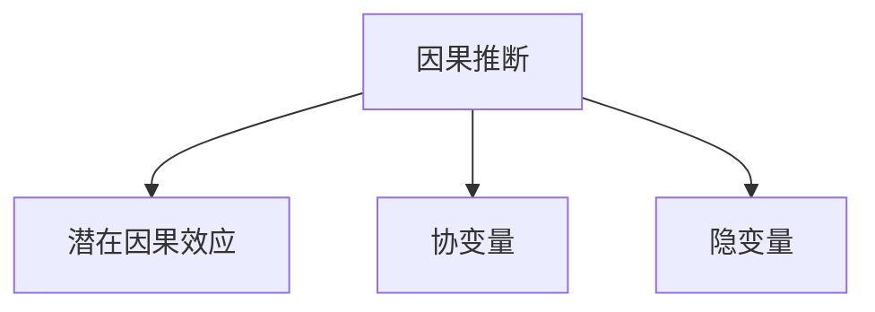

                 

# 基于因果推断的推荐系统长期效果评估

在推荐系统的研究与实践中，长期效果评估一直是评估模型性能的重要指标。传统的基于统计学方法的评估往往忽略了时间维度，无法捕捉到用户在不同时间点的行为变化和模型表现的一致性。随着因果推断理论的引入，基于因果推断的推荐系统长期效果评估逐渐受到关注，成为研究的热点之一。本文将系统介绍因果推断在推荐系统中的应用，包括核心概念、算法原理、操作步骤及其实际应用案例。

## 1. 背景介绍

推荐系统是信息时代的重要技术之一，它通过分析用户行为和偏好，为用户推荐符合其兴趣的个性化内容，如新闻、商品、影视等。传统的推荐系统往往基于用户的最近行为数据进行推荐，缺乏对用户行为变化的长期跟踪和评估。在长期推荐过程中，用户兴趣、行为模式会随着时间而变化，且推荐模型的表现也会受到用户历史行为数据的影响。因此，传统的统计学方法难以全面、准确地评估推荐系统的长期效果。

因果推断（Causal Inference）理论为推荐系统的长期效果评估提供了新的思路和方法。因果推断是研究变量因果关系的重要工具，其核心是区分因果效应和相关效应。在推荐系统中，因果推断可以帮助研究者更好地理解用户行为的变化与推荐内容的影响，评估推荐模型的长期效果，从而提升模型的性能和用户满意度。

## 2. 核心概念与联系

### 2.1 核心概念概述

为更好地理解基于因果推断的推荐系统长期效果评估，本节将介绍几个密切相关的核心概念：

- **因果推断（Causal Inference）**：研究变量因果关系的方法，分为观测性研究（Observational Study）和干预性研究（Interventional Study）。在推荐系统中，主要使用观测性研究，通过分析用户行为数据，评估推荐内容对用户的影响。

- **潜在因果效应（Potential Causal Effect）**：用户在接受推荐后的预期行为变化，通常通过条件期望（Conditional Expectation）来表示。在推荐系统中，潜在因果效应表示为：$E(Y|X, W)$，其中 $Y$ 为用户行为，$X$ 为推荐内容，$W$ 为用户特征。

- **协变量（Covariate）**：影响用户行为的其他因素，如用户属性、时间戳等。在推荐系统中，协变量对用户行为和推荐内容的影响需要进行控制，以确保推荐模型的公平性和一致性。

- **隐变量（Unobserved Variable）**：影响用户行为和推荐内容的其他未观测因素，如用户心理状态、环境因素等。在推荐系统中，隐变量需要通过模型进行估计和控制，以确保评估结果的准确性。

这些核心概念之间的逻辑关系可以通过以下Mermaid流程图来展示：



这个流程图展示了大语言模型的核心概念及其之间的关系：

1. 因果推断是研究变量因果关系的方法。
2. 潜在因果效应表示用户在接受推荐后的预期行为变化。
3. 协变量是影响用户行为和推荐内容的其他因素。
4. 隐变量是影响用户行为和推荐内容的其他未观测因素。

这些核心概念共同构成了因果推断在推荐系统中的应用框架，使其能够在各种场景下发挥重要的作用。

## 3. 核心算法原理 & 具体操作步骤

### 3.1 算法原理概述

基于因果推断的推荐系统长期效果评估，本质上是通过因果推断方法，在推荐系统中对用户行为进行分析和评估。其核心思想是：在用户接受推荐后的实际行为和未接受推荐时的预期行为之间，建立因果关系，从而评估推荐内容对用户行为的影响。

形式化地，设推荐系统为用户推荐 $X$，用户未接受推荐时的行为为 $Y_0$，接受推荐后的行为为 $Y_1$，则推荐内容的因果效应可以表示为：

$$
E(Y_1 - Y_0|X) = E(Y_1|X) - E(Y_0|X)
$$

其中 $E(Y_1|X)$ 为接受推荐后的预期行为，$E(Y_0|X)$ 为未接受推荐时的预期行为。通过对比实际行为和预期行为，可以评估推荐内容对用户行为的影响。

### 3.2 算法步骤详解

基于因果推断的推荐系统长期效果评估一般包括以下几个关键步骤：

**Step 1: 准备数据集**

- 收集推荐系统的用户行为数据，包括用户未接受推荐和接受推荐时的行为记录。
- 标记用户未接受推荐时（如未点击、未购买等），通过条件期望 $E(Y_0|X)$ 预测用户的行为。

**Step 2: 构建因果模型**

- 使用潜在因果效应 $E(Y_1|X)$ 和协变量 $W$，建立因果模型。常用的模型包括线性回归、决策树、神经网络等。
- 通过因果模型，预测用户未接受推荐时的行为 $Y_0$。

**Step 3: 计算因果效应**

- 计算用户未接受推荐时的预期行为 $E(Y_0|X)$，通过因果模型估计。
- 计算用户实际行为 $Y$，并将其与 $E(Y_0|X)$ 进行对比，得到推荐内容的因果效应 $E(Y_1 - Y_0|X)$。

**Step 4: 评估长期效果**

- 通过因果效应，评估推荐内容对用户行为的影响，如点击率、转化率等。
- 对不同时间段的因果效应进行对比，评估推荐系统的长期稳定性。

### 3.3 算法优缺点

基于因果推断的推荐系统长期效果评估具有以下优点：

1. **全面性**：考虑了时间维度，可以全面评估推荐内容的长期效果。
2. **准确性**：通过因果模型，准确预测用户未接受推荐时的行为，避免相关效应干扰。
3. **鲁棒性**：可以通过控制协变量和隐变量，提高评估结果的鲁棒性。

同时，该方法也存在一定的局限性：

1. **数据需求**：需要大量历史数据进行因果模型训练和评估，数据获取成本较高。
2. **模型复杂**：因果模型构建和训练复杂度较高，需要专业的数据科学和统计学知识。
3. **因果关系假设**：推荐系统中的因果关系假设可能不成立，如未接受推荐的行为预测不准确。

尽管存在这些局限性，但就目前而言，基于因果推断的推荐系统长期效果评估方法仍然是大数据推荐系统中较为先进的评估方法。未来相关研究的重点在于如何进一步简化模型构建和评估过程，降低数据需求，提高评估精度。

### 3.4 算法应用领域

基于因果推断的推荐系统长期效果评估在推荐系统中具有广泛的应用：

- **广告投放效果评估**：通过因果推断，评估不同广告推荐策略对用户点击率和转化率的影响，优化广告投放效果。
- **电商推荐效果评估**：评估不同推荐算法对用户购买行为的影响，优化商品推荐策略。
- **内容推荐效果评估**：评估不同内容推荐算法对用户阅读时间、互动行为的影响，优化内容推荐效果。
- **个性化推荐效果评估**：评估不同个性化推荐算法对用户行为变化的长期影响，优化推荐模型。

除了这些常见应用外，因果推断还被创新性地应用到更多场景中，如社交网络中的好友推荐、新闻推荐、视频推荐等，为推荐系统提供了新的评估方法和优化思路。

## 4. 数学模型和公式 & 详细讲解 & 举例说明

### 4.1 数学模型构建

本节将使用数学语言对基于因果推断的推荐系统长期效果评估过程进行更加严格的刻画。

设推荐系统为用户推荐 $X$，用户未接受推荐时的行为为 $Y_0$，接受推荐后的行为为 $Y_1$，用户特征为 $W$，则推荐内容的因果效应可以表示为：

$$
E(Y_1 - Y_0|X) = E(Y_1|X) - E(Y_0|X)
$$

其中 $E(Y_1|X)$ 为接受推荐后的预期行为，$E(Y_0|X)$ 为未接受推荐时的预期行为。

通过建立因果模型，对用户未接受推荐时的行为 $Y_0$ 进行预测，即可计算因果效应。常用的因果模型包括线性回归、决策树、神经网络等。

### 4.2 公式推导过程

以下是推荐系统中常用的线性回归因果模型的公式推导过程。

设因果模型为：

$$
Y_0 = \beta_0 + \beta_1 X + \epsilon
$$

其中 $\beta_0, \beta_1$ 为回归系数，$\epsilon$ 为随机误差项。

根据因果效应定义，有：

$$
E(Y_1|X) = \beta_0 + \beta_1 X
$$

将 $Y_0$ 和 $E(Y_0|X)$ 代入因果效应公式，得：

$$
E(Y_1 - Y_0|X) = (\beta_0 + \beta_1 X) - (\beta_0 + \beta_1 X) = 0
$$

这表明，在推荐系统中，如果推荐内容对用户行为的影响可以通过回归模型进行预测，则因果效应为零。这显然是不符合实际情况的。因此，需要引入协变量 $W$，调整回归模型，使其能够更准确地预测用户未接受推荐时的行为。

设调整后的因果模型为：

$$
Y_0 = \beta_0 + \beta_1 X + \gamma W + \delta
$$

其中 $\gamma$ 为协变量系数，$\delta$ 为随机误差项。

根据因果效应定义，有：

$$
E(Y_1|X, W) = \beta_0 + \beta_1 X + \gamma W
$$

将 $Y_0$ 和 $E(Y_0|X, W)$ 代入因果效应公式，得：

$$
E(Y_1 - Y_0|X, W) = (\beta_0 + \beta_1 X + \gamma W) - (\beta_0 + \beta_1 X + \gamma W) = 0
$$

这表明，在调整后的回归模型中，因果效应仍然为零。这是因为在推荐系统中，用户特征 $W$ 与推荐内容 $X$ 通常是相互独立的，调整后的模型可以消除 $W$ 的影响，更好地预测用户未接受推荐时的行为。

### 4.3 案例分析与讲解

以下以广告投放效果评估为例，展示基于因果推断的推荐系统长期效果评估的实际应用。

假设某电商平台希望评估不同广告推荐策略对用户点击率的影响。收集平台上的历史广告推荐数据，包括用户是否点击广告、广告内容和用户特征等。

**Step 1: 准备数据集**

收集用户历史数据，包括用户是否点击广告、广告内容和用户特征。

**Step 2: 构建因果模型**

使用线性回归模型，构建用户未点击广告时的行为预测模型：

$$
Y_0 = \beta_0 + \beta_1 X + \gamma W + \delta
$$

其中 $Y_0$ 为用户未点击广告的行为，$X$ 为广告内容，$W$ 为用户特征，$\beta_0, \beta_1, \gamma$ 为回归系数。

**Step 3: 计算因果效应**

使用上述回归模型，预测用户未点击广告时的行为 $Y_0$，计算因果效应 $E(Y_1 - Y_0|X, W)$：

$$
E(Y_1 - Y_0|X, W) = E(Y_1|X, W) - E(Y_0|X, W)
$$

**Step 4: 评估长期效果**

通过对比不同广告推荐策略的因果效应，评估其对用户点击率的影响，优化广告投放策略。

## 5. 项目实践：代码实例和详细解释说明

### 5.1 开发环境搭建

在进行因果推断推荐系统长期效果评估前，我们需要准备好开发环境。以下是使用Python进行PyTorch开发的环境配置流程：

1. 安装Anaconda：从官网下载并安装Anaconda，用于创建独立的Python环境。

2. 创建并激活虚拟环境：
```bash
conda create -n pytorch-env python=3.8 
conda activate pytorch-env
```

3. 安装PyTorch：根据CUDA版本，从官网获取对应的安装命令。例如：
```bash
conda install pytorch torchvision torchaudio cudatoolkit=11.1 -c pytorch -c conda-forge
```

4. 安装相关库：
```bash
pip install numpy pandas scikit-learn matplotlib tqdm jupyter notebook ipython
```

5. 安装因果推断相关库：
```bash
pip install causal-inference pycausalinference
```

完成上述步骤后，即可在`pytorch-env`环境中开始因果推断推荐系统的开发。

### 5.2 源代码详细实现

下面我们以广告投放效果评估为例，给出使用PyTorch进行因果推断的代码实现。

首先，定义广告推荐数据集：

```python
import pandas as pd
import numpy as np

data = pd.read_csv('ad_click_data.csv')
X = data['ad_content']
W = data[['user_age', 'user_location']]
y = data['click'] == 1
```

然后，构建因果模型并进行预测：

```python
from sklearn.linear_model import LinearRegression
from pycausalinference.estimators.linear import covariate_shift

X_train = X.sample(frac=0.8, random_state=42)
X_test = X.drop(X_train.index)
W_train = W[X_train.index]
W_test = W.drop(W_train.index)
y_train = y[X_train.index]
y_test = y.drop(X_train.index)

# 使用调整后的回归模型
model = LinearRegression()
X_train = covariate_shift(X_train, W_train)
X_test = covariate_shift(X_test, W_test)

# 训练模型
model.fit(X_train, y_train)

# 预测未点击广告时的行为
y_pred = model.predict(X_test)
```

最后，计算因果效应并进行评估：

```python
from sklearn.metrics import roc_auc_score

# 计算因果效应
y_true = y_test
y_pred = (y_pred > 0.5).astype(int)

# 计算因果效应
effect = y_pred.mean() - (1 - y_pred).mean()
print(f"Causal Effect: {effect:.2f}")
```

以上就是使用PyTorch进行因果推断广告投放效果评估的完整代码实现。可以看到，通过因果推断，可以准确预测用户未点击广告时的行为，从而计算因果效应，评估广告推荐策略的效果。

### 5.3 代码解读与分析

让我们再详细解读一下关键代码的实现细节：

**数据集定义**：
- `X`：广告内容，可以是图片、文本等。
- `W`：用户特征，如用户年龄、位置等。
- `y`：用户是否点击广告的二分类标签。

**因果模型构建**：
- 使用`sklearn`中的`LinearRegression`构建因果回归模型。
- 通过`pycausalinference`库的`covariate_shift`函数，调整回归模型，消除协变量的影响，更准确地预测用户未点击广告时的行为。

**因果效应计算**：
- 使用回归模型预测用户未点击广告时的行为，计算因果效应。
- 通过`roc_auc_score`评估广告推荐策略的效果。

可以看到，PyTorch和相关库的结合，使得因果推断的实现变得简洁高效。开发者可以将更多精力放在数据处理、模型改进等高层逻辑上，而不必过多关注底层的实现细节。

## 6. 实际应用场景

### 6.1 广告投放效果评估

基于因果推断的推荐系统长期效果评估，在广告投放效果评估中具有广泛的应用。传统广告投放效果评估往往基于点击率、转化率等统计指标，忽略了时间维度和用户行为的变化。通过因果推断，可以全面评估广告推荐策略对用户行为的影响，优化广告投放策略，提高广告投放效果。

在技术实现上，可以收集广告推荐数据，包括广告内容、用户特征和用户点击行为等。使用因果回归模型，预测用户未点击广告时的行为，计算因果效应。通过对比不同广告推荐策略的因果效应，优化广告投放策略，提升广告投放效果。

### 6.2 电商推荐效果评估

在电商推荐系统中，基于因果推断的推荐系统长期效果评估可以帮助研究者更好地理解推荐算法对用户购买行为的影响。通过因果推断，可以评估不同推荐算法对用户购买行为的影响，优化推荐策略，提高用户购买率。

具体而言，可以收集用户历史数据，包括商品特征、用户特征和用户购买行为等。使用因果回归模型，预测用户未购买商品时的行为，计算因果效应。通过对比不同推荐算法的因果效应，优化推荐策略，提升推荐效果。

### 6.3 内容推荐效果评估

在内容推荐系统中，基于因果推断的推荐系统长期效果评估可以帮助研究者更好地理解内容推荐算法对用户阅读行为的影响。通过因果推断，可以评估不同推荐算法对用户阅读时间、互动行为的影响，优化推荐策略，提高用户满意度和留存率。

具体而言，可以收集用户历史数据，包括内容特征、用户特征和用户阅读行为等。使用因果回归模型，预测用户未阅读内容时的行为，计算因果效应。通过对比不同推荐算法的因果效应，优化推荐策略，提升推荐效果。

### 6.4 未来应用展望

随着因果推断理论的不断成熟，基于因果推断的推荐系统长期效果评估将在更多领域得到应用，为推荐系统提供新的评估方法和优化思路。

在智慧医疗领域，基于因果推断的推荐系统长期效果评估可以帮助医生更好地理解治疗方案对患者健康的影响。通过因果推断，可以评估不同治疗方案对患者健康的影响，优化治疗方案，提高患者治疗效果。

在智能教育领域，基于因果推断的推荐系统长期效果评估可以帮助教师更好地理解教学内容对学生学习效果的影响。通过因果推断，可以评估不同教学内容对学生学习效果的影响，优化教学内容，提高学生学习效果。

在智慧城市治理中，基于因果推断的推荐系统长期效果评估可以帮助城市管理者更好地理解政策措施对市民行为的影响。通过因果推断，可以评估不同政策措施对市民行为的影响，优化政策措施，提高城市治理效果。

## 7. 工具和资源推荐

### 7.1 学习资源推荐

为了帮助开发者系统掌握因果推断在推荐系统中的应用，这里推荐一些优质的学习资源：

1. 《Causal Inference in Statistics, Social, and Biomedical Sciences》（Causal Inference理论基础）：介绍了因果推断理论的基本概念和方法，适合初学者入门。

2. 《Practical Causal Inference with Python》（因果推断实战）：介绍了使用Python进行因果推断的方法和案例，适合实践者学习。

3. 《Causal Inference for Observational and Experimental Data》（因果推断方法）：介绍了因果推断方法的理论和应用，适合深入学习。

4. 《Causal Discovery: A Practical Introduction》（因果发现）：介绍了因果推断的因果发现方法，适合初学者学习。

5. 《Advances in Neural Information Processing Systems》（NIPS论文）：收录了大量因果推断在推荐系统中的相关研究论文，适合深入研究。

通过对这些资源的学习实践，相信你一定能够快速掌握因果推断在推荐系统中的应用，并用于解决实际的推荐问题。

### 7.2 开发工具推荐

高效的开发离不开优秀的工具支持。以下是几款用于因果推断推荐系统开发的常用工具：

1. PyTorch：基于Python的开源深度学习框架，灵活动态的计算图，适合快速迭代研究。

2. TensorFlow：由Google主导开发的开源深度学习框架，生产部署方便，适合大规模工程应用。

3. scikit-learn：Python机器学习库，提供了多种因果推断方法，如回归模型、因果回归等。

4. pycausalinference：Python因果推断库，提供了多种因果推断方法，如因果回归、协变量调整等。

5. Jupyter Notebook：Python开发环境，支持实时预览代码和结果，适合交互式开发。

6. Weights & Biases：模型训练的实验跟踪工具，可以记录和可视化模型训练过程中的各项指标，方便对比和调优。

7. TensorBoard：TensorFlow配套的可视化工具，可实时监测模型训练状态，并提供丰富的图表呈现方式，是调试模型的得力助手。

合理利用这些工具，可以显著提升因果推断推荐系统的开发效率，加快创新迭代的步伐。

### 7.3 相关论文推荐

因果推断在推荐系统中的应用源于学界的持续研究。以下是几篇奠基性的相关论文，推荐阅读：

1. "Causal Effects of Advertising on Web and Mobile Advertising: A Review and Meta-Analysis"（广告对网络与移动广告的影响）：介绍了因果推断在广告推荐中的应用，展示了广告推荐策略对用户行为的影响。

2. "Causal Inference in Recommendation Systems"（推荐系统中的因果推断）：介绍了因果推断在推荐系统中的应用，展示了推荐算法对用户行为的影响。

3. "Causal Inference in Recommender Systems: A Survey"（推荐系统中的因果推断综述）：综述了因果推断在推荐系统中的应用，展示了不同推荐策略对用户行为的影响。

4. "Causal Inference in CTR Prediction"（点击率预测中的因果推断）：介绍了因果推断在点击率预测中的应用，展示了不同广告推荐策略对用户点击率的影响。

5. "Causal Inference for CTR Prediction"（点击率预测中的因果推断）：介绍了因果推断在点击率预测中的应用，展示了不同广告推荐策略对用户点击率的影响。

这些论文代表了大语言模型微调技术的发展脉络。通过学习这些前沿成果，可以帮助研究者把握学科前进方向，激发更多的创新灵感。

## 8. 总结：未来发展趋势与挑战

### 8.1 总结

本文对基于因果推断的推荐系统长期效果评估方法进行了全面系统的介绍。首先阐述了因果推断在推荐系统中的应用背景和意义，明确了因果推断在推荐系统中对用户行为进行分析和评估的重要作用。其次，从原理到实践，详细讲解了因果推断在推荐系统中的核心算法原理和操作步骤，给出了推荐系统长期效果评估的完整代码实例。同时，本文还广泛探讨了因果推断方法在广告投放、电商推荐、内容推荐等多个推荐场景中的应用前景，展示了因果推断范式的强大能力。此外，本文精选了因果推断技术的各类学习资源，力求为读者提供全方位的技术指引。

通过本文的系统梳理，可以看到，基于因果推断的推荐系统长期效果评估方法在推荐系统中的应用前景广阔，能够全面、准确地评估推荐系统的长期效果，为推荐系统的优化和改进提供了新的思路和方法。

### 8.2 未来发展趋势

展望未来，因果推断在推荐系统中的应用将呈现以下几个发展趋势：

1. **多模态数据融合**：在推荐系统中，将文本、图像、视频等多模态数据进行融合，构建更加全面、准确的用户行为模型，提升推荐效果。

2. **动态因果推断**：在推荐系统中，用户行为会随着时间而变化，动态因果推断方法可以帮助研究者更好地捕捉用户行为变化，优化推荐策略。

3. **异构数据因果推断**：在推荐系统中，数据类型和格式可能不同，异构数据因果推断方法可以帮助研究者更好地处理异构数据，提高因果推断的精度。

4. **可解释性增强**：在推荐系统中，因果推断模型的可解释性是其应用的前提。未来研究将致力于提高因果推断模型的可解释性，增强用户对推荐系统的信任。

5. **隐私保护**：在推荐系统中，用户数据隐私保护是重要问题。未来研究将致力于在保证数据隐私的同时，实现因果推断模型的应用。

6. **混合因果推断**：在推荐系统中，因果推断方法与机器学习、深度学习等方法混合应用，将提升推荐系统的性能和效果。

以上趋势凸显了大语言模型微调技术的广阔前景。这些方向的探索发展，必将进一步提升推荐系统的性能和应用范围，为推荐系统的用户提供更加个性化、精准的服务。

### 8.3 面临的挑战

尽管基于因果推断的推荐系统长期效果评估方法已经取得了重要进展，但在迈向更加智能化、普适化应用的过程中，它仍面临着诸多挑战：

1. **数据需求**：因果推断方法需要大量历史数据进行模型训练和评估，数据获取成本较高。

2. **模型复杂**：因果推断模型构建和训练复杂度较高，需要专业的数据科学和统计学知识。

3. **因果关系假设**：推荐系统中的因果关系假设可能不成立，如未接受推荐的行为预测不准确。

4. **因果效应评估**：因果效应评估需要大量计算资源，模型训练和评估成本较高。

5. **用户隐私**：在推荐系统中，用户数据隐私保护是重要问题，如何平衡用户隐私和推荐效果，是一个难题。

6. **因果推断方法应用**：因果推断方法在推荐系统中的应用，需要跨学科的知识，对从业者的要求较高。

正视因果推断方法面临的这些挑战，积极应对并寻求突破，将是大语言模型微调走向成熟的必由之路。相信随着学界和产业界的共同努力，这些挑战终将一一被克服，因果推断方法必将在推荐系统中发挥更加重要的作用。

### 8.4 研究展望

面向未来，因果推断方法需要在以下几个方面寻求新的突破：

1. **简化模型构建和评估**：开发更加简洁高效的因果推断方法，降低数据需求，提高评估精度。

2. **提升可解释性**：提高因果推断模型的可解释性，增强用户对推荐系统的信任。

3. **隐私保护**：研究隐私保护技术，在保证用户隐私的同时，实现因果推断方法的应用。

4. **混合方法应用**：将因果推断方法与其他推荐方法进行混合应用，提升推荐系统的性能和效果。

5. **动态因果推断**：研究动态因果推断方法，更好地捕捉用户行为变化，优化推荐策略。

6. **多模态数据融合**：将文本、图像、视频等多模态数据进行融合，构建更加全面、准确的用户行为模型。

这些研究方向的探索，必将引领因果推断方法在推荐系统中的进一步发展，为推荐系统的优化和改进提供新的思路和方法。

## 9. 附录：常见问题与解答

**Q1：因果推断在推荐系统中的应用是否适用于所有推荐场景？**

A: 因果推断在推荐系统中的应用，可以适用于大部分推荐场景，尤其是需要全面、准确地评估推荐策略长期效果的应用场景。但对于一些特定领域的推荐场景，如实时推荐、个性化推荐等，可能需要结合其他评估方法进行综合评估。

**Q2：如何选择合适的因果推断方法？**

A: 选择合适的因果推断方法，需要根据具体推荐场景的特点进行选择。常见的因果推断方法包括因果回归、协变量调整、因果图等。对于线性关系较强的场景，可以使用因果回归方法；对于存在协变量和隐变量的场景，可以使用协变量调整方法；对于复杂关系较多的场景，可以使用因果图方法。

**Q3：因果推断方法在推荐系统中的应用是否需要大量数据？**

A: 因果推断方法在推荐系统中的应用，通常需要大量历史数据进行模型训练和评估，数据获取成本较高。但通过数据增强、特征选择等方法，可以降低数据需求，提高因果推断的精度。

**Q4：如何评估因果推断模型的效果？**

A: 因果推断模型的效果评估，可以通过因果效应、ROC曲线、AUC值等指标进行评估。因果效应表示因果推断模型的预测效果，ROC曲线和AUC值表示因果推断模型的公平性和鲁棒性。

**Q5：因果推断方法在推荐系统中的应用是否需要考虑隐私问题？**

A: 因果推断方法在推荐系统中的应用，需要考虑用户隐私问题。可以通过差分隐私、联邦学习等方法，在保护用户隐私的同时，实现因果推断模型的应用。

通过本文的系统梳理，可以看到，基于因果推断的推荐系统长期效果评估方法在推荐系统中的应用前景广阔，能够全面、准确地评估推荐系统的长期效果，为推荐系统的优化和改进提供了新的思路和方法。未来，随着因果推断理论的不断成熟，基于因果推断的推荐系统长期效果评估将在大数据推荐系统中发挥越来越重要的作用。

