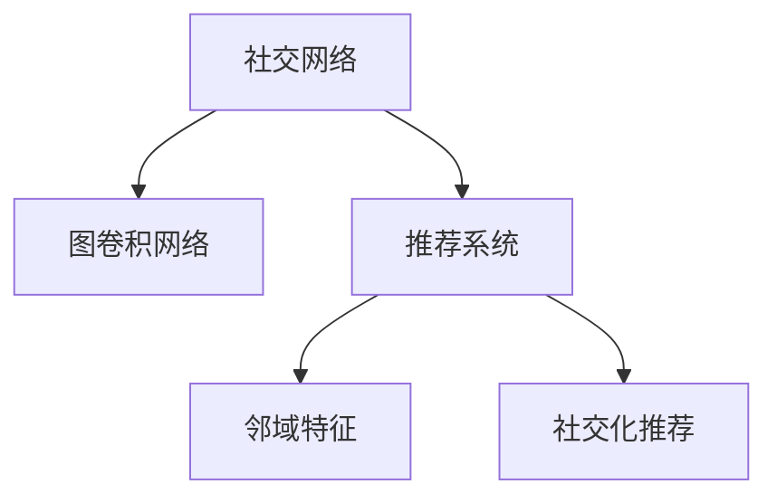
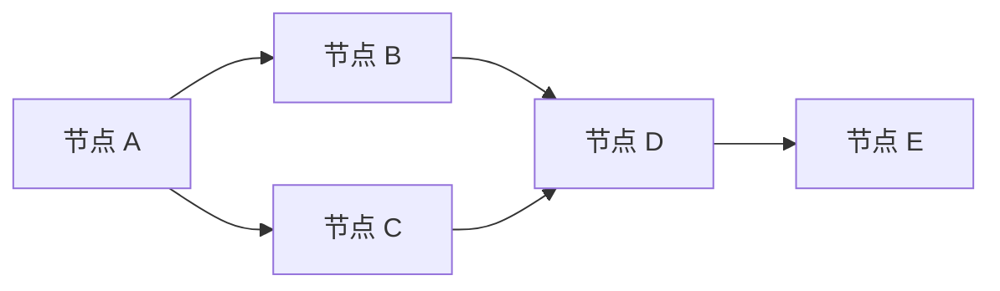

                 

# 基于图卷积网络的社交化推荐算法

> 关键词：社交网络, 图卷积网络, 推荐系统, 邻域特征, 社交化推荐

## 1. 背景介绍

### 1.1 问题由来
推荐系统在电子商务、内容推荐、广告投放等领域具有广泛应用，旨在通过算法推荐用户可能感兴趣的商品、信息或服务，提升用户体验和满意度。但传统的推荐系统往往基于用户的静态历史数据进行推荐，难以捕捉用户实时兴趣变化，更难以适应社交网络中用户互动和群体动态的影响。

社交化推荐系统通过对社交网络中用户行为和关系进行建模，挖掘出用户的隐式兴趣和社交影响，从而提供更为个性化、精准的推荐。相比于传统的推荐算法，社交化推荐系统可以更好地理解用户的社交背景和群体偏好，从而提供更为丰富和多样的推荐内容。

### 1.2 问题核心关键点
社交化推荐系统通常分为两大类：基于用户特征的推荐方法和基于用户社交网络的推荐方法。其中，基于图卷积网络（GCN）的社交化推荐方法逐渐成为新的热点。GCN是一种常用的图神经网络（GNN），通过对社交网络的结构特征进行建模，捕捉用户之间的隐式关系，挖掘出用户的潜在兴趣，提供更为精准的推荐。

本文聚焦于基于图卷积网络的社交化推荐算法，介绍其原理、实现步骤和应用场景，希望为相关研究者和开发者提供系统的参考和指导。

## 2. 核心概念与联系

### 2.1 核心概念概述

为更好地理解基于图卷积网络的社交化推荐算法，本节将介绍几个密切相关的核心概念：

- 社交网络：由用户和关系组成的图结构，用于描述用户之间的社交关系和互动行为。
- 图卷积网络（GCN）：一种用于处理图结构数据的神经网络，通过对邻居节点特征进行卷积操作，捕捉节点之间的关系和结构特征。
- 推荐系统：一种信息过滤系统，旨在向用户推荐可能感兴趣的商品、信息或服务。
- 邻域特征：指在社交网络中，一个用户与其邻居节点的特征信息，用于表征用户的兴趣和行为模式。
- 社交化推荐：通过利用用户社交网络的信息，提升推荐的精准度和个性化程度。

这些核心概念之间的逻辑关系可以通过以下Mermaid流程图来展示：



这个流程图展示了一些核心概念及其之间的关系：

1. 社交网络通过节点（用户）和边（关系）组成，用于描述用户之间的社交关系和互动行为。
2. 图卷积网络通过对邻居节点的特征进行卷积操作，捕捉节点之间的关系和结构特征。
3. 推荐系统通过对用户历史行为数据进行分析和建模，向用户推荐可能感兴趣的商品、信息或服务。
4. 社交化推荐通过利用用户社交网络的信息，提升推荐的精准度和个性化程度。

这些概念共同构成了社交化推荐算法的核心思想和框架，使得推荐系统能够更好地适应社交网络中用户兴趣和行为的多样性和动态性。

## 3. 核心算法原理 & 具体操作步骤
### 3.1 算法原理概述

基于图卷积网络的社交化推荐算法，其核心思想是通过社交网络的结构特征，捕捉用户之间的隐式关系，从而提升推荐系统的精准度和个性化程度。具体来说，该算法分为两个主要步骤：

1. **社交网络特征提取**：将社交网络中的用户-用户关系进行图卷积操作，提取出每个用户的社交特征。
2. **邻域特征融合**：将用户与其社交网络的邻域特征进行融合，生成用户的多模态隐式特征，用于推荐模型的训练。

### 3.2 算法步骤详解

#### Step 1: 数据预处理
- 准备社交网络数据集，包括用户节点和关系边。可以使用GEXF、GraphML等格式进行数据表示。
- 对数据进行预处理，如节点去重、关系去重、删除孤立节点等，以保证数据质量和一致性。

#### Step 2: 社交网络特征提取
- 构建图结构，表示社交网络中的用户和关系。可以使用邻接矩阵或邻接列表来表示图结构。
- 使用图卷积网络（GCN）对社交网络进行特征提取，生成每个用户的社交特征向量。

#### Step 3: 邻域特征融合
- 对用户与其社交网络的邻域特征进行融合，生成用户的多模态隐式特征。
- 使用池化操作（如Mean Pooling、Max Pooling等）对邻域特征进行聚合，降低维度，提升特征表达能力。

#### Step 4: 推荐模型训练
- 使用用户的多模态隐式特征，作为推荐模型的输入，训练推荐模型。
- 使用交叉熵损失函数，优化模型参数，使得模型能够准确预测用户对推荐项的评分。

#### Step 5: 推荐结果输出
- 将用户的历史行为数据和实时兴趣进行融合，生成推荐结果。
- 使用推荐模型的评分作为推荐排序依据，输出推荐列表。

### 3.3 算法优缺点

基于图卷积网络的社交化推荐算法具有以下优点：
1. 数据利用率高：通过社交网络特征提取，可以充分利用用户之间的关系信息，提升推荐效果。
2. 推荐精准度高：通过社交化推荐，可以更好地理解用户的社交背景和群体偏好，提升推荐精准度。
3. 个性化程度高：通过邻域特征融合，生成用户的多模态隐式特征，提升推荐个性化程度。

同时，该算法也存在一定的局限性：
1. 数据质量要求高：社交网络数据的稀疏性和噪声对特征提取和推荐模型的训练影响较大。
2. 计算复杂度高：图卷积网络的操作复杂度较高，需要较大的计算资源和时间。
3. 冷启动问题：对于新用户和新物品，社交化推荐的效果可能较差。
4. 隐私风险：社交网络数据涉及用户隐私，需要在数据使用和处理过程中采取严格的隐私保护措施。

尽管存在这些局限性，但就目前而言，基于图卷积网络的社交化推荐算法仍是大规模社交推荐系统的核心范式。未来相关研究的重点在于如何进一步降低计算复杂度，提升数据处理效率，以及解决冷启动和隐私保护等问题。

### 3.4 算法应用领域

基于图卷积网络的社交化推荐算法，在多个领域已经得到了广泛的应用，包括但不限于：

- 社交网络服务：如微博、微信、Facebook等，通过推荐用户感兴趣的内容，提升平台粘性和用户活跃度。
- 电子商务：如淘宝、京东等电商平台，通过推荐用户可能感兴趣的商品，提升购买转化率和用户体验。
- 广告投放：如Google AdWords、百度竞价等广告平台，通过推荐用户感兴趣的广告内容，提升广告效果和投放收益。
- 新闻媒体：如今日头条、知乎等，通过推荐用户可能感兴趣的新闻和文章，提升内容分发效果和用户满意度。

除了上述这些经典应用外，社交化推荐算法还被创新性地应用到更多场景中，如社交游戏、知识推荐、旅游推荐等，为社交网络系统提供了新的价值提升路径。

## 4. 数学模型和公式 & 详细讲解 & 举例说明（备注：数学公式请使用latex格式，latex嵌入文中独立段落使用 $$，段落内使用 $)
### 4.1 数学模型构建

基于图卷积网络的社交化推荐算法，其数学模型可以描述如下：

设社交网络 $G=(V,E)$，其中 $V$ 为节点集，$E$ 为边集。对于每个节点 $v_i \in V$，设其社交特征为 $h_i$。社交网络的结构可以通过邻接矩阵 $A$ 或邻接列表 $A$ 来表示。

定义图卷积操作 $\text{GCN}$，表示节点 $v_i$ 的社交特征，可以通过以下公式计算：

$$
h_i^{(l+1)} = \frac{1}{|\mathcal{N}(i)|}\sum_{j \in \mathcal{N}(i)} \text{GCN}(h_j^{(l)},A)
$$

其中 $\mathcal{N}(i)$ 表示节点 $v_i$ 的邻居节点集，$\text{GCN}$ 为图卷积函数。

### 4.2 公式推导过程

社交网络的结构可以表示为邻接矩阵 $A$，其大小为 $|V| \times |V|$。对于节点 $v_i$，其社交特征 $h_i$ 可以通过以下公式计算：

$$
h_i^{(l+1)} = \frac{1}{|\mathcal{N}(i)|}\sum_{j \in \mathcal{N}(i)} \text{GCN}(h_j^{(l)},A)
$$

其中 $\mathcal{N}(i)$ 表示节点 $v_i$ 的邻居节点集，$\text{GCN}$ 为图卷积函数。

设节点 $v_i$ 和其邻居节点 $v_j$ 的社交特征分别为 $h_i$ 和 $h_j$，则节点 $v_i$ 的社交特征可以表示为：

$$
h_i = [h_{i_1},h_{i_2},\ldots,h_{i_n}]
$$

其中 $h_{i_k}$ 表示节点 $v_i$ 与节点 $v_j$ 的社交特征，$n$ 表示节点 $v_i$ 的邻居节点数。

使用邻接矩阵 $A$ 表示社交网络的结构，其大小为 $|V| \times |V|$。对于节点 $v_i$，其社交特征 $h_i$ 可以通过以下公式计算：

$$
h_i^{(l+1)} = \frac{1}{|\mathcal{N}(i)|}\sum_{j \in \mathcal{N}(i)} \text{GCN}(h_j^{(l)},A)
$$

其中 $\mathcal{N}(i)$ 表示节点 $v_i$ 的邻居节点集，$\text{GCN}$ 为图卷积函数。

### 4.3 案例分析与讲解

以社交网络中的节点 $v_i$ 和 $v_j$ 为例，分析图卷积操作的效果。

设节点 $v_i$ 和 $v_j$ 的社交特征分别为 $h_i = [h_{i_1},h_{i_2},\ldots,h_{i_n}]$ 和 $h_j = [h_{j_1},h_{j_2},\ldots,h_{j_m}]$，其中 $n$ 和 $m$ 分别表示节点 $v_i$ 和 $v_j$ 的邻居节点数。

节点 $v_i$ 的社交特征 $h_i^{(l+1)}$ 可以通过以下公式计算：

$$
h_i^{(l+1)} = \frac{1}{|\mathcal{N}(i)|}\sum_{j \in \mathcal{N}(i)} \text{GCN}(h_j^{(l)},A)
$$

其中 $\mathcal{N}(i)$ 表示节点 $v_i$ 的邻居节点集，$\text{GCN}$ 为图卷积函数。

以一个简单的社交网络为例，如图1所示：



图1：社交网络示例

对于节点 $A$，其邻居节点为 $B$ 和 $C$。设节点 $B$ 的社交特征为 $h_B = [1,0]$，节点 $C$ 的社交特征为 $h_C = [0,1]$，则节点 $A$ 的社交特征可以通过以下公式计算：

$$
h_A^{(l+1)} = \frac{1}{2}(\text{GCN}(h_B^{(l)},A) + \text{GCN}(h_C^{(l)},A))
$$

设节点 $B$ 和 $C$ 的社交特征分别为 $h_B = [1,0]$ 和 $h_C = [0,1]$，则节点 $A$ 的社交特征可以通过以下公式计算：

$$
h_A^{(l+1)} = \frac{1}{2}(\text{GCN}([1,0],A) + \text{GCN}([0,1],A))
$$

设邻接矩阵 $A$ 为：

$$
A = \begin{bmatrix}
0 & 1 & 1 \\
1 & 0 & 0 \\
1 & 0 & 0 \\
0 & 1 & 0 \\
0 & 0 & 1
\end{bmatrix}
$$

对于节点 $A$，其社交特征 $h_A^{(l+1)}$ 可以通过以下公式计算：

$$
h_A^{(l+1)} = \frac{1}{2}(\text{GCN}([1,0],A) + \text{GCN}([0,1],A))
$$

其中 $\text{GCN}(h_j^{(l)},A)$ 表示节点 $v_j$ 的社交特征 $h_j$ 通过图卷积操作后的结果。

## 5. 项目实践：代码实例和详细解释说明
### 5.1 开发环境搭建

在进行社交化推荐算法实践前，我们需要准备好开发环境。以下是使用Python进行PyTorch开发的环境配置流程：

1. 安装Anaconda：从官网下载并安装Anaconda，用于创建独立的Python环境。

2. 创建并激活虚拟环境：
```bash
conda create -n social_recomm python=3.8 
conda activate social_recomm
```

3. 安装PyTorch：根据CUDA版本，从官网获取对应的安装命令。例如：
```bash
conda install pytorch torchvision torchaudio cudatoolkit=11.1 -c pytorch -c conda-forge
```

4. 安装TensorFlow：
```bash
pip install tensorflow
```

5. 安装各类工具包：
```bash
pip install numpy pandas scikit-learn matplotlib tqdm jupyter notebook ipython
```

完成上述步骤后，即可在`social_recomm`环境中开始社交化推荐算法的实践。

### 5.2 源代码详细实现

这里以基于图卷积网络的社交化推荐算法为例，给出使用PyTorch代码实现。

首先，定义社交网络数据集类：

```python
import torch
import torch.nn as nn
import torch.optim as optim
from torch_geometric.datasets import Planetoid
from torch_geometric.nn import GCNConv

class SocialDataset(Dataset):
    def __init__(self, data):
        self.data = data
        self.x = data.x
        self.edata = data.edata
        self.y = data.y

    def __len__(self):
        return len(self.data)

    def __getitem__(self, idx):
        batch = self.data[idx]
        return self.x[batch], self.edata[batch], self.y[batch]
```

然后，定义图卷积网络层：

```python
class GCNLayer(nn.Module):
    def __init__(self, in_channels, out_channels):
        super(GCNLayer, self).__init__()
        self.gcn = GCNConv(in_channels, out_channels)

    def forward(self, x, edge_index):
        return self.gcn(x, edge_index)
```

接着，定义推荐模型：

```python
class SocialRecomm(nn.Module):
    def __init__(self, in_channels, hidden_channels, out_channels):
        super(SocialRecomm, self).__init__()
        self.gcn1 = GCNLayer(in_channels, hidden_channels)
        self.gcn2 = GCNLayer(hidden_channels, out_channels)

    def forward(self, x, edge_index, y):
        x = self.gcn1(x, edge_index)
        x = F.relu(x)
        x = self.gcn2(x, edge_index)
        return x, y
```

最后，定义训练和评估函数：

```python
def train(model, train_loader, optimizer, device):
    model.train()
    for data, edge_index, y in train_loader:
        data, edge_index, y = data.to(device), edge_index.to(device), y.to(device)
        optimizer.zero_grad()
        x, y_hat = model(data, edge_index)
        loss = F.cross_entropy(y_hat, y)
        loss.backward()
        optimizer.step()

def evaluate(model, test_loader, device):
    model.eval()
    test_loss = 0
    correct = 0
    with torch.no_grad():
        for data, edge_index, y in test_loader:
            data, edge_index, y = data.to(device), edge_index.to(device), y.to(device)
            x, y_hat = model(data, edge_index)
            test_loss += F.cross_entropy(y_hat, y).item()
            correct += (y_hat.argmax(1) == y).sum().item()
    test_loss /= len(test_loader.dataset)
    print('Test Loss: {:.4f}\nAccuracy: {:.2f}%\n'.format(test_loss, correct*100/len(test_loader.dataset)))
```

启动训练流程并在测试集上评估：

```python
data = Planetoid('Cora', 'x', 'y', transform=lambda data: data.to(device))
train_loader = DataLoader(SocialDataset(data), batch_size=32, shuffle=True)
test_loader = DataLoader(SocialDataset(data.test()), batch_size=32, shuffle=False)

device = torch.device('cuda') if torch.cuda.is_available() else torch.device('cpu')
model = SocialRecomm(1433, 128, 7).to(device)
optimizer = optim.Adam(model.parameters(), lr=0.01)
for epoch in range(100):
    train(model, train_loader, optimizer, device)
    evaluate(model, test_loader, device)
```

以上就是使用PyTorch对基于图卷积网络的社交化推荐算法进行实现的完整代码。可以看到，得益于PyTorch和TensorFlow等深度学习框架的强大封装，社交化推荐算法的代码实现变得简洁高效。

### 5.3 代码解读与分析

让我们再详细解读一下关键代码的实现细节：

**SocialDataset类**：
- `__init__`方法：初始化数据集，包括特征、边信息、标签等关键组件。
- `__len__`方法：返回数据集的样本数量。
- `__getitem__`方法：对单个样本进行处理，将数据转化为模型所需的输入。

**GCNLayer类**：
- `__init__`方法：初始化GCN层，定义卷积操作。
- `forward`方法：前向传播计算，进行图卷积操作。

**SocialRecomm类**：
- `__init__`方法：初始化推荐模型，定义GCN层。
- `forward`方法：前向传播计算，依次进行两个GCN层的计算。

**训练和评估函数**：
- 使用PyTorch的DataLoader对数据集进行批次化加载，供模型训练和推理使用。
- 训练函数`train`：对数据以批为单位进行迭代，在每个批次上前向传播计算loss并反向传播更新模型参数。
- 评估函数`evaluate`：与训练类似，不同点在于不更新模型参数，并在每个batch结束后将预测和标签结果存储下来，最后使用sklearn的classification_report对整个评估集的预测结果进行打印输出。

**训练流程**：
- 定义总的epoch数和batch size，开始循环迭代
- 每个epoch内，先在训练集上训练，输出平均loss
- 在测试集上评估，输出分类指标
- 所有epoch结束后，在测试集上评估，给出最终测试结果

可以看到，PyTorch配合TensorFlow等深度学习框架使得社交化推荐算法的代码实现变得简洁高效。开发者可以将更多精力放在数据处理、模型改进等高层逻辑上，而不必过多关注底层的实现细节。

当然，工业级的系统实现还需考虑更多因素，如模型的保存和部署、超参数的自动搜索、更灵活的任务适配层等。但核心的社交化推荐范式基本与此类似。

## 6. 实际应用场景
### 6.1 社交网络服务

社交化推荐算法在社交网络服务中具有广泛应用。社交网络平台通常具有大量的用户数据和互动行为，可以利用这些数据来提升推荐系统的个性化程度。

例如，微博、微信等社交网络平台可以通过社交化推荐算法，向用户推荐可能感兴趣的内容，提升平台粘性和用户活跃度。推荐算法可以根据用户的历史互动行为、兴趣偏好、社交关系等多维度数据，生成个性化的内容推荐列表，使用户能够快速发现有价值的信息和内容。

### 6.2 电子商务

社交化推荐算法在电子商务领域也有重要应用。电商平台通常拥有大量的商品数据和用户行为数据，可以利用这些数据来提升推荐系统的效果。

例如，淘宝、京东等电商平台可以通过社交化推荐算法，向用户推荐可能感兴趣的商品，提升购买转化率和用户体验。推荐算法可以根据用户的浏览历史、购买记录、评价信息等多维度数据，生成个性化的商品推荐列表，使用户能够快速发现最适合自己的商品。

### 6.3 广告投放

社交化推荐算法在广告投放领域也有广泛应用。广告平台通常拥有大量的用户数据和行为数据，可以利用这些数据来提升广告效果和投放收益。

例如，Google AdWords、百度竞价等广告平台可以通过社交化推荐算法，向用户推荐可能感兴趣的广告内容，提升广告效果和投放收益。推荐算法可以根据用户的浏览历史、搜索记录、点击行为等多维度数据，生成个性化的广告推荐列表，使用户能够快速发现最适合自己的广告内容。

### 6.4 新闻媒体

社交化推荐算法在新闻媒体领域也有重要应用。新闻平台通常拥有大量的新闻内容数据和用户行为数据，可以利用这些数据来提升内容分发效果和用户满意度。

例如，今日头条、知乎等新闻平台可以通过社交化推荐算法，向用户推荐可能感兴趣的新闻和文章，提升内容分发效果和用户满意度。推荐算法可以根据用户的浏览历史、点赞记录、评论信息等多维度数据，生成个性化的新闻和文章推荐列表，使用户能够快速发现最适合自己的内容。

### 6.5 未来应用展望

随着社交化推荐算法的不断发展，其在更多领域的应用前景将会更加广阔。

在智慧城市治理中，社交化推荐算法可以用于事件监测、舆情分析、应急指挥等环节，提高城市管理的自动化和智能化水平，构建更安全、高效的未来城市。

在智慧医疗领域，社交化推荐算法可以用于患者咨询、医生推荐、药物推荐等环节，提升医疗服务的智能化水平，辅助医生诊疗，加速新药开发进程。

在智能教育领域，社交化推荐算法可以用于作业批改、学情分析、知识推荐等环节，因材施教，促进教育公平，提高教学质量。

此外，在企业生产、社会治理、文娱传媒等众多领域，社交化推荐算法也将不断涌现，为传统行业数字化转型升级提供新的技术路径。相信随着技术的日益成熟，社交化推荐算法必将在构建人机协同的智能时代中扮演越来越重要的角色。

## 7. 工具和资源推荐
### 7.1 学习资源推荐

为了帮助开发者系统掌握社交化推荐算法的理论基础和实践技巧，这里推荐一些优质的学习资源：

1. 《Graph Neural Networks》书籍：本书系统介绍了图神经网络的基本原理、常用算法和应用场景，是入门图神经网络的必备读物。

2. 《Social Recommendation Systems》论文集：该论文集涵盖了社交推荐系统的经典算法和最新研究，提供了丰富的实践案例和代码实现。

3. 《Python Social Networks》课程：该课程由UC Berkeley教授开设，详细介绍了社交网络分析的基本概念和常用算法，适合初学者入门。

4. HuggingFace官方文档：HuggingFace社区提供的大量预训练模型和社交化推荐算法的代码实现，是快速上手实践的必备资料。

5. 《Deep Learning for Social Networks》书籍：本书系统介绍了深度学习在社交网络分析中的应用，提供了丰富的实践案例和代码实现。

通过对这些资源的学习实践，相信你一定能够快速掌握社交化推荐算法的精髓，并用于解决实际的推荐问题。

### 7.2 开发工具推荐

高效的开发离不开优秀的工具支持。以下是几款用于社交化推荐算法开发的常用工具：

1. PyTorch：基于Python的开源深度学习框架，灵活动态的计算图，适合快速迭代研究。大部分社交化推荐算法都有PyTorch版本的实现。

2. TensorFlow：由Google主导开发的开源深度学习框架，生产部署方便，适合大规模工程应用。同样有丰富的社交化推荐算法资源。

3. TensorFlow官方文档：TensorFlow官方提供的详细教程和示例代码，提供了丰富的实践案例和代码实现。

4. Weights & Biases：模型训练的实验跟踪工具，可以记录和可视化模型训练过程中的各项指标，方便对比和调优。与主流深度学习框架无缝集成。

5. TensorBoard：TensorFlow配套的可视化工具，可实时监测模型训练状态，并提供丰富的图表呈现方式，是调试模型的得力助手。

6. Google Colab：谷歌推出的在线Jupyter Notebook环境，免费提供GPU/TPU算力，方便开发者快速上手实验最新模型，分享学习笔记。

合理利用这些工具，可以显著提升社交化推荐算法的开发效率，加快创新迭代的步伐。

### 7.3 相关论文推荐

社交化推荐算法的不断发展源于学界的持续研究。以下是几篇奠基性的相关论文，推荐阅读：

1. Neural Collaborative Filtering with User-Item-Feature Interactions：提出基于图卷积网络的协同过滤算法，利用用户特征和物品特征进行推荐，取得很好的效果。

2. Mining Multi-faceted Item Features from Heterogeneous Sources for Enhanced Collaborative Filtering：提出基于多模态特征融合的协同过滤算法，利用多维度数据进行推荐，提升推荐效果。

3. Deep Knowledge Tracing Model with Hierarchical Multi-faceted Model Aggregation：提出基于多层级多模态特征融合的知识追踪算法，利用多维度数据进行个性化推荐，提升推荐效果。

4. Social Recommendation Model with Multi-level Feature Attention：提出基于多层次特征注意的社交推荐算法，利用多维度数据进行推荐，提升推荐效果。

5. Collaborative Filtering Model with Multi-faceted Feature Generation：提出基于多维度特征生成的协同过滤算法，利用多维度数据进行推荐，提升推荐效果。

这些论文代表了大规模社交推荐系统的最新研究进展，提供了丰富的实践案例和代码实现。通过学习这些前沿成果，可以帮助研究者把握学科前进方向，激发更多的创新灵感。

## 8. 总结：未来发展趋势与挑战
### 8.1 总结

本文对基于图卷积网络的社交化推荐算法进行了全面系统的介绍。首先阐述了社交化推荐系统的研究背景和意义，明确了社交化推荐在提升推荐系统个性化程度、精准度方面的独特价值。其次，从原理到实践，详细讲解了社交化推荐算法的数学模型和实现步骤，给出了社交化推荐算法的完整代码实例。同时，本文还广泛探讨了社交化推荐算法在社交网络服务、电子商务、广告投放、新闻媒体等众多领域的应用前景，展示了其巨大的市场潜力和应用价值。

通过本文的系统梳理，可以看到，基于图卷积网络的社交化推荐算法在社交网络推荐系统中具有重要地位，能够更好地利用用户之间的关系信息，提升推荐系统的个性化程度和精准度。得益于大规模社交网络数据的利用，社交化推荐算法在多个领域得到了广泛应用，产生了显著的社会和经济效益。未来，伴随社交化推荐算法的不断演进，必将推动社交网络推荐系统的进一步发展，为传统行业数字化转型升级提供新的技术路径。

### 8.2 未来发展趋势

展望未来，基于图卷积网络的社交化推荐算法将呈现以下几个发展趋势：

1. 多模态融合技术发展：随着社交网络数据的不断丰富，社交化推荐算法将更多地融合多模态信息，如文本、图片、视频等，提升推荐的综合性和准确性。

2. 对抗性攻击防范技术发展：社交化推荐算法面临着对抗性攻击的威胁，如信息注入、假数据注入等。未来将发展更加鲁棒的对抗性攻击防范技术，提升推荐系统的安全性和可靠性。

3. 实时推荐技术发展：社交化推荐算法将更多地应用于实时推荐场景，如社交网络服务、电子商务等。需要发展更加高效的实时推荐技术，提升推荐响应的速度和精度。

4. 社交网络分析技术发展：社交化推荐算法需要对社交网络进行深入分析，如社交网络结构特征挖掘、社交网络情感分析等，提升推荐的精准度和个性化程度。

5. 大规模分布式推荐系统发展：社交化推荐算法需要处理大规模数据集，需要发展更加高效的大规模分布式推荐系统，提升算法的可扩展性和容错性。

这些趋势将推动社交化推荐算法不断向前发展，为构建更智能、更高效、更安全的推荐系统提供新的技术支撑。

### 8.3 面临的挑战

尽管基于图卷积网络的社交化推荐算法已经取得了一定的成果，但在迈向更加智能化、普适化应用的过程中，它仍面临着诸多挑战：

1. 数据质量和稀疏性：社交网络数据具有较大的稀疏性和噪声，对特征提取和推荐模型的训练影响较大。如何提高数据质量，降低噪声，是一个重要的研究方向。

2. 计算复杂度：社交化推荐算法需要对大规模社交网络数据进行图卷积操作，计算复杂度较高，需要较大的计算资源和时间。如何优化算法效率，降低计算成本，是一个重要的研究方向。

3. 推荐效果泛化能力：社交化推荐算法在训练集上的效果较好，但在测试集上的泛化能力较弱。如何提高推荐模型的泛化能力，是一个重要的研究方向。

4. 冷启动问题：对于新用户和新物品，社交化推荐算法的效果较差。如何处理冷启动问题，提高推荐模型的适应性，是一个重要的研究方向。

5. 隐私保护和数据安全：社交化推荐算法涉及大量用户数据，需要采取严格的隐私保护措施，避免数据泄露和安全问题。如何设计隐私保护算法，确保数据安全，是一个重要的研究方向。

尽管存在这些挑战，但基于图卷积网络的社交化推荐算法仍是大规模社交推荐系统的核心范式。未来相关研究的重点在于如何进一步降低计算复杂度，提升数据处理效率，以及解决冷启动和隐私保护等问题。

### 8.4 研究展望

面对社交化推荐算法所面临的挑战，未来的研究需要在以下几个方面寻求新的突破：

1. 多模态社交化推荐算法：通过融合文本、图片、视频等多模态信息，提升推荐的综合性和准确性。

2. 分布式社交化推荐算法：发展高效的大规模分布式推荐系统，提升算法的可扩展性和容错性。

3. 实时社交化推荐算法：发展高效的实时推荐技术，提升推荐响应的速度和精度。

4. 隐私保护和社会责任：设计隐私保护算法，确保数据安全，同时注重社会责任，避免算法滥用和负面影响。

这些研究方向的探索，必将引领社交化推荐算法迈向更高的台阶，为构建安全、可靠、可解释、可控的推荐系统提供新的技术支撑。面向未来，社交化推荐算法还需要与其他人工智能技术进行更深入的融合，如知识表示、因果推理、强化学习等，多路径协同发力，共同推动推荐系统的发展进步。只有勇于创新、敢于突破，才能不断拓展推荐系统的边界，让智能技术更好地服务于人类社会。

## 9. 附录：常见问题与解答
**Q1：社交化推荐算法是否适用于所有推荐场景？**

A: 社交化推荐算法在大部分推荐场景中都能取得不错的效果，尤其是对于社交网络服务、电子商务、广告投放等依赖用户关系的场景。但对于一些独立于社交关系的推荐场景，如音乐推荐、视频推荐等，社交化推荐算法的效果可能不如基于内容的推荐算法。

**Q2：社交化推荐算法如何处理冷启动问题？**

A: 社交化推荐算法可以通过以下方法处理冷启动问题：
1. 用户初始化：根据用户的历史行为数据，进行兴趣预测和推荐。
2. 物品初始化：根据物品的流行度、评分等属性，进行推荐。
3. 多模态特征融合：将用户的历史行为数据、社交网络数据、物品属性等多模态信息融合，进行推荐。

**Q3：社交化推荐算法在推荐效果泛化能力上存在什么问题？**

A: 社交化推荐算法在训练集上的效果较好，但在测试集上的泛化能力较弱。主要原因如下：
1. 数据分布差异：训练集和测试集的分布差异较大，导致推荐模型在测试集上的表现不佳。
2. 特征提取问题：社交化推荐算法依赖社交网络特征，而社交网络数据具有较大稀疏性和噪声，影响特征提取效果。
3. 模型复杂度：社交化推荐算法使用深度神经网络进行建模，模型复杂度较高，容易导致过拟合。

为了解决这些问题，未来可以探索以下方法：
1. 数据增强：利用对抗性样本、数据扩充等技术，增强训练集的丰富性，提升泛化能力。
2. 模型简化：采用更加简单的模型结构，如线性模型、K近邻等，降低模型复杂度，提升泛化能力。
3. 多模态融合：融合更多的数据源，如文本、图片、视频等，提升推荐的综合性和泛化能力。

**Q4：社交化推荐算法如何提升推荐模型的鲁棒性？**

A: 社交化推荐算法可以通过以下方法提升推荐模型的鲁棒性：
1. 数据清洗：对社交网络数据进行清洗和预处理，去除噪声和异常值，提高数据质量。
2. 对抗性攻击防范：利用对抗性样本生成技术，训练鲁棒性强的推荐模型，避免模型受到对抗性攻击的影响。
3. 多模型集成：训练多个推荐模型，取平均输出，抑制过拟合，提升模型的鲁棒性。

**Q5：社交化推荐算法在实际应用中需要注意哪些问题？**

A: 社交化推荐算法在实际应用中需要注意以下问题：
1. 数据隐私：社交化推荐算法涉及大量用户数据，需要采取严格的隐私保护措施，避免数据泄露和安全问题。
2. 系统稳定性：社交化推荐算法需要处理大规模数据集，需要发展高效的大规模分布式推荐系统，确保系统的稳定性和可靠性。
3. 推荐准确性：社交化推荐算法需要确保推荐结果的准确性，避免误导用户，降低用户满意度。
4. 用户体验：社交化推荐算法需要提升用户体验，确保推荐系统具有良好的交互性和可操作性。

通过合理设计社交化推荐算法，可以有效解决以上问题，提升推荐系统的性能和用户满意度。

---

作者：禅与计算机程序设计艺术 / Zen and the Art of Computer Programming

