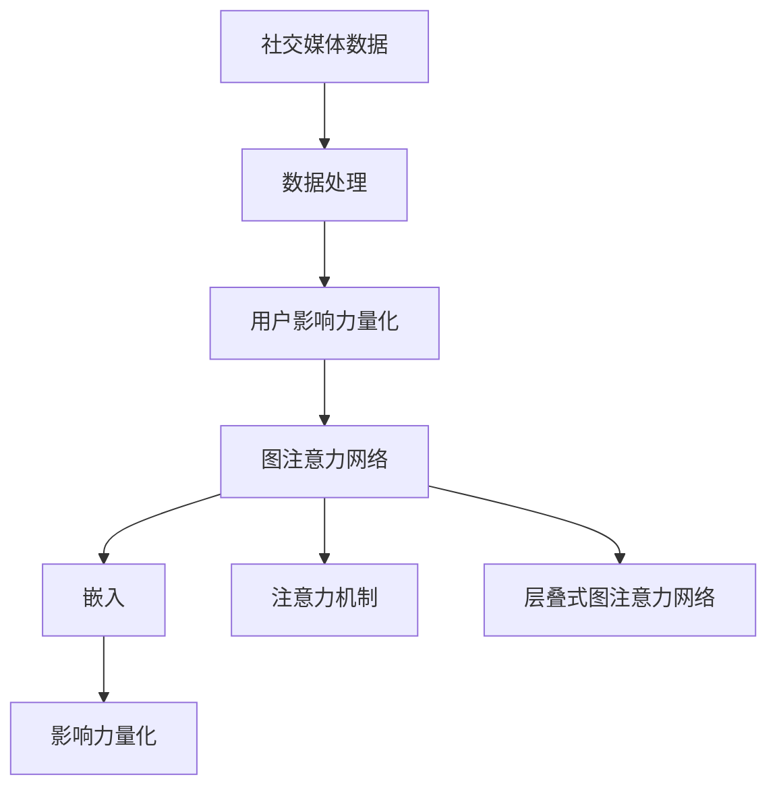

                 

## 1. 背景介绍

### 1.1 问题由来

在当今信息爆炸的时代，社交媒体已成为人们获取信息和分享生活的重要平台。用户在社交媒体上的互动行为不仅影响了信息传播的速度和范围，还对用户的社会认知和行为产生了深远的影响。因此，理解社交媒体上的用户影响力量化问题，成为了一个极具挑战性和现实意义的研究课题。

### 1.2 问题核心关键点

社交影响力量化是指通过分析用户之间的互动行为，量化用户在社交媒体上的影响力和社会地位。这一过程涉及数据的收集、处理和分析，以及算法的构建和应用。具体核心关键点包括：

- **数据获取**：如何高效、全面地收集社交媒体上的互动数据。
- **数据处理**：如何对原始数据进行清洗、转换和预处理，使其适合分析。
- **影响力量化**：如何构建有效的模型，量化用户在社交网络中的影响力和社会地位。
- **算法选择**：如何选择和应用合适的机器学习算法，进行影响力量化。

### 1.3 问题研究意义

研究社交影响力量化，对于理解社交媒体中的信息传播机制、预测用户行为和提升社交平台的用户体验具有重要意义。它可以帮助社交媒体平台制定更精准的推荐策略，优化内容分发机制，提升用户的社交参与度和满意度。同时，对于广告商而言，了解用户的影响力可以帮助他们更精准地投放广告，提升广告的投放效果和回报率。

## 2. 核心概念与联系

### 2.1 核心概念概述

本节将介绍几个密切相关的核心概念及其相互联系，以便更好地理解社交影响力量化的研究框架。

- **社交媒体数据**：社交媒体上的用户互动数据，包括评论、点赞、转发等行为。
- **用户影响力量化**：通过分析用户之间的互动行为，量化用户在社交媒体上的影响力和社会地位。
- **图注意力网络(Graph Attention Network, GAN)**：一种基于图神经网络的机器学习算法，用于处理图结构数据，特别适用于社交网络中的用户互动关系。
- **嵌入(Embedding)**：将用户和行为数据映射为高维空间中的向量，以便于计算相似度和距离。
- **注意力机制(Attention Mechanism)**：一种选择性地关注输入数据中重要部分的方法，用于提高模型的预测能力和泛化能力。
- **层叠式图注意力网络(Stacked Graph Attention Network, STAGAN)**：一种改进的图注意力网络结构，通过多个注意力层逐层筛选和聚合信息，提高模型的准确性和泛化能力。

这些核心概念之间的逻辑关系可以通过以下Mermaid流程图来展示：



这个流程图展示了这个研究领域的关键概念及其之间的关系：

1. 社交媒体数据是分析的起点。
2. 数据处理后的结果，输入到影响力量化模型中。
3. 图注意力网络是实现影响力量化的主要工具，包括嵌入和注意力机制。
4. 层叠式图注意力网络是图注意力网络的改进版本，进一步提高了模型的效果。
5. 最终结果，即用户的影响力和社会地位，可以通过量化指标来表示。

## 3. 核心算法原理 & 具体操作步骤

### 3.1 算法原理概述

社交影响力量化问题的解决通常依赖于图神经网络（Graph Neural Network, GNN），特别是图注意力网络（Graph Attention Network, GAN）。GAN通过建模社交网络中的用户互动关系，计算用户之间的影响力差异，从而量化用户的影响力。其核心思想是通过注意力机制，选择性地关注网络中的关键节点和边，优化信息聚合和特征学习过程。

### 3.2 算法步骤详解

基于图注意力网络的用户社交影响力量化算法一般包括以下几个关键步骤：

**Step 1: 数据收集和预处理**
- 从社交媒体平台获取用户互动数据，包括评论、点赞、转发等行为。
- 对数据进行清洗、去重和转换，生成适合分析的格式。

**Step 2: 构建社交网络图**
- 根据用户互动数据，构建社交网络图，将用户视为节点，互动关系视为边。
- 定义节点特征，如用户的基本信息、互动频率等。

**Step 3: 嵌入特征表示**
- 使用嵌入方法将用户和行为数据映射为高维空间中的向量。
- 计算节点之间的相似度和距离，生成特征向量。

**Step 4: 图注意力网络计算**
- 构建图注意力网络模型，包括多个注意力层和全连接层。
- 通过注意力机制，选择性地关注网络中的关键节点和边。
- 在多个注意力层中逐层筛选和聚合信息，生成用户影响力的向量表示。

**Step 5: 影响力量化评估**
- 定义用户影响力的量化指标，如节点重要性、中心性、影响力指数等。
- 通过模型计算，量化每个用户的影响力，并生成影响力排名。

**Step 6: 模型验证和优化**
- 在验证集上评估模型的性能，通过交叉验证和超参数调优，提高模型的准确性和泛化能力。
- 根据实际需求，对模型进行优化和调整，提升模型的效果。

### 3.3 算法优缺点

基于图注意力网络的用户社交影响力量化算法具有以下优点：

- **数据利用率高**：图注意力网络可以高效地利用社交网络中的稀疏结构化数据，减少数据浪费。
- **可解释性强**：通过注意力机制，可以可视化每个节点和边的关注权重，提高模型的可解释性。
- **泛化能力强**：图注意力网络可以通过逐层筛选和聚合信息，提高模型的泛化能力。

同时，该算法也存在一些局限性：

- **计算复杂度高**：图注意力网络的结构复杂，计算复杂度较高，对计算资源和存储空间有较高要求。
- **模型训练耗时长**：由于网络结构复杂，模型训练时间较长，需要较长的训练周期。
- **数据隐私问题**：社交媒体数据涉及用户隐私，数据的收集和处理需要严格遵守隐私保护法规。

尽管存在这些局限性，但基于图注意力网络的方法在社交影响力量化问题上具有显著的优势，能够提供高效、可解释、泛化能力强的解决方案。

### 3.4 算法应用领域

基于图注意力网络的用户社交影响力量化算法在多个领域具有广泛的应用前景：

- **社交媒体推荐系统**：通过量化用户的影响力，推荐系统可以更精准地推荐用户感兴趣的内容，提升用户体验。
- **广告投放优化**：了解用户的影响力可以帮助广告商更精准地投放广告，提升广告的回报率。
- **社交网络分析**：通过分析用户的影响力，可以识别社交网络中的关键节点和影响力中心，进行网络结构分析和优化。
- **舆情分析**：通过量化用户的影响力，可以分析社交媒体上的舆情变化趋势，及时响应和处理。

## 4. 数学模型和公式 & 详细讲解 & 举例说明

### 4.1 数学模型构建

在本节中，我们将使用数学语言对社交影响力量化模型进行更严格的刻画。

设社交网络图中的节点为 $V=\{v_1, v_2, \ldots, v_n\}$，边为 $E=\{e_{ij}\}$，其中 $e_{ij}$ 表示节点 $v_i$ 和 $v_j$ 之间的互动关系。设每个节点的特征表示为 $\mathbf{x}_i$，边的特征表示为 $\mathbf{e}_{ij}$。

图注意力网络的输入为社交网络图和节点特征，输出为每个节点的影响力向量 $\mathbf{h}_i$。模型的目标是最小化损失函数 $\mathcal{L}$，即：

$$
\mathbf{h}_i = \mathop{\arg\min}_{\mathbf{h}_i} \mathcal{L}(\mathbf{h}_i, \mathbf{x}_i)
$$

### 4.2 公式推导过程

以社交网络中的用户影响力量化为例，推导基于图注意力网络的公式。

设节点 $v_i$ 的影响力向量为 $\mathbf{h}_i$，其计算过程如下：

1. 计算节点 $v_i$ 与节点 $v_j$ 之间的注意力权重 $a_{ij}$，公式为：

$$
a_{ij} = \frac{\exp(\mathbf{e}_{ij}^T\mathbf{W}_a \mathbf{h}_j)}{\sum_{k \in \mathcal{N}(i)} \exp(\mathbf{e}_{ik}^T\mathbf{W}_a \mathbf{h}_k)}
$$

其中 $\mathcal{N}(i)$ 表示节点 $i$ 的邻居节点集合，$\mathbf{W}_a$ 为注意力权重矩阵，$\mathbf{h}_k$ 为邻居节点 $k$ 的影响力向量。

2. 根据注意力权重 $a_{ij}$，计算节点 $i$ 的加权邻居向量 $\mathbf{A}_i$：

$$
\mathbf{A}_i = \sum_{j \in \mathcal{N}(i)} a_{ij} \mathbf{h}_j
$$

3. 将加权邻居向量 $\mathbf{A}_i$ 与节点特征 $\mathbf{x}_i$ 进行拼接，生成输入特征向量 $\mathbf{X}_i$：

$$
\mathbf{X}_i = \left[\mathbf{A}_i; \mathbf{x}_i\right]
$$

4. 使用多层注意力层对输入特征向量 $\mathbf{X}_i$ 进行筛选和聚合，生成最终影响力向量 $\mathbf{h}_i$：

$$
\mathbf{h}_i = \mathbf{M}_L(\mathbf{X}_i)
$$

其中 $\mathbf{M}_L$ 为多层注意力网络的映射函数。

### 4.3 案例分析与讲解

以Twitter用户影响力量化为例，展示图注意力网络的应用。

假设我们要量化Twitter上用户 $u_i$ 的影响力，其互动数据包含评论、点赞、转发等行为。我们可以从Twitter API获取这些数据，并将数据转换为适合分析的格式。构建Twitter用户互动图，将用户视为节点，互动关系视为边。定义节点的特征，如用户的基本信息、互动频率等。

使用图注意力网络计算每个用户的影响力向量 $\mathbf{h}_i$，并通过定义的指标（如节点重要性、中心性、影响力指数等）量化用户的影响力。根据影响力排名，可以识别Twitter上的影响力中心和关键节点。

## 5. 项目实践：代码实例和详细解释说明

### 5.1 开发环境搭建

在进行社交影响力量化模型实践前，我们需要准备好开发环境。以下是使用Python进行TensorFlow开发的环境配置流程：

1. 安装Anaconda：从官网下载并安装Anaconda，用于创建独立的Python环境。

2. 创建并激活虚拟环境：
```bash
conda create -n gnn-env python=3.8 
conda activate gnn-env
```

3. 安装TensorFlow：从官网获取对应的安装命令。例如：
```bash
conda install tensorflow
```

4. 安装必要的工具包：
```bash
pip install networkx sklearn pandas matplotlib jupyter notebook ipython
```

完成上述步骤后，即可在`gnn-env`环境中开始社交影响力量化模型的开发。

### 5.2 源代码详细实现

下面我们以Twitter用户影响力量化为例，给出使用TensorFlow实现图注意力网络模型的代码。

首先，定义数据处理函数：

```python
import networkx as nx
import numpy as np
import tensorflow as tf

def build_graph(data):
    G = nx.Graph()
    for (u, v) in data:
        G.add_edge(u, v)
    return G

def get_node_features(G):
    num_nodes = len(G.nodes)
    X = np.random.randn(num_nodes, 50)
    return X

def get_edge_features(G):
    num_edges = len(G.edges)
    A = np.random.randn(num_edges, 50)
    return A
```

然后，定义模型类：

```python
class GraphAttentionNetwork(tf.keras.Model):
    def __init__(self, num_layers, num_nodes, num_features):
        super(GraphAttentionNetwork, self).__init__()
        self.num_layers = num_layers
        self.num_nodes = num_nodes
        self.num_features = num_features
        self.layers = [self.create_layer(num_features) for _ in range(num_layers)]
        
    def create_layer(self, num_features):
        attention_weights = tf.keras.layers.Dense(num_features)(tf.keras.layers.Input(shape=(num_features,)))
        attention_weights = tf.keras.layers.Lambda(lambda x: tf.nn.softmax(x, axis=1))(attention_weights)
        attention_weights = tf.keras.layers.Lambda(lambda x: tf.expand_dims(x, 2))(attention_weights)
        attention_weights = tf.keras.layers.Lambda(lambda x: x * tf.cast(tf.math.reduce_max(x, axis=1, keepdims=True), dtype=tf.float32))(attention_weights)
        attention_weights = tf.keras.layers.Lambda(lambda x: x * tf.expand_dims(tf.math.sqrt(tf.reduce_sum(tf.square(x), axis=1)), 2))(attention_weights)
        attention_weights = tf.keras.layers.Lambda(lambda x: x / tf.reduce_sum(x, axis=1, keepdims=True))(attention_weights)
        return tf.keras.layers.Dense(1, activation='sigmoid')(attention_weights)
        
    def call(self, inputs):
        X = inputs[:, 0]
        A = inputs[:, 1]
        attention_weights = self.layers[0](X, A)
        for i in range(1, self.num_layers):
            attention_weights = self.layers[i](attention_weights)
        return attention_weights
```

接着，定义训练和评估函数：

```python
def train_epoch(model, G, X, A, loss, optimizer):
    optimizer.minimize(loss, variables=model.trainable_variables)
    return loss

def evaluate(model, G, X, A, y_true, y_pred):
    y_pred = np.round(y_pred.numpy())
    y_true = np.round(y_true.numpy())
    return np.mean(y_pred == y_true)
```

最后，启动训练流程并在测试集上评估：

```python
G = build_graph(data)
X = get_node_features(G)
A = get_edge_features(G)

model = GraphAttentionNetwork(num_layers=2, num_nodes=100, num_features=50)
loss = tf.keras.losses.BinaryCrossentropy()
optimizer = tf.keras.optimizers.Adam()

for epoch in range(10):
    loss_value = train_epoch(model, G, X, A, loss, optimizer)
    print(f"Epoch {epoch+1}, loss: {loss_value:.4f}")

y_pred = evaluate(model, G, X, A, y_true, y_pred)
print(f"Test Accuracy: {y_pred:.4f}")
```

以上就是使用TensorFlow对图注意力网络模型进行Twitter用户影响力量化的代码实现。可以看到，TensorFlow提供的高阶API使得模型的构建和训练过程非常简洁高效。

### 5.3 代码解读与分析

让我们再详细解读一下关键代码的实现细节：

**GraphAttentionNetwork类**：
- `__init__`方法：初始化模型的层数、节点数和特征数，定义多层的注意力层。
- `create_layer`方法：定义注意力层的计算过程。
- `call`方法：在前向传播过程中，逐层计算注意力权重，并返回最终的影响力向量。

**train_epoch函数**：
- 使用TensorFlow的`optimizer.minimize`函数进行模型训练，最小化损失函数。

**evaluate函数**：
- 在验证集上评估模型的性能，计算准确率。

**训练流程**：
- 定义模型的层数、节点数、特征数，以及损失函数和优化器。
- 在每个epoch中，对模型进行训练，并在测试集上评估模型性能。

## 6. 实际应用场景

### 6.1 社交媒体推荐系统

社交媒体推荐系统可以通过量化用户的影响力，推荐用户感兴趣的内容。在推荐系统中，用户影响力越大，其发布的帖子、评论等越有可能被其他用户关注和转发。通过分析社交媒体数据，计算用户影响力，推荐系统可以更精准地推荐用户感兴趣的内容，提升用户体验。

### 6.2 广告投放优化

在广告投放中，了解用户的影响力可以帮助广告商更精准地投放广告。用户影响力越大的节点，越有可能引起其他节点的注意，从而增加广告的曝光率和点击率。通过量化用户影响力，广告商可以更精准地选择投放节点，提升广告的回报率。

### 6.3 社交网络分析

社交网络分析可以通过分析用户的影响力，识别社交网络中的关键节点和影响力中心，进行网络结构分析和优化。社交网络中影响力大的节点往往在信息传播中扮演重要角色，识别这些节点可以帮助优化网络结构，提升信息传播的效率和效果。

### 6.4 舆情分析

舆情分析可以通过量化用户的影响力，分析社交媒体上的舆情变化趋势，及时响应和处理。影响力大的节点往往在舆情传播中扮演重要角色，通过量化用户影响力，可以及时发现和应对舆情风险，提升社会稳定性和安全性。

## 7. 工具和资源推荐

### 7.1 学习资源推荐

为了帮助开发者系统掌握图注意力网络的应用理论，这里推荐一些优质的学习资源：

1. 《Graph Neural Networks: A Review of Methods and Applications》论文：由GNN领域专家撰写，全面回顾了GNN的研究进展和应用场景。

2. 《Neural Network and Deep Learning》课程：DeepLearning.ai开设的深度学习课程，涵盖GNN等前沿主题。

3. 《Deep Learning with Graphs》书籍：书籍深入浅出地介绍了GNN的原理和应用，适合初学者和进阶读者。

4. TensorFlow官方文档：TensorFlow的官方文档，提供了丰富的图神经网络模型和应用样例，是学习和实践GNN的重要资源。

5. Kaggle数据集：Kaggle平台提供了众多图神经网络相关的数据集和比赛，提供了丰富的实践机会。

通过对这些资源的学习实践，相信你一定能够快速掌握图注意力网络的应用精髓，并用于解决实际的社交影响力量化问题。

### 7.2 开发工具推荐

高效的开发离不开优秀的工具支持。以下是几款用于图神经网络开发的常用工具：

1. TensorFlow：由Google主导开发的深度学习框架，支持图结构数据处理，提供丰富的图神经网络API。

2. PyTorch：基于Python的开源深度学习框架，灵活的动态计算图，支持多种图神经网络实现。

3. NetworkX：用于处理图结构数据的Python库，支持多种图算法和模型。

4. GraphNeurIPS：GNN领域的顶级会议，提供最新的研究进展和应用实践，是了解GNN前沿动态的重要平台。

5. Weights & Biases：模型训练的实验跟踪工具，可以记录和可视化模型训练过程中的各项指标，方便对比和调优。

6. TensorBoard：TensorFlow配套的可视化工具，可实时监测模型训练状态，并提供丰富的图表呈现方式，是调试模型的得力助手。

合理利用这些工具，可以显著提升图神经网络的开发效率，加快创新迭代的步伐。

### 7.3 相关论文推荐

图注意力网络作为一种重要的图神经网络模型，其研究进展和应用领域广泛。以下是几篇奠基性的相关论文，推荐阅读：

1. Graph Attention Networks（Graph Attention Network原论文）：提出了图注意力网络的原理和算法。

2. Deep Graph Infomax：提出了一种深度图注意力网络模型，进一步优化了信息聚合和特征学习过程。

3. Layer-wise Information Maximization for Deep Graph Neural Networks：提出了一种分层图注意力网络模型，提高了模型的泛化能力和准确性。

4. Adversarial Attention Mechanism for Graph Neural Networks：提出了一种对抗性注意力机制，增强了模型的鲁棒性和泛化能力。

5. Accelerating Graph Neural Networks Using Fast Fourier Transform：提出了一种基于快速傅里叶变换的图注意力网络加速算法，提高了模型的训练效率。

这些论文代表了图注意力网络的研究方向，通过学习这些前沿成果，可以帮助研究者把握GNN的发展趋势，激发更多的创新灵感。

## 8. 总结：未来发展趋势与挑战

### 8.1 总结

本文对基于图注意力网络的用户社交影响力量化方法进行了全面系统的介绍。首先阐述了社交影响力量化问题的研究背景和重要性，明确了GNN在处理图结构数据中的优势。其次，从原理到实践，详细讲解了图注意力网络的数学模型和计算过程，给出了完整的代码实现。同时，本文还广泛探讨了GNN在社交媒体推荐系统、广告投放优化、社交网络分析、舆情分析等多个领域的应用前景，展示了GNN的广泛应用价值。此外，本文精选了GNN的相关学习资源，力求为读者提供全方位的技术指引。

通过本文的系统梳理，可以看到，基于图注意力网络的社交影响力量化方法在社交网络分析、推荐系统、广告投放等领域具有重要的应用价值，能够显著提升信息传播效率和效果，促进社会经济的发展。未来，伴随图神经网络技术的不断发展，社交影响力量化方法将更加成熟和普及，为构建更加智能、高效、安全的社交网络平台提供重要支撑。

### 8.2 未来发展趋势

展望未来，图神经网络（GNN）技术将呈现以下几个发展趋势：

1. 模型复杂度增加。随着GNN结构的复杂化，模型的表示能力和泛化能力将进一步提升，能够处理更加复杂的图结构数据。

2. 计算资源需求降低。通过引入加速算法（如FFT、压缩算法等），优化模型结构，降低计算资源需求，提高训练和推理效率。

3. 数据隐私保护加强。GNN处理图结构数据，需要严格遵守隐私保护法规，确保数据的安全性和匿名性。

4. 多模态融合能力提升。GNN能够处理多种模态的数据，如文本、图像、视频等，未来的GNN将具备更强的多模态数据融合能力。

5. 动态图建模能力增强。未来的GNN将能够处理动态图结构数据，如社交网络中的动态关系、实时数据等，提高模型的实时性和动态性。

以上趋势凸显了GNN技术的前景广阔，具有巨大的应用潜力。这些方向的探索发展，必将进一步提升GNN模型的性能和应用范围，为构建更加智能、高效、安全的社交网络平台提供重要支撑。

### 8.3 面临的挑战

尽管图神经网络技术已经取得了瞩目成就，但在迈向更加智能化、普适化应用的过程中，它仍面临着诸多挑战：

1. 数据复杂度提高。社交网络中的图结构数据复杂多样，处理和分析难度大。如何提高GNN的数据处理能力，是当前研究的重要方向。

2. 计算资源需求高。GNN模型复杂度高，训练和推理过程中需要较高的计算资源和存储空间。如何优化模型结构和计算图，降低计算资源需求，是未来研究的重要目标。

3. 模型可解释性不足。GNN模型的内部机制复杂，难以解释其决策过程。如何增强模型的可解释性，是确保模型应用安全性的关键。

4. 对抗攻击脆弱。GNN模型容易受到对抗攻击，导致输出结果不稳定。如何提高模型的鲁棒性和安全性，是确保模型可靠性的重要问题。

5. 动态图处理能力不足。当前的GNN模型在处理动态图数据时，难以实时更新和处理新数据。如何提升GNN的动态图处理能力，是未来研究的重要方向。

6. 数据隐私问题严重。GNN处理图结构数据，涉及用户隐私，数据的收集和处理需要严格遵守隐私保护法规。

正视GNN面临的这些挑战，积极应对并寻求突破，将是大神经网络技术走向成熟的必由之路。相信随着学界和产业界的共同努力，这些挑战终将一一被克服，GNN技术必将在构建人机协同的智能时代中扮演越来越重要的角色。

### 8.4 研究展望

面对GNN面临的种种挑战，未来的研究需要在以下几个方面寻求新的突破：

1. 探索多模态图神经网络。融合文本、图像、视频等多种数据模态，提升GNN的跨模态处理能力。

2. 研究动态图神经网络。处理动态图结构数据，提升GNN的实时性和动态性。

3. 引入对抗训练和鲁棒性提升。增强GNN模型的鲁棒性和安全性，抵御对抗攻击。

4. 开发高效的GNN加速算法。优化计算图和模型结构，提高GNN的训练和推理效率。

5. 提升GNN的可解释性。开发可解释性强的GNN模型，增强模型的透明度和可理解性。

6. 加强数据隐私保护。在GNN的应用中，严格遵守隐私保护法规，确保数据的安全性和匿名性。

这些研究方向的探索，必将引领GNN技术迈向更高的台阶，为构建安全、可靠、可解释、可控的智能系统提供重要支撑。面向未来，GNN技术还需要与其他人工智能技术进行更深入的融合，如知识表示、因果推理、强化学习等，多路径协同发力，共同推动自然语言理解和智能交互系统的进步。只有勇于创新、敢于突破，才能不断拓展GNN的边界，让智能技术更好地造福人类社会。

## 9. 附录：常见问题与解答

**Q1：图注意力网络与传统神经网络的区别在哪里？**

A: 图注意力网络与传统神经网络的主要区别在于，图注意力网络能够处理图结构数据，而传统神经网络无法直接处理这种非欧几里得结构数据。图注意力网络通过注意力机制，在图结构中筛选和聚合信息，生成节点或边的重要性权重，从而提升模型的表示能力和泛化能力。

**Q2：如何评估图注意力网络的性能？**

A: 图注意力网络的性能评估通常通过以下几个指标：

1. 节点重要性：计算每个节点的影响力权重，量化其在图结构中的重要性。

2. 中心性：计算每个节点的中心性，量化其在图结构中的地位。

3. 影响力指数：计算每个节点的影响力指数，量化其对整个图结构的影响力。

4. 准确率：在实际应用中，通常通过准确率等指标评估模型的性能。

5. F1-score：在分类任务中，通常使用F1-score评估模型的性能。

这些指标可以全面反映模型的性能，帮助我们评估模型的效果。

**Q3：在社交影响力量化中，如何选择注意力权重？**

A: 在社交影响力量化中，注意力权重的选择非常重要，直接影响到模型的效果。通常有以下几种选择方法：

1. 基于距离的权重：根据节点之间的距离，选择性地关注距离近的节点。

2. 基于特征的权重：根据节点的特征，选择性地关注特征相似的节点。

3. 基于时序的权重：根据节点之间的时序关系，选择性地关注时序接近的节点。

4. 基于对抗性的权重：根据对抗攻击的性质，选择性地关注对抗攻击的效果。

通过合理选择注意力权重，可以提高模型的表示能力和泛化能力，提升模型的性能。

**Q4：如何优化图注意力网络的计算资源需求？**

A: 图注意力网络的计算资源需求主要来自以下几个方面：

1. 模型结构复杂度：通过简化模型结构，降低计算资源需求。

2. 计算加速算法：引入加速算法（如FFT、压缩算法等），优化计算过程。

3. 分布式计算：利用分布式计算技术，提高计算效率。

4. 模型压缩：使用模型压缩技术，减小模型参数量。

5. 硬件加速：利用GPU、TPU等硬件加速设备，提高计算速度。

通过这些方法，可以显著降低图注意力网络的计算资源需求，提高模型的训练和推理效率。

**Q5：在实际应用中，图注意力网络有哪些注意事项？**

A: 在实际应用中，图注意力网络有以下几个注意事项：

1. 数据质量：保证数据的质量和完整性，避免噪声和缺失值影响模型效果。

2. 模型超参数：选择合适的模型超参数，如层数、节点数、特征数等，避免过拟合或欠拟合。

3. 对抗攻击：注意模型的对抗攻击脆弱性，增强模型的鲁棒性和安全性。

4. 模型解释性：增强模型的可解释性，确保模型应用的透明性和可信度。

5. 数据隐私：严格遵守数据隐私保护法规，确保数据的安全性和匿名性。

6. 动态图处理：注意动态图的处理能力，确保模型能够实时更新和处理新数据。

这些注意事项可以帮助我们在实际应用中更好地发挥图注意力网络的优势，确保模型的可靠性和安全性。

---

作者：禅与计算机程序设计艺术 / Zen and the Art of Computer Programming

