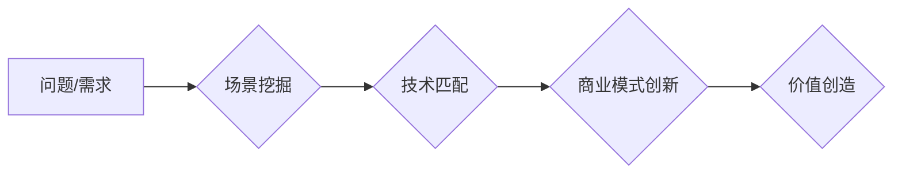

> AI创业,场景挖掘,市场需求,技术匹配,商业模式,价值创造,案例分析

## 1. 背景介绍

人工智能（AI）技术近年来发展迅速，已渗透到各个领域，为企业带来了巨大的变革机遇。众多AI创业公司涌现，希望通过AI技术解决实际问题，创造商业价值。然而，仅仅拥有先进的AI技术并不足以保证创业成功。找到合适的场景，将AI技术与市场需求相匹配，是AI创业公司能否取得成功的关键因素之一。

## 2. 核心概念与联系

**2.1 场景定义**

在AI创业领域，“场景”是指特定领域或行业中存在的问题或需求，可以通过AI技术有效解决或提升。一个好的AI场景具备以下特征：

* **明确的问题或需求:** 场景需要明确定义，并能清晰描述其痛点或挑战。
* **可量化的价值:** 场景的解决方案应该能够带来可量化的效益，例如提高效率、降低成本、提升用户体验等。
* **技术可行性:** 场景需要具备AI技术可解决的条件，例如数据量充足、算法成熟等。
* **市场潜力:** 场景需要具备一定的市场规模和增长潜力，才能支撑商业模式的可持续发展。

**2.2 场景挖掘与匹配**

场景挖掘是AI创业公司找到好场景的关键环节。可以通过以下方法进行场景挖掘：

* **行业研究:** 深入了解目标行业的痛点、需求和发展趋势，寻找AI技术可以解决的问题。
* **用户调研:** 通过用户访谈、问卷调查等方式，了解用户的真实需求和痛点。
* **数据分析:** 利用大数据分析技术，挖掘用户行为、市场趋势等数据，发现潜在的AI应用场景。

**2.3 技术与场景的匹配**

AI技术的应用场景非常广泛，不同的AI技术具备不同的优势和适用范围。AI创业公司需要根据自身的技术优势和市场需求，选择合适的AI技术与场景进行匹配。

**2.4 商业模式创新**

找到好场景只是第一步，AI创业公司还需要构建合理的商业模式，才能实现可持续发展。常见的AI商业模式包括：

* **订阅制:** 提供AI服务或产品的订阅模式，例如AI平台、AI工具等。
* **按需付费:** 根据用户使用量或服务需求，按需付费。
* **数据交易:** 利用AI技术分析和处理数据，并将其进行交易。
* **解决方案提供:** 为企业提供定制化的AI解决方案，例如智能客服、智能营销等。

**2.5 价值创造**

AI创业公司最终的目标是创造价值，为用户、企业和社会带来效益。AI技术可以帮助企业提高效率、降低成本、提升用户体验，从而创造新的价值。

**Mermaid 流程图**



## 3. 核心算法原理 & 具体操作步骤

**3.1 算法原理概述**

在AI创业公司寻找好场景的过程中，算法原理是支撑场景挖掘、技术匹配和价值创造的关键。常见的AI算法包括：

* **机器学习:** 通过训练模型，从数据中学习规律，进行预测或分类。
* **深度学习:** 基于神经网络，能够处理更复杂的数据，例如图像、语音、文本等。
* **自然语言处理:** 处理和理解人类语言，例如文本分类、机器翻译、对话系统等。
* **计算机视觉:** 处理和理解图像和视频，例如图像识别、物体检测、视频分析等。

**3.2 算法步骤详解**

**机器学习算法的步骤:**

1. **数据收集:** 收集与目标场景相关的训练数据。
2. **数据预处理:** 对数据进行清洗、转换、特征提取等处理，使其适合模型训练。
3. **模型选择:** 选择合适的机器学习模型，例如线性回归、逻辑回归、决策树、支持向量机等。
4. **模型训练:** 利用训练数据训练模型，调整模型参数，使其能够准确预测或分类。
5. **模型评估:** 使用测试数据评估模型的性能，例如准确率、召回率、F1-score等。
6. **模型部署:** 将训练好的模型部署到实际应用场景中。

**3.3 算法优缺点**

不同的AI算法具有不同的优缺点，需要根据具体场景选择合适的算法。例如，机器学习算法能够处理大量数据，但需要大量的训练数据；深度学习算法能够处理更复杂的数据，但训练时间较长，计算资源要求较高。

**3.4 算法应用领域**

AI算法广泛应用于各个领域，例如：

* **医疗保健:** 疾病诊断、药物研发、个性化医疗等。
* **金融服务:** 风险评估、欺诈检测、投资决策等。
* **制造业:** 质量控制、预测维护、智能制造等。
* **零售业:** 商品推荐、个性化营销、库存管理等。

## 4. 数学模型和公式 & 详细讲解 & 举例说明

**4.1 数学模型构建**

在AI场景挖掘和技术匹配过程中，数学模型可以帮助我们量化问题、分析数据、预测结果。例如，我们可以使用回归模型预测用户行为，使用分类模型识别潜在的AI应用场景。

**4.2 公式推导过程**

例如，线性回归模型的公式如下：

$$y = mx + c$$

其中，y是预测值，x是输入特征，m是斜率，c是截距。

**4.3 案例分析与讲解**

假设我们想预测用户的购买行为，可以使用线性回归模型。我们可以收集用户的历史购买数据，包括用户的年龄、收入、购买频率等特征，以及用户的购买行为（是否购买）。然后，我们可以使用这些数据训练线性回归模型，并预测新的用户的购买行为。

## 5. 项目实践：代码实例和详细解释说明

**5.1 开发环境搭建**

AI创业公司需要搭建合适的开发环境，包括硬件、软件和工具。常见的AI开发环境包括：

* **云平台:** 例如AWS、Azure、GCP等，提供丰富的AI服务和工具。
* **本地环境:** 使用自己的服务器或笔记本电脑搭建AI开发环境。

**5.2 源代码详细实现**

以下是一个使用Python语言实现的简单机器学习模型的代码示例：

```python
from sklearn.linear_model import LogisticRegression
from sklearn.model_selection import train_test_split
from sklearn.metrics import accuracy_score

# 加载数据
data = ...

# 将数据分为训练集和测试集
X_train, X_test, y_train, y_test = train_test_split(data[:, :-1], data[:, -1], test_size=0.2)

# 创建LogisticRegression模型
model = LogisticRegression()

# 训练模型
model.fit(X_train, y_train)

# 预测测试集结果
y_pred = model.predict(X_test)

# 计算模型准确率
accuracy = accuracy_score(y_test, y_pred)
print(f"模型准确率: {accuracy}")
```

**5.3 代码解读与分析**

这段代码首先加载数据，然后将数据分为训练集和测试集。接着，创建LogisticRegression模型，并使用训练集训练模型。最后，使用测试集预测结果，并计算模型的准确率。

**5.4 运行结果展示**

运行这段代码后，会输出模型的准确率。

## 6. 实际应用场景

**6.1 医疗保健**

AI可以帮助医生诊断疾病、预测患者风险、个性化治疗方案。例如，AI算法可以分析患者的影像数据，辅助医生诊断癌症；AI可以分析患者的电子病历，预测患者的风险，并提供个性化的预防措施。

**6.2 金融服务**

AI可以帮助金融机构进行风险评估、欺诈检测、投资决策。例如，AI算法可以分析客户的财务数据，评估客户的信用风险；AI可以分析交易数据，识别欺诈行为；AI可以分析市场数据，提供投资建议。

**6.3 制造业**

AI可以帮助制造企业提高生产效率、降低成本、提升产品质量。例如，AI算法可以分析生产设备的运行数据，预测设备故障，并进行预防性维护；AI可以分析产品质量数据，识别产品缺陷，并进行改进。

**6.4 未来应用展望**

AI技术的应用场景还在不断扩展，未来将应用于更多领域，例如教育、交通、能源等。AI将改变我们的生活方式，带来更多的便利和效率。

## 7. 工具和资源推荐

**7.1 学习资源推荐**

* **在线课程:** Coursera、edX、Udacity等平台提供丰富的AI课程。
* **书籍:** 《深度学习》、《机器学习实战》等书籍是学习AI的基础。
* **开源项目:** TensorFlow、PyTorch等开源项目可以帮助你实践AI算法。

**7.2 开发工具推荐**

* **Python:** Python是AI开发最常用的编程语言。
* **Jupyter Notebook:** Jupyter Notebook是一个交互式编程环境，方便进行AI算法开发和调试。
* **云平台:** AWS、Azure、GCP等云平台提供丰富的AI服务和工具。

**7.3 相关论文推荐**

* **《ImageNet Classification with Deep Convolutional Neural Networks》**
* **《Attention Is All You Need》**
* **《BERT: Pre-training of Deep Bidirectional Transformers for Language Understanding》**

## 8. 总结：未来发展趋势与挑战

**8.1 研究成果总结**

近年来，AI技术取得了长足的进步，在各个领域都取得了显著的应用成果。

**8.2 未来发展趋势**

未来，AI技术将朝着以下方向发展：

* **更强大的计算能力:** 随着硬件技术的进步，AI模型将变得更加强大，能够处理更复杂的数据。
* **更广泛的应用场景:** AI技术将应用于更多领域，例如教育、交通、能源等。
* **更智能的算法:** AI算法将更加智能，能够更好地理解和处理人类语言、图像、视频等数据。

**8.3 面临的挑战**

AI技术的发展也面临着一些挑战：

* **数据安全和隐私保护:** AI算法需要大量数据进行训练，如何保证数据的安全和隐私保护是一个重要问题。
* **算法偏见:** AI算法可能会受到训练数据的偏见影响，导致算法输出结果存在偏见。
* **伦理问题:** AI技术的应用可能会带来一些伦理问题，例如人工智能的责任和义务、人工智能的就业影响等。

**8.4 研究展望**

未来，我们需要继续加强对AI技术的研发和应用，同时也要关注AI技术的伦理和社会影响，确保AI技术能够造福人类。

## 9. 附录：常见问题与解答

**9.1 如何选择合适的AI算法？**

选择合适的AI算法需要根据具体场景的需求进行分析。例如，如果需要预测连续值，可以使用回归算法；如果需要分类数据，可以使用分类算法。

**9.2 如何解决AI算法的偏见问题？**

可以采用以下方法解决AI算法的偏见问题：

* 使用更加多样化的训练数据。
* 使用算法去偏见技术，例如公平学习。
* 定期评估算法的公平性，并进行调整。

**9.3 如何保证AI数据的安全和隐私保护？**

可以采用以下方法保证AI数据的安全和隐私保护：

* 对数据进行匿名化处理。
* 使用加密技术保护数据。
* 严格控制数据的访问权限。


作者：禅与计算机程序设计艺术 / Zen and the Art of Computer Programming 
<end_of_turn>