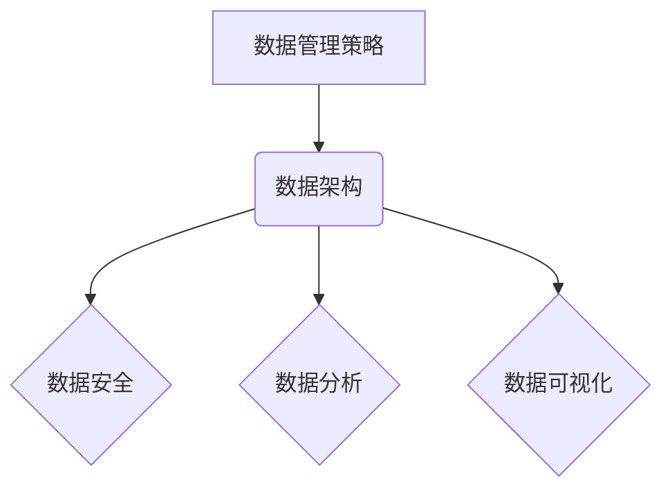

> AI创业, 数据管理, 数据策略, 数据架构, 数据安全, 数据分析, 数据可视化

## 1. 背景介绍

人工智能（AI）技术近年来发展迅速，已渗透到各个行业，并催生了一批新的创业公司。然而，AI创业面临着诸多挑战，其中数据管理是至关重要的环节。数据是AI算法训练和运行的基础，高质量的数据能够提升AI模型的准确性和效率，而数据管理不善则会导致模型性能下降甚至失效。

随着AI技术的普及，数据量呈指数级增长，数据管理的难度也随之增加。AI创业公司需要制定有效的策略和架构，才能有效地收集、存储、处理和分析数据，并将其转化为商业价值。

## 2. 核心概念与联系

**2.1 数据管理策略**

数据管理策略是指企业在收集、存储、处理、分析和共享数据时遵循的一系列原则和流程。

**2.2 数据架构**

数据架构是指企业数据系统的设计和组织方式，包括数据模型、数据存储、数据访问和数据安全等方面。

**2.3 数据安全**

数据安全是指保护数据免受未经授权访问、使用、披露、修改或销毁的措施。

**2.4 数据分析**

数据分析是指通过对数据进行收集、清洗、转换、模型构建和评估等操作，以发现数据中的规律和趋势，并为决策提供支持。

**2.5 数据可视化**

数据可视化是指将数据以图形、图表等形式呈现出来，以便于人们理解和分析。

**数据管理策略与架构的关系**

数据管理策略为数据架构提供指导，数据架构则为数据管理策略的实施提供基础。两者相互依存，共同构成了企业的数据管理体系。



## 3. 核心算法原理 & 具体操作步骤

**3.1 算法原理概述**

在AI创业中，数据管理的核心算法包括数据清洗、数据转换、数据聚合和数据建模等。

**3.2 算法步骤详解**

**3.2.1 数据清洗**

数据清洗是指对数据进行清理和修复，以去除噪声、缺失值和重复数据等问题。

**步骤：**

1. 数据收集：从各种来源收集数据。
2. 数据预处理：对数据进行格式转换、编码和缺失值处理等操作。
3. 数据清洗：使用规则或算法识别和修复数据质量问题。
4. 数据验证：验证数据清洗结果的准确性和完整性。

**3.2.2 数据转换**

数据转换是指将数据从一种格式转换为另一种格式，以满足不同的应用需求。

**步骤：**

1. 数据分析：分析数据格式和结构。
2. 数据转换规则定义：定义数据转换规则，包括数据类型转换、数据格式转换和数据结构转换等。
3. 数据转换执行：使用工具或脚本执行数据转换规则。
4. 数据验证：验证数据转换结果的准确性和完整性。

**3.2.3 数据聚合**

数据聚合是指将多个数据源的数据进行合并和汇总，以获得更全面的数据视图。

**步骤：**

1. 数据识别：识别需要聚合的数据源。
2. 数据连接：定义数据源之间的连接关系。
3. 数据聚合规则定义：定义数据聚合规则，包括数据分组、数据统计和数据合并等。
4. 数据聚合执行：使用工具或脚本执行数据聚合规则。
5. 数据验证：验证数据聚合结果的准确性和完整性。

**3.2.4 数据建模**

数据建模是指根据业务需求，构建数据模型，以描述数据的结构、关系和约束。

**步骤：**

1. 业务需求分析：分析业务需求，确定数据模型的范围和目标。
2. 数据实体识别：识别数据模型中的数据实体。
3. 数据关系定义：定义数据实体之间的关系。
4. 数据约束定义：定义数据模型的约束条件。
5. 数据模型验证：验证数据模型的准确性和完整性。

**3.3 算法优缺点**

**优点：**

* 能够有效地处理海量数据。
* 能够发现数据中的隐藏规律和趋势。
* 能够为决策提供数据支持。

**缺点：**

* 需要专业的技术人员进行操作。
* 需要大量的计算资源。
* 数据质量问题会影响算法效果。

**3.4 算法应用领域**

数据管理算法广泛应用于各个行业，例如：

* 金融行业：风险管理、欺诈检测、客户画像
* 医疗行业：疾病诊断、药物研发、患者管理
* 电商行业：商品推荐、用户画像、营销分析
* 制造业：生产优化、质量控制、设备维护

## 4. 数学模型和公式 & 详细讲解 & 举例说明

**4.1 数学模型构建**

数据管理的数学模型通常基于概率论、统计学和机器学习等理论。

**4.2 公式推导过程**

例如，数据清洗中的缺失值填充可以使用均值、中位数或预测值等方法，对应的公式如下：

* 均值填充：$x_{filled} = \bar{x}$
* 中位数填充：$x_{filled} = \text{median}(x)$
* 预测值填充：$x_{filled} = f(x_{observed})$

其中，$x_{filled}$ 是填充后的值，$\bar{x}$ 是数据列的均值，$\text{median}(x)$ 是数据列的中位数，$f(x_{observed})$ 是预测模型的输出值。

**4.3 案例分析与讲解**

假设我们有一组销售数据，其中包含一些缺失的销售额。我们可以使用均值填充法来填充缺失值。

首先，计算销售额列的均值：$\bar{x} = 1000$。然后，将所有缺失的销售额填充为1000。

**5. 项目实践：代码实例和详细解释说明**

**5.1 开发环境搭建**

* 操作系统：Linux/macOS/Windows
* Python版本：3.6+
* 必要的库：pandas, numpy, scikit-learn

**5.2 源代码详细实现**

```python
import pandas as pd

# 加载数据
data = pd.read_csv('sales_data.csv')

# 填充缺失值
data['sales'].fillna(data['sales'].mean(), inplace=True)

# 保存数据
data.to_csv('cleaned_data.csv', index=False)
```

**5.3 代码解读与分析**

* `pd.read_csv('sales_data.csv')`: 从CSV文件加载数据到pandas DataFrame中。
* `data['sales'].fillna(data['sales'].mean(), inplace=True)`: 使用均值填充法填充`sales`列中的缺失值。
* `data.to_csv('cleaned_data.csv', index=False)`: 将处理后的数据保存到CSV文件。

**5.4 运行结果展示**

运行代码后，将生成一个名为`cleaned_data.csv`的文件，其中包含填充后的销售数据。

## 6. 实际应用场景

**6.1 数据仓库建设**

AI创业公司需要构建数据仓库，以存储和管理来自各种来源的数据。数据仓库需要具备高可靠性、高可用性和高性能的特点。

**6.2 数据分析平台建设**

AI创业公司需要构建数据分析平台，以支持数据分析和可视化。数据分析平台需要提供丰富的分析工具和功能，并支持多种数据格式和数据源。

**6.3 数据安全管理**

AI创业公司需要制定数据安全策略，并采取相应的安全措施，以保护数据免受未经授权访问、使用、披露、修改或销毁。

**6.4 未来应用展望**

随着AI技术的不断发展，数据管理将变得更加重要。未来，AI创业公司将更加注重数据质量、数据隐私和数据安全。

## 7. 工具和资源推荐

**7.1 学习资源推荐**

* 书籍：《数据科学实战》、《数据挖掘与机器学习》
* 在线课程：Coursera、edX、Udacity

**7.2 开发工具推荐**

* 数据处理工具：pandas, numpy
* 数据可视化工具：matplotlib, seaborn
* 数据仓库工具：Hadoop, Spark
* 数据分析平台：Tableau, Power BI

**7.3 相关论文推荐**

* 《数据管理在人工智能时代的角色》
* 《数据安全与隐私保护在AI创业中的挑战》

## 8. 总结：未来发展趋势与挑战

**8.1 研究成果总结**

本文介绍了AI创业中数据管理的策略、架构、算法和应用场景。数据管理是AI创业成功的关键因素，需要企业制定有效的策略和架构，并不断提升数据质量和数据安全水平。

**8.2 未来发展趋势**

* 数据管理将更加智能化和自动化。
* 数据隐私和数据安全将更加重要。
* 数据管理将更加注重数据可解释性和可信任性。

**8.3 面临的挑战**

* 数据量爆炸式增长带来的挑战。
* 数据质量问题和数据安全问题。
* 数据管理人才短缺。

**8.4 研究展望**

未来，我们需要继续研究数据管理的新技术和新方法，以应对AI创业带来的挑战，并推动AI技术的健康发展。

## 9. 附录：常见问题与解答

**9.1 如何选择合适的数据库？**

选择数据库需要考虑数据量、数据类型、访问模式和性能要求等因素。

**9.2 如何保证数据安全？**

数据安全需要采取多种措施，包括访问控制、数据加密、备份和恢复等。

**9.3 如何提高数据质量？**

提高数据质量需要进行数据清洗、数据转换和数据验证等操作。


作者：禅与计算机程序设计艺术 / Zen and the Art of Computer Programming 
<end_of_turn>