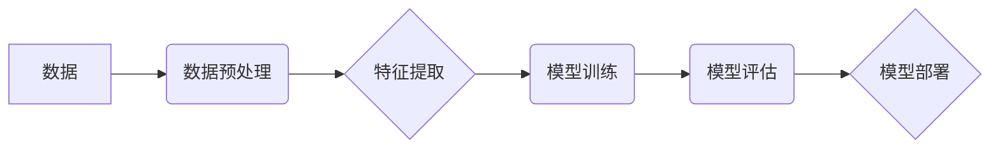

> 人工智能，机器学习，深度学习，神经网络，算法，代码实例，实践应用

## 1. 背景介绍

人工智能（AI）作为科技发展的重要方向，近年来取得了显著进展，并在各个领域得到广泛应用。从语音识别、图像识别到自然语言处理、自动驾驶，AI技术正在深刻地改变着我们的生活。

然而，对于许多人来说，AI仍然是一个神秘而难以理解的概念。他们可能知道AI可以完成一些惊人的任务，但对AI的原理和实现方式却知之甚少。

本书旨在通过深入浅出的讲解，帮助读者理解AI的基本原理，并通过代码实例，让读者亲身体验AI的魅力。

## 2. 核心概念与联系

**2.1 机器学习**

机器学习是人工智能的一个重要分支，它通过算法使计算机能够从数据中学习，并根据学习到的知识进行预测或决策。

**2.2 深度学习**

深度学习是机器学习的一种更高级形式，它利用多层神经网络来模拟人类大脑的学习过程。深度学习算法能够从海量数据中提取出更深层次的特征，从而实现更准确的预测和决策。

**2.3 神经网络**

神经网络是深度学习的基础，它由多个相互连接的神经元组成。每个神经元接收来自其他神经元的输入，并根据输入值进行计算，输出到其他神经元。

**2.4 算法**

算法是解决特定问题的步骤或规则。在机器学习和深度学习中，算法是用来训练模型的关键部分。

**2.5 代码实例**

代码实例是用来演示算法和模型的实际应用。通过阅读和理解代码实例，读者可以更深入地理解AI的原理和实现方式。

**Mermaid 流程图**



## 3. 核心算法原理 & 具体操作步骤

### 3.1 算法原理概述

**3.1.1 监督学习**

监督学习是一种机器学习算法，它利用标记数据来训练模型。标记数据是指每个数据样本都带有对应的标签，例如图像分类问题中，每个图像都标记了对应的类别。

**3.1.2 无监督学习**

无监督学习是一种机器学习算法，它不利用标记数据来训练模型。无监督学习算法通常用于发现数据中的隐藏模式或结构，例如聚类算法。

**3.1.3 强化学习**

强化学习是一种机器学习算法，它通过奖励和惩罚来训练模型。模型会根据环境的反馈，选择最优的行动来最大化奖励。

### 3.2 算法步骤详解

**3.2.1 监督学习算法步骤**

1. 数据收集和预处理
2. 特征工程
3. 模型选择
4. 模型训练
5. 模型评估
6. 模型部署

**3.2.2 无监督学习算法步骤**

1. 数据收集和预处理
2. 特征工程
3. 聚类算法选择
4. 模型训练
5. 模型评估

**3.2.3 强化学习算法步骤**

1. 环境搭建
2. 奖励函数设计
3. 策略选择
4. 模型训练
5. 模型评估

### 3.3 算法优缺点

**3.3.1 监督学习算法**

优点：

* 准确率高
* 可以处理各种类型的数据

缺点：

* 需要大量的标记数据
* 对数据质量要求高

**3.3.2 无监督学习算法**

优点：

* 不需要标记数据
* 可以发现数据中的隐藏模式

缺点：

* 准确率可能不如监督学习算法
* 需要更多的专业知识

**3.3.3 强化学习算法**

优点：

* 可以解决复杂的任务
* 可以学习新的策略

缺点：

* 训练时间长
* 需要设计合适的奖励函数

### 3.4 算法应用领域

**3.4.1 监督学习算法**

* 图像识别
* 自然语言处理
* 预测分析

**3.4.2 无监督学习算法**

* 数据聚类
* 异常检测
* 推荐系统

**3.4.3 强化学习算法**

* 自动驾驶
* 游戏人工智能
* 机器人控制

## 4. 数学模型和公式 & 详细讲解 & 举例说明

### 4.1 数学模型构建

**4.1.1 线性回归模型**

线性回归模型是一种用于预测连续变量的监督学习算法。其数学模型如下：

$$
y = w_0 + w_1x_1 + w_2x_2 + ... + w_nx_n + \epsilon
$$

其中：

* $y$ 是预测变量
* $x_1, x_2, ..., x_n$ 是输入变量
* $w_0, w_1, w_2, ..., w_n$ 是模型参数
* $\epsilon$ 是误差项

**4.1.2 Logistic 回归模型**

Logistic 回归模型是一种用于预测分类变量的监督学习算法。其数学模型如下：

$$
p(y=1|x) = \frac{1}{1 + e^{-(w_0 + w_1x_1 + w_2x_2 + ... + w_nx_n)}}
$$

其中：

* $p(y=1|x)$ 是预测变量 $y$ 为 1 的概率
* $x_1, x_2, ..., x_n$ 是输入变量
* $w_0, w_1, w_2, ..., w_n$ 是模型参数

### 4.2 公式推导过程

**4.2.1 线性回归模型参数估计**

线性回归模型的参数估计可以使用最小二乘法。最小二乘法的目标是找到模型参数，使得模型预测值与实际值之间的误差平方和最小。

**4.2.2 Logistic 回归模型参数估计**

Logistic 回归模型的参数估计可以使用最大似然估计法。最大似然估计法的目标是找到模型参数，使得模型能够最大化观测数据的似然概率。

### 4.3 案例分析与讲解

**4.3.1 线性回归模型案例**

假设我们想要预测房屋价格，输入变量包括房屋面积、房间数量等。我们可以使用线性回归模型来建立房屋价格预测模型。

**4.3.2 Logistic 回归模型案例**

假设我们想要预测客户是否会购买产品，输入变量包括客户年龄、收入等。我们可以使用Logistic 回归模型来建立客户购买预测模型。

## 5. 项目实践：代码实例和详细解释说明

### 5.1 开发环境搭建

* Python 3.x
* TensorFlow 或 PyTorch

### 5.2 源代码详细实现

```python
# 线性回归模型示例

import tensorflow as tf

# 定义模型
model = tf.keras.models.Sequential([
    tf.keras.layers.Dense(units=1, input_shape=[1])
])

# 编译模型
model.compile(optimizer='sgd', loss='mean_squared_error')

# 训练模型
model.fit(x_train, y_train, epochs=100)

# 预测
predictions = model.predict(x_test)
```

### 5.3 代码解读与分析

* `tf.keras.models.Sequential` 创建一个顺序模型，即层级结构的模型。
* `tf.keras.layers.Dense` 创建一个全连接层，每个神经元都连接到上一层的每个神经元。
* `optimizer='sgd'` 使用随机梯度下降算法进行模型训练。
* `loss='mean_squared_error'` 使用均方误差作为损失函数。
* `model.fit()` 训练模型，输入训练数据 `x_train` 和 `y_train`，训练 epochs 次。
* `model.predict()` 使用训练好的模型对测试数据 `x_test` 进行预测。

### 5.4 运行结果展示

训练完成后，我们可以使用测试数据评估模型的性能，例如计算模型的均方误差。

## 6. 实际应用场景

### 6.1 医疗诊断

AI 可以用于分析医学图像，辅助医生诊断疾病。

### 6.2 金融风险评估

AI 可以用于分析金融数据，评估投资风险。

### 6.3 自动驾驶

AI 可以用于控制自动驾驶汽车，实现自动驾驶功能。

### 6.4 未来应用展望

AI 的应用场景还在不断扩展，未来将应用于更多领域，例如教育、娱乐、制造业等。

## 7. 工具和资源推荐

### 7.1 学习资源推荐

* **书籍:**
    * 《深度学习》
    * 《机器学习》
* **在线课程:**
    * Coursera
    * edX
* **博客:**
    * TensorFlow Blog
    * PyTorch Blog

### 7.2 开发工具推荐

* **TensorFlow:** 开源深度学习框架
* **PyTorch:** 开源深度学习框架
* **Keras:** 高级深度学习API

### 7.3 相关论文推荐

* **《ImageNet Classification with Deep Convolutional Neural Networks》**
* **《Attention Is All You Need》**

## 8. 总结：未来发展趋势与挑战

### 8.1 研究成果总结

近年来，AI 取得了显著进展，特别是深度学习算法在图像识别、自然语言处理等领域取得了突破性进展。

### 8.2 未来发展趋势

* **模型规模和复杂度提升:** 未来 AI 模型将更加庞大，更加复杂。
* **跨模态学习:** AI 将能够处理多种类型的数据，例如文本、图像、音频等。
* **可解释性增强:** 研究人员将致力于提高 AI 模型的可解释性，使其决策更加透明。

### 8.3 面临的挑战

* **数据获取和隐私保护:** AI 算法依赖于大量数据，如何获取高质量数据，并保护用户隐私是一个挑战。
* **算法偏见:** AI 算法可能存在偏见，导致不公平的结果。
* **伦理问题:** AI 的发展引发了伦理问题，例如人工智能的责任和义务。

### 8.4 研究展望

未来 AI 研究将继续探索新的算法、新的应用场景，并解决 AI 发展过程中面临的挑战。


## 9. 附录：常见问题与解答

**9.1 什么是机器学习？**

机器学习是一种人工智能算法，它通过学习数据来预测或决策。

**9.2 什么是深度学习？**

深度学习是一种机器学习算法，它利用多层神经网络来模拟人类大脑的学习过程。

**9.3 如何选择合适的 AI 算法？**

选择合适的 AI 算法取决于具体的应用场景和数据特点。

**9.4 如何评估 AI 模型的性能？**

可以使用各种指标来评估 AI 模型的性能，例如准确率、召回率、F1-score 等。


作者：禅与计算机程序设计艺术 / Zen and the Art of Computer Programming 
<end_of_turn>