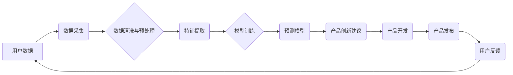

> AI、电商、产品创新、机器学习、数据分析、个性化推荐、预测模型

## 1. 背景介绍

在当今数字化时代，电商行业竞争日益激烈。为了在激烈的市场竞争中脱颖而出，电商企业必须不断寻求新的增长点，而产品创新是实现这一目标的关键。传统的产品创新模式往往依赖于市场调研、用户反馈和设计师的灵感，效率低下且难以捕捉到用户潜在需求。

近年来，人工智能（AI）技术飞速发展，为电商企业的产品创新提供了全新的机遇。AI能够通过分析海量数据，识别用户需求和趋势，并生成新的产品创意，从而加速产品创新周期，提升产品创新效率。

## 2. 核心概念与联系

**2.1 AI驱动的产品创新**

AI驱动的产品创新是指利用人工智能技术，从数据分析、需求预测、创意生成等多个环节，推动产品创新流程的智能化和高效化。

**2.2 核心概念**

* **数据分析:** AI算法能够从海量电商数据中挖掘出用户行为、购买偏好、市场趋势等有价值的信息，为产品创新提供数据支撑。
* **需求预测:** 通过分析历史数据和用户行为，AI模型能够预测未来用户需求，帮助电商企业开发符合市场需求的产品。
* **创意生成:** 一些AI算法能够根据用户需求和市场趋势，生成新的产品创意，为产品创新提供灵感。
* **个性化推荐:** AI能够根据用户的购买历史、浏览记录和兴趣爱好，提供个性化的产品推荐，提升用户体验和转化率。

**2.3 架构图**



## 3. 核心算法原理 & 具体操作步骤

**3.1 算法原理概述**

AI驱动的产品创新主要依赖于以下核心算法：

* **机器学习:** 机器学习算法能够从数据中学习模式和规律，用于预测用户需求、识别产品趋势等。
* **深度学习:** 深度学习算法能够处理更复杂的数据，例如图像、文本等，用于产品创意生成、个性化推荐等。
* **自然语言处理:** 自然语言处理算法能够理解和处理人类语言，用于分析用户评论、反馈等，获取产品改进建议。

**3.2 算法步骤详解**

1. **数据收集:** 收集用户行为数据、产品数据、市场数据等。
2. **数据清洗与预处理:** 清洗数据，去除噪声和异常值，并进行数据转换和编码。
3. **特征提取:** 从原始数据中提取有价值的特征，例如用户年龄、性别、购买历史、产品属性等。
4. **模型训练:** 使用机器学习算法训练模型，例如回归模型、分类模型、聚类模型等。
5. **模型评估:** 使用测试数据评估模型性能，并进行模型调优。
6. **产品创新应用:** 将训练好的模型应用于产品创新环节，例如预测用户需求、生成产品创意、个性化推荐等。

**3.3 算法优缺点**

* **优点:**

    * 能够处理海量数据，挖掘隐藏的模式和规律。
    * 能够自动学习和适应变化的市场环境。
    * 能够提高产品创新效率和准确性。

* **缺点:**

    * 需要大量的数据进行训练，数据质量对模型性能影响较大。
    * 模型解释性较差，难以理解模型的决策过程。
    * 需要专业的技术人员进行模型开发和维护。

**3.4 算法应用领域**

* **产品需求预测:** 预测用户未来需求，帮助电商企业开发符合市场需求的产品。
* **产品创意生成:** 根据用户需求和市场趋势，生成新的产品创意。
* **个性化推荐:** 根据用户的购买历史、浏览记录和兴趣爱好，提供个性化的产品推荐。
* **产品优化:** 分析用户反馈和产品数据，优化现有产品的功能和设计。

## 4. 数学模型和公式 & 详细讲解 & 举例说明

**4.1 数学模型构建**

在AI驱动的产品创新中，常用的数学模型包括：

* **线性回归模型:** 用于预测连续型变量，例如用户购买量、产品价格等。
* **逻辑回归模型:** 用于预测分类型变量，例如用户是否会购买产品、产品是否会成功等。
* **支持向量机:** 用于分类和回归问题，能够处理高维数据。
* **决策树:** 用于分类和回归问题，能够解释模型的决策过程。

**4.2 公式推导过程**

例如，线性回归模型的公式如下：

$$y = \beta_0 + \beta_1x_1 + \beta_2x_2 + ... + \beta_nx_n + \epsilon$$

其中：

* $y$ 是预测变量
* $x_1, x_2, ..., x_n$ 是自变量
* $\beta_0, \beta_1, ..., \beta_n$ 是模型参数
* $\epsilon$ 是误差项

模型参数可以通过最小二乘法估计。

**4.3 案例分析与讲解**

假设电商企业想要预测用户购买某款产品的概率。可以使用逻辑回归模型，将用户的购买历史、浏览记录、年龄、性别等特征作为输入，预测用户是否会购买该产品。

## 5. 项目实践：代码实例和详细解释说明

**5.1 开发环境搭建**

* Python 3.x
* Jupyter Notebook
* scikit-learn

**5.2 源代码详细实现**

```python
from sklearn.linear_model import LogisticRegression
from sklearn.model_selection import train_test_split
from sklearn.metrics import accuracy_score

# 加载数据
data = ...

# 分割数据
X_train, X_test, y_train, y_test = train_test_split(data[:, :-1], data[:, -1], test_size=0.2)

# 创建模型
model = LogisticRegression()

# 训练模型
model.fit(X_train, y_train)

# 预测结果
y_pred = model.predict(X_test)

# 计算准确率
accuracy = accuracy_score(y_test, y_pred)
print(f"准确率: {accuracy}")
```

**5.3 代码解读与分析**

* 使用 scikit-learn 库中的 LogisticRegression 类创建逻辑回归模型。
* 使用 train_test_split 函数将数据分割为训练集和测试集。
* 使用 fit 函数训练模型。
* 使用 predict 函数预测测试集的结果。
* 使用 accuracy_score 函数计算模型的准确率。

**5.4 运行结果展示**

运行代码后，会输出模型的准确率。

## 6. 实际应用场景

**6.1 产品需求预测**

电商企业可以使用 AI 预测用户未来需求，例如预测用户对特定产品的购买意愿，帮助企业制定产品开发策略。

**6.2 产品创意生成**

AI 算法能够根据用户需求和市场趋势，生成新的产品创意，例如根据用户评论和搜索趋势，生成新的产品功能或设计方案。

**6.3 个性化推荐**

AI 可以根据用户的购买历史、浏览记录和兴趣爱好，提供个性化的产品推荐，提升用户体验和转化率。

**6.4 未来应用展望**

* **更精准的个性化推荐:** 利用更先进的 AI 算法，例如深度学习，实现更精准的个性化推荐。
* **智能化的产品设计:** 利用 AI 辅助产品设计，例如生成产品外观设计、优化产品功能等。
* **虚拟试衣间:** 利用 AI 技术，实现虚拟试衣间，帮助用户在线试穿衣服。

## 7. 工具和资源推荐

**7.1 学习资源推荐**

* **书籍:**
    * 《深度学习》
    * 《机器学习实战》
* **在线课程:**
    * Coursera
    * edX
    * Udacity

**7.2 开发工具推荐**

* **Python:** 
    * scikit-learn
    * TensorFlow
    * PyTorch

**7.3 相关论文推荐**

* **《Attention Is All You Need》**
* **《BERT: Pre-training of Deep Bidirectional Transformers for Language Understanding》**

## 8. 总结：未来发展趋势与挑战

**8.1 研究成果总结**

AI 技术在电商产品创新领域取得了显著成果，例如精准的个性化推荐、智能化的产品设计等。

**8.2 未来发展趋势**

* **更强大的 AI 算法:** 随着 AI 技术的不断发展，将出现更强大的 AI 算法，能够处理更复杂的数据，提供更精准的预测和建议。
* **更广泛的应用场景:** AI 将应用于电商产品创新的更多环节，例如产品营销、物流配送等。
* **更智能化的用户体验:** AI 将帮助电商企业提供更智能化的用户体验，例如个性化的购物建议、虚拟试衣间等。

**8.3 面临的挑战**

* **数据安全和隐私保护:** AI 算法需要大量的数据进行训练，如何保证数据安全和用户隐私是需要解决的关键问题。
* **算法解释性和可信度:** 许多 AI 算法的决策过程难以解释，如何提高算法的解释性和可信度是需要进一步研究的问题。
* **人才短缺:** AI 领域人才短缺是一个普遍问题，需要加强 AI 人才培养和引进。

**8.4 研究展望**

未来，AI 技术将继续推动电商产品创新的发展，为用户提供更便捷、更智能的购物体验。


## 9. 附录：常见问题与解答

**9.1 如何选择合适的 AI 算法？**

选择合适的 AI 算法取决于具体的应用场景和数据特点。例如，如果需要预测连续型变量，可以使用线性回归模型；如果需要预测分类型变量，可以使用逻辑回归模型。

**9.2 如何保证数据质量？**

数据质量对 AI 算法性能有重要影响。需要进行数据清洗、预处理等操作，去除噪声和异常值，并进行数据转换和编码。

**9.3 如何解释 AI 算法的决策过程？**

一些 AI 算法的决策过程难以解释，可以使用可解释 AI 技术，例如决策树、局部解释模型等，来解释模型的决策过程。


作者：禅与计算机程序设计艺术 / Zen and the Art of Computer Programming 
<end_of_turn>