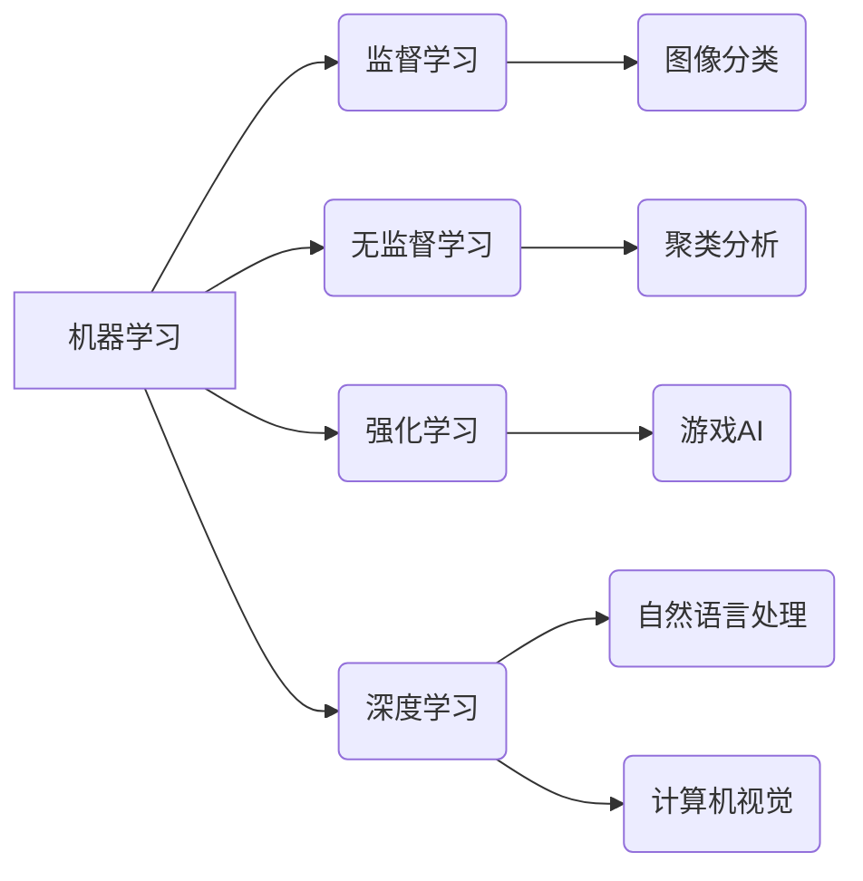

> 人工智能、深度学习、机器学习、自然语言处理、计算机视觉、伦理、未来趋势

## 1. 背景介绍

我们正处在一个人工智能（AI）发展史上的独特时刻。从 AlphaGo 击败世界围棋冠军到 GPT-3 生成逼真的文本，AI 的进步令人惊叹。这些突破性进展不仅改变了我们对智能的理解，也为各个行业带来了前所未有的机遇。

然而，AI 的发展也引发了许多伦理和社会问题，例如算法偏见、数据隐私和工作岗位替代。因此，我们需要谨慎地探索 AI 的潜力，并制定相应的规范和政策，确保其安全、可持续地发展。

## 2. 核心概念与联系

**2.1 机器学习**

机器学习是 AI 的核心技术之一，它允许计算机从数据中学习，无需明确编程。机器学习算法可以分为监督学习、无监督学习和强化学习三大类。

* **监督学习:** 利用标记数据训练模型，预测输出结果。例如，图像分类、文本分类等。
* **无监督学习:** 从未标记数据中发现模式和结构。例如，聚类分析、异常检测等。
* **强化学习:** 通过试错学习，最大化奖励。例如，游戏 AI、机器人控制等。

**2.2 深度学习**

深度学习是机器学习的一个子领域，它使用多层神经网络来模拟人类大脑的学习过程。深度学习算法能够处理海量数据，并提取出复杂的特征，从而在图像识别、语音识别、自然语言处理等领域取得突破性进展。

**2.3 自然语言处理 (NLP)**

自然语言处理是让计算机理解和处理人类语言的技术。NLP 涉及许多子领域，例如文本分类、机器翻译、问答系统等。

**2.4 计算机视觉**

计算机视觉是让计算机“看”和理解图像的技术。计算机视觉应用广泛，例如图像识别、目标检测、视频分析等。

**2.5 核心概念关系图**



## 3. 核心算法原理 & 具体操作步骤

### 3.1  算法原理概述

**3.1.1 监督学习算法原理**

监督学习算法利用标记数据训练模型，预测输出结果。训练过程可以理解为寻找一个函数，将输入特征映射到输出标签。常见的监督学习算法包括线性回归、逻辑回归、支持向量机、决策树、随机森林等。

**3.1.2 无监督学习算法原理**

无监督学习算法从未标记数据中发现模式和结构。常见的无监督学习算法包括k-means聚类、主成分分析、独立成分分析等。

**3.1.3 强化学习算法原理**

强化学习算法通过试错学习，最大化奖励。强化学习算法通常由一个智能体、一个环境和一个奖励函数组成。智能体与环境交互，根据环境的反馈获得奖励，并根据奖励调整自己的策略，最终达到最大化奖励的目标。

### 3.2  算法步骤详解

**3.2.1 监督学习算法步骤**

1. **数据收集和预处理:** 收集相关数据，并进行清洗、转换、特征工程等预处理操作。
2. **模型选择:** 根据任务需求选择合适的监督学习算法。
3. **模型训练:** 使用训练数据训练模型，调整模型参数，使模型能够准确预测输出结果。
4. **模型评估:** 使用测试数据评估模型的性能，例如准确率、召回率、F1-score等。
5. **模型部署:** 将训练好的模型部署到实际应用场景中。

**3.2.2 无监督学习算法步骤**

1. **数据收集和预处理:** 收集相关数据，并进行清洗、转换等预处理操作。
2. **模型选择:** 根据任务需求选择合适的无监督学习算法。
3. **模型训练:** 使用训练数据训练模型，发现数据中的模式和结构。
4. **结果分析:** 分析模型输出的结果，例如聚类结果、降维结果等。

**3.2.3 强化学习算法步骤**

1. **环境定义:** 定义强化学习环境，包括状态空间、动作空间、奖励函数等。
2. **智能体设计:** 设计智能体，例如使用深度神经网络作为智能体的行为策略。
3. **训练过程:** 智能体与环境交互，根据环境的反馈获得奖励，并根据奖励调整自己的策略，最终达到最大化奖励的目标。
4. **策略评估:** 评估训练好的策略的性能，例如平均奖励、收敛速度等。

### 3.3  算法优缺点

**3.3.1 监督学习算法**

* **优点:** 准确率高，能够处理各种类型的数据。
* **缺点:** 需要大量的标记数据，容易受到数据偏差的影响。

**3.3.2 无监督学习算法**

* **优点:** 不需要标记数据，能够发现数据中的隐含结构。
* **缺点:** 难以评估模型性能，结果解释性较差。

**3.3.3 强化学习算法**

* **优点:** 可以学习复杂的行为策略，能够适应动态环境。
* **缺点:** 训练过程复杂，需要大量的试错和奖励信号。

### 3.4  算法应用领域

* **监督学习:** 图像识别、文本分类、语音识别、欺诈检测等。
* **无监督学习:** 客户画像、异常检测、推荐系统等。
* **强化学习:** 游戏 AI、机器人控制、自动驾驶等。

## 4. 数学模型和公式 & 详细讲解 & 举例说明

### 4.1  数学模型构建

**4.1.1 线性回归模型**

线性回归模型假设输入特征和输出标签之间存在线性关系。模型的数学表达式为：

$$y = w_0 + w_1x_1 + w_2x_2 + ... + w_nx_n$$

其中：

* $y$ 是输出标签
* $w_0, w_1, w_2, ..., w_n$ 是模型参数
* $x_1, x_2, ..., x_n$ 是输入特征

**4.1.2 逻辑回归模型**

逻辑回归模型用于二分类问题，它将线性回归模型的输出映射到0到1之间的概率值。模型的数学表达式为：

$$p(y=1|x) = \frac{1}{1 + e^{-(w_0 + w_1x_1 + w_2x_2 + ... + w_nx_n)}}$$

其中：

* $p(y=1|x)$ 是给定输入特征 $x$ 时，输出标签为1的概率
* $w_0, w_1, w_2, ..., w_n$ 是模型参数
* $x_1, x_2, ..., x_n$ 是输入特征

### 4.2  公式推导过程

**4.2.1 线性回归模型参数估计**

线性回归模型的参数估计可以使用最小二乘法。最小二乘法的目标是找到一组参数，使得模型预测值与真实值之间的误差平方和最小。

**4.2.2 逻辑回归模型参数估计**

逻辑回归模型的参数估计可以使用最大似然估计。最大似然估计的目标是找到一组参数，使得模型能够最大化观测数据的似然概率。

### 4.3  案例分析与讲解

**4.3.1 线性回归模型案例**

假设我们想要预测房屋价格，输入特征包括房屋面积、房间数量、地理位置等。我们可以使用线性回归模型来建立房屋价格预测模型。

**4.3.2 逻辑回归模型案例**

假设我们想要预测客户是否会点击广告，输入特征包括客户年龄、性别、浏览历史等。我们可以使用逻辑回归模型来建立客户点击广告预测模型。

## 5. 项目实践：代码实例和详细解释说明

### 5.1  开发环境搭建

* Python 3.x
* TensorFlow 或 PyTorch
* Jupyter Notebook

### 5.2  源代码详细实现

```python
# 使用 TensorFlow 实现线性回归模型

import tensorflow as tf

# 定义模型输入
input_layer = tf.keras.Input(shape=(1,))

# 定义模型输出
output_layer = tf.keras.layers.Dense(1)(input_layer)

# 创建模型
model = tf.keras.Model(inputs=input_layer, outputs=output_layer)

# 编译模型
model.compile(optimizer='adam', loss='mse')

# 训练模型
model.fit(x_train, y_train, epochs=10)

# 评估模型
loss = model.evaluate(x_test, y_test)
```

### 5.3  代码解读与分析

* **定义模型输入和输出:** 使用 `tf.keras.Input` 定义模型输入，使用 `tf.keras.layers.Dense` 定义模型输出。
* **创建模型:** 使用 `tf.keras.Model` 创建模型，将输入层和输出层连接起来。
* **编译模型:** 使用 `model.compile` 编译模型，指定优化器、损失函数等参数。
* **训练模型:** 使用 `model.fit` 训练模型，传入训练数据和训练轮数。
* **评估模型:** 使用 `model.evaluate` 评估模型，传入测试数据并计算损失值。

### 5.4  运行结果展示

训练完成后，我们可以使用测试数据预测输出结果，并与真实值进行比较，评估模型的性能。

## 6. 实际应用场景

### 6.1  医疗保健

* **疾病诊断:** 使用 AI 算法分析患者的医疗影像、病历等数据，辅助医生诊断疾病。
* **药物研发:** 使用 AI 算法加速药物研发过程，例如预测药物的有效性、安全性等。

### 6.2  金融服务

* **欺诈检测:** 使用 AI 算法分析交易数据，识别异常交易行为，防止欺诈。
* **风险管理:** 使用 AI 算法评估投资风险，帮助金融机构做出更明智的决策。

### 6.3  制造业

* **预测性维护:** 使用 AI 算法分析设备运行数据，预测设备故障，进行及时维护。
* **质量控制:** 使用 AI 算法识别产品缺陷，提高产品质量。

### 6.4  未来应用展望

AI 技术的应用场景还在不断扩展，未来将应用于更多领域，例如教育、交通、能源等。

## 7. 工具和资源推荐

### 7.1  学习资源推荐

* **在线课程:** Coursera、edX、Udacity 等平台提供丰富的 AI 课程。
* **书籍:** 《深度学习》、《机器学习实战》等书籍是学习 AI 的经典教材。
* **博客和论坛:** TensorFlow、PyTorch 等框架的官方博客和论坛提供大量技术文档和社区支持。

### 7.2  开发工具推荐

* **TensorFlow:** Google 开发的开源深度学习框架。
* **PyTorch:** Facebook 开发的开源深度学习框架。
* **Keras:** TensorFlow 上的深度学习 API，易于使用。

### 7.3  相关论文推荐

* **AlphaGo论文:** https://arxiv.org/abs/1607.02886
* **GPT-3论文:** https://arxiv.org/abs/2005.14165

## 8. 总结：未来发展趋势与挑战

### 8.1  研究成果总结

近年来，AI 技术取得了长足进步，在各个领域都取得了突破性进展。

### 8.2  未来发展趋势

* **模型规模和能力的提升:** 未来 AI 模型将更加强大，能够处理更复杂的任务。
* **算法效率的提高:** 未来 AI 算法将更加高效，能够在更短的时间内完成训练和推理。
* **跨模态学习:** 未来 AI 将能够处理多种类型的数据，例如文本、图像、音频等。
* **解释性 AI:** 未来 AI 模型将更加