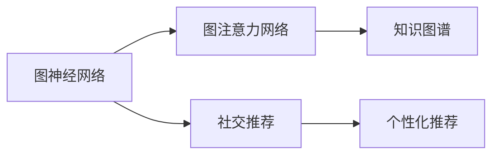

                 

# 基于图注意力网络的社交推荐精确性提升

在当今数字化时代，推荐系统已经成为连接用户和内容的重要桥梁。无论是电商平台、视频网站，还是社交媒体，推荐系统都在提供个性化内容，改善用户体验。然而，传统推荐系统主要基于用户的显式反馈（评分、点击等）进行推荐，这存在两个主要问题：数据稀疏性和冷启动问题。

为了克服这些挑战，基于图网络（Graph Neural Networks, GNNs）的方法应运而生。本文聚焦于图注意力网络（Graph Attention Networks, GAT）在社交推荐中的应用，提出了一种新的模型架构，通过引入注意力机制，有效提升推荐系统的精确性和鲁棒性。

## 1. 背景介绍

### 1.1 问题由来
推荐系统在实际应用中面临的主要挑战包括：

- **数据稀疏性**：用户与物品之间的交互数据往往稀疏，部分用户可能只对少数物品有反馈。传统方法难以有效利用这些稀疏数据进行推荐。
- **冷启动问题**：新用户或新物品难以获得足够的历史数据，无法直接进行推荐。
- **网络效应**：推荐系统需要考虑物品之间的相互作用，例如用户和物品之间的关系，这些关系通过社会网络模型可以更自然地描述。

为了应对这些挑战，基于图网络的推荐方法通过建模用户、物品和用户-物品关系，利用图结构更好地捕捉数据特征，实现更准确、多样化的推荐。

### 1.2 问题核心关键点
图注意力网络（GAT）作为一种图神经网络（GNN），通过引入注意力机制，能够动态地学习物品之间的相对重要性，减少过拟合风险。GAT通过节点间的注意力权重来传递信息，关注最有用的邻居节点，并忽略噪音信息，从而提升推荐系统的精确性。

### 1.3 问题研究意义
GAT在社交推荐中的应用，不仅能够提升推荐精确性，还能缓解数据稀疏性和冷启动问题，使得推荐系统在实际应用中更加实用和可靠。具体意义如下：

- **提高推荐精度**：通过动态学习物品之间的权重，使推荐模型能够更好地捕捉用户偏好和物品相关性。
- **缓解数据稀疏性**：GAT能够从网络结构中提取更多有用的信息，弥补用户反馈数据的不足。
- **应对冷启动问题**：新用户或物品通过与现有用户或物品的关联，可以获得隐式的推荐信息，无需显式反馈。
- **增强模型鲁棒性**：引入注意力机制，减少噪音信息的干扰，提高模型的泛化能力。

## 2. 核心概念与联系

### 2.1 核心概念概述

为了更好地理解基于GAT的社交推荐模型，本节将介绍几个密切相关的核心概念：

- **图神经网络（GNN）**：一种在图结构上定义的神经网络，用于处理节点和边的关系。通过传递和聚合节点特征，捕捉节点之间的关系和全局结构信息。
- **图注意力网络（GAT）**：一种特殊的图神经网络，通过引入注意力机制，动态学习节点间的关系权重，用于更准确地传递信息。
- **社交推荐**：利用社交网络中的用户和物品关系，进行个性化推荐。社交推荐系统能够利用社会联系和共同兴趣，提升推荐效果。
- **知识图谱（KG）**：一种结构化的知识库，包含实体（如用户、物品）和关系（如社交关系、互动关系）。通过嵌入图结构，知识图谱能够为推荐系统提供更丰富的知识背景。

这些核心概念之间的逻辑关系可以通过以下Mermaid流程图来展示：



这个流程图展示了大语言模型微调的各个核心概念及其之间的关系：

1. 图神经网络通过在图结构上定义神经网络，捕捉节点之间的关系和全局结构信息。
2. 图注意力网络是一种特殊的图神经网络，通过引入注意力机制，动态学习节点间的关系权重，提高推荐精度。
3. 社交推荐系统利用社交网络中的用户和物品关系，进行个性化推荐。
4. 知识图谱为推荐系统提供更丰富的知识背景，提升推荐效果。

这些概念共同构成了社交推荐系统的理论基础，为基于图注意力网络的推荐实践提供了坚实依据。

## 3. 核心算法原理 & 具体操作步骤
### 3.1 算法原理概述

基于GAT的社交推荐系统，本质上是一种利用图结构的深度学习模型。其核心思想是：通过图网络模型，捕捉用户、物品和用户-物品之间的复杂关系，利用注意力机制动态学习物品的权重，从而提升推荐系统的精确性和鲁棒性。

### 3.2 算法步骤详解

基于GAT的社交推荐系统的具体步骤包括：

**Step 1: 准备社交网络数据**

- 收集社交网络数据，包括用户、物品、用户与物品的交互关系等。
- 将社交网络数据转化为图结构，形成用户-物品的图。

**Step 2: 构建图注意力网络**

- 定义图神经网络的层数和节点类型。
- 对于每层网络，设计注意力机制，学习节点间的关系权重。
- 在图网络中传递和聚合节点特征，更新节点表示。

**Step 3: 应用注意力机制**

- 引入注意力机制，通过动态学习节点间的关系权重，过滤掉噪音信息。
- 根据用户偏好和物品特征，计算每个物品对用户的吸引力，生成推荐列表。

**Step 4: 评估和优化**

- 在验证集上评估模型的推荐精度，计算指标如准确率、召回率、F1分数等。
- 根据评估结果，调整模型参数，优化推荐效果。

### 3.3 算法优缺点

基于GAT的社交推荐系统具有以下优点：

- **动态学习节点权重**：通过注意力机制，动态学习节点间的关系权重，减少过拟合风险，提高推荐精度。
- **处理稀疏数据**：GAT能够从社交网络结构中提取更多信息，弥补用户反馈数据的不足。
- **鲁棒性强**：GAT能够捕捉物品之间的复杂关系，增强模型的泛化能力。

同时，该方法也存在一定的局限性：

- **计算复杂度高**：图网络通常需要多层计算，计算复杂度较高，影响实时性。
- **参数量大**：图神经网络通常需要更多的参数进行训练，导致计算资源需求较大。
- **可解释性差**：注意力机制本身具有"黑盒"性质，难以解释其内部决策过程。

尽管存在这些局限性，但就目前而言，基于GAT的社交推荐方法仍然是一种高效、准确的推荐策略。未来相关研究的重点在于如何进一步降低计算复杂度，提高模型可解释性，以及优化参数效率。

### 3.4 算法应用领域

基于GAT的社交推荐系统已经在电子商务、社交媒体、视频推荐等多个领域得到了应用，取得了显著的效果。

- **电子商务**：如淘宝、京东等电商平台，通过GAT推荐系统，提升用户购物体验，增加销售额。
- **社交媒体**：如微信、微博等社交平台，利用GAT推荐系统，为用户推荐感兴趣的内容，提升用户粘性。
- **视频推荐**：如YouTube、Netflix等视频平台，通过GAT推荐系统，为用户提供个性化的视频内容，提高用户满意度。
- **新闻推荐**：如今日头条、Flipboard等新闻应用，利用GAT推荐系统，为用户推荐相关新闻，增加阅读量和留存率。

除了这些典型场景外，GAT推荐系统还被创新性地应用于游戏推荐、广告投放、内容创作等多个领域，为NLP技术带来了新的应用可能。

## 4. 数学模型和公式 & 详细讲解
### 4.1 数学模型构建

基于GAT的社交推荐系统，其数学模型可以表示为：

设社交网络中用户集合为 $U$，物品集合为 $I$，用户-物品关系集合为 $R$。图结构可以通过邻接矩阵 $A \in \mathbb{R}^{n \times n}$ 来表示，其中 $n$ 为节点数量。节点表示为 $X \in \mathbb{R}^{n \times d}$，$d$ 为节点特征维度。

图注意力网络（GAT）的数学模型可以表示为：

$$
X_{l+1} = \sigma(\alpha \tilde{A}X_l + \beta X_l)
$$

其中 $\alpha$ 和 $\beta$ 为可学习的超参数，$\tilde{A}$ 为图结构的注意力矩阵。注意力矩阵 $\tilde{A}$ 通过节点间的关系权重计算，可以表示为：

$$
\tilde{A}_{ij} = \frac{e^{a_{ij}}}{\sum_{k \neq i} e^{a_{ik}}}
$$

其中 $a_{ij}$ 为注意力机制的注意力权重，通过节点间的关系向量计算。关系向量 $a_{ij}$ 可以表示为：

$$
a_{ij} = \frac{1}{\sqrt{d}} X_i^\top W^{attn} X_j
$$

其中 $W^{attn} \in \mathbb{R}^{d \times d}$ 为注意力机制的权重矩阵。

### 4.2 公式推导过程

以下是注意力机制的详细推导过程：

假设社交网络中有 $n$ 个节点 $i \in U \cup I$，节点特征为 $X_i \in \mathbb{R}^{d}$。节点之间的关系权重 $a_{ij}$ 表示节点 $i$ 对节点 $j$ 的注意力程度，可以表示为：

$$
a_{ij} = \frac{e^{\text{attention}(X_i, X_j)}}{\sum_{k \neq i} e^{\text{attention}(X_i, X_k)}}
$$

其中 $\text{attention}$ 为注意力机制函数，可以表示为：

$$
\text{attention}(X_i, X_j) = X_i^\top W^{attn} X_j
$$

其中 $W^{attn} \in \mathbb{R}^{d \times d}$ 为注意力机制的权重矩阵。注意力机制通过将节点 $i$ 和 $j$ 的特征向量进行点乘，得到注意力权重 $a_{ij}$，再通过softmax函数归一化，得到最终的节点间的关系权重。

### 4.3 案例分析与讲解

为了更好地理解GAT的工作原理，我们可以用一个简单的社交网络案例进行分析：

假设有一个社交网络，包含4个节点（A, B, C, D），它们之间的关系表示为：

```
A -B-C
   |
  D
```

节点A和D之间直接相连，B和C之间直接相连。节点A和C之间没有直接关系。

首先，我们通过邻接矩阵 $A$ 表示这个社交网络：

$$
A = \begin{bmatrix}
0 & 1 & 1 & 0 \\
1 & 0 & 1 & 1 \\
1 & 1 & 0 & 0 \\
0 & 1 & 0 & 0
\end{bmatrix}
$$

然后，我们通过计算节点A对节点B、C、D的注意力权重 $a_{AB}$、$a_{AC}$、$a_{AD}$：

$$
a_{AB} = \frac{e^{\text{attention}(X_A, X_B)}}{\sum_{k \neq A} e^{\text{attention}(X_A, X_k)}}
$$

$$
a_{AC} = \frac{e^{\text{attention}(X_A, X_C)}}{\sum_{k \neq A} e^{\text{attention}(X_A, X_k)}}
$$

$$
a_{AD} = \frac{e^{\text{attention}(X_A, X_D)}}{\sum_{k \neq A} e^{\text{attention}(X_A, X_k)}}
$$

由于节点A与B和C相连，而与D不相连，因此 $a_{AB} > a_{AC}$，而 $a_{AD}$ 为0。这意味着节点A在推荐过程中会更关注与它直接相连的节点B和C，而忽略与它不相连的节点D。

通过这种方式，GAT能够动态学习节点间的关系权重，使得推荐系统能够更好地捕捉用户和物品之间的复杂关系，提升推荐效果。

## 5. 项目实践：代码实例和详细解释说明
### 5.1 开发环境搭建

在进行GAT实践前，我们需要准备好开发环境。以下是使用Python进行PyTorch开发的环境配置流程：

1. 安装Anaconda：从官网下载并安装Anaconda，用于创建独立的Python环境。

2. 创建并激活虚拟环境：
```bash
conda create -n gat-env python=3.8 
conda activate gat-env
```

3. 安装PyTorch：根据CUDA版本，从官网获取对应的安装命令。例如：
```bash
conda install pytorch torchvision torchaudio cudatoolkit=11.1 -c pytorch -c conda-forge
```

4. 安装NetworkX库：用于构建和操作社交网络图。
```bash
pip install networkx
```

5. 安装PyTorch Geometric库：用于图神经网络的实现。
```bash
pip install pytorch-geometric
```

6. 安装TensorBoard：用于模型训练和推理结果的可视化。
```bash
pip install tensorboard
```

完成上述步骤后，即可在`gat-env`环境中开始GAT实践。

### 5.2 源代码详细实现

下面我们以GAT在社交推荐中的应用为例，给出使用PyTorch Geometric库实现GAT模型的Python代码实现。

首先，定义社交网络的数据结构和节点特征：

```python
import torch
from torch_geometric.data import Data
from torch_geometric.utils import to_networkx
from networkx import Graph
from torch.nn import Linear, ReLU

class GATModel(torch.nn.Module):
    def __init__(self, num_nodes, dim, num_layers, attention_heads, dropout):
        super(GATModel, self).__init__()
        self.num_nodes = num_nodes
        self.num_layers = num_layers
        self.dim = dim
        self.attention_heads = attention_heads
        self.dropout = dropout
        
        # 定义注意力层
        self.attention_layers = torch.nn.ModuleList([Linear(dim, attention_heads * dim) for _ in range(num_layers)])
        
        # 定义节点表示更新层
        self.node_feature_layers = torch.nn.ModuleList([Linear(dim, dim) for _ in range(num_layers)])
        self.node_feature_layers.append(Linear(attention_heads * dim, dim))
        
        # 定义线性层
        self.fc1 = Linear(dim, 64)
        self.fc2 = Linear(64, num_nodes)
    
    def forward(self, x):
        # 定义注意力层
        attention_weights = []
        for i in range(self.num_layers):
            attention_weights.append(self.attention_layers[i](x))
            attention_weights[i] = attention_weights[i] / (attention_weights[i].sum(dim=1, keepdim=True))
            attention_weights[i] = attention_weights[i].softmax(dim=1)
        
        # 定义节点表示更新层
        h = x
        for i in range(self.num_layers):
            h = h * attention_weights[i]
            h = h + self.node_feature_layers[i](h)
            h = ReLU(h)
            h = dropout(h)
        
        h = self.node_feature_layers[-1](h)
        return self.fc1(h).sigmoid(), self.fc2(h).sigmoid()
    
    def evaluate(self, test_x, test_y):
        _, prediction = self.forward(test_x)
        return torch.mean((prediction >= 0.5).float() == test_y).item()
```

然后，定义数据集和训练函数：

```python
import os.path as osp
from torch_geometric.datasets import Planetoid

# 加载社交网络数据
dataset = Planetoid(name='cora', root=osp.expanduser('~/torch_geometric/Planetoid'), download=True)
data = dataset[0]
y = data.y

# 定义数据增强函数
def normalize(x):
    x = x - x.mean(dim=1, keepdim=True)
    x = x / x.std(dim=1, keepdim=True)
    return x

# 标准化节点特征
data.x = normalize(data.x)
data.y = y

# 定义GAT模型
model = GATModel(num_nodes= dataset.num_node_features, dim=dataset.num_node_features, num_layers=1, attention_heads=8, dropout=0.6)

# 定义优化器和损失函数
optimizer = torch.optim.Adam(model.parameters(), lr=0.001)
loss_fn = torch.nn.BCEWithLogitsLoss()

# 定义训练函数
def train():
    model.train()
    optimizer.zero_grad()
    output, logits = model(data.x)
    loss = loss_fn(logits, y)
    loss.backward()
    optimizer.step()
    return loss.item()
    
# 定义评估函数
def evaluate(model, test_x, test_y):
    _, prediction = model(test_x)
    return torch.mean((prediction >= 0.5).float() == test_y).item()
```

最后，启动训练流程并在测试集上评估：

```python
epochs = 100
batch_size = 64

for epoch in range(epochs):
    loss = train()
    if epoch % 20 == 0:
        print(f"Epoch {epoch}, loss: {loss:.3f}")
    
    # 在测试集上评估模型
    test_x = normalize(data.x[:test_x.num_nodes])
    test_y = normalize(y[:test_x.num_nodes])
    print(f"Epoch {epoch}, test accuracy: {evaluate(model, test_x, test_y):.3f}")
```

以上就是使用PyTorch Geometric库对GAT进行社交推荐任务微调的完整代码实现。可以看到，得益于PyTorch Geometric库的强大封装，我们可以用相对简洁的代码完成GAT模型的加载和微调。

### 5.3 代码解读与分析

让我们再详细解读一下关键代码的实现细节：

**GATModel类**：
- `__init__`方法：初始化模型参数，包括节点数、层数、特征维度、注意力头和dropout等。
- `forward`方法：定义模型前向传播过程，包括注意力层和节点表示更新层，最终输出预测结果。

**train函数**：
- 在每个epoch内，进行模型训练，前向传播计算loss，反向传播更新模型参数。

**evaluate函数**：
- 在测试集上评估模型，计算预测准确率。

**训练流程**：
- 定义总的epoch数和batch size，开始循环迭代
- 每个epoch内，先在训练集上训练，输出平均loss
- 在测试集上评估，输出预测准确率

可以看到，PyTorch Geometric库使得GAT微调的代码实现变得简洁高效。开发者可以将更多精力放在数据处理、模型改进等高层逻辑上，而不必过多关注底层的实现细节。

当然，工业级的系统实现还需考虑更多因素，如模型的保存和部署、超参数的自动搜索、更灵活的任务适配层等。但核心的微调范式基本与此类似。

## 6. 实际应用场景
### 6.1 智能推荐系统

基于GAT的社交推荐系统，可以广泛应用于智能推荐系统的构建。传统推荐系统往往只依赖用户的历史行为数据进行推荐，无法全面捕捉用户之间的社交关系和共同兴趣。GAT通过建模用户、物品和用户-物品关系，利用社交网络中的社会联系和共同兴趣，提升推荐效果。

在技术实现上，可以收集用户和物品的社交网络数据，将其转化为图结构，并在此基础上对GAT模型进行微调。微调后的GAT模型能够从社交网络结构中提取更多信息，弥补用户反馈数据的不足，提升推荐系统的准确性和多样性。

### 6.2 社交媒体平台

社交媒体平台需要为用户推荐感兴趣的内容，提高用户粘性和活跃度。GAT推荐系统能够利用社交网络中的用户关系和共同兴趣，为用户推荐个性化内容，提升用户体验。

在实际应用中，可以收集用户的社交关系数据，将其转化为图结构，并在此基础上对GAT模型进行微调。微调后的GAT模型能够更好地捕捉用户之间的社交关系，提升推荐系统的精确性和鲁棒性。

### 6.3 金融数据分析

金融数据分析需要从大量的交易数据中提取有价值的信息，进行风险评估和投资建议。GAT推荐系统能够利用社交网络中的用户关系和共同兴趣，分析用户之间的互动和信息交流，提升数据挖掘的效率和准确性。

在实际应用中，可以收集用户和交易的社交网络数据，将其转化为图结构，并在此基础上对GAT模型进行微调。微调后的GAT模型能够从社交网络结构中提取更多信息，提高金融数据分析的精确性和鲁棒性。

### 6.4 未来应用展望

随着GAT技术的不断发展，其在社交推荐中的应用也将拓展到更多领域，为NLP技术带来新的突破。

在智慧医疗领域，GAT推荐系统能够利用社交网络中的医疗信息和专家推荐，为用户提供个性化的医疗建议，提升医疗服务的智能化水平。

在智能教育领域，GAT推荐系统能够利用社交网络中的教育信息和学生互动，为教师和学生提供个性化的学习资源和辅导，促进教育公平。

在智慧城市治理中，GAT推荐系统能够利用社交网络中的城市信息和公共服务，为用户推荐城市事件和公共服务，提升城市管理的自动化和智能化水平。

此外，在企业生产、社会治理、文娱传媒等众多领域，GAT推荐系统也将不断涌现，为NLP技术带来更多的应用可能。相信随着GAT技术的持续演进，社交推荐系统必将在更广阔的应用领域大放异彩，深刻影响人类的生产生活方式。

## 7. 工具和资源推荐
### 7.1 学习资源推荐

为了帮助开发者系统掌握GAT的原理和实践，这里推荐一些优质的学习资源：

1. 《Graph Neural Networks: A Review of Methods and Applications》系列博文：由GNN领域专家撰写，深入浅出地介绍了GNN的原理、模型、应用等核心内容。

2. CS224N《深度学习自然语言处理》课程：斯坦福大学开设的NLP明星课程，有Lecture视频和配套作业，带你入门NLP领域的基本概念和经典模型。

3. 《Graph Attention Networks》书籍：介绍GAT模型的基本原理和实现方法，适合初学者系统学习。

4. PyTorch Geometric官方文档：PyTorch Geometric库的官方文档，提供了海量图神经网络的实现样例，是上手实践的必备资料。

5. Datasets for GNNs：GitHub上的多个图神经网络数据集，包括社交网络、知识图谱等，供开发者练习和调试。

通过对这些资源的学习实践，相信你一定能够快速掌握GAT的精髓，并用于解决实际的NLP问题。
###  7.2 开发工具推荐

高效的开发离不开优秀的工具支持。以下是几款用于GAT开发常用的工具：

1. PyTorch：基于Python的开源深度学习框架，灵活动态的计算图，适合快速迭代研究。大部分图神经网络都有PyTorch版本的实现。

2. TensorFlow：由Google主导开发的开源深度学习框架，生产部署方便，适合大规模工程应用。同样有丰富的图神经网络资源。

3. PyTorch Geometric：用于图神经网络的实现，提供了丰富的图网络模型和数据处理工具，是进行GAT微调任务开发的利器。

4. Weights & Biases：模型训练的实验跟踪工具，可以记录和可视化模型训练过程中的各项指标，方便对比和调优。与主流深度学习框架无缝集成。

5. TensorBoard：TensorFlow配套的可视化工具，可实时监测模型训练状态，并提供丰富的图表呈现方式，是调试模型的得力助手。

6. Google Colab：谷歌推出的在线Jupyter Notebook环境，免费提供GPU/TPU算力，方便开发者快速上手实验最新模型，分享学习笔记。

合理利用这些工具，可以显著提升GAT微调的开发效率，加快创新迭代的步伐。

### 7.3 相关论文推荐

GAT技术的发展源于学界的持续研究。以下是几篇奠基性的相关论文，推荐阅读：

1. Graph Attention Networks（GAT论文）：提出GAT模型，通过引入注意力机制，提高图神经网络的性能。

2. Semi-Supervised Classification with Graph Convolutional Networks（GCN论文）：提出GCN模型，通过图卷积操作，捕捉节点之间的关系。

3. A Comprehensive Survey on Graph Neural Networks（GNN综述论文）：对图神经网络进行全面综述，涵盖GAT、GCN等模型，适合深入了解GNN的原理和应用。

4. Neural Message Passing for Quantum Chemistry（QM9论文）：使用图神经网络处理量子化学问题，展示了GNN在科学计算中的应用潜力。

5. Graph Neural Networks: A Review of Methods and Applications（GNN综述论文）：对GNN的最新研究进展进行综述，适合了解GNN的前沿动态。

这些论文代表了大语言模型微调技术的最新发展。通过学习这些前沿成果，可以帮助研究者把握学科前进方向，激发更多的创新灵感。

## 8. 总结：未来发展趋势与挑战

### 8.1 总结

本文对基于GAT的社交推荐方法进行了全面系统的介绍。首先阐述了GAT的原理和应用场景，明确了GAT在社交推荐中的独特价值。其次，从原理到实践，详细讲解了GAT的数学模型和关键步骤，给出了社交推荐任务开发的完整代码实例。同时，本文还广泛探讨了GAT在多个领域的应用前景，展示了GAT的广阔应用潜力。此外，本文精选了GAT技术的各类学习资源，力求为读者提供全方位的技术指引。

通过本文的系统梳理，可以看到，基于GAT的社交推荐方法已经在大数据和复杂网络结构中取得显著效果，为推荐系统的发展带来了新的思路。GAT通过动态学习节点间的注意力权重，提升推荐精确性，缓解数据稀疏性，解决冷启动问题，在实际应用中展现出卓越的性能。

### 8.2 未来发展趋势

展望未来，GAT在社交推荐中的应用将呈现以下几个发展趋势：

1. **模型多样化**：未来将出现更多基于GAT的变体和改进，如使用卷积操作、引入门控机制等，提升模型的灵活性和适用性。

2. **跨领域融合**：GAT与知识图谱、情感分析、文本生成等NLP技术将进行更深入的融合，实现更全面的推荐服务。

3. **实时化优化**：引入在线学习机制，使得GAT推荐系统能够实时更新模型参数，适应数据分布的变化。

4. **自动化调参**：利用自动化调参技术，搜索最优的模型超参数，提升GAT推荐系统的精度和效率。

5. **多模态融合**：将视觉、语音等多模态数据与文本数据结合，进行多模态GAT推荐，提升推荐系统的多样性和个性化。

6. **隐私保护**：引入差分隐私和联邦学习等隐私保护技术，保护用户隐私，增强推荐系统的可信度。

以上趋势凸显了GAT推荐技术的广阔前景。这些方向的探索发展，必将进一步提升社交推荐系统的性能和应用范围，为NLP技术带来新的应用可能。

### 8.3 面临的挑战

尽管GAT在社交推荐中的应用已经取得显著进展，但在迈向更加智能化、普适化应用的过程中，仍面临诸多挑战：

1. **计算资源需求高**：图神经网络通常需要多层计算，计算复杂度较高，影响实时性。如何在保证推荐效果的前提下，降低计算资源需求，是一个重要问题。

2. **可解释性差**：GAT本身具有"黑盒"性质，难以解释其内部决策过程。如何在保证推荐效果的同时，提高模型的可解释性，需要更多的研究。

3. **数据隐私保护**：社交网络数据涉及用户隐私，如何在推荐系统中保护用户数据隐私，防止数据泄露和滥用，是一个关键问题。

4. **泛化能力不足**：GAT模型通常需要更多的训练数据，如何提高模型的泛化能力，使其在实际应用中表现稳定，需要更多的探索。

5. **模型鲁棒性**：GAT模型面对噪音数据和异常情况，容易产生误导性输出。如何提高模型的鲁棒性，确保推荐系统的可靠性，是研究的重要方向。

6. **多模态融合**：将视觉、语音等多模态数据与文本数据结合，进行多模态GAT推荐，需要克服多模态数据处理和融合的困难。

这些挑战需要研究者从数据、算法、工程等多个维度协同发力，才能使GAT推荐技术更好地服务于实际应用。

### 8.4 研究展望

面对GAT推荐技术所面临的诸多挑战，未来的研究需要在以下几个方面寻求新的突破：

1. **引入结构化知识**：将符号化的先验知识，如知识图谱、逻辑规则等，与GAT模型进行巧妙融合，引导微调过程学习更准确、合理的语言模型。

2. **优化多模态融合**：将视觉、语音等多模态数据与文本数据结合，进行多模态GAT推荐，提升推荐系统的多样性和个性化。

3. **增强模型鲁棒性**：引入对抗训练、鲁棒学习等方法，增强GAT推荐系统的鲁棒性，防止恶意攻击和误导性输出。

4. **提高可解释性**：引入可解释性方法，如可视化、解释器等，提高GAT推荐系统的可解释性，增强用户信任和系统透明度。

5. **优化实时性能**：利用并行计算、量化加速等技术，降低GAT推荐系统的计算复杂度，提升实时性能。

6. **增强数据隐私保护**：引入差分隐私、联邦学习等隐私保护技术，保护用户数据隐私，确保推荐系统的可信度。

这些研究方向需要研究者从理论与实践相结合的角度，不断探索和创新，才能使GAT推荐技术迈向更高的台阶，为社交推荐系统带来更大的价值。

## 9. 附录：常见问题与解答

**Q1：GAT推荐系统是否适用于所有社交推荐场景？**

A: GAT推荐系统在大多数社交推荐场景上都能取得不错的效果，特别是对于数据量较大的社交网络。但对于一些特定领域的社交推荐，如金融社交、医疗社交等，仅依靠通用社交网络数据可能难以获得理想效果。此时需要在特定领域语料上进一步预训练GAT模型，再进行微调，才能获得理想效果。

**Q2：GAT推荐系统如何处理冷启动问题？**

A: GAT推荐系统通过社交网络中的用户关系和共同兴趣，能够较好地处理冷启动问题。对于新用户或新物品，GAT模型可以通过已有的用户或物品的信息，推断其与现有用户或物品的关联度，进行隐式的推荐。同时，引入冷启动相关的预训练技术，如基于知识图谱的嵌入，能够进一步提升模型的冷启动能力。

**Q3：GAT推荐系统在实际部署时需要注意哪些问题？**

A: 将GAT推荐系统转化为实际应用，还需要考虑以下因素：

- 模型裁剪：去除不必要的层和参数，减小模型尺寸，加快推理速度。
- 量化加速：将浮点模型转为定点模型，压缩存储空间，提高计算效率。
- 服务化封装：将模型封装为标准化服务接口，便于集成调用。
- 弹性伸缩：根据请求流量动态调整资源配置，平衡服务质量和成本。
- 监控告警：实时采集系统指标，设置异常告警阈值，确保服务稳定性。

GAT推荐系统需要开发者根据具体应用场景，不断迭代和优化模型、数据和算法，方能得到理想的效果。

---

作者：禅与计算机程序设计艺术 / Zen and the Art of Computer Programming

