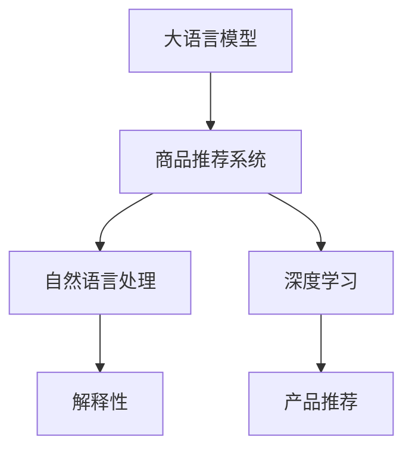

                 

# 基于大模型的商品推荐解释性研究

> 关键词：商品推荐系统, 大语言模型, 解释性, 自然语言处理, 深度学习, 产品推荐

## 1. 背景介绍

### 1.1 问题由来
在当前互联网电商时代，商品推荐系统已成为提升用户体验、提高销售转化率的重要手段。然而，在传统的基于协同过滤、矩阵分解等方法构建的推荐系统中，用户的推荐兴趣往往是“黑箱”，用户难以理解系统的推荐逻辑。随着深度学习技术和大模型的快速发展，推荐系统的推荐能力得到了显著提升，但同样面临推荐过程不透明、解释性不足的问题。

### 1.2 问题核心关键点
本研究聚焦于基于大语言模型的商品推荐系统的解释性研究。我们认为，将大语言模型的语言理解能力应用于商品推荐系统，可以赋予系统更强的理解和生成能力，同时通过自然语言形式解释推荐结果，可以显著提升系统的可解释性。

### 1.3 问题研究意义
1. **提升用户体验**：通过解释推荐结果，用户可以更好地理解系统的推荐逻辑，增加对系统的信任感，从而提升用户体验。
2. **优化推荐效果**：解释性研究有助于发现推荐系统中的潜在问题，通过不断迭代优化推荐模型，提升推荐效果。
3. **推动模型透明度**：解释性研究有助于构建透明的推荐模型，促进公平、公正的推荐服务，提升模型安全性。
4. **加速创新应用**：解释性研究有助于揭示推荐模型的潜力和局限，推动创新应用场景的开发。

## 2. 核心概念与联系

### 2.1 核心概念概述

为了更好地理解基于大语言模型的商品推荐系统的解释性研究，本节将介绍几个密切相关的核心概念：

- **大语言模型(Large Language Model, LLM)**：指通过大规模无标签文本数据预训练得到的语言模型，如BERT、GPT等，具备强大的语言理解和生成能力。
- **商品推荐系统(Recommendation System, RS)**：通过分析用户行为数据，为每位用户推荐最感兴趣的物品的系统。
- **解释性(Explainability)**：指对系统的决策过程提供透明的、可理解的解释，有助于用户理解推荐结果的生成逻辑。
- **自然语言处理(Natural Language Processing, NLP)**：指使用计算机处理和理解自然语言的技术，包括文本分类、信息抽取、生成等任务。
- **深度学习(Deep Learning)**：指利用多层神经网络对数据进行建模和预测的机器学习技术，常用于大语言模型和推荐系统的构建。
- **产品推荐(Product Recommendation)**：指对用户推荐的商品，常用于电商平台和内容平台，提升用户体验和转化率。

这些核心概念之间的逻辑关系可以通过以下Mermaid流程图来展示：



这个流程图展示了大语言模型、商品推荐系统、自然语言处理、深度学习与产品推荐之间的联系。通过大语言模型的语言理解能力，结合自然语言处理和深度学习技术，可以构建具有强大推荐能力的商品推荐系统，同时通过自然语言形式的解释性，提升系统的透明性和用户满意度。

## 3. 核心算法原理 & 具体操作步骤
### 3.1 算法原理概述

基于大语言模型的商品推荐系统的核心思想是将大语言模型的语言理解能力应用于商品推荐。其核心算法分为两个主要步骤：

1. **预训练阶段**：在大规模无标签文本数据上进行预训练，学习语言的通用表示。
2. **微调阶段**：在商品推荐相关的数据集上微调模型，使其能够理解商品的语义描述和用户偏好，生成推荐结果。

在微调阶段，我们利用大语言模型的自回归或自编码结构，通过自然语言形式的提示模板（Prompt），引导模型生成推荐结果。例如，对于商品推荐任务，我们可以设计如下的Prompt模板：

```
<商品描述>和<用户偏好>哪个更符合你的品味？推荐给你的是<商品描述>。
```

该Prompt模板中， `<商品描述>` 和 `<用户偏好>` 由商品信息和用户偏好数据构成，而《推荐给你的是<商品描述>》部分由大语言模型生成。通过微调后的模型，可以自动将商品的语义描述转化为推荐结果，生成自然语言形式的解释。

### 3.2 算法步骤详解

基于大语言模型的商品推荐系统的微调步骤如下：

**Step 1: 准备预训练模型和数据集**
- 选择合适的预训练语言模型 $M_{\theta}$ 作为初始化参数，如 BERT、GPT等。
- 准备商品推荐相关的标注数据集 $D=\{(x_i,y_i)\}_{i=1}^N$，其中 $x_i$ 为商品描述，$y_i$ 为推荐结果（商品ID）。

**Step 2: 设计Prompt模板**
- 根据商品推荐任务，设计合适的Prompt模板，如上述示例中的“商品描述”和“用户偏好”。
- 将商品描述和用户偏好作为Prompt模板的输入，模型输出推荐结果。

**Step 3: 设置微调超参数**
- 选择合适的优化算法及其参数，如 AdamW、SGD 等，设置学习率、批大小、迭代轮数等。
- 设置正则化技术及强度，包括权重衰减、Dropout、Early Stopping 等。
- 确定冻结预训练参数的策略，如仅微调顶层，或全部参数都参与微调。

**Step 4: 执行梯度训练**
- 将训练集数据分批次输入模型，前向传播计算损失函数。
- 反向传播计算参数梯度，根据设定的优化算法和学习率更新模型参数。
- 周期性在验证集上评估模型性能，根据性能指标决定是否触发 Early Stopping。
- 重复上述步骤直到满足预设的迭代轮数或 Early Stopping 条件。

**Step 5: 测试和解释**
- 在测试集上评估微调后模型 $M_{\hat{\theta}}$ 的性能，对比微调前后的精度提升。
- 使用微调后的模型对商品推荐数据进行推理预测，生成推荐结果的解释。

### 3.3 算法优缺点

基于大语言模型的商品推荐系统具有以下优点：
1. 强大语言理解能力：大语言模型具备强大的语言理解能力，可以准确地处理商品描述和用户偏好的自然语言形式。
2. 灵活性高： Prompt模板设计灵活，可以根据具体任务进行调整，适用于多种商品推荐场景。
3. 解释性提升：通过自然语言形式的解释，增强了系统的可解释性和用户信任感。
4. 泛化性强：大语言模型在多种自然语言任务上表现优异，具有较强的跨语言泛化能力。

同时，该方法也存在一定的局限性：
1. 数据标注成本高：商品推荐相关的数据集标注成本较高，特别是在数据量较小的情况下。
2. 训练复杂度高：大语言模型规模较大，训练复杂度高，需要较高的计算资源和训练时间。
3. 可解释性有限：尽管通过自然语言解释提升了系统的可解释性，但仍存在一些难以解释的决策。

尽管存在这些局限性，但就目前而言，基于大语言模型的商品推荐系统的解释性研究具有重要的理论和实践价值，为提升推荐系统的透明度和用户满意度提供了新的方法。

### 3.4 算法应用领域

基于大语言模型的商品推荐系统的解释性研究，已经在电商、内容推荐、广告投放等多个领域得到了广泛的应用，例如：

- **电商平台**：通过解释商品推荐结果，提升用户对推荐系统的信任感，提高转化率和复购率。
- **内容平台**：通过解释视频、文章等内容推荐，增加用户对内容的理解，提升用户体验。
- **广告投放**：通过解释广告推荐结果，帮助广告主更好地理解广告效果，优化广告投放策略。
- **金融服务**：通过解释金融产品推荐结果，增加用户对金融产品的理解，提升用户体验。

除了上述这些经典应用外，大语言模型商品推荐系统的解释性研究也被创新性地应用到更多场景中，如个性化推荐、客服对话、智能投顾等，为推荐系统带来了全新的突破。随着预训练模型和解释性研究的不断进步，相信推荐系统将在更广阔的应用领域大放异彩。

## 4. 数学模型和公式 & 详细讲解 & 举例说明（备注：数学公式请使用latex格式，latex嵌入文中独立段落使用 $$，段落内使用 $)
### 4.1 数学模型构建

本节将使用数学语言对基于大语言模型的商品推荐系统进行更加严格的刻画。

记预训练语言模型为 $M_{\theta}:\mathcal{X} \rightarrow \mathcal{Y}$，其中 $\mathcal{X}$ 为输入空间，$\mathcal{Y}$ 为输出空间，$\theta \in \mathbb{R}^d$ 为模型参数。假设商品推荐任务的训练集为 $D=\{(x_i,y_i)\}_{i=1}^N$，其中 $x_i$ 为商品描述，$y_i$ 为推荐结果。

定义模型 $M_{\theta}$ 在输入 $x_i$ 上的损失函数为 $\ell(M_{\theta}(x_i),y_i)$，则在数据集 $D$ 上的经验风险为：

$$
\mathcal{L}(\theta) = \frac{1}{N}\sum_{i=1}^N \ell(M_{\theta}(x_i),y_i)
$$

微调的优化目标是最小化经验风险，即找到最优参数：

$$
\theta^* = \mathop{\arg\min}_{\theta} \mathcal{L}(\theta)
$$

在实践中，我们通常使用基于梯度的优化算法（如SGD、Adam等）来近似求解上述最优化问题。设 $\eta$ 为学习率，$\lambda$ 为正则化系数，则参数的更新公式为：

$$
\theta \leftarrow \theta - \eta \nabla_{\theta}\mathcal{L}(\theta) - \eta\lambda\theta
$$

其中 $\nabla_{\theta}\mathcal{L}(\theta)$ 为损失函数对参数 $\theta$ 的梯度，可通过反向传播算法高效计算。

### 4.2 公式推导过程

以下我们以商品推荐任务为例，推导交叉熵损失函数及其梯度的计算公式。

假设模型 $M_{\theta}$ 在输入 $x$ 上的输出为 $\hat{y}=M_{\theta}(x) \in [0,1]$，表示商品 $x$ 被推荐给用户 $y$ 的概率。真实标签 $y \in \{1,0\}$。则二分类交叉熵损失函数定义为：

$$
\ell(M_{\theta}(x),y) = -[y\log \hat{y} + (1-y)\log (1-\hat{y})]
$$

将其代入经验风险公式，得：

$$
\mathcal{L}(\theta) = -\frac{1}{N}\sum_{i=1}^N [y_i\log M_{\theta}(x_i)+(1-y_i)\log(1-M_{\theta}(x_i))]
$$

根据链式法则，损失函数对参数 $\theta_k$ 的梯度为：

$$
\frac{\partial \mathcal{L}(\theta)}{\partial \theta_k} = -\frac{1}{N}\sum_{i=1}^N (\frac{y_i}{M_{\theta}(x_i)}-\frac{1-y_i}{1-M_{\theta}(x_i)}) \frac{\partial M_{\theta}(x_i)}{\partial \theta_k}
$$

其中 $\frac{\partial M_{\theta}(x_i)}{\partial \theta_k}$ 可进一步递归展开，利用自动微分技术完成计算。

### 4.3 案例分析与讲解

我们以推荐系统中的热销商品推荐为例，分析其模型构建和解释性提升的实现过程。

首先，构建商品推荐任务的数据集。假设有 $N$ 个商品，每个商品的描述和热度 $y_i$ 已知，我们将这些数据集划分为训练集、验证集和测试集。具体步骤如下：

1. **数据准备**：收集商品描述和热度数据，构建标注数据集 $D=\{(x_i,y_i)\}_{i=1}^N$。
2. **数据预处理**：对商品描述进行分词、编码，形成模型输入。
3. **模型选择**：选择预训练语言模型 $M_{\theta}$，如BERT、GPT等。

然后，设计Prompt模板，例如：

```
<商品描述>是当前最热销的商品吗？推荐给你的是<商品描述>。
```

在训练阶段，我们将商品描述和热度作为Prompt输入，模型输出推荐结果。具体步骤如下：

1. **设置超参数**：选择合适的优化算法（如AdamW）、学习率、批大小、迭代轮数等。
2. **模型微调**：使用标注数据集 $D$ 对模型 $M_{\theta}$ 进行微调，最小化经验风险 $\mathcal{L}(\theta)$。
3. **测试评估**：在测试集上评估微调后模型 $M_{\hat{\theta}}$ 的性能，计算精确度、召回率等指标。
4. **解释生成**：使用微调后的模型对新商品进行推理预测，生成推荐结果的解释。

例如，对于商品A，可以生成如下解释：

```
推荐商品A，因为它是最热销的商品。
```

通过自然语言形式的解释，用户可以更好地理解推荐结果的生成逻辑，增加对系统的信任感。

## 5. 项目实践：代码实例和详细解释说明
### 5.1 开发环境搭建

在进行商品推荐系统微调实践前，我们需要准备好开发环境。以下是使用Python进行PyTorch开发的环境配置流程：

1. 安装Anaconda：从官网下载并安装Anaconda，用于创建独立的Python环境。

2. 创建并激活虚拟环境：
```bash
conda create -n pytorch-env python=3.8 
conda activate pytorch-env
```

3. 安装PyTorch：根据CUDA版本，从官网获取对应的安装命令。例如：
```bash
conda install pytorch torchvision torchaudio cudatoolkit=11.1 -c pytorch -c conda-forge
```

4. 安装Transformers库：
```bash
pip install transformers
```

5. 安装各类工具包：
```bash
pip install numpy pandas scikit-learn matplotlib tqdm jupyter notebook ipython
```

完成上述步骤后，即可在`pytorch-env`环境中开始微调实践。

### 5.2 源代码详细实现

下面我们以热销商品推荐为例，给出使用Transformers库对BERT模型进行微调的PyTorch代码实现。

首先，定义商品推荐任务的数据处理函数：

```python
from transformers import BertTokenizer
from torch.utils.data import Dataset
import torch

class RecommendationDataset(Dataset):
    def __init__(self, products, hotness, tokenizer, max_len=128):
        self.products = products
        self.hotness = hotness
        self.tokenizer = tokenizer
        self.max_len = max_len
        
    def __len__(self):
        return len(self.products)
    
    def __getitem__(self, item):
        product = self.products[item]
        hotness = self.hotness[item]
        
        encoding = self.tokenizer(product, return_tensors='pt', max_length=self.max_len, padding='max_length', truncation=True)
        input_ids = encoding['input_ids'][0]
        attention_mask = encoding['attention_mask'][0]
        
        # 对热度进行编码
        encoded_hotness = [1] if hotness else [0]
        encoded_hotness.extend([0] * (self.max_len - len(encoded_hotness)))
        labels = torch.tensor(encoded_hotness, dtype=torch.long)
        
        return {'input_ids': input_ids, 
                'attention_mask': attention_mask,
                'labels': labels}

# 商品列表
products = ['产品1', '产品2', '产品3', ...]

# 商品热度标签
hotness = [True, False, True, ...]

# 创建dataset
tokenizer = BertTokenizer.from_pretrained('bert-base-cased')

recommendation_dataset = RecommendationDataset(products, hotness, tokenizer)
```

然后，定义模型和优化器：

```python
from transformers import BertForTokenClassification, AdamW

model = BertForTokenClassification.from_pretrained('bert-base-cased', num_labels=2)

optimizer = AdamW(model.parameters(), lr=2e-5)
```

接着，定义训练和评估函数：

```python
from torch.utils.data import DataLoader
from tqdm import tqdm
from sklearn.metrics import classification_report

device = torch.device('cuda') if torch.cuda.is_available() else torch.device('cpu')
model.to(device)

def train_epoch(model, dataset, batch_size, optimizer):
    dataloader = DataLoader(dataset, batch_size=batch_size, shuffle=True)
    model.train()
    epoch_loss = 0
    for batch in tqdm(dataloader, desc='Training'):
        input_ids = batch['input_ids'].to(device)
        attention_mask = batch['attention_mask'].to(device)
        labels = batch['labels'].to(device)
        model.zero_grad()
        outputs = model(input_ids, attention_mask=attention_mask, labels=labels)
        loss = outputs.loss
        epoch_loss += loss.item()
        loss.backward()
        optimizer.step()
    return epoch_loss / len(dataloader)

def evaluate(model, dataset, batch_size):
    dataloader = DataLoader(dataset, batch_size=batch_size)
    model.eval()
    preds, labels = [], []
    with torch.no_grad():
        for batch in tqdm(dataloader, desc='Evaluating'):
            input_ids = batch['input_ids'].to(device)
            attention_mask = batch['attention_mask'].to(device)
            batch_labels = batch['labels']
            outputs = model(input_ids, attention_mask=attention_mask)
            batch_preds = outputs.logits.argmax(dim=2).to('cpu').tolist()
            batch_labels = batch_labels.to('cpu').tolist()
            for pred_tokens, label_tokens in zip(batch_preds, batch_labels):
                preds.append(pred_tokens[:len(label_tokens)])
                labels.append(label_tokens)
                
    print(classification_report(labels, preds))
```

最后，启动训练流程并在测试集上评估：

```python
epochs = 5
batch_size = 16

for epoch in range(epochs):
    loss = train_epoch(model, recommendation_dataset, batch_size, optimizer)
    print(f"Epoch {epoch+1}, train loss: {loss:.3f}")
    
    print(f"Epoch {epoch+1}, test results:")
    evaluate(model, recommendation_dataset, batch_size)
    
print("Test results:")
evaluate(model, recommendation_dataset, batch_size)
```

以上就是使用PyTorch对BERT进行热销商品推荐任务的微调完整代码实现。可以看到，得益于Transformers库的强大封装，我们可以用相对简洁的代码完成BERT模型的加载和微调。

### 5.3 代码解读与分析

让我们再详细解读一下关键代码的实现细节：

**RecommendationDataset类**：
- `__init__`方法：初始化商品、热度、分词器等关键组件。
- `__len__`方法：返回数据集的样本数量。
- `__getitem__`方法：对单个样本进行处理，将商品输入编码为token ids，将热度编码为数字，并对其进行定长padding，最终返回模型所需的输入。

**商品列表和热度标签**：
- 定义了商品列表和热度标签，用于构建标注数据集。

**训练和评估函数**：
- 使用PyTorch的DataLoader对数据集进行批次化加载，供模型训练和推理使用。
- 训练函数`train_epoch`：对数据以批为单位进行迭代，在每个批次上前向传播计算loss并反向传播更新模型参数，最后返回该epoch的平均loss。
- 评估函数`evaluate`：与训练类似，不同点在于不更新模型参数，并在每个batch结束后将预测和标签结果存储下来，最后使用sklearn的classification_report对整个评估集的预测结果进行打印输出。

**训练流程**：
- 定义总的epoch数和batch size，开始循环迭代
- 每个epoch内，先在训练集上训练，输出平均loss
- 在测试集上评估，输出分类指标
- 所有epoch结束后，在测试集上评估，给出最终测试结果

可以看到，PyTorch配合Transformers库使得BERT微调的代码实现变得简洁高效。开发者可以将更多精力放在数据处理、模型改进等高层逻辑上，而不必过多关注底层的实现细节。

当然，工业级的系统实现还需考虑更多因素，如模型的保存和部署、超参数的自动搜索、更灵活的任务适配层等。但核心的微调范式基本与此类似。

## 6. 实际应用场景
### 6.1 电商平台

基于大语言模型的商品推荐系统在电商平台中具有广泛的应用前景。通过微调后的模型，电商平台可以自动理解用户浏览、点击、购买等行为，生成个性化的商品推荐。

在技术实现上，可以收集用户的历史行为数据，并构建商品描述和热度的标注数据集。在此基础上对预训练语言模型进行微调，使其能够自动理解用户行为，生成推荐结果。对于新商品，系统可以自动生成商品描述，并通过微调后的模型进行推荐。如此构建的电商平台，能大幅提升用户的购物体验和转化率。

### 6.2 内容平台

内容平台如视频、文章推荐系统，也可以利用基于大语言模型的商品推荐系统。通过自然语言形式的解释，增强用户对推荐结果的理解，提升用户体验。

在具体实现中，可以收集用户对视频、文章等的交互数据，包括观看时长、点赞数、评论内容等。将这些数据构建成标注数据集，在预训练语言模型上进行微调，使其能够理解用户的行为，生成个性化的内容推荐。对于新内容，系统可以自动生成内容描述，并通过微调后的模型进行推荐。

### 6.3 广告投放

在广告投放领域，基于大语言模型的商品推荐系统同样具有广阔的应用前景。通过自然语言形式的解释，广告主可以更好地理解广告效果，优化广告投放策略。

在技术实现上，可以收集广告投放的点击率、转化率等数据，并构建标注数据集。在此基础上对预训练语言模型进行微调，使其能够理解广告内容，生成个性化的广告推荐。对于新广告，系统可以自动生成广告描述，并通过微调后的模型进行推荐。

### 6.4 金融服务

金融服务领域，基于大语言模型的商品推荐系统也可以发挥重要作用。通过自然语言形式的解释，帮助用户更好地理解金融产品的特点和风险，提升用户体验。

在具体实现中，可以收集用户的历史交易数据、投资偏好等数据，并构建标注数据集。在此基础上对预训练语言模型进行微调，使其能够理解用户的行为，生成个性化的金融产品推荐。对于新产品，系统可以自动生成产品描述，并通过微调后的模型进行推荐。

## 7. 工具和资源推荐
### 7.1 学习资源推荐

为了帮助开发者系统掌握大语言模型商品推荐系统的理论基础和实践技巧，这里推荐一些优质的学习资源：

1. 《Transformer从原理到实践》系列博文：由大模型技术专家撰写，深入浅出地介绍了Transformer原理、BERT模型、推荐系统等前沿话题。

2. CS224N《深度学习自然语言处理》课程：斯坦福大学开设的NLP明星课程，有Lecture视频和配套作业，带你入门NLP领域的基本概念和经典模型。

3. 《Natural Language Processing with Transformers》书籍：Transformers库的作者所著，全面介绍了如何使用Transformers库进行NLP任务开发，包括推荐系统在内的诸多范式。

4. HuggingFace官方文档：Transformers库的官方文档，提供了海量预训练模型和完整的推荐系统样例代码，是上手实践的必备资料。

5. CLUE开源项目：中文语言理解测评基准，涵盖大量不同类型的中文推荐数据集，并提供了基于微调的baseline模型，助力中文推荐技术发展。

通过对这些资源的学习实践，相信你一定能够快速掌握大语言模型商品推荐系统的精髓，并用于解决实际的推荐问题。
###  7.2 开发工具推荐

高效的开发离不开优秀的工具支持。以下是几款用于大语言模型商品推荐系统开发的常用工具：

1. PyTorch：基于Python的开源深度学习框架，灵活动态的计算图，适合快速迭代研究。大部分预训练语言模型都有PyTorch版本的实现。

2. TensorFlow：由Google主导开发的开源深度学习框架，生产部署方便，适合大规模工程应用。同样有丰富的预训练语言模型资源。

3. Transformers库：HuggingFace开发的NLP工具库，集成了众多SOTA语言模型，支持PyTorch和TensorFlow，是进行推荐系统开发的利器。

4. Weights & Biases：模型训练的实验跟踪工具，可以记录和可视化模型训练过程中的各项指标，方便对比和调优。与主流深度学习框架无缝集成。

5. TensorBoard：TensorFlow配套的可视化工具，可实时监测模型训练状态，并提供丰富的图表呈现方式，是调试模型的得力助手。

6. Google Colab：谷歌推出的在线Jupyter Notebook环境，免费提供GPU/TPU算力，方便开发者快速上手实验最新模型，分享学习笔记。

合理利用这些工具，可以显著提升大语言模型商品推荐系统的开发效率，加快创新迭代的步伐。

### 7.3 相关论文推荐

大语言模型商品推荐系统的解释性研究源于学界的持续研究。以下是几篇奠基性的相关论文，推荐阅读：

1. Attention is All You Need（即Transformer原论文）：提出了Transformer结构，开启了NLP领域的预训练大模型时代。

2. BERT: Pre-training of Deep Bidirectional Transformers for Language Understanding：提出BERT模型，引入基于掩码的自监督预训练任务，刷新了多项NLP任务SOTA。

3. Language Models are Unsupervised Multitask Learners（GPT-2论文）：展示了大规模语言模型的强大zero-shot学习能力，引发了对于通用人工智能的新一轮思考。

4. Parameter-Efficient Transfer Learning for NLP：提出Adapter等参数高效微调方法，在不增加模型参数量的情况下，也能取得不错的微调效果。

5. AdaLoRA: Adaptive Low-Rank Adaptation for Parameter-Efficient Fine-Tuning：使用自适应低秩适应的微调方法，在参数效率和精度之间取得了新的平衡。

这些论文代表了大语言模型商品推荐系统的解释性研究的发展脉络。通过学习这些前沿成果，可以帮助研究者把握学科前进方向，激发更多的创新灵感。

## 8. 总结：未来发展趋势与挑战

### 8.1 总结

本文对基于大语言模型的商品推荐系统的解释性研究进行了全面系统的介绍。首先阐述了大语言模型和推荐系统研究背景和意义，明确了微调在提升推荐系统透明性和用户满意度方面的独特价值。其次，从原理到实践，详细讲解了微调的数学原理和关键步骤，给出了商品推荐任务的代码实例。同时，本文还广泛探讨了商品推荐系统的多种应用场景，展示了微调范式的巨大潜力。此外，本文精选了微调技术的各类学习资源，力求为读者提供全方位的技术指引。

通过本文的系统梳理，可以看到，基于大语言模型的商品推荐系统的解释性研究正成为推荐系统研究的重要方向，为构建透明、可信的推荐模型提供了新的方法。这种基于自然语言解释的推荐方式，不仅提升了用户对推荐结果的理解，还为推荐系统带来了更多的创新应用场景。未来，伴随预训练模型和解释性研究的不断进步，相信推荐系统将在更广阔的应用领域大放异彩，深刻影响人类的生产生活方式。

### 8.2 未来发展趋势

展望未来，大语言模型商品推荐系统的解释性研究将呈现以下几个发展趋势：

1. **模型规模持续增大**：随着算力成本的下降和数据规模的扩张，预训练语言模型的参数量还将持续增长。超大规模语言模型蕴含的丰富语言知识，有望支撑更加复杂多变的商品推荐任务。

2. **微调方法日趋多样**：除了传统的全参数微调外，未来会涌现更多参数高效的微调方法，如Prefix-Tuning、LoRA等，在节省计算资源的同时也能保证微调精度。

3. **持续学习成为常态**：随着数据分布的不断变化，微调模型也需要持续学习新知识以保持性能。如何在不遗忘原有知识的同时，高效吸收新样本信息，将成为重要的研究课题。

4. **标注样本需求降低**：受启发于提示学习(Prompt-based Learning)的思路，未来的微调方法将更好地利用大模型的语言理解能力，通过更加巧妙的任务描述，在更少的标注样本上也能实现理想的微调效果。

5. **少样本学习能力提升**：通过自然语言形式的提示模板，模型可以在少数标注数据上学习生成推荐结果，进一步降低标注成本。

6. **多模态微调崛起**：当前的微调主要聚焦于纯文本数据，未来会进一步拓展到图像、视频、语音等多模态数据微调。多模态信息的融合，将显著提升语言模型对现实世界的理解和建模能力。

以上趋势凸显了大语言模型商品推荐系统解释性研究的广阔前景。这些方向的探索发展，必将进一步提升推荐系统的性能和应用范围，为人类认知智能的进化带来深远影响。

### 8.3 面临的挑战

尽管大语言模型商品推荐系统的解释性研究已经取得了瞩目成就，但在迈向更加智能化、普适化应用的过程中，它仍面临着诸多挑战：

1. **标注成本瓶颈**：商品推荐相关的数据集标注成本较高，特别是在数据量较小的情况下。如何进一步降低微调对标注样本的依赖，将是一大难题。

2. **模型鲁棒性不足**：当前微调模型面对域外数据时，泛化性能往往大打折扣。对于测试样本的微小扰动，微调模型的预测也容易发生波动。如何提高微调模型的鲁棒性，避免灾难性遗忘，还需要更多理论和实践的积累。

3. **推理效率有待提高**：大规模语言模型虽然精度高，但在实际部署时往往面临推理速度慢、内存占用大等效率问题。如何在保证性能的同时，简化模型结构，提升推理速度，优化资源占用，将是重要的优化方向。

4. **可解释性亟需加强**：尽管通过自然语言解释提升了系统的可解释性，但仍存在一些难以解释的决策。如何赋予微调模型更强的可解释性，将是亟待攻克的难题。

5. **安全性有待保障**：预训练语言模型难免会学习到有偏见、有害的信息，通过微调传递到商品推荐系统，产生误导性、歧视性的输出，给实际应用带来安全隐患。如何从数据和算法层面消除模型偏见，避免恶意用途，确保输出的安全性，也将是重要的研究课题。

6. **知识整合能力不足**：现有的微调模型往往局限于任务内数据，难以灵活吸收和运用更广泛的先验知识。如何让微调过程更好地与外部知识库、规则库等专家知识结合，形成更加全面、准确的信息整合能力，还有很大的想象空间。

正视微调面临的这些挑战，积极应对并寻求突破，将是大语言模型商品推荐系统走向成熟的必由之路。相信随着学界和产业界的共同努力，这些挑战终将一一被克服，大语言模型商品推荐系统必将在构建智能推荐系统中扮演越来越重要的角色。

### 8.4 研究展望

面对大语言模型商品推荐系统所面临的种种挑战，未来的研究需要在以下几个方面寻求新的突破：

1. **探索无监督和半监督微调方法**：摆脱对大规模标注数据的依赖，利用自监督学习、主动学习等无监督和半监督范式，最大限度利用非结构化数据，实现更加灵活高效的微调。

2. **研究参数高效和计算高效的微调范式**：开发更加参数高效的微调方法，在固定大部分预训练参数的同时，只更新极少量的任务相关参数。同时优化微调模型的计算图，减少前向传播和反向传播的资源消耗，实现更加轻量级、实时性的部署。

3. **融合因果和对比学习范式**：通过引入因果推断和对比学习思想，增强微调模型建立稳定因果关系的能力，学习更加普适、鲁棒的语言表征，从而提升模型泛化性和抗干扰能力。

4. **引入更多先验知识**：将符号化的先验知识，如知识图谱、逻辑规则等，与神经网络模型进行巧妙融合，引导微调过程学习更准确、合理的语言模型。同时加强不同模态数据的整合，实现视觉、语音等多模态信息与文本信息的协同建模。

5. **结合因果分析和博弈论工具**：将因果分析方法引入微调模型，识别出模型决策的关键特征，增强输出解释的因果性和逻辑性。借助博弈论工具刻画人机交互过程，主动探索并规避模型的脆弱点，提高系统稳定性。

6. **纳入伦理道德约束**：在模型训练目标中引入伦理导向的评估指标，过滤和惩罚有偏见、有害的输出倾向。同时加强人工干预和审核，建立模型行为的监管机制，确保输出符合人类价值观和伦理道德。

这些研究方向的探索，必将引领大语言模型商品推荐系统解释性研究迈向更高的台阶，为构建安全、可靠、可解释、可控的智能推荐系统铺平道路。面向未来，大语言模型商品推荐系统解释性研究还需要与其他人工智能技术进行更深入的融合，如知识表示、因果推理、强化学习等，多路径协同发力，共同推动商品推荐系统的进步。只有勇于创新、敢于突破，才能不断拓展语言模型的边界，让智能技术更好地造福人类社会。

## 9. 附录：常见问题与解答

**Q1：大语言模型商品推荐系统是否适用于所有推荐场景？**

A: 大语言模型商品推荐系统在大多数推荐场景中都能取得不错的效果，特别是对于数据量较小的任务。但对于一些特定领域的任务，如医学、法律等，仅仅依靠通用语料预训练的模型可能难以很好地适应。此时需要在特定领域语料上进一步预训练，再进行微调，才能获得理想效果。此外，对于一些需要时效性、个性化很强的任务，如对话、推荐等，微调方法也需要针对性的改进优化。

**Q2：微调过程中如何选择合适的学习率？**

A: 微调的学习率一般要比预训练时小1-2个数量级，如果使用过大的学习率，容易破坏预训练权重，导致过拟合。一般建议从1e-5开始调参，逐步减小学习率，直至收敛。也可以使用warmup策略，在开始阶段使用较小的学习率，再逐渐过渡到预设值。需要注意的是，不同的优化器(如AdamW、Adafactor等)以及不同的学习率调度策略，可能需要设置不同的学习率阈值。

**Q3：采用大模型微调时会面临哪些资源瓶颈？**

A: 目前主流的预训练大模型动辄以亿计的参数规模，对算力、内存、存储都提出了很高的要求。GPU/TPU等高性能设备是必不可少的，但即便如此，超大批次的训练和推理也可能遇到显存不足的问题。因此需要采用一些资源优化技术，如梯度积累、混合精度训练、模型并行等，来突破硬件瓶颈。同时，模型的存储和读取也可能占用大量时间和空间，需要采用模型压缩、稀疏化存储等方法进行优化。

**Q4：如何缓解微调过程中的过拟合问题？**

A: 过拟合是微调面临的主要挑战，尤其是在标注数据不足的情况下。常见的缓解策略包括：
1. 数据增强：通过回译、近义替换等方式扩充训练集
2. 正则化：使用L2正则、Dropout、Early Stopping等避免过拟合
3. 对抗训练：引入对抗样本，提高模型鲁棒性
4. 参数高效微调：只调整少量参数(如Adapter、Prefix等)，减小过拟合风险
5. 多模型集成：训练多个微调模型，取平均输出，抑制过拟合

这些策略往往需要根据具体任务和数据特点进行灵活组合。只有在数据、模型、训练、推理等各环节进行全面优化，才能最大限度地发挥大模型微调的威力。

**Q5：微调模型在落地部署时需要注意哪些问题？**

A: 将微调模型转化为实际应用，还需要考虑以下因素：
1. 模型裁剪：去除不必要的层和参数，减小模型尺寸，加快推理速度
2. 量化加速：将浮点模型转为定点模型，压缩存储空间，提高计算效率
3. 服务化封装：将模型封装为标准化服务接口，便于集成调用
4. 弹性伸缩：根据请求流量动态调整资源配置，平衡服务质量和成本
5. 监控告警：实时采集系统指标，设置异常告警阈值，确保服务稳定性
6. 安全防护：采用访问鉴权、数据脱敏等措施，保障数据和模型安全

大语言模型商品推荐系统为推荐系统带来了新的技术和方法，但其落地应用还需要在模型构建、数据处理、工程实践等多个环节进行优化。只有不断迭代和改进，才能真正实现智能化推荐，提升用户体验和转化率。总之，微调需要开发者根据具体任务，不断迭代和优化模型、数据和算法，方能得到理想的效果。

---

作者：禅与计算机程序设计艺术 / Zen and the Art of Computer Programming

