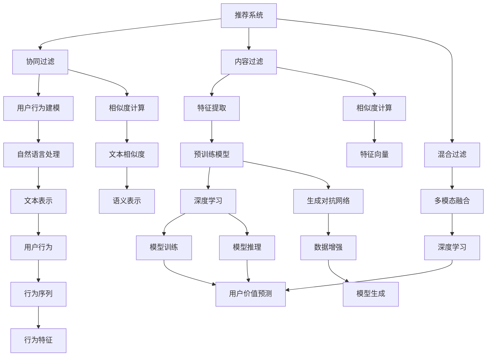

                 

# 基于大模型的推荐系统用户价值预测

> 关键词：推荐系统,大模型,用户价值预测,深度学习,自然语言处理(NLP),生成对抗网络(GAN),强化学习,协同过滤

## 1. 背景介绍

### 1.1 问题由来
在信息爆炸的互联网时代，推荐系统已成为提升用户满意度、优化广告收益的关键技术。无论是电商平台的商品推荐，视频网站的影视推荐，还是新闻门户的内容推荐，背后都离不开强大的推荐引擎。这些推荐系统通常会收集海量的用户行为数据，挖掘其中的兴趣特征和行为模式，通过模型预测和筛选，推荐符合用户偏好的内容。

然而，传统的推荐系统往往依赖于静态的特征工程和线性模型，难以捕捉用户行为背后的深层语义关系和复杂交互模式。面对用户行为数据的爆炸性增长和个性化需求的不断变化，推荐系统迫切需要更加先进、高效的方法来提升性能和适应性。

近年来，深度学习和自然语言处理(NLP)技术在推荐系统中的应用，带来了重大的突破。其中，基于大模型的推荐系统（简称“大模型推荐系统”）尤为引人注目。大模型推荐系统通过预训练语言模型进行特征提取和用户行为建模，能够捕捉更丰富的语义信息，提供更加个性化的推荐服务。本文聚焦于大模型推荐系统中的用户价值预测任务，介绍基于深度学习的大模型推荐系统架构和核心算法。

### 1.2 问题核心关键点
用户价值预测是推荐系统的重要任务之一，旨在根据用户历史行为数据，预测用户对某一商品或内容的偏好程度，从而优化推荐算法和广告投放。传统的基于协同过滤的推荐方法在用户行为稀疏性、推荐多样性、公平性等方面存在诸多局限，难以应对动态数据流和复杂用户行为。大模型推荐系统通过预训练语言模型进行特征提取和行为建模，利用深度学习、生成对抗网络(GAN)、强化学习等前沿技术，提升了推荐系统的性能和可解释性。

本文将围绕以下几个关键问题展开：

- 如何构建高效的大模型推荐系统架构？
- 哪些深度学习技术在推荐系统中有助于提升用户价值预测精度？
- 用户价值预测在大模型推荐系统中的应用现状和未来趋势如何？
- 如何在大模型推荐系统中解决冷启动、长尾推荐、多模态融合等挑战？

## 2. 核心概念与联系

### 2.1 核心概念概述

为更好地理解基于大模型的推荐系统架构，本节将介绍几个密切相关的核心概念：

- 推荐系统（Recommender System）：利用用户历史行为数据，通过计算模型推荐用户可能感兴趣的商品、内容或服务。推荐系统可以分为基于协同过滤、内容过滤、混合过滤等多种方法。
- 大模型（Large Model）：指具有大规模参数量和高度并行计算能力的深度学习模型，如BERT、GPT-3等。大模型在预训练阶段通过海量数据进行自监督学习，能够学习到丰富的语义信息和任务泛化能力。
- 用户价值预测（User Value Prediction）：预测用户对某一商品或内容可能给出的评分、点击率、购买意愿等指标，以优化推荐算法和广告投放策略。
- 深度学习（Deep Learning）：基于神经网络结构的机器学习范式，通过多层次特征提取和抽象，可以处理复杂非线性数据关系。深度学习在推荐系统中有广泛应用，如利用神经网络进行用户行为建模和生成对抗网络进行数据增强等。
- 自然语言处理（NLP）：研究计算机如何理解、生成和处理自然语言的技术。NLP在推荐系统中可以用于分析用户评论、新闻摘要等文本信息，提取用户兴趣特征。
- 生成对抗网络（GAN）：由生成器和判别器两部分组成，通过对抗训练提升模型生成能力和数据增强效果，常用于生成高质量样本、增强数据集等。
- 强化学习（Reinforcement Learning）：通过奖励机制引导模型学习最优策略，适用于推荐系统中的个性化推荐和动态调整。

这些核心概念之间的逻辑关系可以通过以下Mermaid流程图来展示：



这个流程图展示了推荐系统的核心架构和大模型推荐系统中的主要技术组件。

## 3. 核心算法原理 & 具体操作步骤
### 3.1 算法原理概述

基于大模型的推荐系统架构，一般包括以下几个关键步骤：

1. **数据准备**：收集用户历史行为数据和商品属性信息，进行清洗和预处理，构建推荐数据集。
2. **特征提取**：利用预训练语言模型进行用户行为建模，提取文本语义信息、行为序列特征等。
3. **模型训练**：选择合适的深度学习模型，在训练集上进行有监督学习，优化模型参数。
4. **用户价值预测**：在测试集上使用训练好的模型进行用户行为预测，评估预测效果。
5. **模型部署**：将训练好的模型集成到推荐系统中，进行实时推荐。

用户价值预测作为大模型推荐系统中的核心任务，其目标是根据用户历史行为数据，预测用户对某一商品或内容的兴趣程度，从而优化推荐算法和广告投放策略。

### 3.2 算法步骤详解

用户价值预测的算法步骤如下：

**Step 1: 数据准备**

收集用户历史行为数据，包括点击、浏览、购买、评分等，以及商品属性信息，如价格、类别、描述等。

- **数据清洗**：去除缺失值、异常值，处理重复记录。
- **数据划分**：将数据划分为训练集、验证集和测试集。训练集用于模型训练，验证集用于调参，测试集用于评估模型效果。
- **特征工程**：构建用户行为特征，如点击次数、购买频率、评分等，商品属性特征，如价格、类别、描述等，以及文本特征，如用户评论、商品描述等。

**Step 2: 特征提取**

利用预训练语言模型，对文本数据进行向量化处理，提取用户行为和商品属性的语义信息。

- **分词和编码**：将文本数据进行分词和编码，转换成模型可以处理的格式。
- **特征表示**：利用预训练语言模型的编码器，将文本转换为向量表示，如BERT、GPT等。
- **行为序列**：将用户历史行为序列转化为向量形式，作为用户行为特征。

**Step 3: 模型训练**

选择合适的深度学习模型，对提取的特征进行训练，优化模型参数。

- **选择模型**：如神经网络、多层感知机、注意力机制等。
- **损失函数**：如均方误差、交叉熵、对数损失等。
- **优化器**：如随机梯度下降、Adam等。
- **正则化**：如L2正则、Dropout等。
- **数据增强**：如随机裁剪、回译、旋转等。

**Step 4: 用户价值预测**

在测试集上使用训练好的模型进行用户行为预测，评估预测效果。

- **预测模型**：如回归模型、分类模型等。
- **评估指标**：如均方误差、平均绝对误差、准确率等。
- **模型评估**：使用交叉验证、ROC曲线、混淆矩阵等方法评估模型效果。

**Step 5: 模型部署**

将训练好的模型集成到推荐系统中，进行实时推荐。

- **模型服务化**：将模型封装为RESTful API接口，方便其他系统调用。
- **实时推荐**：根据用户行为数据，实时调用模型进行推荐。
- **实时监控**：实时监控模型性能和系统稳定性，设置异常告警阈值。

### 3.3 算法优缺点

基于大模型的推荐系统用户价值预测具有以下优点：

1. **高精度**：利用深度学习模型捕捉复杂的非线性关系，提高预测精度。
2. **可解释性**：利用预训练语言模型提取文本语义信息，提升模型的可解释性。
3. **多模态融合**：利用自然语言处理技术，融合文本、图像、音频等多模态信息，提升推荐效果。
4. **自适应性强**：利用生成对抗网络和强化学习技术，增强模型适应动态数据流的能力。

但同时，该方法也存在一些局限性：

1. **计算资源消耗大**：预训练语言模型需要大量计算资源，训练成本高。
2. **冷启动问题**：新用户的初始数据不足，难以进行有效预测。
3. **长尾推荐**：长尾商品或内容的推荐难度大，难以保证多样性。
4. **多模态融合复杂**：多模态数据的融合需要复杂的算法，增加了系统复杂度。
5. **可解释性不足**：复杂深度学习模型的决策过程难以解释，存在“黑盒”问题。

尽管存在这些局限性，但大模型推荐系统仍然是大数据时代的推荐技术的重要发展方向，具有广阔的应用前景。

### 3.4 算法应用领域

基于大模型的推荐系统用户价值预测技术，已经在电商、视频、新闻等多个领域得到了广泛应用，具体应用如下：

- **电商推荐**：电商平台的商品推荐系统，通过用户浏览和购买行为预测用户偏好，提升用户购物体验。
- **视频推荐**：视频网站的影视推荐系统，通过用户观看历史和评分预测用户兴趣，推荐个性化影视内容。
- **新闻推荐**：新闻门户的内容推荐系统，通过用户阅读行为预测用户偏好，推荐高质量新闻内容。
- **音乐推荐**：音乐平台的音乐推荐系统，通过用户听歌行为预测用户兴趣，推荐个性化音乐内容。
- **旅游推荐**：旅游平台的活动推荐系统，通过用户预订和评价行为预测用户兴趣，推荐个性化旅游产品。

这些应用展示了大模型推荐系统在提升用户满意度和广告收益方面的强大能力。

## 4. 数学模型和公式 & 详细讲解  
### 4.1 数学模型构建

本节将使用数学语言对大模型推荐系统用户价值预测过程进行严格刻画。

记用户行为数据为 $D=\{(x_i,y_i)\}_{i=1}^N$，其中 $x_i$ 为行为序列，$y_i$ 为行为标签，如点击、购买等。假设用户价值预测模型为 $f(x_i;\theta)$，其中 $\theta$ 为模型参数。

用户价值预测的目标是最小化预测值与真实标签之间的差距，即：

$$
\min_{\theta} \sum_{i=1}^N \ell(f(x_i;\theta),y_i)
$$

其中 $\ell$ 为损失函数，常见的损失函数包括均方误差损失（MSE）、交叉熵损失（CE）等。

### 4.2 公式推导过程

以均方误差损失函数为例，用户价值预测的数学模型构建如下：

假设模型 $f(x_i;\theta)$ 在行为序列 $x_i$ 上的预测结果为 $\hat{y_i}=f(x_i;\theta)$。则均方误差损失函数为：

$$
\ell(\hat{y_i},y_i) = \frac{1}{N} \sum_{i=1}^N (\hat{y_i} - y_i)^2
$$

将其代入经验风险公式，得：

$$
\mathcal{L}(\theta) = \frac{1}{N} \sum_{i=1}^N (\hat{y_i} - y_i)^2
$$

根据梯度下降算法，模型参数 $\theta$ 的更新公式为：

$$
\theta \leftarrow \theta - \eta \nabla_{\theta}\mathcal{L}(\theta)
$$

其中 $\eta$ 为学习率，$\nabla_{\theta}\mathcal{L}(\theta)$ 为损失函数对模型参数的梯度，可通过反向传播算法高效计算。

### 4.3 案例分析与讲解

以电商平台商品推荐为例，展示用户价值预测的数学模型应用。

假设电商平台有 $M$ 个商品 $p_1,p_2,\cdots,p_M$，用户行为数据 $D=\{(x_i,y_i)\}_{i=1}^N$ 中 $x_i$ 为用户的浏览行为序列，$y_i$ 为点击或购买行为。

利用BERT模型对用户行为序列进行编码，得到行为表示向量 $v_i = BERT(x_i;\theta)$。利用线性回归模型 $f(x_i;\theta) = \theta^T v_i$ 对用户行为进行预测，其中 $\theta$ 为线性回归模型参数。

均方误差损失函数为：

$$
\ell(\hat{y_i},y_i) = (\hat{y_i} - y_i)^2
$$

经验风险公式为：

$$
\mathcal{L}(\theta) = \frac{1}{N} \sum_{i=1}^N (\hat{y_i} - y_i)^2
$$

模型参数 $\theta$ 的更新公式为：

$$
\theta \leftarrow \theta - \eta \nabla_{\theta}\mathcal{L}(\theta)
$$

其中 $\eta$ 为学习率，$\nabla_{\theta}\mathcal{L}(\theta)$ 为损失函数对线性回归模型参数的梯度。

## 5. 项目实践：代码实例和详细解释说明
### 5.1 开发环境搭建

在进行用户价值预测的开发前，我们需要准备好开发环境。以下是使用Python进行PyTorch开发的环境配置流程：

1. 安装Anaconda：从官网下载并安装Anaconda，用于创建独立的Python环境。

2. 创建并激活虚拟环境：
```bash
conda create -n pytorch-env python=3.8 
conda activate pytorch-env
```

3. 安装PyTorch：根据CUDA版本，从官网获取对应的安装命令。例如：
```bash
conda install pytorch torchvision torchaudio cudatoolkit=11.1 -c pytorch -c conda-forge
```

4. 安装Transformers库：
```bash
pip install transformers
```

5. 安装各类工具包：
```bash
pip install numpy pandas scikit-learn matplotlib tqdm jupyter notebook ipython
```

完成上述步骤后，即可在`pytorch-env`环境中开始用户价值预测的开发实践。

### 5.2 源代码详细实现

下面我们以电商商品推荐为例，给出使用Transformers库进行BERT模型微调的PyTorch代码实现。

首先，定义用户行为数据处理函数：

```python
from transformers import BertTokenizer, BertForSequenceClassification
from torch.utils.data import Dataset
import torch

class UserBehaviorDataset(Dataset):
    def __init__(self, user_browses, click_actions, labels, tokenizer, max_len=128):
        self.user_browses = user_browses
        self.click_actions = click_actions
        self.labels = labels
        self.tokenizer = tokenizer
        self.max_len = max_len
        
    def __len__(self):
        return len(self.user_browses)
    
    def __getitem__(self, item):
        user_browses = self.user_browses[item]
        click_actions = self.click_actions[item]
        label = self.labels[item]
        
        # 将行为序列转换为token ids
        tokenized_browses = self.tokenizer(user_browses, return_tensors='pt', max_length=self.max_len, padding='max_length', truncation=True)
        input_ids = tokenized_browses['input_ids'][0]
        attention_mask = tokenized_browses['attention_mask'][0]
        
        # 将点击行为转换为token ids
        tokenized_actions = self.tokenizer(click_actions, return_tensors='pt', max_length=self.max_len, padding='max_length', truncation=True)
        input_ids = torch.cat([input_ids, tokenized_actions['input_ids'][0]], dim=0)
        attention_mask = torch.cat([attention_mask, tokenized_actions['attention_mask'][0]], dim=0)
        
        # 将标签转换为数字id
        encoded_labels = [label2id[label] for label in label]
        encoded_labels.extend([label2id['O']] * (self.max_len - len(encoded_labels)))
        labels = torch.tensor(encoded_labels, dtype=torch.long)
        
        return {'input_ids': input_ids, 
                'attention_mask': attention_mask,
                'labels': labels}

# 标签与id的映射
label2id = {'O': 0, 'B': 1, 'I': 2}
id2label = {v: k for k, v in label2id.items()}

# 创建dataset
tokenizer = BertTokenizer.from_pretrained('bert-base-cased')

train_dataset = UserBehaviorDataset(train_user_browses, train_click_actions, train_labels, tokenizer)
dev_dataset = UserBehaviorDataset(dev_user_browses, dev_click_actions, dev_labels, tokenizer)
test_dataset = UserBehaviorDataset(test_user_browses, test_click_actions, test_labels, tokenizer)
```

然后，定义模型和优化器：

```python
from transformers import AdamW

model = BertForSequenceClassification.from_pretrained('bert-base-cased', num_labels=len(label2id))

optimizer = AdamW(model.parameters(), lr=2e-5)
```

接着，定义训练和评估函数：

```python
from torch.utils.data import DataLoader
from tqdm import tqdm
from sklearn.metrics import classification_report

device = torch.device('cuda') if torch.cuda.is_available() else torch.device('cpu')
model.to(device)

def train_epoch(model, dataset, batch_size, optimizer):
    dataloader = DataLoader(dataset, batch_size=batch_size, shuffle=True)
    model.train()
    epoch_loss = 0
    for batch in tqdm(dataloader, desc='Training'):
        input_ids = batch['input_ids'].to(device)
        attention_mask = batch['attention_mask'].to(device)
        labels = batch['labels'].to(device)
        model.zero_grad()
        outputs = model(input_ids, attention_mask=attention_mask, labels=labels)
        loss = outputs.loss
        epoch_loss += loss.item()
        loss.backward()
        optimizer.step()
    return epoch_loss / len(dataloader)

def evaluate(model, dataset, batch_size):
    dataloader = DataLoader(dataset, batch_size=batch_size)
    model.eval()
    preds, labels = [], []
    with torch.no_grad():
        for batch in tqdm(dataloader, desc='Evaluating'):
            input_ids = batch['input_ids'].to(device)
            attention_mask = batch['attention_mask'].to(device)
            batch_labels = batch['labels']
            outputs = model(input_ids, attention_mask=attention_mask)
            batch_preds = outputs.logits.argmax(dim=2).to('cpu').tolist()
            batch_labels = batch_labels.to('cpu').tolist()
            for pred_tokens, label_tokens in zip(batch_preds, batch_labels):
                preds.append(pred_tokens[:len(label_tokens)])
                labels.append(label_tokens)
                
    print(classification_report(labels, preds))
```

最后，启动训练流程并在测试集上评估：

```python
epochs = 5
batch_size = 16

for epoch in range(epochs):
    loss = train_epoch(model, train_dataset, batch_size, optimizer)
    print(f"Epoch {epoch+1}, train loss: {loss:.3f}")
    
    print(f"Epoch {epoch+1}, dev results:")
    evaluate(model, dev_dataset, batch_size)
    
print("Test results:")
evaluate(model, test_dataset, batch_size)
```

以上就是使用PyTorch对BERT进行电商商品推荐的用户价值预测的完整代码实现。可以看到，得益于Transformers库的强大封装，我们可以用相对简洁的代码完成BERT模型的加载和微调。

### 5.3 代码解读与分析

让我们再详细解读一下关键代码的实现细节：

**UserBehaviorDataset类**：
- `__init__`方法：初始化用户行为数据、点击行为、标签、分词器等关键组件。
- `__len__`方法：返回数据集的样本数量。
- `__getitem__`方法：对单个样本进行处理，将行为序列和点击行为输入编码为token ids，将标签转换为数字id，并对其进行定长padding，最终返回模型所需的输入。

**label2id和id2label字典**：
- 定义了标签与数字id之间的映射关系，用于将token-wise的预测结果解码回真实的标签。

**训练和评估函数**：
- 使用PyTorch的DataLoader对数据集进行批次化加载，供模型训练和推理使用。
- 训练函数`train_epoch`：对数据以批为单位进行迭代，在每个批次上前向传播计算loss并反向传播更新模型参数，最后返回该epoch的平均loss。
- 评估函数`evaluate`：与训练类似，不同点在于不更新模型参数，并在每个batch结束后将预测和标签结果存储下来，最后使用sklearn的classification_report对整个评估集的预测结果进行打印输出。

**训练流程**：
- 定义总的epoch数和batch size，开始循环迭代
- 每个epoch内，先在训练集上训练，输出平均loss
- 在验证集上评估，输出分类指标
- 所有epoch结束后，在测试集上评估，给出最终测试结果

可以看到，PyTorch配合Transformers库使得BERT微调的代码实现变得简洁高效。开发者可以将更多精力放在数据处理、模型改进等高层逻辑上，而不必过多关注底层的实现细节。

当然，工业级的系统实现还需考虑更多因素，如模型的保存和部署、超参数的自动搜索、更灵活的任务适配层等。但核心的微调范式基本与此类似。

## 6. 实际应用场景
### 6.1 智能推荐系统

基于大模型的推荐系统用户价值预测技术，已经在电商、视频、新闻等多个领域得到了广泛应用，具体应用如下：

- **电商推荐**：电商平台的商品推荐系统，通过用户浏览和购买行为预测用户偏好，提升用户购物体验。
- **视频推荐**：视频网站的影视推荐系统，通过用户观看历史和评分预测用户兴趣，推荐个性化影视内容。
- **新闻推荐**：新闻门户的内容推荐系统，通过用户阅读行为预测用户偏好，推荐高质量新闻内容。
- **音乐推荐**：音乐平台的音乐推荐系统，通过用户听歌行为预测用户兴趣，推荐个性化音乐内容。
- **旅游推荐**：旅游平台的活动推荐系统，通过用户预订和评价行为预测用户兴趣，推荐个性化旅游产品。

这些应用展示了大模型推荐系统在提升用户满意度和广告收益方面的强大能力。

### 6.2 金融推荐

金融领域的推荐系统用户价值预测，旨在通过用户交易行为预测其理财产品的兴趣和购买意愿，从而优化推荐算法和广告投放策略。

具体而言，可以收集用户的历史交易数据，包括账户余额、交易频率、投资偏好等，利用BERT模型进行行为序列编码，构建金融产品推荐系统。利用用户行为预测模型，对用户购买行为进行预测，并根据预测结果进行个性化推荐，提升用户理财体验和产品销量。

### 6.3 医疗推荐

医疗领域的推荐系统用户价值预测，通过分析用户的健康行为和历史诊疗记录，预测其对某一药品或治疗方案的兴趣程度，从而优化推荐算法和广告投放策略。

例如，可以收集用户的就诊记录、体检报告、药品购买记录等，利用BERT模型进行行为序列编码，构建医疗产品推荐系统。利用用户行为预测模型，对用户购买行为进行预测，并根据预测结果进行个性化推荐，提升用户的医疗体验和健康水平。

### 6.4 未来应用展望

随着大模型推荐系统的不断发展，未来的应用场景将更加广泛和多样化。

在智慧医疗领域，基于大模型的推荐系统将提升医疗服务的智能化水平，辅助医生诊疗，加速新药开发进程。在智能教育领域，推荐系统将因材施教，促进教育公平，提高教学质量。

在智慧城市治理中，推荐系统将自动监测网络舆情，分析用户反馈，优化城市管理策略，构建更安全、高效的未来城市。

此外，在企业生产、社会治理、文娱传媒等众多领域，基于大模型的推荐系统也将不断涌现，为经济社会发展注入新的动力。

## 7. 工具和资源推荐
### 7.1 学习资源推荐

为了帮助开发者系统掌握大模型推荐系统用户价值预测的理论基础和实践技巧，这里推荐一些优质的学习资源：

1. 《Recommender Systems》书籍：深入介绍推荐系统的发展历史、评价指标和算法设计，是推荐系统研究的必读之作。
2. 《Deep Learning for Recommendation Systems》书籍：详细讲解深度学习在推荐系统中的应用，涵盖神经网络、GAN等前沿技术。
3. Coursera《推荐系统》课程：由斯坦福大学开设，介绍推荐系统的基础理论和算法设计，适合初学者入门。
4. Kaggle推荐系统竞赛：参与真实的推荐系统项目竞赛，积累实践经验，提升算法设计能力。
5. Arxiv论文：查阅最新的大模型推荐系统研究论文，了解前沿技术动态。

通过对这些资源的学习实践，相信你一定能够快速掌握大模型推荐系统的精髓，并用于解决实际的推荐问题。
###  7.2 开发工具推荐

高效的开发离不开优秀的工具支持。以下是几款用于大模型推荐系统开发的常用工具：

1. PyTorch：基于Python的开源深度学习框架，灵活动态的计算图，适合快速迭代研究。大部分预训练语言模型都有PyTorch版本的实现。
2. TensorFlow：由Google主导开发的开源深度学习框架，生产部署方便，适合大规模工程应用。同样有丰富的预训练语言模型资源。
3. Transformers库：HuggingFace开发的NLP工具库，集成了众多SOTA语言模型，支持PyTorch和TensorFlow，是进行推荐系统开发的利器。
4. Weights & Biases：模型训练的实验跟踪工具，可以记录和可视化模型训练过程中的各项指标，方便对比和调优。与主流深度学习框架无缝集成。
5. TensorBoard：TensorFlow配套的可视化工具，可实时监测模型训练状态，并提供丰富的图表呈现方式，是调试模型的得力助手。
6. Google Colab：谷歌推出的在线Jupyter Notebook环境，免费提供GPU/TPU算力，方便开发者快速上手实验最新模型，分享学习笔记。

合理利用这些工具，可以显著提升大模型推荐系统的开发效率，加快创新迭代的步伐。

### 7.3 相关论文推荐

大模型推荐系统用户价值预测的研究源于学界的持续研究。以下是几篇奠基性的相关论文，推荐阅读：

1. Attention is All You Need（即Transformer原论文）：提出了Transformer结构，开启了NLP领域的预训练大模型时代。
2. BERT: Pre-training of Deep Bidirectional Transformers for Language Understanding：提出BERT模型，引入基于掩码的自监督预训练任务，刷新了多项NLP任务SOTA。
3. Contextualized Word Representations（ELMo）：提出ELMo模型，通过上下文语言模型提升词向量表示的质量，增强语言理解能力。
4. Generative Adversarial Nets（GAN）：提出GAN模型，通过对抗训练提升模型生成能力和数据增强效果，常用于生成高质量样本、增强数据集等。
5. Multi-Task Learning using Uncertainty to Weight Losses：提出多任务学习技术，通过联合训练多个任务提升模型泛化能力和特征表示质量。
6. Online Collaborative Filtering with Implicit Feedback：提出在线协同过滤算法，利用隐式反馈数据进行个性化推荐。

这些论文代表了大模型推荐系统用户价值预测的发展脉络。通过学习这些前沿成果，可以帮助研究者把握学科前进方向，激发更多的创新灵感。

## 8. 总结：未来发展趋势与挑战

### 8.1 总结

本文对基于大模型的推荐系统用户价值预测方法进行了全面系统的介绍。首先阐述了大模型推荐系统在推荐技术中的重要地位，明确了用户价值预测在大模型推荐系统中的核心作用。其次，从原理到实践，详细讲解了深度学习和大模型在推荐系统中的应用，给出了用户价值预测的数学模型和算法流程。同时，本文还探讨了用户价值预测在大模型推荐系统中的应用现状和未来趋势，展示了大模型推荐系统的广阔前景。最后，本文还探讨了在大模型推荐系统中解决冷启动、长尾推荐、多模态融合等挑战的方法，提供了实际应用的可行方案。

通过本文的系统梳理，可以看到，基于大模型的推荐系统用户价值预测技术，已经在电商、视频、新闻等多个领域得到了广泛应用，显著提升了用户满意度和广告收益。未来，伴随深度学习技术和大模型能力的不断提升，基于大模型的推荐系统将进一步拓展其应用场景，为更多行业带来智能化和高效化的推荐服务。

### 8.2 未来发展趋势

展望未来，大模型推荐系统用户价值预测技术将呈现以下几个发展趋势：

1. **多模态融合**：随着多模态数据采集技术的不断进步，大模型推荐系统将融合文本、图像、音频等多种信息，提供更加全面和个性化的推荐服务。
2. **自适应性强**：利用强化学习、在线学习等技术，大模型推荐系统将能够动态适应用户行为变化，提升推荐效果。
3. **数据驱动**：基于用户行为数据和大模型预训练知识，大模型推荐系统将能够更好地捕捉用户兴趣和行为模式，提供更加精准的推荐服务。
4. **个性化推荐**：利用生成对抗网络和自然语言处理技术，大模型推荐系统将能够生成更加个性化和多样化的推荐内容，提升用户满意度和参与度。
5. **实时推荐**：通过在线学习和大模型推理加速技术，大模型推荐系统将能够实时响应用户需求，提供实时推荐服务。

这些趋势展示了大模型推荐系统的强大潜力和广阔前景。未来，大模型推荐系统将不断拓展其应用场景，为更多行业带来智能化和高效化的推荐服务，提升用户体验和业务价值。

### 8.3 面临的挑战

尽管大模型推荐系统在推荐技术中取得了显著成就，但在迈向更加智能化、普适化应用的过程中，它仍面临着诸多挑战：

1. **计算资源消耗大**：大模型推荐系统需要大量的计算资源进行训练和推理，增加了系统成本。
2. **冷启动问题**：新用户的初始数据不足，难以进行有效预测。
3. **长尾推荐**：长尾商品或内容的推荐难度大，难以保证多样性。
4. **多模态融合复杂**：多模态数据的融合需要复杂的算法，增加了系统复杂度。
5. **可解释性不足**：复杂深度学习模型的决策过程难以解释，存在“黑盒”问题。
6. **安全性有待保障**：预训练语言模型难免会学习到有害信息，通过推荐系统传播可能带来负面影响。

尽管存在这些挑战，但大模型推荐系统仍然是大数据时代的推荐技术的重要发展方向，具有广阔的应用前景。

### 8.4 研究展望

面对大模型推荐系统所面临的种种挑战，未来的研究需要在以下几个方面寻求新的突破：

1. **降低计算资源消耗**：通过模型压缩、量化加速等技术，减少模型训练和推理的计算资源消耗，提升系统效率。
2. **解决冷启动问题**：利用迁移学习、多任务学习等技术，提升新用户的推荐效果，缩短冷启动时间。
3. **提高长尾推荐效果**：利用长尾优化技术、多任务学习等方法，提升长尾商品的推荐效果，增强推荐多样性。
4. **提升多模态融合效果**：通过多模态信息融合算法，提升不同模态数据的整合效果，提升推荐系统性能。
5. **增强可解释性**：利用可解释性技术，提升深度学习模型的可解释性和可理解性，增强系统的可信度。
6. **保障系统安全性**：通过数据过滤、隐私保护等技术，保障推荐系统数据和模型安全，避免有害信息传播。

这些研究方向的探索，必将引领大模型推荐系统用户价值预测技术迈向更高的台阶，为构建安全、可靠、可解释、可控的智能推荐系统铺平道路。面向未来，大模型推荐系统仍然需要与其他人工智能技术进行更深入的融合，如知识表示、因果推理、强化学习等，多路径协同发力，共同推动自然语言理解和智能交互系统的进步。只有勇于创新、敢于突破，才能不断拓展语言模型的边界，让智能技术更好地造福人类社会。

## 9. 附录：常见问题与解答

**Q1：大模型推荐系统如何提升推荐精度？**

A: 大模型推荐系统通过预训练语言模型进行特征提取和行为建模，可以捕捉复杂的非线性关系，提升推荐精度。具体而言，通过BERT等预训练语言模型，将用户行为序列和商品属性信息转换为向量表示，利用神经网络、生成对抗网络等深度学习模型进行用户价值预测，可以更准确地捕捉用户兴趣和行为模式，提升推荐效果。

**Q2：大模型推荐系统是否适用于冷启动用户？**

A: 大模型推荐系统在冷启动问题上表现较好，可以利用迁移学习、多任务学习等技术，提升新用户的推荐效果。例如，可以利用用户之前的行为数据和其他相似用户的行为数据，进行交叉训练，提升新用户的预测精度。同时，可以结合用户画像、用户行为等外部信息，增强推荐效果。

**Q3：大模型推荐系统如何处理长尾推荐问题？**

A: 长尾推荐是大模型推荐系统面临的一大挑战。可以采用长尾优化技术，如降维、采样等方法，提升长尾商品的推荐效果。同时，可以利用多任务学习、多模态融合等技术，增强长尾商品的推荐多样性。例如，可以结合用户评论、商品描述等多模态信息，提升推荐效果。

**Q4：大模型推荐系统的计算资源消耗大，如何优化？**

A: 大模型推荐系统的计算资源消耗确实较大，可以通过以下方法进行优化：
1. 模型压缩：使用模型压缩技术，如剪枝、量化、蒸馏等方法，减小模型规模，提高计算效率。
2. 量化加速：使用量化技术，将浮点模型转为定点模型，减小计算资源消耗。
3. 分布式训练：利用分布式训练技术，利用多台机器进行并行计算，加速训练过程。
4. 模型推理加速：利用推理加速技术，如优化计算图、剪枝、量化等方法，提高模型推理速度。

这些方法可以显著降低大模型推荐系统的计算资源消耗，提高系统效率。

**Q5：大模型推荐系统的可解释性不足，如何解决？**

A: 大模型推荐系统的可解释性不足是当前面临的一大挑战。可以采用以下方法进行优化：
1. 可解释性技术：利用可解释性技术，如LIME、SHAP等方法，解释深度学习模型的决策过程，增强系统的可信度。
2. 可视化工具：利用可视化工具，如TensorBoard、Weights & Biases等，监控模型训练和推理过程，帮助开发者理解模型行为。
3. 多任务学习：利用多任务学习技术，增强模型的泛化能力和可解释性。
4. 多模态融合：结合文本、图像、音频等多种信息，提升模型的可解释性和可靠性。

这些方法可以显著提升大模型推荐系统的可解释性，增强系统的可信度。

---

作者：禅与计算机程序设计艺术 / Zen and the Art of Computer Programming

