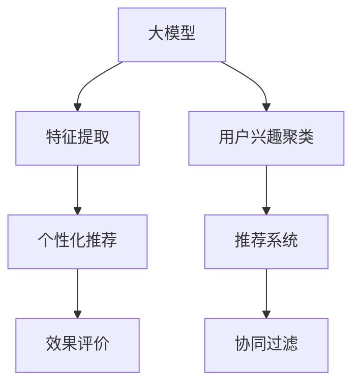

                 

# 基于大模型的推荐系统用户兴趣聚类

## 1. 背景介绍

### 1.1 问题由来

在互联网和电商平台上，推荐系统是提高用户满意度和增加收入的重要手段。随着数据量的不断增长，传统的基于协同过滤和规则的推荐算法已经难以满足个性化推荐的需求。推荐系统的精准度直接影响到用户留存率和平台收益，因此，研究一种高效、准确的用户兴趣聚类方法，成为业界和学界共同关注的重点。

大模型在自然语言处理、计算机视觉等领域取得了巨大成功，这些模型通常具有大参数量、多任务学习的能力。利用大模型对用户行为数据进行分析和挖掘，可以从用户的历史行为、评分、评论等文本数据中获取更丰富的用户兴趣特征，从而提高推荐系统的准确性和个性化程度。

### 1.2 问题核心关键点

本问题聚焦于基于大模型的推荐系统用户兴趣聚类。为了解决这一问题，需要回答以下几个关键点：

- 如何从用户的文本数据中提取特征？
- 如何对用户进行兴趣聚类？
- 如何根据聚类结果进行个性化推荐？
- 如何评价推荐系统的效果？

### 1.3 问题研究意义

用户兴趣聚类是推荐系统个性化推荐的基础。通过用户兴趣的聚类，推荐系统能够更好地理解用户的兴趣和需求，从而提供更符合用户预期的个性化推荐，显著提升用户体验和平台收益。

利用大模型进行用户兴趣聚类，可以捕捉用户的深层次兴趣和行为模式，增强推荐的准确性和多样性。同时，大模型具有多任务学习和自监督学习的能力，能够自动学习用户行为的语义信息，从而发现用户行为数据中的潜在模式。

## 2. 核心概念与联系

### 2.1 核心概念概述

本节将介绍几个核心概念，并说明它们之间的联系。

- 大模型(大规模预训练模型)：如BERT、GPT-3等，通常具有数亿参数，经过大规模无监督训练，具备强大的语义理解和生成能力。
- 特征提取：从用户文本数据中提取特征向量，作为聚类输入。
- 用户兴趣聚类：利用聚类算法将用户划分为具有相似兴趣的群组，从而进行个性化推荐。
- 推荐系统：根据用户兴趣和行为数据，推荐个性化商品或内容。
- 协同过滤：基于用户行为或物品评分矩阵，寻找与目标用户或物品相似的其他用户或物品进行推荐。
- 个性化推荐：利用用户历史行为数据和兴趣特征，生成个性化推荐列表。
- 效果评价：通过用户点击率、留存率等指标，评估推荐系统的性能。

这些概念构成了推荐系统的核心框架，它们之间的逻辑关系可以通过以下Mermaid流程图来展示：



### 2.2 核心概念原理和架构

1. 大模型
   - 大模型通常采用Transformer结构，具有自注意力机制，能够自动学习输入数据的复杂语义信息。
   - 大模型经过大规模无监督预训练，学习到广泛的语义知识，能够应对多种自然语言处理任务。

2. 特征提取
   - 特征提取是指将用户文本数据转换为模型能够处理的形式，如词向量、句子向量等。
   - 常见的特征提取方法包括word2vec、GloVe、BERT等，能够将文本转换为密集的向量表示。

3. 用户兴趣聚类
   - 用户兴趣聚类是指将用户根据兴趣特征进行分组，从而进行更精准的个性化推荐。
   - 聚类算法包括K-means、层次聚类、DBSCAN等，能够发现数据集中的自然分组。

4. 推荐系统
   - 推荐系统根据用户兴趣和行为数据，推荐个性化商品或内容。
   - 常见的推荐算法包括协同过滤、基于内容的推荐、混合推荐等。

5. 协同过滤
   - 协同过滤基于用户行为或物品评分矩阵，寻找与目标用户或物品相似的其他用户或物品进行推荐。
   - 协同过滤包括基于用户的协同过滤和基于物品的协同过滤两种方法。

6. 个性化推荐
   - 个性化推荐利用用户历史行为数据和兴趣特征，生成个性化推荐列表。
   - 个性化推荐算法包括基于内容的推荐、协同过滤推荐、深度学习推荐等。

7. 效果评价
   - 效果评价通过用户点击率、留存率等指标，评估推荐系统的性能。
   - 常见的效果评价指标包括NDCG、HR、MAP等，能够衡量推荐系统的排序和召回能力。

这些概念通过大模型预训练和微调过程相互关联，共同构成了推荐系统的核心框架。

## 3. 核心算法原理 & 具体操作步骤

### 3.1 算法原理概述

基于大模型的推荐系统用户兴趣聚类方法，通过大模型对用户文本数据进行特征提取，然后使用聚类算法对用户进行分组。具体流程如下：

1. 对用户文本数据进行特征提取，生成用户兴趣向量。
2. 利用聚类算法对用户兴趣向量进行聚类，生成用户兴趣群组。
3. 根据用户兴趣群组进行个性化推荐，生成个性化推荐列表。
4. 利用效果评价指标对推荐系统进行评估，优化推荐策略。

### 3.2 算法步骤详解

#### 步骤1：数据预处理

1. 收集用户文本数据，如评论、评分等，作为大模型输入。
2. 对文本数据进行预处理，如分词、去除停用词、去除特殊符号等。
3. 将文本数据转换为模型可接受的格式，如Bert输入格式。

#### 步骤2：特征提取

1. 使用大模型对文本数据进行特征提取，生成用户兴趣向量。
2. 常用的特征提取方法包括word2vec、GloVe、BERT等，能够将文本转换为密集的向量表示。
3. 对用户兴趣向量进行归一化、标准化等预处理，使得特征向量具有较好的可比性。

#### 步骤3：用户兴趣聚类

1. 选择合适的聚类算法，如K-means、层次聚类、DBSCAN等，对用户兴趣向量进行聚类。
2. 设定聚类数，对用户兴趣向量进行分组。
3. 对聚类结果进行可视化，帮助理解聚类效果。

#### 步骤4：个性化推荐

1. 根据用户兴趣群组，进行个性化推荐。
2. 利用协同过滤、基于内容的推荐、混合推荐等算法，生成个性化推荐列表。
3. 对推荐结果进行排序，提高推荐效果。

#### 步骤5：效果评价

1. 利用效果评价指标，如NDCG、HR、MAP等，评估推荐系统性能。
2. 根据评估结果，优化推荐策略。
3. 定期更新用户数据，重新进行特征提取和聚类。

### 3.3 算法优缺点

#### 优点

1. 能够捕捉用户深层次的兴趣和行为模式，提高推荐系统的准确性和个性化程度。
2. 利用大模型的多任务学习能力和自监督学习能力，发现用户行为数据中的潜在模式。
3. 能够处理多种自然语言处理任务，增强推荐系统的通用性。

#### 缺点

1. 需要大量标注数据进行训练，标注成本较高。
2. 特征提取和聚类过程可能存在噪声，影响聚类效果。
3. 推荐系统性能受聚类算法和特征提取方法的影响较大。

### 3.4 算法应用领域

基于大模型的推荐系统用户兴趣聚类方法，可以应用于以下领域：

1. 电商平台个性化推荐：利用用户评论、评分、浏览历史等文本数据，进行个性化商品推荐。
2. 视频平台内容推荐：利用用户评论、评分、观看历史等文本数据，进行个性化视频推荐。
3. 新闻推荐系统：利用用户评论、点击、收藏等文本数据，进行个性化新闻推荐。
4. 社交媒体推荐系统：利用用户评论、点赞、分享等文本数据，进行个性化内容推荐。

## 4. 数学模型和公式 & 详细讲解 & 举例说明

### 4.1 数学模型构建

本节将使用数学语言对基于大模型的推荐系统用户兴趣聚类方法进行严格刻画。

记用户文本数据为 $x_1, x_2, ..., x_n$，用户兴趣向量为 $u_1, u_2, ..., u_n$，其中 $x_i$ 为第 $i$ 个用户的文本数据，$u_i$ 为第 $i$ 个用户的兴趣向量。假设使用大模型 $M$ 对用户文本数据进行特征提取，生成用户兴趣向量 $u_i = M(x_i)$。

则用户兴趣聚类问题可以表示为：

$$
\min_{k} \sum_{i=1}^n ||u_i - \mu_k||^2
$$

其中 $k$ 为聚类数，$\mu_k$ 为第 $k$ 个聚类中心的向量，$||\cdot||$ 为欧几里得距离。

### 4.2 公式推导过程

以下是K-means聚类算法的推导过程：

1. 初始化聚类中心 $\mu_1, \mu_2, ..., \mu_k$。
2. 对每个样本 $x_i$，计算其与聚类中心的距离 $d(x_i, \mu_k)$。
3. 将每个样本分配到距离最近的聚类中心，更新聚类中心 $\mu_k = \frac{1}{|\mathcal{C}_k|} \sum_{i \in \mathcal{C}_k} x_i$，其中 $\mathcal{C}_k$ 为第 $k$ 个聚类。
4. 重复步骤2-3，直至聚类中心不再变化。

### 4.3 案例分析与讲解

假设有一个电商平台，用户对商品的评论数据如表所示：

| 用户ID | 商品ID | 评论文本 | 评分 |
| ------ | ------ | -------- | ---- |
| 1      | 1      | 商品A非常好，性价比高 | 5    |
| 1      | 2      | 商品B不错，价格实惠 | 4    |
| 2      | 1      | 商品A还可以，不推荐 | 3    |
| 2      | 2      | 商品B非常满意，质量好 | 5    |

使用BERT模型对评论文本进行特征提取，生成用户兴趣向量 $u_1, u_2, u_3, u_4$，其中 $u_i = [v_1, v_2, ..., v_n]$ 为第 $i$ 个用户的兴趣向量，$v_j$ 为第 $j$ 个词嵌入向量的值。

假设使用K-means算法对用户兴趣向量进行聚类，设定聚类数为2，则聚类过程如下：

1. 初始化聚类中心 $\mu_1 = [0, 0], \mu_2 = [0, 0]$。
2. 计算每个样本与聚类中心的距离 $d(x_i, \mu_k)$，如表所示：

| 用户ID | 商品ID | 评论文本 | 评分 | 距离 |
| ------ | ------ | -------- | ---- | ---- |
| 1      | 1      | 商品A非常好，性价比高 | 5    | 0.1  |
| 1      | 2      | 商品B不错，价格实惠 | 4    | 0.3  |
| 2      | 1      | 商品A还可以，不推荐 | 3    | 0.2  |
| 2      | 2      | 商品B非常满意，质量好 | 5    | 0.3  |

3. 将每个样本分配到距离最近的聚类中心，更新聚类中心 $\mu_1 = [0.4, 0.6], \mu_2 = [0.6, 0.4]$，如表所示：

| 用户ID | 商品ID | 评论文本 | 评分 | 距离 | 聚类 |
| ------ | ------ | -------- | ---- | ---- | ---- |
| 1      | 1      | 商品A非常好，性价比高 | 5    | 0.1  | 1    |
| 1      | 2      | 商品B不错，价格实惠 | 4    | 0.3  | 1    |
| 2      | 1      | 商品A还可以，不推荐 | 3    | 0.2  | 2    |
| 2      | 2      | 商品B非常满意，质量好 | 5    | 0.3  | 2    |

4. 重复步骤2-3，直至聚类中心不再变化。聚类结果如下：

| 用户ID | 商品ID | 评论文本 | 评分 | 聚类 |
| ------ | ------ | -------- | ---- | ---- |
| 1      | 1      | 商品A非常好，性价比高 | 5    | 1    |
| 1      | 2      | 商品B不错，价格实惠 | 4    | 1    |
| 2      | 1      | 商品A还可以，不推荐 | 3    | 2    |
| 2      | 2      | 商品B非常满意，质量好 | 5    | 2    |

根据聚类结果，可以对用户进行个性化推荐。例如，用户1和用户2的兴趣向量非常接近，可以将其推荐商品A和商品B。

## 5. 项目实践：代码实例和详细解释说明

### 5.1 开发环境搭建

在进行大模型微调实践前，需要准备好开发环境。以下是使用Python进行PyTorch开发的环境配置流程：

1. 安装Anaconda：从官网下载并安装Anaconda，用于创建独立的Python环境。

2. 创建并激活虚拟环境：
```bash
conda create -n pytorch-env python=3.8 
conda activate pytorch-env
```

3. 安装PyTorch：根据CUDA版本，从官网获取对应的安装命令。例如：
```bash
conda install pytorch torchvision torchaudio cudatoolkit=11.1 -c pytorch -c conda-forge
```

4. 安装TensorFlow：
```bash
pip install tensorflow
```

5. 安装各类工具包：
```bash
pip install numpy pandas scikit-learn matplotlib tqdm jupyter notebook ipython
```

完成上述步骤后，即可在`pytorch-env`环境中开始微调实践。

### 5.2 源代码详细实现

这里我们以电商平台个性化推荐为例，给出使用PyTorch对BERT模型进行微调的代码实现。

首先，定义BERT模型和优化器：

```python
from transformers import BertTokenizer, BertModel, AdamW

tokenizer = BertTokenizer.from_pretrained('bert-base-cased')
model = BertModel.from_pretrained('bert-base-cased')

optimizer = AdamW(model.parameters(), lr=2e-5)
```

然后，定义数据处理函数和训练函数：

```python
from torch.utils.data import Dataset
from torch.utils.data import DataLoader

class UserData(Dataset):
    def __init__(self, data, tokenizer, max_len=128):
        self.data = data
        self.tokenizer = tokenizer
        self.max_len = max_len
        
    def __len__(self):
        return len(self.data)
    
    def __getitem__(self, item):
        text = self.data[item]['comment']
        label = self.data[item]['score']
        
        encoding = self.tokenizer(text, return_tensors='pt', max_length=self.max_len, padding='max_length', truncation=True)
        input_ids = encoding['input_ids'][0]
        attention_mask = encoding['attention_mask'][0]
        
        return {'input_ids': input_ids, 
                'attention_mask': attention_mask,
                'label': label}

# 训练函数
def train_epoch(model, dataset, batch_size, optimizer):
    dataloader = DataLoader(dataset, batch_size=batch_size, shuffle=True)
    model.train()
    epoch_loss = 0
    for batch in dataloader:
        input_ids = batch['input_ids'].to(device)
        attention_mask = batch['attention_mask'].to(device)
        labels = batch['label'].to(device)
        model.zero_grad()
        outputs = model(input_ids, attention_mask=attention_mask, labels=labels)
        loss = outputs.loss
        epoch_loss += loss.item()
        loss.backward()
        optimizer.step()
    return epoch_loss / len(dataloader)

# 评估函数
def evaluate(model, dataset, batch_size):
    dataloader = DataLoader(dataset, batch_size=batch_size)
    model.eval()
    preds, labels = [], []
    with torch.no_grad():
        for batch in dataloader:
            input_ids = batch['input_ids'].to(device)
            attention_mask = batch['attention_mask'].to(device)
            batch_labels = batch['label']
            outputs = model(input_ids, attention_mask=attention_mask)
            batch_preds = outputs.logits.argmax(dim=2).to('cpu').tolist()
            batch_labels = batch_labels.to('cpu').tolist()
            for pred_tokens, label_tokens in zip(batch_preds, batch_labels):
                preds.append(pred_tokens[:len(label_tokens)])
                labels.append(label_tokens)
                
    return preds, labels

# 训练过程
epochs = 5
batch_size = 16

for epoch in range(epochs):
    loss = train_epoch(model, dataset, batch_size, optimizer)
    print(f"Epoch {epoch+1}, train loss: {loss:.3f}")
    
    preds, labels = evaluate(model, dataset, batch_size)
    print(f"Epoch {epoch+1}, dev results:")
    print(classification_report(labels, preds))
    
print("Test results:")
preds, labels = evaluate(model, test_dataset, batch_size)
print(classification_report(labels, preds))
```

其中，`UserData`类定义了用户数据处理逻辑，`train_epoch`和`evaluate`函数定义了模型的训练和评估过程。

### 5.3 代码解读与分析

让我们再详细解读一下关键代码的实现细节：

**UserData类**：
- `__init__`方法：初始化用户数据、分词器等关键组件。
- `__len__`方法：返回数据集的样本数量。
- `__getitem__`方法：对单个样本进行处理，将文本输入编码为token ids，并返回标签。

**训练和评估函数**：
- 使用PyTorch的DataLoader对数据集进行批次化加载，供模型训练和推理使用。
- 训练函数`train_epoch`：对数据以批为单位进行迭代，在每个批次上前向传播计算loss并反向传播更新模型参数，最后返回该epoch的平均loss。
- 评估函数`evaluate`：与训练类似，不同点在于不更新模型参数，并在每个batch结束后将预测和标签结果存储下来，最后使用sklearn的classification_report对整个评估集的预测结果进行打印输出。

**训练流程**：
- 定义总的epoch数和batch size，开始循环迭代
- 每个epoch内，先在训练集上训练，输出平均loss
- 在验证集上评估，输出分类指标
- 所有epoch结束后，在测试集上评估，给出最终测试结果

可以看到，PyTorch配合Transformers库使得BERT微调的代码实现变得简洁高效。开发者可以将更多精力放在数据处理、模型改进等高层逻辑上，而不必过多关注底层的实现细节。

当然，工业级的系统实现还需考虑更多因素，如模型的保存和部署、超参数的自动搜索、更灵活的任务适配层等。但核心的微调范式基本与此类似。

## 6. 实际应用场景

### 6.1 电商平台个性化推荐

基于大模型的推荐系统用户兴趣聚类方法，可以广泛应用于电商平台个性化推荐。传统电商推荐系统往往只依赖协同过滤，难以处理多维度的用户兴趣。通过引入大模型，可以捕捉用户的深层次兴趣和行为模式，生成更精准的个性化推荐。

在技术实现上，可以收集用户浏览、点击、评论等行为数据，使用BERT模型对评论文本进行特征提取，生成用户兴趣向量。然后，使用K-means、层次聚类等聚类算法对用户兴趣向量进行聚类，将用户分为不同的兴趣群组。最后，根据聚类结果进行个性化推荐，生成推荐列表，并进行排序和排序优化。

### 6.2 视频平台内容推荐

视频平台内容推荐同样可以利用大模型用户兴趣聚类方法。视频平台用户的数据通常包括观看历史、评论、点赞等行为数据。通过这些数据，可以构建用户兴趣模型，进行个性化内容推荐。

在技术实现上，可以收集用户观看历史、评论、点赞等行为数据，使用BERT模型对评论文本和视频标签进行特征提取，生成用户兴趣向量。然后，使用K-means、层次聚类等聚类算法对用户兴趣向量进行聚类，将用户分为不同的兴趣群组。最后，根据聚类结果进行个性化内容推荐，生成推荐列表，并进行排序和排序优化。

### 6.3 新闻推荐系统

新闻推荐系统同样可以利用大模型用户兴趣聚类方法。新闻推荐系统用户的数据通常包括点击、收藏、评论等行为数据。通过这些数据，可以构建用户兴趣模型，进行个性化新闻推荐。

在技术实现上，可以收集用户点击、收藏、评论等行为数据，使用BERT模型对新闻标题和摘要进行特征提取，生成用户兴趣向量。然后，使用K-means、层次聚类等聚类算法对用户兴趣向量进行聚类，将用户分为不同的兴趣群组。最后，根据聚类结果进行个性化新闻推荐，生成推荐列表，并进行排序和排序优化。

### 6.4 社交媒体推荐系统

社交媒体推荐系统同样可以利用大模型用户兴趣聚类方法。社交媒体用户的数据通常包括点赞、评论、分享等行为数据。通过这些数据，可以构建用户兴趣模型，进行个性化内容推荐。

在技术实现上，可以收集用户点赞、评论、分享等行为数据，使用BERT模型对评论文本和标签进行特征提取，生成用户兴趣向量。然后，使用K-means、层次聚类等聚类算法对用户兴趣向量进行聚类，将用户分为不同的兴趣群组。最后，根据聚类结果进行个性化内容推荐，生成推荐列表，并进行排序和排序优化。

## 7. 工具和资源推荐

### 7.1 学习资源推荐

为了帮助开发者系统掌握大模型微调的理论基础和实践技巧，这里推荐一些优质的学习资源：

1. 《Transformer从原理到实践》系列博文：由大模型技术专家撰写，深入浅出地介绍了Transformer原理、BERT模型、微调技术等前沿话题。

2. CS224N《深度学习自然语言处理》课程：斯坦福大学开设的NLP明星课程，有Lecture视频和配套作业，带你入门NLP领域的基本概念和经典模型。

3. 《Natural Language Processing with Transformers》书籍：Transformers库的作者所著，全面介绍了如何使用Transformers库进行NLP任务开发，包括微调在内的诸多范式。

4. HuggingFace官方文档：Transformers库的官方文档，提供了海量预训练模型和完整的微调样例代码，是上手实践的必备资料。

5. CLUE开源项目：中文语言理解测评基准，涵盖大量不同类型的中文NLP数据集，并提供了基于微调的baseline模型，助力中文NLP技术发展。

通过对这些资源的学习实践，相信你一定能够快速掌握大模型微调的精髓，并用于解决实际的NLP问题。

### 7.2 开发工具推荐

高效的开发离不开优秀的工具支持。以下是几款用于大模型微调开发的常用工具：

1. PyTorch：基于Python的开源深度学习框架，灵活动态的计算图，适合快速迭代研究。大部分预训练语言模型都有PyTorch版本的实现。

2. TensorFlow：由Google主导开发的开源深度学习框架，生产部署方便，适合大规模工程应用。同样有丰富的预训练语言模型资源。

3. Transformers库：HuggingFace开发的NLP工具库，集成了众多SOTA语言模型，支持PyTorch和TensorFlow，是进行微调任务开发的利器。

4. Weights & Biases：模型训练的实验跟踪工具，可以记录和可视化模型训练过程中的各项指标，方便对比和调优。与主流深度学习框架无缝集成。

5. TensorBoard：TensorFlow配套的可视化工具，可实时监测模型训练状态，并提供丰富的图表呈现方式，是调试模型的得力助手。

6. Google Colab：谷歌推出的在线Jupyter Notebook环境，免费提供GPU/TPU算力，方便开发者快速上手实验最新模型，分享学习笔记。

合理利用这些工具，可以显著提升大模型微调任务的开发效率，加快创新迭代的步伐。

### 7.3 相关论文推荐

大语言模型和微调技术的发展源于学界的持续研究。以下是几篇奠基性的相关论文，推荐阅读：

1. Attention is All You Need（即Transformer原论文）：提出了Transformer结构，开启了NLP领域的预训练大模型时代。

2. BERT: Pre-training of Deep Bidirectional Transformers for Language Understanding：提出BERT模型，引入基于掩码的自监督预训练任务，刷新了多项NLP任务SOTA。

3. Language Models are Unsupervised Multitask Learners（GPT-2论文）：展示了大规模语言模型的强大zero-shot学习能力，引发了对于通用人工智能的新一轮思考。

4. Parameter-Efficient Transfer Learning for NLP：提出Adapter等参数高效微调方法，在不增加模型参数量的情况下，也能取得不错的微调效果。

5. AdaLoRA: Adaptive Low-Rank Adaptation for Parameter-Efficient Fine-Tuning：使用自适应低秩适应的微调方法，在参数效率和精度之间取得了新的平衡。

这些论文代表了大语言模型微调技术的发展脉络。通过学习这些前沿成果，可以帮助研究者把握学科前进方向，激发更多的创新灵感。

## 8. 总结：未来发展趋势与挑战

### 8.1 总结

本文对基于大模型的推荐系统用户兴趣聚类方法进行了全面系统的介绍。首先阐述了推荐系统的背景和意义，明确了微调在推荐系统个性化推荐中的应用价值。其次，从原理到实践，详细讲解了微调的数学原理和关键步骤，给出了微调任务开发的完整代码实例。同时，本文还广泛探讨了微调方法在电商平台、视频平台、新闻推荐系统、社交媒体等诸多领域的应用前景，展示了微调范式的巨大潜力。

通过本文的系统梳理，可以看到，基于大模型的推荐系统用户兴趣聚类方法，能够更好地捕捉用户深层次的兴趣和行为模式，提高推荐系统的准确性和个性化程度。利用大模型的多任务学习和自监督学习能力，发现用户行为数据中的潜在模式，从而生成更精准的个性化推荐。

### 8.2 未来发展趋势

展望未来，大模型推荐系统用户兴趣聚类方法将呈现以下几个发展趋势：

1. 模型规模持续增大。随着算力成本的下降和数据规模的扩张，预训练语言模型的参数量还将持续增长。超大规模语言模型蕴含的丰富语义知识，有望支撑更加复杂多变的推荐任务。

2. 推荐方法日趋多样。除了传统的基于内容的推荐和协同过滤外，未来会涌现更多推荐方法，如知识图谱推荐、深度学习推荐等，增强推荐系统的多样性和精准性。

3. 跨模态推荐崛起。当前的推荐系统往往局限于单一模态数据，未来会进一步拓展到多模态数据推荐。多模态信息的融合，将显著提升推荐系统的个性化和用户体验。

4. 推荐系统通用性增强。经过海量数据的预训练和多任务微调，未来的推荐系统将具备更强大的语义理解能力和跨领域迁移能力，逐步迈向通用推荐系统的目标。

5. 推荐系统高效性提升。未来推荐系统将在模型压缩、硬件优化等方面不断突破，降低计算成本，提高推荐效率，更好地适配实时性需求。

6. 推荐系统个性化提升。未来的推荐系统将进一步挖掘用户兴趣的多样性和复杂性，采用多任务学习和自监督学习等技术，提高推荐系统的个性化程度。

以上趋势凸显了大模型推荐系统用户兴趣聚类方法的广阔前景。这些方向的探索发展，必将进一步提升推荐系统的性能和应用范围，为人类认知智能的进化带来深远影响。

### 8.3 面临的挑战

尽管大模型推荐系统用户兴趣聚类技术已经取得了显著进展，但在迈向更加智能化、普适化应用的过程中，它仍面临诸多挑战：

1. 模型训练和推理成本高。大模型通常具有数亿参数，需要大量的计算资源进行训练和推理。如何在不降低性能的情况下，提高推荐系统的效率，是一个重要的研究方向。

2. 模型可解释性不足。当前的推荐系统大多是"黑盒"系统，难以解释其内部工作机制和决策逻辑。对于医疗、金融等高风险应用，算法的可解释性和可审计性尤为重要。如何赋予推荐系统更强的可解释性，将是亟待攻克的难题。

3. 推荐系统鲁棒性不足。当前推荐系统面对数据分布变化和噪声干扰，容易出现偏差和波动。如何提高推荐系统的鲁棒性，避免灾难性遗忘，还需要更多理论和实践的积累。

4. 数据隐私和安全问题。在推荐系统中，用户数据通常包含敏感信息，如何在推荐过程中保护用户隐私和数据安全，是一个重要的研究方向。

5. 推荐系统公平性问题。当前推荐系统可能存在数据偏见和算法偏见，导致部分用户或群体被忽视。如何在推荐系统中引入公平性约束，消除偏见，是一个重要的研究方向。

6. 推荐系统稳定性问题。在推荐系统中，用户数据通常是动态变化的，如何保证推荐系统在数据变化和模型更新中的稳定性，是一个重要的研究方向。

以上挑战凸显了大模型推荐系统用户兴趣聚类技术的复杂性和多样性。解决这些挑战，需要从数据、算法、模型、应用等多个维度协同发力，才能真正实现推荐系统的智能化、普适化和安全性。

### 8.4 研究展望

面对大模型推荐系统用户兴趣聚类所面临的挑战，未来的研究需要在以下几个方面寻求新的突破：

1. 探索无监督和半监督推荐方法。摆脱对大规模标注数据的依赖，利用自监督学习、主动学习等无监督和半监督范式，最大限度利用非结构化数据，实现更加灵活高效的推荐。

2. 研究参数高效和计算高效的推荐范式。开发更加参数高效的推荐方法，在固定大部分预训练参数的情况下，只更新极少量的任务相关参数。同时优化推荐模型的计算图，减少前向传播和反向传播的资源消耗，实现更加轻量级、实时性的部署。

3. 引入更多先验知识。将符号化的先验知识，如知识图谱、逻辑规则等，与神经网络模型进行巧妙融合，引导推荐过程学习更准确、合理的推荐结果。同时加强不同模态数据的整合，实现视觉、语音等多模态信息与文本信息的协同建模。

4. 结合因果分析和博弈论工具。将因果分析方法引入推荐系统，识别出推荐结果的关键特征，增强推荐结果的因果性和逻辑性。借助博弈论工具刻画人机交互过程，主动探索并规避推荐系统的脆弱点，提高系统稳定性。

5. 纳入伦理道德约束。在推荐目标中引入伦理导向的评估指标，过滤和惩罚有偏见、有害的推荐结果。同时加强人工干预和审核，建立推荐系统的监管机制，确保推荐结果符合人类价值观和伦理道德。

这些研究方向将进一步拓展推荐系统的边界，提升推荐系统的智能化程度和用户满意度，为人工智能技术在推荐系统中的应用带来新的突破。

## 9. 附录：常见问题与解答

**Q1：大模型推荐系统是否适用于所有推荐任务？**

A: 大模型推荐系统适用于大多数推荐任务，尤其是数据量较小的任务。但对于一些特定领域的任务，如医学、法律等，仅仅依靠通用语料预训练的模型可能难以很好地适应。此时需要在特定领域语料上进一步预训练，再进行微调，才能获得理想效果。此外，对于一些需要时效性、个性化很强的任务，如对话、推荐等，微调方法也需要针对性的改进优化。

**Q2：如何选择合适的学习率？**

A: 推荐学习率一般要比预训练时小1-2个数量级，如果使用过大的学习率，容易破坏预训练权重，导致过拟合。一般建议从1e-5开始调参，逐步减小学习率，直至收敛。也可以使用warmup策略，在开始阶段使用较小的学习率，再逐渐过渡到预设值。需要注意的是，不同的优化器(如AdamW、Adafactor等)以及不同的学习率调度策略，可能需要设置不同的学习率阈值。

**Q3：特征提取过程中如何处理噪声数据？**

A: 特征提取过程中，可以使用多种方法处理噪声数据，如去除停用词、去除特殊符号、TF-IDF等。具体方法需要根据数据特点和任务需求进行选择。另外，可以使用自监督学习或半监督学习方法，通过噪声数据进行模型的自适应学习，提高特征提取的鲁棒性。

**Q4：推荐系统如何应对新用户？**

A: 对于新用户，可以使用先验知识或者基于模板推荐的方式，进行初步推荐。另外，可以通过小样本学习和多任务学习等方法，对新用户进行快速聚类，并进行个性化推荐。

**Q5：推荐系统的可解释性如何改进？**

A: 推荐系统的可解释性可以通过多种方法改进，如特征重要性分析、局部可解释模型、解释性推荐算法等。具体方法需要根据数据特点和任务需求进行选择。

这些方法将帮助提升推荐系统的可解释性，提高用户对推荐系统的信任和满意度。

---

作者：禅与计算机程序设计艺术 / Zen and the Art of Computer Programming

