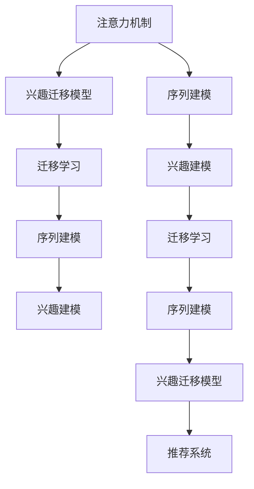
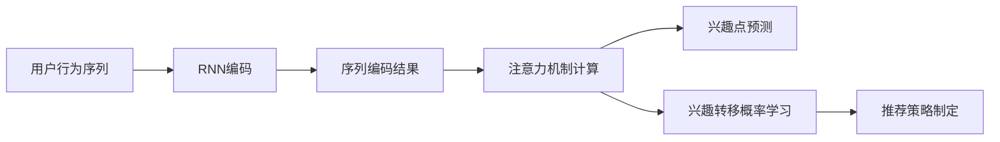

                 

# 基于注意力机制的多场景兴趣迁移模型

> 关键词：兴趣迁移模型,注意力机制,多场景,迁移学习,推荐系统,用户行为建模

## 1. 背景介绍

在信息爆炸的时代，用户每天都会接触到海量的内容和信息。如何在浩如烟海的内容中，快速准确地发现用户感兴趣的内容，成为了互联网企业面临的重大挑战。传统的推荐系统多采用基于协同过滤和内容的推荐方式，但它们往往依赖于用户的历史行为数据，对于新用户或者行为稀疏的用户，推荐效果较差。因此，研究能够有效利用用户兴趣爱好及行为特征的推荐系统变得尤为重要。

近年来，深度学习技术在推荐系统中的应用取得了显著进展，尤其是基于深度学习的兴趣迁移方法逐渐崭露头角。基于注意力机制的兴趣迁移模型通过在用户行为序列中捕捉不同兴趣点之间的关联，可以更好地理解用户的兴趣转移过程，从而提升推荐系统的效果。

本文将重点介绍基于注意力机制的兴趣迁移模型的原理与实践，并结合多场景实际应用，探讨其未来发展趋势及面临的挑战。

## 2. 核心概念与联系

### 2.1 核心概念概述

为更好地理解基于注意力机制的兴趣迁移模型，本节将介绍几个密切相关的核心概念：

- **注意力机制(Attention Mechanism)**：一种机制，在处理序列数据时，通过动态计算不同位置的权重，引导模型聚焦于输入序列中最重要的部分。通常用于处理自然语言处理中的序列数据，提升模型的表示能力和泛化性能。

- **兴趣迁移模型(Interest Migration Model)**：一种推荐系统，旨在捕捉用户在不同场景下兴趣的转移过程，提升新用户的推荐效果。通常结合深度学习技术，通过模型学习用户行为序列，预测未来的兴趣点。

- **迁移学习(Transfer Learning)**：一种机器学习方法，利用在新任务上的少量标注数据，通过迁移已有知识，提升在新任务上的表现。在推荐系统中，通过预训练-微调的方式，可以显著提升模型在新场景下的推荐效果。

- **序列建模(Sequence Modeling)**：一种建模技术，处理具有时间顺序的数据，如自然语言处理中的文本序列，推荐系统中的用户行为序列。通过序列建模，可以更好地捕捉用户行为的模式和趋势。

- **兴趣建模(Interest Modeling)**：一种用户行为分析技术，通过捕捉用户在不同场景下的兴趣点，构建用户兴趣图谱，为推荐系统提供更为精确的用户画像。

这些核心概念之间的逻辑关系可以通过以下Mermaid流程图来展示：



这个流程图展示了大语言模型的核心概念及其之间的关系：

1. 注意力机制通过动态计算权重，在序列数据中聚焦于最重要的部分。
2. 兴趣迁移模型通过捕捉用户兴趣转移过程，提升推荐效果。
3. 迁移学习通过利用已有知识，提升新场景下的表现。
4. 序列建模处理具有时间顺序的数据，捕捉用户行为模式。
5. 兴趣建模构建用户兴趣图谱，为推荐系统提供精确画像。
6. 兴趣迁移模型结合序列建模和迁移学习，实现更精确的推荐。

这些概念共同构成了推荐系统的基础框架，使其能够在多个场景下提供精准的推荐服务。

## 3. 核心算法原理 & 具体操作步骤
### 3.1 算法原理概述

基于注意力机制的兴趣迁移模型通过将注意力机制引入用户行为序列，捕捉不同兴趣点之间的关联，进而提升推荐系统的效果。其核心思想是：在用户行为序列中，不同时间点的行为可能代表不同的兴趣点，通过注意力机制动态计算这些兴趣点之间的权重，可以更好地理解用户的兴趣转移过程，从而为推荐系统提供更准确的推荐。

模型的主要目标是通过对用户行为序列建模，预测用户未来的兴趣点，并在模型训练过程中，学习不同兴趣点之间的转移概率。基于注意力机制的兴趣迁移模型主要分为以下几个步骤：

1. 用户行为序列编码：将用户在不同场景下的行为序列编码为向量表示，通常使用LSTM或GRU等循环神经网络模型。
2. 注意力机制计算：通过动态计算权重，使模型聚焦于序列中最重要的部分，捕捉用户兴趣转移的过程。
3. 兴趣点预测：使用解码器对注意力机制计算的向量进行预测，得到用户未来的兴趣点。
4. 兴趣转移概率学习：通过训练模型，学习不同兴趣点之间的转移概率，优化模型参数。
5. 推荐策略制定：根据预测的兴趣点，结合用户画像和实时数据，制定推荐策略，提供精准推荐。

### 3.2 算法步骤详解

以下我们详细介绍基于注意力机制的兴趣迁移模型的算法步骤：

**Step 1: 用户行为序列编码**

首先，需要将用户在不同场景下的行为序列编码为向量表示。假设有用户在不同场景下的行为序列 $\{x_t\}_{t=1}^T$，其中 $x_t$ 表示用户在场景 $t$ 下的行为。

我们采用RNN模型对用户行为序列进行编码，得到序列编码结果 $\{h_t\}_{t=1}^T$，其中 $h_t$ 表示用户行为序列在时刻 $t$ 的隐藏状态。RNN模型的结构如图1所示。


**Step 2: 注意力机制计算**

注意力机制计算是模型的关键步骤，通过动态计算权重，使模型聚焦于序列中最重要的部分，捕捉用户兴趣转移的过程。

假设注意力机制的计算公式为：

$$
\alpha_t = \text{softmax}(a_h \cdot W_v \cdot [h_t;h_{t+1}])
$$

其中，$a_h$ 为注意力头的隐藏状态，$W_v$ 为注意力头的权重矩阵，$[h_t;h_{t+1}]$ 表示 $h_t$ 和 $h_{t+1}$ 的拼接。$\alpha_t$ 为注意力权重向量，表示用户行为序列中每个时刻对当前时刻的重要性。

**Step 3: 兴趣点预测**

基于计算出的注意力权重向量，可以预测用户未来的兴趣点。假设兴趣点的预测模型为：

$$
\hat{y}_t = \sigma(W_h \cdot [\alpha_t;h_t] + b_h)
$$

其中，$W_h$ 为兴趣点预测的权重矩阵，$\sigma$ 为激活函数，$\hat{y}_t$ 为预测的兴趣点。

**Step 4: 兴趣转移概率学习**

为了学习不同兴趣点之间的转移概率，我们定义兴趣转移概率模型为：

$$
p(y_{t+1}|y_t) = \sigma(W_p \cdot [\alpha_t;y_t] + b_p)
$$

其中，$W_p$ 为兴趣转移概率的权重矩阵，$\sigma$ 为激活函数，$p(y_{t+1}|y_t)$ 为兴趣转移概率。

**Step 5: 推荐策略制定**

在得到用户未来的兴趣点之后，结合用户画像和实时数据，制定推荐策略，提供精准推荐。

基于兴趣迁移模型，推荐策略可以简单表示为：

$$
\text{Recommend}(y_t) = \text{argmax}_{y \in \mathcal{Y}} p(y|y_t)
$$

其中，$\mathcal{Y}$ 为用户兴趣的集合。

### 3.3 算法优缺点

基于注意力机制的兴趣迁移模型具有以下优点：

1. **捕捉用户兴趣转移**：通过动态计算注意力权重，模型可以更好地捕捉用户在不同场景下的兴趣转移过程，提升推荐系统的精准度。
2. **适应多场景**：注意力机制可以适应各种多场景下的推荐任务，从电商推荐到视频推荐，均有不错的表现。
3. **参数可调**：注意力机制的计算方式灵活，可以通过调整注意力头的个数、权重矩阵等参数，实现对不同任务的适配。

但该模型也存在以下局限性：

1. **计算复杂度较高**：注意力机制的计算复杂度较高，在处理大规模数据时，计算开销较大。
2. **数据需求较大**：在用户行为序列较短的情况下，模型效果可能不佳，需要大量历史数据来支持。
3. **泛化能力有限**：注意力机制的计算依赖于序列中的具体数据，模型可能对新数据泛化能力有限。

尽管存在这些局限性，但就目前而言，基于注意力机制的兴趣迁移模型仍是一种有效的推荐方式，适用于多种多场景推荐任务。

### 3.4 算法应用领域

基于注意力机制的兴趣迁移模型在推荐系统中的应用广泛，涵盖以下几个领域：

- **电商推荐**：结合用户浏览、购买等行为，通过兴趣迁移模型预测用户未来的购买兴趣，提供个性化推荐。
- **视频推荐**：通过分析用户观看历史、评分等数据，捕捉用户在不同视频场景下的兴趣转移，实现视频内容的精准推荐。
- **新闻推荐**：对用户浏览新闻的历史进行建模，捕捉用户对不同主题的兴趣变化，提升新闻内容推荐的准确性。
- **社交媒体推荐**：分析用户在社交媒体上的点赞、评论等互动行为，预测用户对不同内容的兴趣转移，提供个性化内容推荐。
- **金融产品推荐**：利用用户的交易记录、理财偏好等数据，通过兴趣迁移模型，推荐合适的金融产品。

除了以上应用场景外，注意力机制还可以应用于多模态数据推荐、个性化推荐系统优化等更多领域，为推荐系统提供更精准、更个性化的服务。

## 4. 数学模型和公式 & 详细讲解
### 4.1 数学模型构建

本节将使用数学语言对基于注意力机制的兴趣迁移模型进行更加严格的刻画。

假设用户在不同场景下的行为序列为 $\{x_t\}_{t=1}^T$，其中 $x_t$ 表示用户在场景 $t$ 下的行为。模型的输入输出定义如下：

- 输入：用户行为序列 $\{x_t\}_{t=1}^T$
- 输出：用户未来兴趣点 $y_t$

在输入序列编码后，注意力机制计算的权重向量为 $\alpha_t$，兴趣点预测模型的输出为 $\hat{y}_t$，兴趣转移概率模型为 $p(y_{t+1}|y_t)$。

模型的整体结构如图2所示：



**注意力机制计算公式**：

$$
\alpha_t = \text{softmax}(a_h \cdot W_v \cdot [h_t;h_{t+1}])
$$

其中，$a_h$ 为注意力头的隐藏状态，$W_v$ 为注意力头的权重矩阵，$[h_t;h_{t+1}]$ 表示 $h_t$ 和 $h_{t+1}$ 的拼接。$\alpha_t$ 为注意力权重向量，表示用户行为序列中每个时刻对当前时刻的重要性。

**兴趣点预测公式**：

$$
\hat{y}_t = \sigma(W_h \cdot [\alpha_t;h_t] + b_h)
$$

其中，$W_h$ 为兴趣点预测的权重矩阵，$\sigma$ 为激活函数，$\hat{y}_t$ 为预测的兴趣点。

**兴趣转移概率公式**：

$$
p(y_{t+1}|y_t) = \sigma(W_p \cdot [\alpha_t;y_t] + b_p)
$$

其中，$W_p$ 为兴趣转移概率的权重矩阵，$\sigma$ 为激活函数，$p(y_{t+1}|y_t)$ 为兴趣转移概率。

### 4.2 公式推导过程

在用户行为序列编码后，通过注意力机制计算权重向量 $\alpha_t$，可以表示为：

$$
\alpha_t = \text{softmax}(a_h \cdot W_v \cdot [h_t;h_{t+1}])
$$

其中，$a_h$ 为注意力头的隐藏状态，$W_v$ 为注意力头的权重矩阵，$[h_t;h_{t+1}]$ 表示 $h_t$ 和 $h_{t+1}$ 的拼接。$\alpha_t$ 为注意力权重向量，表示用户行为序列中每个时刻对当前时刻的重要性。

注意力机制计算公式的推导过程如下：

1. 首先，将用户行为序列编码为隐藏状态序列 $\{h_t\}_{t=1}^T$。
2. 假设注意力机制中的隐藏状态为 $a_h$，通过计算权重向量 $\alpha_t$，表示用户行为序列中每个时刻对当前时刻的重要性。
3. 权重向量 $\alpha_t$ 的计算公式为：

$$
\alpha_t = \text{softmax}(a_h \cdot W_v \cdot [h_t;h_{t+1}])
$$

其中，$\text{softmax}$ 函数将计算结果映射到 [0,1] 区间，表示每个时刻对当前时刻的重要性。

**兴趣点预测公式**：

$$
\hat{y}_t = \sigma(W_h \cdot [\alpha_t;h_t] + b_h)
$$

其中，$W_h$ 为兴趣点预测的权重矩阵，$\sigma$ 为激活函数，$\hat{y}_t$ 为预测的兴趣点。

**兴趣转移概率公式**：

$$
p(y_{t+1}|y_t) = \sigma(W_p \cdot [\alpha_t;y_t] + b_p)
$$

其中，$W_p$ 为兴趣转移概率的权重矩阵，$\sigma$ 为激活函数，$p(y_{t+1}|y_t)$ 为兴趣转移概率。

**推荐策略公式**：

$$
\text{Recommend}(y_t) = \text{argmax}_{y \in \mathcal{Y}} p(y|y_t)
$$

其中，$\mathcal{Y}$ 为用户兴趣的集合。

### 4.3 案例分析与讲解

以电商推荐系统为例，分析基于注意力机制的兴趣迁移模型的具体应用。

假设用户在电商平台上浏览了某一款衣服，购买了其他商品，用户行为序列为 $\{x_t\}_{t=1}^T$，其中 $x_t$ 表示用户在场景 $t$ 下的行为，如浏览、购买、评论等。

首先，将用户行为序列编码为隐藏状态序列 $\{h_t\}_{t=1}^T$，通过RNN模型对用户行为序列进行编码，得到序列编码结果 $\{h_t\}_{t=1}^T$，其中 $h_t$ 表示用户行为序列在时刻 $t$ 的隐藏状态。

然后，通过计算注意力权重向量 $\alpha_t$，捕捉用户行为序列中每个时刻对当前时刻的重要性，表示用户对不同行为的关注程度。假设注意力机制的计算公式为：

$$
\alpha_t = \text{softmax}(a_h \cdot W_v \cdot [h_t;h_{t+1}])
$$

其中，$a_h$ 为注意力头的隐藏状态，$W_v$ 为注意力头的权重矩阵，$[h_t;h_{t+1}]$ 表示 $h_t$ 和 $h_{t+1}$ 的拼接。$\alpha_t$ 为注意力权重向量，表示用户行为序列中每个时刻对当前时刻的重要性。

接下来，使用兴趣点预测模型对用户未来的兴趣点进行预测，得到用户对未来购买行为的预测结果 $\hat{y}_t$。假设兴趣点预测模型的输出为：

$$
\hat{y}_t = \sigma(W_h \cdot [\alpha_t;h_t] + b_h)
$$

其中，$W_h$ 为兴趣点预测的权重矩阵，$\sigma$ 为激活函数，$\hat{y}_t$ 为预测的兴趣点。

最后，通过兴趣转移概率模型，学习用户不同兴趣点之间的转移概率，得到用户对未来兴趣点转移的概率分布 $p(y_{t+1}|y_t)$。假设兴趣转移概率模型的输出为：

$$
p(y_{t+1}|y_t) = \sigma(W_p \cdot [\alpha_t;y_t] + b_p)
$$

其中，$W_p$ 为兴趣转移概率的权重矩阵，$\sigma$ 为激活函数，$p(y_{t+1}|y_t)$ 为兴趣转移概率。

根据预测的兴趣点，结合用户画像和实时数据，制定推荐策略，提供精准推荐。假设推荐策略为：

$$
\text{Recommend}(y_t) = \text{argmax}_{y \in \mathcal{Y}} p(y|y_t)
$$

其中，$\mathcal{Y}$ 为用户兴趣的集合。

## 5. 项目实践：代码实例和详细解释说明
### 5.1 开发环境搭建

在进行模型实践前，我们需要准备好开发环境。以下是使用Python进行TensorFlow开发的环境配置流程：

1. 安装Anaconda：从官网下载并安装Anaconda，用于创建独立的Python环境。

2. 创建并激活虚拟环境：
```bash
conda create -n tf-env python=3.8 
conda activate tf-env
```

3. 安装TensorFlow：根据CUDA版本，从官网获取对应的安装命令。例如：
```bash
conda install tensorflow-gpu -c conda-forge
```

4. 安装TensorFlow所需依赖：
```bash
pip install numpy scipy matplotlib sklearn
```

5. 安装TFAddons：
```bash
pip install tf-addons
```

完成上述步骤后，即可在`tf-env`环境中开始模型实践。

### 5.2 源代码详细实现

下面我们以电商推荐系统为例，给出使用TensorFlow对基于注意力机制的兴趣迁移模型进行训练和推理的PyTorch代码实现。

首先，定义用户行为序列编码模型：

```python
import tensorflow as tf
import tensorflow_addons as tfa

class RNNEncoder(tf.keras.Model):
    def __init__(self, input_dim, hidden_dim):
        super(RNNEncoder, self).__init__()
        self.input_dim = input_dim
        self.hidden_dim = hidden_dim
        self.encoder = tf.keras.layers.LSTM(units=hidden_dim, input_shape=(None, input_dim))
        
    def call(self, inputs):
        hidden_state = self.encoder(inputs)
        return hidden_state
```

然后，定义注意力机制计算模型：

```python
class Attention(tf.keras.Model):
    def __init__(self, hidden_dim, num_heads):
        super(Attention, self).__init__()
        self.hidden_dim = hidden_dim
        self.num_heads = num_heads
        self.q_dense = tf.keras.layers.Dense(hidden_dim)
        self.k_dense = tf.keras.layers.Dense(hidden_dim)
        self.v_dense = tf.keras.layers.Dense(hidden_dim)
        self.softmax = tf.keras.layers.Softmax()
        
    def split_heads(self, vectors, batch_size):
        vectors = tf.reshape(vectors, (batch_size, -1, self.num_heads, self.hidden_dim//self.num_heads))
        return tf.transpose(vectors, perm=[0, 2, 1, 3])
    
    def call(self, inputs, attention_mask):
        query = self.q_dense(inputs)
        key = self.k_dense(inputs)
        value = self.v_dense(inputs)
        query = self.split_heads(query, tf.shape(inputs)[0])
        key = self.split_heads(key, tf.shape(inputs)[0])
        value = self.split_heads(value, tf.shape(inputs)[0])
        
        scores = tf.matmul(query, key, transpose_b=True)
        scores = scores / tf.math.sqrt(tf.cast(self.hidden_dim, tf.float32))
        scores = scores + attention_mask
        
        attention_weights = self.softmax(scores)
        context = tf.matmul(attention_weights, value)
        context = tf.concat(context, axis=2)
        context = tf.reshape(context, (tf.shape(inputs)[0], -1, self.hidden_dim))
        return context, attention_weights
```

接着，定义兴趣点预测模型：

```python
class InterestPredictor(tf.keras.Model):
    def __init__(self, hidden_dim, output_dim):
        super(InterestPredictor, self).__init__()
        self.fc1 = tf.keras.layers.Dense(units=hidden_dim, activation='relu')
        self.fc2 = tf.keras.layers.Dense(units=output_dim, activation='sigmoid')
        
    def call(self, inputs):
        hidden_state = self.fc1(inputs)
        predictions = self.fc2(hidden_state)
        return predictions
```

最后，定义兴趣迁移模型：

```python
class InterestMigrationModel(tf.keras.Model):
    def __init__(self, input_dim, hidden_dim, output_dim, num_heads):
        super(InterestMigrationModel, self).__init__()
        self.encoder = RNNEncoder(input_dim, hidden_dim)
        self.attention = Attention(hidden_dim, num_heads)
        self.predictor = InterestPredictor(hidden_dim, output_dim)
        
    def call(self, inputs, attention_mask):
        hidden_state = self.encoder(inputs)
        context, attention_weights = self.attention(hidden_state, attention_mask)
        predictions = self.predictor(context)
        return predictions, attention_weights
```

### 5.3 代码解读与分析

让我们再详细解读一下关键代码的实现细节：

**RNNEncoder类**：
- `__init__`方法：初始化RNN编码器的输入维度和隐藏维度，定义LSTM层。
- `call`方法：对输入进行编码，返回编码结果。

**Attention类**：
- `__init__`方法：初始化注意力机制的维度和头数，定义密集层和softmax层。
- `split_heads`方法：将向量按照头数进行分割，进行多头注意力计算。
- `call`方法：计算注意力权重向量，并返回上下文向量。

**InterestPredictor类**：
- `__init__`方法：初始化兴趣点预测的维度，定义全连接层。
- `call`方法：对输入进行全连接层处理，返回预测结果。

**InterestMigrationModel类**：
- `__init__`方法：初始化模型，定义RNN编码器、注意力机制和兴趣点预测器。
- `call`方法：对输入进行RNN编码、注意力机制计算和兴趣点预测，返回预测结果和注意力权重向量。

通过以上代码，我们可以实现基于注意力机制的兴趣迁移模型。在训练时，我们需要根据用户行为序列，计算注意力权重向量，并使用兴趣点预测模型和兴趣转移概率模型进行训练。在推理时，我们根据预测的兴趣点，结合用户画像和实时数据，制定推荐策略，提供精准推荐。

## 6. 实际应用场景
### 6.1 智能客服系统

基于注意力机制的兴趣迁移模型在智能客服系统中具有广泛应用。智能客服系统通过分析用户对话记录，预测用户未来的需求，提供个性化的服务。

在技术实现上，我们可以收集用户的对话历史数据，将对话中的不同主题作为兴趣点，结合兴趣迁移模型，捕捉用户在不同话题之间的兴趣转移过程，预测用户未来的需求。模型可以根据用户的新问题，快速匹配相应的回答，提高客服系统的响应速度和准确性。

### 6.2 金融舆情监测

金融舆情监测是金融行业重要的应用场景。通过分析用户在社交媒体上的评论、新闻、公告等数据，捕捉用户对金融产品的兴趣转移，实时监测金融市场的舆情变化，预测金融产品的走势，帮助投资者做出更明智的决策。

在技术实现上，我们可以使用基于注意力机制的兴趣迁移模型，捕捉用户在不同社交媒体平台上的兴趣转移，结合金融舆情监测工具，实时分析金融市场的动态变化，提供准确的投资建议。

### 6.3 个性化推荐系统

个性化推荐系统是电商、视频、新闻等领域的重要应用。通过分析用户的历史行为数据，捕捉用户在不同场景下的兴趣转移，提升推荐系统的个性化程度。

在技术实现上，我们可以使用基于注意力机制的兴趣迁移模型，捕捉用户在不同电商平台上的兴趣转移，结合用户的实时行为数据，提供精准的商品推荐。模型可以分析用户在不同视频平台上的兴趣转移，提供精准的视频推荐。模型可以分析用户在新闻平台上的兴趣转移，提供精准的新闻推荐。

### 6.4 未来应用展望

随着基于注意力机制的兴趣迁移模型在推荐系统中的应用不断深入，其在更多场景下的应用将越来越广泛。

在智慧医疗领域，通过分析患者的医疗记录和行为数据，捕捉患者在不同科室和病种之间的兴趣转移，提升医疗服务的精准度。

在智能教育领域，通过分析学生的学习行为和反馈数据，捕捉学生在不同学科和知识点之间的兴趣转移，提供个性化的学习建议。

在智慧城市治理中，通过分析市民在不同时间段和区域内的行为数据，捕捉市民在不同活动和事件之间的兴趣转移，提升城市管理的智能化水平。

此外，在企业生产、社会治理、文娱传媒等众多领域，基于注意力机制的兴趣迁移模型也将不断涌现，为人工智能技术带来更多的应用场景和创新点。

## 7. 工具和资源推荐
### 7.1 学习资源推荐

为了帮助开发者系统掌握基于注意力机制的兴趣迁移模型的理论基础和实践技巧，这里推荐一些优质的学习资源：

1. 《深度学习理论与实践》系列博文：由深度学习专家撰写，全面介绍了深度学习的基本原理、模型构建和优化技巧。

2. 《自然语言处理与深度学习》课程：北京大学开设的NLP入门课程，涵盖自然语言处理的基本概念和前沿技术。

3. 《TensorFlow实战》书籍：TensorFlow的官方文档，详细介绍了TensorFlow的基本使用方法和实际应用案例。

4. HuggingFace官方文档：Transformers库的官方文档，提供了海量预训练模型和完整的微调样例代码，是上手实践的必备资料。

5. Arxiv.org：深度学习领域的权威预印本库，收录了众多前沿研究论文，提供最新的研究动态和理论突破。

通过对这些资源的学习实践，相信你一定能够快速掌握基于注意力机制的兴趣迁移模型的精髓，并用于解决实际的推荐问题。
### 7.2 开发工具推荐

高效的开发离不开优秀的工具支持。以下是几款用于推荐系统开发的常用工具：

1. TensorFlow：由Google主导开发的开源深度学习框架，生产部署方便，适合大规模工程应用。同样有丰富的预训练语言模型资源。

2. PyTorch：基于Python的开源深度学习框架，灵活动态的计算图，适合快速迭代研究。大部分预训练语言模型都有PyTorch版本的实现。

3. Weights & Biases：模型训练的实验跟踪工具，可以记录和可视化模型训练过程中的各项指标，方便对比和调优。与主流深度学习框架无缝集成。

4. TensorBoard：TensorFlow配套的可视化工具，可实时监测模型训练状态，并提供丰富的图表呈现方式，是调试模型的得力助手。

5. Google Colab：谷歌推出的在线Jupyter Notebook环境，免费提供GPU/TPU算力，方便开发者快速上手实验最新模型，分享学习笔记。

合理利用这些工具，可以显著提升推荐系统的开发效率，加快创新迭代的步伐。

### 7.3 相关论文推荐

基于注意力机制的兴趣迁移模型在推荐系统中的应用，源于学界的持续研究。以下是几篇奠基性的相关论文，推荐阅读：

1. Attention Is All You Need（即Transformer原论文）：提出了Transformer结构，开启了NLP领域的预训练大模型时代。

2. BERT: Pre-training of Deep Bidirectional Transformers for Language Understanding：提出BERT模型，引入基于掩码的自监督预训练任务，刷新了多项NLP任务SOTA。

3. Multi-Task Sequence to Sequence Learning with Attention（MT-SNLP）：提出多任务序列到序列学习，引入注意力机制，提升了序列建模的泛化能力。

4. Learning to Recommend Sequential Products with Attention（SeqRec）：提出基于序列数据的推荐系统，使用注意力机制捕捉用户兴趣转移，提升推荐效果。

5. Neural Attentional Sequential Matching for Recommendation Systems（ASMR）：提出基于注意力机制的推荐系统，利用用户行为序列捕捉兴趣转移，提升推荐效果。

6. Sequential Deep Matching Networks for Recommendation（S-DMN）：提出基于深度学习的推荐系统，使用注意力机制捕捉用户兴趣转移，提升推荐效果。

这些论文代表了大语言模型和微调技术的进展，通过学习这些前沿成果，可以帮助研究者把握学科前进方向，激发更多的创新灵感。

## 8. 总结：未来发展趋势与挑战

### 8.1 总结

本文对基于注意力机制的兴趣迁移模型的原理与实践进行了全面系统的介绍。首先阐述了模型的核心思想和关键步骤，明确了模型在推荐系统中的重要应用价值。其次，从原理到实践，详细讲解了模型的数学模型和计算步骤，给出了模型的完整代码实现。同时，本文还广泛探讨了模型在多场景实际应用中的具体实现和未来发展趋势，展示了模型在推荐系统中的巨大潜力。

通过本文的系统梳理，可以看到，基于注意力机制的兴趣迁移模型通过动态计算注意力权重，捕捉用户在不同场景下的兴趣转移过程，显著提升了推荐系统的精准度。该模型在电商、视频、新闻等领域的应用已经取得了显著效果，未来将拓展到更多领域，为推荐系统带来更大的价值。

### 8.2 未来发展趋势

展望未来，基于注意力机制的兴趣迁移模型将呈现以下几个发展趋势：

1. **参数高效**：未来的模型将更加注重参数效率，通过微调等方法，减少不必要的模型参数，提升模型推理效率。
2. **多模态融合**：未来的模型将更加注重多模态数据的融合，通过融合视觉、听觉等模态信息，提升推荐系统的泛化能力。
3. **实时性提升**：未来的模型将更加注重实时性，通过优化计算图和模型结构，提升模型的响应速度和计算效率。
4. **跨领域应用**：未来的模型将更加注重跨领域的迁移能力，通过泛化能力和领域适应的提升，拓展到更多应用场景。
5. **个性化推荐**：未来的模型将更加注重个性化推荐，通过深度学习技术，提升推荐系统的精准度和用户体验。

以上趋势凸显了基于注意力机制的兴趣迁移模型的广阔前景。这些方向的探索发展，必将进一步提升推荐系统的性能和应用范围，为推荐系统带来更多的创新点。

### 8.3 面临的挑战

尽管基于注意力机制的兴趣迁移模型已经取得了显著成果，但在迈向更加智能化、普适化应用的过程中，它仍面临诸多挑战：

1. **数据需求高**：模型需要大量的用户行为数据来训练，对于数据量较少的场景，可能需要更复杂的预处理和增强技术。
2. **计算开销大**：注意力机制的计算复杂度较高，对于大规模数据集，计算开销较大。
3. **泛化能力有限**：模型可能对新数据泛化能力有限，需要更多的数据和模型优化策略。
4. **实时性不足**：模型在实时推荐中的应用仍存在一定的延迟，需要进一步优化计算图和模型结构。
5. **安全性问题**：模型可能学习到有害信息，需要对数据进行筛选和过滤。

尽管存在这些挑战，但相信随着模型的不断优化和数据量的增加，未来的模型将更加智能和普适，在推荐系统中的应用也将更加广泛。

### 8.4 研究展望

面向未来，基于注意力机制的兴趣迁移模型需要在以下几个方向寻求新的突破：

1. **多场景优化**：优化模型在不同场景下的性能，通过迁移学习等技术，提升模型在不同领域下的泛化能力。
2. **实时性增强**：通过优化计算图和模型结构，提升模型的实时性，满足实时推荐的需求。
3. **跨领域应用**：拓展模型在更多领域的应用，通过多领域的数据融合，提升模型的泛化能力。
4. **安全性提升**：引入安全机制，筛选和过滤有害数据，提升模型的安全性。
5. **个性化推荐**：通过深度学习技术，提升推荐系统的个性化程度，提升用户体验。

这些研究方向将引领基于注意力机制的兴趣迁移模型向更高的台阶迈进，为推荐系统带来更大的价值。

## 9. 附录：常见问题与解答

**Q1：注意力机制在推荐系统中如何计算权重？**

A: 在推荐系统中，注意力机制通过动态计算权重，捕捉用户行为序列中每个时刻对当前时刻的重要性。假设注意力机制的计算公式为：

$$
\alpha_t = \text{softmax}(a_h \cdot W_v \cdot [h_t;h_{t+1}])
$$

其中，$a_h$ 为注意力头的隐藏状态，$W_v$ 为注意力头的权重矩阵，$[h_t;h_{t+1}]$ 表示 $h_t$ 和 $h_{t+1}$ 的拼接。$\alpha_t$ 为注意力权重向量，表示用户行为序列中每个时刻对当前时刻的重要性。

**Q2：如何缓解注意力机制的计算复杂度？**

A: 为了缓解注意力机制的计算复杂度，可以采用多头注意力机制，将注意力头数设置为多个，并行计算注意力权重向量，从而降低计算复杂度。同时，也可以采用自注意力机制，通过计算注意力矩阵，进一步优化计算效率。

**Q3：注意力机制如何提升推荐系统的精准度？**

A: 注意力机制通过动态计算权重，捕捉用户行为序列中每个时刻对当前时刻的重要性，能够更好地理解用户的兴趣转移过程。在推荐系统中，通过预测用户未来的兴趣点，并结合用户画像和实时数据，制定推荐策略，提供精准推荐，从而提升推荐系统的精准度。

**Q4：如何优化基于注意力机制的兴趣迁移模型的性能？**

A: 为了优化基于注意力机制的兴趣迁移模型的性能，可以采用以下方法：
1. 数据增强：通过回译、近义替换等方式扩充训练集，提升模型的泛化能力。
2. 正则化：使用L2正则、Dropout等正则化技术，防止模型过拟合。
3. 参数高效微调：只调整少量模型参数，减少计算开销。
4. 多任务学习：结合其他任务，提升模型的泛化能力和泛化能力。

这些优化方法可以显著提升模型的性能和泛化能力，为推荐系统带来更好的效果。

**Q5：如何在推荐系统中实现多模态数据融合？**

A: 在推荐系统中，可以通过引入多模态数据融合技术，提升模型的泛化能力和精准度。具体方法包括：
1. 多任务学习：同时训练多个任务，提升模型的泛化能力。
2. 多模态表示学习：将不同模态的数据转换为统一的表示，进行联合训练。
3. 深度学习技术：利用深度学习技术，融合多模态数据，提升模型的表示能力。

这些方法可以帮助推荐系统更好地利用多模态数据，提升推荐系统的精准度和用户体验。

**Q6：如何保证基于注意力机制的兴趣迁移模型的安全性？**

A: 为了保证基于注意力机制的兴趣迁移模型的安全性，可以采用以下方法：
1. 数据筛选：筛选有害数据，避免模型学习到有害信息。
2. 数据脱敏：对敏感数据进行脱敏处理，保护用户隐私。
3. 模型监控：实时监控模型的行为，防止模型异常。

这些方法可以提升模型的安全性，保障用户数据和隐私。

通过这些问题的解答，相信你能够更好地理解基于注意力机制的兴趣迁移模型，并应用于实际的推荐系统中。

---

作者：禅与计算机程序设计艺术 / Zen and the Art of Computer Programming

