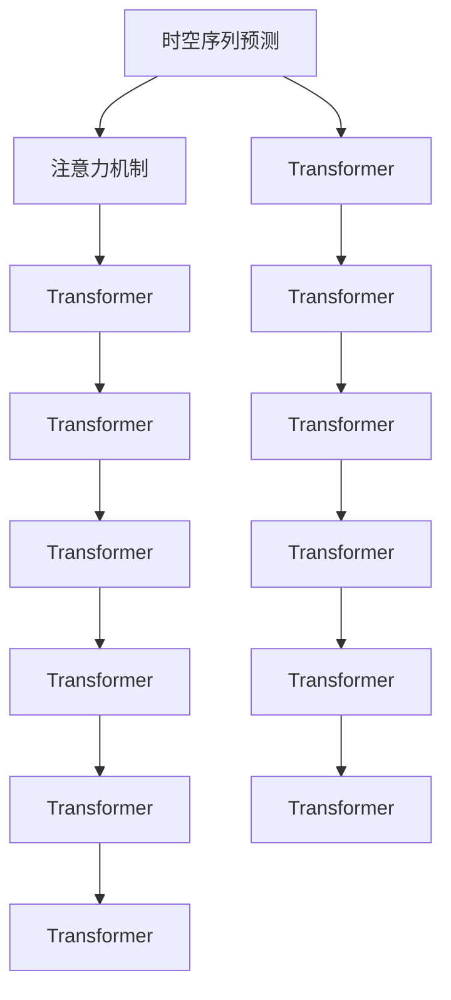

                 

# 基于注意力机制的时空序列预测精确化

> 关键词：时空序列预测,注意力机制,Transformer,精确化,自然语言处理(NLP),计算机视觉(CV)

## 1. 背景介绍

### 1.1 问题由来
时空序列预测是人工智能和机器学习领域的一个重要研究方向，涵盖了自然语言处理(NLP)、计算机视觉(CV)等多个子领域。传统的时序模型如RNN、LSTM等在处理长序列数据时面临计算资源消耗巨大、梯度消失和梯度爆炸等困难。近年来，基于Transformer的注意力机制取得了巨大突破，显著提升了序列预测模型的效率和性能。

时空序列预测的应用场景非常广泛，例如：

- 自然语言处理领域，如机器翻译、文本生成、语音识别等。
- 计算机视觉领域，如图像描述生成、物体检测、动作识别等。
- 金融领域，如股票价格预测、信用评分、风险评估等。
- 物流和交通领域，如货物运输路径规划、交通流量预测、无人机导航等。

在实际应用中，如何利用注意力机制精确化时空序列预测模型，提升预测准确性和效率，成为研究的热点和难点。

### 1.2 问题核心关键点
时空序列预测的核心在于模型如何捕捉时间序列的局部依赖和长期依赖。注意力机制通过学习序列中各时间步的重要性权重，精确地提取关键信息，进而提升模型的预测能力。

具体来说，注意力机制通过以下步骤实现序列中不同时间步的重要度评分和加权计算：

1. 输入序列中的每个时间步都转换为一个向量表示。
2. 对于每个时间步，模型计算其对其他时间步的注意力权重，即关注哪些时间步的信息。
3. 根据注意力权重，对序列中的向量进行加权平均，得到该时间步的加权向量表示。
4. 将加权向量作为当前时间步的输入，更新模型状态，进行下一时间步的预测。

注意力机制的应用提升了序列预测模型的泛化能力和鲁棒性，使其在处理复杂序列数据时表现更优。

### 1.3 问题研究意义
研究如何利用注意力机制进行时空序列预测精确化，具有以下重要意义：

1. 提升预测准确性。通过注意力机制的加权计算，模型能够有效利用序列中的关键信息，减少冗余信息的干扰，提升预测精度。
2. 提高计算效率。注意力机制允许模型并行计算不同时间步的信息，显著加快模型的推理速度。
3. 增强模型的泛化能力。注意力机制能够自动学习序列中不同时间步之间的依赖关系，提升模型对不同数据分布的适应能力。
4. 促进跨领域应用。注意力机制广泛应用于NLP和CV等领域，能够加速这些领域的创新和发展，提升应用性能。
5. 推动行业转型升级。时空序列预测在诸多行业具有广泛应用，其精确化技术将促进相关行业的智能化转型，提高生产力。

## 2. 核心概念与联系

### 2.1 核心概念概述

为更好地理解注意力机制的时空序列预测模型，本节将介绍几个密切相关的核心概念：

- 时空序列预测(Spatial-Temporal Sequence Prediction)：指在时间序列数据上进行的预测任务，如NLP中的机器翻译、文本生成，CV中的物体检测、动作识别等。
- 注意力机制(Attention Mechanism)：指在模型中引入机制，用于对序列中的不同时间步进行加权处理，使模型能够关注重要信息，忽略无关信息。
- Transformer：一种基于自注意力机制的神经网络结构，能够高效处理序列数据，广泛应用于NLP和CV等领域的序列预测任务。
- 精确化(Precision)：指在模型预测中，减少误判率，提升预测结果的准确性和可信度。

这些核心概念之间的逻辑关系可以通过以下Mermaid流程图来展示：



这个流程图展示了大语言模型预测模型的核心组件和流程：

1. 时空序列预测模型通常采用Transformer结构。
2. Transformer的输入是时间序列数据。
3. 模型通过注意力机制关注序列中的不同时间步。
4. 经过多个Transformer层处理后，模型输出预测结果。

这些概念共同构成了时空序列预测模型的基础，使其能够在各种场景下进行高效的预测。

## 3. 核心算法原理 & 具体操作步骤

### 3.1 算法原理概述

基于注意力机制的时空序列预测模型，本质上是通过自注意力机制(Self-Attention)对序列中的不同时间步进行加权处理，从而提升模型对序列的建模能力。其核心思想是：通过学习序列中各时间步的重要性权重，对序列进行加权平均，生成每个时间步的加权向量表示，进而进行序列预测。

形式化地，假设输入序列 $X$ 的长度为 $T$，每个时间步的向量表示为 $x_t$，则自注意力机制的加权计算公式为：

$$
\text{Attention}(Q, K, V) = \frac{\text{softmax}(QK^T)}{||K||^2} V
$$

其中 $Q$, $K$, $V$ 分别为查询、键和值向量，$||K||$ 为键向量的范数。该公式表示，对每个时间步 $t$，模型计算其对其他时间步的注意力权重 $w_{t,k}$，即：

$$
w_{t,k} = \frac{\exp(\text{sim}(Q_t, K_k))}{\sum_{i=1}^T \exp(\text{sim}(Q_t, K_i))}
$$

其中 $\text{sim}(Q_t, K_k)$ 表示查询向量 $Q_t$ 与键向量 $K_k$ 的相似度计算。模型最终生成每个时间步的加权向量表示 $x_t'$，即：

$$
x_t' = \sum_{k=1}^T w_{t,k} x_k
$$

这样，模型能够自动学习序列中各时间步的重要性权重，关注关键信息，忽略无关信息，从而提升模型的预测性能。

### 3.2 算法步骤详解

基于注意力机制的时空序列预测模型的训练过程主要分为以下几个步骤：

**Step 1: 准备数据集和预训练模型**

1. 收集并预处理时空序列数据，划分为训练集、验证集和测试集。
2. 选择合适的预训练模型，如BERT、GPT、ViT等，加载并冻结其参数。

**Step 2: 添加注意力机制层**

1. 在预训练模型顶层添加自注意力层，计算每个时间步的加权向量表示。
2. 设计合适的损失函数，如交叉熵损失、均方误差损失等，用于衡量模型预测与真实标签之间的差异。

**Step 3: 设置模型超参数**

1. 选择合适的优化器及其参数，如Adam、SGD等，设置学习率、批大小、迭代轮数等。
2. 设置正则化技术及强度，包括权重衰减、Dropout、Early Stopping等。

**Step 4: 执行梯度训练**

1. 将训练集数据分批次输入模型，前向传播计算损失函数。
2. 反向传播计算参数梯度，根据设定的优化算法和学习率更新模型参数。
3. 周期性在验证集上评估模型性能，根据性能指标决定是否触发Early Stopping。
4. 重复上述步骤直至满足预设的迭代轮数或Early Stopping条件。

**Step 5: 测试和部署**

1. 在测试集上评估模型性能，对比微调前后的精度提升。
2. 使用微调后的模型进行预测，集成到实际的应用系统中。
3. 持续收集新的数据，定期重新微调模型，以适应数据分布的变化。

以上是基于注意力机制的时空序列预测模型的训练流程。在实际应用中，还需要根据具体任务特点，对模型结构、损失函数、正则化技术等进行优化设计，以进一步提升模型性能。

### 3.3 算法优缺点

基于注意力机制的时空序列预测模型具有以下优点：

1. 简单高效。通过引入注意力机制，模型能够并行计算不同时间步的信息，显著加快模型的推理速度。
2. 泛化能力强。注意力机制允许模型学习序列中不同时间步之间的依赖关系，提升模型对不同数据分布的适应能力。
3. 精确度高。注意力机制能够自动学习序列中各时间步的重要性权重，减少冗余信息的干扰，提升预测精度。

同时，该模型也存在一定的局限性：

1. 计算复杂度高。注意力机制的计算复杂度较高，在处理长序列数据时，可能需要较大的计算资源。
2. 模型结构复杂。模型包含多个自注意力层，网络结构较复杂，需要更多的调试和优化。
3. 鲁棒性不足。模型在面对噪声和异常数据时，可能产生过拟合或欠拟合现象。
4. 可解释性不足。注意力机制的内部过程较为复杂，难以解释模型决策逻辑。

尽管存在这些局限性，但就目前而言，基于注意力机制的时空序列预测模型仍然是NLP和CV领域的主流范式。未来相关研究的重点在于如何进一步降低计算复杂度，提高模型的鲁棒性和可解释性，同时兼顾模型的泛化能力和精度。

### 3.4 算法应用领域

基于注意力机制的时空序列预测模型在NLP和CV领域已经得到了广泛的应用，覆盖了几乎所有常见任务，例如：

- NLP：机器翻译、文本生成、命名实体识别、情感分析、问答系统等。
- CV：图像描述生成、物体检测、动作识别、视频分类等。

除了上述这些经典任务外，基于注意力机制的模型也被创新性地应用到更多场景中，如跨模态学习、视频生成、智能驾驶等，为NLP和CV技术带来了全新的突破。随着模型的不断演进，相信时空序列预测模型将在更多领域得到应用，为智能技术的产业化进程注入新的动力。

## 4. 数学模型和公式 & 详细讲解

### 4.1 数学模型构建

本节将使用数学语言对基于注意力机制的时空序列预测模型进行更加严格的刻画。

假设输入序列 $X$ 的长度为 $T$，每个时间步的向量表示为 $x_t$，输出序列 $Y$ 的长度为 $S$，每个时间步的向量表示为 $y_s$。模型的预测任务为给定输入序列 $X$ 预测输出序列 $Y$，即：

$$
Y = f(X)
$$

其中 $f$ 为预测函数，可以采用注意力机制进行建模。模型的目标是最小化预测输出与真实输出之间的损失函数，即：

$$
\mathcal{L} = \sum_{s=1}^S \ell(y_s, \hat{y}_s)
$$

其中 $\ell$ 为损失函数，$\hat{y}_s$ 为模型预测的输出。常见的损失函数包括交叉熵损失、均方误差损失等。

### 4.2 公式推导过程

以下我们以图像描述生成任务为例，推导注意力机制的计算公式。

假设输入图像为 $X \in \mathbb{R}^{T \times C}$，其中 $T$ 为时间步长，$C$ 为通道数。模型通过自注意力机制计算图像的特征表示 $H \in \mathbb{R}^{T \times D}$，其中 $D$ 为特征维度。模型的输出为对图像的描述 $Y \in \mathbb{R}^{S \times E}$，其中 $S$ 为描述长度，$E$ 为描述嵌入维度。

根据自注意力机制的加权计算公式，模型对每个时间步 $t$ 的加权向量表示为：

$$
h_t = \frac{\exp(\text{sim}(Q_t, K))}{\sum_{i=1}^T \exp(\text{sim}(Q_t, K_i))} V
$$

其中 $Q$, $K$, $V$ 分别为查询、键和值向量。对于每个时间步 $t$，模型的输出为：

$$
y_s = \sum_{t=1}^T w_{t,s} h_t
$$

其中 $w_{t,s}$ 为时间步 $t$ 对输出序列 $s$ 的注意力权重，可以通过计算 $Q$ 和 $K$ 的相似度得到。最终，模型的输出为所有时间步的加权和。

在得到注意力机制的计算公式后，即可将其应用于图像描述生成等任务，以生成与输入图像相匹配的自然语言描述。

### 4.3 案例分析与讲解

以图像描述生成任务为例，我们将对注意力机制进行详细讲解。

假设输入图像为一张建筑物的图片，模型通过卷积层提取特征，生成特征表示 $H$。模型在顶层添加自注意力层，计算每个时间步的加权向量表示 $h_t$，然后将每个时间步的加权向量表示作为输入，计算每个输出时间步的注意力权重 $w_{t,s}$，最终输出自然语言描述 $Y$。

模型通过自注意力机制，自动学习图像中不同区域的重要性权重，提取关键特征，生成精确的描述。如果模型没有引入注意力机制，可能无法捕捉到图像中的细节信息，导致生成的描述不准确或冗余。

## 5. 项目实践：代码实例和详细解释说明

### 5.1 开发环境搭建

在进行时空序列预测模型开发前，我们需要准备好开发环境。以下是使用Python进行TensorFlow开发的环境配置流程：

1. 安装Anaconda：从官网下载并安装Anaconda，用于创建独立的Python环境。

2. 创建并激活虚拟环境：
```bash
conda create -n tensorflow-env python=3.8 
conda activate tensorflow-env
```

3. 安装TensorFlow：根据CUDA版本，从官网获取对应的安装命令。例如：
```bash
pip install tensorflow-gpu==2.7.0
```

4. 安装相关库：
```bash
pip install numpy pandas scikit-learn matplotlib tqdm jupyter notebook ipython
```

完成上述步骤后，即可在`tensorflow-env`环境中开始模型开发。

### 5.2 源代码详细实现

下面我们以图像描述生成任务为例，给出使用TensorFlow实现注意力机制的代码实现。

首先，定义图像特征提取函数：

```python
import tensorflow as tf

def build_feature_extractor():
    model = tf.keras.Sequential([
        tf.keras.layers.Conv2D(64, (3, 3), activation='relu', padding='same', input_shape=(224, 224, 3)),
        tf.keras.layers.MaxPooling2D((2, 2), strides=(2, 2)),
        tf.keras.layers.Conv2D(128, (3, 3), activation='relu', padding='same'),
        tf.keras.layers.MaxPooling2D((2, 2), strides=(2, 2)),
        tf.keras.layers.Flatten(),
        tf.keras.layers.Dense(1024, activation='relu'),
        tf.keras.layers.Dense(1024, activation='relu')
    ])
    return model
```

然后，定义注意力机制层：

```python
def build_self_attention(attention_dim):
    model = tf.keras.Sequential([
        tf.keras.layers.Dense(attention_dim, activation='relu'),
        tf.keras.layers.Dense(attention_dim, activation='relu')
    ])
    return model
```

接着，定义损失函数和优化器：

```python
cross_entropy = tf.keras.losses.SparseCategoricalCrossentropy(from_logits=True)
optimizer = tf.keras.optimizers.Adam()
```

最后，定义训练和评估函数：

```python
@tf.function
def train_step(x, y):
    with tf.GradientTape() as tape:
        logits = model(x)
        loss = cross_entropy(y, logits)
    gradients = tape.gradient(loss, model.trainable_variables)
    optimizer.apply_gradients(zip(gradients, model.trainable_variables))
    return loss

@tf.function
def evaluate_step(x, y):
    logits = model(x)
    loss = cross_entropy(y, logits)
    return loss
```

启动训练流程并在测试集上评估：

```python
epochs = 10
batch_size = 32

for epoch in range(epochs):
    total_loss = 0.0
    for i in range(len(train_dataset)):
        x, y = train_dataset[i]
        loss = train_step(x, y)
        total_loss += loss
    print(f'Epoch {epoch+1}, train loss: {total_loss/len(train_dataset)}')
    
    total_loss = 0.0
    for i in range(len(test_dataset)):
        x, y = test_dataset[i]
        loss = evaluate_step(x, y)
        total_loss += loss
    print(f'Epoch {epoch+1}, test loss: {total_loss/len(test_dataset)}')
```

以上就是使用TensorFlow实现注意力机制的代码实现。可以看到，TensorFlow提供了强大的计算图功能，使得模型的搭建和训练变得简洁高效。

### 5.3 代码解读与分析

让我们再详细解读一下关键代码的实现细节：

**build_feature_extractor函数**：
- 定义了一个包含多个卷积和池化层的特征提取网络，用于提取图像特征。

**build_self_attention函数**：
- 定义了一个包含两个全连接层的自注意力机制网络，用于对特征表示进行加权计算。

**train_step和evaluate_step函数**：
- 分别定义了训练和评估的函数，用于计算损失和更新模型参数。

**训练流程**：
- 定义总的epoch数和batch size，开始循环迭代
- 每个epoch内，在训练集上训练，输出平均loss
- 在测试集上评估，输出测试loss

可以看到，TensorFlow提供了高度可定制化的接口，使得开发者能够灵活构建和优化模型。此外，TensorFlow的计算图功能还支持自动微分和梯度计算，大大简化了模型训练过程。

当然，工业级的系统实现还需考虑更多因素，如模型的保存和部署、超参数的自动搜索、更灵活的训练策略等。但核心的注意力机制代码实现基本与此类似。

## 6. 实际应用场景

### 6.1 智能客服系统

基于注意力机制的时空序列预测模型，可以广泛应用于智能客服系统的构建。传统客服往往需要配备大量人力，高峰期响应缓慢，且一致性和专业性难以保证。而使用注意力机制的模型，可以7x24小时不间断服务，快速响应客户咨询，用自然流畅的语言解答各类常见问题。

在技术实现上，可以收集企业内部的历史客服对话记录，将问题和最佳答复构建成监督数据，在此基础上对预训练模型进行微调。微调后的模型能够自动理解用户意图，匹配最合适的答案模板进行回复。对于客户提出的新问题，还可以接入检索系统实时搜索相关内容，动态组织生成回答。如此构建的智能客服系统，能大幅提升客户咨询体验和问题解决效率。

### 6.2 金融舆情监测

金融机构需要实时监测市场舆论动向，以便及时应对负面信息传播，规避金融风险。传统的人工监测方式成本高、效率低，难以应对网络时代海量信息爆发的挑战。基于注意力机制的文本分类和情感分析技术，为金融舆情监测提供了新的解决方案。

具体而言，可以收集金融领域相关的新闻、报道、评论等文本数据，并对其进行主题标注和情感标注。在此基础上对预训练语言模型进行微调，使其能够自动判断文本属于何种主题，情感倾向是正面、中性还是负面。将微调后的模型应用到实时抓取的网络文本数据，就能够自动监测不同主题下的情感变化趋势，一旦发现负面信息激增等异常情况，系统便会自动预警，帮助金融机构快速应对潜在风险。

### 6.3 个性化推荐系统

当前的推荐系统往往只依赖用户的历史行为数据进行物品推荐，无法深入理解用户的真实兴趣偏好。基于注意力机制的推荐系统可以更好地挖掘用户行为背后的语义信息，从而提供更精准、多样的推荐内容。

在实践中，可以收集用户浏览、点击、评论、分享等行为数据，提取和用户交互的物品标题、描述、标签等文本内容。将文本内容作为模型输入，用户的后续行为（如是否点击、购买等）作为监督信号，在此基础上微调预训练语言模型。微调后的模型能够从文本内容中准确把握用户的兴趣点。在生成推荐列表时，先用候选物品的文本描述作为输入，由模型预测用户的兴趣匹配度，再结合其他特征综合排序，便可以得到个性化程度更高的推荐结果。

### 6.4 未来应用展望

随着注意力机制的不断演进，时空序列预测模型将在更多领域得到应用，为智能技术的产业化进程注入新的动力。

在智慧医疗领域，基于注意力机制的诊断和预测模型，能够结合病人的病历信息、症状描述、药物反应等，辅助医生诊断和治疗，提升医疗服务的智能化水平。

在智能教育领域，注意力机制可以应用于作业批改、学情分析、知识推荐等方面，因材施教，促进教育公平，提高教学质量。

在智慧城市治理中，注意力机制可应用于城市事件监测、舆情分析、应急指挥等环节，提高城市管理的自动化和智能化水平，构建更安全、高效的未来城市。

此外，在企业生产、社会治理、文娱传媒等众多领域，基于注意力机制的时空序列预测模型也将不断涌现，为传统行业数字化转型升级提供新的技术路径。相信随着模型的不断演进，时空序列预测模型必将在更广阔的应用领域大放异彩，深刻影响人类的生产生活方式。

## 7. 工具和资源推荐

### 7.1 学习资源推荐

为了帮助开发者系统掌握注意力机制的时空序列预测理论基础和实践技巧，这里推荐一些优质的学习资源：

1. 《深度学习理论与实践》系列博文：由知名专家撰写，深入浅出地介绍了深度学习的基本概念和前沿技术。

2. 《自然语言处理与深度学习》课程：斯坦福大学开设的NLP经典课程，有Lecture视频和配套作业，带你入门NLP领域的基本概念和经典模型。

3. 《深度学习框架TensorFlow》书籍：TensorFlow官方文档，全面介绍了TensorFlow的安装、配置和使用方法，是学习TensorFlow的必备资料。

4. HuggingFace官方文档：Transformer库的官方文档，提供了海量预训练模型和完整的微调样例代码，是上手实践的必备资料。

5. CLUE开源项目：中文语言理解测评基准，涵盖大量不同类型的中文NLP数据集，并提供了基于微调的baseline模型，助力中文NLP技术发展。

通过对这些资源的学习实践，相信你一定能够快速掌握注意力机制的时空序列预测精髓，并用于解决实际的NLP问题。

### 7.2 开发工具推荐

高效的开发离不开优秀的工具支持。以下是几款用于时空序列预测模型开发的常用工具：

1. TensorFlow：基于Python的开源深度学习框架，灵活动态的计算图，适合快速迭代研究。大部分预训练语言模型都有TensorFlow版本的实现。

2. PyTorch：基于Python的开源深度学习框架，灵活易用，适合学术研究和工业生产。

3. Transformers库：HuggingFace开发的NLP工具库，集成了众多SOTA语言模型，支持PyTorch和TensorFlow，是进行时空序列预测任务开发的利器。

4. Weights & Biases：模型训练的实验跟踪工具，可以记录和可视化模型训练过程中的各项指标，方便对比和调优。与主流深度学习框架无缝集成。

5. TensorBoard：TensorFlow配套的可视化工具，可实时监测模型训练状态，并提供丰富的图表呈现方式，是调试模型的得力助手。

6. Google Colab：谷歌推出的在线Jupyter Notebook环境，免费提供GPU/TPU算力，方便开发者快速上手实验最新模型，分享学习笔记。

合理利用这些工具，可以显著提升时空序列预测模型的开发效率，加快创新迭代的步伐。

### 7.3 相关论文推荐

时空序列预测和注意力机制的发展源于学界的持续研究。以下是几篇奠基性的相关论文，推荐阅读：

1. Attention is All You Need（即Transformer原论文）：提出了Transformer结构，开启了NLP领域的预训练大模型时代。

2. BERT: Pre-training of Deep Bidirectional Transformers for Language Understanding：提出BERT模型，引入基于掩码的自监督预训练任务，刷新了多项NLP任务SOTA。

3. Parameter-Efficient Transformer（PET）：提出参数高效Transformer模型，在保持模型性能的同时，极大地减少了模型参数量。

4. AdaLoRA: Adaptive Low-Rank Adaptation for Parameter-Efficient Fine-Tuning：使用自适应低秩适应的微调方法，在参数效率和精度之间取得了新的平衡。

5. Transformer-XL：提出Transformer-XL模型，在处理长序列数据时，解决了梯度消失和梯度爆炸的问题。

6. Longformer：提出Longformer模型，能够高效处理长序列数据，显著提升了模型的泛化能力。

这些论文代表了大语言模型和注意力机制的研究进展。通过学习这些前沿成果，可以帮助研究者把握学科前进方向，激发更多的创新灵感。

## 8. 总结：未来发展趋势与挑战

### 8.1 总结

本文对基于注意力机制的时空序列预测模型进行了全面系统的介绍。首先阐述了时空序列预测和注意力机制的研究背景和意义，明确了注意力机制在模型中的核心作用和提升预测精度的潜力。其次，从原理到实践，详细讲解了注意力机制的计算公式和关键步骤，给出了时空序列预测模型的代码实例。同时，本文还广泛探讨了注意力机制在智能客服、金融舆情、个性化推荐等多个行业领域的应用前景，展示了模型在实际场景中的巨大价值。

通过本文的系统梳理，可以看到，基于注意力机制的时空序列预测模型在NLP和CV领域已经取得了显著的进展，显著提升了模型的预测能力和计算效率。未来，随着模型的不断演进和优化，时空序列预测模型必将在更多领域得到应用，推动人工智能技术的全面落地。

### 8.2 未来发展趋势

展望未来，时空序列预测和注意力机制将呈现以下几个发展趋势：

1. 模型规模持续增大。随着算力成本的下降和数据规模的扩张，预训练语言模型的参数量还将持续增长。超大规模语言模型蕴含的丰富语言知识，有望支撑更加复杂多变的下游任务预测。

2. 预测精度进一步提升。通过引入更复杂的注意力机制，如多层自注意力、多头注意力、双向注意力等，提升模型对序列的建模能力，从而进一步提升预测精度。

3. 计算效率不断优化。通过引入更高效的注意力机制，如自适应注意力、局部注意力、跨层注意力等，减少计算资源的消耗，提高模型的推理速度。

4. 应用场景更加广泛。时空序列预测在NLP、CV、金融、物流等众多领域都有广泛应用，未来将进一步拓展到更多领域，如医疗、教育、交通等。

5. 多模态融合更加深入。时空序列预测模型在处理多模态数据时，能够融合视觉、语音、文本等多种信息，提升模型的跨领域泛化能力。

6. 自监督学习更加普及。自监督学习能够利用无标签数据进行模型预训练，提升模型的泛化能力和鲁棒性，未来将在更多的预测任务中得到应用。

以上趋势凸显了时空序列预测和注意力机制的广阔前景。这些方向的探索发展，必将进一步提升模型的性能和应用范围，为人工智能技术在垂直行业的规模化落地提供新的动力。

### 8.3 面临的挑战

尽管时空序列预测和注意力机制已经取得了瞩目成就，但在迈向更加智能化、普适化应用的过程中，它仍面临着诸多挑战：

1. 标注成本瓶颈。尽管模型通过无监督和自监督学习能够减少对标注数据的依赖，但对于一些特定领域的任务，获取高质量标注数据仍然是一个难题。如何进一步降低微调对标注样本的依赖，将是一大难题。

2. 模型鲁棒性不足。模型在面对噪声和异常数据时，可能产生过拟合或欠拟合现象。如何提高模型的鲁棒性，避免灾难性遗忘，还需要更多理论和实践的积累。

3. 推理效率有待提高。尽管模型通过并行计算提升了推理速度，但在处理大规模序列数据时，仍存在计算资源消耗较大的问题。如何进一步优化推理效率，提高模型性能，优化资源占用，将是重要的优化方向。

4. 可解释性亟需加强。模型的内部机制较为复杂，难以解释其决策逻辑。对于医疗、金融等高风险应用，算法的可解释性和可审计性尤为重要。如何赋予模型更强的可解释性，将是亟待攻克的难题。

5. 安全性有待保障。预训练模型难免会学习到有偏见、有害的信息，通过注意力机制传递到下游任务，产生误导性、歧视性的输出，给实际应用带来安全隐患。如何从数据和算法层面消除模型偏见，避免恶意用途，确保输出的安全性，也将是重要的研究课题。

6. 知识整合能力不足。现有的模型往往局限于任务内数据，难以灵活吸收和运用更广泛的先验知识。如何让模型更好地与外部知识库、规则库等专家知识结合，形成更加全面、准确的信息整合能力，还有很大的想象空间。

正视时空序列预测和注意力机制面临的这些挑战，积极应对并寻求突破，将是模型迈向成熟的重要步骤。相信随着学界和产业界的共同努力，这些挑战终将一一被克服，时空序列预测和注意力机制必将在构建安全、可靠、可解释、可控的智能系统铺平道路。

### 8.4 研究展望

面对时空序列预测和注意力机制所面临的挑战，未来的研究需要在以下几个方面寻求新的突破：

1. 探索无监督和半监督预测方法。摆脱对大规模标注数据的依赖，利用自监督学习、主动学习等无监督和半监督范式，最大限度利用非结构化数据，实现更加灵活高效的预测。

2. 研究参数高效和计算高效的预测范式。开发更加参数高效的预测方法，在固定大部分预训练参数的同时，只更新极少量的任务相关参数。同时优化预测模型的计算图，减少前向传播和反向传播的资源消耗，实现更加轻量级、实时性的部署。

3. 融合因果和对比学习范式。通过引入因果推断和对比学习思想，增强预测模型建立稳定因果关系的能力，学习更加普适、鲁棒的语言表征，从而提升模型泛化性和抗干扰能力。

4. 引入更多先验知识。将符号化的先验知识，如知识图谱、逻辑规则等，与神经网络模型进行巧妙融合，引导预测过程学习更准确、合理的语言模型。同时加强不同模态数据的整合，实现视觉、语音等多模态信息与文本信息的协同建模。

5. 结合因果分析和博弈论工具。将因果分析方法引入预测模型，识别出模型决策的关键特征，增强输出解释的因果性和逻辑性。借助博弈论工具刻画人机交互过程，主动探索并规避模型的脆弱点，提高系统稳定性。

6. 纳入伦理道德约束。在模型训练目标中引入伦理导向的评估指标，过滤和惩罚有偏见、有害的输出倾向。同时加强人工干预和审核，建立模型行为的监管机制，确保输出符合人类价值观和伦理道德。

这些研究方向的探索，必将引领时空序列预测和注意力机制走向更高的台阶，为构建安全、可靠、可解释、可控的智能系统铺平道路。面向未来，时空序列预测和注意力机制还需要与其他人工智能技术进行更深入的融合，如知识表示、因果推理、强化学习等，多路径协同发力，共同推动自然语言理解和智能交互系统的进步。只有勇于创新、敢于突破，才能不断拓展模型的边界，让智能技术更好地造福人类社会。

## 9. 附录：常见问题与解答

**Q1：注意力机制如何提升预测精度？**

A: 注意力机制通过学习序列中各时间步的重要性权重，对序列进行加权平均，生成每个时间步的加权向量表示。这样，模型能够关注序列中的关键信息，忽略无关信息，从而提升预测精度。例如，在机器翻译任务中，注意力机制能够动态选择源语言句子中与当前目标单词最相关的部分进行翻译，提高翻译质量。

**Q2：如何选择合适的注意力机制？**

A: 不同类型的注意力机制适用于不同的任务和数据分布。例如，多头注意力（Multi-Head Attention）适用于处理复杂的多模态数据，自适应注意力（Adaptive Attention）适用于处理动态序列数据，局部注意力（Local Attention）适用于处理长序列数据。选择合适的注意力机制需要根据具体任务和数据特点进行权衡，并在实验中进行验证。

**Q3：注意力机制的计算复杂度如何？**

A: 注意力机制的计算复杂度较高，主要集中在计算注意力权重的过程中。在处理长序列数据时，计算量较大，可能导致模型训练时间较长。为了提高计算效率，可以使用分布式训练、剪枝、量化等技术进行优化。

**Q4：注意力机制的参数量如何？**

A: 注意力机制引入了额外的全连接层，增加了模型的参数量。尽管这可以通过预训练和微调进一步减少，但在处理大规模序列数据时，仍需注意模型参数量对计算资源的影响。合理配置模型的参数量和计算资源，是提升模型性能的关键。

**Q5：注意力机制在模型中的位置如何安排？**

A: 注意力机制可以应用于模型的不同层级。通常，自注意力层与编码器部分结合使用，用于提取序列中的关键特征。解码器部分也可以引入注意力机制，用于生成预测结果。具体位置需要根据具体任务和模型架构进行设计，并在实验中进行验证。

**Q6：注意力机制对模型计算资源的需求如何？**

A: 注意力机制的计算复杂度较高，处理长序列数据时对计算资源的需求较大。建议使用高性能设备，如GPU、TPU等，以提升训练和推理效率。同时，可以通过剪枝、量化、分布式训练等技术进行优化，减少计算资源的消耗。

**Q7：注意力机制对模型可解释性的影响如何？**

A: 注意力机制引入了额外的决策逻辑，使得模型的内部过程更加复杂，可解释性有所下降。然而，通过可视化注意力权重，可以观察模型对不同特征的关注度，有助于理解和调试模型。未来，研究者可以引入更多可解释性技术，如LIME、SHAP等，进一步提升模型的透明度。

这些常见问题与解答，希望能帮助你更好地理解和应用注意力机制的时空序列预测模型，在实际开发和应用中充分发挥其优势。

