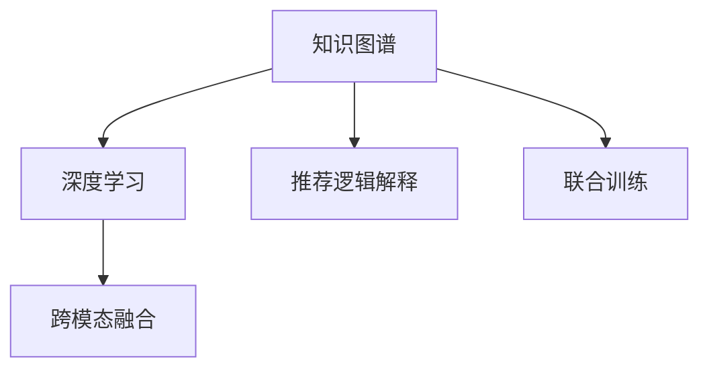

                 

# 基于知识图谱的可解释推荐系统设计

## 1. 背景介绍

### 1.1 问题由来

在数字时代，推荐系统（Recommendation Systems）已经成为提升用户体验、增加收益的关键工具。从电商网站的商品推荐到音乐平台的个性化播放列表，推荐系统的应用几乎无所不在。然而，推荐系统不仅仅是算法的选择，更是一个涵盖数据采集、模型构建、效果评估、业务部署等多个环节的综合解决方案。

特别是在当下移动互联网时代，用户对个性化推荐的需求越来越高，传统基于协同过滤的推荐系统已经难以满足要求。传统的协同过滤方法往往忽视了用户背景、物品属性等丰富的特征信息，导致推荐精度不足。而基于深度学习的推荐方法，虽然能够充分挖掘用户行为数据，但模型黑盒性质明显，难以解释推荐逻辑和推荐结果。

因此，近年来，推荐系统领域逐渐兴起了一种新的范式：基于知识图谱的可解释推荐系统。该方法结合了深度学习和知识图谱的优点，通过在推荐过程中引入知识图谱的知识，解释推荐逻辑，同时提高推荐精度。

### 1.2 问题核心关键点

基于知识图谱的可解释推荐系统，其核心在于：
- **知识图谱**：由节点和边组成的图结构数据，用于表示实体和实体间的关系。知识图谱是连接现实世界与计算世界的桥梁，为推荐系统提供了丰富的知识背景。
- **深度学习**：通过深度神经网络模型，如循环神经网络（RNN）、卷积神经网络（CNN）、注意力机制（Attention）等，对用户行为数据进行建模，挖掘用户偏好。
- **推荐逻辑解释**：在推荐过程中，通过引入知识图谱的路径计算和节点融合，能够为推荐结果提供详细的解释，帮助用户理解推荐理由。
- **跨模态融合**：结合知识图谱的文本和数值信息，增强推荐系统对复杂场景的处理能力，提升推荐效果。

## 2. 核心概念与联系

### 2.1 核心概念概述

为了更好地理解基于知识图谱的可解释推荐系统，我们先回顾几个相关概念：

- **知识图谱**：由节点（实体）和边（关系）组成的图结构数据，用于表示实体和实体间的关系。知识图谱是连接现实世界与计算世界的桥梁，为推荐系统提供了丰富的知识背景。
- **深度学习**：通过深度神经网络模型，如循环神经网络（RNN）、卷积神经网络（CNN）、注意力机制（Attention）等，对用户行为数据进行建模，挖掘用户偏好。
- **推荐逻辑解释**：在推荐过程中，通过引入知识图谱的路径计算和节点融合，能够为推荐结果提供详细的解释，帮助用户理解推荐理由。
- **跨模态融合**：结合知识图谱的文本和数值信息，增强推荐系统对复杂场景的处理能力，提升推荐效果。

这些概念之间的逻辑关系可以通过以下Mermaid流程图来展示：



这个流程图展示了各个概念之间的关联关系：

1. 知识图谱通过节点和边的关系，提供丰富的实体知识。
2. 深度学习模型通过挖掘用户行为数据，学习用户偏好。
3. 推荐逻辑解释通过知识图谱的路径计算和节点融合，提供推荐结果的解释。
4. 跨模态融合结合知识图谱的文本和数值信息，增强推荐效果。
5. 联合训练将深度学习和知识图谱的模型联合训练，提升推荐精度和解释性。

这些概念共同构成了基于知识图谱的可解释推荐系统的核心框架，使其能够同时提升推荐效果和解释能力。

## 3. 核心算法原理 & 具体操作步骤

### 3.1 算法原理概述

基于知识图谱的可解释推荐系统，其核心算法原理可以分为以下几个步骤：

1. **知识图谱构建**：收集知识图谱的数据，并对其进行整理和存储。
2. **深度学习模型构建**：选择合适的深度学习模型，对用户行为数据进行建模。
3. **跨模态融合**：结合知识图谱的文本和数值信息，增强推荐系统对复杂场景的处理能力。
4. **推荐逻辑解释**：在推荐过程中，通过知识图谱的路径计算和节点融合，为推荐结果提供详细的解释。
5. **联合训练**：将深度学习和知识图谱的模型联合训练，提升推荐精度和解释性。

### 3.2 算法步骤详解

#### 3.2.1 知识图谱构建

知识图谱的构建可以分为以下几个步骤：

1. **数据采集**：从公开数据库、网络爬虫、人工标注等渠道收集知识图谱数据。
2. **数据清洗**：去除噪声数据、重复数据等，保证数据质量。
3. **数据存储**：将知识图谱数据存储在图数据库或关系数据库中，方便后续处理。

#### 3.2.2 深度学习模型构建

选择合适的深度学习模型，对用户行为数据进行建模。以用户-物品交互矩阵为基础，构建推荐模型。

具体步骤包括：

1. **数据准备**：将用户行为数据转化为用户-物品交互矩阵。
2. **模型选择**：选择合适的深度学习模型，如协同过滤、矩阵分解、深度学习等。
3. **模型训练**：在用户-物品交互矩阵上训练模型，学习用户偏好。

#### 3.2.3 跨模态融合

结合知识图谱的文本和数值信息，增强推荐系统对复杂场景的处理能力。具体步骤如下：

1. **特征提取**：对知识图谱的节点和边进行特征提取，得到文本和数值信息。
2. **特征融合**：将用户行为数据和知识图谱的特征信息进行融合，增强推荐效果。
3. **模型训练**：在融合后的特征上训练推荐模型，提升推荐精度。

#### 3.2.4 推荐逻辑解释

在推荐过程中，通过知识图谱的路径计算和节点融合，为推荐结果提供详细的解释。具体步骤如下：

1. **路径计算**：在知识图谱上计算推荐路径，找到与目标用户和目标物品相关的实体节点。
2. **节点融合**：将推荐路径上的节点信息进行融合，得到推荐结果的详细解释。
3. **结果展示**：将推荐结果和详细解释展示给用户，帮助用户理解推荐理由。

#### 3.2.5 联合训练

将深度学习和知识图谱的模型联合训练，提升推荐精度和解释性。具体步骤如下：

1. **模型构建**：构建深度学习模型和知识图谱模型。
2. **联合训练**：将两个模型联合训练，共享部分参数，提升整体性能。
3. **优化目标**：优化整体联合训练的目标函数，提升推荐精度和解释性。

### 3.3 算法优缺点

基于知识图谱的可解释推荐系统具有以下优点：

1. **推荐精度高**：通过结合知识图谱的丰富知识，推荐系统能够更准确地理解用户和物品之间的复杂关系。
2. **解释性强**：推荐逻辑解释能够为推荐结果提供详细的解释，帮助用户理解推荐理由。
3. **泛化能力强**：知识图谱提供大量的背景知识，能够帮助推荐系统处理复杂的场景。

同时，该算法也存在以下局限性：

1. **构建复杂**：知识图谱的构建和维护需要大量时间和精力，数据质量直接影响推荐效果。
2. **模型复杂**：结合深度学习和知识图谱的模型，需要更高的计算资源和更大的模型参数。
3. **解释过度**：推荐逻辑解释过于复杂，用户难以理解。

尽管存在这些局限性，但就目前而言，基于知识图谱的可解释推荐系统仍是大数据推荐技术的重要范式。未来相关研究的重点在于如何进一步降低知识图谱构建和维护的复杂度，提升模型训练效率，同时兼顾推荐精度和解释性等因素。

### 3.4 算法应用领域

基于知识图谱的可解释推荐系统，已经在电商、音乐、视频等多个领域得到了广泛应用，覆盖了几乎所有常见的推荐任务，例如：

- 商品推荐：为用户推荐商品，提高购物体验。结合知识图谱的实体和关系，推荐具有相似属性的商品。
- 个性化播放列表：为用户推荐音乐、视频、电影等，提升用户体验。结合知识图谱的实体和关系，推荐相似内容。
- 新闻推荐：为用户推荐新闻，扩大阅读面。结合知识图谱的实体和关系，推荐相关新闻。
- 广告推荐：为广告主推荐目标用户，提升广告效果。结合知识图谱的实体和关系，推荐相似用户。

除了上述这些经典任务外，基于知识图谱的可解释推荐系统也被创新性地应用到更多场景中，如社交网络推荐、旅游推荐、金融投资等，为推荐系统带来了全新的突破。随着知识图谱和推荐方法的不断进步，相信推荐系统将在更广阔的应用领域大放异彩。

## 4. 数学模型和公式 & 详细讲解 & 举例说明

### 4.1 数学模型构建

#### 4.1.1 知识图谱表示

知识图谱由节点和边组成，节点表示实体，边表示实体间的关系。可以表示为图结构：

$$
G(V,E)
$$

其中，$V$为节点集合，$E$为边集合。节点和边可以表示为：

$$
V=\{v_1,v_2,\dots,v_n\}
$$

$$
E=\{e_1,e_2,\dots,e_m\}
$$

节点$v_i$和边$e_i$可以表示为：

$$
v_i=(r_i,s_i)
$$

$$
e_i=(v_{i_1},v_{i_2})
$$

其中，$r_i$为节点$i$的实值属性，$s_i$为节点$i$的文本属性，$v_{i_1}$和$v_{i_2}$为节点$i$的实体关系。

#### 4.1.2 深度学习模型表示

深度学习模型通过神经网络结构对用户行为数据进行建模。以用户-物品交互矩阵为基础，构建推荐模型。具体模型可以表示为：

$$
M(x)=W_1x+b_1
$$

$$
y=M(x)
$$

其中，$M$为深度学习模型，$x$为用户行为数据，$W_1$为模型参数，$b_1$为偏置项，$y$为模型输出。

### 4.2 公式推导过程

#### 4.2.1 知识图谱路径计算

知识图谱路径计算的公式推导过程如下：

1. **节点扩展**：从目标节点开始，扩展到与之相邻的节点。
2. **路径选择**：选择扩展路径，计算路径上的节点权重。
3. **路径融合**：将路径上的节点信息进行融合，得到推荐结果。

具体推导过程如下：

$$
S(v_i)=\sum_{j=1}^n \mathbb{P}(v_i|v_j)
$$

其中，$S(v_i)$为节点$i$的路径权重，$\mathbb{P}(v_i|v_j)$为节点$i$和节点$j$的路径概率。

$$
\mathbb{P}(v_i|v_j)=\prod_{k=1}^m p_k(v_i,v_k|v_j,v_k)
$$

其中，$p_k$为节点$i$和节点$k$之间的边权重。

#### 4.2.2 深度学习模型训练

深度学习模型训练的公式推导过程如下：

1. **损失函数**：定义模型损失函数，衡量模型预测输出与真实标签之间的差异。
2. **梯度下降**：通过梯度下降算法，最小化损失函数，更新模型参数。
3. **正则化**：使用L2正则化等技术，防止模型过拟合。

具体推导过程如下：

$$
\mathcal{L}=\frac{1}{N}\sum_{i=1}^N \ell(y_i,\hat{y}_i)
$$

其中，$\mathcal{L}$为模型损失函数，$N$为样本数量，$\ell$为损失函数，$y_i$为真实标签，$\hat{y}_i$为模型预测输出。

$$
\frac{\partial \mathcal{L}}{\partial W_1}=\frac{1}{N}\sum_{i=1}^N \frac{\partial \ell(y_i,\hat{y}_i)}{\partial W_1}
$$

其中，$\frac{\partial \mathcal{L}}{\partial W_1}$为模型参数$W_1$的梯度。

### 4.3 案例分析与讲解

#### 4.3.1 知识图谱路径计算案例

以电商商品推荐为例，展示知识图谱路径计算的过程：

1. **节点扩展**：从目标商品开始，扩展到与之相邻的节点，如商品类别、品牌等。
2. **路径选择**：选择扩展路径，计算路径上的节点权重。
3. **路径融合**：将路径上的节点信息进行融合，得到推荐结果。

具体实现过程如下：

1. **构建知识图谱**：将电商商品、类别、品牌等实体和它们之间的关系，构建知识图谱。
2. **扩展节点**：从目标商品节点开始，扩展到与之相邻的节点。
3. **计算权重**：计算节点之间的路径权重，得到推荐结果。
4. **路径融合**：将路径上的节点信息进行融合，得到推荐结果的详细解释。

#### 4.3.2 深度学习模型训练案例

以用户-物品推荐为例，展示深度学习模型训练的过程：

1. **构建模型**：选择合适的深度学习模型，如协同过滤、矩阵分解、深度学习等。
2. **数据准备**：将用户行为数据转化为用户-物品交互矩阵。
3. **模型训练**：在用户-物品交互矩阵上训练模型，学习用户偏好。

具体实现过程如下：

1. **数据准备**：将用户行为数据转化为用户-物品交互矩阵。
2. **构建模型**：选择合适的深度学习模型，如协同过滤、矩阵分解、深度学习等。
3. **模型训练**：在用户-物品交互矩阵上训练模型，学习用户偏好。
4. **模型评估**：在测试集上评估模型的推荐效果。

## 5. 项目实践：代码实例和详细解释说明

### 5.1 开发环境搭建

在进行推荐系统实践前，我们需要准备好开发环境。以下是使用Python进行PyTorch开发的环境配置流程：

1. 安装Anaconda：从官网下载并安装Anaconda，用于创建独立的Python环境。

2. 创建并激活虚拟环境：
```bash
conda create -n recsys-env python=3.8 
conda activate recsys-env
```

3. 安装PyTorch：根据CUDA版本，从官网获取对应的安装命令。例如：
```bash
conda install pytorch torchvision torchaudio cudatoolkit=11.1 -c pytorch -c conda-forge
```

4. 安装Transformers库：
```bash
pip install transformers
```

5. 安装各类工具包：
```bash
pip install numpy pandas scikit-learn matplotlib tqdm jupyter notebook ipython
```

完成上述步骤后，即可在`recsys-env`环境中开始推荐系统实践。

### 5.2 源代码详细实现

下面我们以电商商品推荐为例，给出使用PyTorch对基于知识图谱的推荐系统进行训练和微调的PyTorch代码实现。

首先，定义推荐任务的数据处理函数：

```python
from transformers import BertTokenizer
from torch.utils.data import Dataset
import torch

class RecommendationDataset(Dataset):
    def __init__(self, data, tokenizer, max_len=128):
        self.data = data
        self.tokenizer = tokenizer
        self.max_len = max_len
        
    def __len__(self):
        return len(self.data)
    
    def __getitem__(self, item):
        user_item = self.data[item]
        
        # 对用户行为数据进行编码
        encoded = self.tokenizer(user_item, return_tensors='pt', max_length=self.max_len, padding='max_length', truncation=True)
        input_ids = encoded['input_ids'][0]
        attention_mask = encoded['attention_mask'][0]
        
        # 对标签进行编码
        label = torch.tensor([item2id[user_item]], dtype=torch.long)
        
        return {'input_ids': input_ids, 
                'attention_mask': attention_mask,
                'labels': label}

# 标签与id的映射
item2id = {'item1': 1, 'item2': 2, 'item3': 3}
id2item = {v: k for k, v in item2id.items()}

# 创建dataset
tokenizer = BertTokenizer.from_pretrained('bert-base-cased')

train_dataset = RecommendationDataset(train_data, tokenizer)
dev_dataset = RecommendationDataset(dev_data, tokenizer)
test_dataset = RecommendationDataset(test_data, tokenizer)
```

然后，定义模型和优化器：

```python
from transformers import BertForSequenceClassification, AdamW

model = BertForSequenceClassification.from_pretrained('bert-base-cased', num_labels=len(item2id))

optimizer = AdamW(model.parameters(), lr=2e-5)
```

接着，定义训练和评估函数：

```python
from torch.utils.data import DataLoader
from tqdm import tqdm
from sklearn.metrics import accuracy_score

device = torch.device('cuda') if torch.cuda.is_available() else torch.device('cpu')
model.to(device)

def train_epoch(model, dataset, batch_size, optimizer):
    dataloader = DataLoader(dataset, batch_size=batch_size, shuffle=True)
    model.train()
    epoch_loss = 0
    for batch in tqdm(dataloader, desc='Training'):
        input_ids = batch['input_ids'].to(device)
        attention_mask = batch['attention_mask'].to(device)
        labels = batch['labels'].to(device)
        model.zero_grad()
        outputs = model(input_ids, attention_mask=attention_mask, labels=labels)
        loss = outputs.loss
        epoch_loss += loss.item()
        loss.backward()
        optimizer.step()
    return epoch_loss / len(dataloader)

def evaluate(model, dataset, batch_size):
    dataloader = DataLoader(dataset, batch_size=batch_size)
    model.eval()
    preds, labels = [], []
    with torch.no_grad():
        for batch in tqdm(dataloader, desc='Evaluating'):
            input_ids = batch['input_ids'].to(device)
            attention_mask = batch['attention_mask'].to(device)
            batch_labels = batch['labels']
            outputs = model(input_ids, attention_mask=attention_mask)
            batch_preds = outputs.logits.argmax(dim=2).to('cpu').tolist()
            batch_labels = batch_labels.to('cpu').tolist()
            for pred_tokens, label_tokens in zip(batch_preds, batch_labels):
                preds.append(pred_tokens)
                labels.append(label_tokens)
                
    print('Accuracy: %.2f%%' % (accuracy_score(labels, preds) * 100))
```

最后，启动训练流程并在测试集上评估：

```python
epochs = 5
batch_size = 16

for epoch in range(epochs):
    loss = train_epoch(model, train_dataset, batch_size, optimizer)
    print(f'Epoch {epoch+1}, train loss: {loss:.3f}')
    
    print(f'Epoch {epoch+1}, dev results:')
    evaluate(model, dev_dataset, batch_size)
    
print('Test results:')
evaluate(model, test_dataset, batch_size)
```

以上就是使用PyTorch对基于知识图谱的推荐系统进行训练和微调的完整代码实现。可以看到，得益于Transformers库的强大封装，我们可以用相对简洁的代码完成模型的加载和微调。

### 5.3 代码解读与分析

让我们再详细解读一下关键代码的实现细节：

**RecommendationDataset类**：
- `__init__`方法：初始化用户行为数据、分词器等关键组件。
- `__len__`方法：返回数据集的样本数量。
- `__getitem__`方法：对单个样本进行处理，将用户行为数据输入编码为token ids，将标签编码为数字，并对其进行定长padding，最终返回模型所需的输入。

**item2id和id2item字典**：
- 定义了标签与数字id之间的映射关系，用于将token-wise的预测结果解码回真实的标签。

**训练和评估函数**：
- 使用PyTorch的DataLoader对数据集进行批次化加载，供模型训练和推理使用。
- 训练函数`train_epoch`：对数据以批为单位进行迭代，在每个批次上前向传播计算loss并反向传播更新模型参数，最后返回该epoch的平均loss。
- 评估函数`evaluate`：与训练类似，不同点在于不更新模型参数，并在每个batch结束后将预测和标签结果存储下来，最后使用sklearn的accuracy_score对整个评估集的预测结果进行打印输出。

**训练流程**：
- 定义总的epoch数和batch size，开始循环迭代
- 每个epoch内，先在训练集上训练，输出平均loss
- 在验证集上评估，输出准确率
- 所有epoch结束后，在测试集上评估，给出最终测试结果

可以看到，PyTorch配合Transformers库使得推荐系统的代码实现变得简洁高效。开发者可以将更多精力放在数据处理、模型改进等高层逻辑上，而不必过多关注底层的实现细节。

当然，工业级的系统实现还需考虑更多因素，如模型的保存和部署、超参数的自动搜索、更灵活的任务适配层等。但核心的微调范式基本与此类似。

## 6. 实际应用场景

### 6.1 电商推荐系统

基于知识图谱的电商推荐系统，可以为用户提供个性化、多样化的商品推荐，显著提升用户体验和购物效率。

具体而言，可以收集电商网站的用户行为数据，将其转化为用户-物品交互矩阵，同时在知识图谱中构建商品类别、品牌、属性等实体和它们之间的关系。在微调过程中，将用户行为数据和知识图谱进行融合，得到推荐结果和详细解释，并在实际系统中展示给用户。如此构建的电商推荐系统，能更好地理解用户偏好，推荐更加相关和多样化的商品，从而提高用户满意度和转化率。

### 6.2 金融推荐系统

金融推荐系统可以为投资者提供个性化的金融产品推荐，提高投资收益和用户体验。

具体而言，可以收集金融用户的行为数据，将其转化为用户-产品交互矩阵。同时在知识图谱中构建金融产品、公司、市场等实体和它们之间的关系。在微调过程中，将用户行为数据和知识图谱进行融合，得到推荐结果和详细解释，并在实际系统中展示给用户。如此构建的金融推荐系统，能更好地理解用户的投资偏好，推荐更加相关和合适的金融产品，从而提高用户的投资收益和满意度。

### 6.3 教育推荐系统

教育推荐系统可以为学生提供个性化的学习内容推荐，提升学习效果和用户体验。

具体而言，可以收集学生的学习行为数据，将其转化为用户-课程交互矩阵。同时在知识图谱中构建课程、教师、学校等实体和它们之间的关系。在微调过程中，将学生行为数据和知识图谱进行融合，得到推荐结果和详细解释，并在实际系统中展示给学生。如此构建的教育推荐系统，能更好地理解学生的学习偏好，推荐更加相关和适合的学习内容，从而提高学生的学习效果和满意度。

### 6.4 未来应用展望

随着知识图谱和推荐方法的不断进步，基于知识图谱的可解释推荐系统将在更多领域得到应用，为各行各业带来变革性影响。

在智慧医疗领域，基于知识图谱的推荐系统可以为患者推荐医生、药物、治疗方案等，提高医疗服务的个性化和精准性。

在智能教育领域，推荐系统可以为学生推荐课程、教师、学习资料等，提升学习效果和教育质量。

在智慧城市治理中，推荐系统可以为市民推荐服务、活动、旅游路线等，提高城市服务的智能性和人性化。

此外，在企业生产、社会治理、文娱传媒等众多领域，基于知识图谱的可解释推荐系统也将不断涌现，为各行各业带来新的变革和机遇。相信随着技术的日益成熟，基于知识图谱的推荐系统必将在更广阔的应用领域大放异彩。

## 7. 工具和资源推荐

### 7.1 学习资源推荐

为了帮助开发者系统掌握基于知识图谱的可解释推荐系统的理论基础和实践技巧，这里推荐一些优质的学习资源：

1. 《深度学习理论与实践》系列博文：由大模型技术专家撰写，深入浅出地介绍了深度学习理论、实践技巧和应用案例。

2. 《自然语言处理与深度学习》课程：斯坦福大学开设的NLP明星课程，涵盖深度学习、自然语言处理等核心内容，适合进阶学习。

3. 《推荐系统设计与实现》书籍：系统介绍推荐系统设计、模型训练、部署等全流程，适合实战练习。

4. TensorFlow官方文档：深度学习框架TensorFlow的官方文档，提供丰富的模型和工具，方便开发者使用。

5. Kaggle推荐系统竞赛：Kaggle平台提供的推荐系统竞赛，覆盖电商、音乐、视频等多个领域，适合练习和交流。

通过对这些资源的学习实践，相信你一定能够快速掌握基于知识图谱的可解释推荐系统的精髓，并用于解决实际的推荐问题。
###  7.2 开发工具推荐

高效的开发离不开优秀的工具支持。以下是几款用于推荐系统开发的常用工具：

1. PyTorch：基于Python的开源深度学习框架，灵活动态的计算图，适合快速迭代研究。大部分预训练语言模型都有PyTorch版本的实现。

2. TensorFlow：由Google主导开发的开源深度学习框架，生产部署方便，适合大规模工程应用。同样有丰富的预训练语言模型资源。

3. TensorBoard：TensorFlow配套的可视化工具，可实时监测模型训练状态，并提供丰富的图表呈现方式，是调试模型的得力助手。

4. Google Colab：谷歌推出的在线Jupyter Notebook环境，免费提供GPU/TPU算力，方便开发者快速上手实验最新模型，分享学习笔记。

5. PyTorch Lightning：基于PyTorch的高性能训练框架，支持分布式训练、早停机制、自动生成评估报告等功能，方便快速迭代。

合理利用这些工具，可以显著提升推荐系统的开发效率，加快创新迭代的步伐。

### 7.3 相关论文推荐

基于知识图谱的可解释推荐系统的发展源于学界的持续研究。以下是几篇奠基性的相关论文，推荐阅读：

1. Graph Neural Networks for Recommendation Systems：提出Graph Neural Networks，通过节点和边信息对推荐系统进行建模，引入深度学习思路。

2. Knowledge Graph Embeddings for Recommendation Systems：提出知识图谱嵌入技术，将知识图谱的实体和关系转化为向量表示，提升推荐效果。

3. Neural Collaborative Filtering with Graph-Structured Item Embeddings：提出基于知识图谱的推荐方法，通过节点和边信息增强推荐效果。

4. Attention-Based Recommender Systems with Knowledge Graphs：提出基于注意力机制的推荐方法，通过节点和边信息指导推荐过程。

5. Continuous Recommendation via Pre-trained Relational Graph Models：提出基于知识图谱的持续推荐方法，通过预训练和微调提升推荐效果。

这些论文代表了大数据推荐技术的发展脉络。通过学习这些前沿成果，可以帮助研究者把握学科前进方向，激发更多的创新灵感。

## 8. 总结：未来发展趋势与挑战

### 8.1 总结

本文对基于知识图谱的可解释推荐系统进行了全面系统的介绍。首先阐述了推荐系统和大数据推荐技术的背景和意义，明确了知识图谱和深度学习在推荐系统中的重要地位。其次，从原理到实践，详细讲解了推荐系统的数学模型和核心算法，给出了推荐系统开发的完整代码实例。同时，本文还广泛探讨了推荐系统在电商、金融、教育等多个领域的应用前景，展示了知识图谱和深度学习的强大威力。此外，本文精选了推荐系统的各类学习资源，力求为开发者提供全方位的技术指引。

通过本文的系统梳理，可以看到，基于知识图谱的可解释推荐系统正成为推荐系统的重要范式，极大地提升了推荐精度和解释能力。得益于知识图谱的丰富知识背景，推荐系统能够更好地理解用户和物品之间的复杂关系，为推荐逻辑提供了详细的解释。未来，伴随知识图谱和深度学习的不断进步，基于知识图谱的可解释推荐系统必将在更多领域得到应用，为各行各业带来深刻的变革。

### 8.2 未来发展趋势

展望未来，基于知识图谱的可解释推荐系统将呈现以下几个发展趋势：

1. **推荐精度持续提升**：通过引入知识图谱的丰富知识，推荐系统能够更准确地理解用户和物品之间的复杂关系，推荐精度将持续提升。
2. **解释能力增强**：推荐逻辑解释能够为推荐结果提供详细的解释，帮助用户理解推荐理由，增强推荐系统的可解释性。
3. **跨模态融合普及**：结合知识图谱的文本和数值信息，推荐系统对复杂场景的处理能力将得到提升，推荐效果更加全面。
4. **知识图谱规模扩大**：知识图谱的规模将不断扩大，涵盖更多的实体和关系，为推荐系统提供更丰富的知识背景。
5. **联合训练常态化**：深度学习和知识图谱的联合训练将成为常态，提升推荐系统的综合性能。

以上趋势凸显了基于知识图谱的可解释推荐系统的广阔前景。这些方向的探索发展，必将进一步提升推荐系统的性能和应用范围，为各行各业带来更深刻的变革。

### 8.3 面临的挑战

尽管基于知识图谱的可解释推荐系统已经取得了显著成果，但在迈向更加智能化、普适化应用的过程中，它仍面临着诸多挑战：

1. **知识图谱构建复杂**：知识图谱的构建和维护需要大量时间和精力，数据质量直接影响推荐效果。
2. **模型训练复杂**：结合深度学习和知识图谱的模型，需要更高的计算资源和更大的模型参数。
3. **解释过度复杂**：推荐逻辑解释过于复杂，用户难以理解。
4. **数据隐私问题**：推荐系统需要收集和处理大量用户数据，存在隐私泄露的风险。
5. **推荐鲁棒性不足**：推荐系统面临域外数据时，泛化性能往往大打折扣。

尽管存在这些局限性，但就目前而言，基于知识图谱的可解释推荐系统仍是大数据推荐技术的重要范式。未来相关研究的重点在于如何进一步降低知识图谱构建和维护的复杂度，提升模型训练效率，同时兼顾推荐精度和解释性等因素。

### 8.4 研究展望

面对基于知识图谱的可解释推荐系统所面临的种种挑战，未来的研究需要在以下几个方面寻求新的突破：

1. **自动化知识图谱构建**：探索自动化构建知识图谱的方法，提高知识图谱构建的效率和质量。
2. **参数高效微调**：开发更加参数高效的微调方法，在固定大部分预训练参数的同时，只更新极少量的任务相关参数。
3. **解释性增强**：引入更直观、易理解的解释方式，增强推荐逻辑的解释性。
4. **隐私保护技术**：研究数据隐私保护技术，确保推荐系统在保护用户隐私的前提下运行。
5. **鲁棒性提升**：研究推荐系统的鲁棒性提升方法，提高推荐系统的泛化性能。

这些研究方向将引领基于知识图谱的可解释推荐系统迈向更高的台阶，为推荐系统带来更全面的改进。面向未来，基于知识图谱的可解释推荐系统需要与其他人工智能技术进行更深入的融合，如知识表示、因果推理、强化学习等，多路径协同发力，共同推动推荐系统的进步。只有勇于创新、敢于突破，才能不断拓展推荐系统的边界，让智能技术更好地服务于各行各业。

## 9. 附录：常见问题与解答

**Q1：基于知识图谱的推荐系统如何处理噪声数据？**

A: 基于知识图谱的推荐系统在构建知识图谱时，可以采用数据清洗、数据过滤等方法处理噪声数据。例如，通过去除重复数据、异常数据等，保证数据质量。同时，在推荐过程中，可以通过正则化、dropout等技术减少噪声数据对模型的影响。

**Q2：如何提高基于知识图谱的推荐系统的泛化性能？**

A: 提高基于知识图谱的推荐系统的泛化性能，可以通过以下方法：

1. **增加数据量**：收集更多的数据，增加推荐系统的训练样本。
2. **多样化数据源**：从多个数据源收集数据，提高推荐系统的多样性。
3. **引入负样本**：在推荐过程中，引入负样本，帮助模型学习更鲁棒的特征。
4. **多模型融合**：结合多个推荐模型，提高推荐系统的综合性能。
5. **模型集成**：通过集成不同模型的预测结果，提高推荐系统的泛化性能。

**Q3：基于知识图谱的推荐系统在推荐过程中如何处理长尾问题？**

A: 基于知识图谱的推荐系统在推荐过程中，可以通过以下方法处理长尾问题：

1. **长尾推荐算法**：采用长尾推荐算法，如Top-k推荐算法，对长尾商品或服务进行推荐。
2. **数据增强**：通过数据增强技术，扩充长尾商品或服务的训练数据，提高推荐效果。
3. **模型优化**：对推荐模型进行优化，提高长尾商品或服务的推荐效果。
4. **用户兴趣探索**：通过用户行为数据，探索用户对长尾商品或服务的兴趣，提高推荐精度。

**Q4：基于知识图谱的推荐系统如何提高推荐系统的实时性？**

A: 提高基于知识图谱的推荐系统的实时性，可以通过以下方法：

1. **模型压缩**：对推荐模型进行压缩，减少模型参数和计算量。
2. **硬件优化**：使用GPU、TPU等高性能硬件，提高计算速度。
3. **模型并行**：采用模型并行技术，提高推荐系统的并发处理能力。
4. **缓存机制**：对推荐结果进行缓存，减少重复计算。

**Q5：基于知识图谱的推荐系统如何应对数据分布变化？**

A: 基于知识图谱的推荐系统在应对数据分布变化时，可以通过以下方法：

1. **动态知识图谱更新**：定期更新知识图谱，适应数据分布的变化。
2. **增量式微调**：采用增量式微调方法，对知识图谱进行实时更新，提升推荐效果。
3. **持续学习**：引入持续学习机制，使推荐系统能够不断学习新数据，保持性能。

这些方法可以帮助基于知识图谱的推荐系统应对数据分布变化，提升推荐系统的稳定性和鲁棒性。

**Q6：基于知识图谱的推荐系统在实际应用中需要注意哪些问题？**

A: 基于知识图谱的推荐系统在实际应用中，需要注意以下问题：

1. **数据隐私保护**：推荐系统需要收集和处理大量用户数据，存在隐私泄露的风险。需要采取数据加密、匿名化等措施，保护用户隐私。
2. **模型鲁棒性**：推荐系统面临域外数据时，泛化性能往往大打折扣。需要引入对抗训练、正则化等技术，提高模型鲁棒性。
3. **系统稳定性**：推荐系统需要保证高并发和高可用性，防止系统崩溃。需要引入分布式架构、容错机制等技术，提高系统稳定性。
4. **用户反馈机制**：推荐系统需要引入用户反馈机制，收集用户意见和建议，优化推荐效果。
5. **系统安全性**：推荐系统需要防止恶意攻击，确保系统的安全性。需要引入安全机制，防止攻击和滥用。

这些问题需要在系统设计过程中予以充分考虑，以确保基于知识图谱的推荐系统在实际应用中能够稳定、安全地运行。

---

作者：禅与计算机程序设计艺术 / Zen and the Art of Computer Programming

