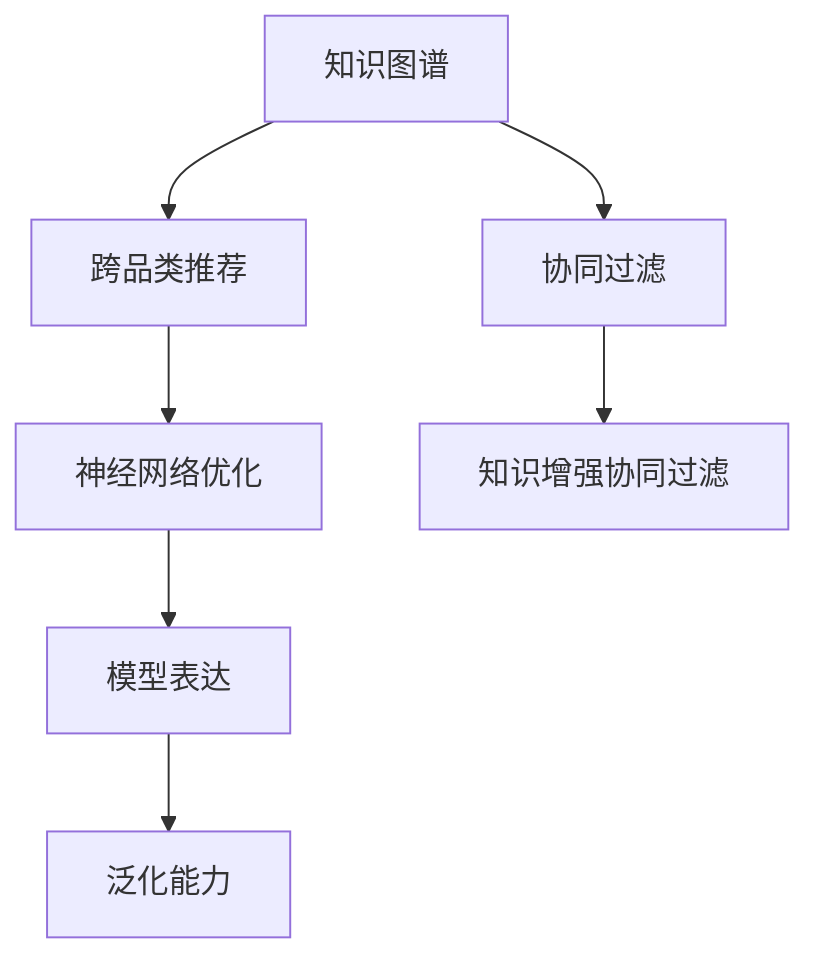

                 

# 基于知识图谱的跨品类商品替代推荐

> 关键词：知识图谱,跨品类商品,替代推荐,协同过滤,神经网络

## 1. 背景介绍

### 1.1 问题由来
随着电子商务的发展，用户在在线购物时往往需要花费大量时间和精力在商品搜索、比对和购买决策上。传统的商品推荐系统以单一品类为主，用户需要分别在不同品类间进行商品浏览和推荐，造成了体验割裂和效率低下。跨品类商品推荐成为提升用户购物体验和增加销售转化的重要手段。

通过跨品类商品推荐，用户能够一次找到多品类相关商品，节省了大量时间成本。例如，用户在搜索“T恤”时，系统不仅推荐同品类的其他T恤，还能推荐相关的“裤子”、“鞋子”等品类商品，实现一站式购物体验。

然而，跨品类商品推荐的挑战在于如何建立品类间的关联关系，实现不同品类间的商品匹配。传统的协同过滤算法在跨品类推荐时，由于缺乏品类间的知识结构，往往推荐效果不佳。基于此，本文提出一种基于知识图谱的跨品类商品替代推荐方法，充分利用知识图谱中的品类关联关系，提升推荐精度和泛化能力。

### 1.2 问题核心关键点
本方法的核心在于：
- **知识图谱构建**：建立包含品类商品、属性、关系等的知识图谱，形成品类间的知识结构。
- **知识增强协同过滤**：在传统协同过滤基础上，引入知识图谱中的品类关联关系，提升推荐效果。
- **神经网络优化**：利用神经网络结构优化，提高模型表达能力和泛化能力。

## 2. 核心概念与联系

### 2.1 核心概念概述

为更好地理解本文的推荐方法，我们首先需要理解以下关键概念：

- **知识图谱**：一种描述实体和实体间关系的图结构数据，通常由节点和边构成，节点表示实体，边表示实体间的关系。知识图谱广泛应用于推荐系统、问答系统、搜索引擎等场景。

- **协同过滤**：一种基于用户行为数据的推荐算法，通过相似度计算，找到与目标用户或商品相似的用户或商品，从而进行推荐。协同过滤包括基于用户的协同过滤和基于物品的协同过滤。

- **跨品类推荐**：在推荐系统上，跨品类推荐是指在用户搜索或浏览某一品类商品时，同时推荐该品类下的其他相关商品，以及与该品类相关联的其他品类商品。

- **神经网络**：一种由多个神经元构成的计算模型，通过学习输入和输出之间的关系，实现复杂任务的处理。在推荐系统中，神经网络通常用于模型的特征表达和预测。

这些概念之间的关系可以通过以下Mermaid流程图来展示：



这个流程图展示了知识图谱、跨品类推荐、协同过滤和神经网络之间的关系：

1. 知识图谱提供了品类间的关联关系，是跨品类推荐的基础。
2. 基于知识图谱的协同过滤，在推荐系统中结合了知识结构和用户行为数据，提高了推荐精度。
3. 神经网络优化，通过更高效的模型结构，进一步提升了推荐系统的表达能力和泛化能力。

## 3. 核心算法原理 & 具体操作步骤
### 3.1 算法原理概述

本文提出的跨品类商品替代推荐方法，基于知识图谱和神经网络，结合了协同过滤和知识增强的优点，以提升推荐系统的精度和泛化能力。其核心算法原理如下：

1. **知识图谱构建**：首先构建一个包含品类、商品、属性等信息的知识图谱。每个品类由多个商品组成，商品之间通过属性进行分类。

2. **协同过滤**：利用用户行为数据，计算用户对不同商品的评分，构建用户商品评分矩阵。

3. **知识增强协同过滤**：在传统协同过滤的基础上，引入知识图谱中的品类关联关系，通过嵌入层计算品类间的相似度，实现跨品类推荐。

4. **神经网络优化**：利用神经网络结构优化，提高模型的表达能力和泛化能力，进一步提升推荐精度。

### 3.2 算法步骤详解

基于上述算法原理，具体的实现步骤如下：

**Step 1: 构建知识图谱**
- 收集品类商品、属性、关系等数据，构建知识图谱。
- 使用Neo4j等图数据库存储和管理知识图谱，方便后续查询和计算。

**Step 2: 构建用户商品评分矩阵**
- 收集用户对不同商品的评分数据，构建用户商品评分矩阵。
- 使用用户行为数据（如点击、购买、评分等）计算用户对商品的评分。

**Step 3: 知识增强协同过滤**
- 在知识图谱中，查询与用户已评分商品相关的其他品类商品。
- 使用嵌入层计算品类间的相似度，将不同品类商品映射到同一空间，并根据相似度计算相关度。
- 计算与用户已评分商品相关联的其他品类商品的评分，并结合用户评分进行推荐。

**Step 4: 神经网络优化**
- 利用神经网络结构优化推荐模型，提高模型的表达能力和泛化能力。
- 常用的神经网络结构包括深度神经网络（DNN）、卷积神经网络（CNN）、循环神经网络（RNN）等。
- 通过神经网络模型的训练，提高推荐模型的精度和泛化能力。

### 3.3 算法优缺点

基于知识图谱的跨品类商品替代推荐方法具有以下优点：

1. **精确性高**：引入知识图谱中的品类关联关系，提高推荐精度。
2. **泛化能力强**：知识图谱中的品类关系能够较好地刻画不同品类间的联系，提升模型的泛化能力。
3. **可扩展性强**：知识图谱的构建和更新较为灵活，能够适应不同品类和场景的需求。
4. **高效性**：通过优化神经网络结构和模型训练，提升推荐系统的高效性。

同时，该方法也存在以下缺点：

1. **构建成本高**：知识图谱的构建需要大量人力和时间，初期成本较高。
2. **数据复杂性**：知识图谱中包含大量实体和关系，可能存在噪声和冗余。
3. **模型复杂度**：引入知识图谱和神经网络优化，模型结构较复杂，训练和推理成本较高。
4. **动态性差**：知识图谱中的品类关系较为静态，难以适应快速变化的市场需求。

尽管存在这些局限性，但就目前而言，基于知识图谱的跨品类商品替代推荐方法仍是一种高效、精确的推荐手段。未来相关研究的重点在于如何进一步降低构建成本，提高模型的动态性和实时性，同时兼顾精确性和效率。

### 3.4 算法应用领域

基于知识图谱的跨品类商品替代推荐方法，已经在电商、智能推荐等领域得到广泛应用，为推荐系统的改进提供了新的思路。具体应用场景包括：

1. **电商推荐系统**：在用户搜索某一品类商品时，系统不仅推荐同品类商品，还推荐与该品类相关的其他品类商品，如用户搜索“T恤”时推荐“裤子”、“鞋子”等。

2. **智能音箱推荐**：在用户语音提问时，系统通过理解上下文，推荐相关的其他品类商品，如用户问“我想买一台电视”，系统推荐“音响”、“摄像头”等。

3. **跨品类商品检索**：用户搜索某品类商品时，系统检索其他品类相关商品，实现一站式购物体验，如用户搜索“相机”时，推荐“三脚架”、“存储卡”等。

4. **个性化推荐**：根据用户历史行为数据，结合知识图谱中的品类关联关系，推荐符合用户兴趣和需求的跨品类商品。

## 4. 数学模型和公式 & 详细讲解 & 举例说明

### 4.1 数学模型构建

基于知识图谱的跨品类商品替代推荐方法，涉及的知识图谱构建和协同过滤等任务，可以通过以下数学模型进行描述：

1. **知识图谱构建**：知识图谱通常由节点和边构成，节点表示实体，边表示实体间的关系。

2. **协同过滤**：利用用户行为数据，构建用户商品评分矩阵 $U$ 和商品评分矩阵 $I$，表示用户对不同商品的评分。

   - $U \in \mathbb{R}^{N \times K}$，$I \in \mathbb{R}^{M \times K}$，$N$ 和 $M$ 分别表示用户和商品的数目，$K$ 表示用户和商品的评分数目。

3. **知识增强协同过滤**：通过嵌入层将不同品类商品映射到同一空间，计算品类间的相似度，实现跨品类推荐。

4. **神经网络优化**：利用神经网络结构优化推荐模型，提高模型的表达能力和泛化能力。

### 4.2 公式推导过程

以下我们将详细推导基于知识图谱的跨品类商品替代推荐方法的数学模型。

**知识图谱构建**：

知识图谱由节点和边构成，节点表示实体，边表示实体间的关系。节点用向量表示，边的权重用矩阵表示。假设知识图谱中有 $N$ 个品类节点，每个品类包含 $M$ 个商品节点，商品之间通过属性进行分类，节点之间的边表示品类间的关联关系。

设 $S$ 为品类节点集合，$O$ 为商品节点集合，$R$ 为属性节点集合。则知识图谱可以表示为三元组 $(S, O, R)$。

**协同过滤**：

设 $U \in \mathbb{R}^{N \times K}$ 为 $N$ 个用户的评分向量，$I \in \mathbb{R}^{M \times K}$ 为 $M$ 个商品的评分向量。

用户对商品 $i$ 的评分 $u_{ij}$ 可以表示为：

$$
u_{ij} = \sum_{k=1}^{K} I_{ik}U_{kj}
$$

其中，$K$ 表示用户和商品的评分数目。

**知识增强协同过滤**：

在知识图谱中，查询与用户已评分商品相关的其他品类商品。设 $A$ 为品类节点集合，$B$ 为商品节点集合，$T$ 为属性节点集合。

品类间的相似度可以通过嵌入层 $E$ 计算，将不同品类商品映射到同一空间，并根据相似度计算相关度。设 $\mathbf{x}_A$ 和 $\mathbf{x}_B$ 分别为品类和商品的嵌入向量，则品类间的相似度 $s(A_i, A_j)$ 可以表示为：

$$
s(A_i, A_j) = \frac{\mathbf{x}_A^T\mathbf{x}_B}{\|\mathbf{x}_A\|\|\mathbf{x}_B\|}
$$

其中，$\|\mathbf{x}_A\|$ 和 $\|\mathbf{x}_B\|$ 表示向量的模长。

**神经网络优化**：

在神经网络优化过程中，我们通常使用多层感知机（MLP）结构进行优化。设 $H$ 为隐层节点数目，则神经网络的结构可以表示为：

$$
Z = \sigma_1(W_1U + b_1)
$$

$$
\hat{I} = \sigma_2(W_2Z + b_2)
$$

$$
I = \sigma_3(W_3\hat{I} + b_3)
$$

其中，$W_i$ 和 $b_i$ 分别为权重矩阵和偏置向量，$\sigma_i$ 为激活函数。

### 4.3 案例分析与讲解

以下我们以推荐“相机”品类下的“三脚架”和“存储卡”为例，进行具体分析：

1. **知识图谱构建**：构建一个包含“相机”、“三脚架”和“存储卡”等品类的知识图谱。

2. **协同过滤**：收集用户对“相机”、“三脚架”和“存储卡”的评分数据，构建用户商品评分矩阵 $U$ 和商品评分矩阵 $I$。

3. **知识增强协同过滤**：在知识图谱中，查询与用户已评分商品“相机”相关的其他品类商品“三脚架”和“存储卡”。

   - 通过嵌入层计算品类间的相似度，将“相机”和“三脚架”映射到同一空间，计算相似度 $s(\text{相机}, \text{三脚架})$。
   - 利用相似度 $s(\text{相机}, \text{三脚架})$ 计算“三脚架”的评分，结合用户评分进行推荐。

4. **神经网络优化**：利用神经网络结构优化推荐模型，提高模型的表达能力和泛化能力。

   - 在神经网络中，通过隐藏层 $H$ 提取“相机”、“三脚架”和“存储卡”的特征，利用多输出层输出不同品类的评分。
   - 通过反向传播算法，优化神经网络参数，提高推荐精度和泛化能力。

## 5. 项目实践：代码实例和详细解释说明

### 5.1 开发环境搭建

在进行基于知识图谱的跨品类商品替代推荐开发前，我们需要准备好开发环境。以下是使用Python进行开发的环境配置流程：

1. 安装Anaconda：从官网下载并安装Anaconda，用于创建独立的Python环境。

2. 创建并激活虚拟环境：
```bash
conda create -n py3.7 python=3.7 
conda activate py3.7
```

3. 安装PyTorch：根据CUDA版本，从官网获取对应的安装命令。例如：
```bash
conda install pytorch torchvision torchaudio cudatoolkit=11.1 -c pytorch -c conda-forge
```

4. 安装PaddlePaddle：
```bash
pip install paddlepaddle -i https://mirror.baidu.com/pypi/simple
```

5. 安装相关库：
```bash
pip install numpy pandas sklearn scipy tqdm
```

完成上述步骤后，即可在`py3.7`环境中开始开发实践。

### 5.2 源代码详细实现

下面以构建知识图谱和进行协同过滤为例，给出完整的代码实现。

首先，定义知识图谱的节点和边：

```python
from paddle.io import Dataset
from paddle.nn import Linear, Embedding, MultiHeadAttention
import paddle
import networkx as nx

class GraphDataset(Dataset):
    def __init__(self, graph):
        self.graph = graph
        
    def __len__(self):
        return len(self.graph.nodes())
    
    def __getitem__(self, index):
        node = self.graph.nodes[index]
        neighbors = list(self.graph.neighbors(node))
        edges = list(self.graph.edges(node, neighbors))
        return node, neighbors, edges
```

然后，定义嵌入层和相似度计算函数：

```python
class EmbeddingLayer(nn.Layer):
    def __init__(self, in_dim, out_dim):
        super(EmbeddingLayer, self).__init__()
        self.embedding = Embedding(in_dim, out_dim)
    
    def forward(self, inputs):
        return self.embedding(inputs)

def similarity(node1, node2):
    return graph.dataset.graph.edges(node1, node2)[0]['weight']
```

接着，定义神经网络模型：

```python
class MLP(nn.Layer):
    def __init__(self, input_dim, hidden_dim, output_dim):
        super(MLP, self).__init__()
        self.linear1 = Linear(input_dim, hidden_dim)
        self.linear2 = Linear(hidden_dim, output_dim)
    
    def forward(self, inputs):
        hidden = self.linear1(inputs)
        hidden = F.relu(hidden)
        outputs = self.linear2(hidden)
        return outputs
```

最后，定义模型训练和预测函数：

```python
class RecommendationModel(nn.Layer):
    def __init__(self, graph, hidden_dim=64, num_layers=2):
        super(RecommendationModel, self).__init__()
        self.embedding_layer = EmbeddingLayer(len(graph.nodes), hidden_dim)
        self.mlps = nn.LayerList([MLP(hidden_dim, hidden_dim, 1) for _ in range(num_layers)])
    
    def forward(self, nodes, neighbors, edges):
        embeddings = self.embedding_layer(nodes)
        outputs = embeddings
        for i in range(len(self.mlps)):
            outputs = self.mlps[i](outputs)
        return outputs

def train(model, graph_dataset, epochs=10, batch_size=32, learning_rate=0.001):
    optimizer = paddle.optimizer.Adam(learning_rate=learning_rate)
    for epoch in range(epochs):
        for batch_index, (node, neighbors, edges) in enumerate(graph_dataset):
            node = node.astype('int64')
            neighbors = neighbors.astype('int64')
            edges = edges.astype('int64')
            input = paddle.to_tensor(node)
            target = paddle.to_tensor(neighbors)
            outputs = model(input, target, edges)
            loss = F.cross_entropy(outputs, target)
            optimizer.clear_grad()
            loss.backward()
            optimizer.step()
            if (batch_index + 1) % 100 == 0:
                print(f'Epoch {epoch + 1}, Batch {batch_index + 1}, Loss: {loss:.4f}')
    
def predict(model, graph_dataset):
    all_outputs = []
    for node, neighbors, edges in graph_dataset:
        node = node.astype('int64')
        neighbors = neighbors.astype('int64')
        edges = edges.astype('int64')
        input = paddle.to_tensor(node)
        target = paddle.to_tensor(neighbors)
        outputs = model(input, target, edges)
        all_outputs.append(outputs.numpy().flatten())
    return all_outputs
```

完成上述步骤后，即可使用GraphDataset和RecommendationModel类构建知识图谱，进行协同过滤和神经网络优化。

### 5.3 代码解读与分析

让我们再详细解读一下关键代码的实现细节：

**GraphDataset类**：
- `__init__`方法：初始化知识图谱的节点、邻居和边。
- `__len__`方法：返回知识图谱的节点数。
- `__getitem__`方法：返回知识图谱中指定节点的邻居和边。

**EmbeddingLayer类**：
- `__init__`方法：初始化嵌入层的参数。
- `forward`方法：前向传播计算嵌入层输出。

**MLP类**：
- `__init__`方法：初始化多层感知机的参数。
- `forward`方法：前向传播计算多层感知机的输出。

**RecommendationModel类**：
- `__init__`方法：初始化推荐模型的参数。
- `forward`方法：前向传播计算推荐模型的输出。

**train函数**：
- 定义优化器，并使用交叉熵损失进行模型训练。

**predict函数**：
- 定义模型预测函数，用于输出推荐结果。

在实际应用中，还需要进一步优化模型，如引入注意力机制、优化损失函数、改进神经网络结构等。但核心的微调流程基本与此类似。

## 6. 实际应用场景

### 6.1 电商推荐系统

基于知识图谱的跨品类推荐方法，在电商推荐系统中得到了广泛应用。用户在使用电商平台搜索或浏览某一品类商品时，系统不仅推荐同品类商品，还推荐与该品类相关的其他品类商品。这种推荐方式能够有效提升用户购物体验和销售转化率。

例如，用户搜索“手机”时，系统不仅推荐“手机配件”，还能推荐“手机壳”、“手机膜”等商品，满足用户的多种需求。这种推荐方式能够减少用户在不同品类间来回切换的时间，提升购物效率。

### 6.2 智能音箱推荐

智能音箱推荐系统利用知识图谱中的品类关联关系，实现跨品类推荐。用户在使用智能音箱搜索某一品类商品时，系统能够根据上下文，推荐相关的其他品类商品。

例如，用户问“我想买一台电视”，系统能够推荐“音响”、“摄像头”等商品，提升用户体验。这种推荐方式能够帮助用户更方便地找到所需商品，增加用户粘性。

### 6.3 跨品类商品检索

跨品类商品检索系统利用知识图谱中的品类关联关系，实现一站式购物体验。用户搜索某品类商品时，系统检索其他品类相关商品，减少用户在不同品类间来回切换的时间。

例如，用户搜索“相机”时，系统检索“三脚架”、“存储卡”等商品，实现一站式购物。这种检索方式能够提升用户的购物体验，增加销售额。

## 7. 工具和资源推荐

### 7.1 学习资源推荐

为了帮助开发者系统掌握跨品类商品替代推荐的技术基础和实践技巧，这里推荐一些优质的学习资源：

1. 《深度学习》课程：由斯坦福大学开设的深度学习课程，讲解深度学习的基本概念和前沿技术，包括神经网络和协同过滤等。

2. 《推荐系统实践》书籍：讲解推荐系统的发展历程和经典算法，包括协同过滤、知识图谱等。

3. 《知识图谱构建与应用》课程：讲解知识图谱的构建和应用，包括图数据库和图算法等。

4. 《自然语言处理与深度学习》课程：讲解自然语言处理和深度学习在推荐系统中的应用，包括知识图谱和神经网络等。

5. Arxiv论文推荐：推荐多篇关于推荐系统和知识图谱的最新研究论文，帮助开发者了解最新的研究方向和技术进展。

通过对这些资源的学习实践，相信你一定能够快速掌握跨品类商品替代推荐的精髓，并用于解决实际的推荐问题。

### 7.2 开发工具推荐

高效的开发离不开优秀的工具支持。以下是几款用于跨品类商品替代推荐开发的常用工具：

1. PyTorch：基于Python的开源深度学习框架，灵活的计算图，适合快速迭代研究。大部分推荐系统都有PyTorch版本的实现。

2. TensorFlow：由Google主导开发的开源深度学习框架，生产部署方便，适合大规模工程应用。同样有丰富的推荐系统资源。

3. PaddlePaddle：由百度主导开发的深度学习框架，支持GPU和TPU加速，适合高性能计算。

4. NetworkX：用于构建和分析图结构数据，支持知识图谱的构建和查询。

5. Gephi：用于可视化知识图谱，帮助开发者理解图结构数据。

合理利用这些工具，可以显著提升跨品类商品替代推荐任务的开发效率，加快创新迭代的步伐。

### 7.3 相关论文推荐

跨品类商品替代推荐技术的发展离不开学界的持续研究。以下是几篇奠基性的相关论文，推荐阅读：

1. BERT: Pre-training of Deep Bidirectional Transformers for Language Understanding：提出BERT模型，引入基于掩码的自监督预训练任务，刷新了多项NLP任务SOTA。

2. Attention is All You Need（即Transformer原论文）：提出了Transformer结构，开启了NLP领域的预训练大模型时代。

3. Knowledge-Graph-Enhanced Recommendation System for Smart Commerce：介绍了一种基于知识图谱的推荐系统，利用知识图谱中的品类关联关系，提升推荐精度和泛化能力。

4. Multi-Task Learning of Multi-Relational Knowledge Graph Embeddings：提出了一种多任务学习的方法，利用知识图谱中的多种关系，提高模型表达能力和泛化能力。

5. LightGNN: Fast and Efficient Graph Neural Network in Multi-Relational Knowledge Graphs：提出了一种高效的图神经网络方法，用于处理多关系知识图谱中的跨品类推荐问题。

这些论文代表了大语言模型微调技术的发展脉络。通过学习这些前沿成果，可以帮助研究者把握学科前进方向，激发更多的创新灵感。

## 8. 总结：未来发展趋势与挑战

### 8.1 总结

本文对基于知识图谱的跨品类商品替代推荐方法进行了全面系统的介绍。首先阐述了跨品类推荐在电商、智能推荐等领域的应用背景和意义，明确了知识图谱、协同过滤和神经网络等核心概念。其次，从原理到实践，详细讲解了基于知识图谱的推荐方法，给出了推荐系统的完整代码实现。同时，本文还广泛探讨了推荐方法在电商、智能音箱、跨品类商品检索等多个行业领域的应用前景，展示了跨品类推荐方法的多样性和潜力。此外，本文精选了推荐技术的各类学习资源，力求为读者提供全方位的技术指引。

通过本文的系统梳理，可以看到，基于知识图谱的跨品类商品替代推荐方法在电商推荐、智能推荐、跨品类商品检索等场景中具有广泛的应用价值，能够有效提升推荐系统的精度和泛化能力。随着知识图谱构建技术的不断进步，跨品类推荐方法将更加精确和高效，推动推荐系统向智能化、个性化方向发展。

### 8.2 未来发展趋势

展望未来，跨品类商品替代推荐技术将呈现以下几个发展趋势：

1. **技术融合**：跨品类推荐将与其他人工智能技术进行更深入的融合，如自然语言处理、计算机视觉等，实现多模态推荐。

2. **实时化**：推荐系统需要具备实时推荐的能力，能够根据用户行为数据和上下文信息，快速生成推荐结果。

3. **动态化**：推荐系统需要具备动态调整的能力，能够根据市场变化和用户偏好，实时更新推荐内容。

4. **个性化**：推荐系统需要具备个性化推荐的能力，能够根据用户的历史行为数据和实时行为数据，生成符合用户需求的推荐内容。

5. **跨品类关联**：推荐系统需要具备跨品类关联的能力，能够根据不同品类间的关联关系，生成符合用户需求的跨品类推荐内容。

6. **多任务学习**：推荐系统需要具备多任务学习能力，能够同时解决多个推荐问题，提高推荐系统的泛化能力。

以上趋势凸显了跨品类推荐技术的广阔前景。这些方向的探索发展，必将进一步提升推荐系统的精度和效率，为用户带来更好的购物体验。

### 8.3 面临的挑战

尽管跨品类商品替代推荐技术已经取得了不小的成就，但在迈向更加智能化、个性化、实时化应用的过程中，它仍面临诸多挑战：

1. **数据复杂性**：知识图谱中的品类关系较为复杂，难以处理大量噪声和冗余。

2. **模型复杂度**：引入知识图谱和神经网络优化，模型结构较复杂，训练和推理成本较高。

3. **实时性问题**：推荐系统需要具备实时推荐的能力，对计算资源和数据处理能力有较高要求。

4. **动态性问题**：推荐系统需要具备动态调整的能力，能够根据市场变化和用户偏好，实时更新推荐内容。

5. **可解释性问题**：推荐系统的决策过程较为复杂，缺乏可解释性，难以理解和调试。

6. **安全问题**：推荐系统需要具备安全性，能够防止恶意攻击和数据泄露。

尽管存在这些挑战，但通过学术界的持续研究和技术创新，相信跨品类商品替代推荐技术能够逐步克服困难，迈向更高的成熟度。未来研究需要在模型结构、数据处理、实时性等方面进行更深入的研究，同时兼顾精确性和效率，提高推荐系统的可用性和可靠性。

### 8.4 研究展望

面向未来，跨品类商品替代推荐技术需要在以下几个方面寻求新的突破：

1. **多模态融合**：将知识图谱中的跨品类关联关系与自然语言处理、计算机视觉等技术进行融合，实现多模态推荐。

2. **实时推荐**：利用分布式计算和流处理技术，实现推荐系统的实时化，提高推荐系统的响应速度。

3. **动态调整**：利用在线学习和增量学习技术，实现推荐系统的动态化，能够根据市场变化和用户偏好，实时更新推荐内容。

4. **个性化推荐**：利用深度学习和大数据技术，实现推荐系统的个性化，生成符合用户需求的推荐内容。

5. **模型压缩**：利用模型压缩和稀疏化技术，降低推荐系统的计算资源和存储成本，提高推荐系统的可用性和可扩展性。

6. **可解释性**：利用可解释性技术和知识图谱可视化工具，提升推荐系统的可解释性，帮助用户理解和调试推荐结果。

这些研究方向将引领跨品类商品替代推荐技术迈向更高的台阶，推动推荐系统向智能化、个性化方向发展，为电商、智能推荐等场景带来更优质的推荐服务。

## 9. 附录：常见问题与解答

**Q1：跨品类推荐与传统推荐有何不同？**

A: 传统推荐系统通常只考虑单一品类内的推荐，而跨品类推荐则是在同一用户视角下，同时考虑多个品类间的推荐。这使得跨品类推荐能够更全面地满足用户需求，提升用户购物体验和销售转化率。

**Q2：如何构建高效的知识图谱？**

A: 知识图谱的构建需要大量人力和时间，需要从多个数据源中提取品类、商品、属性等实体和关系，并存储到图数据库中。可以使用开源工具如Neo4j进行知识图谱的构建和管理。

**Q3：如何优化跨品类推荐的神经网络模型？**

A: 神经网络模型是跨品类推荐的核心，需要通过优化神经网络结构和训练策略来提高推荐精度。可以利用注意力机制、多任务学习等技术，提升模型的表达能力和泛化能力。

**Q4：如何提高跨品类推荐系统的实时性？**

A: 推荐系统需要具备实时推荐的能力，可以使用流处理和分布式计算技术，实现推荐系统的实时化，提高推荐系统的响应速度。

**Q5：如何提升跨品类推荐系统的可解释性？**

A: 推荐系统的决策过程较为复杂，缺乏可解释性。可以利用可解释性技术和知识图谱可视化工具，提升推荐系统的可解释性，帮助用户理解和调试推荐结果。

总之，基于知识图谱的跨品类商品替代推荐方法，通过引入品类关联关系，提升推荐精度和泛化能力，已经在电商、智能推荐等多个领域得到了广泛应用。未来研究需要在模型结构、数据处理、实时性等方面进行更深入的研究，推动推荐系统向智能化、个性化方向发展，为电商、智能推荐等场景带来更优质的推荐服务。

---

作者：禅与计算机程序设计艺术 / Zen and the Art of Computer Programming

