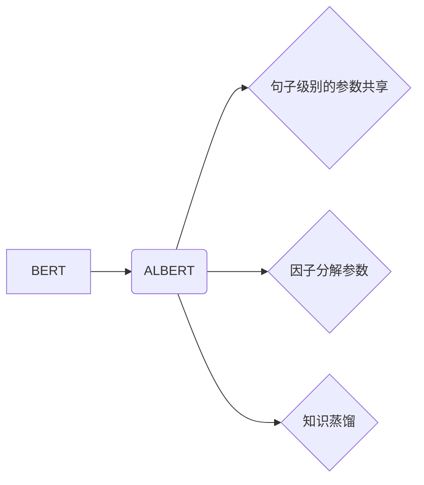

> ALBERT, Transformer, 预训练语言模型, 自然语言处理, 代码生成, 知识蒸馏

## 1. 背景介绍

近年来，深度学习在自然语言处理 (NLP) 领域取得了显著进展，其中 Transformer 架构和基于 Transformer 的预训练语言模型 (PLM) 成为研究热点。BERT、GPT 等模型在各种 NLP 任务上取得了优异的性能，推动了 NLP 技术的快速发展。然而，这些大型语言模型通常需要大量的计算资源和训练数据，难以在资源有限的设备上部署。

ALBERT (A Lite BERT) 是 Google 团队提出的一个轻量级 BERT 模型，旨在解决大型语言模型的资源消耗问题。ALBERT 通过以下策略来压缩模型规模：

* **句子级别的参数共享:** ALBERT 采用句子级别的参数共享，减少了模型参数量。
* **因子分解参数:** ALBERT 将 Transformer 中的某些参数进行因子分解，进一步降低模型参数量。
* **知识蒸馏:** ALBERT 利用知识蒸馏技术，从大型语言模型中学习知识，提高模型性能。

## 2. 核心概念与联系

ALBERT 的核心概念是将 BERT 的 Transformer 架构进行轻量化改造，使其在保持性能的同时，降低模型规模和训练成本。

**ALBERT 与 BERT 的关系:**

## 3. 核心算法原理 & 具体操作步骤

### 3.1  算法原理概述

ALBERT 的核心算法原理是基于 Transformer 架构，并通过句子级别的参数共享、因子分解参数和知识蒸馏等策略进行轻量化改造。

* **句子级别的参数共享:** ALBERT 将每个句子视为一个整体，共享句子级别的 Transformer 层参数，减少了模型参数量。
* **因子分解参数:** ALBERT 将 Transformer 中的某些参数进行因子分解，例如 Multi-Head Attention 的 Query、Key 和 Value 矩阵，将它们分解成多个较小的矩阵，从而降低模型参数量。
* **知识蒸馏:** ALBERT 利用知识蒸馏技术，从大型语言模型中学习知识，提高模型性能。知识蒸馏是指训练一个小型模型 (学生模型) 来模仿大型模型 (教师模型) 的输出。

### 3.2  算法步骤详解

ALBERT 的训练过程可以概括为以下步骤：

1. **预训练:** 使用大量的文本数据对 ALBERT 模型进行预训练，学习语言表示和上下文关系。
2. **微调:** 将预训练好的 ALBERT 模型微调到特定任务，例如文本分类、问答、文本生成等。
3. **知识蒸馏:** 利用知识蒸馏技术，从大型语言模型中学习知识，提高 ALBERT 模型的性能。

### 3.3  算法优缺点

**优点:**

* 模型规模小，训练成本低。
* 在保持性能的同时，降低了模型参数量。
* 可以应用于资源有限的设备上。

**缺点:**

* 相比于大型语言模型，性能可能略逊一筹。

### 3.4  算法应用领域

ALBERT 广泛应用于各种 NLP 任务，例如：

* 文本分类
* 问答
* 文本生成
* 机器翻译
* 语义相似度计算

## 4. 数学模型和公式 & 详细讲解 & 举例说明

### 4.1  数学模型构建

ALBERT 的数学模型构建基于 Transformer 架构，主要包括以下组件：

* **嵌入层:** 将输入的文本单词转换为向量表示。
* **多头注意力层:** 学习文本单词之间的上下文关系。
* **前馈神经网络层:** 对每个单词的嵌入向量进行非线性变换。
* **位置编码层:** 为每个单词添加位置信息。
* **输出层:** 将模型的输出向量转换为最终的预测结果。

### 4.2  公式推导过程

ALBERT 的公式推导过程主要涉及以下几个方面：

* **多头注意力机制:**

$$
Attention(Q, K, V) = softmax(\frac{QK^T}{\sqrt{d_k}})V
$$

其中，Q、K、V 分别代表 Query、Key、Value 矩阵，$d_k$ 代表 Key 的维度。

* **因子分解参数:**

ALBERT 将 Transformer 中的某些参数进行因子分解，例如 Multi-Head Attention 的 Query、Key 和 Value 矩阵，将它们分解成多个较小的矩阵，从而降低模型参数量。

### 4.3  案例分析与讲解

ALBERT 在文本分类任务上的应用案例：

假设我们有一个文本分类任务，需要将文本分类为正类或负类。我们可以使用预训练好的 ALBERT 模型进行微调，将模型的输出层修改为一个二分类器。

在训练过程中，我们使用 labeled 数据对 ALBERT 模型进行微调，优化模型参数，使其能够准确地将文本分类为正类或负类。

## 5. 项目实践：代码实例和详细解释说明

### 5.1  开发环境搭建

ALBERT 的开发环境搭建需要以下软件：

* Python 3.6+
* TensorFlow 2.0+
* PyTorch 1.0+

### 5.2  源代码详细实现

ALBERT 的源代码可以从 HuggingFace 模型库下载：https://huggingface.co/google/albert-base-v2

### 5.3  代码解读与分析

ALBERT 的源代码主要包含以下几个部分：

* **模型定义:** 定义 ALBERT 模型的结构，包括嵌入层、多头注意力层、前馈神经网络层等。
* **训练脚本:** 定义 ALBERT 模型的训练过程，包括数据加载、模型训练、模型评估等。
* **评估脚本:** 定义 ALBERT 模型的评估过程，包括计算模型的准确率、F1 值等指标。

### 5.4  运行结果展示

ALBERT 模型在各种 NLP 任务上的运行结果可以参考 HuggingFace 模型库中的 benchmark 数据。

## 6. 实际应用场景

ALBERT 在实际应用场景中具有广泛的应用前景，例如：

* **搜索引擎:** ALBERT 可以用于搜索引擎的文本理解和排名，提高搜索结果的准确性和相关性。
* **聊天机器人:** ALBERT 可以用于构建更智能的聊天机器人，能够更好地理解用户的意图和需求。
* **文本摘要:** ALBERT 可以用于自动生成文本摘要，提取文本的关键信息。
* **机器翻译:** ALBERT 可以用于机器翻译，提高翻译的准确性和流畅度。

### 6.4  未来应用展望

随着人工智能技术的不断发展，ALBERT 在未来将有更广泛的应用场景，例如：

* **代码生成:** ALBERT 可以用于生成代码，提高软件开发效率。
* **药物研发:** ALBERT 可以用于分析生物医学文献，辅助药物研发。
* **个性化推荐:** ALBERT 可以用于个性化推荐，推荐用户感兴趣的内容。

## 7. 工具和资源推荐

### 7.1  学习资源推荐

* **ALBERT 官方论文:** https://arxiv.org/abs/1909.11942
* **HuggingFace ALBERT 模型库:** https://huggingface.co/google/albert-base-v2
* **TensorFlow 官方文档:** https://www.tensorflow.org/

### 7.2  开发工具推荐

* **Jupyter Notebook:** 用于代码编写和实验。
* **Git:** 用于代码版本控制。
* **TensorBoard:** 用于可视化模型训练过程。

### 7.3  相关论文推荐

* BERT: Pre-training of Deep Bidirectional Transformers for Language Understanding
* GPT-3: Language Models are Few-Shot Learners
* XLNet: Generalized Autoregressive Pretraining for Language Understanding

## 8. 总结：未来发展趋势与挑战

### 8.1  研究成果总结

ALBERT 的提出为轻量化预训练语言模型的研究提供了新的思路，在资源有限的设备上部署大型语言模型提供了新的可能性。

### 8.2  未来发展趋势

未来，轻量化预训练语言模型的研究将继续深入，包括：

* **模型压缩:** 研究更有效的模型压缩技术，进一步降低模型规模和训练成本。
* **高效训练:** 研究高效的训练算法，提高模型训练速度和效率。
* **多模态预训练:** 研究多模态预训练模型，能够处理文本、图像、音频等多种数据类型。

### 8.3  面临的挑战

轻量化预训练语言模型的研究还面临一些挑战，例如：

* **性能提升:** 如何在保持模型规模小的同时，提高模型性能，达到与大型语言模型相媲美的水平。
* **数据效率:** 如何提高模型的数据效率，在更少的训练数据下也能达到良好的性能。
* **可解释性:** 如何提高模型的可解释性，让模型的决策过程更加透明。

### 8.4  研究展望

未来，轻量化预训练语言模型的研究将继续深入，为人工智能技术的普及和应用提供更多可能性。

## 9. 附录：常见问题与解答

**Q1: ALBERT 模型的训练数据是什么？**

A1: ALBERT 模型的训练数据是来自 Google 的公开数据集，包括书籍、文章、网页等多种文本类型。

**Q2: ALBERT 模型的模型参数量是多少？**

A2: ALBERT 模型的模型参数量根据不同的版本而有所不同，例如 ALBERT-base 模型的参数量约为 66M。

**Q3: 如何使用 ALBERT 模型进行文本分类任务？**

A3: 可以使用预训练好的 ALBERT 模型进行微调，将模型的输出层修改为一个二分类器，然后使用 labeled 数据对模型进行训练。

**Q4: ALBERT 模型的开源代码在哪里可以找到？**

A4: ALBERT 模型的开源代码可以从 HuggingFace 模型库下载：https://huggingface.co/google/albert-base-v2

**Q5: ALBERT 模型的性能如何？**

A5: ALBERT 模型在各种 NLP 任务上的性能都表现优异，例如在 GLUE Benchmark 上，ALBERT-base 模型的平均准确率达到 83.4%。

作者：禅与计算机程序设计艺术 / Zen and the Art of Computer Programming 
<end_of_turn>